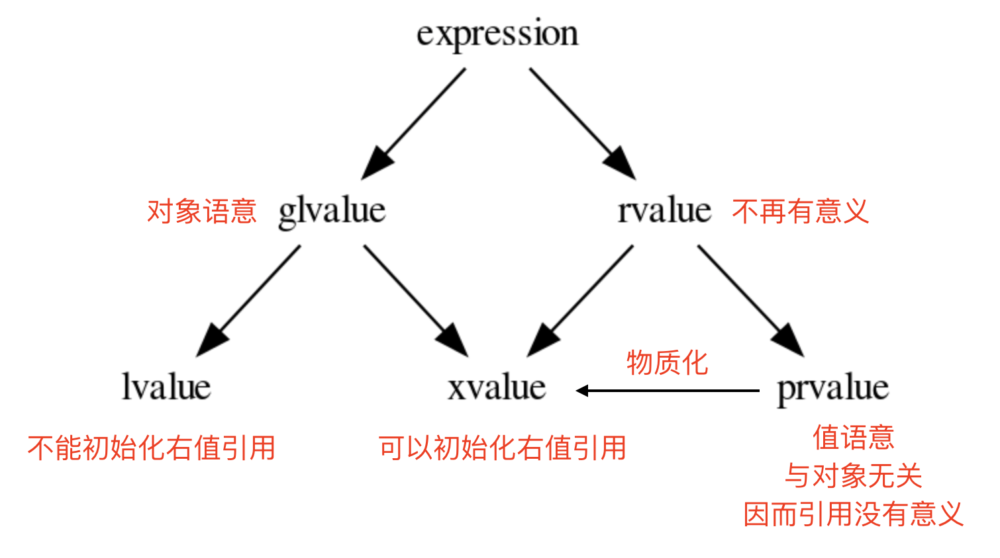
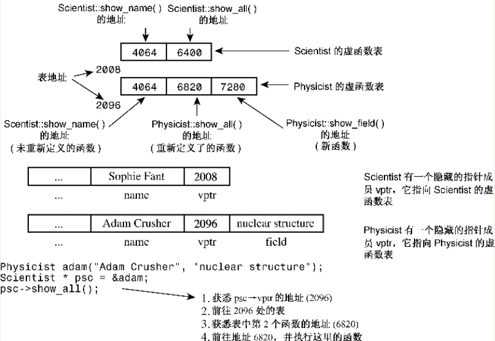
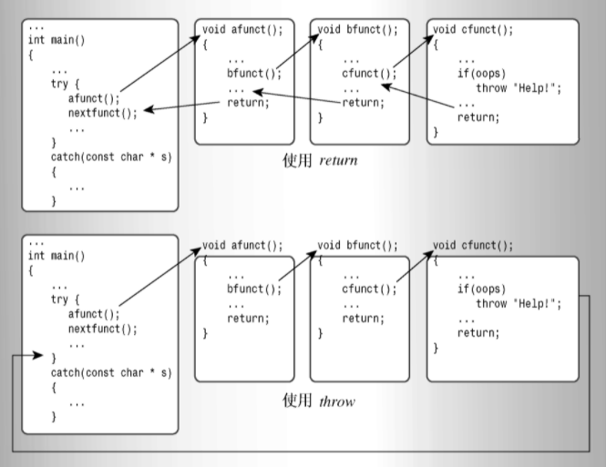

文本文用于整理学习 Cpp 时遇到的疑问和解答，以及一些面试题目，以备查阅。

<!-- More -->


1. C++ 静态库和动态库在链接时有何不同？

   静态库：将可重定位目标文件以一种特定的方式打包成一个单独的文件，并且在链接生成可执行文件时，从这个单独的文件中“拷贝”它自己需要的内容到最终的可执行文件中。

   动态库：动态库和静态库类似，但是它并不在链接时将需要的二进制代码都“拷贝”到可执行文件中，而是仅仅“拷贝”一些重定位和符号表信息，这些信息可以在程序运行时完成真正的链接过程。gcc 编译时默认使用的方式。

   动态库链接可以减少可执行文件的大小，并且动态库发生修改时，只需要修改动态库即可，而静态库链接则需要重新编译所有可执行程序，静态库唯一的优点是代码执行速度较快，因为不需要进行动态加载过程。

2. C++ 中程序必须从 main 函数开始执行吗？

   这是由编译器决定的，实际上可以进行改动，如果使用 GCC 的话，可以通过attribute 关键字声明 constructor 和 destructor（类似 hook 函数）来观察到程序的执行过程。

   gcc中默认main 就是C语言的入口函数，在 main 函数启动之前，内核会调用一个特殊的启动例程，这个启动例程从内核中取得命令行参数值和环境变量值，为调用 main 函数做好准备。

3. main 函数执行完后，还会调用执行其他的语句吗？

   可以通过调用 atexit 函数来登记这些函数，当程序正常终止时，调用指定的函数 **func**。您可以在任何地方注册你的终止函数，但它会在程序终止的时候被调用。

4. Cpp 语言支持的编程范式以及简介？

   C++ 是一种静态类型的、编译式的、通用的、大小写敏感的、不规则的编程语言，支持过程化编程、面向对象编程和泛型编程，是一种中级语言，综合了高级语言和低级语言的特点。

5. 面向对象开发的四大特性？

   + **封装（Encapsulation）**：封装是将数据和方法组合在一起，对外部隐藏实现细节，只公开对外提供的接口。
   + **继承（Inheritance）**：继承是从已有类中派生出新类，新类具有已有类的属性和方法，并且可以扩展或修改这些属性和方法。
   + **多态（Polymorphism）**：多态是指同一种操作作用于不同的对象，可以有不同的解释和实现。
   + **抽象（Abstraction）**：抽象是从具体的实例中提取共同的特征，形成抽象类或接口，以便于代码的复用和扩展。

6. g++ 常用命令选项？

   | 选项         | 解释                                                         |
   | :----------- | :----------------------------------------------------------- |
   | -ansi        | 只支持 ANSI 标准的 C 语法。这一选项将禁止 GNU C 的某些特色， 例如 asm 或 typeof 关键词。 |
   | -c           | 只编译并生成目标文件。                                       |
   | -DMACRO      | 以字符串"1"定义 MACRO 宏。                                   |
   | -DMACRO=DEFN | 以字符串"DEFN"定义 MACRO 宏。                                |
   | -E           | 只运行 C 预编译器。                                          |
   | -g           | 生成调试信息。GNU 调试器可利用该信息。                       |
   | -IDIRECTORY  | 指定额外的头文件搜索路径DIRECTORY。                          |
   | -LDIRECTORY  | 指定额外的函数库搜索路径DIRECTORY。                          |
   | -lLIBRARY    | 连接时搜索指定的函数库LIBRARY。                              |
   | -m486        | 针对 486 进行代码优化。                                      |
   | -o           | FILE 生成指定的输出文件。用在生成可执行文件时。              |
   | -O0          | 不进行优化处理。                                             |
   | -O           | 或 -O1 优化生成代码。                                        |
   | -O2          | 进一步优化。                                                 |
   | -O3          | 比 -O2 更进一步优化，包括 inline 函数。                      |
   | -shared      | 生成共享目标文件。通常用在建立共享库时。                     |
   | -static      | 禁止使用共享连接。                                           |
   | -UMACRO      | 取消对 MACRO 宏的定义。                                      |
   | -w           | 不生成任何警告信息。                                         |
   | -Wall        | 生成所有警告信息。                                           |

7. include 编译指令的作用？

   用于将头文件的内容添加到当前的源代码程序中，这是一种典型的预处理器操作：在源代码被编译之前，替换或添加文本。

8. C++ 标识符起名规则？

   一个标识符以字母 A-Z 或 a-z 或下划线 _ 或美元符 `$` 开始，后跟零个或多个字母、下划线和数字（0-9）和美元符 `$`。注意不能和保留字冲突。

   > 以两个下划线或下划线和大写字母打头的名称被保留给实现（编译器及其使用的资源）使用。以一个下划线开头的名称通常用作类的私有变量。

9. C++ 基本数据类型有哪些？

   bool，char，int，float，double，void，wchar_t（早期实现为 short int）。一些基本类型可以使用一个或多个类型修饰符进行修饰：signed，unsigned，short，long。

10. C++中 "\n" 与 endl 的区别是什么?

    "\n" 表示内容为一个回车符的字符串。std::endl 是流操作子，输出的作用和输出"\n" 类似，但可能略有区别。std::endl 输出一个换行符，并立即刷新缓冲区。对于有输出缓冲的流（例如cout、clog），如果不手动进行缓冲区刷新操作，将在缓冲区满后自动刷新输出。不过对于 cout 来说（相对于文件输出流等），缓冲一般体现得并不明显。但是必要情况下使用 endl 代替 '\n' 一般是个好习惯。对于无缓冲的流（例如标准错误输出流cerr），刷新是不必要的，可以直接使用 '\n'。

11. 位域有何作用？

    通常用在结构体中 `struct data {char a : 4; char b : 4;}`，表示某个变量有几位数据，用于节省内存，当然也可以通过整型和位运算实现相同效果（如 Java）。

12. include 时 `<>` 和 `""` 区别？

    **`<>`** 先去系统目录中找头文件，如果没有在到当前目录下找。**`" "`** 首先在当前目录下寻找，如果找不到，再到系统目录中寻找。这个用于 include 自定义的头文件，让系统优先使用当前目录中定义的。

13. `::` 在 Cpp 中的作用有哪些？

    在 C++ 中表示作用域，和所属关系。 **::** 是运算符中等级最高的，它分为三种：

    1. **作用域符号：**前面一般是类名称，后面一般是该类的成员名称
    2. **全局作用域符号：**当全局变量在局部函数中与其中某个变量重名，那么就可以用 **::** 来区分
    3. **作用域分解运算符：**比如声明了一个类 A，类 A 里声明了一个成员函数 void f()，但没有在类的声明里给出 f 的定义，那么在类外定义 f 时，就要写成 voidA::f()，表示这个 f() 函数是类 A 的成员函数

14. typedef 与 #define 的区别?

    1. 执行时间不同：typedef 在编译阶段有效，由于是在编译阶段，因此 typedef 有类型检查的功能。#define 则是宏定义，发生在预处理阶段，也就是编译之前，它只进行简单而机械的字符串替换，而不进行任何检查。
    2. 功能有差异：typedef 用来定义类型的别名，定义与平台无关的数据类型，\#define 不只是可以为类型取别名，还可以定义常量、变量、编译开关等。
    3. 作用域不同：#define 没有作用域的限制，只要是之前预定义过的宏，在以后的程序中都可以使用。而 typedef 有自己的作用域。

15. typedef 和 using 的区别？

    都用于为类型定义平台无关的别名，便于程序移植，但是：

    + 使用 using 定义别名简单清晰，特别是在定义函数指针时
    + using 在模板环境下更为强大，可以用于用于模板部分具体化，如 `using grid1=grid<1>`，但是 typedef 不行

16. 如何处理变长参数模板？

    可以使用 `sizeof...` 运算符获取变长参数的个数，处理变长参数模板：

    + 递归定义：即定义一个单变量，再定义一个多变量模板
    + 变参展开：可以通过使用 `sizeof...(args) > 0` 来决定是否递归调用
    + 初始化列表展开：`std::initializer_list<T>{lambda, value}` ，不推荐

17. 折叠表达式作用？

    可以使用 `...` 表示剩余的表达式，更方便处理变长参数模板：

    `template<typename T> auto sum(T ... t) { return (t + ...); }`

18. 枚举类型的作用和缺点？

    是 C++ 中的一种派生数据类型，它是由用户定义的若干枚举常量的集合，默认从 0 开始，因此其枚举量实际上是整型变量，存在风险。可以考虑使用 enum class 替代，作用域内枚举不能隐式转换为整形数据，更加安全。

19. C++ 中有哪些类型转换？

    可以使用 c 风格的转换，即 `type (expr)` ，但是 cpp 推荐以下几种方式转换：

    + 静态转换（Static Cast）：用于基本数据类型之间的转换，用于类层次结构中基类和子类之间指针或引用的转换，只会在编译时检查，不进行任何运行时类型检查。
    + 动态转换（Dynamic Cast）：用于将一个基类指针或引用转换为派生类指针或引用。动态转换在运行时进行类型检查，如果不能进行转换则返回空指针或者异常。
    + 常量转换（Const Cast）：用于将 const 类型的对象转换为非 const 类型的对象，只能用于转换掉 const 属性，不能改变对象的类型。
    + 重新解释转换（Reinterpret Cast）：将一个数据类型的值重新解释为另一个数据类型的值，通常用于在不同的数据类型之间进行转换，不进行任何类型检查。**最不安全**

20. C++ 中的变量声明作用？

    变量声明向编译器保证变量以给定的类型和名称存在，这样编译器在不需要知道变量完整细节的情况下也能继续进一步的编译。变量声明只在编译时有它的意义，在程序连接时编译器需要实际的变量声明和定义。可以使用 extern 来进行声明，声明是不会为变量开辟内存空间的。

21. 如何理解 C++ 中的对象和值两个概念？

    + **值** 是一个纯粹的数学抽象概念，比如数字 `10` ，或者字符 `'a'` , 或者布尔值 `false` ，等等。它们完全不需要依赖于计算机或者内存而存在，就只是一个纯粹的值：不需要存储到内存，当然也就不可修改。那么 `1+2` 呢？这是一个表达式，但这个表达式的求值结果也是一个 **值** 。因而，这是一个值类别的表达式 。
    + **对象** 是一个在内存中占据了一定空间的有类型的东西。因而，它必然是与计算机内存这个物理上具体存在的设备关联在一起的一个物质。因而，每一个对象都必然有一个 **标识** （ Identifier ），从而你可以知道这个对象在内存中唯一的起始位置。

    区分 **对象** 和 **值** 的方法非常简单：是否有 **标识** ，或可否被 **引用** （毕竟引用就是一种标识）。

22. 值和对象的关系是怎样的？

    很简单， **值** 用来初始化 **对象** 。比如： `bool b = true` , 其语意是：用值 `true` 初始化对象 `b` ；**对象** 表示内存中的一段有类型的空间， **值** 这则是个空间里的内容。 用 **值** 来初始化 **对象** 的过程， 是一个将值加载到空间的隐喻。

23. 纯右值如何理解，其作用是什么？

    所有的 **值** 语意的表达式，都归类为 **纯右值** ，在 C++11 之前，它们被称做 **右值** 。其存在的唯一的目的，是为了初始化 **对象** 。单独写一个 **纯右值** 表达式的语句，比如： `1+2;` ，或者 `true && (1 == 2);` ，这样的 表达式被称做 `弃值表达式` 。从语意上，它们仍然会初始化一个临时对象，而临时对象也是泛左值。

24. 泛左值如何理解？

    与 **纯右值** 对应的是 **泛左值** （ glvalue ）。整个表达式的世界被分为这两大类别。前者全部是 **值** 语意，后者全部是 **对象** 语意。泛左值分为：

    + 左值：任何可以对其通过符号 `&` 取地址的表达式，都属于 **左值** 。因而，任何变量（包括常量），无论是全局的，还是类成员的，还是函数参数，还是函数名字，都肯定属于左值。所有返回值是左值引用的函数调用表达式（包括用户自定义的重载操作符），以及 `static_cast<T&>(expr)` 都必然也属于左值。毕竟，没有内存中的对象，哪里来的引用？最为特殊的是字符串字面常量，比如： `"abcd"` ，这是一个左值对象。这有点违背直觉，但由于 C/C++ 中字符串并不是一个 builtin 基本类型。这些字符串字面常量都会在内存中得以存储。
    + 速亡值：速亡值是所有返回类型为 **右值引用** 的非左值表达式。 这包括返回值类型为 **右值引用** 的函数调用表达式，`static_cast<T&&>(expr)` 表达式。其所引用的对象，从理论上同样也是可以取其地址的。其目的是为了初始化类型为 **右值引用** 类型的变量。借此，也可以匹配参数类型为右值引用的函数。 一旦允许取其地址，程序的其它部分将无从判断，一个地址来自于速亡值对象，还是来自于左值对象，从而让速亡值的存在失去了本来的意义。 因而，对其取地址操作被强行禁止。

25. `Foo foo = Foo{10}` 在 C++ 17 前后有何不同？

    在 C++17 前，`Foo{10}` 表达的是一个临时对象，那么 `copy/move` 语意也就变得不可避免，尽管其可能会被编译器给优化掉；

    在 C++ 17 后，对于类似于 `Foo{10}` 表达式的语意进行了重新定义， 它们不再是一个 **对象** 语意，而只是一个 **值** 。即 `Foo{10}` 与内存临时对象再无任何关系，它就是一个 **值** ： 其估值结果，是对构造函数 `Foo(int)` 进行调用所产生的 **值** 。而这个 **值** ，通过等号表达式，赋值给左边的 **对象** 。从语义上，不再有对象间的 `copy/move` ，而是直接将构造函数调用表达式作用于等号左边的 **对象** ， 从而完成用 **值** 初始化 **对象** 的过程。因而， `Foo foo = Foo{10}` ，与 `Foo foo{10}` ， 在 C++17 之后，从语意上（而不是编译器优化上）完全等价。

26. 什么是纯右值物质化？`Foo&& foo = Foo{10}` 表达了什么语意？

    按照我们之前的讨论，等号右边是一个 **值** ， 而左边是一个对于对象的 **引用** 。而 **引用** 只能引用一个对象，引用一个 **值** 是逻辑上是讲不通的。这中间隐含着一个过程： **纯右值物质化** 。即将一个 **纯右值** ， 赋值给一个 **临时对象** ，即 **速亡值** 。然后再将等号左边的 **引用** 绑定到这个 **速亡值** 对象上。

    

27. 关于 C++ 中的值，需要注意哪些？

    - 所有的表达式都可以归类为 **纯右值** 和 **泛左值** ；
    - 所有的 **纯右值** 都是 **值** 的概念；所有的 **泛左值** 都是 **对象** 的概念；
    - **左值** 可以求地址，**速亡值** 不可以求地址；
    - **纯右值** 在需要临时对象存在的场景下，会通过 **物质化** ，转化成 **速亡值** 。
    - **泛左值** 可以是抽象类型和不完备类型，可以进行多态调用；**纯右值** 只能是具体类型，无法进行多态调用。
    - 用 **纯右值** 构造一个 **左值** 对象时，是 **直接构造** 语意； 用 **速亡值** 构造一个 **左值** 对象时，是 **拷贝/移动构造** 语意。

28. C++ 中的左值（Lvalues）和右值（Rvalues）？

    + **左值（lvalue）：**指向内存位置的表达式被称为左值（lvalue）表达式，**任何可以取地址的表达式**，都是左值。左值可以出现在赋值号的左边或右边。
    + **右值（rvalue）：**术语右值（rvalue）指的是存储在内存中某些地址的数值。右值是不能对其进行赋值的表达式，也就是说，右值可以出现在赋值号的右边，但不能出现在赋值号的左边。

29. 已经有了左值引用，为什么还需要右值引用，右值引用有何作用？

    右值引用主要是为了解决 STL 模板有些实现存在的效率问题，通过右值引用我们可以将其绑定到一个将亡值，便可以节省一次复制的开销。可以使用 std::move 实现强制的右值转换。

30. 右值是否可以匹配到左值引用类型参数？

    +  一个右值，就可以被类型为 `const T&` 类型的参数匹配；
    + 但一个右值，不能被 `T&` 类型的参数匹配；修改一个调用后即消失的 **临时对象** 上，没有任何意义，反而会导致程序员犯下潜在的错误，因而还是禁止了最好。

31. 使用右值类型变量有什么需要注意的？

    1. 对于任何类型为 **右值引用** 的变量（当然也包括函数参数），只能由 **右值** 来初始化；**右值** 包括 **纯右值** 和 **速亡值** ，其中 **速亡值** 的类型是 **右值引用** ；
    2. 一旦初始化完成， **右值引用** 类型的变量，其性质与一个 **左值引用** 再也没有任何差别。类型为 **右值引用** 的变量，是一个 **左值** ，因而不能赋值给其它类型为 **右值引用** 的变量， 当然也不能匹配参数类型为 **右值引用** 的函数。

32. 将亡值是什么？

    将亡值是在 C++ 11 中跟右值引用相关的表达式，这种表达式通常是被移动的对象（移为他用），比如返回右值引用 T&& 的函数返回值，std::move 的返回值，或者转换为 T& &的类型转换函数的返回值。

33. 如何理解移动（move）语义？

    传统 C++ 通过拷贝构造函数和赋值操作符为类对象设计了拷贝/复制的概念，但为了实现对资源的移动操作， 调用者必须使用先复制、再析构的方式，否则就需要自己实现移动对象的接口。 试想，搬家的时候是把家里的东西直接搬到新家去，而不是将所有东西复制一份（重买）再放到新家、 再把原来的东西全部扔掉（销毁），这是非常反人类的一件事情。

    传统的 C++ 没有区分『移动』和『拷贝』的概念，造成了大量的数据拷贝，浪费时间和空间。 右值引用的出现恰好就解决了这两个概念的混淆问题。

34. 模板函数中的使用 `T&&` 一定能匹配到右值引用吗？

    不一定，在传统 C++ 中，我们不能够对一个引用类型继续进行引用， 但 C++ 由于右值引用的出现而放宽了这一做法，从而产生了引用坍缩规则，允许我们对引用进行引用， 既能左引用，又能右引用。但是却遵循如下规则：

    | 函数形参类型 | 实参参数类型 | 推导后函数形参类型 |
    | :----------- | :----------- | :----------------- |
    | T&           | 左引用       | T&                 |
    | T&           | 右引用       | T&                 |
    | T&&          | 左引用       | T&                 |
    | T&&          | 右引用       | T&&                |

    **无论模板参数是什么类型的引用，当且仅当实参类型和形参类型为右引用时，模板参数才能被推导为右引用类型**。

35. 完美转发是什么意思？

    所谓完美转发，就是为了让我们在传递参数的时候， 保持原来的参数类型（左引用保持左引用，右引用保持右引用）。 为了解决这个问题，我们应该使用 `std::forward` 来进行参数的转发（传递），其内部实现和 `static_cast<T&&>(v)` 相同。

36. 变量类型间的自动转换规则？

    1. 若参与运算量的类型不同，则先转换成同一类型，然后进行运算。
    2. 转换按数据长度增加的方向进行，以保证精度不降低。
    3. 若两种类型的字节数相同，且一种有符号，一种无符号，**则转换成无符号类型**。
    4. 所有的浮点运算都是以双精度进行的，即使仅含 float 单精度量运算的表达式，也要先转换成 double 型，再作运算
    5. char 型和 short 型参与运算时，必须先转换成 int 型
    6. 在赋值运算中，赋值号两边量的数据类型不同时，赋值号右边量的类型将转换为左边量的类型。此时可能会产生截断

37. C++ 全局变量、局部变量、静态全局变量、静态局部变量的区别？

    + 全局变量具有全局作用域。全局变量只需在一个源文件中定义，就可以作用于所有的源文件。
    + 静态局部变量具有局部作用域，它只被初始化一次，自从第一次被初始化直到程序运行结束都一直存在，它和全局变量的区别在于全局变量对所有的函数都是可见的，而静态局部变量只对定义自己的函数体始终可见。
    + 局部变量也只有局部作用域，它是自动对象（auto），它在程序运行期间不是一直存在，而是只在函数执行期间存在，函数的一次调用执行结束后，变量被撤销，其所占用的内存也被收回。
    + 静态全局变量也具有全局作用域，它与全局变量的区别在于如果程序包含多个文件的话，它作用于定义它的文件里，不能作用到其它文件里，即被 static 关键字修饰过的变量具有**文件作用域**。

38. 宏定义 #define 和常量 const 的区别？

    1. 类型和安全检查不同：宏定义是字符替换，没有数据类型的区别；const 常量是常量的声明，有类型区别，需要在编译阶段进行类型检查
    2. 编译器处理不同：宏定义是一个"编译时"概念，在预处理阶段展开；const 常量是一个"运行时"概念，在程序运行使用，类似于一个只读行数据
    3. 存储方式不同：宏定义是直接替换，不会分配内存，存储于程序的代码段中；const常量需要进行内存分配，存储于程序的数据段中
    4. 定义后能否取消：宏定义可以通过#undef来使之前的宏定义失效，const常量定义后将在定义域内永久有效
    5. 是否可以做函数参数：宏定义不能作为参数传递给函数；const 常量可以在函数的参数列表中出现

39. const 关键字在修饰指针时，有哪几种形式，分别有什么效果？

    1. const 关键字出现在 ***** 的左边：指针指向的内容不能被修改。
    2. const 关键字出现在 ***** 的右边：指针本身不能被修改。
    3. const 关键字出现在 ***** 的两边：指针指向的内容和指针本身都不能被修改。

    > 指针指向的内容并非不可修改，只是无法通过该指针进行修改，可以通过赋值等方法改变其指向的内容

40. C++ 中的类型限定符？

    | 限定符   | 含义                                                         |
    | :------- | :----------------------------------------------------------- |
    | const    | **const** 定义常量，表示该变量的值不能被修改。               |
    | volatile | 修饰符 **volatile** 告诉该变量的值可能会被程序以外的因素改变，如硬件或其他线程，每次读取必定从内存中进行读取。 |
    | mutable  | 表示类中的成员变量可以在 const 成员函数中被修改。            |
    | static   | 用于定义静态变量，表示该变量的作用域仅限于当前文件或当前函数内，不会被其他文件或函数访问。 |
    | register | 用于定义寄存器变量，表示该变量被频繁使用，可以存储在CPU的寄存器中，以提高程序的运行效率，但是实际上是否会存储在寄存器中由编译器决定 |

41. C++ 存储数据的方案有哪些？

    + 自动存储：在函数定义中声明的变量（包括函数参数）的存储持续性为自动的。它们在程序开始执行其所属的函数或代码块时被创建，在执行完函数或代码块时，它们使用的内存被释放。
    + 静态存储：在函数定义外定义的变量和使用关键字 static 定义的变量的存储持续性都为静态。它们在程序整个运行过程中都存在。
    + 线程存储：如果变量是使用关键字thread_local声明的，则其生命周期与所属的线程一样长。
    + 动态存储：用new运算符分配的内存将一直存在，直到使用delete运算符将其释放或程序结束为止。这种内存的存储持续性为动态，有时被称为自由存储（free store）或堆（heap）。

42. 函数指针 pf 如何进行方法调用？

    通过 `pf()` 或者 `(*pf)()` 都可以，一种学派认为，由于pf 是函数指针，而`*pf`是函数，因此应将`(*pf)()`用作函数调用。另一种学派认为，由于函数名是指向该函数的指针，指向函数的指针的行为应与函数名相似，因此应将`pf( )`用作函数调用使用。C++进行了折衷。

43. explict 关键字的作用？

    C++ 中， 一个参数的构造函数(或者除了第一个参数外其余参数都有默认值的多参构造函数)， 承担了两个角色： 构造器，隐含的类型转换操作符（A = xxx）。C++ 提供了关键字 explicit，可以阻止不应该允许的经过转换构造函数进行的隐式转换的发生。另外，也可以作用在转换函数上，防止隐式调用转换函数。

44. thread_local 作用？

    使用 thread_local 说明符声明的变量仅可在它在其上创建的线程上访问。 变量在创建线程时创建，并在销毁线程时销毁。 每个线程都有其自己的变量副本。可以将 thread_local 仅应用于数据声明和定义，thread_local 不能用于函数声明或定义。

45. 算术运算符 ++d 和 d++ 的区别？

    + **++d** 是**先加**，先对 d 的值加 1，再使用 d 的值执行该行命令。
    + **d++** 是**后加**，先使用 d 的值执行该行命令，执行完后再对 d 的值加 1。

46. C++ 中向函数传参的方式有哪些？

    + 传值调用：该方法把参数的实际值赋值给函数的形式参数。在这种情况下，修改函数内的形式参数对实际参数没有影响。
    + 指针调用：该方法把参数的地址赋值给形式参数。在函数内，该地址用于访问调用中要用到的实际参数。这意味着，修改形式参数会影响实际参数。
    + 引用调用：该方法把参数的引用赋值给形式参数。在函数内，该引用用于访问调用中要用到的实际参数。这意味着，修改形式参数会影响实际参数。

    > 实际上，C++ 使用**传值调用**来传递参数，在编译器实现上，引用传递可以当作匿名指针看待

47. Lambda 函数基本格式是怎样的，捕获列表语法规则？

    捕获列表语法规则如下：

    ```cpp
    [capture] (parameters) mutable -> return-type {body}
    []      // 沒有定义任何变量。使用未定义变量会引发错误。
    [x, &y] // x以传值方式传入（默认），y以引用方式传入。
    [&]     // 任何被使用到的外部变量都隐式地以引用方式加以引用。
    [=]     // 任何被使用到的外部变量都隐式地以传值方式加以引用。
    [&, x]  // x显式地以传值方式加以引用。其余变量以引用方式加以引用。
    [=, &z] // z显式地以引用方式加以引用。其余变量以传值方式加以引用。
    [status=std::move(res_status)] // 表达式捕获，允许对右值进行捕获
    ```

    > 对于 [=] 或 [&] 的形式，lambda 表达式可以直接使用 this 指针

48. 如何使用 rand() 函数产生均匀的 [range_min, range_max) 随机数？

    + rand() % (range_max - range_min) + range_min
    + rand() * 1.0 / (RAND_MAX + 1) * (range_max - range_min) + range_min

    > 第二种方法更为准确，也可以使用 cpp 提供的 random 库提供随机数

49. C++ 中字符串的表示形式有哪些？

    1. C 语言风格的字符串，使用 const char * str = "";
    2. C++ 自带的 string 库，提供了更多的方法支持
    3. C++ 提供了原始字符串，使用 R"()" 开头，可自定义分隔符

    > C++ 还提供了字符串前缀，如 L，u，U，u8 分别表示 wchar_t，char16_t，char32_t，char，对应的字符串是 wstring, u16string, u32string, string

50. C++ 指针是什么，如何进行空指针赋值？

    **指针**是一个变量，其值为另一个变量的地址，可以使用 NULL 或者 nullptr 来进行空指针赋值，推荐使用 nullptr 进行复制，因为 NULL 可能产生重载二义性问题。

51. 指针的算术运算意义？

    实际上进行了重载，+1 表示指针指向的地址进行 sizeof(*p) 的偏移，而非加 1。

52. nullptr 为什么被引入 C++？

    传统 C++ 可能将 NULL 定义为 `void *`，并且规定了 **不允许 **直接将 `void *` 隐式转换到其他类型，但是这样的语句却是合理的：`char *ch = NULL`；

    因此只能将 NULL 定义成 0L，但是这样又会带来重载的问题，即 `foo(NULL)` 将优先匹配 `foo(long/int)` 而不是 `foo(void *)`。

    为了解决这个问题，C++11 引入了 `nullptr` 关键字，专门用来区分空指针、`0`。并且其能够隐式的转换为任何指针或成员指针的类型。

53. 指针数组和数组指针的区别和定义？

    + int *ptr[3]：指针数组，[] 运算优先级高于 *
    + int (*ptr)[3]：数组指针，ptr 指向类型是 int[3]

54. C++ 支持在函数外返回局部变量的地址吗？

    C++ 不支持在函数外返回局部变量的地址，除非定义局部变量为 static变量。

55. C++ 引用是什么，和指针有什么区别？

    引用变量是一个**别名**，也就是说，它是某个已存在变量的另一个名字。和指针区别：

    - 不存在空引用。引用必须连接到一块合法的内存。
    - 一旦引用被初始化为一个对象，就不能被指向到另一个对象。指针可以在任何时候指向到另一个对象。
    - 引用必须在创建时被初始化。指针可以在任何时间被初始化。

56. C++ 引用有哪些特点？

    1. 引用是对象的别名，对于引用的一切操作都是对对象的操作；
    2. 引用自身从概念上没有大小（或者就是对象的大小）；**但引用在传递或需要存储时，其传递或存储的大小为地址的大小**。
    3. 引用必须初始化；
    4. 引用不可能重新绑定；
    5. 将指针所指向的对象绑定到一个引用时，需要确保指针非空。
    6. 任何引用类型的变量，都是左值。

57. 引用作为函数返回值有哪些优点和局限？

    优点是在内存中不产生被返回值的副本，局限如下：

    + 不能返回局部变量的引用。主要原因是局部变量会在函数返回后被销毁，因此被返回的引用就成为了"无所指"的引用，程序会进入未知状态。
    + 不能返回函数内部new分配的内存的引用。虽然不存在局部变量的被动销毁问题，可对于这种情况（返回函数内部new分配内存的引用），又面临其它尴尬局面。例如，被函数返回的引用只是作为一 个临时变量出现，而没有被赋予一个实际的变量，那么这个引用所指向的空间（由new分配）就无法释放，造成memory leak。
    + 可以返回类成员的引用，但最好是const。主要原因是当对象的属性是与某种业务规则（business rule）相关联的时候，其赋值常常与某些其它属性或者对象的状态有关，因此有必要将赋值操作封装在一个业务规则当中。如果其它对象可以获得该属性的非常 量引用（或指针），那么对该属性的单纯赋值就会破坏业务规则的完整性。

58. C++ 获取当前日期和时间的方法有哪些？

    其继承了 C 语言中处理时间的方法，主要通过 ctime 库提供，可以通过 strftime 或者 snprintf 进行格式化输出。

59. C++ 类中有哪些特殊的函数？

    默认构造函数、复制构造函数、复制赋值运算符和析构函数，C++11 新增移动构造函数和移动赋值运算符函数。

60. C++ 类和结构体的区别？

    + class 中默认的成员访问权限是 private 的，而 struct 中则是 public 的。
    + 从 class 继承默认是 private 继承，而从 struct 继承默认是 public 继承。
    + class 可以定义模板，而 struct 不可以。

61. inline 与宏定义的关系？

    C 语言使用预处理器语句 #define 来提供宏——内联代码的原始实现，但是需要注意其仅仅是完成文本替换，可能存在问题如 `SQUARE(i++)`，inline 则具有返回值检查等功能。

62. 成员函数定义在类定义内部或者外部有什么区别？

    在类定义中定义的成员函数把函数声明为**内联**的，即便没有使用 inline 标识符。inline 作用是消除函数调用过程，提高运行速度，适用于函数体较小的成员函数。

63. C++ 类访问修饰符有哪些？

    + public：**公有**成员在程序中类的外部是可访问的。
    + private：**私有**成员变量或函数在类的外部是不可访问的，甚至是不可查看的。只有类和友元函数可以访问私有成员。
    + protected：与私有成员十分相似，但有一点不同，protected（受保护）成员在派生类（即子类）中是可访问的。

64. C++ 类的三种继承方式有什么不同？

    | 继承方式      | 基类的public成员  | 基类的protected成员 | 基类的private成员 | 继承引起的访问控制关系变化概括         |
    | :------------ | :---------------- | :------------------ | :---------------- | :------------------------------------- |
    | public继承    | 仍为public成员    | 仍为protected成员   | 不可见            | 基类的非私有成员在子类的访问属性不变   |
    | protected继承 | 变为protected成员 | 变为protected成员   | 不可见            | 基类的非私有成员都为子类的保护成员     |
    | private继承   | 变为private成员   | 变为private成员     | 不可见            | 基类中的非私有成员都称为子类的私有成员 |

65. C++ 类构造函数和析构函数的作用？

    类的**构造函数**是类的一种特殊的成员函数，它会在每次创建类的新对象时执行，用于执行一些初始化的工作；类的**析构函数**是类的一种特殊的成员函数，它会在每次删除所创建的对象时执行，用于清理资源。

    构造函数可以存在多个，但是析构函数只能存在一个。

66. 为什么基类的析构函数一定是 virtual 声明的？

    为了防止内存泄漏。 具体地说，如果派生类中申请了内存空间，并在其析构函数中对这些内存空间进行释放。 假设基类中采用的是非虚析构函数，当删除基类指针指向的派生类对象时就不会触发动态绑定，因而只会调用基类的析构函数，而不会调用派生类的析构函数。

67. C++ 为成员变量初始化的方式？

    + 声明时初始化：C++11 开始支持
    + 构造函数初始化
    + 列表初始化：和书写顺序无关，按照**成员声明顺序进行初始化**的

68. C++ 初始化列表有什么优点？

    C++11 将使用大括号的初始化称为初始化列表（list-initialization），因为这种初始化常用于给复杂的数据类型提供值列表。它对类型转换的要求更严格。具体地说，列表初始化不允许缩窄（narrowing），即变量的类型可能无法表示赋给它的值。

69. 结构化绑定有何作用？

    配合 std::pair，std::tuple，以及使用 auto 类型推导，可以方便获取元组里面的每个变量：`auto& [a, b] = student_pair`。

70. 列表初始化和 std::initializer_list 关系？

    如果类有接受 initializer_list 作为参数的构造函数，则列表初始化语法就只能用于该构造函数。

71. 拷贝构造函数的作用？

    是一种特殊的构造函数，它在创建对象时，是使用同一类中之前创建的对象来初始化新创建的对象。通常用于：

    + 通过使用另一个同类型的对象来初始化新创建的对象。
    + 复制对象，把它作为参数传递给函数。
    + 复制对象，并从函数返回这个对象。

72. 为什么拷贝构造函数传递的是引用，而不是值？

    如果传入的是值，将会引起无限递归调用。

73. 关于为什么当类成员中含有指针类型成员且需要对其分配内存时，一定要定义拷贝构造函数？

    默认的拷贝构造函数实现的只能是浅拷贝，即直接将原对象的数据成员值依次复制给新对象中对应的数据成员，并没有为新对象另外分配内存资源。这样，如果对象的数据成员是指针，两个指针对象实际上指向的是同一块内存空间。就可能会导致释放相同空间两次而产生问题。

74. 如何防止默认拷贝发生？

    **声明一个私有的拷贝构造函数**，这样因为拷贝构造函数是私有的，如果用户试图按值传递或函数返回该类的对象，编译器会报告错误，从而可以避免按值传递或返回对象。或者使用 `=delete` 来显式说明。

75. 友元函数/类有何作用？

    类的友元函数是定义在类外部，但有权访问类的所有私有（private）成员和保护（protected）成员。尽管友元函数的原型有在类的定义中出现过，但是友元函数并不是成员函数。

76. this 指针指代的是什么，当调用成员函数的时候，this 如何传入的？

    this 指向的是调用成员函数的对象，当调用成员函数的时候，this 被当作第一个参数进行传入，从而达到在函数中使用的目的，另外，this 可以当作是一个 const 指针。

    > 静态成员函数第一个参数则不是 this 指针，其属于类层次的

77. C++ 中的静态成员变量和函数与普通的成员变量和函数有何不同？

    当我们声明类的成员为静态时，这意味着无论创建多少个类的对象，静态成员都只有一个副本。静态成员可以看作是类成员。

78. 派生类不继承基类中的哪些方法？

    - 基类的构造函数、析构函数和拷贝构造函数。
    - 基类的重载运算符。
    - 基类的友元函数。

79. 派生类在继承基类的成员变量时，是如何实现的？

    派生类在继承基类的成员变量时，会单独开辟一块内存保存基类的成员变量，因此派生类自己的成员变量即使和基类的成员变量重名，但是也不会引起冲突。

80. 若存在环状继承时，需要如何处理？

    可以通过虚拟继承方式实现，如下：

    ```cpp
    class D{......};
    class B: virtual public D{......};
    class A: virtual public D{......};
    class C: public B, public A{.....};
    ```

81. 重载运算符时，其被当作成员函数和非成员函数在参数上有何不同？

    当作成员函数时，默认的第一个参数是 this 指针，非成员函数时则需要显式定义该参数。常见的运算符重载技巧：

    + 重载前缀 ++ 和后缀 ++ 是不同的，重载后缀需要额外增加一个 int 参数
    + 重载加法时，如果两个对象类型不同（如 A 和 int），则需要额外定义一个友元函数来保证加法的交换律
    + 输入输出运算符重载时，最好定义为友元函数，同时返回对应的输入输出的引用
    + 重载函数调用运算符时，可以将其当作是函数对象使用，可以重载接收任意参数
    + 还可以定义 new，delete 等空间申请和释放操作符

82. 如何进行自定义字面量？

    重载双引号后缀运算符实现：

    ```cpp
    std::string operator"" _wow1(const char *wow1, size_t len) {
        return std::string(wow1)+"woooooooooow, amazing";
    }
    std::string operator"" _wow2 (unsigned long long i) {
        return std::to_string(i)+"woooooooooow, amazing";
    }
    ```

83. 哪些运算符不能进行重载？

    - .：成员运算符。
    - . *：成员指针运算符。
    - ::：作用域解析运算符。
    - ?:：条件运算符。
    - sizeof：sizeof运算符。
    - typeid：一个RTTI运算符。
    - const_cast：强制类型转换运算符。
    - dynamic_cast：强制类型转换运算符。
    - reinterpret_cast：强制类型转换运算符。
    - static_cast：强制类型转换运算符。

84. typeid 的作用是什么？

    typeid 运算符使得能够确定两个对象是否为同种类型，可以接受两种参数，类名和结果为对象的表达式，其返回值是 type_info 类对象，其重载了 `==`。

85. 如何为对象声明 << 重载符号以输出对象内容？

    `ostream& operator<<(ostream& out, Type a)` 可以实现重载。

86. 转换函数如何定义？

    `operator type_name()`，可以实现类的转换。

87. 多态的实现？

    **虚函数** 是在基类中使用关键字 **virtual** 声明的函数。在派生类中重新定义基类中定义的虚函数时，会告诉编译器不要静态链接到该函数。在程序中任意点可以根据所调用的对象类型来选择调用的函数，这种操作被称为**动态链接**，或**后期绑定**。也可以通过`virtual void fun() = 0` 来定义纯虚函数，注意含有纯虚函数的对象不可被实例化，其为抽象类。

    每个含有虚函数的类都有各自的一张虚函数表 **VTABLE**。每个派生类的VTABLE继承了它各个基类的VTABLE，如果基类VTABLE中包含某一项（虚函数的入口地址），则其派生类的VTABLE中也将包含同样的一项，但是两项的值可能不同。如果派生类中重载了该项对应的虚函数，则派生类VTABLE的该项指向重载后的虚函数，如果派生类中没有对该项对应的虚函数进行重新定义，则使用基类的这个虚函数地址。

    在创建含有虚函数的类的对象的时候，编译器会在每个对象的内存布局中增加一个vptr指针项，该指针指向本类的VTABLE。在通过指向基类对象的指针（设为bp）调用一个虚函数时，编译器生成的代码是先获取所指对象的vtb1指针，然后调用vtb1所指向类的VTABLE中的对应项（具体虚函数的入口地址）。

    > C++中**, 虚函数**可以为private, 并且可以被子类覆盖（因为虚函数表的传递），但子类不能调用父类的private虚函数。虚函数的重载性和它声明的权限无关。

    

88. 类对象大小是如何计算的？

    类对象所占内存大小是由成员变量（静态变量除外），虚函数指针，虚基类指针以及基类成员大小决定的，成员函数是不计算在内的，成员函数可以被所有的类对象共享。需要注意：

    + 空类大小为 1 而不是 0
    + 需要注意内存对齐问题
    + 静态变量不计入对象大小中

89. 继承时如何显式对基类对象进行初始化？

    使用初始化列表：`derived(x, y, z) : base(x, y)`进行初始化即可。

90. final 关键字有何作用？

    + 应用在虚函数上，表示不再允许虚函数被子类重写
    + 应用在类上，表示不允许类被继承

91. C++ 是如何进行异常处理的？

    主要通过 `try catch throw` 实现，所有的异常继承自 std::exception，其中包含了一个 virtual 方法 what，派生类可以重写该方法来自定义异常产生的原因。

92. 什么时栈解退？

    假设函数由于出现异常（而不是由于返回）而终止，则程序也将释放栈中的内存，但不会在释放栈的第一个返回地址后停止，而是继续释放栈，直到找到一个位于try块（参见图15.3）中的返回地址。随后，控制权将转到块尾的异常处理程序，而不是函数调用后面的第一条语句。这个过程被称为栈解退。引发机制的一个非常重要的特性是，和函数返回一样，**对于栈中的自动类对象，类的析构函数将被调用**。

    

93. noexcept 作用？

    C++11 后，给函数增加 noexcept 表示不会发生异常，否则表示可能会发生任意的异常。在 C++ 以前版本，也有通过 throw(E1, E2) 的方式来声明，但是现在很少使用。

94. new 和 malloc 内部的实现方式有什么区别？

    new 的功能是在堆区新建一个对象，并返回该对象的指针。所谓的**【新建对象】**的意思就是，将调用该类的构造函数，因为如果不构造的话，就不能称之为一个对象。而 malloc 只是机械的分配一块内存，如果用 mallco 在堆区创建一个对象的话，是不会调用构造函数的。

95. new 和 replacement new 操作符的区别？

    通常，new 负责在堆（heap）中找到一个足以能够满足要求的内存块，定位 new运算符让您能够指定要使用的内存位置，可以将其与初始化结合使用。

96. delete 与 delete[] 区别？

    针对简单类型，使用 new 分配后的不管是数组还是非数组形式内存空间用两种方式均可；但是使用类对象数组，则只能通过 delete[] 来进行释放，否则的话只会释放对象数组的第一个指针指向的内存。

97. override 作用是什么？

    在 C++11 中，可使用说明符 override 指出您要覆盖一个虚函数：将其放在参数列表后面。如果声明与基类方法不匹配，编译器将视为错误。

98. C++ 命名空间作用？

    可作为附加信息来区分不同库中相同名称的函数、类、变量等。使用了命名空间即定义了上下文。本质上，命名空间就是定义了一个范围。通常，使用在已命名的名称空间中声明的变量，而不是使用外部全局变量和静态全局变量。

99. C++ 中 typename 和 class 的区别？

    最初使用 class 在模板中定义类型，为了避免混淆，引入了 typename 关键词，在模板定义语法中关键字 class 与 typename 的作用完全一样。但是 typename 另外一个作用为：使用嵌套依赖类型(nested depended name)，如下所示：`typedef typename T::LengthType LengthType;` 。

100. 模板中的非类型参数的作用？

     `template <typename T, int max_size>`：其中的 max_size 便是非类型参数，表达式参数可以是整型、枚举、引用或指针。可以使用 auto 代替 int 以进行参数推导。构造函数方法使用的是通过 new 和delete 管理的堆内存，而表达式参数方法使用的是为**自动变量维护的内存栈**。这样，执行速度将更快，尤其是在使用了很多小型数组时。

101. 智能指针模板类有哪些，分别有何作用？

     + auto_ptr：采用所有权转让方式实现赋值运算，避免了两次释放相同地址空间的问题，但是`auto_ptr<string> a = b`会导致 b 丢失所有权，后面使用可能导致异常，因此被 deprecated
     + unique_ptr：和 auto_ptr 类似，但是不支持赋值运算，编译时发现错误
     + shared_ptr：采用引用计数的方式实现，计数为 0 时自动释放内存，可以通过 make_shared 来消除显式使用的 new
     + weak_ptr：为了配合 shared_ptr 而引入的一种智能指针，它指向一个由shared_ptr 管理的对象而不影响所指对象的生命周期，也就是将一个weak_ptr 绑定到一个 shared_ptr 不会改变 shared_ptr 的引用计数。用于解决循环引用的问题

102. decltype 作用？

      它允许求一切合法表达式的类型。从而，让从类型到值，从值到类型形成了一个闭环， 极大的扩展了泛型编程的能力。通过 decltype 来确定对应的变量类型，如 `decltype(expr) var`，还可以被用于后置返回类型中，确保模板正常实例化。

103. decltype 双括号和单括号版本的区别？

     对于双括号，语意是简单而统一的：它站在表达式类别的角度求类型：

     1. 如果表达式属于 **纯右值** ，结果必然是 **非引用** 类型；
     2. 如果表达式属于 **泛左值** ，结果必然是 **引用** 类型；
        - 如果表达式属于 **左值** ，结果必然是 **左值引用** ；
        - 如果表达式属于 **速亡值** ，结果必然是 **右值引用** ；

     对于单括号，除了一种例外，其它情况下，都与有括号场景一致：这个例外就是对于变量（包括常量）名字的直接求类型。这种情况，会返回变量被定义时的类型。

     之所以会出现有括号，无括号两种用法，正是因为每一个被定义的变量，都面临着两种需求：

     1. 它们被定义时的类型
     2. 整体做为一个表达式的类型（一定是泛左值）

     正是对于变量有这两种需求的存在，而其它表达式没有这样的问题，所以，才专门为变量定义了两种求类型的方法。而对于其它表达式则两种方式无差别。

104. auto 类型推演的语义是什么？

     在 C++17 之前，使用的都是 `copy/move` 语意，因此，对于任意表达式：`auto v = expr` ：

     + 首先，`auto` 不可能是一个 **引用** ，无论是 **左值引用** ，还是 **右值引用** ，所以，如果 `expr` 返回类型里 包含任何引用，都会被舍弃。
     + 其次，所有对值所修饰的 `const` 都会被丢弃。

     到了 `C++17` 之后， 并非所有的场景下，都是 `copy/move` 语意， 比如 `auto v = Foo{1}` ， 其行为完全等价于： `Foo v{1}` 。因而，更准确的说，这不是 `copy/move` 语意，而属于**构造初始化语意**。

105. 如果想要使得自动类型推演得到引用或者 const 语义？

     希望让新定义的变量属于引用类型，或具备 `const` ，则需要明确指定。如 `const auto& ref = foo`。

106. 通用引用指的是什么？

     更为特殊的是 `auto&& v = expr` 的表达式。这并不必然导致 `v` 是一个右值引用。而是取决于 `expr` 的类别。

     - 如果 `expr` 是一个 **左值** 表达式，那么 `v` 将是左值引用类型；
     - 如果 `expr` 是一个 **右值** 表达式，那么 `v` 将会是右值引用类型。

107. `auto i{1}` 和 `auto v = {1}`  有何区别？

     前者表示 `auto i = 1`，后者等价于 `std::initializer_list<int> v = {1}` 。

     > 因此，auto 不能用于推到数组类型

108. `decltype(auto)` 有何作用？

     由于 `auto` 推演总是会丢弃 **引用** 及 `const` 信息，明确给出 **引用** 又总是得到一个引用。明确给出 `const` ， 则总是得到一个 `const` 类型。这对于想精确遵从等号后面类型的情况非常不便，尤其在进行泛型编程时，很难通过 auto 符合通用的情况。而 `decltype` 恰恰相反，它总是能准确捕捉右侧表达式的类型，`decltype(auto)` ， 其中 `auto` 是一个自动占位符，代表等号右侧的表达式。

109. auto 关键字还有何作用？

     除了用于类型推演，还可以用于对于普通函数的返回值自动推演，甚至可以使用 auto 参数简化模板，但是 auto 不保证变量类型的一致性。

110. C++ 初始化方式有哪些？

     + 直接初始化：使用 **圆括号** 初始化（构造）一个对象，或者，用 **圆括号** 或 **花括号** 来初始化一个 non-class 类型的数据时（基本类型，指针，枚举等，因而只可能是单参）时，参数允许窄向转换和隐式转换
     + 列表初始化：对于类来说，而列表初始化（使用 **花括号** ），相对于直接初始化（使用 **圆括号** ），其差异主要体现在两个方面：如果类存在一个单一参数是 `std::initializer_list<T>` ，或者第一个参数是 `std::initializer_list<T>` ，但后续参数都有默认值， 使用 **花括号** 构造，总是会优先匹配初始化列表版本的构造函数。**花括号** 不允许窄向转换。
     + 值初始化：简单来说，就是用户不给出任何参数，直接用 **圆括号** 或者 **花括号** 进行的初始化，无论你是一个对象，还是一个基本类型或指针，你总是可以得到初始化。对于基本类型和指针，直接清零。
     + 默认初始化：如果一个类有非平凡的默认构造函数，则会直接调用。否则什么都不做，让那么没有非平凡构造的成员的内存状态留在它们被分配时内存(无论是在堆中还是栈中)的状态。和值初始化相比，更节省性能，但也更加危险。
     + 拷贝初始化：拷贝初始化并不意味着必然发生拷贝，随着历史的车轮滚滚向前，曾经以为属于拷贝语义的表达式，如今早已面目全非。
     + 零初始化：对于 static 变量，即使不初始化，其也会被放入 bss 段，程序加载时，会被清 0

111. C++ 按照有参数和无参数对初始化进行分类？

     - 无参数初始化有两种形式： **值初始化** （带有 `()` 或 `{}` ）和 **默认初始化** （无 `()` 或 `{}` )。前者会保证进行初始化（调用默认构造，或清零，或混合）；后者只会调用默认构造（如果是平凡的，则什么都不做）。
     - 有参数初始化，可以通过 `()` 或者 `{}` 的方式进行，两者的差异在于后者更优先匹配初始化列表，以及窄向转换的约束。
     - 在不使用 `()` 或者 `{}` 的场景下，使用 `=` 进行的初始化，属于 **拷贝初始化** 。如果被初始化对象是一个 class 类型， **copy构造** 或 **move构造** 会被调用；在使用 `()` 或 `{}` 的场景下，在 C++ 17 之后，除了 `explicit` 的约束之外，和 **直接初始化** 没有任何语义上的差异。

112. C++ 类主要有哪几种特殊函数，隐式生成时其默认行为如何？

     1. default 构造：隐式生成的 default 构造，调用父类和所有非静态成员的默认构造，和 `T() {}` 相比，在值初始化过程中，default 构造会先将内存清零，再进行构造调用
     2. copy 构造：隐式生成的拷贝构造，会依次调用所有父类和非静态成员的copy构造。
     3. move 构造：隐式生成的 move 构造，会依次调用所有父类和非静态成员的move 构造。
     4. copy 赋值：隐式生成的move构造，会依次调用所有父类和非静态成员的move构造。
     5. move 赋值：隐式生成的move赋值，会依次调用所有父类和非静态成员的move赋值。
     6. 析构：系统自动生成的析构，会依次调用父类以及所有非静态成员的析构。

113. C++ 特殊函数什么情况下才会自动生成？

     1. default 构造：只要用户 **显式声明** 了构造函数列表（包括 **copy/move 构造** ），系统就不会隐式定义 **默认构造**
     2. copy 构造：如果用户没有显式声明任何构造函数列表，或者用户显式声明了构造函数列表，即便其中查不到 **copy 构造** ，但只要 **move 家族** 的所有成员都没有被明确声明， 编译器也会尽力生成一个 **copy 构造** 。
     3. move 构造：如果用户明确声明 copy 构造，copy 赋值，move 赋值，析构函数，那么系统都不会自动生成 move 构造
     4. copy 赋值：**copy 赋值** 与 **copy构造** 的处境一致。
     5. move 赋值：**move 赋值** 与 **move构造** 的处境一致。
     6. 析构：析构函数其他特殊函数的影响。

     > 当编译器决定隐式定义某个特殊函数( `=defalt` )，但此时，依然会面临无法生成的困境。比如，其某个非静态成员变量，或者某个父类将那个特殊函数删除了，或者访问被禁止了，则系统也会放弃对此特殊函数的生成，而隐式的将其声明为 `delete` 。

114. 可变参数模板有何作用？

     提供了更强的模板功能，可以用于处理不定长，类型不尽相同的数据：

     ```cpp
     template<typename T>
     void log(const T& t) {
     		cout << t << endl;
     }
     template<typename T, typename... Args>
     void log(const T& t, const Args&... args) {
     		cout << t << " ";
       	log(args...);
     }
     ```

115. std::function 有何作用？

     封装可调用对象，提供统一的接口，可将 lambda 表达式，函数指针，函数对象赋值给 function 对象，提高程序的封装程度，可以将其当作是函数容器。

116. std::bind 和 std::placeholder 作用？

     而 `std::bind` 则是用来绑定函数调用的参数的， 它解决的需求是我们有时候可能并不一定能够一次性获得调用某个函数的全部参数，通过这个函数， 我们可以将部分调用参数提前绑定到函数身上成为一个新的对象，然后在参数齐全后，完成调用。

117. C++ 如何确保在同一个文件中只能将同一个头文件包含一次？

     + ifndef-define-endif：移植性高
     + #pragma once：通用，不是标准的预处理器
     + _Pragma("once")：C99 中定义，标准，但是使用较少

118. C++11 新增的库有哪些？

     random，chrono，tuple，ratio，regex，atomic，thread，mutex，condition_variable，future，function 等。

119. C++ 并行与并发涉及到哪些库？

     + thread：创建一个**执行**的线程实例，所以它是一切并发编程的基础。
     + mutex：
       + 直接调用成员函数 lock & unlock，构建临界区
       + 使用 lock_guard 确保 mutex 在发生异常时能够自动调用 unlock，确保安全
       + 使用 unique_lock 更加灵活，能够在声明后的任意位置调用 unlock/lock， 可以缩小锁的作用范围，提供更高的并发度
     + future：提供了一个访问异步操作结果的途径，可以当作一个 barrier 使用
     + condition_variable：是为了解决死锁而生，当互斥操作不够用而引入的。 比如，线程可能需要等待某个条件为真才能继续执行， 而一个忙等待循环中可能会导致所有其他线程都无法进入临界区使得条件为真时，就会发生死锁。所以，`condition_variable` 实例被创建出现主要就是用于唤醒等待线程从而避免死锁。其中的 notify_one/notify_all 用于唤醒等待线程
     + atomic：可以借此创建原子变量，最小化临界区大小，提高并发效率

120. alignof 和 alignas 的作用？

     C++11 引入的关键字`alignof`，可直接获取类型`T`的内存对齐要求。`alignof`的返回值类型是`size_t`，用法类似于`sizeof`。

     alignas 则用于定义一个结构体或者类的对其方式。

121. constexpr 作用？

     constexpr 限定在了编译期常量，const 并未区分出编译期常量和运行期常量。在 C++11 以后，建议凡是「常量」语义的场景都使用 constexpr，只对「只读」语义使用 const。在较早的版本中，下列语句非法：

     ```cpp
     [constexpr] int foo {return 10;}
     int arr[foo()];
     ```

     通过添加 constexpr 让用户显式的声明函数或对象构造函数在编译期会成为常量表达式。

     > 现在大部分编译器其实都带有自身编译优化，很多非法行为在编译器优化的加持下会变得合法，若需重现编译报错的现象需要使用老版本的编译器。

122. `if constexpr` 有何作用？

     让代码在编译时就完成分支判断，提高程序效率。

123. 外部模板有何作用？

     传统 C++ 中，模板只有在使用时才会被编译器实例化。换句话说，只要在每个编译单元（文件）中编译的代码中遇到了被完整定义的模板，都会实例化。这就产生了重复实例化而导致的编译时间的增加。为此，C++11 引入了外部模板，扩充了原来的强制编译器在特定位置实例化模板的语法，使我们能够显式的通知编译器何时进行模板的实例化。使用 extern 语法。

124. C++ 如何进行信号处理的？

     通过 signal(registered signal, signal handler) 来进行注册，handler 便是实际处理的程序，也可以在程序中通过 raise(signal sig) 来生成信号。 

125. C++ thread join 和 detach 的区别？

     join 表示主线程需要等待从线程结束之后才能继续执行，而 detach 则表示让从线程在后台运行，即说明主线程不会等待子线程运行结束才结束。一般来说，当程序没有使用共享变量或引用之类的话，可以使用 detach 函数，分离线程。否则需要使用 join 来确保共享变量的安全析构。

126. C++ 标准模板库主要有那三个组件？

     | 组件                | 描述                                                         |
     | :------------------ | :----------------------------------------------------------- |
     | 容器（Containers）  | 容器是用来管理某一类对象的集合。C++ 提供了各种不同类型的容器，比如 deque、list、vector、map 等。 |
     | 算法（Algorithms）  | 算法作用于容器。它们提供了执行各种操作的方式，包括对容器内容执行初始化、排序、搜索和转换等操作。 |
     | 迭代器（iterators） | 迭代器用于遍历对象集合的元素。这些集合可能是容器，也可能是容器的子集。 |

127. 迭代器类型有哪些？

     + 输入迭代器：来自容器的信息被视为输入，就像来自键盘的信息对程序来说是输入一样。因此，输入迭代器可被程序用来读取容器中的信息。
     + 输出迭代器：用于将信息从程序传输给容器的迭代器，因此程序的输出就是容器的输入。
     + 正向迭代器：与输入迭代器和输出迭代器相似，正向迭代器只使用 ++ 运算符来遍历容器，所以它每次沿容器向前移动一个元素
     + 双向迭代器：同时支持两种（前缀和后缀）递减运算符
     + 随机访问迭代器：随机访问迭代器具有双向迭代器的所有特性，同时添加了支持随机访问的操作（如指针增加运算）和用于对元素进行排序的关系运算符。

128. emplace_back 和 push_back 区别？

     **push_back**() 向容器尾部添加元素时，首先会创建这个元素，然后再将这个元素拷贝或者移动到容器中（如果是拷贝的话，事后会自行销毁先前创建的这个元素）；而**emplace_back**() 在实现时，则是直接在容器尾部创建这个元素，省去了拷贝或移动元素的过程。

129. 为什么要引入 `std::array` 而不是直接使用 `std::vector`？

     与 `std::vector` 不同，`std::array` 对象的大小是固定的，如果容器大小是固定的，那么可以优先考虑使用 `std::array` 容器。 另外由于 `std::vector` 是自动扩容的，当存入大量的数据后，并且对容器进行了删除操作， 容器并不会自动归还被删除元素相应的内存，这时候就需要手动运行 `shrink_to_fit()` 释放这部分内存。

130. 已经有了传统数组，为什么要用 `std::array`?

     使用 `std::array` 能够让代码变得更加“现代化”，而且封装了一些操作函数，比如获取数组大小以及检查是否非空，同时还能够友好的使用标准库中的容器算法，比如 `std::sort`。

131. std::forward_list 有何作用？

     是一个列表容器，使用方法和 `std::list` 基本类似，通过单向链表实现， 提供了 `O(1)` 复杂度的元素插入，不支持快速随机访问，不支持 size() 方法。当不需要双向迭代时，具有比 `std::list` 更高的空间利用率。


