本文用于整理学习 C++ 时遇到的疑问和解答，以及一些面试题目，以备查阅。

<!-- More -->


## 相关问题

1. C++ 静态库和动态库在链接时有何不同？

   静态库：将可重定位目标文件以一种特定的方式打包成一个单独的文件，并且在链接生成可执行文件时，从这个单独的文件中“拷贝”它自己需要的内容到最终的可执行文件中。

   动态库：动态库和静态库类似，但是它并不在链接时将需要的二进制代码都“拷贝”到可执行文件中，而是仅仅“拷贝”一些重定位和符号表信息，这些信息可以在程序运行时完成真正的链接过程。gcc 编译时默认使用的方式。

   动态库链接可以减少可执行文件的大小，并且动态库发生修改时，只需要修改动态库即可，而静态库链接则需要重新编译所有可执行程序，静态库唯一的优点是代码执行速度较快，因为运行时不需要进行动态加载过程。

2. 动态库全局变量链接的时候占用了几份？

   动态链接的优点是通过复用节省空间，无论是磁盘空间和内存空间都节省。Linux 虚拟空间分为 代码段、数据段、未初始化数据段、堆、栈、内核空间，**动态链接库在内存中共享的是代码段**，而别的段都是每个进程独有的。

   因此，全局变量是需要该动态库所独占的。如果想在进程间依靠动态库来共享全局变量恐怕是不太可能的事情，因为不同进程访问动态库时，是写时拷贝，即如果另外一个进程试图去修改动态库中的全局变量时，系统就会把这个全局变量拷贝一份单独给这个进程，而这个修改操作并不会影响到其他进程中变量的值。

3. 谈谈如何将依赖于 cmath 库的 main.cpp 进行编译生成可执行文件的过程？

   1. 首先进行预处理，包括宏处理，include 指令处理等，得到编译单元
   2. 对于处理过的编译单元进行编译与汇编处理，生成目标代码，但是此时还不能运行
   3. 目标代码和 cmath 库以及**启动代码**进行链接，得到可执行文件

4. include 编译指令的作用？

   用于将头文件的内容添加到当前的源代码程序中，这是一种典型的预处理器操作：在源代码被编译之前，替换或添加文本。

5. C++ 中程序必须从 main 函数开始执行吗？

   这是由编译器决定的，实际上可以进行改动，如果使用 GCC 的话，可以通过 attribute 关键字声明 constructor 和 destructor（类似 hook 函数）来观察到程序在执行 main 函数前后的过程。

   GCC中默认 main 就是 C 语言的入口函数，在 main 函数启动之前，内核会调用一个特殊的启动例程（启动代码），这个启动例程从内核中取得命令行参数值和环境变量值，为调用 main 函数做好准备。

6. main 函数执行完后，还会调用执行其他的语句吗？

   可以通过调用 atexit 函数来登记这些函数，当程序正常终止时，调用已经登记的函数 func。您可以在任何地方注册你的终止函数，但它会在程序终止的时候被调用。另外，也可以通过 attribute((destructor)) 来声明退出 main 函数后应该执行的函数，该方式运行顺序在 atexit 中的函数运行之后。

7. C++ 语言支持的编程范式以及简介？

   C++ 是一种静态类型的、编译式的、通用的、大小写敏感的、不规则的编程语言，支持过程化编程、面向对象编程和泛型编程，是一种中级语言，综合了高级语言和低级语言的特点。

8. C 和 C++ 有什什么区别？

   C++ 是 C 语言的超集，其区别有：

   + C++ 是支持多种编程范式，而 C 是面向过程的语言；
   + C++ 引入 new/delete 运算符，取代了 C 中的 malloc/free 库函数； 
   + C++ 引入引用的概念，而 C 中没有； 
   + C++ 引入类的概念，而 C 中没有； 
   + C++ 引入函数重载和模板编程的特性，而 C 中没有

9. 面向对象开发的四大特性？

   + **封装（Encapsulation）**：封装是将数据和方法组合在一起，对外部隐藏实现细节，只公开对外提供的接口。
   + **继承（Inheritance）**：继承是从已有类中派生出新类，新类具有已有类的属性和方法，并且可以扩展或修改这些属性和方法。
   + **多态（Polymorphism）**：多态是指同一种操作作用于不同的对象，可以有不同的解释和实现。
   + **抽象（Abstraction）**：抽象是从具体的实例中提取共同的特征，形成抽象类或接口，以便于代码的复用和扩展。

10. g++ 常用命令选项？

   | 选项    | 解释                                                         |
   | :------ | :----------------------------------------------------------- |
   | -ansi   | 只支持 ANSI 标准的 C 语法。这一选项将禁止  asm 或 typeof 关键词。 |
   | -c      | 只编译并生成目标文件。                                       |
   | -DDEF   | 以字符串 "1" 定义 DEF 宏。                                   |
   | -DDEF=V | 以字符串 "V" 定义 DEF 宏。                                   |
   | -UDEF   | 取消对 DEF 宏的定义。                                        |
   | -E      | 只运行 C 预编译器。                                          |
   | -g      | 生成调试信息。GNU 调试器可利用该信息。                       |
   | -IDIR   | 指定额外的头文件搜索路径 DIR。                               |
   | -LDIR   | 指定额外的函数库搜索路径 DIR。                               |
   | -lLIB   | 连接时搜索指定的函数库 LIB。                                 |
   | -o      | FILE 生成指定的输出文件。用在生成可执行文件时。              |
   | -O0     | 不进行优化处理。                                             |
   | -O1     | 优化生成代码。                                               |
   | -O2     | 进一步优化。                                                 |
   | -O3     | 比 -O2 更进一步优化，包括 inline 函数。                      |
   | -shared | 生成共享目标文件。通常用在建立共享库时。                     |
   | -static | 禁止使用动态库（共享库），只能使用静态库。                   |
   | -w      | 不生成任何警告信息。                                         |
   | -Wall   | 生成所有警告信息。                                           |

11. C++ 标识符起名规则？

    一个标识符以字母或下划线 _ 或美元符 `$` 开始，后跟零个或多个字母，下划线，数字和美元符 `$`。注意不能和保留字冲突。

    > 以两个下划线或下划线和大写字母打头的名称被保留给实现（编译器及其使用的资源）使用。以一个下划线开头的名称通常用作类的私有变量。

12. C++ 基本数据类型有哪些？

    bool，char，int，float，double，void，wchar_t（早期实现为 short int）。一些基本类型可以使用一个或多个类型修饰符进行修饰：signed，unsigned，short，long。C++ 规定了基本类型的最少 bit 数目：

    | type      | C++ standard （at least） |
    | --------- | ------------------------- |
    | char      | 8                         |
    | short     | 16                        |
    | int       | 16                        |
    | long      | 32                        |
    | long long | 64                        |

    > 在实际开发中，最好使用 uint32_t 这样知道大小的数据类型。

13. 变量类型间的自动转换规则？

    1. 若参与运算量的类型不同，则先转换成同一类型，然后进行运算。
    2. 转换按数据长度增加的方向进行，以保证精度不降低。
    3. 若两种类型的字节数相同，且一种有符号，一种无符号，**则转换成无符号类型**。
    4. 所有的浮点运算都是以双精度进行的，即使仅含 float 单精度量运算的表达式，也要先转换成 double 型，再作运算
    5. char 型和 short 型参与运算时，必须先转换成 int 型
    6. 在赋值运算中，赋值号两边量的数据类型不同时，赋值号右边量的类型将转换为左边量的类型。此时可能会产生截断

14. 变量的声明和定义有什么区别？

    变量的定义为变量分配地址和存储空间， 变量的声明不分配地址。一个变量可以在多个地方声明，但是只在一个地 方定义。**加入 extern 修饰符并且未赋初值的语句**是变量的声明，说明此变量将在文件以外或在文件后面部分定义。

    > 在 C++ 以前，通常在 .hpp 文件中声明变量，在 .cpp 文件中定义变量；在 C++ 17 中，可以考虑使用 inline 语句，可以将变量声明和定义都放在头文件中，编译器会保证编译的正确性。

15. 下列代码存在什么问题，如何改进？

    ```cpp
    for(auto i = vector.size() - 1; i >= 0; i--) {}
    ```

    auto 类型推导为 size_t，该类型是无符号数，该循环会发生下溢不可能中止。可以使用反向迭代器或者通过 `long i = vector.size() - 1` 来确保。

16. C++中 "\n" 与 endl 的区别是什么?

    "\n" 表示内容为一个回车符的字符串。std::endl 是流操作子，输出的作用和输出 "\n" 类似，但可能略有区别。std::endl 输出一个换行符，并立即刷新缓冲区。对于有输出缓冲的流（例如cout、clog），如果不手动进行缓冲区刷新操作，将在缓冲区满后自动刷新输出。不过对于 cout 来说（相对于文件输出流等），缓冲一般体现得并不明显。但是必要情况下使用 endl 代替 '\n' 一般是个好习惯，如果对于性能不是严格要求的话。对于无缓冲的流（例如标准错误输出流cerr），刷新是不必要的，可以直接使用 '\n'。

17. 位域有何作用？

    通常用在结构体中 `struct data {char a : 4; char b : 4;}`，表示某个变量有几位数据，用于节省内存，当然也可以通过整型和位运算实现相同效果（如 Java）。注意，不能对位域取地址或者引用，需要特别注意 `vector<bool>` 的使用。

18. 下列代码存在问题吗，为什么？

    ```cpp
    for(auto& b : vector_bool_var) { b = !b; }
    ```

    存在问题，vector_bool 内部是按照 bit 来存储 bool 变量的，得到的是一个 bit_reference，该内存是临时性的，不能被引用用于修改。另外，**采用了位域声明的变量也不可被引用**。

19. include 时 `<>` 和 `""` 区别？

    **`<>`** 先去系统目录中找头文件，如果没有找到再在当前目录下找。**`" "`** 首先在当前目录下寻找，如果找不到，再到系统目录中寻找，这个用于 include 自定义的头文件，让系统优先使用当前目录中定义的。

20. `::` 在 C++ 中的作用有哪些？

    在 C++ 中表示作用域和所属关系。 **::** 是运算符中等级最高的，它分为三种：

    1. **作用域符号：**前面一般是类名称或者命名空间，后面一般是该作用域里面的成员名称
    2. **全局作用域符号：**当全局变量在局部函数中与其中某个变量重名，可以用 **::** 来区分
    3. **作用域分解运算符：**在类外定义A 的成员函数 f 时，就要写成 voidA::f()

21. typedef 与 #define 的区别？

    1. 执行时机不同：typedef 在编译阶段有效，由于是在编译阶段，因此 typedef 有类型检查的功能。#define 则是宏定义，发生在预处理阶段，也就是编译之前，它只进行简单而机械的字符串替换，而不进行任何检查。
    2. 功能有差异：typedef 用来定义类型的别名，定义与平台无关的数据类型，\#define 不只是可以为类型取别名，还可以定义常量、变量、编译开关等。
    3. 作用域不同：#define 没有作用域的限制，只要是之前预定义过的宏，在以后的程序中都可以使用。而 typedef 有自己的作用域。

22. typedef 和 using 的区别？

    都用于为类型定义平台无关的别名，便于程序移植，但是：

    + 使用 using 定义别名简单清晰，特别是在定义函数指针时
    + using 在模板环境下更为强大，可以用于模板部分具体化，如 `using pairInt = std::pair<int, T>;`，但是 typedef 不行

23. 如何处理变长参数模板？

    可以使用 `sizeof...` 运算符获取变长参数的个数，处理变长参数模板：

    + 递归定义：即定义一个单变量，再定义一个多变量模板
    + 变参展开：可以通过使用 `sizeof...(args) > 0` 来决定是否递归调用
    + 初始化列表展开：`std::initializer_list<T>{(lambda, value)...}` ，需要配合逗号表达式，不推荐

24. 折叠表达式作用？

    可以使用 `...` 表示剩余的表达式，更方便处理变长参数模板：

    `template<typename T> auto sum(T ... t) { return (t + ...); }`

25. 枚举类型的作用和缺点，以及其替代？

    是 C++ 中的一种派生数据类型，它是由用户定义的若干枚举常量的集合，默认从 0 开始，因此其枚举量实际上是整型变量，**参与运算时会自动执行隐式转换**，存在风险。可以考虑使用 enum class 替代，作用域内枚举不能隐式转换为整形数据，更加安全，需要强制转换时需要进行 static_cast。

26. C++ 中有哪些类型转换？

    可以使用 C 风格的转换，即 `type (expr)` ，但是 C++ 推荐以下几种方式转换：

    + 静态转换（Static Cast）：用于基本数据类型之间的转换，类层次结构中基类和子类之间指针或引用的转换，任意指针类型与空指针类型 void* 之间的转换，只会在编译时检查，不进行任何运行时类型检查。
    + 动态转换（Dynamic Cast）：用于子类和父类之间的安全转换，可以实现向上向下转换，因为编译器默认向上转换总是安全的，而向下转换时， dynamic_cast 具有类型检查的功能。转换失败时，对于指针会返回目标类型的 nullptr ，对于引用会返回 bad_cast 异常。
    + 常量转换（Const Cast）：用于转换掉 const，volatile 属性，不能改变对象的类型。
    + 重新解释转换（Reinterpret Cast）：用于不同类型指针之间、不同类型引用之间、指针和能容纳指针的整数类型之间的转换，不进行任何类型检查。**最不安全**，用于位的简单重新解释

27. RTTI 是什么？其原理是什么？

    RTTI 即运行时类型识别，其功能由两个运算符实现：

    + typeid 运算符，用于返回表达式的类型，可以通过基类的指针获取实际派生类的数据类型（**基类必须是多态的**，即必须存在虚函数，否则返回对应的基类类型信息）
    + dynamic_cast 运算符，具有类型检查的功能，用于将基类的指针或引用安全地转换成派生类的指针或引用

28. C++ 中的变量声明作用，和变量定义的区别？

    变量声明向编译器保证变量以给定的类型和名称存在，这样编译器在不需要知道变量完整细节的情况下也能**继续进一步的编译**。变量声明只在编译时有它的意义，在程序连接时编译器需要实际的变量声明和定义。可以使用 extern 来进行声明，并且不要赋予初值，声明是不会为变量开辟内存空间的，而变量定义则会为变量分配空间和地址。

29. C++ 全局变量、局部变量、静态全局变量、静态局部变量的区别？

    + 全局变量具有全局作用域。全局变量只需在一个源文件中定义，就可以作用于所有的源文件。
    + 静态全局变量也具有全局作用域，它与全局变量的区别在于如果程序包含多个文件的话，它作用于定义它的文件里，不能作用到其它文件里，即被 static 关键字修饰过的变量具有**文件作用域**。
    + 静态局部变量具有局部作用域，它只被初始化一次，自从第一次被初始化直到程序运行结束都一直存在，它和全局变量的区别在于全局变量对所有的函数都是可见的，而静态局部变量只对定义自己的函数体始终可见。
    + 局部变量也只有局部作用域，它是自动对象（auto），它在程序运行期间不是一直存在，而是只在函数执行期间存在，函数的一次调用执行结束后，变量被撤销，其所占用的内存也被收回。

30. static 关键字有什么作用？

    + 修饰局部变量时，使得该变量在静态存储区分配内存；只能在首次函数调用中进行首次初始化，之后的函数调用不再进行初始化；其生命周期与程序相同，但其作用域为局部作用域，并不能一直被访问；
    + 修饰全局变量时，使得该变量在静态存储区分配内存；在声明该变量的整个文件中都是可见的，而在文件外是不可见的
    + 修饰函数时，在声明该函数的整个文件中都是可见的，而在文件外是不可见的，从而可以在多人协作时避免同名的函数冲突
    + 修饰成员变量时，所有的对象都只维持一份拷贝，可以实现不同对象间的数据共享；不需要实例化对象即可访问；不能在类内部初始化，只能在在类外部初始化，并且初始化时不加 static ；static const 修饰的整型可以在内部初始化，但是仍然需要在外部进行声明；static 数据成员可以是该成员所属类的类型，而非 static 数据成员只能自身类的引用或者指针
    + 修饰成员函数时，该函数不接受 this 指针，只能访问类的静态成员；不需要实例化对象即可访问

31. const 关键字作用？

    1. 修饰变量，说明该变量不可以被改变；
    2. 修饰指针，分为指向常量的指针和指针常量；
    3. 常量引用，经常用于形参类型，既能避免拷贝，又避免了函数对值的修改；
    4. 修饰成员函数，说明该成员函数内不能修改成员变量（mutable 变量除外）。

32. 宏定义 #define 和 const 的区别？

    1. 类型和安全检查不同：宏定义是字符替换，没有数据类型的区别；const 常量是常量的声明，有类型区别，需要在编译阶段进行类型检查
    2. 编译器处理不同：宏定义是一个"编译时"概念，在预处理阶段展开；const 常量是一个"运行时"概念，在程序运行使用，类似于一个只读数据
    3. 存储方式不同：宏定义是直接替换，不会分配内存，存储于程序的代码段中；const 常量需要进行内存分配，存储于程序的数据段中
    4. 定义后能否取消：宏定义可以通过 #undef 来使之前的宏定义失效，const 常量定义后将在定义域内永久有效
    5. 是否可以做函数参数：宏定义不能作为参数传递给函数；const 常量可以在函数的参数列表中出现

33. const 关键字在修饰指针时，有哪几种形式，分别有什么效果？

    1. const 关键字出现在 ***** 的左边：指针指向的内容不能被修改。
    2. const 关键字出现在 ***** 的右边：指针本身不能被修改。
    3. const 关键字出现在 ***** 的两边：指针指向的内容和指针本身都不能被修改。

    > 指针指向的内容并非不可修改，只是无法通过该指针进行修改，可以通过其他指针赋值等方法改变其指向的内容

34. 下面代码的区别是什么？

    ```cpp
    const char *arr = "123"; // 1
    char *arr = "123"; // 2
    const char arr[] = "123"; // 3
    char arr[] = "123"; // 4
    ```

    语句 1 表示 arr 指向的字符串不可变，但是由于 "123" 本来就存储在常量区，不可更改，因此其和语句 2 作用相同；语句 3 说明 arr 指向的数据内容不可变（本来存储在栈，可能会被优化到常量区），而语句 4 可以修改数据内容。

35. 悬挂指针与野指针有什么区别？

    + 悬挂指针：当指针所指向的对象被释放，但是该指针没有任何改变，以至于其仍然指向已经被回收的内存地址，这种情况下该指针被称为悬挂指针； 
    + 野指针：是没有被初始化过的指针，所以不确定指针具体指向，通过 nullptr 避免。

36. 如何避免悬挂指针和野指针带来的危害？

    + 指针变量声明时没有被初始化。指针声明时初始化，可以是具体的地址值，也可让它指向 NULL。
    + 指针 p 被 free 或者 delete 之后，没有置为 NULL。指针指向的内存空间被释放后指针应该指向 NULL。
    + 指针操作超越了变量的作用范围。在变量的作用域结束前释放掉变量的地址空间并且让指针指向 NULL。

37. C++ 中的类型限定符？

    | 限定符   | 含义                                                         |
    | :------- | :----------------------------------------------------------- |
    | const    | **const** 定义常量，表示该变量在初始化后为只读状态。         |
    | volatile | 修饰符 **volatile** 告诉该变量的值可能会被程序以外的因素改变，如硬件或其他线程，每次读取必定从内存中进行读取。**不建议用于并发，推荐使用原子变量** |
    | mutable  | 表示类中的成员变量可以在 const 成员函数中被修改。            |
    | static   | 用于定义静态变量，表示该变量的作用域仅限于当前文件或当前函数内，不会被其他文件或函数访问。 |
    | register | 用于定义寄存器变量，表示该变量被频繁使用，可以存储在CPU的寄存器中，以提高程序的运行效率，但是实际上是否会存储在寄存器中由编译器决定 |

38. 一个参数可以既是 const 又是 volatile 吗？

    可以，用 const 和 volatile 同时修饰变量，表示这个变量在程序内部是只读的，不能改变的，只在程序外部条件变化下改变，并且编译器不会优化这个变量。每次使用这个变量时，都要小心地去内存读取这个变量的值，而不是去寄存器读取它的备份。注意：在此一定要注意 const 的意思，const 只是不允许程序中的代码改变某一变量，其在编译期发挥作用，它并没实际地禁止某段内存的读写特性。

39. C++ 可执行文件怎么进行分段的？

    主要分为 text，data（已初始化数据），bss（未初始化数据），heap，stack。

40. 堆和栈有什么区别？

    + 分配和管理方式不同：程序员和编译器
    + 产生碎片不同：栈不会产生碎片
    + 生长方向不同：堆是向着内存地址增加的方向增长的，栈则相反
    + 申请大小限制不同：栈顶和栈底是预设好的，大小固定，但是堆是不连续的内存区域，其大小可以灵活调整

41. 堆内存和栈内存的性能差距？

    使用栈内存效率更高：

    + 内存映射：如果在栈上分配小块内存，因为 cache 和内存映射已经建立，则效率会非常高，远远优于堆分配
    + 分配和释放：堆在分配和释放时都要调用函数（MALLOC,FREE)，比如分配时会到堆空间去寻找足够大小的空间（因为多次分配释放后会造成空洞），这些都会花费一定的时间，而栈却不需要这些
    + 访问时间：访问堆的一个具体单元，需要两次访问内存，第一次得取得指针，第二次才是真正得数据，而栈只需访问一次

42. 静态内存分配和动态内存分配有什么区别？

    + 静态内存分配是在编译时期完成的，不占用CPU资源；动态内存分配是在运行时期完成的，分配和释放需要占用 CPU 资源； 
    + 静态内存分配是在栈上分配的；动态内存分配是在堆上分配的； 
    + 静态内存分配不需要指针或引用类型的支持；动态内存分配需要； 
    + 静态内存分配是按计划分配的，在编译前确定内存块的大小；动态内存分配是按需要分配的； 
    + 静态内存分配是把内存的控制权交给了编译器；动态内存分配是把内存的控制权给了程序员； 
    + 静态内存分配的运行效率比动态内存分配高，动态内存分配不当可能造成内存泄漏。

43. bss 段与 data 段的区别？

    在初始化时 bss 段部分将会清零。bss 段属于静态内存分配，即**程序一开始就将其清零**了。比如，在 C 语言之类的程序编译完成之后，已初始化的全局变量保存在 .data  段中，未初始化的全局变量保存在 .bss 段中，默认初始值为 0。

    - text 和 data 段都在**可执行文件中**，由系统从可执行文件中加载；
    - 而 bss 段**不在可执行文件中**，由系统初始化。

44. `extern "C"` 的作用是什么？

    extern "C" 的主要作用就是为了能够正确实现 C++ 代码调用其他 C 语言代码。加上 extern "C" 后，会指示编译器这部分代码按 C 语言（而不是 C++）的方式进行编译：由于 C++ 支持函数重载，因此编译器编译函数的过程中会将函数的 参 数类型也加到编译后的代码中，而不仅仅是函数名；而 C 语言并不支持函数重载，因此编译 C 语言代码的函数时不会带上函数的参数类型，一般只包括函数名。

    其作用可以实现 C++ 和 C 的混合编程，并且可以更好地兼容原有的 C 语言库。

45. C++ 存储数据的方案有哪些？

    + 自动存储：在函数定义中声明的变量（包括函数参数）的存储持续性为自动的。它们在程序开始执行其所属的函数或代码块时被创建，在执行完函数或代码块时，它们使用的内存被释放。
    + 静态存储：在函数定义外定义的变量和使用关键字 static 定义的变量的存储持续性都为静态。它们在程序整个运行过程中都存在。
    + 线程存储：如果变量是使用关键字 thread_local 声明的，则其生命周期与所属的线程一样长。
    + 动态存储：用 new 运算符分配的内存将一直存在，直到使用 delete 运算符将其释放或程序结束为止。这种内存的存储持续性为动态，有时被称为自由存储（free store）或堆（heap）。

46. 指针和引用的区别有哪些？

    + 指针有自己的一块空间，而引用只是一个别名（在编译器内部也是通过指针实现）
    + 使用 sizeof 看一个指针的大小是 4/8，而引用则是被引用对象的大小
    + 指针可以被初始化为 NULL，而引用必须被初始化且必须是一个已有对象的引用
    + 可以有 const 指针，但是没有 const 引用？**存疑**
    + 指针在使用中可以指向其它对象，但是引用只能是一个对象的引用，不能被改变
    + 指针可以有多级指针（**p），而引用只有一级
    + 指针和引用使用 ++ 运算符的意义不一样
    + 如果返回动态内存分配的对象或者内存，必须使用指针，引用可能引起内存泄露，因为其不支持 delete 操作符

47. 如何理解 C++ 中的对象和值两个概念？

    + **值** 是一个纯粹的数学抽象概念，比如数字 `10` ，或者字符 `'a'` , 或者布尔值 `false` ，等等。它们完全不需要依赖于计算机或者内存而存在，就只是一个纯粹的值：不需要存储到内存，当然也就不可修改。那么 `1+2` 呢？这是一个表达式，但这个表达式的求值结果也是一个 **值** 。因而，这是一个值类别的表达式 。
    + **对象** 是一个在内存中占据了一定空间的有类型的东西。因而，它必然是与计算机内存这个物理上具体存在的设备关联在一起的一个物质。因而，每一个对象都必然有一个 **标识** （ Identifier ），从而你可以知道这个对象在内存中唯一的起始位置。

    区分 **对象** 和 **值** 的方法非常简单：是否有 **标识** ，或可否被 **引用** （毕竟引用就是一种标识）。

48. 值和对象的关系是怎样的？

    很简单， **值** 用来初始化 **对象** 。比如： `bool b = true` , 其语意是：用值 `true` 初始化对象 `b` ；**对象** 表示内存中的一段有类型的空间， **值** 这则是个空间里的内容。 用 **值** 来初始化 **对象** 的过程， 是一个将值加载到空间的隐喻。

49. 纯右值如何理解，其作用是什么？

    所有的 **值** 语意的表达式，都归类为 **纯右值** ，在 C++11 之前，它们被称做 **右值** 。其存在的唯一的目的，是为了初始化 **对象** 。单独写一个 **纯右值** 表达式的语句，比如： `1+2;` ，或者 `true && (1 == 2);` ，这样的表达式被称做 `弃值表达式` 。从语意上，它们仍然会初始化一个临时对象，而临时对象也是泛左值。

50. 泛左值如何理解？

    与 **纯右值** 对应的是 **泛左值** （ glvalue ）。整个表达式的世界被分为这两大类别。前者全部是 **值** 语意，后者全部是 **对象** 语意。泛左值分为：

    + 左值：任何可以对其通过符号 `&` 取地址的表达式，都属于 **左值** 。因而，任何变量（包括常量），无论是全局的，还是类成员的，还是函数参数，还是函数名字，都肯定属于左值。所有返回值是左值引用的函数调用表达式（包括用户自定义的重载操作符），以及 `static_cast<T&>(expr)` 都必然也属于左值。毕竟，没有内存中的对象，哪里来的引用？最为特殊的是字符串字面常量，比如： `"abcd"` ，这是一个左值对象。这有点违背直觉，但由于 C/C++ 中字符串并不是一个 builtin 基本类型。这些字符串字面常量都会在内存中得以存储。
    + 速亡值：速亡值是所有返回类型为 **右值引用** 的非左值表达式。 这包括返回值类型为 **右值引用** 的函数调用表达式，`static_cast<T&&>(expr)` 表达式。其所引用的对象，从理论上同样也是可以取其地址的。其目的是为了初始化类型为 **右值引用** 类型的变量。借此，也可以匹配参数类型为右值引用的函数。 一旦允许取其地址，程序的其它部分将无从判断，一个地址来自于速亡值对象，从而让速亡值的存在失去了本来的意义。 因而，对其取地址操作被强行禁止。

51. 将亡值是什么？

    将亡值是在 C++ 11 中跟右值引用相关的表达式，这种表达式通常是被移动的对象，比如返回右值引用 T&& 的函数返回值，std::move 的返回值，或者转换为 T&& 的类型转换函数的返回值。

52. `Foo foo = Foo{10}` 与 `Foo foo{10}` 在 C++ 17 前后有何不同？

    在 C++17 前，`Foo{10}` 表达的是一个临时对象，那么 `copy/move` 构造语意也就变得不可避免，尽管其可能会被编译器给优化掉；

    在 C++ 17 后，对于类似于 `Foo{10}` 表达式的语意进行了重新定义， 它们不再是一个 **对象** 语意，而只是一个 **值** 。即 `Foo{10}` 与内存临时对象再无任何关系，它就是一个 **值** ： 其估值结果，是对构造函数 `Foo(int)` 进行调用所产生的 **值** 。而这个 **值** ，通过等号表达式，赋值给左边的 **对象** 。从语义上，不再有对象间的 `copy/move` ，而是直接将构造函数调用表达式作用于等号左边的 **对象** ， 从而完成用 **值** 初始化 **对象** 的过程。因而， `Foo foo = Foo{10}` ，与 `Foo foo{10}` ， 在 C++17 之后，从语意上（而不是编译器优化上）完全等价。

53. 什么是纯右值物质化？`Foo&& foo = Foo{10}` 表达了什么语意？

    按照我们之前的讨论，等号右边是一个 **值** ， 而左边是一个对于对象的 **引用** 。而 **引用** 只能引用一个对象，引用一个 **值** 是逻辑上是讲不通的。这中间隐含着一个过程： **纯右值物质化** 。即将一个 **纯右值** ， 赋值给一个 **临时对象** ，即 **速亡值** 。然后再将等号左边的 **引用** 绑定到这个 **速亡值** 对象上。

    

54. 关于 C++ 中的值，需要注意哪些？

    - 所有的表达式都可以归类为 **纯右值** 和 **泛左值** ；
    - 所有的 **纯右值** 都是 **值** 的概念；所有的 **泛左值** 都是 **对象** 的概念；
    - **左值** 可以求地址，**速亡值** 不可以求地址；
    - **纯右值** 在需要临时对象存在的场景下，会通过 **物质化** ，转化成 **速亡值** 。
    - **泛左值** 可以是抽象类型和不完备类型，可以进行多态调用；**纯右值** 只能是具体类型，无法进行多态调用。
    - 用 **纯右值** 构造一个 **左值** 对象时，是 **直接构造** 语意； 用 **速亡值** 构造一个 **左值** 对象时，是 **拷贝/移动构造** 语意。

55. C++ 中的左值（Lvalues）和右值（Rvalues）？

    + **左值（lvalue）：**指向内存位置的表达式被称为左值（lvalue）表达式，**任何可以取地址的表达式**，都是左值。左值可以出现在赋值号的左边或右边。
    + **右值（rvalue）：**术语右值（rvalue）指的是存储在内存中某些地址的数值。右值是不能对其进行赋值的表达式，也就是说，右值可以出现在赋值号的右边，但不能出现在赋值号的左边。

56. 如何理解移动（move）语义？

    传统 C++ 通过拷贝构造函数和拷贝赋值操作符为类对象设计了拷贝/复制的概念，但为了实现对资源的移动操作， 调用者必须使用先复制、再析构的方式，否则就需要自己实现移动对象的接口。 试想，搬家的时候是把家里的东西直接搬到新家去，而不是将所有东西复制一份（重买）再放到新家、 再把原来的东西全部扔掉（销毁），这是非常反人类的一件事情。

    传统的 C++ 没有区分**移动**和**拷贝**的概念，造成了大量的数据拷贝，浪费时间和空间。 右值引用的出现恰好就解决了这两个概念的混淆问题。

57. 已经有了左值引用，为什么还需要右值引用，右值引用有何作用？

    右值引用的主要目的是为了实现**转移语义和完美转发**，消除两个对象交互时不必要的对象拷贝，也能够更加简洁明确地定义泛型。函数右值引用可以解决 STL 模板有些实现存在的效率问题，通过右值引用我们可以将其绑定到一个将亡值，便可以节省一次复制的开销，**实现更高效的 move 语义**。可以使用 std::move 实现强制的右值转换。**constness** 和 **引用** 的 **对象类别** 组合在一起，一共能产生四种类型的引用：

    + const lvalue reference：通过 const Foo& 匹配
    + non-const lvalue reference：通过 Foo& 匹配，当然可以通过 const Foo& 匹配
    + const rvalue reference：通过 const Foo& 匹配
    + non-const rvalue reference：通过 `Foo&&` 匹配

58. 右值是否可以匹配到左值引用类型参数？

    +  一个右值，可以被类型为 `const T&` 类型的参数匹配；
    + 但一个右值，不能被 `T&` 类型的参数匹配；修改一个调用后即消失的 **临时对象** ，没有任何意义，反而会导致程序员犯下潜在的错误，因而还是禁止了最好。

59. 使用右值引用类型变量有什么需要注意的？

    1. 对于任何类型为 **右值引用** 的变量（当然也包括函数参数），只能由 **右值** 来初始化；**右值** 包括 **纯右值** 和 **速亡值** ，其中 **速亡值** 的类型是 **右值引用** ；
    2. 一旦初始化完成， **右值引用** 类型的变量，其性质与一个 **左值引用** 再也没有任何差别。类型为 **右值引用** 的变量，是一个 **左值** ，因而不能赋值给其它类型为 **右值引用** 的变量， 当然也不能匹配参数类型为 **右值引用** 的函数。如果想要保持其右值语义，可以考虑使用 std::move 函数。

60. 模板函数中的使用 `T&&` 一定能匹配到右值引用吗？

    不一定，模板中的 `T&&` 是通用引用，既可以匹配左引用又可以匹配右引用。在传统 C++ 中，我们不能够对一个引用类型继续进行引用， 但 C++ 由于右值引用的出现而放宽了这一做法，从而产生了引用坍缩规则，允许我们对引用进行引用， 既能左引用，又能右引用。但是却遵循如下规则：

    | 函数形参类型 | 实参参数类型 | 推导后函数形参类型 |
    | :----------- | :----------- | :----------------- |
    | T&           | 左引用       | T&                 |
    | T&           | 右引用       | T&                 |
    | T&&          | 左引用       | T&                 |
    | T&&          | 右引用       | T&&                |

    **无论模板参数是什么类型的引用，当且仅当实参类型和形参类型为右引用时，模板参数才能被推导为右引用类型**。

61. 完美转发是什么意思？

    不论参数类型是左值引用还是右值引用，参数始终是左值，在通过该参数调用其他函数时，只会匹配到左引用形参，不可能匹配到右引用形参。所谓完美转发，就是为了让我们在传递参数的时候， 保持原来的参数类型（左引用保持左引用，右引用保持右引用）。 为了解决这个问题，我们应该使用 `std::forward` 来进行参数的转发（传递），其内部实现和 `static_cast<T&&>(v)` 相同，通常使用在通用引用函数模板中。

    下面是 move 和 forward 实现，move 主要借助 remove_reference，forward 借助函数重载和引用坍塌。

    ```cpp
    template<typename _Tp>
        constexpr typename std::remove_reference<_Tp>::type&&
        move(_Tp&& __t) noexcept
        { return static_cast<typename std::remove_reference<_Tp>::type&&>(__t); }  
    
    template<typename _Tp>
        constexpr _Tp&&
        forward(typename std::remove_reference<_Tp>::type& __t) noexcept
        { return static_cast<_Tp&&>(__t); }
    
    template<typename _Tp>
        constexpr _Tp&&
        forward(typename std::remove_reference<_Tp>::type&& __t) noexcept
        {
          static_assert(!std::is_lvalue_reference<_Tp>::value, "template argument"
                " substituting _Tp is an lvalue reference type");
          return static_cast<_Tp&&>(__t);
        }
    ```

62. 函数指针 pf 是什么，如何对其进行方法调用？

    函数指针是指向函数的指针变量，其值为函数的入口地址。通过 `pf()` 或者 `(*pf)()` 都可以，一种学派认为，由于 pf 是函数指针，而`*pf`是函数，因此应将`(*pf)()`用作函数调用。另一种学派认为，由于函数名是指向该函数的指针，指向函数的指针的行为应与函数名相似，因此应将`pf()`用作函数调用使用。C++ 进行了折衷。

63. explict 关键字的作用？

    C++ 中， 一个参数的构造函数(或者除了第一个参数外其余参数都有默认值的多参构造函数)， 承担了两个角色： 构造器，隐含的类型转换操作符（A = xxx）。C++ 提供了关键字 explicit，可以阻止不应该允许的经过构造函数进行的隐式转换的发生。

    另外，也可以作用在转换函数上，防止隐式调用转换函数。

64. thread_local 作用？

    使用 thread_local 说明符声明的变量仅可在它在其上创建的线程上访问。 变量在创建线程时创建，并在销毁线程时销毁。 每个线程都有其自己的变量副本。thread_local 仅应用于数据声明和定义，thread_local 不能用于函数声明或定义。

65. 算术运算符 ++d 和 d++ 的区别？

    + **++d** 是**先加**，先对 d 的值加 1，再返回 d 值。
    + **d++** 是**后加**，返回 d 值，执行完后再对 d 的值加 1。

66. C++ 中向函数传参的方式有哪些？

    + 传值调用：该方法把参数的实际值赋值给函数的形式参数。在这种情况下，修改函数内的形式参数对实际参数没有影响。可能伴随着拷贝构造函数的调用。
    + 指针调用：该方法把参数的地址赋值给形式参数。在函数内，该地址用于访问调用中要用到的实际参数。这意味着，修改形式参数会影响实际参数。
    + 引用调用：该方法把参数的引用赋值给形式参数。在函数内，该引用用于访问调用中要用到的实际参数。这意味着，修改形式参数会影响实际参数。

    > 实际上，C++ 使用**传值调用**来传递参数，在编译器实现上，引用传递可以当作匿名指针看待

67. Lambda 函数基本格式是怎样的，捕获列表语法规则？

    捕获列表语法规则如下：

    ```cpp
    [capture] (parameters) mutable -> return-type {body}
    []      // 沒有定义任何变量。使用未定义变量会引发错误。
    [x, &y] // x以传值方式传入（默认），y以引用方式传入。
    [&]     // 任何被使用到的外部变量都隐式地以引用方式加以引用。
    [=]     // 任何被使用到的外部变量都隐式地以传值方式加以引用。
    [&, x]  // x显式地以传值方式加以引用。其余变量以引用方式加以引用。
    [=, &z] // z显式地以引用方式加以引用。其余变量以传值方式加以引用。
    [status=std::move(res_status)] // 表达式捕获，可对右值进行捕获，其为匿名类成员
    ```

    > 对于 [=] 或 [&] 的形式，lambda 表达式可以直接使用 this 指针

68. 如何使用 rand() 函数产生均匀的 [range_min, range_max) 随机数？

    + rand() % (range_max - range_min) + range_min
    + rand() * 1.0 / (RAND_MAX + 1) * (range_max - range_min) + range_min

    > 第二种方法更为准确，也可以使用 cpp 提供的 random 库提供随机数

69. C++ 中字符串的表示形式有哪些？

    1. C 语言风格的字符串，使用 const char * str = "";
    2. C++ 自带的 string 库，提供了更多的方法支持
    3. C++ 提供了原始字符串，使用 R"()" 开头，可自定义分隔符

    > C++ 还提供了字符串前缀，如 L，u，U，u8 分别表示 wchar_t，char16_t，char32_t，char，对应的字符串是 wstring, u16string, u32string, string

70. string_view 有何作用？

    当我们想要获取 string 的子字符串的时候，我们通常会调用 substr 方法，这个方法会创建一个新的对象，并且将会复制所有内部的 char，开销较大，为此我们可以使用 string_view(pos, count) 来创建一个视图，里面只会包含对应的指针和字符串大小，空间占用小，而且省去了复制开销。

    > 使用 string_view 需要确保原字符串是存在的，没有被释放

71. C++ 指针是什么，如何进行空指针赋值？

    **指针**是一个变量，其值为另一个变量的地址，可以使用 NULL 或者 nullptr 来进行空指针赋值，推荐使用 nullptr 进行复制，因为 NULL 可能产生重载二义性问题。

72. 指针的算术运算意义？

    实际上进行了重载，+1 表示指针指向的地址进行 sizeof(*p) 的偏移，而非加 1。

73. nullptr 为什么被引入 C++？

    传统 C++ 可能将 NULL 定义为 `void *`，并且规定了 **不允许 **直接将 `void *` 隐式转换到其他类型，但是这样的语句却是合理的：`char *ch = NULL`；

    因此只能将 NULL 定义成 0L，但是这样又会带来重载的问题，即 `foo(NULL)` 将优先匹配 `foo(long/int)` 而不是 `foo(void *)`。

    为了解决这个问题，C++11 引入了 `nullptr` 关键字，专门用来区分空指针、`0`。并且其能够隐式的转换为任何指针或成员指针的类型。

74. 指针数组和数组指针的区别和定义？

    + int *ptr[3]：指针数组，**[] 运算优先级高于 ***
    + int (*ptr)[3]：数组指针，ptr 指向类型是 int[3]

75. C++ 支持在函数内返回局部变量的地址吗？

    C++ 不支持在函数内返回局部变量的地址，除非定义局部变量为 static 变量。

76. static_assert 和 assert 有何区别？

    static_assert 声明在编译时测试软件断言。 相反，assert (CRT) 宏在运行时测试软件断言，并会导致增大运行时花费的空间和时间，因此，assert 主要用在 debug 版本开发中，可以通过 `#define NDEBUG` 来关闭 assert。

77. C++ 引用是什么，和指针有什么区别？

    引用变量是一个**别名**，也就是说，它是某个已存在变量的另一个名字。和指针区别：

    - 不存在空引用，引用必须连接到一块合法的内存。
    - 一旦引用被初始化为一个对象，就不能被指向到另一个对象。指针可以在任何时候指向到另一个对象。
    - 引用必须在创建时被初始化，指针可以在任何时间被初始化。

    > 使用引用作为参数可以避免检查空引用的语句，如何使用指针则需要检查空指针

78. C++ 引用有哪些特点？

    1. 引用是对象的别名，对于引用的一切操作都是对对象的操作；
    2. 引用自身从概念上没有大小（或者就是对象的大小）；**但引用在传递或需要存储时，其传递或存储的大小为地址的大小**（在编译期内部实现上和指针相同）。
    3. 引用必须初始化；
    4. 引用不可能重新绑定；
    5. 将指针所指向的对象绑定到一个引用时，需要确保指针非空。
    6. 任何引用类型的变量，都是左值，即便其是右值引用。

79. 引用作为函数返回值有哪些优点和局限？

    优点是在内存中不产生被返回值的副本，局限如下：

    + 不能返回局部变量的引用。主要原因是局部变量会在函数返回后被销毁，因此被返回的引用就成为了"无所指"的引用，程序会进入未知状态。
    + 不能返回函数内部 new 分配的内存的引用。虽然不存在局部变量的被动销毁问题，可对于这种情况（返回函数内部 new 分配内存的引用），又面临其它尴尬局面。例如，被函数返回的引用只是作为一 个临时变量出现，而没有被赋予一个实际的变量，那么这个引用所指向的空间（由 new 分配）就无法释放，造成 memory leak。
    + 可以返回类成员的引用，但最好是 const。主要原因是当对象的属性是与某种业务规则（business rule）相关联的时候，其赋值常常与某些其它属性或者对象的状态有关，因此有必要将赋值操作封装在一个业务规则当中。如果其它对象可以获得该属性的非常量引用（或指针），那么对该属性的单纯赋值就会破坏业务规则的完整性。

80. C++ 获取当前日期和时间的方法有哪些？

    其继承了 C 语言中处理时间的方法，主要通过 ctime 库提供，可以通过 strftime 或者 snprintf 进行格式化输出。

81. C++ 类中有哪些特殊的函数？

    默认构造函数、复制构造函数、复制赋值运算符和析构函数，C++11 新增移动构造函数和移动赋值运算符函数。

82. 存在继承关系时，构造顺序和析构顺序分别是怎样的？

    ```cpp
    struct A { C ca; };
    struct B : A { C cb; };
    struct C;
    ```

    当生成 B 对象时，首先调用父类成员的默认构造函数，再调用父类构造函数，接着调用自身成员的构造函数，最后调用自己的构造函数：`C() A() C() B()`。析构函数调用顺序和构造函数顺序相反：`~B(), ~C(), ~A(), ~C()`。

83. C++ 类和结构体的区别？

    + class 中默认的成员访问权限是 private 的，而 struct 中则是 public 的。
    + 从 class 继承默认是 private 继承，而从 struct 继承默认是 public 继承。

84. inline 与宏定义的关系？

    C 语言使用预处理器语句 #define 来提供宏来实现内联代码，但是需要注意其仅仅是完成文本替换，可能存在问题如 `SQUARE(i++)`，inline 则具有返回值检查等功能。

85. 成员函数定义在类定义内部或者外部有什么区别？

    在类定义中定义的成员函数把函数声明为**内联**的，即便没有使用 inline 标识符。inline 作用是消除函数调用过程，提高运行速度，适用于函数体较小的成员函数。

    > 内联声明只是建议，是否内联由编译器决定，所以实际并不可控。

86. inline 关键字的作用？

    在 11 标准之前，inline 的主要作用便是推荐编译器将其转换为内联函数，减少函数调用开销。但是到了 17 标准，使用 inline 的函数和变量在每一个使用它的翻译单元里面都有一处定义，而不像那些不加 inline 的函数或者变量在整个程序中只有一个定义。从工程的角度看，inline 的作用允许你在头文件中定义函数和变量，而不需要将定义和声明分开，这对于 header-only 的库很有用，不过该方法对编译速度存在影响，同时容易产生二进制膨胀的问题，推荐使用 20 的 modules 功能。

    inline 会保证每个编译单元都存在一处定义，但是最终运行时，会合并该变量，因此程序结果行为和只有一个变量相同，若想要使得每个文件变量不同，可以尝试使用 static 全局变量。

    > inine means "multiple definitions are permitted", so it can be used to variables.

87. C++ 类访问修饰符有哪些？

    + public：**公有**成员在程序中类的外部是可访问的。
    + private：**私有**成员变量或函数在类的外部是不可访问的，甚至是不可查看的。只有类和友元函数可以访问私有成员。
    + protected：与私有成员十分相似，但有一点不同，protected（受保护）成员在派生类（即子类）中是可访问的。

88. C++ 类的三种继承方式有什么不同？

    | 继承方式  | 基类的public成员 | 基类的protected成员 | 基类的private成员 | 继承引起的访问控制关系变化概括       |
    | :-------- | :--------------- | :------------------ | :---------------- | :----------------------------------- |
    | public    | public           | protected           | 不可见            | 基类的非私有成员在子类的访问属性不变 |
    | protected | protected        | protected           | 不可见            | 基类的非私有成员都为子类的保护成员   |
    | private   | private          | private             | 不可见            | 基类的非私有成员都为子类的私有成员   |

89. C++ 类构造函数和析构函数的作用，有何不同？

    类的**构造函数**是类的一种特殊的成员函数，它会在每次创建类的新对象时执行，用于执行一些初始化的工作；类的**析构函数**是类的一种特殊的成员函数，它会在每次删除所创建的对象时执行，用于清理资源。

    构造函数可以存在多个，但是析构函数只能存在一个。

90. 虚函数（virtual）可以是内联函数（inline）吗？

    虚函数可以是内联函数，内联是可以修饰虚函数的，但是**当虚函数表现多态性的时候不能内联**。发生内联条件是编译器在编译时知道所调用的对象是哪个类，这只有在编译器具有实际对象而不是对象的指针或引用时才会发生（如 `baseObj.who()`）。

91. 为什么要求基类的析构函数一定是 virtual 声明的？

    为了防止内存泄漏。 由于类的多态性，基类指针可以指向派生类的对象，如果删除该基类的指针，就会调用该指针指向的派生类析构函 数，而派生类的析构函数又自动调用基类的析构函数，这样整个派生类的对象完全被释放。如果析构函数不被声明成虚函数，则编译器实施静态绑定，在删除基类指针时，只会调用基类的析构函数而不调用派生类析构函数，这样就会造成派生类对象析构不完全，造成内存泄漏。所以将析构函数声明为虚函数是十分必要的。在实现多态时，当用基类操作派生类，在析构时防止只析构基类而不析构派生类的状况发生，要将基类的析构函数声明为虚函数。

92. 为什么 C++ 默认的析构函数不是虚函数？

    因为虚函数需要额外的虚函数表和虚表指针，占用额外的内存。而对于不会被继承的类来说，其析构函数如果是虚函数，就会浪费内存。因此 C++ 默认的析构函数不是虚函数，而是只有当需要当作父类时，需要手动将其设置为虚函数。

93. 构造函数和析构函数能抛出异常吗？

    + 从语法的角度来说，构造函数可以抛出异常，但从逻辑和风险控制的角度来说，尽量不要抛出异常，否则可能导致内存泄漏。
    + 析构函数不可以抛出异常，如果析构函数抛出异常，则异常点之后的程序，比如释放内存等操作，就不会被执行，从而造成内存泄露的问题；而且当异常发生时，C++ 通常会调用对象的析构函数来释放资源，如果此时析构函数也抛出异常，即前一个异常未处理又出现了新的异常，从而造成程序崩溃的问题。

94. C++ 为成员变量初始化的方式？

    + 声明时初始化：C++11 开始支持
    + 初始化列表：和书写顺序无关，按照**成员声明顺序进行初始化**的
    + 构造函数初始化

95. 在什么情况下必须使用成员初始化列表，有何好处？

    + 该类的成员变量是个引用
    + 该类的成员变量是 const 类型，只能初始化不能赋值
    + 该类继承一个基类，并且基类中只含有有参构造函数
    + 该类的成员变量类型是类类型，而该类的构造函数带参数时；

    因为使用初始化列表可以不必调用默认构造函数来初始化，好处是少了一次调用默认构造函数的过程。

96. C++ 列表初始化有什么优点？

    C++11 将使用大括号的初始化称为列表初始化（list-initialization），因为这种初始化常用于给复杂的数据类型提供值列表。它对类型转换的要求更严格。具体地说，列表初始化不允许缩窄（narrowing），即不允许实参向形参的隐式缩窄转换。

97. 结构化绑定有何作用？

    配合 std::pair，std::tuple，以及使用 auto 类型推导，可以方便获取元组里面的每个变量：`auto& [a, b] = student_pair`。

98. 列表初始化和 std::initializer_list 关系？

    如果类有接受 initializer_list 作为唯一参数的构造函数（或者有其他默认参数），则列表初始化语法就只能用于该构造函数。

99. 拷贝构造函数的作用？

    是一种特殊的构造函数，它在创建对象时，是使用同一类中之前创建的对象来初始化新创建的对象。通常用于：

    + 通过使用另一个同类型的对象来初始化新创建的对象。
    + 复制对象，把它作为参数传递给函数。
    + 复制对象，并从函数返回这个对象（尽管编译器可能会优化为移动构造）。

100. 为什么拷贝构造函数传递的是引用，而不是值？

     如果传入的是值，将会引起无限递归调用，另外还声明了 const，用于确保在复制构造过程中不修改被复制的对象。

101. 关于为什么当类成员中含有指针类型成员且需要对其分配内存时，一定要定义拷贝构造函数？

     默认的拷贝构造函数实现的只能是浅拷贝，即直接将原对象的非静态数据成员值依次复制给新对象中对应的数据成员，并没有为新对象另外分配内存资源。这样，如果对象的数据成员是指针，两个指针对象实际上指向的是同一块内存空间。就可能会导致释放相同空间两次而产生问题。

102. 如何防止默认拷贝发生？

     + **声明一个私有的拷贝构造函数**，这样因为拷贝构造函数是私有的，如果用户试图按值传递或函数返回该类的对象，编译器会报告错误，从而可以避免按值传递或返回对象。
     + 或者使用 `=delete` 来显式说明。

103. 友元函数/类有何作用？

     类的友元函数是定义在类外部，但有权访问类的所有私有（private）成员和保护（protected）成员。尽管友元函数的原型有在类的定义中出现过，但是友元函数并不是成员函数。

104. this 指针指代的是什么，当调用成员函数的时候，this 如何传入的？

     this 指向的是调用成员函数的对象，当调用成员函数的时候，this 被当作第一个参数进行传入，从而达到在函数中使用的目的。另外，this 可以当作是一个 `ClassName *const this` ，当执行 `obj.method(a, b)` 时，编译器会将其转换为 `method(this, a, b)` ，其中 this 指向的就是 obj 对象。在 const 成员函数中，this 则被当作是 `const ClassName *const this`。最后，this 并不是一个常规变量，不能对其取地址操作。

     > 静态成员函数第一个参数则不是 this 指针，其属于类层次的

105. C++ 中的静态成员变量和函数与普通的成员变量和函数有何不同？

     当我们声明类的成员为静态时，这意味着无论创建多少个类的对象，静态成员都只有一个副本。静态成员可以看作是类成员而不是对象成员。

106. 派生类不继承基类中的哪些方法？

     - 基类的构造函数、析构函数和拷贝构造函数。
     - 基类的重载运算符。
     - 基类的友元函数。

     > 注意派生类可以继承基类的移动构造函数，移动赋值函数

107. 派生类在继承基类的成员变量时，是如何实现的？

     派生类在继承基类的成员变量时，会单独开辟一块内存保存基类的非静态成员变量，因此派生类自己的成员变量即使和基类的成员变量重名，但是也不会引起冲突。

108. 派生类中的变量与基类变量重名时，如何获取基类变量？

     可以通过 `derivedObj.Base::name` 进行获取。

109. 多继承存在什么问题？如何消除多继承中的二义性？

     + 增加程序的复杂度，使得程序的编写和维护比较困难，容易出错
     + 在继承时，基类之间或基类与派生类之间发生成员同名时，将出现对成员访问的不确定性，即**同名二义性**：可以通过 `::` 限定派生类使用那个基类成员，或者在派生类中定义同名成员，覆盖基类中的相关成员；
     + 当派生类从多个基类派生，而这些基类又从同一个基类派生，则在访问此共同基类的成员时，将产生另一种不确定性，即**路径二义性**：使用虚继承，使共同基类在内存中只有一份拷贝

110. 若存在菱形继承时，需要如何处理？

     可以通过虚拟继承方式实现，这样得到顶层基类对象只有一个，符合语义，如下：

     ```cpp
     class A{......};
     class B: virtual public A{......};
     class C: virtual public A{......};
     class D: public B, public C{.....};
     ```

     底层实现和编译器相关，一般通过虚基类指针和虚基类表实现，每个虚继承的子类都有一个虚基类指针（占用一个指针的存储空间，4 字节）和虚基类表（不占用类对象的存储空间）；当虚继承的子类被当做父类继承时，虚基类指针也会被继承。实际上，vbptr 指的是虚基类表指针（virtual base table pointer），该指针指向了一个虚基类表（virtual table），虚表中记录了虚基类与本类的偏移地址；通过偏移地址，这样就找到了虚基类成员，而虚继承也不用像普通多继承那样维持着公共基类（虚基类）的两份同样的拷贝，节省了存储空间。

111. 虚继承和虚函数在实现上有何异同？

     相同点：都利用了虚指针（均占用类的存储空间）和虚表（均不占用类的存储空间）

     不同点：虚基类表存储的是虚基类相对直接继承类的偏移，虚基类占用继承类的存储空间；虚函数表存储的是虚函数地址，不占用存储空间

112. 模板类中能否包含虚函数，成员函数模板是否可以是虚函数？

     模板类中可以使用虚函数；一个类（无论是普通类还是类模板）的成员模板（本身是模板的成员函数）不能是虚函数。

     编译器在编译一个类的时候，需要确定这个类的虚函数表的大小。一般来说，如果一个类有 N 个虚函数，它的虚函数表的大小就是 N，如果按字节算的话那么就是 4*N。 如果允许一个成员模板函数为虚函数的话，因为我们可以为该成员模板函数实例化出很多不同的版本，也就是可以实例化出很多不同版本的虚函数，那么编译器为了确定类的虚函数表的大小，就必须要知道我们一共为该成员模板函数实例化了多少个不同版本的虚函数。显然编译器需要查找所有的代码文件，才能够知道到底有几个虚函数，这对于多文件的项目来说，代价是非常高的，所以才规定成员模板函数不能够为虚函数。 

113. 什么是聚合类？

     用户可以直接访问其成员，并且具有特殊的初始化语法形式。满足如下特点：

     + 所有成员都是 public
     + 没有定义任何构造函数
     + 没有类内初始化
     + 没有基类，也没有 virtual 函数

114. 能否执行 `delete this` 语句？

     可以，但是需要满足以下要求：

     + this 对象是必须是用 new 操作符分配的（而不是用 new[]，也不是用 placement new，也不是局部对象，也不是 global 对象）；
     + delete this 后，不能访问该对象任何的成员变量及虚函数（delete this 回收的是数据，这包括对象的数据成员以及 vtable，不包括函数代码）；
     + delete this 后，不能再访问 this 指针。换句话说，你不能去检查它、将它和其他指针比较、和 NULL 比较、打印它、转换它，以及其它的任何事情；

115. 执行 `delete this` 后能否再次调用成员函数？

     能够调用，但是被调用的方法不涉及这个对象的数据成员和虚函数。这是因为成员函数是存储在代码段的，而不是和对象数据存储在一起的，在调用成员函数时，隐含传递一个 this 指针，让成员函数知道当前是哪个对象在调用它。因此，在 delete this 之后进行的其他任何函数调用，只要不涉及到 this 指针的内容，都能够正常运行。一旦涉及到 this 指针，如操作数据成员，调用虚函数等，就会出现不可预期的问题。

116. 能否在析构函数中执行 `delete this` ？

     不行，会导致栈溢出，因为 delete 的本质是“为将被释放的内存调用一个或多个析构函数，然后，释放内存”，显然，delete this 会去调用本对象的析构函数，而析构函数中又调用 delete this，形成无限递归，造成堆栈溢出，系统崩溃。

117. 重载运算符时，其被当作成员函数和非成员函数在参数上有何不同？

     当作成员函数时，默认的第一个参数是 this 指针，非成员函数时则需要显式定义该参数。常见的运算符重载技巧：

     + 重载前缀 ++ 和后缀 ++ 是不同的，重载后缀需要额外增加一个 int 参数
     + 重载加法时，如果两个对象类型不同（如 A 和 int），则需要额外定义一个友元函数来保证加法的交换律
     + 输入输出运算符重载时，最好定义为友元函数，同时返回对应的输入输出的引用
     + 重载函数调用运算符时，可以将其当作是函数对象使用，可以重载接收任意参数
     + 还可以定义 new，delete 等空间申请和释放操作符

118. 如何进行自定义字面量？

     重载双引号后缀运算符实现：

     ```cpp
     std::string operator"" _wow2(unsigned long long i) {
         return std::to_string(i)+"woooooooooow, amazing";
     }
     ```

119. 哪些运算符不能进行重载？

     - `.`：成员运算符。
     - `.*`：成员指针运算符。
     - `::`：作用域解析运算符。
     - `?:`：三目运算符。
     - `sizeof`：sizeof 运算符。
     - `typeid`：一个 RTTI 运算符。
     - 类型转换：static_cast，dynamic_cast，reinterpret_cast，const_cast

120. typeid 的作用是什么？

     typeid 运算符能够获取对象的类型，其能够确定两个对象是否为同种类型，可以接受两种参数，类名和结果为对象的表达式，其返回值是 type_info 类对象，其重载了 `==`。注意 typeid 能够应用在实现了多态的基类指针上，即返回对应的派生类型，对于没有实现多态的类只会返回对应变量的声明类型。

121. 如何为对象声明 << 重载符号以输出对象内容？

     `friend ostream& operator<<(ostream& out, Type a)` 可以实现重载。

122. 转换函数如何定义？

     `operator type_name()`，可以实现类的转换，添加关键字 explict 可以防止隐式转换。

123. 多态的实现有哪几种？

     多态分为静态多态和动态多态。其中，静态多态是通过重载和模板技术实现的，在编译期间确定；动态多态是通过虚函数和继承关系实现的，执行动态绑定，在运行期间确定。

124. 动态多态的实现？

     **虚函数** 是在基类中使用关键字 **virtual** 声明的函数。在派生类中重新定义基类中定义的虚函数时，会告诉编译器不要静态链接到该函数。在程序中任意点可以根据所调用的对象类型来选择调用的函数，这种操作被称为**动态链接**，或**后期绑定**。也可以通过`virtual void fun() = 0` 来定义纯虚函数，注意含有纯虚函数的对象不可被实例化，其为抽象类，只是定义了一个接口。

     每个含有虚函数的类都有各自的一张虚函数表 **VTABLE**。每个派生类的 VTABLE 继承了它各个基类的 VTABLE，如果基类 VTABLE 中包含某一项（虚函数的入口地址），则其派生类的 VTABLE 中也将包含同样的一项，但是两项的值可能不同。如果派生类中重载了该项对应的虚函数，则派生类 VTABLE 的该项指向重载后的虚函数，如果派生类中没有对该项对应的虚函数进行重新定义，则使用基类的这个虚函数地址。

     在创建含有虚函数的类的对象的时候，编译器会在每个对象的内存布局中增加一个 vptr 指针项，该指针指向本类的 VTABLE。在通过指向基类对象的指针（设为 bp）调用一个虚函数时，编译器生成的代码是先获取所指对象的 vtb 指针，然后调用 vtb 所指向类的 VTABLE 中的对应项（具体虚函数的入口地址）。

     > C++ 中**, 虚函数**可以为 private, 并且可以被子类覆盖（因为虚函数表的传递），但子类不能调用父类的 private 虚函数。虚函数的重载性和它声明的权限无关。

     

125. 单继承和多继承下虚函数表有何区别？

     单继承中只有一个虚函数指针，指向该类的虚函数表，如果重写了虚函数，就会更新虚函数表里面的值，如果增加了虚函数，那么就会在虚函数里面增加新的表项；多继承下每个基类都有自己的虚函数表，派生类的虚函数地址存依照声明顺序放在第一个基类的虚表最后，假设存在如下声明：

     ```cpp
     class Derived : public Base, public Base2, public Base3 {}
     ```

     对应的类内存布局如下：

     ```
     {BaseVtptr, iBaseMem, Base2Vtptr, iBase2Mem, Base3Vtptr, iBase3Mem, iDerivedMem};
     ```

     派生类的虚函数地址存在在 BaseVtptr 的最后表项，按需更新其中的表项。

126. 类对象大小是如何计算的？

     类对象所占内存大小是由成员变量（静态变量除外），虚函数表指针，虚基类指针以及基类成员大小决定的，成员函数是不计算在内的，成员函数可以被所有的类对象共享。需要注意：

     + 空类大小为 1 而不是 0，可以使这个空类的不同实例拥有独一无二的地址
     + 需要注意内存对齐问题
     + 静态变量不计入对象大小中

127. 为什么基类的构造函数不能定义为虚函数？

     虚函数的调用依赖于虚函数表，而指向虚函数表的指针 vptr 需要在构造函数中进行初始化，所以无法调用定义为虚函数的构造函数。

128. 继承时如何显式对基类对象进行初始化？

     使用初始化列表：`derived(x, y, z) : base(x, y)`进行初始化即可。

129. final 关键字有何作用？

     + 应用在虚函数上，表示不再允许该虚函数被子类重写
     + 应用在类上，表示不允许类被继承

130. C++ 是如何进行异常处理的？

     主要通过 `try catch throw` 实现，所有的异常继承自 std::exception，其中包含了一个 virtual 方法 what，派生类可以重写该方法来自定义异常产生的原因。

     > C++ 并不支持 finally 子句，相反其提供了 RAII 机制来确保资源的释放

131. 什么是栈解退？

     假设函数由于出现异常（而不是由于返回）而终止，则程序也将释放栈中的内存，但不会在释放栈的第一个返回地址后停止，而是继续释放栈，直到找到一个位于 try 块中的返回地址。随后，控制权将转到块尾的异常处理程序，而不是函数调用后面的第一条语句。这个过程被称为栈解退。引发机制的一个非常重要的特性是，和函数返回一样，**对于栈中的自动类对象，类的析构函数将被调用**。

     

132. noexcept 作用？

     C++11 后，给函数增加 noexcept 表示不会发生异常，否则表示可能会发生任意的异常。在 C++ 以前版本，也有通过 throw(E1, E2) 的方式来声明，但是现在很少使用。

133. new 和 malloc 内部的实现方式有什么区别？

     new 的功能是在堆区新建一个对象，并返回该对象的指针。所谓的**【新建对象】**的意思就是，将调用该类的构造函数，因为如果不构造的话，就不能称之为一个对象。而 malloc 只是机械的分配一块内存，如果用 malloc 在堆区创建一个对象的话，是不会调用构造函数的。malloc 只是申请了一块内存用于存放对象，而 new 不仅申请了内存，还会将对象初始化放入该内存中。

134. new operator，oprator new 和 placement new 操作符的区别？

     + new operator：**不能被重载**，其行为总是一致的。它先调用 operator new 分配内存，然后调用构造函数初始化那段内存，最后返回对应指针
     + operator new：要实现不同的内存分配行为，应该重载 operator new，而不是 new，最常见的重载形式为 `void* operator new(size_t size);`。
     + placement new：只是 operator new 重载的一个版本。它并不分配内存，只是返回指向已经分配好的某段内存的一个指针，重载形式为 `void *operator new(size_t size, void *ptr) throw();`;

     通常，new 负责在堆（heap）中找到一个足以能够满足要求的内存块，并进行初始化工作，placement new 让您能够指定要使用的内存位置，可以将其与初始化结合使用，或者用于事先分配一块内存，然后再使用 placement new 进行重载，实现内存分配器的机制。

135. delete 与 delete[] 区别？

     针对简单类型，使用 new 分配后的不管是数组还是非数组形式内存空间用两种方式均可；但是使用类对象数组，则只能通过 delete[] 来进行释放，否则的话只会释放对象数组的第一个指针指向的内存。最恰当的方式就是如果用了 new ，就用 delete ；如果用了 new [] ，就用 delete [] 。

136. 内存不足的情况下调用 malloc 和 new，需要如何处理？

     + 对于 malloc 来说，需要判断其是否返回空指针，如果是则马上用 return 语句终止该函数或者 exit 终止该程序；
     + 对于 new 来说，默认抛出异常，所以可以使用 try...catch... 代码块的方式，或者 `set_new_handler` 来设置 new 异常时的处理函数

137. 内存泄漏的场景有哪些？

     + malloc 和 free 未成对出现； new/new [] 和 delete/delete [] 未成对出现：
       + 在堆中创建对象分配内存，但未显式释放内存；
       + 在构造函数中动态分配内存，但未在析构函数中正确释放内存；
     + 没有将基类的析构函数定义为虚函数
     + 类中包含指针成员变量时，未定义拷贝构造函数或未重载赋值运算符，从而造成两次释放相同内存的做法；

138. 在 C++ 中，使用 malloc 申请的内存能否通过 delete 释放？使用 new 申请的内存能否用 free？

     不能，malloc/free 主要为了兼容 C，new 和 delete 完全可以取代 malloc/free 的。malloc/free 的操作对象都是必须明确大小的，而且不能用在**多态类**上。new 和 delete 会自动进行类型检查和大小，malloc/free 不能执行构造函数与析构函数，所以动态对象它是不行的。当然从理论上说使用 malloc 申请的内存是可以通过 delete 释放的。不过一般不这样写的。而且也不能保证每个 C++ 的运行时都能正常。

139. malloc、calloc、realloc 作用？

     - malloc：申请指定字节数的内存。申请到的内存中的初始值不确定。
     - calloc：为指定长度的对象，分配能容纳其指定个数的内存。申请到的内存的每一位（bit）都初始化为 0。
     - realloc：更改以前分配的内存长度（增加或减少）。当增加长度时，可能需将以前分配区的内容移到另一个足够大的区域，而新增区域内的初始值则不确定。

140. override 作用是什么？

     在 C++11 中，可使用说明符 override 指出您要重写一个虚函数：将其放在参数列表后面。如果声明与基类方法不匹配，编译器将视为错误。

141. C++ 命名空间作用？

     可作为附加信息来区分不同库中相同名称的函数、类、变量等。使用了命名空间即定义了上下文。本质上，命名空间就是定义了一个范围。通常，使用在已命名的名称空间中声明的变量，而不是使用外部全局变量和静态全局变量。

142. C++ 中 typename 和 class 在模板定义中区别？

     最初使用 class 在模板中定义类型，为了避免混淆，引入了 typename 关键词，在模板定义语法中关键字 class 与 typename 的作用完全一样。但是 typename 另外一个作用为：使用嵌套依赖类型(nested depended name)，如下所示：`typedef typename T::LengthType LengthType;` 。

143. 模板中的非类型参数的作用？

     `template <typename T, int max_size>`：其中的 max_size 便是非类型参数，表达式参数可以是整型、枚举、引用或指针。可以使用 auto 代替 int 以进行参数推导。构造函数方法使用的是通过 new 和 delete 管理的堆内存，而表达式参数方法使用的目的是为**自动变量维护的内存栈**。这样，执行速度将更快，尤其是在使用了很多小型数组时。

144. 智能指针模板类有哪些，分别有何作用？

     智能指针就的作用是管理一个指针（RAII），因为存在以下这种情况：申请的空间在函数结束时忘记释放，造成内存泄漏，或者由于异常，导致 delete 操作未成功。使用智能指针可以很大程度上的避免这个问题，因为智能指针就是一个类，当超出了类的作用域时，类会自动调用析构函数，析构函数会自动释放资源。所以智能指针的作用原理就是在函数结束时自动释放内存空间，不需要手动释放内存空间。

     + auto_ptr：采用所有权转让方式实现赋值运算，避免了两次释放相同地址空间的问题，但是 `auto_ptr<string> a = b` 会导致 b 丢失所有权，后面再次使用可能导致异常，**在函数值传参经常会遇到**，因此被 deprecated，并且不能管理数组
     + unique_ptr：和 auto_ptr 类似，但是不支持拷贝语义，是一种在异常时可以帮助避免资源泄漏的智能指针，能确保安全，编译时发现错误，支持移动语义
     + shared_ptr：采用引用计数的方式实现，计数为 0 时自动释放内存，可以通过 make_shared 来消除显式使用的 new。缺点是不支持数组，需要自定义 deleter；存在循环引用；线程安全带来的原子操作开销。**不要使用同一个原始指针来初始化两个 shared_ptr**
     + weak_ptr：为了配合 shared_ptr 而引入的一种智能指针，它指向一个由 shared_ptr 管理的对象而不影响所指对象的生命周期，也就是将一个 weak_ptr 绑定到一个 shared_ptr 不会改变 shared_ptr 的引用计数。用于解决循环引用的问题，可以和 shared_ptr 相互转换，使用前通过 lock 即可转换为 shared_ptr 对象

     > auto_ptr 关键问题在于使用 copy(=) 来实现了移动的语义，这导致在调用函数后，原来的实参里面的内容变为 nullptr，导致出现问题；unique_ptr 则不支持 = 操作符，只支持 move 操作，保证了安全性。

145. shared_ptr 是如何实现的？

     通过引用计数的方式来实现多个 shared_ptr 对象之间共享资源，引用计数是多个智能指针对象共享的（通过 int* 实现）：

     1. 构造函数中计数初始化为 1；
     2. 拷贝构造函数中计数值加 1；
     3. 赋值运算符中，左边的对象引用计数减 1，右边的对象引用计数加 1；
     4. 析构函数中引用计数减 1；
     5. 在赋值运算符和析构函数中，如果减 1 后为 0，则调用 delete 释放对象。

146. std::enable_shared_from_this 有何作用？

     通过让自定义类继承自该模板类，达到使用 shared_ptr 管理该类的作用。如果只是在类里面定义 std::make_shared(this)，这样生成的 shared_ptr 其 use_count 是独立的，而继承该模板类，其提供了 shared_from_this 方法，这样就达到了所有外部调用者都可以直接使用 shared_ptr 的目的，而不用担心内存被二次释放的问题。

147. decltype 作用？

      它允许求一切合法表达式的类型。从而，让从类型到值，从值到类型形成了一个闭环， 极大的扩展了泛型编程的能力。通过 decltype 来确定对应的变量类型，如 `decltype(expr) var`，还可以被用于后置返回类型中，确保模板正常实例化。

148. decltype 双括号和单括号版本的区别？

     对于双括号，语意是简单而统一的：它站在表达式类别的角度求类型：

     1. 如果表达式属于 **纯右值** ，结果必然是 **非引用** 类型；
     2. 如果表达式属于 **泛左值** ，结果必然是 **引用** 类型；
        - 如果表达式属于 **左值** ，结果必然是 **左值引用** ；
        - 如果表达式属于 **速亡值** ，结果必然是 **右值引用** ；

     对于单括号，除了一种例外，其它情况下，都与双括号场景一致：这个例外就是对于变量（包括常量）名字的直接求类型。这种情况，会返回变量被定义时的类型。

     之所以会出现有括号，无括号两种用法，正是因为每一个被定义的变量，都面临着两种需求：

     1. 它们被定义时的类型
     2. 整体做为一个表达式的类型（一定是泛左值）

     正是对于变量有这两种需求的存在，而其它表达式没有这样的问题，所以，才专门为变量定义了两种求类型的方法。而对于其它表达式则两种方式无差别。

149. auto 类型推演的语义是什么？

     在 C++17 之前，使用的都是 `copy/move` 语意，因此，对于任意表达式：`auto v = expr` ：

     + 首先，`auto` 不可能是一个 **引用** ，无论是 **左值引用** ，还是 **右值引用** ，所以，如果 `expr` 返回类型里包含任何引用，都会被舍弃。
     + 其次，所有对值所修饰的 `const` 都会被丢弃。

     到了 `C++17` 之后， 并非所有的场景下，都是 `copy/move` 语意， 比如 `auto v = Foo{1}` ， 其行为完全等价于： `Foo v{1}` 。因而，更准确的说，这不是 `copy/move` 语意，而属于**构造初始化语意**。

150. 如何使得自动类型推演得到引用或者 const 语义？

     希望让新定义的变量属于引用类型，或具备 `const` ，则需要明确指定。如 `const auto& ref = foo`，或者使用 `decltype(auto) a = expr` 来实现。

151. 通用引用指的是什么？

     更为特殊的是 `auto&& v = expr` 的表达式。这并不必然导致 `v` 是一个右值引用。而是取决于 `expr` 的类别。

     - 如果 `expr` 是一个 **左值** 表达式，那么 `v` 将是左值引用类型；
     - 如果 `expr` 是一个 **右值** 表达式，那么 `v` 将会是右值引用类型。

152. `auto i{1}` 和 `auto v = {1}`  有何区别？

     前者表示 `auto i = 1`，后者等价于 `std::initializer_list<int> v = {1}` 。

     > 因此，auto 不能用于数组类型，vector 类型等推导

153. `decltype(auto)` 有何作用？

     由于 `auto` 推演总是会丢弃 **引用** 及 `const` 信息，明确给出 **引用** 又总是得到一个引用。明确给出 `const` ， 则总是得到一个 `const` 类型。这对于想精确遵从等号后面类型的情况非常不便，尤其在进行泛型编程时，很难通过 auto 符合通用的情况。而 `decltype` 恰恰相反，它总是能准确捕捉右侧表达式的类型，`decltype(auto)` ， 其中 `auto` 是一个自动占位符，代表等号右侧的表达式。

154. auto 关键字还有何作用？

     除了用于**类型推演**，还可以用于对于普通函数的**返回值自动推演**，甚至可以**使用 auto 参数简化模板**，但是 auto 不保证变量类型的一致性。

155. C++ 初始化方式有哪些？

     + 直接初始化：使用 **圆括号** 初始化（构造）一个对象，或者，用 **圆括号** 或 **花括号** 来初始化一个 non-class 类型的数据时（基本类型，指针，枚举等，因而只可能是单参）时，参数允许窄向转换和隐式转换
     + 列表初始化：对于类来说，列表初始化（使用 **花括号** ），相对于直接初始化（使用 **圆括号** ），其差异主要体现在两个方面：如果类存在一个单一参数是 `std::initializer_list<T>` ，或者第一个参数是 `std::initializer_list<T>` ，但后续参数都有默认值， 使用 **花括号** 构造，总是会优先匹配初始化列表版本的构造函数。**花括号不允许窄向转换**。
     + 值初始化：简单来说，就是用户不给出任何参数，直接用 **圆括号** 或者 **花括号** 进行的初始化，无论你是一个对象，还是一个基本类型或指针，你总是可以得到初始化。对于基本类型和指针，**直接清零**。
     + 默认初始化：如果一个类有非平凡的默认构造函数，则会直接调用。否则什么都不做，让那些没有非平凡构造的成员的内存状态留在它们被分配时内存(无论是在堆中还是栈中)的状态。和值初始化相比，更节省性能，但也更加危险。
     + 拷贝初始化：拷贝初始化并不意味着必然发生拷贝，随着历史的车轮滚滚向前，曾经以为属于拷贝语义的表达式，如今早已面目全非。
     + 零初始化：对于 static 变量，即使不初始化，其也会被放入 bss 段，程序加载时，会被清 0

156. C++ 按照有参数和无参数对初始化进行分类？

     - 无参数初始化有两种形式： **值初始化** （带有 `()` 或 `{}` ）和 **默认初始化** （无 `()` 或 `{}` )。前者会保证进行初始化（调用默认构造，或清零，或混合）；后者只会调用默认构造（如果是平凡的，则什么都不做）。
     - 有参数初始化，可以通过 `()` 或者 `{}` 的方式进行，两者的差异在于后者更优先匹配初始化列表，以及窄向转换的约束。
     - 在不使用 `()` 或者 `{}` 的场景下，使用 `=` 进行的初始化，属于 **拷贝初始化** 。如果被初始化对象是一个 class 类型， **copy构造** 或 **move构造** 会被调用；在使用 `()` 或 `{}` 的场景下，在 C++ 17 之后，除了 `explicit` 的约束之外，和 **直接初始化** 没有任何语义上的差异。

157. C++ 类主要有哪几种特殊函数，隐式生成时其默认行为如何？

     1. default 构造：隐式生成的 default 构造，调用父类和所有非静态成员的默认构造，和 `T() {}` 相比，在值初始化过程中，default 构造会先将内存清零，再进行构造调用
     2. copy 构造：隐式生成的拷贝构造，会依次调用所有父类和非静态成员的 copy 构造。
     3. move 构造：隐式生成的 move 构造，会依次调用所有父类和非静态成员的 move 构造。
     4. copy 赋值：隐式生成的 move 构造，会依次调用所有父类和非静态成员的 copy 赋值。
     5. move 赋值：隐式生成的 move 赋值，会依次调用所有父类和非静态成员的 move 赋值。
     6. 析构：系统自动生成的析构，会依次调用父类以及所有非静态成员的析构，调用顺序和构造相反。
     7. & 和 const & 取地址运算符：用于获取对象的指针

158. 构造函数和析构函数能被继承吗？

     不能，不是所有的函数都能自动地从基类继承到派生类中的。构造函数和析构函数是用来处理对象的创建和析构的，它们只知道对在它们的特殊层次的对象做什么。所以，在整个层次中的所有的构造函数和析构函数都必须被调用，也就是说，构造函数和析构函数不能被继承。子类的构造函数会显式的调用父类的构造函数或隐式的调用父类的默认的构造函数进行父类部分的初始化。析构函数也一样。它们都是每个类都有的东西，如果能被继承，那就没有办法初始化了。

     C++ 11 虽然有继承构造函数这一特性，但是实质上是编译器自动生成代码，通过调用父类构造函数来实现，不是真正意义上的继承，仅仅是为了减少代码书写量。

     > - B does not inherit constructors from A; Unless B's ctor explicitely calls *one of* A's ctor, the default ctor from A will be called automatically *before* B's ctor body;
     > - B does not inherit A's dtor; *After* it exits, B's destructor will automatically call A's destructor.
     > - So: there's a connection between base and derived constructors and destructors, but it's not like "they're inherited".

159. 为什么构造函数不能是虚函数？

     + 创建一个对象必须明确指出它的类型，否则无法创建，一个对象创建成功编译器获得它的实际类型，然后去调用对应的函数，而如果构造函数声明为虚函数，会形成一个死锁，虚函数是在运行才能确定确定其调用哪一个类型的函数，而具体哪一个类型是编译器通过对象的类型去确定的，但是此时对象还未创建也就没法知道其真实类型。
     + 虚函数对应一张虚函数表，这个虚函数表是存储在对象的内存空间的，如果构造函数是虚函数就需要通过虚函数表来调用，可是对象还没有实例化，也就是内存空间还没有，找不到虚函数表，所以构造函数是不能声明为虚函数的。

160. C++ 特殊函数什么情况下才会自动生成？

     1. default 构造：只要用户 **显式声明** 了构造函数列表（包括 **copy/move 构造** ），系统就不会隐式定义 **默认构造**
     2. copy 构造：如果用户没有显式声明任何构造函数列表，或者用户显式声明了构造函数列表，但是其中查不到 **copy 构造** ，只要 **move 家族** 的所有成员都没有被明确声明， 编译器也会尽力生成一个 **copy 构造** 。
     3. move 构造：如果用户明确声明 copy 构造，copy 赋值，move 赋值，析构函数，那么系统都不会自动生成 move 构造
     4. copy 赋值：**copy 赋值** 与 **copy构造** 的处境一致。
     5. move 赋值：**move 赋值** 与 **move构造** 的处境一致。
     6. 析构：除非用户显式声明了析构函数，否则就会自动生成。

     > 当编译器决定隐式定义某个特殊函数( `=defalt` )，但此时，依然会面临无法生成的困境。比如，其某个父类将那个特殊函数删除了，或者访问被禁止了，则系统也会放弃对此特殊函数的生成，而隐式的将其声明为 `delete` 。

161. C++ 类的内部可以定义引用数据成员吗？

     可以，必须通过构造函数初始化列表初始化类内的引用。

162. 左值和右值分别是什么，之间有何区别？

     左值表示能对表达式取地址、或具名对象/变量，一般指表达式结束后依然存在的持久对象。右值不能对表达式取地址，或匿名对象。一般指表达式结束就不再存在的临时对象。之间区别有：

     + 左值可以寻址，而右值不可以；
     + 左值可以被赋值，右值不可以被赋值，可以用来给左值赋值；
     + 左值可变，右值不可变（仅对基础类型适用，用户自定义类型右值引用可以通过成员函数改变）

163. 可变参数模板有何作用？

     提供了更强的模板功能，可以用于处理不定长，类型不尽相同的数据：

     ```cpp
     template<typename T>
     void log(const T& t) {
     		cout << t << endl;
     }
     template<typename T, typename... Args>
     void log(const T& t, const Args&... args) {
     		cout << t << " ";
       	log(args...);
     }
     ```

164. std::function 有何作用？

     封装可调用对象，提供统一的接口，可将 lambda 表达式，函数指针，函数对象赋值给 function 对象，提高程序的封装程度，可以将其当作是函数容器。

165. std::bind 和 std::placeholder 作用？

     而 `std::bind` 则是用来绑定函数调用的参数的， 它解决的需求是我们有时候可能并不一定能够一次性获得调用某个函数的全部参数，通过这个函数， 我们可以将部分调用参数提前绑定到函数身上成为一个新的对象，然后在参数齐全后，完成调用，可以用于实现柯里化。

166. C++ 如何确保在同一个文件中只能将同一个头文件包含一次？

     + ifndef-define-endif：移植性高
     + #pragma once：通用，不是标准的预处理器
     + _Pragma("once")：C99 中定义，标准，但是使用较少

167. 条件编译有何作用，与直接使用 if 语句有何区别？

     可以在不同硬件架构上实现条件编译，虽然不用条件编译命令而直接用 if 语句也能达到要求，但那样做目标程序长（因为所有语句都编译）， 运行时间长（因为在程序运行时间对 if 语句进行测试）。而采用条件编译，可以减少被编译的语句，从而减少目标程序的长度，减少运行时间。

168. C++11 新增的库有哪些？

     random，chrono，tuple，ratio，regex，atomic，thread，mutex，condition_variable，future，function 等。

169. C++ 并行与并发涉及到哪些库？

     + thread：创建一个**执行**的线程实例，所以它是一切并发编程的基础。
     + mutex：
       + 直接调用成员函数 lock & unlock，构建临界区
       + 使用 lock_guard 确保 mutex 在发生异常时能够自动调用 unlock，确保安全
       + 使用 unique_lock 更加灵活，能够在声明后的任意位置调用 unlock/lock， 可以缩小锁的作用范围，提供更高的并发度
     + future：提供了一个访问异步操作结果的途径，可以当作一个 barrier 使用
     + condition_variable：是为了解决死锁而生，当互斥操作不够用而引入的。 比如，线程可能需要等待某个条件为真才能继续执行， 而一个忙等待循环中可能会导致所有其他线程都无法进入临界区使得条件为真时，就会发生死锁。所以，`condition_variable` 实例被创建出现主要就是用于唤醒等待线程从而避免死锁。其中的 notify_one/notify_all 用于唤醒等待线程
     + atomic：可以借此创建原子变量，最小化临界区大小，提高并发效率

170. 一致性模型分为哪些？

     + 线性一致性：又称强一致性或原子一致性。它要求任何一次读操作都能读到某个数据的最近一次写的数据，并且所有线程操作的顺序与全局时钟下的顺序是一致的。
     + 顺序一致性：同样要求任何一次读操作都能读到数据最近一次写入的数据，但未要求与全局时钟的顺序一致。
     + 因果一致性：它的要求进一步降低，只需要有因果关系的操作顺序得到保障，而非因果关系的操作顺序则不做要求。
     + 最终一致性：是最弱的一致性要求，它只保障某个操作在未来的某个时间节点上会被观察到，但并未要求被观察到的时间。

171. C++ 如何实现不同的一致性模型？

     主要通过定义的 6 种 std::memory_order 来实现，表达了四种同步模型：

     + 宽松模型：在此模型下，单个线程内的原子操作都是顺序执行的，不允许指令重排，但不同线程间原子操作的顺序是任意的。通过 `std::memory_order_relaxed` 指定。
     + 释放/消费模型：在此模型中，我们开始限制进程间的操作顺序，如果某个线程需要修改某个值，但另一个线程会对该值的某次操作产生依赖，即后者依赖前者。则当 `A` 主动 `x.release()` 时候（即使用 `std::memory_order_release`），选项 `std::memory_order_consume` 能够确保 `B` 在调用 `x.load()` 时候观察到 `A` 中第三次对 `x` 的写操作。
     + 释放/获取模型：在此模型下，我们可以进一步加紧对不同线程间原子操作的顺序的限制，在释放 `std::memory_order_release` 和获取 `std::memory_order_acquire` 之间规定时序，即发生在释放（release）操作之前的**所有**写操作，对其他线程的任何获取（acquire）操作都是可见的，亦即发生顺序（happens-before）。
     + 顺序一致模型：在此模型下，原子操作满足顺序一致性，进而可能对性能产生损耗。可显式的通过 `std::memory_order_seq_cst` 进行指定。

172. alignof 和 alignas 的作用？

     C++11 引入的关键字`alignof`，可直接获取类型`T`的内存对齐要求。`alignof`的返回值类型是`size_t`，用法类似于`sizeof`。alignas 则用于定义一个结构体或者类的对其方式，GCC 规定了 aligned 属性也可用于规定结构体或者类的对齐方式。

173. `#pragma pack(n)` 作用是什么？

     用于设定结构体、联合以及类中成员变量以 n 字节方式对齐；

     + `#pragma pack(push)` 用于保存对其状态
     + `#pragma pack(4)` 用于设置 4 字节对齐
     + `#pragma pack(pop)` 用于恢复对齐状态

174. 字节对齐的原则是什么？

     + 如果没有定义 #pragma pack(n)，sizeof 的最终结果必然是结构内部最大成员的整数倍，不够补齐； 结构内部各个成员的首地址必然是自身大小的整数倍；
     + 如果定义了 #pragma pack(n)，sizeof 的最终结果必然必然是 min[n,结构内部最大成员] 的整数倍，不够补齐；结构内部各个成员的首地址必然是 min[n,自身大小] 的整数倍。

175. constexpr 作用？

     constexpr 限定编译期常量，const 并未区分出编译期常量和运行期常量。在 C++11 以后，建议凡是「常量」语义的场景都使用 constexpr，只对「只读」语义使用 const。在较早的版本中，下列语句非法：

     ```cpp
     [constexpr] int foo {return 10;}
     int arr[foo()];
     ```

     通过添加 constexpr 让用户显式的声明函数或对象构造函数在编译期会成为常量表达式。

     > 现在大部分编译器其实都带有自身编译优化，很多非法行为在编译器优化的加持下会变得合法，若需重现编译报错的现象需要使用老版本的编译器。

176. `if constexpr` 有何作用？

     让代码在编译时就完成分支判断，提高程序执行效率。

177. 外部模板有何作用？

     传统 C++ 中，模板只有在使用时才会被编译器实例化。换句话说，只要在每个编译单元（文件）中编译的代码中遇到了被完整定义的模板，都会实例化。这就产生了重复实例化而导致的编译时间的增加。为此，C++11 引入了外部模板，扩充了原来的强制编译器在特定位置实例化模板的语法，使我们能够显式的通知编译器何时进行模板的实例化。使用 extern 语法。

178. C++ 如何进行信号处理的？

     通过 signal(registered signal, signal handler) 来进行注册，handler 便是实际处理的程序，也可以在程序中通过 raise(signal sig) 来生成信号。 

179. fork 函数的作用？

     fork 会创建一个和当前进程映像一样的进程，父进程调用 fork 一次，通常会返回 fork 函数会返回两次，一次返回给父进程，其值为子进程 pid，另外一次返回给子进程，其值为 0。常见使用方式是 fork 出子进程，然后使用 exec 载入可执行文件，替换掉当前进程的映像。

180. C++ thread join 和 detach 的区别？

     join 表示主线程需要等待从线程结束之后才能继续执行，而 detach 则表示让从线程在后台运行，即说明主线程不会等待子线程运行结束才结束。一般来说，当程序没有使用共享变量或引用之类的话，可以使用 detach 函数，分离线程。否则需要使用 join 来确保共享变量的安全析构。

181. C++ 标准模板库主要有那三个组件？

     | 组件   | 描述                                                         |
     | :----- | :----------------------------------------------------------- |
     | 容器   | 容器是用来管理某一类对象的集合。C++ 提供了各种不同类型的容器，比如 deque、list、vector、map 等。 |
     | 算法   | 算法作用于容器。它们提供了执行各种操作的方式，包括对容器内容执行初始化、排序、搜索和转换等操作。 |
     | 迭代器 | 迭代器用于遍历对象集合的元素。这些集合可能是容器，也可能是容器的子集。 |

182. 迭代器类型有哪些？

     + 输入迭代器：来自容器的信息被视为输入，就像来自键盘的信息对程序来说是输入一样。因此，输入迭代器可被程序用来读取容器中的信息。
     + 输出迭代器：用于将信息从程序传输给容器的迭代器，因此程序的输出就是容器的输入。
     + 单向迭代器：与输入迭代器和输出迭代器相似，正向迭代器只使用 ++ 运算符来遍历容器，所以它每次沿容器向前移动一个元素
     + 双向迭代器：同时支持两种（前缀和后缀）递减运算符
     + 随机访问迭代器：随机访问迭代器具有双向迭代器的所有特性，同时添加了支持随机访问的操作（如指针增加运算）和用于对元素进行排序的关系运算符。

183. vector 底层是如何实现的？

     vector 底层是一个动态数组，start 和 finish 之间是已经被使用的空间范围，end_of_storage 是整块连续空间，其包括备用空间的尾部。当空间不够装下数据（vec.push_back(val)）时，会自动申请另一片更大的空间（1.5 倍或者 2 倍），然后把原来的数据拷贝到新的内存空间，接着释放原来的那片空间，这便是 vector 内存增长机制。

     当释放或者删除（vec.clear()）里面的数据时，其存储空间不释放，仅仅是清空了里面的数据。因此，对 vector 的任何操作一旦引起了空间的重新配置，指向原 vector 的所有迭代器会都失效。

184. vector 中的 reserve 和 resize 的区别？

     + reserve 是直接扩充到已经确定的大小（即修改 capacity 大小），可以减少多次开辟、释放空间的问题（优化push_back），就可以提高效率，其次还可以减少多次要拷贝数据的问题。
     + resize() 可以改变有效空间的大小，capacity 的大小可能也会随着改变（当 n 大于 capacity 时）。

185. vector 的元素类型可以是引用吗？

     vector 的底层实现要求连续的对象排列，引用并非对象，没有实际地址，因此 vector 的元素类型不能是引用。

186. vector 迭代器失效的情况？

     + 当插入一个元素到 vector 中，由于引起了内存重新分配，所以指向原内存的迭代器全部失效。
     + 当删除容器中一个元素后，该迭代器所指向的元素已经被删除，那么也造成迭代器失效。erase 方法会返回下一个有效的迭代器，所以当我们要删除某个元素时，需要 it=vec.erase(it)。

187. 容器内部如何删除一个元素，确保根据迭代器可以继续执行？

     + 顺序容器：erase 迭代器不仅使所指向被删除的迭代器失效，而且使被删元素之后的所有迭代器失效，所以不能使用 erase(it++) 的方式，但是 erase 的返回值是下一个有效迭代器 `it = c.erase(it)`；
     + 关联容器：erase 迭代器只是被删除元素的迭代器失效，但是返回值是 void，所以要采用 `erase(it++)` 的方式删除迭代器；

188. map 中 [] 与 find 的区别？

     + map 的下标运算符 [] 的作用是：将关键码作为下标去执行查找，并返回对应的值；如果不存在这个关键码，就将一个具有该关键码和值类型的默认值的项插入这个 map。
     + map 的 find 函数：用关键码执行查找，找到了返回该位置的迭代器；如果不存在这个关键码，就返回尾迭代器。

189. list 底层原理？

     list 的底层是一个双向链表，以结点为单位存放数据，结点的地址在内存中不一定连续，每次插入或删除一个元 素， 就配置或释放一个元素空间。list 不支持随机存取，适合需要大量的插入和删除，而不关心随机存取的应用场景。

190. deque 底层原理？

     deque 在实现上实现了分段的概念，每段是一个缓冲区，用于存储数据，为了统一每段的地址，采用数组将每段首地址保存，这样就能实现遍历整个双向队列的功能了。

     > 在实际应用中，推荐使用 ring buffer

191. 为何 map 和 set 的插入删除效率比其他序列容器高，而且每次 insert 之后，以前保存的 iterator 不会失效？

     因为存储的是结点，不需要内存拷贝和内存移动。因为插入操作只是结点指针换来换去，结点内存没有改变。而 iterator 就像指向结点的指针，内存没变，指向内存的指针也不会变。

192. unordered_map 与 map 的区别？使用场景？

     + 构造函数：unordered_map 需要 hash 函数，等于函数；map 只需要比较函数
     + 存储结构：unordered_map 采用 hash 表存储，map 一般采用红黑树 (RB Tree) 实现。因此其 memory 数据结构是 不一样的。

     总体来说，unordered_map 查找速度会比 map 快，而且查找速度基本和数据数据量大小，属于常数级别;而 map 的查找速度是 log(n) 级别。并不一定常数就比 log(n) 小，hash 还有 hash 函数的耗时，明白了吧，如果你考虑效率，特别是在元素达到一定数量级时，考虑考虑 unordered_map 。但若你对内存使用特别严格，希望程序尽可能少消耗内 存，那么一定要小心，unordered_map 可能会让你陷入尴尬，特别是当你的 unordered_map 对象特别多时， 你就更无法控制了，而且 unordered_map 的构造速度较慢。

     > Java 中，对于对象的 hashcode 使用缓存计数，可以减少重复计算 hashcode 的开销

193. 迭代器的底层原理？

     迭代器是连接容器和算法的一种重要桥梁，通过迭代器可以在不了解容器内部原理的情况下遍历容器。它的底层实现包含两个重要的部分：萃取技术和模板偏特化。

     + 萃取技术（traits）可以**进行类型推导，根据不同类型可以执行不同的处理流程**，比如容器是 vector，那么 traits 必须推导出其迭代器类型为随机访问迭代器，而 list 则为双向迭代器。
     + 使用萃取技术（traits）进行类型推导的过程中会使用到**模板偏特化**。模板偏特化可以用来推导参数，如果我们自定义了多个类型，除非我们把这些自定义类型的特化版本写出来，否则我们只能判断他们是内置类型，并不能判断他们具体属于是个类型。在 CPP 实现中就用到了重载的特性保证不同的类型使用不同版本的模板函数。

     ```cpp
     // 考虑 advance 针对不同的迭代器的实现
     struct input_iterator_tag {};
     struct output_iterator_tag {};
     struct forward_iterator_tag : public input_iterator_tag {};
     struct bidirectinal_iterator_tag : public forward_iterator_tag {};
     struct random_access_iterator_tag : public bidirectinal_iterator_tag {};
     // 模板偏特化
       template<typename _InputIterator, typename _Distance>
         inline _GLIBCXX14_CONSTEXPR void
         __advance(_InputIterator& __i, _Distance __n, input_iterator_tag)
         {
           while (__n--)
     	++__i;
         }
     
       template<typename _BidirectionalIterator, typename _Distance>
         inline _GLIBCXX14_CONSTEXPR void
         __advance(_BidirectionalIterator& __i, _Distance __n,
     	      bidirectional_iterator_tag)
         {
           if (__n > 0)
             while (__n--)
     	  ++__i;
           else
             while (__n++)
     	  --__i;
         }
     
       template<typename _RandomAccessIterator, typename _Distance>
         inline _GLIBCXX14_CONSTEXPR void
         __advance(_RandomAccessIterator& __i, _Distance __n,
                   random_access_iterator_tag)
         {
           if (__builtin_constant_p(__n) && __n == 1)
     	++__i;
           else if (__builtin_constant_p(__n) && __n == -1)
     	--__i;
           else
     	__i += __n;
         }
     // 用于决定执行哪个版本的代码
       template<typename _InputIterator, typename _Distance>
         inline _GLIBCXX17_CONSTEXPR void
         advance(_InputIterator& __i, _Distance __n)
         {
           // concept requirements -- taken care of in __advance
           typename iterator_traits<_InputIterator>::difference_type __d = __n;
           std::__advance(__i, __d, std::__iterator_category(__i));
     ```

     

194. vector 如何释放空间？

     由于 vector 的内存占用空间只增不减，比如你首先分配了 10,000 个字节，然后 erase 掉后面 9,999 个，留下一个有效元素，但是内存占用仍为 10,000 个。所有内存空间是在 vector 析构时候才能被系统回收。clear() 可以清空所有元素。但是即使 clear()，vector 所占用的内存空间依然如故，无法保证内存的回收。如果需要空间动态缩小，可以考虑使用 deque。如果 vector，可以用 swap() 来帮助你释放内存 `std::vector<T>(v).swap(v);`，另外的一种方式便是使用 `shrink_to_fit`，但是是否回收取决于实现。

195. emplace_back 和 push_back 区别？

     **push_back**() 向容器尾部添加元素时，首先会创建这个临时元素，然后再将这个元素拷贝或者移动到容器中（如果是拷贝的话，事后会自行销毁先前创建的这个元素）；而 **emplace_back**() 在实现时，则是直接在容器尾部创建这个元素，省去了拷贝或移动元素的过程。

196. 为什么要引入 `std::array` 而不是直接使用 `std::vector`？

     与 `std::vector` 不同，`std::array` 对象的大小是固定的，如果容器大小是固定的，那么可以优先考虑使用 `std::array` 容器。 另外由于 `std::vector` 是自动扩容的，当存入大量的数据后，并且对容器进行了删除操作， 容器并不会自动归还被删除元素相应的内存，这时候就需要手动运行 `shrink_to_fit()` 释放这部分内存。

197. 已经有了传统数组，为什么要用 `std::array`？

     使用 `std::array` 能够让代码变得更加“现代化”，而且封装了一些操作函数，比如获取数组大小以及检查是否非空，同时还能够友好的使用标准库中的容器算法，比如 `std::sort`。可以将其和传统的数组对比，它们都是在栈上分配，内存分配和释放通过编译器执行。

198. std::forward_list 有何作用？

     是一个列表容器，使用方法和 `std::list` 基本类似，通过单向链表实现， 提供了 `O(1)` 复杂度的元素插入，不支持快速随机访问，不支持 size() 方法。当不需要双向迭代时，具有比 `std::list` 更高的空间利用率。

199. STL 是如何进行内存空间分配？

     SGI STL 使用二级内存配置器，用于提高空间利用率：

     + 第一级配置器：以 malloc()，free()，realloc() 等 C 函数执行实际的内存配置、释放、重新配置等操作，并且能在内存需求不被满足的时候，调用一个指定的函数。一级空间配置器分配的是大于 128 字节的空间，如果分配不成功，调用句柄释放一部分内存，如果还不能分配成功，抛出异常。
     + 第二级配置器：如果分配的区块小于 128B，则以内存池管理，第二级配置器维护了一个自由链表数组，每次需要分配内存时， 直接从相应的链表上取出一个内存节点就完成工作，效率很高。
       + 自由链表数组：指针数组，数组中的每个指针元素指向一个链表的起始节点。数组大小为 16， 链表的每个节点就是实际的内存块，相同链表上的内存块大小都相同，不同链表的内存块大小不同，从 8 一直到 128。每个自由链表上的内存块大小是**线性增长**的。
       + 内存分配：allocate 函数内先判断要分配的内存大小，若大于 128 字节，直接调用第一级配置器，否则根据要分配的内存大小从 16 个链表中选出一个链表，取出该链表的第一个节点。若相应的链表为空，则调用 refill 函数填充该链 表。 默认是取出 20 个数据块。
       + 填充链表 refill：若 allocate 函数内要取出节点的链表为空，则会调用 refill 函数填充该链表。refill 函数内会先调用 chunk_alloc 函数从内存池分配一大块内存，该内存大小默认为 20 个链表节点大小，当内存池的内存也不足时，返回的内存块节点数目会不足 20 个。接着 refill 的工作就是将这一大块内存分成 20 份相同大小的内存块，并将各内存块连接起来形成一个链表。
       + 内存池：chunk_alloc 函数内管理了一块内存池，当 refill 函数要填充链表时，就会调用 chunk_alloc 函数，从内存池取出相应的内存。如何内存池没有空间，则首先合并其他空闲链表，以获取空间，若还是不行，则调用第一级分配器

     > 自由链表数组类似 Linux 中的伙伴系统，但是伙伴系统是按照 2 的幂次增长的

200. 内存分配器有何作用？如何自定义内存分配器 allocator？

     内存分配器主要目的是将内存分配和对象构造这个过程分开，便于对内存进行池化操作，并且在需要的时候进行对象的构造，通过 placement new 实现。

     内存分配器主要用在容器中，实际上 allocator 可以看作是对 new 的封装，new 又是对 malloc 的封装。可以继承自 std::allocator，然后主要需要实现以下函数：

     + constructor & destructor：内存分配器的构造函数和析构函数
     + allocate & deallocate：内存分配与释放函数
     + construct & destroy：用于构造某类对象和析构某类对象

201. C++ 中类对象只能在堆上分配吗？

     不是的，在 C++ 中，类的对象建立分为两种，一种是静态建立，如`A a`；另一种是动态建立，如`A* ptr = new A`；

     + 静态建立一个类对象，是由编译器为对象在栈空间中分配内存，是通过直接移动栈顶指针，挪出适当的空间，然后在这片内存空间上调用构造函数形成一个栈对象。使用这种方法，**直接调用类的构造函数**。
     + 动态建立类对象，是使用 new 运算符将对象建立在堆空间中。这个过程分为两步，第一步是执行 operator new() 函数，在堆空间中搜索合适的内存并进行分配；第二步是调用构造函数构造对象，初始化这片内存空间。这种方法，**间接调用类的构造函数**。

202. 如何定义一个只能在堆上（栈上）生成对象的类？

     + 只能建立在堆上：**将析构函数设置为私有**。编译器管理栈上对象的生命周期，编译器在为类对象分配栈空间时，会先检查类的析构函数的访问性。若析构函数不可访问，则不能在栈上创建对象。缺点是不能作为基类，另外缺点是使用不方便，使用 new 创建对象，但是使用公开函数 destroy 释放对象
     + 只能建立在栈上：**将 operator new 和 operator delete 重载为私有**。第一阶段，使用 new 在堆上寻找可用内存，分配给对象；第二阶段，调用构造函数生成对象。只有使用 new 运算符，对象才会建立在堆上，因此，只要禁用 operator new 就可以实现类对象只能建立在栈上。

203. 类中非静态成员在对象中是如何排布的？

     首先，C++ 标准规定：

     + 同一 access section（public/private/pretected） 中的成员在对象中的排列顺序将和其被声明的顺序一样
     + 多个 access sections 之中的数据成员自由排列，不必在乎它们出现在类声明中的顺序

     根据是否存在继承，成员排布方式存在一定的差异：

     + 不使用继承：

       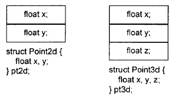

     + 不含有多态的继承：C++ 标准并未强制指定派生类和基类成员的排列顺序，但是在大部分编译器上，基类成员总是先出现

       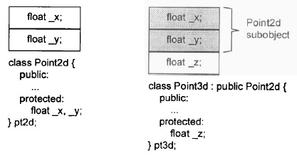

     + 含有多态的继承：此时对象中会包含有一个 vptr，并且存在一个 vtable，主要分为两种：

       + 将 vptr 放在对象的尾部：在 C++ 最初问世时，被广泛采用，可以和 C struct 兼容

         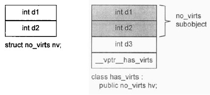

       + 将 vptr 放在对象的首部：对于多重继承，**通过虚指针访问函数表的效率会得到一定提升**，但损失了兼容性

         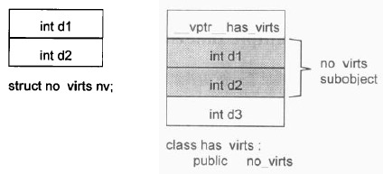

     + 多重继承：

       + 将 vptr 放在对象的尾端，提供了一种自然多态的形式，基类和派生类的 object 都是从相同的地址开始，因此把一个派生类对象的地址指定给基类的指针或引用时，不需要编译器去调停或修改地址。效率较高
       + 将 vptr 放在对象的首端，如果基类没有 virtual function 而派生类有，那么单一继承的“自然多态”就会被打破。这种情况下把一个派生类 object 转换为其基类型，就需要编译器的介入，用以调整地址

       多重继承的问题主要发生于派生类和其第二或后继基类 object 之间的转换，对一个多重派生对象，将其地址指定给“最左端基类的指针”，情况将和单一继承时相同，因为二者都指向相同的起始地址。需付出的成本只有地址的指定操作而已；至于第二个或后继的基类的地址指定操作，则需要将地址修改过：加上(或减去，如果 downcast 的话)介于中间的基类子对象大小。

       假设将 vptr 放在 class object 的尾端，类的继承关系和members的布局如下：

       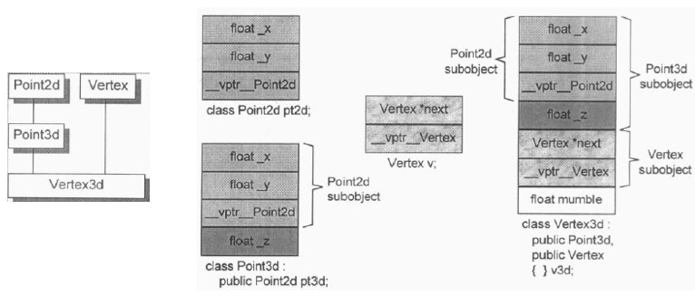

     + 虚继承：先安排好派生类的不变部分，然后再建立其共享部分，不同编译器在于如何实现共享部分

       + 插入虚基类指针，每个指针指向虚基类：缺点是空间负担（指针），存储随虚继承深度变化

         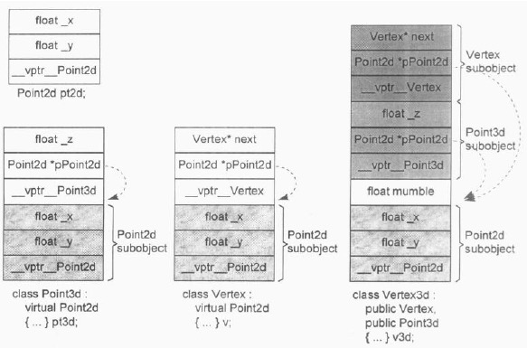

       + 复用虚函数表（虚基类表 offset），顶端存储虚基类的 offset

         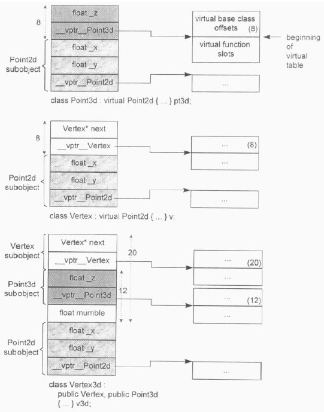

204. 类中虚函数如何实现动态绑定的？

     + 对于单继承中的虚函数，子类继承父类的虚函数表，并且根据用户重写来更新虚函数表函数的地址：

     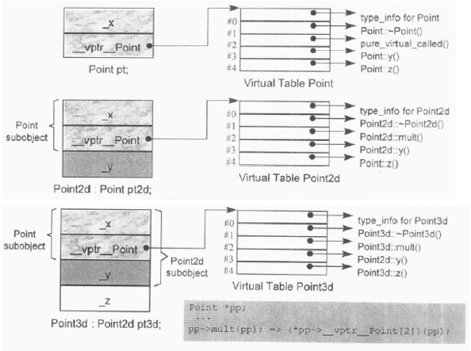

     + 对于多重继承中的虚函数，其复杂度围绕在第二个及后继的 base classes 身上，以及“必须在执行期调整 this 指针”这一点。**在多重继承下，一个 derived class 内含 n-1 个"额外"的 virtual tables，n 表示其上一层 base classes 的个数（因此，单一继承将不会有额外的virtual tables）**：

     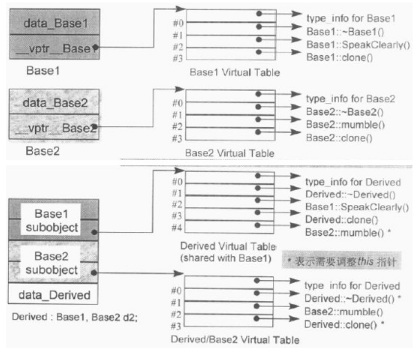

     + 对于虚继承下的虚函数，则先定位到虚基类对象地址，然后获取其 vtable 里面的项：

       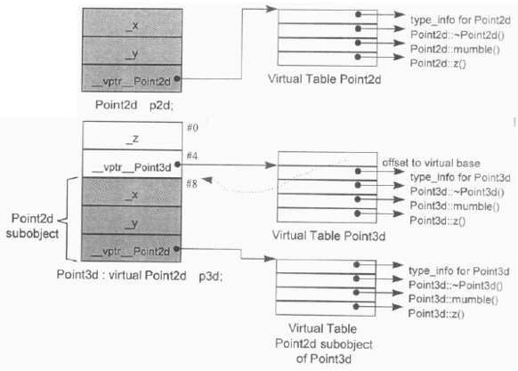

205. C++ 中如何计算类占用空间大小？

     使用 sizeof 即可计算类占用大小，其主要有三部分组成：

     1. 类中的非静态成员变量，需要注意内存对齐
     2. 类中的 vptr，即指向虚函数表的指针，占用大小一般为 4B 或者 8B
     3. 继承过来的父类空间大小

     C++ 中类的成员函数和静态变量分别存储在代码段和数据段，方便实现代码共享，减少执行文件空间大小。

206. 为什么 static 数据成员可以是该成员所属的类类型，而非 static 数据成员只能自身类的引用或者指针？

     当编译器在计算类所占空间时，其会忽略 static 数据成员，因此可以在类中定义对应类类型的 static 变量，这时候编译器是可以确定出来类大小的，但是非 static 数据成员会被计算在类大小中，因此会发生递推求类大小的情况，此时编译器报错。

207. lambda 表达式在内部是如何实现的？

     其实，编译器会把我们写的 lambda 表达式翻译成一个类，并重载 operator() 来实现。也就是将 lambda 表达式转换为函数对象，并且在传值和传引用时进行初始化即可。

208. hash 冲突及解决方法？

     关键字值不同的元素可能会映射到哈希表的同一地址上就会发生哈希冲突，解决办法：

     + 开放定址法：当冲突发生时，使用某种探查(亦称探测)技术在散列表中形成一个探查(测)序列
     + 再哈希法：同时构造多个不同的哈希函数
     + 链地址法：将所有哈希地址为 i 的元素构成一个称为同义词链的单链表
     + 建立公共溢出区：将哈希表分为基本表和溢出表两部分，凡是和基本表发生冲突的元素，一律填入溢出表。

     > 还存在一些哈希算法，如布谷鸟哈希，其包含两个大小相等的子表和不同的哈希函数，插入时，依次考虑插入第一或二个子表，如果都没有候选位置，则踢出其中之一元素，安插新元素，对踢出元素递归进行哈希即可。

209. 函数参数压栈方式为什么是从右到左的？

     因为 C++ 支持可变函数参数。正是这个原因使得 C++ 语言函数参数入栈顺序是从右到左。具体是：C++ 方式参数入栈顺序的好处就是可以动态变化参数个数。C++ 程序栈底为高地址，栈顶为低地址。函数最左边确定的参数在栈上的位置必须是确定的，否则意味着已经确定的参数是不能定位和找到的，这样是无法保证函数正确执行的。衡量参数在栈上的位置，就是离开确切的函数调用点有多远。已经确定的参数，它在栈上的位置，不应该依赖参数的具体数量，因此参数数量是未知的！所以只有确定的参数最后入栈才能保证它在栈中的位置是确定的。

     > 通过 bp 加上固定偏移量能找到对应的第一个参数即可，如果从左到右，那么第一个参数偏移量就不是固定的，存在问题

210. C++ 不同标准对并发编程机制的增强有哪些？

     + C++ 11：memory model，thread，mutex ans locks，thread local data，condition variable，tasks
     + C++ 14：reader-write lock
     + C++ 17：parallel STL
     + C++ 20：executors，atomic smart pointor，std::future extentions，latch & barriers，coroutines，task block

211. thread 中的 join 和 detach 有何作用？

     + join：等待线程完成其执行，多用于线程间同步
     + detach：允许线程独立运行，让目标线程成为守护线程

     上述两个调用，都需要线程是 joinable 才可调用，另外，如果线程运行结束前未调用上述方法之一，那么在其线程对象将要被析构时，将会调用 `std::terminate()` 从而导致进程异常退出。

212. 如何管理当前线程的运行状态？

     + yield：让出处理器，重新调度各执行线程
     + get_id：返回对应的线程 id
     + sleep_for/sleep_until：对线程执行休眠操作

213. 多线程编程时，如果想要某个函数只被调用一次，应该如何处理？

     + 使用 call_once & once_flag：once_flag 需要被声明为全局，保证不同线程可以访问
     + 使用 atomic_bool：用于进行同步

214. 什么是竞争条件（race condition）和临界区（critical area）？

     + 竞争条件：当多个进程或者线程同时访问共享数据时，只要有一个任务会修改数据，那么就可能会发生问题，此时结果依赖于这些任务执行的相对时间
     + 临界区：访问共享数据的代码片段

     为了避免竞争条件，就需要对临界区进行数据保护。

215. C++ 中的互斥体有哪些？它们之间有何不同点？

     基本互斥体结构是 mutex，提供了 lock，unlock 和 try_lock 接口，按照功能，进行以下扩展：

     + 超时：timed_mutex，recursive_timed_mutex，shared_timed_mutex
     + 可重入：recursive_mutex 和 recursive_timed_mutex，获取锁的线程可以再次获取锁，防止不必要死锁
     + 共享：shared_timed_mutex  和 shared_mutex，对于这类互斥体，实际上是提供了两把锁：一把是共享锁，一把是互斥锁。通常使用在读者写者模型上，提供了 lock_shared，unlock_shared 等接口

     使用锁的时候，需要仔细控制加锁的粒度，防止效率低下。

216. 当某个操作需要锁定多个 mutex 的时候，可能发生死锁，C++ 如何避免该情况的发生？

     + 可以使用提供的 lock 和 try_lock 通用锁定资源，该接口会确保不会发生死锁
     + 根据死锁产生的条件，破坏其条件即可，如按顺序加锁等

217. 为什么有了 mutex 提供的 lock 和 unlock 基本功能，还需要 lock_guard 等相关类？

     手动的锁定需要耗费比较大的精力，需要使用 try catch 语句捕获异常进行处理，并且很容易忘记 unlock。为此，标准库根据 RAII 提供了像 lock_guard 的类，其可以帮助我们自动在其生命周期结束时进行锁资源的释放。相关资料如下：

     | API         | C++标准 | 说明                                   |
     | :---------- | :------ | :------------------------------------- |
     | lock_guard  | C++11   | 实现严格基于作用域的互斥体所有权包装器 |
     | unique_lock | C++11   | 实现可移动的互斥体所有权包装器         |
     | shared_lock | C++14   | 实现可移动的共享互斥体所有权封装器     |
     | scoped_lock | C++17   | 用于多个互斥体的免死锁 RAII 封装器     |

     

     | 锁定策略    | C++标准 | 说明                                                |
     | :---------- | :------ | :-------------------------------------------------- |
     | defer_lock  | C++11   | 类型为 `defer_lock_t`，不获得互斥的所有权           |
     | try_to_lock | C++11   | 类型为`try_to_lock_t`，尝试获得互斥的所有权而不阻塞 |
     | adopt_lock  | C++11   | 类型为`adopt_lock_t`，假设调用方已拥有互斥的所有权  |

218. 条件变量有何作用？

     条件变量主要用于线程间的同步，其主要和 unique_lock 配合使用，因为条件变量会解锁和重新锁定互斥体。

     + wait：通过 wait 来判断条件是否成立，不成立则此处会解锁互斥体，并让当前线程等待。
     + notify_one & notify_all：当线程改变某个条件，使得 wait 的条件成立时，可以通过 notify 进行通知

219. future 头文件中主要有哪些内容，其有何作用？

     + async：用于封装异步任务，返回一个 future，可以通过 launch::async 来指定异步任务在新线程中运行
     + packaged_task：主要用于封装一个函数或者可调用对象上，可通过 get_future 获取对应的结果
     + promise：和 async 和 packaged_task 不同，它们通过返回一个值，该值被封装为一个对象，之后线程结束，如果想要提前告知结果，并且进行一些后台工作，可以使用 promise，当对其使用 set_value 后，对应的 future 对象就会就绪。注意每个就绪的 future 只能被 get 一次，因此如果想要多个线程获取同一个 future 的值，可以使用 shared_future

220. 谈谈 C++ 头文件中的并行算法？

     从 C++ 17 开始，`<algorithm>`和`<numeric>` 头文件的中的很多算法都添加了一个新的参数：sequenced_policy。可能取值有三种：

     | 变量                 | C++版本 | 说明                                 |
     | :------------------- | :------ | :----------------------------------- |
     | execution::seq       | C++17   | 要求并行算法的执行可以不并行化       |
     | execution::par       | C++17   | 指示并行算法的执行可以并行化         |
     | execution::par_unseq | C++17   | 指示并行算法的执行可以并行化、向量化 |

221. 谈谈 C++ 中的并发编程，以及并发编程所涉及到类和作用？

     首先，并发编程中的最重要的就是解决数据竞争的问题，可以使用 mutex 来定义临界区，达到互斥效果；其次，单纯使用 mutex 手动进行加锁和解锁会带来精力负担，并且容易加锁后忘记解锁，导致产生问题，为此，根据 RAII 策略，C++ 提供了像 lock_guard 和 unique_lock 等类来缓解该问题；最后，便是并发编程中涉及到的线程同步的方式了，一种方式是使用 condition_variable，其通常和 unique_lock 结合，通过 wait 和 notify 实现同步机制，另外一种方式是使用 future 结构，future 中的 get 方法阻塞直到 future 对象就绪。总而言之，并发编程主要从互斥和同步方面进行考虑。

222. C++ 内存模型是什么，主要包括哪些内容？

     **内存模型描述了并发程序中多个线程访问共享内存时的行为和规则**。它主要包含以下几个方面：

     + 原子操作：C++ 中的原子操作是具有原子性和可见性保证的操作，可以确保多个线程访问共享对象时不会出现竞态条件或未定义的行为。
     + 内存顺序：内存顺序是指程序中内存操作的执行顺序和其影响的可见性。C++ 中提供了多种内存顺序模型，如顺序一致性、弱序、释放-获取顺序等，可以通过 `std::atomic` 和 `std::atomic_thread_fence` 等接口进行设置和控制。
     + 同步原语：同步原语是用于在线程之间进行同步与协作的机制。例如，互斥锁、条件变量和信号量等等，都可以用于保护临界区以避免竞态条件。C++ 中提供了 `std::mutex`、`std::condition_variable` 和 `std::semaphore` 等标准库组件来支持同步原语。
     + happens-before 关系：happens-before 关系规定了内存操作的顺序和先后顺序，并保证一个线程对一个共享对象的修改对其他线程可见。当程序使用同步原语或原子操作时，会隐式地建立 happens-before 关系。
     + 缓存一致性：缓存一致性是指多个处理器或核心之间共享内存的一种机制，它确保不同缓存中的数据是一致的。C++ 的内存模型支持各种缓存一致性协议，以保证共享数据的正确性和一致性。

223. 为什么需要内存模型？

     在 C++ 11 出来之后，增加了多线程编程的支持，开发者可能会认为编写的代码在其他线程中看到的顺序是一致的，但是实际上并非如此，之所以产生差异，是因为：

     + 编译器优化，其对于没有依赖关系的操作可能会重排序
     + CPU 乱序执行
     + CPU 缓存不一致性

     注意，尽管存在上述三个方面的影响，但是其对单线程的执行结果并不影响，也就是说对于单线程，不管程序如何被编译器优化以及乱序执行，都不会影响最终结果的正确性。

     正是由于存在上述不同方面对多线程编程的影响，导致当多个线程访问同一个内存位置，并且其中只要有一个线程包含了写操作，如果这些访问没有一致的修改顺序，那么结果就是未定义的。而内存模型则规定了多个线程对同一个内存位置进行读写的一个顺序，确保哪些操作顺序是不被允许的。

224. 原子类型有何作用？

     原子类型是 C++ 提供的一系列的类，其主要作用是保证某些操作在对应变量上是原子性的，同时，其还提供了参数用于规定 load 和 store 的相对顺序。注意，所有的原子类型都不支持拷贝和赋值操作。

225. memory_order 是什么？

     原子类提供了一个参数，用于指定对应的内存顺序，该参数可以是：

     + memory_order_seq_cst：默认的内存顺序，最为严格，其保证了所有关于原子操作的代码都不会被乱序，你可以列出线程交错的所有可能性，即便每次执行交错的结果会不一样。但对于任意一次来说，其执行的顺序必属于这些可能性中的一个。而且，对于某一个单次执行来说，所有线程看到的顺序是一致的。
     + memory_order_acq_rel：同一个对象上的原子操作不允许被乱序。release 操作禁止了所有在它之前的读写操作与在它之后的写操作乱序。acquire 操作禁止了所有在它之前的读操作与在它之后的读写操作乱序。
     + memory_order_relaxed：不建立任何同步或者顺序保证，使用此模型只会保证原子性

226. C++ 协程有何作用，如何实现？

     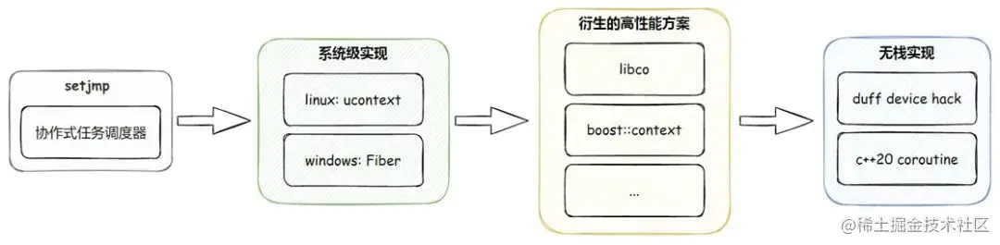

     上图展示了协程迭代的实现方案。

     考虑最简单的 Generator，其可以中止函数的执行，并且返回不同的函数值，在最终执行完函数的时候，才真正结束函数的运行。C++ 中有两种类型的协程，分别是无栈协程和有栈协程。其规定了任何包含 `co_return` `co_await` `co_yield` 关键字之一的函数都是一个协程。

     C++ 17 采用的是 Duff Device Hack（使用 switch case 进入到循环体中）实现方式：

     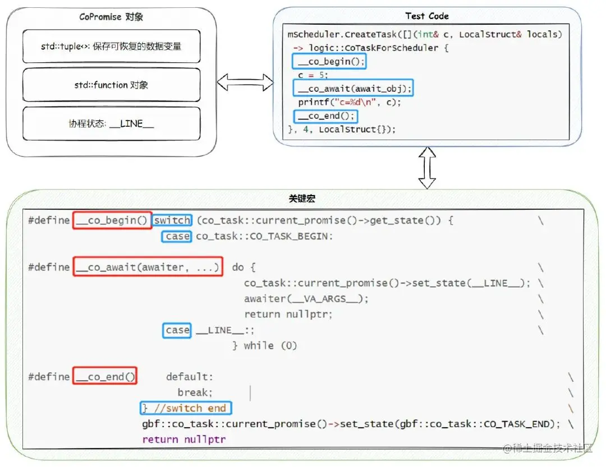

     C++ 20 协程实现方式如下：

     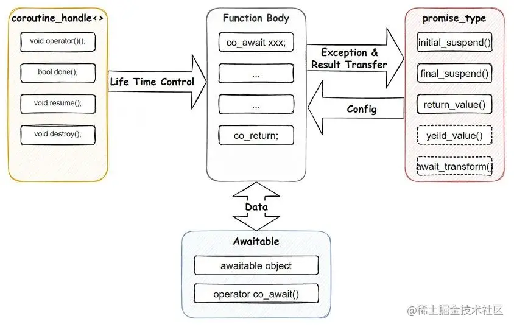

     从图上也能看到, 对比其它语言较精简的 Coroutine 实现, C++20 这套实现, 还是偏复杂的, 这也是我们常调侃的 "库作者向" 实现, 虽然整体使用很灵活, 也能跟泛型很好的搭配, 但我们还是需要在框架层做大量的包装, 同时业务一般需要一个地方对应用中所有的协程做管理, 方便监控应用的整体运行情况等, 这也使得 C++这套特性没法很简单的直接在业务侧进行使用，需要提供一个全局的 Scheduler。

     C++ 协程采取的是微软提出并主导的无栈协程，与之相对的便是有栈协程，有栈协程切换的成本是用户态线程切换的成本，而无栈协程切换的成本则相当于函数调用的成本。无栈协程和线程的区别：无栈协程只能被线程调用，本身并不抢占内核调度，而线程则可抢占内核调度。有栈协程比系统级线程轻量很多，但比起无栈协程还是差了许多。总而言之，C++ 协程的出现大大简化了异步编程的难度，将异步代码进行同步方式的编写，同时还保持了异步的高性能。

     > JS 中的 async 和 await 实际上也是将异步编程同步化，其基于 Promise 实现；而 CPP 中的 co_await 和 co_return 同样也是将异步编程同步化，不过其基于协程实现。

     有栈（stackful）协程通常的实现手段是在堆上提前分配一块较大的内存空间（比如 64K），也就是协程所谓的“栈”，参数、return address 等都可以存放在这个“栈”空间上。如果需要协程切换，那么通过 swapcontext 一类的形式来让系统认为这个堆上空间就是普通的栈，这就实现了上下文的切换。有栈协程最大的优势就是侵入性小，使用起来非常简便，已有的业务代码几乎不需要做什么修改，但是 C++20 最终还是选择了使用无栈协程。主要原因是栈空间的限制（太大或者太小都不合适）；协程切换的开销。

     > 协程资料：https://juejin.cn/post/7163829883238350856，https://zhuanlan.zhihu.com/p/569480618

227. C++ 中的 SFINAE 指的是什么，有何作用？

     SFINAE 指的是 Substitution failure is not an error，其说明了编译器在进行模板实例化的时候可能会发生参数替换失败的场景，但是这并不是一个错误，编译器会继续匹配名称相同的模板，直到所有模板都不能匹配的时候才进行报错。通过该机制，可以让编译器选择使用那个模板进行实例化，下列代码展示了 SFINAE：

     ```cpp
     struct X { typedef int type; };
     
     struct Y { typedef int type2; };
     
     template <typename T> void foo(typename T::type);    // Foo0
     template <typename T> void foo(typename T::type2);   // Foo1
     template <typename T> void foo(T);                   // Foo2
     
     void callFoo() {
        foo<Y>(10);   // Foo0: Failed,  Foo1: Succeed, Foo2: Failed
     }
     ```

     上述代码 `foo<Y>(10)` 在匹配 Foo0 模板时，参数替换失败，但是编译器并不报错，而是继续尝试，在匹配到 Foo1 的时候，发现可以匹配，从而生成了对应的模板。

     实际上，该机制经常被用来限制泛型参数的类型，最常用的便是 enable_if 这个函数：

     ```cpp
     template <typename T> void inc_counter(
       T& counterObj, 
       typename std::enable_if<
         is_base_of<T, ICounter>::value
       >::type* = nullptr );
     
     template <typename T> void inc_counter(
       T& counterInt,
       typename std::enable_if<
         std::is_integral<T>::value
       >::type* = nullptr );
     ```

     其次，`is_integral<T>::value`返回一个布尔类型的编译器常数，告诉我们它是或者不是一个 integral，`enable_if<C>`的作用就是，如果这个 C 值为 True，那么 type 就会被推断成一个 void 或者是别的什么类型，让整个函数匹配后的类型变成 `void inc_counter<int>(int & counterInt, void* dummy = nullptr)`; 如果这个值为False，那么`enable_if<false>`这个特化形式中，压根就没有这个 ::type，于是 substitution 就失败了，因此，这个函数原型根本就不会被产生出来。enable_if 的实现如下：

     ```cpp
     // STRUCT TEMPLATE enable_if
     template <bool _Test, class _Ty = void>
     struct enable_if {}; // no member "type" when !_Test
     
     template <class _Ty>
     struct enable_if<true, _Ty> { // type is _Ty for _Test
         using type = _Ty;
     };
     
     template <bool _Test, class _Ty = void>
     using enable_if_t = typename enable_if<_Test, _Ty>::type;
     ```

     

228. C++ Concept 为什么出现，有何作用？

     首先明确，Concept 是用来约束模板类型的语法糖，尽管我们知道 SFINAE 机制，其能够实现模板类型参数的约束匹配，但是其存在以下问题：

     + 匹配失败时报错信息难以阅读
     + 模板本身逻辑耦合在一起，不同地方的匹配可能需要写很多相同模式的约束匹配的代码

     Concept 的出现实际上就是为了解决上述问题，即通过将模板的类型约束抽象出来，然后在模板定义时再使用。这样成功解耦了模板类型约束和模板本身的一些类型逻辑。达到复用模式约束的作用。

     ```cpp
     // 一个约束T只能是整数类型，并且是有符号的concept
     template <typename T>
     concept signed_integral = integral<T> && std::is_signed_v<T>;
     
     // 有符号整型才能匹配subtract函数的T
     template <signed_integral T>
     T subtract(T a, T b) {
         return a - b;
     }
     
     // 或者使用 requires 子语句
     template <typename T>
     requires my_concept<T>
     void f(T v);
     ```

229. Linux 内存中的 Cache 和 Buffer 指的是什么，有何作用，如何进行释放？

     + Cache：指的是 Page Cache，通常是按照页为单位来缓存文件系统中的文件，可用于文件数据的快速访问，注意其同样也会缓存文件的写操作，缓存文件写操作就需要 dirty 标识符配合
     + Buffer：指的是 Buffer Cache，用于暂存物理磁盘块，通常用于写操作（写数据到磁盘）进行缓存，但是也可用于读缓存（从磁盘读数据）
     + **Buffers** can be used either as a “cache for data to be written to disk” or as a “cache for data read from disk”.
     + **Cache** can be used either as a “page cache for reading data from files” or as a “page cache for writing files”.

     简单说来，page cache 用来缓存文件数据，buffer cache 用来缓存磁盘数据。在有文件系统的情况下，对文件操作，那么数据会缓存到 page cache，如果直接采用 dd 等工具对磁盘进行读写，那么数据会缓存到 buffer cache。Buffer(Buffer Cache)以块形式缓冲了块设备的操作，定时或手动的同步到硬盘，它是为了缓冲写操作然后一次性将很多改动写入硬盘，避免频繁写硬盘，提高写入效率。Cache(Page Cache)以页面形式缓存了文件系统的文件，给需要使用的程序读取，它是为了给读操作提供缓冲，避免频繁读硬盘，提高读取效率。

     可以使用以下命令进行释放：

     ```shell
     sync; echo 1 > /proc/sys/vm/drop_caches # 仅清除页面缓存
     sync; echo 2 > /proc/sys/vm/drop_caches # 清除目录项和 inode
     sync; echo 3 > /proc/sys/vm/drop_caches # 清除页面缓存、目录项以及 inode
     ```

230. Linux 中的 fflush，fsync 和 sync 的作用有何不同？

     `fflush` synchronizes the *user-space buffered* data to *kernel-level* cache (since it's working with `FILE` objects that reside at user-level and are invisible to kernel)，whereas `fsync` or `sync` (working directly with *file descriptors*) synchronize kernel cached data with device.

     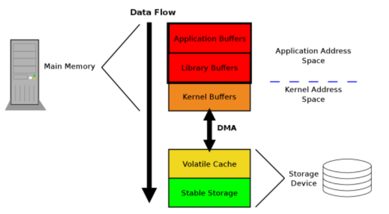

     注意：sync 后实际上依旧可能发生数据丢失的问题，sync 只保证数据到 device 上，但是 device 可能本身也存在缓存，因此，如果突然断电还是存在数据丢失的可能。

231. Linux 中的内存管理机制是怎样的，buddy 系统和 slab 算法分别有何作用？

     Linux 中的内存管理机制是通过分段和分页实现的，但是，MMU 规定了每个段都是从 0 开始，4G 结束，因此屏蔽了段机制，而采用分页机制进行内存管理。

     之所以使用 buddy 系统，是因为对于物理内存经过频繁地申请和释放后会产生外部碎片，另一方面，可以高效的处理频繁申请和释放不同大小的**连续**页框，通过该系统可以解决上述问题。具体而言：

     - 将空闲内存分为 m 个组, 第一组储存2^0个单位的内存块, 第二组储存2^1个单位的内存块, 第三组储存2^2个单位的储存块, 以此类推, 直到m组。m 典型值为 11。
     - 每个组是一个链表, 用来储存同等大小的内存块。
     - 伙伴块的大小是固定的, 并且同一个组里面的内存块是伙伴。

     在分配时，如果申请的内存大小是 n 个单位块, 则先将 n 向上取整为 2 的 n 次幂，假设为 s，然后我们从前面的数组中定位到 s，如果该组中有剩余内存块就分配出去，否则向上查找，然后再将该内存块分割出来，并将剩余的块放到数组中去。同样的，还存在内存归并的过程：我们检测归还内存的伙伴内存块是否空闲，如果空闲就合并在一起，不空闲就直接放回到合适的链表中，一般来说，伙伴算法中会使用位图来记录内存块是否被使用，用于伙伴内存的内并。

     伙伴系统的优点是分配和回收内存都十分的方便，可以解决外部碎片的问题，在不断的回收和释放过程中仍然可以保存有较大的内存块。分配内存速度也很快，基本是 O(lgN) 的效率；缺点是导致较大的内部碎片，比如我们需要一个 9 个单位块大小的内存块, 但是按伙伴算法会直接给我们分配一个 16 个单位块大小的内存块, 显然有 7 个单位块大小的内存是被浪费的。

     由于伙伴管理系统分配的基本单元是页，也就是 4KB，因此，伙伴管理系统不太适用于小块内存的分配和回收，这时就需要 slab 机制：

     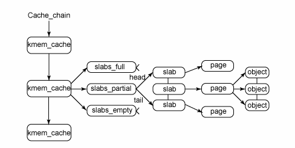

     slab 的设计思想就是把若干的页框合在一起形成一大存储块——slab，并在这个 slab 中只存储同一类数据，这样就可以在这个 slab 内部打破页的界限，以该类型数据的大小来定义分配粒度，存放多个数据，这样就可以尽可能地减少页内碎片了。在 Linux 中，多个存储同类数据的 slab 的集合叫做一类对象的缓冲区。

     slab 优点是内核通常依赖于对小对象的分配，它们会在系统生命周期内进行无数次分配。slab 缓存分配器通过对类似大小的对象进行缓存而提供这种功能，从而避免了常见的碎片问题；slab 分配器还支持通用对象的初始化，从而避免了为同一目的而对一个对象重复进行初始化；slab 分配器还可以支持硬件缓存对齐和着色，这允许不同缓存中的对象占用相同的缓存行，从而提高缓存的利用率并获得更好的性能。

232. 谈谈现代的 C/C++ 编译常用工具链，以及使用 GCC 编译的流程？

     现代的 C++ 编译工具链主要有 CMake/Make/GCC，GCC是C/C++语言的编译工具，Make是增量式（编译）批处理工具，CMake 是 Make 脚本生成工具。

     ```
                   cmake           make       gcc
     CMakelist.txt -----> Makefile ----> Cmds ---> Binary
     ```

     使用 GCC 编译程序时，主要分为四个步骤：预处理、编译、汇编、链接：

     ```
           -E          -S          -c          
     b.c ------> b.i ------> b.s ------> b.o ------> a.out
           gcc         gcc         as          ld
     ```

     GCC 在编译时，其并不管理用户安装的第三方库，因此，如果项目依赖于某个文件，则需要手动进行依赖的说明，使用的比较多的参数如下：

     + `-I` ：预处理阶段使用，指定额外的头文件目录，如果不指定，将报错 `xxx.h: file not found`
     + `-l`：链接阶段，来指定需要链接的库，不指定将报错 `Undefined symbols `
     + `-L`：链接阶段，将所要链接的库文件所在的路径告诉 gcc，不指定将报错 `ld: library not found for -lxxx`
     + 静态链接参数，优化参数，宏相关参数，以及其他参数（`-std, -Werror, -v` 等）

233. 对于非复现的 bug，应该如何进行追踪和调试？

     首先，gdb 提供了反向调试的功能，但是其依赖于 bug 复现率，推荐只在 bug 能够复现的时候进行反向调试。这里推荐使用 rr（Record and Replay Framework） 工具，通过其能够记录下发生异常时程序的运行时状态，从而能够提供一个可以反复反向调试的 debug 环境：

     + `while rr record --chaos ./main; do :; done`：持续运行，知道结束
     + `rr replay`：回放最新的程序运行时状态，提供 gdb 调试环境

234. 如何查看代码覆盖率？

     主要分为以下几个工具：gcc & gcov & lcov。需要在编译的时候加入 `-fprofile-arcs -ftest-coverage` 选项（或者直接增加 `--coverage`），gcov 会生成对应的代码覆盖报告文件，lcov 会将报告文件生成对应的 html 文件，通过浏览器查看即可：

     ```shell
     # --coverage 等同于编译参数 -fprofile-arcs -ftest-coverage 以及在链接时增加 -lgcov
     gcc --coverage test.c
     ./a.out 
     gcov test
     cat test.c.gcov
     ```

     对于 clang 工具链：

     ```shell
     clang++ -fprofile-arcs -fcoverage-mapping foo.cc -o foo
     LLVM_PROFILE_FILE="foo.profraw" ./foo
     llvm-profdata merge -sparse foo.profraw -o foo.profdata
     # line report
     llvm-cov show ./foo -instr-profile=foo.profdata
     # file report
     llvm-cov report ./foo -instr-profile=foo.profdata
     ```

235. malloc 进行内存分配时什么时候会使用 sbrk，什么时候会使用 mmap？

     在内存分配小于阈值（M_MMAP_THRESHOLD）的时候，将会调用 brk/sbrk，如果内存分配大于阈值时，则会使用 mmap（MAP_ANONYMOUS）：

     + int brk(void *addr)：sets the upper limit of the data segment
     + void *sbrk(intptr_t increment)：increments it
     + mmap with MAP_ANONYMOUS：Anonymous mappings can be pictured as a zeroized virtual file. Anonymous mappings are simply large, zero-filled blocks of memory ready for use.

     > 上面的内存分配只是分配了虚拟内存，在实际第一次访问的时候会产生缺页错误

236. 


## 参考资料

1. [Understanding Modern C++](https://github.com/godsme/understand_modern_cpp) 

2. [现代 C++ 教程 ](https://changkun.de/modern-cpp/zh-cn/00-preface/) 

3. [Effective Modern C++](https://cntransgroup.github.io/EffectiveModernCppChinese/1.DeducingTypes/item1.html) 

4. [C++ Interview](https://github.com/huihut/interview#cc-development-direction) 

5. [浅析C++类的内存布局](https://www.zhihu.com/tardis/zm/art/380147337?source_id=1003) 

6. [C++对象模型](https://github.com/arkingc/note/blob/master/C%2B%2B/C%2B%2B%E5%AF%B9%E8%B1%A1%E6%A8%A1%E5%9E%8B.md#33-data-member%E7%9A%84%E5%AD%98%E5%8F%96) 

7. [C++ 并发编程](https://paul.pub/cpp-concurrency/) 

8. [C++ 内存模型](https://paul.pub/cpp-memory-model/) 

9. [C++ memory model Q&A in stackoverflow](https://stackoverflow.com/questions/6319146/c11-introduced-a-standardized-memory-model-what-does-it-mean-and-how-is-it-g) 

10. [Linux 内存管理](https://github.com/0voice/kernel_memory_management) 


