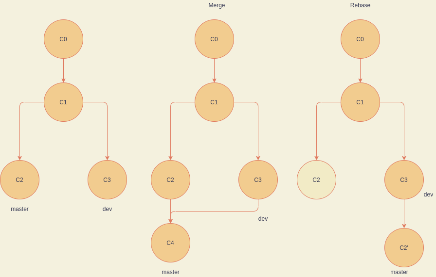

整理在使用 Git 过程中的一些总结。

<!-- More -->

## merge / rebase

两者都是将其他分支上修改应用到当前工作分支上，不同的是 merge 会产生一个与 merge 相关的提交记录，而 rebase 则不会产生，除此之外，两者之间的 git flow 如下：



## cherry-pick

用于将一些修改应用到当前工作的分支上：

```bash
git cherry-pick <commitHash> | <HashA>..<HashB>
```

上面的命令分别表示应用 `<commitHash>` 以及 (HashA, HashB] 到当前工作的分支上。

## shallow update not allowed

这个问题的产生原因是在克隆远程仓库的时候采用了以下命令：

```bash
git clone --depth=<num> <remote-url>
```

这将会导致`shallow clone`(浅复制)。这将会使得这个仓库不能向远程仓库进行`push`。
通过以下命令可修复：
```bash
git fetch --unshallow <remote-repo>
```

## 镜像源

使用镜像源可以加速下载速度，常见的 Github 镜像源有：

1. https://github.com.cnpmjs.org/
2. https://hub.fastgit.org/
3. https://github.wuyanzheshui.workers.dev/

可以在克隆的时候替换 `https://github.com` ，也可以通过全局设置，让 git 命令的 url 指向上述镜像源：

```shell
git config --global url."https://hub.fastgit.org".insteadOf https://github.com
```

