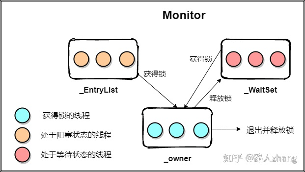

本文用于记录学习 Java 中遇到的问题，以备查阅。

<!-- More -->


1. Java 中对象和对象引用的区别？

   对象存储在堆内存中，对象引用一般存储在栈内存中，程序员直接操作的是对象引用，对象引用指向实际的对象。

2. JVM 中存在寄存器吗，若不存在该如何进行表达式计算呢？

   并不存在寄存器的概念，JVM 使用操作数栈来进行计算。

3. boolean 基本类型占用空间？

   Java 虚拟机规范中并没有明确指出 boolean 类型的内存占用，需要看虚拟机的具体实现，1 个字节或 4 个字节都是可能的。

4. static 关键字的作用？

   可以解释位类字段或者类方法，可以在不创建对象的时候直接使用，并且类变量在所有对象中共享。

5. 创建数组时，默认值是多少？

   全 0，对于对象数组则为 null。

6. 局部变量会被默认初始化吗？

   不会，对象字段会被默认初始化。

7. `i = i++` 和 `i = ++i` 的区别，i  初始值为 0？

   每个方法在执行时，都有一个栈帧与之对应，其中包含了局部变量，操作数栈以及其他数据。`i = i++` 表示先将 i 的值入栈，然后执行自增，这时局部变量 i 就变为 1，最后执行赋值操作，也就是将栈顶数据写回给 i，得到的最终值为 0；`i = ++i` 则是先执行自增操作，这是局部变量 i 为 1，接着将 i 入栈，最后执行出栈操作，得到最终值为 1。

8. Java 中浮点数强制转换为整型的规则？

   直接去掉浮点数，向 0 靠近。

9. Java 中如何跳出多重循环？

   使用标签和 break 即可。

10. Java 中的 switch case 语句支持字符串吗，原理如何？

    从 Java 7 开始支持字符串，JVM 虚拟机首先检查字符串的 hashCode，然后再对里面的字符串执行 equals，判断是否确实是对应的字符串，再决定是否跳转。

11. 方法重载的时候，返回值能否用于区分被重载的方法？

    不能，方法重载看的是方法签名，方法签名由方法名和方法参数类型构成。

12. 在构造器中调用本对象构造器时，需要注意什么？

    可以通过 this(param) 实现，但是只能调用一次，并且只能在构造器首行调用。

13. 在 Java 中为什么调用构造方法只能一次，并且在第一行？

    只能一次的原因是只需要创建一个对象就可以了，放在第一行可以保证其父类被安全创建。

    > JVM 规定：若构造器首行中没有构造器调用，则会插入 super() 调用，用于保证父类对象创建

14. 如何看待 Java 中 Object 对象提供的 finalize 方法？

    虽然该方法最初用于清理对象，但是现在一般不使用该方法，因为其可能导致对象意外复活；另外，无论是”垃圾回收”还是”终结”，都不保证一定会发生。如果 Java 虚拟机（JVM）并未面临内存耗尽的情形，它可能不会浪费时间执行垃圾回收以恢复内存。

15. 垃圾回收器工作方法？

    + 引用计数：对每个对象进行计数，每次有引用指向该对象时，引用计数加 1，而当引用被置为 null 时，引用计数减 1。垃圾回收器遍历对象，对那些引用计数为 0 的对象进行回收即可。该机制存在缺点，不能解决循环引用的问题。
    + 自适应的垃圾回收技术：对于任意“活”的对象，总是可以追溯到其存活在栈或者静态区的引用，从栈或者静态存储区出发，将会发现所有的活的对象。在垃圾对象较多的时候，可以采用停止-复制（stop-and-copy）算法，该算法需要阻塞主程序，并且需要两个堆，不适用于垃圾对象较少的情况；为此可以使用标记-清除（mark-and-sweep），每找到一个或对象，标记其即可，之后清除所有未标记的对象。

16. 不考虑继承，假设有个 Dog 类，当用户首次创建对象时，JVM 采取了哪些操作？

    + JVM 搜索类路径，找到 Dog.class，将其进行加载，即装入内存
    + 随后，执行静态初始化
    + 接着，当调用 `new Dog()` 时，首先需要在堆上为 Dog 对象分配足够的内存
    + 分配的内存首先会被清零
    + 执行出现在字段定义处的初始化动作，再接着执行实例初始化块
    + 最后执行对应的构造器

17. 考虑继承，假设 `Dog extends Animal`，当用户首次创建 Dog 对象时，初始化顺序？

    + 首先，JVM 查找 Dog.class，接着在加载过程中发现有一个父类，于是，转去先执行 Animal 类初始化的类加载和静态初始化操作，加载完成后再加载子类 Dog 和执行其静态初始化
    + 接着 new Dog 语句，执行对应的构造器，构造器首行一般有 JVM 插入的 super() 语句，于是先执行 Animal 类的实例初始化操作和构造器，接着再执行 Dog 类的实例初始化操作和构造器操作

    > JVM 会将对象初始化代码段里面的内容复制到所有构造器代码之前，super 调用之后，因此，在执行完子类的 static 代码段后，先去执行父类的初始化代码和构造器代码，再来执行子类的对象代码段和构造器代码段

18. 代码执行顺序分析？

    ```java
    class Test {
        int a = 1;
        {
            a = 2;
        }
        Test() {
            a = 3;
        }
    }
    ```

    通过 Java 字节码反编译，可以知道编译后的代码如下：

    ```java
    class Test {
        int a;
        Test() {
            super();    // jvm 插入的隐式调用父类构造器
            a = 1;		// jvm 移动初始赋值语句
            a = 2;		// jvm 移动实例初始化代码
            a = 3;		// 用户定义的构造器代码
        }
    }
    ```

    

19. enum 类型的 JVM 实现？

    enum 最终会编译为 class 对象，其继承 Enum 对象，并且里面的枚举值会被定义为对应的私有静态变量。

20. Java 访问权限修饰符？

    + public：当使用 public 关键字的时候，意味着 public 后声明的成员对于每个人都是可用的
    + protected：继承的类可以访问父类中对应的成员，同时也提供了包访问权限
    + default：指不加修饰符定义的成员，可以被相同包下的文件访问
    + private：除了包含成员的类，其他任何类都无法访问这个成员

21. 组合和继承的选择？

    当想要在新类中包含一个已有类的功能时，使用组合，而非继承；当使用继承时，使用一个现有类并开发出它的新版本，通常这意味着使用一个通用类，并为了某个特殊需求将其特殊化。组合用来表达“有一个”的关系，而继承则是“是一个”的关系。

22. 当父类没有无参构造器时，子类在构造器中需要显式指定父类的构造器，为什么？

    JVM 会为没有适用构造器调用的构造器加入 super() 语句，用于父类的初始化，但当父类没有无参构造器时，super() 就不能找到对应的构造器方法，从而产生报错。

23. final 关键字的作用？

    + final 数据：对于基本类型，final 使得数值恒定不变，对于对象引用，final 则是使得引用恒定不变
    + final 参数：在参数列表中，将参数声明为 final 意味着在方法中不能改变参数指向的对象或基本变量
    + final 方法：给方法上锁，防止子类通过覆写改变方法的行为，**类中所有的 private 方法都隐式地指定为 final**
    + final 类：当说一个类是 final ，就意味着它不能被继承

24. 类初始化和加载指什么？

    在 Java 中，每个类的编译代码都存在于它自己独立的文件中，该文件只有在使用程序代码时才会被加载。一般可以说“类的代码在首次使用时加载”。这通常是指创建类的第一个对象，或者是访问了类的 static 属性或方法。构造器也是一个 static 方法尽管它的 static 关键字是隐式的。因此，准确地说，一个类当它任意一个 static 成员被访问时，就会被加载。

25. 方法重载和方法重写区别？

    方法重载是指在同一个类中定义相同方法名，但是签名不同的方法；

    方法重写是指子类重写父类的方法（签名相同），可以借此实现多态特性。

26. Java 中的多态是如何实现的？

    当派生类重写父类方法后，并且使用向上转型后，调用重写方法后，编译器依旧会**动态绑定**到派生类中被重写的方法，执行方法调用。Java 中除了 static，final，private 方法是静态绑定，其他方法都是动态绑定的。

27. Java 中的多态能否实现对象属性的多态？

    不能，只有方法才能后期绑定，属性是根据引用类型来编译的，向上转型后，只能使用基类的属性。

28. Java 构造器内部多态方法的行为？

    如果在构造器中调用了正在构造的对象的动态绑定方法，就会用到那个方法的重写定义。

    ```java
    class Glyph {
        void draw(){System.out.println("Glyph.draw()");}
    
        Glyph() {
            System.out.println("Glyph() before draw()");
            draw();
            System.out.println("Glyph() after draw()");
        }
    }
    
    class RoundGlyph extends Glyph {
        private int radius = 999;
    
        RoundGlyph(int r) {
            draw();
            radius = r;
            System.out.println("RoundGlyph.RoundGLyph(), radius = " + radius);
        }
    
        void draw() {
            System.out.println("RoundGlyph.draw(), radius = " + radius);
        }
    }
    ```

    输出是：

    ```
    Glyph() before draw()
    RoundGlyph.draw(), radius = 0
    Glyph() after draw()
    RoundGlyph.draw(), radius = 999
    RoundGlyph.RoundGLyph(), radius = 5
    ```

29. 协变返回类型指什么？

    派生类在重写方法时，可以返回基类方法返回类型的派生类型。

30. Java8 后，接口中可以定义静态方法和默认方法，这些特性有什么作用？

    静态方法用于将工具功能置于接口中，使其成为通用的工具类；默认方法则是为那些没有实现接口方法提供的默认实现，可以在不破坏已有接口的结构下，在接口中中增加新的方法。

31. 抽象类和抽象方法？

    包含有抽象方法的类便是抽象类，抽象方法适用 abstract 关键词，不含有方法体。对于继承抽象类的派生类，需要实现所有的抽象方法，否则其也是一个抽象类，不可用于实例化。

32. 接口中定义的字段属于接口还是属于实现类的？

    接口中的字段自动是 static final 的，属于接口，可以使用其定义一堆常量，但在 Java8 中推荐使用 enum。

33. 抽象类和接口的异同点有哪些？

    相同点：提供了一种将接口与实现分离的更加结构化的方法

    不同点：

    + 类可以实现多个接口，但只能继承一个基类
    + 接口中不包含对象属性，抽象类中可以包含对象属性和类属性
    + 非抽象类可以不实现接口中的默认方法，但是必须实现抽象类中的抽象方法
    + 接口没有构造器，抽象类可以有构造器
    + 接口的可见形隐式 public，而抽象类可以有 protected 和 default 包访问权限

34. 接口可以被继承吗？

    可以，可以用于扩展原接口中的方法，另外，接口还支持多继承。

35. 内部类的创建方式？

    若在外部类的非静态方法里面，可以直接使用 new InnerClass 进行创建；否则的话必须使用 new OuterClass().new InnerClass() 语法进行创建。

36. 为什么当创建一个内部类的对象时，该对象能够访问到外部对象的所有成员，而不需要其他权限？

    当某个外部类的对象创建了一个内部类对象时，此内部类对象必定会秘密地捕获一个指向那个外部类对象的引用。编译器通过修改内部类的构造器实现，编译后内部类第一个参数便是外部类对象的引用。因此，在构造内部类时，经常需要先创建外部类对象。

37. `.this ` 和 `.new` 语法的作用？

    在内部类中，如果你需要生成对外部类对象的引用，可以使用外部类的名字后面紧跟圆点和 this；

    有时你可能想要告知某些其他对象，去创建其某个内部类的对象，此时可以使用 `.new` 语法。

38. 什么是嵌套类？

    实际上就是静态内部类，此时将内部类声明位 static 即可，此时内部类并不包含有指向外部类对象的引用，因此，可以直接通过 `new OuterClass.StaticInnerClass()` 方式进行创建，并且，嵌套类不能访问非静态的外部类对象的属性。另外，接口中的内部类默认是嵌套类。

39. 匿名内部类的作用？

    通常使用 `New ClassOrInterfaceName(params) {...}`，另外，如果匿名类内部希望使用一个定义在其外部的对象，那么编译器要求其参数引用必须是 final 的，或者必须是 effective final 的，但是注意在实例化匿名类的时候，可以使用非 final 修饰的变量。匿名内部类与正规的继承相比有些受限，因为匿名内部类既可以扩展类，也可以实现接口，但是不能两者兼备。而且如果是实现接口，也只能实现一个接口。

40. 如何实现继承内部类？

    因为内部类的构造器必须连接到指向其外部类对象的引用，所以在继承内部类的时候，事情会变得有点复杂。问题在于，那个指向外部类对象的“秘密的”引用必须被初始化，而在派生类中不再存在可连接的默认对象。因此需要创建一个包含构造器，构造器的参数需要有一个外部类的对象引用，然后通过 `outerObj.super()` 进行初始化。

41. Java 集合类库的两个概念?

    集合（Collection）和映射（Map）。

42. 迭代器工作原理？

    在 Java 中所有的集合类都实现了 iterable 接口，iterable 接口只有一个 iterator() 方法，具体的 iterator 则由集合类自己定义，通常是内部类（private），通过提供如 hasNext，next 等方法实现目的。也可以为了实现其他功能修改 iterator，如 ListIterator 就提供了前后遍历的方式。

43. 如何在遍历 List 的时候删除元素？

    + 使用迭代器提供的 remove 方法进行删除
    + 使用普通的 for 循环删除，但是需要注意删除后需要修改索引值（不推荐）
    + Java8 后，可以使用 removeIf 方法进行删除

44. LinkedList 实现了 Queue 接口和继承了 List 接口实现，peek 和 element 方法有什么不同？

    peek 在没有元素的时候会返回 null，但是 element 则会抛出异常。

45. Map 下主要有几类实现类？

    HashMap，TreeMap，LinkedHashMap。

46. ArrayDeque 的实现和作用？

    通过循环数组实现，可以当作栈，队列，双端队列使用。

47. Java 中 lambda 表达式基本格式？

    `(params) -> { statements; }`，只有一个参数的时候，可以省略括号，如果只有一行的话，花括号应该省略。

48. 方法引用基本格式以及注意事项？

    `ClassName::MethodName`，对于非静态方法，需要先实例化对象，在进行方法引用，对于构造器引用，直接使用 `ClassName::new` 即可。

49. 函数式接口主要分为哪几类？

    + 消费型接口：Consumer/accept，没有返回值，可以通过 andThen 组成消费者链
    + 供给型接口：Supplier/get，无参数，有返回值
    + 断言型接口：Predicate/test，有参数，boolean 返回值，可以通过 and，or 组合断言
    + 函数型接口：Function/apply，有参数和返回值，最为广泛

50. Java 中如何实现闭包？

    可以通过内部类实现，也可以通过函数式接口实现，Java 中的闭包的实现要求局部变量必须是 final 或者 effective final 的，其本质是因为 Java 中传参是按照 capture by value 来实现的，被引用的变量并不会提升到 heap 中。

51. 流式编程的特点？

    代码可读性更高；**懒加载**，意味着它只在绝对必要时才计算，由于计算延迟，流使我们能够表示非常大（甚至无限）的序列，而不需要考虑内存问题。

52. Java 中流操作主要分为三类，分别是？

    创建流，修改流元素（中间操作），消费流元素（终端操作）。

53. 创建流的方式有哪些？

    Stream.of 将一组元素转换为流元素，集合类可以通过 stream 方法产生流，数组则可以通过 Arrays.stream 产生，除此之外，还有随机数流，int 类型流等。

54. 流的中间操作有哪些？

    peek，sorted，distinct，filter，map，flatMap。

55. 流的终端操作有哪些？

    toArray，forEach，collect，reduce，allMatch，anyMatch，findFirst，findAny，count，min，max 等。

56. Optional 类的作用？

    主要是为了优雅解决 null 指针的问题，Optional 类中或者包含一个真实对象引用，或者为空。可以通过 empty，of，ofNullable 方法创建对象，通过 ifPresent/orElse/get 进行解包。

57. Java 中如何进行异常捕获的？

    通常使用 try-catch-finally 语句，在 Java7 后，也可以使用 try-wtih-resource 语句，其会自动关闭实现了 AutoClosable 接口的对象，并且是按照与创建顺序相反的顺序关闭它们，用于优雅关闭资源。

58. Java 中的 try-catch-finally 语句的执行方式，以及在不同代码块中加入 return，结果如何？

    + 无论 catch 是否捕获异常，finally 语句块都是要被执行的；

    + 当 try 块或 catch 块 return 一个值，那么 finally块中的代码会在执行 return 后，返回之前执行。（此时并没有返回运算后的值，而是把要返回的值**暂时保存**起来）。
    + finally 中如果包含 return，那么程序将**在这里返回**，而不是通过 try 或 catch 中的 return 返回，返回值就不是 try 或 catch 中保存的返回值了。

59. Java 中那两个类实现了对文件和路径的抽象？

    Path 和 File，分别有对应的工具类 Paths 和 Files。

60. 如何实现遍历目录的功能？

    通过 Files 下的 walk 或者 walkFileTree 即可实现遍历功能，后者灵活度更高。

61. 如何实现文件监听的功能？

    通过文件系统的 WatchService 可以设置一个进程对目录中的更改做出响应。

62. 什么是字符串的不可变性？

    String 对象是不可变的，String 类中的每个看起来会修改 String 值的方法，实际上都是创建了一个全新的 String 对象。但是如果内容并不改变，String 方法只是返回原始对象的一个引用而已。

63. StringBuilder 和 String Buffer 的异同点？

    都是用于原地操作字符串的类，区别在于前者不是线程安全的，后者是线程安全的。

64. CharSequese 接口的作用？

    从 CharBuffer，String，StringBuffer，StringBuilder 抽象出的一般化定义。

65. String 对象的 length 方法和 codePointCount 方法的区别？

    首先，对于 Java 来说，其采用 UTF-16 来保存文本，length 方法返回的是 code unit（也就是char）的数量，而 codePointCount 返回的是 UTF-16 编码下的字符个数。

66. Pattern 和 Matcher 类的作用？

    根据一个 String 对象生成一个 Pattern 对象，通过 Pattern 对象的 match 方法产生一个 Matcher 对象。

67. Matcher 中的组获取，对于 `A(B(C))D` ？

    `A(B(C))D` 中有三个组：组 0 是 ABCD，组 1 是 BC，组 2 是 C。通过 Matcher 对象的 group 方法可以获取到每个组。

68. Class 对象是什么？

    Class 对象包含了与类有关的信息，每个类都会产生一个 Class 对象，每当编译一个新类，就会产生一个 Class 对象（保存在同名的 .class 文件中）。为了生成该类的对象，JVM 首先会调用类加载器子系统将这个类加载到内存中。Java 是动态加载的，即只有在类需要的时候才会进行类的加载。所有的 Class 对象都属于 Class 类。

69. 如何获取类对应的 Class 对象？

    `类名.class`，`Class.forName` 和 `instance.getClass()`。

70. 类加载和链接的过程？

    加载：查找字节码，并且创建一个 Class 对象

    链接：验证字节码，为 static 字段分配存储空间，如果需要，将解析这个类对其他类的引用

    初始化：先初始化基类，然后执行 static 初始化器和 static 初始化块

71. 如何判断某个实例是否是某个类的实例？

    + instanceOf：关键字，判断某个实例是否是某个类的实例化对象
    + isInstance：Class 类中的方法，用于动态判断某个对象是否能强转为另外一个类，如 `0 instance of String` 本身会报错，但是 `String.class.isInstance(0)` 则可行。

72. 什么是反射以及反射的作用？

    指在程序的运行状态中，可以构造任意一个类的对象，可以了解任意一个对象所属的类，可以了解任意一个类的成员变量和方法，可以调用任意一个对象的属性和方法。 这种动态获取程序信息以及动态调用对象的功能称为Java语言的反射机制。

73. 动态代理是什么，实现原理？

    一个对象封装真实对象，代替其提供其他或不同的操作—这些操作通常涉及到与“真实”对象的通信，因此代理通常充当中间对象。通过调用静态方法 Proxy.newProxyInstance 来创建动态代理，同时还需要一个实现了 InvocationHandler 的类用于实现动态代理以便在调用方法前后进行一些个性化操作。

74. 泛型可以在哪些类型上应用？

    可以应用在泛型接口上，泛型类，泛型方法上。能使用泛型方法的话就不要使用泛型类。

75. `List<String>` 和 `List<Integer>` 在运行时类型信息是否相同？

    相同，涉及到泛型擦除，它们在运行时通过 getClass 得到的结果相同。

76. 如果想要使用泛型对应的方法，该如何定义泛型？

    可以使用 `<T extends Sup>` ，这样就可以使用 Sup 里面的方法。

77. 如何根据泛型创建对象？

    不可以用过 `new T()` 来实现，可以通过反射实现，可以传送一个 T 的 Class 对象，然后调用反射方法创建新的实例即可。

78. 泛型数组的声明和创建？

    可以通过 `List<String>[] list = new LinkedList[n]; list[0] = new LinkedList<String>();` 方式创建泛型数组；更加优雅的方式是通过 ArrayList 创建泛型数组。

79. 基本类型能否作为泛型类型？

    不能，但是可以使用对应的包装类型。

80. 什么是 Mixin？

    最基本的概念是混合多个类的能力，以产生一个可以表示混型中所有类型的类。Java 中实现方法有与接口混合，使用装饰器模式，与动态代理混合。

81. Arrays 相关方法？

    fill，setAll，asList，copyOfRange，deepToString，stream，sort & binarySearch。

82. enum 类型的本质？

    实际上就是继承自 Enum 类的派生类，在 enum 中的每个枚举值实际上就是 `public static final` 类型的变量。通过使用父类的 values 方法返回枚举值对应的类，使用 ordinal 方法返回枚举值的索引，使用 valueOf 则根据字符串常量创建对应的枚举类型。

83. enum 扩展性？

    enum 本身继承自 Enum 类型，不能再次继承，可以通过接口实现扩展，另外，可以在 enum 中声明自定义的方法和属性。

84. java.lang 中的注解有哪些？

    @Override，@Deprecated，@SuppressWarnings，@SafeVarargs，@FunctionalInterface。

85. 如何定义注解以及元注解是什么？

    使用 @interface 定义注解，元注解即用来注解自定义的注解，包括 @Traget，@Retention，@Documented，@Inherited，@Repetable。

86. 如何编写注解处理器？

    主要通过 Java 提供的反射机制来实现，通过反射可以获取到对应注解元素的注解，并且可以获取注解中的属性。JUnit 便是基于注解的测试单元。

87. Java 中的对象关联的 Monitor 对象是什么？

    用于处理和锁相关的对象，每个 Java 对象都有一个 Monitor 对象，里面的 owner 是哪个线程便表示哪个线程具有某个对象的锁。

    

88. Java 中的 synchronized 关键字作用以及对应实现原理？

    实现同步锁，修饰实例方法的时候锁住的是方法调用所在的对象，静态的 synchronized 方法以 Class 对象为锁。其实现原理通过 JVM 添加的 monitorenter&monitorexit/Access flags 指令实现，每个 Java 对象都有一个 monitor 对象，当 monitor 被占用时就会处于锁定状态，线程执行 monitorenter 指令时尝试获取 monitor 的所有权：

    + 如果 monitor 的进入数为 0，则该线程进入 monitor，然后将进入数设置为 1，该线程即为 monitor 的所有者。
    + 如果线程已经占有该 monitor，只是重新进入，则进入 monitor 的进入数加 1。
    + 如果其他线程已经占用了 monitor，则该线程进入阻塞状态，直到monitor的进入数为0，再重新尝试获取 monitor 的所有权。

    而执行 monitorexit 的线程必须是 objectref 所对应的 monitor 的所有者，指令执行时，monitor 的进入数减1，如果减 1 后进入数为 0，那线程退出 monitor，不再是这个 monitor 的所有者。其他被这个 monitor 阻塞的线程可以尝试去获取这个 monitor 的所有权。

    > 同步代码即为临界区，monitorenter 即为进入区，monitorexit 即为退出区

89. Java 中的 wait&notify 的作用以及实现原理？

    这两个方法通常用于多线程之间的同步处理，wait 用于将本线程状态修改为 waiting 状态，而 notify 则是将最先进入 waiting 状态的线程唤醒。wait 实现原理是将对应线程移动到 WaitSet 中，而 notify 则是将 WaitSet 中最先进入的线程移动到 EntryList 中，用于竞争锁，竞争到锁才能进入运行态。

90. 调用 notify/notifyAll 是随机从等待线程队列中取一个或者按某种规律取一个来执行？

    + 如果是通过 notify 来唤起的线程，那先进入 wait 的线程会先被唤起来
    + 如果是通过 notifyAll 唤起的线程，默认情况是最后进入的会先被唤起来，即 LIFO 的策略

91. 调用 notify/notifyAll 后等待中的线程会立刻运行吗？

    并不会，notify 后对应的进程只是进入了 EntryList，可以参与锁竞争，只有获取到了锁才会成为 Owner，进入运行态。

92. wait 会影响性能吗？

    wait/nofity 是通过 jvm 里的 park/unpark 机制来实现的，在 linux 下这种机制又是通过 pthread_cond_wait/pthread_cond_signal 来实现的，因此当线程进入到 wait 状态的时候其实是会放弃 cpu的，也就是说这类线程是不会占用 cpu 资源，从而不影响性能。

    > 虽然不影响性能，但是可能存在上下文切换的开销

93. join 关键字作用，如何实现？

    让主线程等待子线程结束之后才能继续运行，用于子线程和主线程之间的同步。

    join 方法本身是同步方法，当主线程调用时，主线程会获取子线程对象的 monitor，之后，在 join 方法里面，主线程执行了 wait 操作，其被加入到子线程对象 monitor 中的 WaitSet 中，实现主线程等待；之后，子线程结束时，JVM 会调用 notifyAll 唤醒所有等待进程，达到唤醒主线程的作用。

94. sleep 方法会释放锁资源吗，会释放 CPU 资源吗？

    sleep 方法并不会释放锁资源，但是会释放 CPU 资源。其是通过 JVM 封装操作系统底层实现而实现的：

    + 挂起进程（或线程）并修改其运行状态，即让出CPU控制权限；
    + 用 sleep() 提供的参数来设置一个定时器；
    + 当时间结束，定时器会触发，内核收到中断后修改进程（或线程）的状态。例如线程会被标志为就绪而进入就绪队列等待调度。

95. yield 方法作用？

    暂停当前线程，以便其他相同优先级的线程有机会执行，不过不能指定暂停的时间，并且也不能保证当前线程马上停止。yield 方法只是将 Running 状态转变为 Runnable 状态。

96. interrupt 方法的作用和实现方式？

    实际上是提供了一种优雅中止线程的方法。在以前可以通过 Thread.stop 暴力停止一个线程，这种方法太过暴力并且不是安全的，为此，stop 方法被废弃。interrupt 方法则不会真正停止一个线程，它仅仅是给这个线程发了一个信号告诉它它应该结束了（设置一个标志位）。而线程本身应该循环监测自己的中断标志位，以对其进行响应的操作，如回收资源，结束线程自身。

    Thread.interrupted() 会返回标记位，并且同时清除标志位，并不是代表线程又恢复了，可以理解为仅仅是代表它已经响应完了这个中断信号然后又重新置为可以再次接收信号的状态。

97. 什么是可重入锁？

    可重入锁就是说某个线程已经获得某个锁，可以再次获取该锁而不会出现死锁。synchronized 便是可重入锁。

98. Java 关键字 volatile 作用？

    其作用是对变量的更新操作对其他线程时可见的，适用于一个线程修改，多个线程读取的场景。不建议过度使用 volatile 变量，因为volatile 变量只能保证可见性，不能确保原子性。如果需要确保原子性，请使用 synchronized 关键字。

    实现原理通过对变量的写入和读取都直接通过主内存实现，即

    + 线程对变量进行修改之后，要立刻回写到主内存。
    + 线程对变量读取的时候，要从主内存中读，而不是工作内存。

    另外也通过防止重排序来保证该可见性。

99. 什么是线程封闭，如何实现线程封闭？

    避免同步的方式就是不共享数据，如果仅在单线程内访问数据，就不需要同步，这就是线程封闭。

    + Ad-hoc 线程封闭：维护线程封闭的职责完全由程序实现来承担。
    + 栈封闭：是线程封闭的一种特例，在栈封闭中，只能通过局部变量才能访问到对象。
    + ThreadLocal 类：创建一个只能被当前线程使用的对象。ThreadLocal 提供 get 和 set 方法，这些方法实际上是通过将对应的对象存入 Thread 类中的 threadLocals 映射中实现的。

100. 操作系统中进程状态有哪些，Java 中的线程状态有哪些？

     操作系统中进程状态有 New，Ready，Running，Blocked，Terminated，（Ready-Suspend，Blocked-Suspend）。

     Java 中的状态有：

     + New：A thread which has not yet started.
     + Runnable：for a runnable thread.  A thread in the runnable state is executing in the Java virtual machine but it may waiting for other resources from the operating system such as processor.
     + Blocked：for a thread blocked waiting for a monitor lock.
     + Waiting：for a waiting thread. After call wait, join, park with no timeout. A thread in the waiting state is waiting for another thread to perform a particular action.
     + Timed-Waiting：for a waiting thread with a specified waiting time. After call sleep, wait, join, parkNanos, parkUntil.
     + Terminated

     Java 中的 Runnable 状态对应操作系统中的 Ready 和 Running 状态，操作系统中的 BLOCKED 状态对应 Java 中的 Blocked，Waiting，Timed-Waiting 状态。

101. volatile 和 synchronized 区别？

     volatile 关键字只保证变量的可见性，即修改某个变量后可以保证其他线程可见，但不保证修改操作的原子性；而 synchronized 在修改了本地内存中的变量后，解锁前会将本地内存修改的内容刷新到主内存中，确保了共享变量的值是最新的，也就保证了可见性，另外其通过加锁实现了原子性。

102. final 关键字能保证可见性吗？

     final 可以保证可见性，被 final 修饰的字段在构造方法中一旦被初始化完成，并且构造方法没有把 this 引用传递出去，在其他线程中就能看见 final 字段值。

     + 写 final 域重排序规则：禁止把 final 域的写重排序到构造方法之外，编译器会在 final 域的写后，构造方法的 return 前，插入一个 Store Store 屏障。确保在对象引用为任意线程可见之前，对象的 final 域已经初始化过。
     + 读 final 域重排序规则：在一个线程中，初次读对象引用和初次读该对象包含的 final 域，JMM 禁止处理器重排序这两个操作。编译器在读 final 域操作的前面插入一个 Load Load 屏障，确保在读一个对象的 final 域前一定会先读包含这个 final 域的对象引用。

     在旧的 JMM 中，一个严重缺陷是线程可能看到 final 值改变。比如一个线程看到一个 int 类型 final 值为 0，此时该值是未初始化前的零值，一段时间后该值被某线程初始化，再去读这个 final 值会发现值变为 1。该漏洞通过 JSR-133 修复。

103. Java 中的单例模式创建方式有哪些？

     线程安全的懒汉式，线程安全的饿汉式，双重校验锁的饿汉式，枚举，静态内部类。

104. Java 中的双重校验锁实现的单例模式？

     ```java
     //双重校验锁单例
     public class SingleInstance {
         //必须volatile修饰 见分析1
         private volatile static SingleInstance instance;
         //私有化构造函数
         private SingleInstance() {
         }
     
         public static SingleInstance getInstance() {
             //第一个判空 见分析2
             if (instance == null) {
                 synchronized (SingleInstance.class) {
                     //第二个判空 见分析3
                     if (instance == null) {
                         //新建实例
                         instance = new SingleInstance();
                     }
                 }
             }
             return instance;
         }
     }
     ```

     + 分析2：为什么在进入同步代码块时需要进行进行判空，假如有线程A和线程B，这时线程A先判断instance为null，所以它进入了同步代码块，创建了对象，然后线程B再进来时，它就不必再进入同步代码快了，可以直接返回，也其实也就是懒加载，可以加快执行速度。

     + 分析3：为什么在同步代码块中还要再进行一次判断呢，假如有线程A和线程B，它俩A先调用方法，B紧接着调用，这时A、B在分析2出的判空都是空，所以A进入同步代码块，B进行等待，当A进入同步代码块中创建了对象后，A线程释放了锁，这时B再进入，如果这时不加分析3的判空，B又会创建一个实例，这明显不符合规矩。

     + 分析1：`instance = new SingleInstance()`，实际执行序列如下，

       1. 给 SingleInstance 分配内存
       2. 调用 SingleInstance 的构造方法
       3. 把 instance 指向分配的内存空间

       Java内存模型允许这个进行指令重排序，也就是这 3 步可能是 123 也可能是 132，所以这里就有问题了。假如线程 A 和线程 B，线程 A 已经跑到分析 3 处的代码，这时这条指令执行是 132，刚把步骤3执行完，这时线程 B 跑到了分析 1 处的代码，会发现instance不为null了，这时线程B就直接返回了，从而导致错误。既然知道了原因，那 volatile 关键字就是解决这个的，它可以禁止指令重新排序，而且保证所有线程看到这个变量是一致的，也就是不会从缓存中读取(这个特性后面有机会再说)，所以在创建 instance 实例时，它的步骤都是 123，就不会出错了。

105. Java 监视器模式设计？

     通过组合的方式封装内部对象，内部对象可能是线程不安全的，但是通过增加外部监视器对象，其可以变成线程安全的。在 Java 中的 Vector，Stack 和 HashTable 便采用了监视器模式。

106. 为什么 Java 中的 Vector，Stack 等对象被弃用？

     + Vector 默认扩容 1 倍，ArrayList 默认扩容 0.5 倍，节省空间

     + Vector 每个方法加锁，在单线程中没有必要

     + 尽管 Vector 每个方法是线程安全的，但是不代表外部使用者使用它们也是线程安全的

       ```java
       if (!vector.contains(key)) { vector.add(key); }
       ```

       加入两个两个线程，先后执行 vector.contains(key)，那么此时 vector 中会被添加两次 key，与预期并不符合。推荐使用 CopyOnWriteArrayList。

107. CopyOnWriteArrayList 如何实现的，是绝对线程安全的吗？

     ReentrantLock + volatile + 数组拷贝 实现，volatile 保证修改后其他线程可见新的内部数组引用。

     也不是，并发执行如下执行序列可能会报错：

     ```java
     Thread A: size = list.size();
     Thread B: list.remove(0);
     Thread A: list.get(size - 1);
     // ArrayIndexOutOfBound
     ```

     


