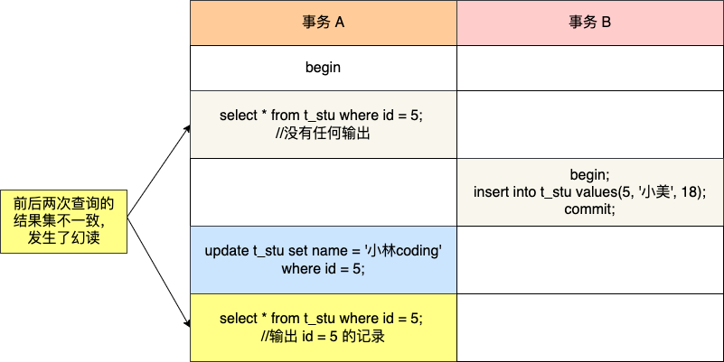
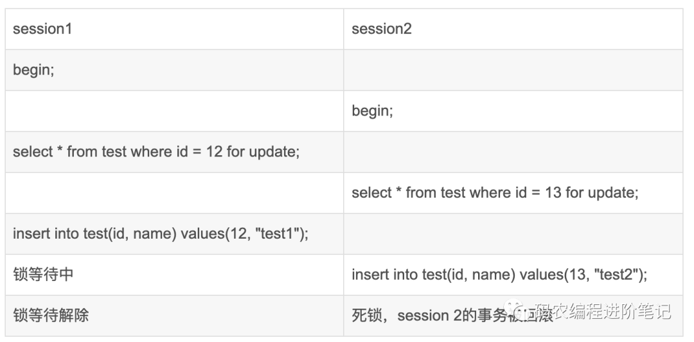

本文整理了 MySQL 的相关问题，以便更深入掌握 MySQL。

<!-- More -->


1. SQL 语句分类？

   主要分为三类，DDL，DML 和 DCL。

2. 内连接和外连接的区别？

   内连接只包含符合条件的元组，外连接则还包含了哪些不符合条件的元组。

3. 内连接中自然连接和等值连接的区别？

   自然连接会去除相同列，等值连接则不会。

4. Union 和 Union All 的区别？

   前者是集合并，后者是包并，后者执行速度更快。

5. MySQL 数值类型有哪些？

   TINYINT，SMALLINT，MEDIUMINT，INT，BIGINT，FLOAT，DOUBLE，DECIMAL。

6. DECIMAL（20，9）需要多少字节表示其数值部分？

   DECIMAL 采用四字节存储 9 位数字的方式进行存储，小数部分需要 4 字节，整数部分共 11 位，低 9 位 4 字节，高 3 位需要 2 字节，一共需要 4 + 4 + 2 = 10 字节。DECIMAL 负数存储只需要将每个字节取反即可。

7. INT(5) 和 INT 区别？

   表示数据上没有什么不同，INT(5) 在展示小于 5 位的数字时，会进行空格填充，并且依旧能够显示大于 5 位的整数。

8. MySQL 日期类型有哪些？

   DATE，TIME，YEAR，DATETIME，TIMESTAMP。

9. 在 MySQL 5.6 之前，为什么 DATE，TIME 各自需要 3 个字节，而 DATETIME 需要 8 个字节？

   DATE/TIME 是转换到对应天或者秒来计算的，只需要 3 个字节足矣；而 DATETIME 中 DATE 保存方式是 YYYY×10000 + MM×100 + DD，需要四字节，时间整数表示 HH×10000000 + MM×100000 + SS * 1000，同样四字节。

10. MySQL 中的字符串/字节串类型？

    CHAR，VARCHAR，TINYTEXT，TEXT，MEDIUMTEXT，LONGTEXT，TINYBLOB，BLOB，MEDIUMBLOB，LONGBLOB。

11. char(n) 和 varchar(n) 的区别？

    前者表示定长，数据长度不够时会补空格填充，后者则是变长，严格存储对应长度的字符串，还会记录 1 或 2 个字节的长度值。

12. MySQL 复合类型有哪些？

    ENUM 和 SET。ENUM 规定数据只能在枚举值中，并且存储上按照整数存储，因此 enum('male', 'female') 中的 male 实际存储的是 1，female 实际存储的是 2，`''` 空字符串存储 0，`NULL` 将被定义为 NULL。SET 则是定义集合，会自动去除重复值。

13. MySQL 中如何获取 DATETIME 类型对应的 DATE？

    可以通过 date_format(datetime, '%Y-%m-%d') 获取对应的字符串，然后通过 str_to_date 即可。

14. MySQL 有哪些存储引擎（表类型），各自的优缺点分别是什么？

    + MyISAM：不支持事务、也不支持外键，其优势是访问的速度快，对事务完整性没有要求或者以 SELECT、INSERT 为主的应用基本上都可以使用这个引擎创建表
    + InnoDB：提供了具有提交、回滚和崩溃恢复能力的事务安全，锁粒度可以达到行级锁。但是对比MyISAM 的存储引擎，InnoDB 写的处理效率差一些，并且会占用更多的磁盘空间以保留数据和索引
    + MEMORY：使用存在于内存中的内容来创建表。每个MEMORY 表只实际对应一个磁盘文件，格式是 `.frm`。MEMORY 类型的表访问非常快，因为它的数据是放在内存中的

15. TEXT 和 BLOB 的异同点？

    都是用于存储较大的数据，TEXT 用于存储字符数据，如一篇文章或者日记，BLOB 则用于存储二进制文件，如图片。

16. 为什么删除 TEXT 和 BLOB 数据后，需要及时使用 `OPTIMIZE TABLE` 命令？

    在执行删除操作之后，会在数据表中留下很大的空洞，可以定期使用 OPTIMIZE TABLE 来进行碎片整理。另外，可以将 TEXT 和 BLOB 列分离到单独的表中，减少主表的碎片。

17. 如何选择日期类型？

    根据实际需要选择能够满足应用的最小存储的日期类型。如果记录的日期需要让不同时区的用户使用，那么最好使用 TIMESTAMP，因为日期类型中只有它能够和实际时区相对应。

18. 如何选择字符集？

    如果需要处理各种各样的文字，选择 utf8 编码；如果应用涉及已有数据的导入，需要考虑兼容性；如果需要考虑对字符串的比较排序等操作，可以选择定长的编码集。

19. MySQL 中的字符集和校对规则区别？

    字符集用于定义 MySQL 存储字符串的编码格式，校对规则用来定义字符串的比较方式，通常以字符集开始，以 `_ci`（大小不敏感），`_cs` 或者 `bin` 结束。

20. MySQL 4 个级别的字符集设置？

    服务器级别，数据库级别，标记别和列级别。

21. 如果原来的数据库中存在部分数据，想要修改字符集，正确的做法是？

    直接使用 `alter database/table` 修改字符集并不能修改之前已经插入的字符串，需要先导出数据，然后手动修改字符集，最后再导入即可。

22. BTREE 索引和 HASH 索引区别？

    HASH 索引适用于点查询，BTREE 索引适用于范围查询。

23. 为什么说不要过度使用索引？

    每次插入数据的时候需要更新相关索引，造成插入速度变慢；并且还会消耗大量的磁盘空间。

24. MySQL 已经提供了表结构，为什么还提供视图这一概念？

    让终端用户直接使用视图而不是表，可以带来以下优点：简单，安全，数据独立。

25. 如何保证用户对视图里面的数据修改操作是合法的，满足视图定义条件的？

    可以添加 `WITH [LOCAL | CASCADE] CHECK OPTION`，用于是否允许更新数据使记录不再满足视图的条件，LOCAL 只需要满足本视图即可，CASCADE 则必须满足针对该视图的所有视图的条件才可以更新。

26. 触发器发生时间，针对的操作以及使用限制？

    `[BEFORE | AFTER] [INSERT | DELETE | UPDATE]`，在触发器中，可以使用 OLD 和 NEW 来引用发生变化的记录。触发器中不能显式或者隐式方式开启事务，并且其可能会影响性能。

27. MySQL 提供的锁定级别有哪些？

    对于 MyISAM 和 MEMORY 引擎，支持表级别锁定；对于 BDB 引擎，支持表数据的页级别锁定；对于 InnoDB 引擎，支持行级锁定。

28. MySQL 是如何支持分布式事务的？

    通常涉及到一个事务管理器和多个资源管理器，采用两阶段提交协议进行提交。

29. SQL 预计中存在的安全问题和应对方式？

    SQL 注入攻击，可以采取以下措施（基本都是进行转义）：

    + PrepareStatement + Bind-Variable：通过转义用户输入的参数防护
    + 使用应用程序提供的转换函数：如 `mysql_real_escape_string()`
    + 自定义：正则校验，特殊字符转义等

30. SQL Mode 的功能？

    + 设置不同的 SQL Mode，可以设置不同程度的数据校验，保证准确性
    + 在数据迁移之前，改变 SQL Mode 为其他数据库的数据格式，可以便于数据迁移

31. 什么是 MySQL 分区，分区有哪些好处？

    采用分而治之的思想，将表分成一系列的分区，分区对于应用来说是完全透明的，有利于管理非常大的表

    + 跨多个磁盘，能获得更大的吞吐量
    + 和单个磁盘相比，能存储更多的数据
    + 优化查询，删除等操作，如通过删除分区直接删除相关的数据

32. 常见的分区类型有哪些？

    RANGE 分区和 HASH 分区，前者指定连续区间范围，后者则是通过哈希算法将热点数据打散，确保负载均衡。另外也有 LIST 分区，COLUMNS 分区，KEY 分区。

33. InnoDB 引擎支持哈希索引吗？

    并不支持让用户定义一个索引的类型为哈希索引，但是其内部使用了自适应哈希算法，以加快查询语句的速度。

34. SQL 语句优化的一般步骤是什么？

    + 通过使用 `SHOW [SESSION | GLOBAL] STATUS` 命令了解各种 SQL 执行频率和执行信息
    + 定位执行效率缓慢的语句，可以通过启动慢查询日志来实现
    + 通过 explain 语句来分析低效 SQL 的执行计划，采取相应措施

35. 索引失效的常见场景？

    + 以 % 开头的 LIKE 查询不能够利用 B-Tree 索引
    + 数据类型出现隐式转换的时候也不会使用索引
    + 复合索引的情况下，不满足最左原则
    + 用 or 分割开的条件，如果 or 前的条件中的列有索引，而后面的列中没有索引

36. 如何优化分页查询？

    + 在索引上完成排序分页的操作，最后根据主键关联回原表查询所需要的其他列内容
    + 把 LIMIIT 查询转换成某个位置的查询，如根据上次的查询的最大 id 计算下一次的最大的值

37. 如何使用 SQL 语句提取随即行？

    使用 RAND() 提取随机行：

    + `select * from category order by rand() limit 10`，适用于小表
    + `select * from category where rand() <= 0.006 limit 10`，适用于大表

38. 如何对数据库进行优化？

    + 优化表的数据类型，如在设计表的时候需要考虑字段的长度留有一定的冗余
    + 通过拆分提高表的访问效率，如水平拆分和垂直拆分，缺点是查询所有数据需要联合
    + 逆规范化，规范化程度越高，产生的关系就越多，从而导致表之间的连接操作越频繁，而导致性能下降，可以考虑增加冗余列，派生列等
    + 使用中间表提高统计查询速度，如查询最近一周的消费情况，就可以在原来的消费表上建立起来，可以进行隔离，另外中间表上也可以添加索引

39. MySQL 中提供哪几种粒度的锁？

    + 表级锁：如 MyISAM 和 MEMORY 引擎，开销小，加锁快；不会出现死锁；锁定粒度大，发生锁冲突的概率最高，并发度最低
    + 行级锁：如 InnoDB 引擎，开销大，加锁慢；会出现死锁；锁定粒度最小，发生锁冲突的概率最低，并发度也最高
    + 页级锁：如 BDB 引擎，开销和加锁时间界于表锁和行锁之间；会出现死锁；锁定粒度界于表锁和行锁之间，并发度一般

40. MyISAM 如何加表锁的？

    + 隐式：执行查询语句时，自动加读锁；执行更新操作时，自动加写锁
    + 显式：LOCK TABLES tbl_name [READ | WRITE] [LOCAL]，LOCAL 参数允许用户在表尾并发插入记录

41. MyISAM 中的系统变量 concurrent_insert，作用是什么？

    用于控制并发插入：

    + 设置为 0 时，不允许并发插入
    + 设置为 1 时，如果 MyISAM 表中没有空洞(即表的中间没有被删除的行)，MyISAM允许在一个进程读表的同时，另一个进程从表尾插入记录。默认项
    + 设置为 2 时，无论 MyISAM 表中有没有空洞，都允许在表尾并发插入记录

42. MyISAM 中写锁优先还是读锁优先？能否进行配置？

    如果同时存在一个写进程和一个读进程获取相同项的锁，MySQL 会优先将锁给写进程。可以通过调整low-priority-updates变量改变调度行为。

43. InnoDB 存在哪些锁模式？

    行锁有共享锁和排他锁，表锁（意向锁）有 IS 和 IX 锁，意向锁是自动加的。对于更新操作，会加上 X 锁，对于普通的 SELECT 语句，则不会加任何锁，但是可以通过 SELECT ... LOCK IN SHARE MODE 获取 S 锁，通过 SELECT ... FOR UPDATE 获取 X 锁。

44. InnoDB 行锁有哪几种类型？

    + Record Lock：对索引项加锁
    + Gap Lock：对索引项之间的“间隙”、第一条记录前的“间隙”或最后一条记录后的“间隙”加锁
    + Next-key Lock：前两种的组合，对记录及其前面的间隙加锁

    行锁的实现方式是给索引上的索引项加锁来实现的，这意味着只有通过索引条件检索数据，InnoDB 才使用行级锁，否则，InnoDB 将使用表锁。

45. MySQL 中存在死锁吗？

    MyISAM 是 deadlock free 的，这是因为 MyISAM 一次获取需要的所有锁，而在InnoDB中，锁是逐步获得的。可以使用顺序加锁，申请大粒度锁等情况规避死锁。

46. MySQL 体系概览？

    

47. InnoDB log 优化方案？

    + innodb_flush_log_at_trx_commit：0 表示 commit 到 innodb 内存，每秒写入disk file，1 表示 commit 到 disk file，2 表示 commit 到 os cache，每秒写入 disk file
    + 设置 log file size，控制检查点：日志文件切换会导致检查点变化，会导致缓存页小批量刷新，降低性能，通常每半个小时写满一个日志文件较好
    + 调整 innodb_log_buffer_size：默认 8 MB，对于具有大量更新记录的事务，可以增加该值，减少对磁盘写入次数

48. MySQL 并发相关的参数？

    + 调整 max connections，提高并发连接
    + 调整 back_log：积压请求栈大小
    + 调整 table_open_cache：控制所有 SQL 执行线程可打开表缓存的数量
    + 调整 thread cache size
    + innod lock wait timeout，设置锁超时时间

49. MyISAM 如何进行内存优化？

    MyISAM 使用 key buffer 缓存索引块，对于数据块，则依赖于 IO 缓存，优化策略有：

    + 调整 key_buffer_size 大小
    + 调整中点插入策略：对 LRU 的改进
    + 调整 read_buffer_size 和 read_rnd_buffer_size

50. read_rnd_buffer_size 作用？

    可用于优化 order by 的语句，因为 sort 后的数据是以 key-value 的形式存在的，使用这些行指针去读取数据，将是以指针数据物理的顺序去读取，很大程度上是随机的方式读取数据的。MySQL 从 sort_buffer 中读取这些行指针数据，然后通过指针排序后存入 read_rnd_buffer 中，之后再通过指针读取数据时，基本上都是顺序读取了。

51. InnoDB 内存优化？

    用一块内存区做 IO 缓存池，该缓存池不仅用来缓存 InnoDB 的索引块，而且也用来缓存InnoDB的数据块，缓存池逻辑上由 free list、flush list 和 LRU list 组成。InnoDB 使用的 LRU 算法是类似两级队列的方法

    + innodb_buffer_pool_size
    + 调整 old sublist 大小
    + 调整 innodb_old_blocks_time 的设置：确定从 old sublist 到 young sublist 的时间
    + 调整缓存池数量 innodb_buffer_pool_instances
    + 控制 innodb buffer 刷新，延长数据缓存时间
    + 调整排序缓存大小 sort_buffer_size 和连接缓存大小 join_buffer_size
    + InnoDB doublewrite：原因是 MySQL 的数据页大小（一般是 16KB）与操作系统的 IO 数据页大小（一般是 4KB）不一致，无法保证 InnoDB 缓存页被完整、一致地刷新到磁盘。原理是用系统表空间中的一块连续磁盘空间（100个连续数据页，大小为 2MB）作为 doublewrite buffer，当进行脏页刷新时，首先将脏页的副本写到系统表空间的 doublewrite buffer 中，然后调用 fsync 刷新操作系统 IO 缓存，确保副本被真正写入磁盘。

52. MySQL 如何优化磁盘 IO 速度？

    + 使用 Symbolic Links 分布 IO：默认情况下，数据库名和表名对应的就是文件系统的目录名和文件名，但是这样不利于多磁盘并发读写的能力，可以使用符号链接将不同的数据库指向不同的物理磁盘，达到分布磁盘 IO 的目的。
    + 禁止操作系统更新文件的 atime 属性：LINUX 系统下，每次读取一个文件，操作系统就会将读操作的时间写回到磁盘上，这可能会影响 IO 性能。
    + 使用裸设备存放 InnoDB 的共享表空间：对于 MyISAM，数据文件的读写完全依赖于操作系统，但是对于 InnoDB 来说，其自己实现了数据缓存机制，操作系统的缓存系统可能对其有反作用，可将数据放倒 Raw Device 上。

53. 在应用层面上，如何对 MySQL 服务进行优化？

    + 使用连接池，减少建立销毁连接的开销
    + 减少对 MySQL 的访问：增加 CACHE 层，使用查询缓存（适用于更新不频繁的表）
    + 负载均衡：利用 MySQL 复制实现读写分流，采用分布式数据库架构

54. MySQL 常用工具？

    mysql，mysqladmin，mysqlbinlog，mysqldump，mysqlimport，mysqlshow。

55. MySQL 中存在哪些日志？

    + 错误日志：记录了当mysqld启动和停止时，以及服务器在运行过程中发生任何严重错误时的相关信息
    + 归档日志：记录了所有的 DDL（数据定义语言）语句和 DML（数据操纵语言）语句，但是不包括数据查询语句。此日志对于灾难时的数据恢复起着极其重要的作用。分为 STATMENT ，ROW，MIXED 格式
    + 查询日志：查询日志记录了客户端的所有语句，而二进制日志不包含只查询数据的语句
    + 慢查询日志：记录了所有执行时间超过参数 long_query_time 设置值并且扫描记录数不小于min_examined_row_limit 的所有 SQL 语句的日志。

56. MySQL 日志查询分析工具？

    mysql-explain-slow-log，myprofi，mysqlsla。

57. MySQL 中的逻辑备份和恢复如何实现？

    可以通过 mysqldump&mysqlimport 实现，另外还需要执行日志重做 `mysqlbinlog binlog-file | mysql -u root –p***`，可以采用基于时间点恢复或者基于位置恢复两种策略。

58. MySQL 中的物理备份和恢复如何实现？

    + 冷备份：就是停掉数据库服务，cp 数据文件的方法
    + 热备份：
      + InnoDB：使用 ibbackup 或者 Xtrabackup
      + MyISAM：本质是将要备份的表加读锁，然后再复制数据文件到备份目录

59. MySQL 如何实现表的导出和导入？

    + `SELECT …INTO OUTFILE … & LOAD DATA INFILE…  `
    + mysqldump & mysqlimport

60. MySQL 如何实现权限管理的？

    首先对连接的用户进行身份认证，然后对通过的用户赋予对应权限即可。在 MySQL 内部，存在 user，host 和 db 这三个权限表，对于通过认证的用户要查看某个权限只需要访问对应的权限列即可。

61. 忘记 MySQL 的 root 密码怎么办？

    首先手动 kill 掉 MySQL 进程，接着使用--skip-grant-tables选项重启登陆到 MySQL 服务，之后就可以更新密码，并且刷新权限表。

62. mysql.sock 丢失后如何连接数据库？

    使用其他协议如`--protocol=TCP|PIPE|SOCKET`。

63. MySQL 复制的优点？

    + 主库出现问题，可以切换到从库提供服务
    + 可以在从库上执行查询操作，降低主库的访问压力
    + 可以在从库上执行备份，以避免备份期间影响主库的服务

64. MySQL 如何进行复制的？

    首先，MySQL 主库会在数据变更的时候将其记录在 Binlog 中，主库推送 binlog 中的事件到从库的中继日志 Relay Log，之后从库根据 Relay Log 重做数据变更操作，通过逻辑复制以此达到数据一致。

    

65. MySQL 复制的三种架构？

    + 一主多从复制架构：对实时性要求不是特别高的读请求通过负载均衡分布到多个从库上，降低主库的读取压力
    + 多级复制架构：解决了一主多从场景下，主库的 I/O 负载和网络压力，当然也有缺点：MySQL 的复制是异步复制，多级复制场景下主库的数据是经历两次复制才到达从库
    + 双主复制：主库 Master1 和 Master2 互为主从，所有 Web Client 客户端的写请求都访问主库 Master1，而读请求可以选择访问主库 Master1 或 Master2

66. MySQL 三种复制模式？

    + 异步复制：主库在执行完客户端提交的事务后会立即将结果返给给客户端，并不关心从库是否已经接收并处理，主如果 crash 掉了，此时主上已经提交的事务可能并没有传到从库上，造成数据不一致
    + 全同步复制：当主库执行完一个事务，所有的从库都执行了该事务才返回给客户端。因为需要等待所有从库执行完该事务才能返回，所以全同步复制的性能必然会收到严重的影响
    + 半同步复制：主库只需要等待至少一个从库节点收到并且 Flush Binlog 到 Relay Log 文件即可，主库不需要等待所有从库给主库反馈

67. MySQL Cluster 如何实现？

    SQL 节点和数据节点。前台应用一定的负载均衡算法将对数据库的访问分散到不同的 SQL 节点上，然后 SQL 节点对数据节点进行数据访问并从数据节点返回结果，最后 SQL 节点将收到的结果返给前台应用。数据节点（NDB 节点）实现了数据的冗余存储。

68. 高可用架构有哪些？

    + MMM 架构：由于 MMM 无法完全地保证数据一致性，所以 MMM 适用于对数据的一致性要求不是很高，但是又想最大程度的的保证业务可用性的场景；对于那些对数据的一致性要求很高的业务，非常不建议采用 MMM 这种高可用性架构。
    + MHA 架构：目前在 MySQL 高可用方面是一个相对成熟的解决方案，MHA能在最大程度上保证数据的一致性，以达到真正意义上的高可用。其从宕机崩溃的 master 保存二进制日志事件，识别含有最新更新的 slave，应用差异的中继日志（relay log）到其他 slave，应用从 master 保存的二进制日志事件，提升一个 slave 为新 master，使其他的 slave 连接新的 master 进行复制。

69. 能说下 MyISAM 和 InnoDB 的区别吗？

    + MyISAM 支持全文索引，压缩表和空间函数等，但是不支持事务和行级锁，通常用于大量查询少量插入的场景，MyISAM 的索引和数据是分开的；
    + InnoDB 采用聚簇索引，其支持事务，外键和行级锁，并且通过 MVCC 来支持高并发。

70. 使用 VARCHAR(5) 和 VARCHAR(200) 存储 "hello" 的空间开销是一样的。那么使用更短的列有什么优势吗？

    事实证明有很大的优势。更长的列会消耗更多的内存，因为 MySQL 通常会分配固定大小的内存块来保存内部值。尤其是使用内存临时表进行排序或其他操作时会特别糟糕。在利用磁盘临时表进行排序时也同样糟糕。

71. 说下 MySQL 的索引有哪些吧，聚簇和非聚簇索引又是什么？

    索引按照数据结构来说主要分为 B+Tree 和哈希索引，聚簇索引是索引和数据存放在一起。

72. 主键索引自增有什么优点？

    在插入数据的时候，可以直接将数据追加到最后一个数据页里面，不涉及数据在数据页中的移动，如果不使用自增主键，在插入的时候可能会造成页分裂等耗时操作。

73. 空闲连接的查看和解决方式？

    通过 `show processlist` 查看空闲连接，MySQL 规定了空闲连接的默认最大时长（8 小时），用户也可主动在执行 `kill connection +<id>` 来终结空闲连接。

74. 那你知道什么是覆盖索引和回表吗？

    覆盖索引指的是通过索引就可以取到所需的数据，如果所需数据不能通过覆盖索引，就需要访问聚簇索引获取相应的数据，该行为称为回表。

75. 锁的类型有哪些呢？

    从粒度上，分为全局锁，表级锁，行锁；从加锁方式上，分为乐观锁和悲观锁；从是否共享，分为共享锁和排他锁。

76. 你能说下事务的基本特性和隔离级别吗？

    ACID，四种隔离级别分别消除了四种不一致现象。

77. 那ACID靠什么保证的呢？

    原子性通过 undolog 保证，隔离性通过 MVCC 和锁机制实现，持久性通过 redolog 实现，保证了事务的持久性、原子性、隔离性之后，一致性才能得到保障。

78. 那你说说什么是幻读，什么是MVCC？

    幻读是指两次读取中读到了新插入的数据行，MVCC 实际上是为每个版本添加创建时间版本号，过期时间版本号，只有满足一定要求的事务才能读到对应的版本。

79. 那你知道什么是 next-key lock 吗？

    next-key lock 是 RR 下才有的锁，结合 MVCC 可以解决幻读的问题，其在一定条件下能够退化成记录锁或间隙锁。

80. MySQL 记录锁+间隙锁可以防止删除操作而导致的幻读吗？

    可以，在 MySQL 的可重复读隔离级别下，针对「当前读」的查询语句会对索引加记录锁+间隙锁，这样可以避免其他事务执行「增、删、改」时导致幻读的现象。

81. 分析以下问题：

    + Q1: select * from t_table where a > 1 and b = 2，联合索引（a, b）哪一个字段用到了联合索引的 B+Tree？
    + Q2：select * from t_table where a >= 1 and b = 2，联合索引（a, b）哪一个字段用到了联合索引的 B+Tree？
    + Q3：SELECT * FROM t_table WHERE a BETWEEN 2 AND 8 AND b = 2，联合索引（a, b）哪一个字段用到了联合索引的 B+Tree？
    + Q4：SELECT * FROM t_user WHERE name like 'j%' and age = 22，联合索引（name, age）哪一个字段用到了联合索引的 B+Tree？

    答案：

    + Q1 只有 a 字段用到了联合索引进行索引查询，而 b 字段并没有使用到联合索引。
    + Q2 语句 a 和 b 字段都用到了联合索引进行索引查询（a = 1 时使用 b 字段索引）。
    + Q3 语句 a 和 b 字段都用到了联合索引进行索引查询（a = 2 或 a = 8 时使用 b 字段索引）。
    + Q4 语句 a 和 b 字段都用到了联合索引进行索引查询（对 name = j 的数据，此时使用 age）。

82. 为什么说 MySQL 单表最好不要超过 2000 万？

    MySQL 数据页大小大约是 16KB，分为索引页和数据页，索引页大约有 1000 数目，数据页假设有 16 条数据，对应的三层 B+ 树就是 1000 * 1000 * 16 = 1600 万，因此 MySQL 数据超过 2000 万可能会造成 B+ 树层数增加，而导致 IO 开销增大。

83. 你们数据量级多大？分库分表怎么做的？

    一般拆分顺序是先垂直后水平，水平分库一般通过哈希取模实现，为提高性能，可以引入一致性哈希。

84. 那分表后的自增 ID 怎么保证唯一性的呢？

    设定不同步长，分布式 ID 如雪花算法，不使用自增主键而是使用其他唯一数据列作为主键。

85. 分表后非 sharding_key 的查询怎么处理呢？

    对实时性要求不高的话，可以建立宽表；数据量不是很大的话，可以多线程扫表，然后再聚合结果。

86. 说说 mysql 主从同步怎么做的吧？

    主服务器写入 binglog 后，会创建 dump 线程推送其到从服务器，从服务器启动 IO 线程读取推送过来的 binglog，记录到 relay log 中继日志中，从服务器开启一个 sql 线程读取 relay log 并且执行，最后从服务器也记录自己的 binlog。主从同步分为全同步复制和半同步复制，前者需要所有从库执行完才返回客户端，后者至少收到一个从库的 ack 即可。

87. 那主从的延迟怎么解决呢？

    并不能解决，但是能尽量优化，如尽量减少或者不使用长事务。

88. 查询缓存的作用？

    查询的时候先查询缓存，但是在 MySQL 8.0 后，该功能被移除。缓存虽然能够提升数据库的查询性能，但是缓存同时也带来了额外的开销，每次查询后都要做一次缓存操作，失效后还要销毁。建议设置query_cache_type 变量为 DEMAND。

89. MySQL 引擎为什么采用该 B+ 树而不是 B 树？

    + B+ 树磁盘 IO 更低，其内部节点全部是指针，没有实际数据，能够更快找到元素
    + B+ 树查询效率更加稳定
    + B+ 树遍历效率高（叶子节点通过指针相连）

90. MySQL 中的索引有哪些？

    在存储层实现，不同的存储引擎具有不同的索引类型：

    + B+ 树索引：主索引通常是聚簇索引，辅助索引通常需要回表，覆盖索引，组合索引
    + 哈希索引：只支持点查询，不支持范围查询，同时不支持排序和分组操作
    + 全文索引：用于查找文本中的关键词，通常采用倒排索引实现
    + 空间数据索引（R-Tree）：多维索引，可用于存储地理数据

91. 如何对查询语句进行优化？

    + 减少请求的数据量，只返回必要的行数据和列数据
    + 减少服务器扫描的行数，尽量通过覆盖索引
    + 重构查询语句：切分大查询，分解大连接查询，将连接任务交给上层

92. 事务的特性以及隔离级别？

    ACID；未提交读，提交读，可重复读，可串行化。分别解决了脏读，不可重复读，幻读的问题。不可重复读和幻读容易混淆，不可重复读侧重于数据的修改，幻读侧重于数据的新增或删除。

93. 什么是第一，第二类丢失更新问题？

    第一类丢失更新：A 事务撤销时，把已经提交的 B 事务的更新数据覆盖了

    第二类丢失更新：A 事务覆盖 B 事务已经提交的数据，造成 B 事务所做操作丢失

94. InnoDB 引擎中的锁粒度？

    + Record Lock：锁定一个记录对应的索引，非主键索引加锁时可能也会对主键索引加锁
    + Gap Lock：锁定索引之间的间隙，但是不包含索引本身
    + Next-Key Lock：左开右闭区间，Gap Lock + Record Lock，加锁的基本单位

95. InnoDB 如何实现并发控制？

    每个记录后面加上两个隐藏的列：trx_id 和 roll_pointer，修改记录事务号，通过 undo 日志串联版本

    + 当前读：读取 ReadView 对应下合理的记录
    + 快照读：读取记录当前的最新版本数据，可通过 `lock in share mode, for update`

96. 数据切分的方式以及对应的优缺点？

    垂直切分：可以让数据从大表切分成多个小表，但是获取全部数据可能需要进行 join 连接

    水平切分：可以使用哈希取模，范围划分等方式，可以为表操作提供更高的吞吐率，但是可能需要引入分布式事务（XA 接口），需要在用户程序中进行连接，另外，需要生成唯一 ID，可以使用分布式 ID 生成器

97. MySQL 主从复制过程？

    主要涉及三个线程，binlog dump 线程，IO 线程和 SQL 线程：

    + IO 线程会请求 binlog，并且将得到的 binlog 写到本地的 relay-log 文件中
    + 主库中的 binlog dump 线程会给从库的 IO 线程传送 binlog
    + 从库中的 SQL 线程会读取 relay-log 文件中的日志，并且将其转换为 sql 语句逐一执行

98. 关系数据库设计范式，是否是范式越高越好？

    + 1NF：每个属性不可分割，可能存在数据冗余问题
    + 2NF：消除非主属性对码的部分函数依赖
    + 3NF：消除非主属性对于码的传递函数依赖，基本消除了各种异常
    + BCNF：主属性不依赖于主属性
    + 4NF：消除多值依赖

    并不是范式越高越好，因为当冗余信息有价值或者能大幅度提高查询效率的时候，我们就可以采取反范式设计的优化。

99. explain 语句的作用以及对应的执行列信息？

    可以使用 explain 分析 SQL 语句，查看执行计划，根据该信息进行优化。

    主要包括的列有：select_type，possible_keys，key，rows，type，extra。

100. explain 中的 type 列有哪些值？

     + system：只有一条数据的系统表
     + const：主键或者唯一索引查询
     + eq_ref：在进行联接查询时，使用主键或者唯一索引并且只匹配到一行记录的时候
     + ref：使用非唯一索引
     + range：索引范围查询
     + index：跟全表扫描类似，只是扫表是按照索引顺序进行
     + all：全表扫描，不走索引

101. explain 中的 extra 列有哪些值？

     + using filesort：需额外的排序操作, 不能通过索引顺序达到排序效果
     + using index：使用了覆盖索引
     + using where：使用了 where 过滤数据
     + using index condition：使用了索引，但是需要回表
     + using temporary：建立临时表(temporary table)来暂存中间结果
     + using join buffer：需要进行嵌套循环计算

102. 使用索引的优缺点？

     优点：提高数据检索的速度，降低 IO 成本；还能对数据进行排序，降低排序查询语句的执行时间

     缺点：会占用部分空间；虽然提高了查询效率，但是降低了数据更新的效率

103. MyISAM 索引和 InnoDB 索引有什么区别？

     MyISAM 索引：索引和数据分开存储在不同的文件中，叶子节点记录的是磁盘地址

     InnoDB 索引：叶子节点存储的数据是整行的数据，称之为聚簇索引，为此，普通索引需要进行回表操作

104. 假设存在表 t(a, b, c, d)，其中以 a 创建主键索引，以 (b, c, d) 创建组合索引，语句 select * from t where c = 0 执行过程中，有以下问题：

     1. 上述条件查询并不满足最左匹配原则，为什么查询的时候使用了索引？
     2. 为这个表增加 e 字段后，上述查询为什么变为全表扫描？

     联合索引中有查询需要所有数据项，可以使用覆盖索引，但是其并不满足最左匹配，因此 type 是 index，而不是 ref，同时，组合索引中叶子节点信息量更大，主索引通常还包括了版本信息，事务 id，回流指针等等，因此选择组合索引；

     加入 e 字段后，就不能使用覆盖索引了，此时就只能进行全表扫描。

105. SQL 查询语句执行过程？

     通过连接器进行用户权限检查；检查缓存；词法语法分析，检查 SQL 语句正确性；优化器找到最佳的物理执行计划；调用存储引擎接口进行查询，返回结果

106. 慢 SQL 是什么，有什么危害，可能有哪些原因造成的，如何预防？

     慢 SQL 就是执行时间远大于正常值的 SQL 语句；在高并发情况下，慢 SQL 出现后会阻塞大量正常的请求，造成大面积的超时和失败；可能由于创建太多索引，造成更新操作效率下降，或者是查询语句发生了索引失效；预防方式是打开慢 SQL 日志，设置慢 SQL 执行时间阈值，之后使用 explain 命令查看原因，今早优化慢 SQL 语句。

107. MySQL 索引失效发生的场景？

     + 对索引进行运算，使用函数
     + 对索引使用 <> 、not in 、not exist、!=
     + 对索引进行前导模糊查询
     + 隐式转换会导致不走索引，如 `select '10' > 9` 会返回 1，说明字符串转换为数字格式
     + 非索引字段的 or 连接
     + 非最左前缀

108. 假设存在表 t_record(id, age, name)，id 上存在主索引，age 上存在辅助索引，下列语句

     ```mysql
     select * from t_record where age > 10 offset 10000 limit 10;
     ```

     在第一次执行的时候很慢，在第二次有了缓存之后却很快？有什么办法可以解决该问题？

     对于 MySQL，上述语句会使用 age 上的索引，首先找到满足 age > 10 的第一个数据，然后向后遍历 10000 项数据，并且对每一项数据，都会进行回表操作，即使我们不需要这些数据。这样的话引入了大量的随机 IO，自然速度变慢。

     + 产品上绕过，只提供上一页和下一页功能不需要回表，并且没有 offset，需要用户端配合

       ```mysql
       select * from t_record where id > last_id  limit 10;
       ```

     + 使用覆盖索引：不需要进行额外的回表操作，普适性更高

       ```mysql
       select * from t_record where id in
       (select id from t_record where age > 10 offset 10000 limit 10）;
       ```

109. InnoDB 是如何保证事务的 ACID 属性的？

     + 持久性是通过 redo log （重做日志）来保证的
     + 原子性是通过 undo log（回滚日志） 来保证的
     + 隔离性是通过 MVCC（多版本并发控制） 和锁机制来保证的
     + 一致性在满足持久性，原子性和隔离性情况下自然满足

110. 事务的隔离级别有哪些，分别是为了解决哪些问题？

     未提交读，提交读，可重复读，串行化；分别解决了脏读，不可重复读，幻读问题。

111. InnoDB 如何支持不同的隔离级别的？

     + 未提交读：直接读取最新的数据
     + 串行化：加读写锁实现
     + 读提交和可重复读：通过 Read View 实现，读提交在每次读数据前生成一个 Read View，可重复读则在启动事务时生成一个 Read View，在之后都使用该 Read View

112. MVCC 是如何实现的？

     通过表的隐藏列 trx_id 和 roll_pointer 实现，后者用于生成版本链，通过 trx_id 找到适应的版本数据。

113. ReadView 数据结构是怎样的，如何处理提交读和可重复读？

     ReadView 的数据结构：`(creator_trx_id, running_trx_ids, min_trx_id, max_trx_id)`，其中 max_trx_id 指的是创建 ReadView 时应该给下一个事务的 id 值：

     + 可重复读：遍历记录版本，直到找到 trx_id 小于等于 creator_trx_id 的记录
     + 读提交：遍历记录版本，直到找到 trx_id 小于 max_trx_id，并且其不在 running_trx_ids 列表中的记录

114. 什么是快照读，什么是当前读？

     + 当前读：每次读取的都是当前最新的数据，但是读的时候不允许写，写的时候也不允许读包括，加锁
       + select ... lock in share mode/select ... for update
       + update, delete, insert
     + 快照读：
       + 在 RC 下，快照读和当前读读取的数据是一样的，都是最新的
       + 在 RR 下（默认隔离级别），有可能读取的不是最新的数据

115. next-key 锁加锁的对象是什么，对于 update 语句如果没有使用 where 语句，会发生什么？

     next-key 锁锁的是索引，而不是数据本身，如果 update 语句的 where 条件没有使用索引列，那么就会全表扫描，不仅加上行锁，还加上了间隙锁，相当于锁住整个表，直到事务结束时释放。因此，在线上千万不要执行没有带索引条件的 update 语句，不然会造成业务停滞。

116. InnoDB 是如何在可重复读的情况下消除幻读的？

     在可重复读隔离级别下，普通的查询语句是快照读，其是不会看到别的事务新的插入的数据的，幻读的现象只能在当前读下产生。InnoDB 为了防止该问题，采用了 next-key 锁，下面的事务 A 会锁住 (2, +inf) 范围的记录，如果该期间有其他事务在这个锁住的范围插入数据就会被阻塞，从而解决了幻读现象。

     | txn A                                                      | txn B                                                        |
     | ---------------------------------------------------------- | ------------------------------------------------------------ |
     | begin; <br />select name from stu where id > 2 for update; |                                                              |
     |                                                            | begin;<br />insert into stu values(5, "小飞");<br />BLOCKING |

     InnoDB 默认隔离级别是可重复读，但是很大程度上避免了幻读现象（并不是完全解决了）：

     + 针对快照读，通过 MVCC 方式解决
     + 针对当前读，通过 next-key 锁（记录锁 + 间隙锁）方式解决

117. InnoDB 在 RR 隔离级别下，幻读是否真的被解决了？

     没有，只是很大程度上避免了幻读，但是没有完全解决幻读，如

     

118. MySQL 中的锁类型有哪些？

     从锁粒度上看，主要可以分为全局锁，表级锁和行锁。

     全局锁：

     + 使用方法：`flush tables with read lock` 和 `unlock tables` 加锁和解锁，加锁后整个数据库就只处于只读状态，会阻塞其他线程对表的结构和数据的更改
     + 应用场景：全库逻辑备份，通常在不支持 MVCC 的引擎中使用，而对于像 InnoDB 引擎，可以在 mysqldump 时加上 `-single-transaction` 就能保证数据一致性
     + 缺点：整个数据库只读状态，可能会造成业务停滞

     表级锁：

     + 表锁：`lock tables t_name read/write`，其会限制本线程和其他线程的读写操作，可以通过 `unlock tables` 或者退出会话释放表锁

     + 元数据锁（MDL）：不需要显式使用 MDL，其根据如下规则加锁：

       + 对一张表进行 CRUD 操作时，加的是 MDL 读锁
       + 对一张表做结构变更操作的时候，加的是 MDL 写锁

       MDL 在事务提交后才会释放，另外，MDL 写锁获取的优先级高于读锁，一旦出现 MDL 写锁等待，会阻塞后续该表的所有 CRUD 操作

     + 意向锁：加锁规则如下：

       + 在对某些记录加上共享锁之前，需要先在表级别加上一个意向共享锁
       + 在对某些纪录加上独占锁之前，需要先在表级别加上一个意向独占锁

       注意，普通的 select 是不会加锁的，因为其是利用 MVCC 实现，可以通过 `lock in share mode` 或者 `select ... for update` 实现，意向共享锁和意向独占锁是表级锁，不会和行级的共享锁和独占锁发生冲突，而且意向锁之间也不会发生冲突，只会和共享表锁和独占表锁发生冲突，意向锁的目的是快速判断表里是否有记录被加锁

     + AUTO-INC 锁：该锁在执行完插入语句后就会释放，而不是提交事务时释放。由于其是表级锁，会影响并发插入的性能，因此，MySQL 5.2 后的版本提供了轻量级的锁，其在申请完自增主键后就立即释放锁资源，这样在并发插入的时候，不能保证自增长的值是连续的，这在主从赋值的场景中是不安全的。可以通过设置 binlog_format = row 保证一致性

     行级锁：InnoDB 才有，MyISAM 并没有行锁

     + 记录锁：锁住一条记录，作用在索引上，存在 S 锁和 X 锁之分

     + 间隙锁：锁定一个范围，间隙锁是兼容的，**两个不同的事务可以持有公共的间隙锁，间隙锁本质上用于阻止其他事务在该间隙内插入新记录，而自身事务允许在该间隙内插入数据**

     + Next-Key Lock：记录锁和间隙锁的组合，用左开右闭区间表示，是加锁的基本单位，但是可能会退化，普通的 select 语句是快照读，只有 `select .. in share mode` 和 `select ... for update` 才会加锁

     + 插入意向锁：特殊的间隙锁，不同于间隙锁的是，该锁只用于插入操作，一个事务拥有插入意向锁，另外一个事务便不能拥有对应的间隙锁，下图假设 test 中的 id 最大值是 10，由于加锁 （0， +inf）发生死锁：

       

119. MySQL 中的锁退化是什么？在不同索引类型下如果进行锁退化？

      next-key lock 退化成记录锁或间隙锁便是锁退化，在能使用记录锁或者间隙锁就能避免幻读现象的场景下，就能发生锁退化现象，在不同索引下：

     + 唯一索引等值查询：

       + 查询的记录存在：退化成记录锁
       + 查询的记录不存在：退化成间隙锁
     + 唯一索引范围查询（包含）：
       + 首先找到 min 对应的 next-key lock，如果 min 存在，退化成记录锁；最后找到 max 对应的 next-key lock，如果 max 不存在，退化成间隙锁
     + 非唯一索引等值查询：**对非唯一索引加锁时，其会同时对主键索引加记录锁**
       + 查询的记录存在：先加 next-key lock， 另外一把锁退化成间隙锁
       + 查询的记录不存在：退化成间隙锁
     + 非唯一索引范围查询：
       + next-key lock 不会退化

120. 在 MySQL 中如何分析加锁情况？

     通过 `select * from performance_schema.data_locks\G` 可以查看当前系统的加锁语句，其中重要的两个参数是 LOCK_TYPE 和 LOCK_MODE：

     + LOCK_TYPE：TABLE，RECORD（行级锁）
     + LOCK_MODE：
       + X：next_key 锁
       + X，REC_NOT_GAP：记录锁
       + X，GAP：间隙锁

121. 当执行 update 语句的时候，如果没有带上索引，会发生什么问题，如何缓解？

     可能会走全表扫描，从而导致全表加上了独占锁，导致业务停滞，通常可以使用以下方法避免该情况：

     + 开启安全更新模式，sql_safe_update 参数设置为 1，此时需要 update 有 where 或者 limit 子句
     + 如果带上索引，但是优化器选择走全表扫描，可以使用 force index 语句


