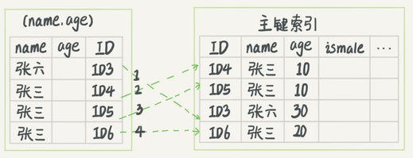

本文主要是对 MySQL实战 45 讲中内容的一些总结，以备查阅。

<!-- More -->

## 01 基础架构：SQL 查询语句如何执行


MySQL 基本架构图如上，大体上分为 Server 层和存储引擎层。前者涵盖了 MySQL 的大多数核心服务，如内置函数，跨存储引擎的功能，如存储过程，触发器，视图等 ；后者则是负责数据的存储和提取，其架构模式是插件式的，如 InnoDB，MyISAM，Memory 等，其中 InnoDB 从 MySQL 5.5 之后成为默认存储引擎。

考虑这样的一条语句：`select * from T where ID=10` ，了解一下每个组件的功能。

+ 连接器：用户在发送 SQL 语句前需要和 Server 端连接，TCP 连接之后，连接器对用户身份进行认证。在连接的时候尽量选择长连接，可能会发现 MySQL 的内存占用涨得很快，这是因为执行过程中的临时内存是管理在连接对象里面的。为了解决该问题，可以定期断开连接或者执行 `mysql-reset_connection` 

+ 查询缓存：MySQL 拿到一个查询请求后，先去查询缓存里面看看是不是已经执行过该语句，如果存在缓存则直接返回。不建议使用查询缓存，只要对一个表存在更新，这个表上的查询缓存就会被清空，性能提升不大，另外，从 MySQL 8.0 版本开始，不存在查询缓存组件

+ 分析器：首先进行词法分析，转换为单词流，之后再进行语法分析，判断语句是否满足 SQL 语法

+ 优化器：将上一步的语法树进行语义分析，决定如使用哪个索引或者如何进行 join 操作，生成执行计划

+ 执行器：开始执行之前，判断一下用户对该表有没有查询权限，即进行权限验证。假设 ID 字段无索引，那么执行流程如下：

  1. 调用 InnoDB 引擎接口取这个表的第一行，判断 ID 值是不是 10，如果不是则跳过，如果是则将这行存在结果集中
  2. 调用引擎接口取“下一行”，重复相同的判断逻辑，直到取到这个表的最后一行
  3. 执行器将上述遍历过程中所有满足条件的行组成的记录集作为结果集返回给客户端

  对于有索引的表，逻辑差不多相同，只不过会按照索引来进行遍历。
  
  

## 02 日志系统：SQL 更新语句如何执行

更新语句同样也需要经过连接器，分析器，优化器和执行器，不过不同于查询语句，其还设计到两个重要的日志模块：redo log（重做日志） 和 binlog（归档日志）。

### redo log

没有 redo log 的时候，每次更新一条数据都需要至少进行一次 IO 访问，降低了系统的性能，为此，可以采用redo log。当需要更新一条记录的时候，InnoDB 引擎会把记录写到 redo log 中，并且更新内存，这样就算更新完成了，之后，其会在适当的时候，将这个操作记录更新到磁盘里面。InnoDB 中的 redo log 可以组织为一个循环文件，写到结尾之后又从开头的地方写，如下图：


`write_pos` 是当前写指针的位置，`checkpoint` 是当前需要擦除的位置，注意擦除前需要将记录更新到数据文件。有了 redo log ，InnoDB 就可以保证即使数据库发生异常重启，之前提交的记录都不会丢失，该能力成为 carsh-safe。

redo log 也是将数据写到磁盘文件上，但是使用了顺序写和组提交，这是主要的优化部分。更多可以参考[该链接](http://catkang.github.io/2020/02/27/mysql-redo.html)。

### binlog

redo log 和 binlog 不同点如下：

+ redo log 是 InnoDB 独占的，binlog 是 Server 层实现，所有引擎都可以使用
+ redo log 是物理日志，记录的是“在某个数据页上做了什么修改”；binlog 是逻辑日志，记录语句的原始逻辑，比如“给 ID=2 这一行的某字段加 1”（binglog 有 statement 模式和 row 模式）
+ redo log 是循环写的，空间固定会用完；binlog是可以追加写入的
+ redo log 用于保证事务的一致性和提升更新操作的效率 ；binlog 主要用于备份和恢复数据使用

考虑语句 `update T set c=c+1 where ID=2`，其在执行器和 InnoDB 引擎内部流程：

1. 执行器先找引擎取ID=2这一行。ID是主键，引擎直接用树搜索找到这一行。如果ID=2这一行所在的数据页本来就在内存中，就直接返回给执行器；否则，需要先从磁盘读入内存，然后再返回。
2. 执行器拿到引擎给的行数据，把这个值加上1，比如原来是N，现在就是N+1，得到新的一行数据，再调用引擎接口写入这行新数据
3. 引擎将这行新数据更新到内存中，同时将这个更新操作记录到redo log里面，此时redo log处于prepare状态。然后告知执行器执行完成了，随时可以提交事务
4. 执行器生成这个操作的binlog，并把binlog写入磁盘
5. 执行器调用引擎的提交事务接口，引擎把刚刚写入的redo log改成提交（commit）状态，更新完成

### 两阶段提交

InnoDB 将 redo log 的分为 prepare 和 commit 状态，称为两阶段提交，主要目的是为了保证两份日志之间的逻辑一致。如果不采用两阶段提交，那么不管是先写redo log后写binlog，还是先写binlog后写redo log，只要在某个 log 写完之后发生重启，两种日志的恢复出来的状态并不一致。

有了两阶段提交的话，如果在第 4 步发生重启，那么由于 redo log 处于 prepare 状态，并且 binlog 失败，那么事务本身会回滚；如果在第 5 步发生重启，由于 redo log 已经处于 prepare 状态，并且存在相应的 binlog，那么重启后会自动 commit。


## 03 事务隔离

在 MySQL 中，事务支持是在存储引擎层实现的，因此，并不是所有的引擎都支持事务处理，如 MyISAM，这是其被 InnoDB 取代的原因之一。

### 隔离性与隔离级别

当多个事务并发进行处理的时候，可能会出现脏读，不可重复读，幻象问题，为了解决这些问题，引入了对应的隔离级别。SQL92 中定义了四种隔离级别：未提交读，提交读，可重复读和串行化。


+ 未提交读：v1 = 2，v2 = 2， v3 = 2
+ 提交读：v1 = 1，v2 = 2， v3 = 2
+ 可重复读：v1 =1，v2 = 1， v3 = 2
+ 串行化：v1 = 1，v2 = 1， v3 = 2（防止幻象）

### 事务隔离的实现

在实现上，数据库里面会创建一个视图，访问的时候以视图的逻辑结果为准。在“可重复读”隔离级别下，这个视图是在事务启动时创建的，整个事务存在期间都用这个视图。在“读提交”隔离级别下，这个视图是在每个SQL语句开始执行的时候创建的。这里需要注意的是，“读未提交”隔离级别下直接返回记录上的最新值，没有视图概念；而“串行化”隔离级别下直接用加锁的方式来避免并行访问。

在MySQL中，实际上每条记录在更新的时候都会同时记录一条回滚操作。记录上的最新值，通过回滚操作，都可以得到前一个状态的值。


回滚日志不能一直保存，当系统中没有比这个回滚日志更早的 read-view 的时候就会被清理掉。基于该事实，一般建议不要使用长事务。长事务意味着系统里面会存在很老的事务视图，可能会占用很大的空间，另外，长事务也会占用锁资源，可能会拖垮整个库。

### 事务启动方式

MySQL的事务启动方式有以下几种：

1. 显式启动事务语句， begin 或 start transaction。配套的提交语句是commit，回滚语句是rollback。
2. set autocommit=0，这个命令会将这个线程的自动提交关掉。意味着如果你只执行一个select语句，这个事务就启动了，而且并不会自动提交。这个事务持续存在直到你主动执行commit 或 rollback 语句，或者断开连接。

建议使用 `set autocommit=1`，显式处理事务流程，防止长事务的产生。


## 04 深入浅出索引（上）

索引的出现其实就是为了提高数据查询的效率，就像书的目录一样。

### 索引的常见模型

+ 哈希表：适用于等值查询，不适用于范围查询
+ 有序数组：在等值查询和范围查询场景中的性能就都非常优秀，但是只适用于静态存储引擎
+ 搜索树：搜索效率高，读写性能比较平衡，其中二叉树是搜索效率最高的，但是实际上大多数的数据库存储却并不使用二叉树。其原因是，索引不止存在内存中，还要写到磁盘上。为了减少访问磁盘的次数，应该尽量控制索引树的高度，因此使用 N 叉树，其中 N 的大小取决于数据块的大小。N叉树由于在读写上的性能优点，以及适配磁盘的访问模式，已经被广泛应用在数据库引擎中了。

### InnoDB 的索引模型

在InnoDB中，表都是根据主键顺序以索引的形式存放的，这种存储方式的表称为索引组织表。


从图中不难看出，根据叶子节点的内容，索引类型分为主键索引和非主键索引。

+ 主键索引的叶子节点存的是整行数据。在InnoDB里，主键索引也被称为聚簇索引（clustered index）。
+ 非主键索引的叶子节点内容是主键的值。在InnoDB里，非主键索引也被称为二级索引（secondary index）。

基于非主键索引的查询需要多扫描一棵索引树（回表操作），在应用中应该尽量使用主键查询。

### 索引维护

InnoDB 的索引结构是 B+ 树，如果新插入的数据所在的数据页已经满了，则需要进行页分裂操作。除了性能外，页分裂操作还影响数据页的利用率。当然，也存在页合并操作。

索引可能因为删除，或者页分裂等原因，导致数据页有空洞，重建索引的过程会创建一个新的索引，把数据按顺序插入，这样页面的利用率最高，也就是索引更紧凑、更省空间。需要注意的是，重建聚簇索引会将整个表重建，意味着二级索引也会被重建。

使用自增主键可以保证递增插入，不会触发页分裂操作，而且在某些情况下，使用自增主键比使用其他唯一主键节省空间，因为主键长度越小，普通索引的叶子节点就越小，普通索引占用的空间也就越小。

当然，如果在典型的 KV 场景下（有且仅有一个唯一索引），可以直接使用业务字段作为主键。


## 05 深入浅出索引（下）

当在二级索引 k 上查找 `select * from T where k between 3 and 5`，由于叶子节点记录的是主键，还需要回表进行数据的获取。

### 覆盖索引

如果执行 `select ID from T where k between 3 and 5`，由于需要的数据在二级索引叶子节点上，此时不需要回表，称为覆盖索引。覆盖索引可以减少树的搜索次数，显著提升查询性能，所以使用覆盖索引是一个常用的性能优化手段。具体来讲，便是创建联合索引。

### 最左前缀原则

不只是索引的全部定义，只要满足最左前缀，就可以利用索引来加速检索。这个最左前缀可以是联合索引的最左 N 个字段，也可以是字符串索引的最左 M 个字符。

### 索引下推

假设存在 （name，age）的联合索引，需要执行 `select * from tuser where name like '张%' and age=10 and ismale=1`，首先根据前缀索引原则，找到 ‘张’ 开始记录，然后依次判断其他条件是否满足：

+ 在MySQL 5.6之前，只能从ID3开始一个个回表。到主键索引上找出数据行，再对比字段值
+ 而MySQL 5.6 引入的索引下推优化， 可以在索引遍历过程中，对索引中包含的字段先做判断，直接过滤掉不满足条件的记录，减少回表次数

下图是未执行索引下推的示意图：



下图是执行了索引下推的示意图：


### 问题

已经存在（a，b）联合主键，并且存在 c 二级索引，那么对于以下查询需求，（c，a）和（c，b）联合索引是否必要？

```sql
select * from geek where c=N order by a limit 1;
select * from geek where c=N order by b limit 1;
```

答案是（c，a）索引没有存在的必要，找到 `c = N` 的记录后可以直接回表，是按照 a 排序的，符合最左前缀，但是（c，b）需要存在。


##  06 全局锁和表锁

数据库锁设计的初衷是处理并发问题，并发时需要合理控制资源的访问规则，而锁就是用来实现这些访问规则的重要数据结构。

### 全局锁

全局锁就是对整个数据库实例加锁，MySQL 提供加全局读锁的方法，命令是 `Flush tables with read lock `(FTWRL)，该命令会让整个库处于只读状态。

全库逻辑备份方案：

+ FTWRL：整个数据库只读，会降低系统性能甚至拖垮数据库
+ mysqldump：使用参数 `--single-transaction`，导数据之前就会启动一个事务，来确保拿到一致性视图（可重复读级别下开启事务），需要引擎支持 RR 隔离级别

全库只读另外一个命令`set global readonly=true`，但是不推荐使用，主要有

+ 在有些系统中，readonly的值会被用来做其他逻辑，比如用来判断一个库是主库还是备库
+ 在异常处理机制上有差异。如果执行 FTWRL 命令之后由于客户端发生异常断开，那么MySQL会自动释放这个全局锁，整个库回到可以正常更新的状态。而将整个库设置为readonly之后，如果客户端发生异常，则数据库就会一直保持readonly状态，这样会导致整个库长时间处于不可写状态，风险较高

### 表级锁

MySQL里面表级别的锁有两种：一种是表锁，一种是元数据锁（meta data lock，MDL)。

表锁的语法是 lock tables … read/write，同 FTWRL 一样，在客户端断开的时候自动释放。

MDL 则不需要显式使用，在访问一个表的时候会被自动加上，保证读写的正确性。MySQL 5.5版本中引入了MDL，当对一个表做增删改查操作的时候，加 MDL 读锁；当要对表做结构变更操作的时候，加 MDL 写锁。事务中的MDL锁，在语句执行开始时申请，但是语句结束后并不会马上释放，而会等到整个事务提交后再释放。

如何安全地给小表加字段？首先要解决长事务，如果要变更的表是一个热点表，虽然数据量不大，但是上面的请求很频繁，此时可以使用 DDL NOWAIT/WAIT n 语法，等待一段时间，如果还是没有获取到，先放弃。之后开发人员或者DBA再通过重试命令重复这个过程。

### 问题

备份一般都会在备库上执行，你在用–single-transaction方法做逻辑备份的过程中，如果主库上的一个小表做了一个DDL，比如给一个表上加了一列。这时候，从备库上会看到什么现象呢？

```sql
Q1:SET SESSION TRANSACTION ISOLATION LEVEL REPEATABLE READ;
Q2:START TRANSACTION  WITH CONSISTENT SNAPSHOT；
/* other tables */
Q3:SAVEPOINT sp;
/* 时刻 1 */
Q4:show create table `t1`;
/* 时刻 2 */
Q5:SELECT * FROM `t1`;
/* 时刻 3 */
Q6:ROLLBACK TO SAVEPOINT sp; /* release MDL */
/* 时刻 4 */
/* other tables */
```

参考答案如下：

1. 如果在Q4语句执行之前到达，现象：没有影响，备份拿到的是DDL后的表结构。
2. 如果在“时刻 2”到达，则表结构被改过，Q5执行的时候，报 Table definition has changed, please retry transaction，现象：mysqldump终止；
3. 如果在“时刻2”和“时刻3”之间到达，mysqldump占着t1的MDL读锁，binlog被阻塞，现象：主从延迟，直到Q6执行完成。
4. 从“时刻4”开始，mysqldump释放了MDL读锁，现象：没有影响，备份拿到的是DDL前的表结构。


## 07 行锁功过：怎么减少行锁对性能的影响

MySQL的行锁是在引擎层由各个引擎自己实现的，InnoDB 引擎支持行锁，但是 MyISAM 引擎不支持行锁，这也是MyISAM被InnoDB替代的重要原因之一。

### 两阶段锁

下图展示两个事务的语句执行流程：


事务B的update语句会被阻塞，直到事务A执行commit之后，事务B才能继续执行。也就是说，在InnoDB事务中，行锁是在需要的时候才加上的，但并不是不需要了就立刻释放，而是要等到事务结束时才释放。这个就是两阶段锁协议。

根据该协议，为了提高并发速度，如果多个事务中需要锁多个行，要把最可能造成锁冲突、最可能影响并发度的锁尽量往后放。

另外，innodb 行级锁是通过锁索引记录实现的，如果update的列没建索引，innodb 内部是全表根据主键索引逐行扫描，逐行加锁，事务提交后释放锁。

### 死锁和死锁检测

当并发系统中不同线程出现循环资源依赖，涉及的线程都在等待别的线程释放资源时，就会导致这几个线程都进入无限等待的状态，称为死锁。出现死锁以后，有两种策略：

+ 直接进入等待，直到超时：`innodb_lock_wait_timeout`
+ 发起死锁检测，发现死锁后，主动回滚死锁链条中的某一个事务，让其他事务得以继续执行：`innodb_deadlock_detect`

正常情况下我们还是要采用第二种策略，但是在很多事务存在的情况下，死锁检测有很大的负担。为了解决由这种热点行更新导致的性能问题，一般有两种思路：

1. 一种头痛医头的方法，就是如果你能确保这个业务一定不会出现死锁，可以临时把死锁检测关掉
2. 另一个思路是控制并发度，如控制每个客户端的并发线程数量等


## 08 事务到底是隔离的还是不隔离的

假设初始时表中存在`<id, k>(1, 1), (2, 2)`数据，现在存在如下执行序列：


上图中的执行结果是事务 B 查到的 k 的值是 3，而事务 A 查到的 k 的值是 1。

在 MySQL 中，有两种视图的概念：

+ view，即用查询语句定义的虚拟表
+ consistent read view，即InnoDB在实现MVCC时用到的一致性读视图，用于支持 RC 和 RR隔离级别的实现

### 快照在 MVCC 里怎么工作的

在可重复读隔离级别下，事务在启动的时候就创建了一个整库快照。快照通过每个事务ID实现，它是在事务开始的时候向InnoDB的事务系统申请的，并且按申请顺序严格递增的。每行数据也是有多个版本的，每个版本有自己的 row trx id。


实际上，上图中的三个虚线箭头就是 undo log，而V1、V2、V3并不是物理上真实存在的，而是每次需要的时候根据当前版本和undo log计算出来的。另外，InnoDB 会为每个事务构造一个数组，用来保存这个事务启动瞬间，当前正在“活跃”的所有事务ID。“活跃”指的就是，启动了但还没提交。数组里面事务ID的最小值记为低水位，当前系统里面已经创建过的事务ID的最大值加1记为高水位。判断某个事务是否可见便是根据该数组和高低水位控制的。另外，事务总是能够看到自己修改过的值。

### 更新逻辑

更新逻辑和查询逻辑不同，查询遵循一致性读，但是更新只会读最新已提交值（前提是已经获取到了行锁），否则的话可能会造成丢失更新问题。这就是为什么 B 事务查询到的 k 值是 3。select 语句加上 lock in share mode 或 for update 也会读到 3 ，分别加了 S 锁和 X 锁。

如果存在以下执行语句：


那么这时两阶段锁协议就派上用场了，事务 C' 在没有提交前，事务B会进行锁等待。

### RC 和 RR

RC 和 RR 的逻辑类似，主要的区别是：

+ 在可重复读隔离级别下，只需要在事务开始的时候创建一致性视图，之后事务里的其他查询都共用这个一致性视图
+ 在读提交隔离级别下，每一个语句执行前都会重新算出一个新的视图

### 问题

假设某用户在 RR 级别下，在客户端执行：

```sql
insert into t(id, c) values(1,1),(2,2),(3,3),(4,4);
begin;
update t set c=0 where id=c;
select * from t;
commit;
```

第 4 行发现表中数据没有变化，这是为什么？

解析：RR 下，用另外一个事物在update执行之前，先把所有c值修改，应该就可以，比如先执行`update t set c = id + 1`。


## 09 普通索引和唯一索引，应该怎么选择

假设存在 t(ID, k) 表，其索引结构如下：


对于查询过程，若 k 是

+ 普通索引：查找到满足条件的第一个记录(5,500)后，需要查找下一个记录，直到碰到第一个不满足k=5条件的记录
+ 唯一索引来说：由于索引定义了唯一性，查找到第一个满足条件的记录后，就会停止继续检索

两者性能差别不大（数据库按照页为单位读取数据）。

对于插入过程 (4, 400)，若 k 是

+ 普通索引：如果记录要更新的目标页在内存中，找到3和5之间的位置，插入这个值，语句执行结束；否则，将更新记录在change buffer，语句结束
+ 唯一索引：如果记录要更新的目标页在内存中，找到3和5之间的位置，判断到没有冲突，插入这个值，语句执行结束；否则，将数据页读入内存，判断到没有冲突，插入这个值，语句执行结束

change buffer 相当于将插入操作推迟，减少或延迟了随机 IO 访问，并且其会在相应页因为查询操作读入内存时，执行 merge 操作，将修改后的数据写入到数据页中（也会更新 redo log）。注意其也会被写入到磁盘上。

由于唯一索引需要判断是否存在冲突，需要查看相关数据页，这时数据页已经在内存中了，没必要写到 change buffer 中，因此 change buffer 之用于唯一索引，并且为了提高效率，可以只用于写多读少的负载下。

假设想要插入 (id1, k1), (id2, k2)，k1所在的数据页在内存中，k2所在的数据页不在内存中，下图用于展示 change buffer 和 redo log 之间的关系：


上述过程实际上只涉及一次 IO 操作，即 redo log 的持久化，并且还是顺序写入。假设现在需要查询 k1, k2：


### 问题

change buffer 一开始是写内存的，那么如果这个时候机器掉电重启，会不会导致change buffer丢失呢？change buffer丢失可不是小事儿，再从磁盘读入数据可就没有了merge过程，就等于是数据丢失了。会不会出现这种情况呢？

解析：会导致change buffer丢失，会导致本次未完成的操作数据丢失，但不会导致已完成操作的数据丢失。change buffer中分两部分，一部分是本次写入未写完的，一部分是已经写入完成的。针对未写完的，此部分操作，还未写入redo log，因此事务还未提交，所以没影响；针对已经写完成的，可以通过redo log来进行恢复。综上，不会对数据库造成影响。


## 10 MySQL为什么有时候会选错索引

假设存在表 t(id, a, b)，三个字段上都有索引。使用 idata 过程插入 100000 行数据，并且数据按照整数递增，即 (1, 1, 1) 到 (100000, 100000, 100000) 。如果存在以下操作序列：


上面的 explain 语句将会展示该语句不会使用索引 a，造成上面现象的原因是优化器的错误分析。

优化器会根据扫描行数，使用临时表，是否排序等因素综合判断，以选择最合适的索引。扫描行数是根据统计值区分度基数（cardinality）来估算的，该基数越大，索引的效果越好。为了性能，该基数采样统计生成的。

回到以上操作序列，优化器预估的语句扫描时间：


上文中，尽管 rows 数据显示使用 a 索引会更好，但是优化器会将回表的时间开销也算进去，最终选择了 id 索引。

之所以索引 a 上数据是 37116，而非 10000，造成上述现象的原因：由于 session A 开启了事务并没有提交，之前插入的 10 万行数据是不能删除的，这样一来，之前的数据每一行都有两个版本，旧版本是delete之前的数据，新版本是标记为deleted的数据，这样，索引 a 上的数据就有两份。但是，对于主索引，主键是直接按照表的行数来估计的，而表的行数通过 `show table status` 语句实现，所以仍然是 100000 左右。

上文中优化器选错索引的原因在于没能准确地判断出扫描行数，可以使用 `analyze table t ` 来重新统计索引信息：


但是，对于以下命令：

```sql
select * from t where (a between 1 and 1000)  and (b between 50000 and 100000) 
	order by b limit 1;
```

优化器会选择 b 索引来使用，因为其认为使用 b 索引可以防止排序，尽管 b 索引需要的时间更长。

为了解决上述这种情况，即优化器选错索引的情况，可以

+ 使用 force index
+ 改写语句，引导优化器选择我们期望的索引，如将 `order by b limit 1` 改为 `order by b,a limit 1`
+ 新建一个索引，或者删除误用的索引


