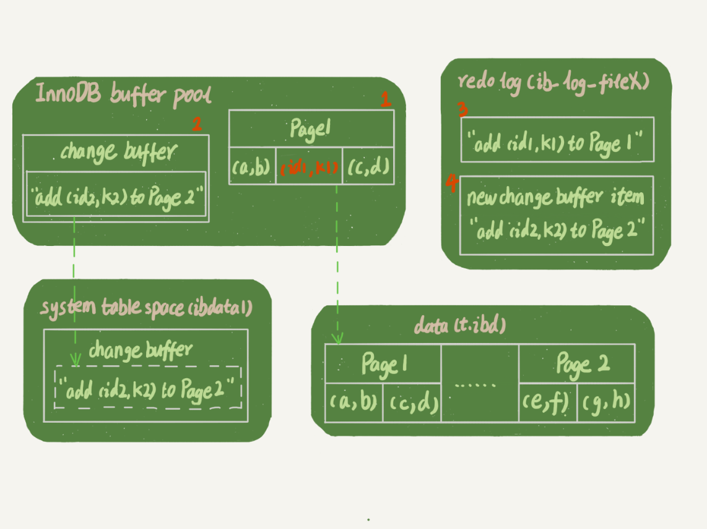
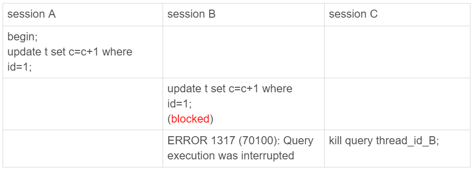

本文主要是对 MySQL实战 45 讲中内容的一些总结，以备查阅。

<!-- More -->

## 01 基础架构：SQL 查询语句如何执行


MySQL 基本架构图如上，大体上分为 Server 层和存储引擎层。前者涵盖了 MySQL 的大多数核心服务，如内置函数，跨存储引擎的功能，如存储过程，触发器，视图等 ；后者则是负责数据的存储和提取，其架构模式是插件式的，如 InnoDB，MyISAM，Memory 等，其中 InnoDB 从 MySQL 5.5 之后成为默认存储引擎。

考虑这样的一条语句：`select * from T where ID=10` ，了解一下每个组件的功能。

+ 连接器：用户在发送 SQL 语句前需要和 Server 端连接，TCP 连接之后，连接器对用户身份进行认证。在连接的时候尽量选择长连接，可能会发现 MySQL 的内存占用涨得很快，这是因为执行过程中的临时内存是管理在连接对象里面的。为了解决该问题，可以定期断开连接或者执行 `mysql-reset_connection` 

+ 查询缓存：MySQL 拿到一个查询请求后，先去查询缓存里面看看是不是已经执行过该语句，如果存在缓存则直接返回。不建议使用查询缓存，只要对一个表存在更新，这个表上的查询缓存就会被清空，性能提升不大，另外，从 MySQL 8.0 版本开始，不存在查询缓存组件

+ 分析器：首先进行词法分析，转换为单词流，之后再进行语法分析，判断语句是否满足 SQL 语法

+ 优化器：将上一步的语法树进行语义分析，决定如使用哪个索引或者如何进行 join 操作，生成执行计划

+ 执行器：开始执行之前，判断一下用户对该表有没有查询权限，即进行权限验证。假设 ID 字段无索引，那么执行流程如下：

  1. 调用 InnoDB 引擎接口取这个表的第一行，判断 ID 值是不是 10，如果不是则跳过，如果是则将这行存在结果集中
  2. 调用引擎接口取“下一行”，重复相同的判断逻辑，直到取到这个表的最后一行
  3. 执行器将上述遍历过程中所有满足条件的行组成的记录集作为结果集返回给客户端

  对于有索引的表，逻辑差不多相同，只不过会按照索引来进行遍历。
  
  

## 02 日志系统：SQL 更新语句如何执行

更新语句同样也需要经过连接器，分析器，优化器和执行器，不过不同于查询语句，其还设计到两个重要的日志模块：redo log（重做日志） 和 binlog（归档日志）。

### redo log

没有 redo log 的时候，每次更新一条数据都需要至少进行一次 IO 访问，降低了系统的性能，为此，可以采用redo log。当需要更新一条记录的时候，InnoDB 引擎会把记录写到 redo log 中，并且更新内存，这样就算更新完成了，之后，其会在适当的时候，将这个操作记录更新到磁盘里面。InnoDB 中的 redo log 可以组织为一个循环文件，写到结尾之后又从开头的地方写，如下图：


`write_pos` 是当前写指针的位置，`checkpoint` 是当前需要擦除的位置，注意擦除前需要将记录更新到数据文件。有了 redo log ，InnoDB 就可以保证即使数据库发生异常重启，之前提交的记录都不会丢失，该能力成为 carsh-safe。

redo log 也是将数据写到磁盘文件上，但是使用了顺序写和组提交，这是主要的优化部分。更多可以参考[该链接](http://catkang.github.io/2020/02/27/mysql-redo.html)。

### binlog

redo log 和 binlog 不同点如下：

+ redo log 是 InnoDB 独占的，binlog 是 Server 层实现，所有引擎都可以使用
+ redo log 是物理日志，记录的是“在某个数据页上做了什么修改”；binlog 是逻辑日志，记录语句的原始逻辑，比如“给 ID=2 这一行的某字段加 1”（binglog 有 statement 模式和 row 模式）
+ redo log 是循环写的，空间固定会用完；binlog是可以追加写入的
+ redo log 用于保证事务的一致性和提升更新操作的效率 ；binlog 主要用于备份和恢复数据使用

考虑语句 `update T set c=c+1 where ID=2`，其在执行器和 InnoDB 引擎内部流程：

1. 执行器先找引擎取ID=2这一行。ID是主键，引擎直接用树搜索找到这一行。如果ID=2这一行所在的数据页本来就在内存中，就直接返回给执行器；否则，需要先从磁盘读入内存，然后再返回。
2. 执行器拿到引擎给的行数据，把这个值加上1，比如原来是N，现在就是N+1，得到新的一行数据，再调用引擎接口写入这行新数据
3. 引擎将这行新数据更新到内存中，同时将这个更新操作记录到redo log里面，此时redo log处于prepare状态。然后告知执行器执行完成了，随时可以提交事务
4. 执行器生成这个操作的binlog，并把binlog写入磁盘
5. 执行器调用引擎的提交事务接口，引擎把刚刚写入的redo log改成提交（commit）状态，更新完成

### 两阶段提交

InnoDB 将 redo log 的分为 prepare 和 commit 状态，称为两阶段提交，主要目的是为了保证两份日志之间的逻辑一致。如果不采用两阶段提交，那么不管是先写redo log后写binlog，还是先写binlog后写redo log，只要在某个 log 写完之后发生重启，两种日志的恢复出来的状态并不一致。

有了两阶段提交的话，如果在第 4 步发生重启，那么由于 redo log 处于 prepare 状态，并且 binlog 失败，那么事务本身会回滚；如果在第 5 步发生重启，由于 redo log 已经处于 prepare 状态，并且存在相应的 binlog，那么重启后会自动 commit。


## 03 事务隔离

在 MySQL 中，事务支持是在存储引擎层实现的，因此，并不是所有的引擎都支持事务处理，如 MyISAM，这是其被 InnoDB 取代的原因之一。

### 隔离性与隔离级别

当多个事务并发进行处理的时候，可能会出现脏读，不可重复读，幻象问题，为了解决这些问题，引入了对应的隔离级别。SQL92 中定义了四种隔离级别：未提交读，提交读，可重复读和串行化。


+ 未提交读：v1 = 2，v2 = 2， v3 = 2
+ 提交读：v1 = 1，v2 = 2， v3 = 2
+ 可重复读：v1 =1，v2 = 1， v3 = 2
+ 串行化：v1 = 1，v2 = 1， v3 = 2（防止幻象）

### 事务隔离的实现

在实现上，数据库里面会创建一个视图，访问的时候以视图的逻辑结果为准。在“可重复读”隔离级别下，这个视图是在事务启动时创建的，整个事务存在期间都用这个视图。在“读提交”隔离级别下，这个视图是在每个SQL语句开始执行的时候创建的。这里需要注意的是，“读未提交”隔离级别下直接返回记录上的最新值，没有视图概念；而“串行化”隔离级别下直接用加锁的方式来避免并行访问。

在MySQL中，实际上每条记录在更新的时候都会同时记录一条回滚操作。记录上的最新值，通过回滚操作，都可以得到前一个状态的值。


回滚日志不能一直保存，当系统中没有比这个回滚日志更早的 read-view 的时候就会被清理掉。基于该事实，一般建议不要使用长事务。长事务意味着系统里面会存在很老的事务视图，可能会占用很大的空间，另外，长事务也会占用锁资源，可能会拖垮整个库。

### 事务启动方式

MySQL的事务启动方式有以下几种：

1. 显式启动事务语句， begin 或 start transaction。配套的提交语句是commit，回滚语句是rollback。
2. set autocommit=0，这个命令会将这个线程的自动提交关掉。意味着如果你只执行一个select语句，这个事务就启动了，而且并不会自动提交。这个事务持续存在直到你主动执行commit 或 rollback 语句，或者断开连接。

建议使用 `set autocommit=1`，显式处理事务流程，防止长事务的产生。


## 04 深入浅出索引（上）

索引的出现其实就是为了提高数据查询的效率，就像书的目录一样。

### 索引的常见模型

+ 哈希表：适用于等值查询，不适用于范围查询
+ 有序数组：在等值查询和范围查询场景中的性能就都非常优秀，但是只适用于静态存储引擎
+ 搜索树：搜索效率高，读写性能比较平衡，其中二叉树是搜索效率最高的，但是实际上大多数的数据库存储却并不使用二叉树。其原因是，索引不止存在内存中，还要写到磁盘上。为了减少访问磁盘的次数，应该尽量控制索引树的高度，因此使用 N 叉树，其中 N 的大小取决于数据块的大小。N叉树由于在读写上的性能优点，以及适配磁盘的访问模式，已经被广泛应用在数据库引擎中了。

### InnoDB 的索引模型

在InnoDB中，表都是根据主键顺序以索引的形式存放的，这种存储方式的表称为索引组织表。


从图中不难看出，根据叶子节点的内容，索引类型分为主键索引和非主键索引。

+ 主键索引的叶子节点存的是整行数据。在InnoDB里，主键索引也被称为聚簇索引（clustered index）。
+ 非主键索引的叶子节点内容是主键的值。在InnoDB里，非主键索引也被称为二级索引（secondary index）。

基于非主键索引的查询需要多扫描一棵索引树（回表操作），在应用中应该尽量使用主键查询。

### 索引维护

InnoDB 的索引结构是 B+ 树，如果新插入的数据所在的数据页已经满了，则需要进行页分裂操作。除了性能外，页分裂操作还影响数据页的利用率。当然，也存在页合并操作。

索引可能因为删除，或者页分裂等原因，导致数据页有空洞，重建索引的过程会创建一个新的索引，把数据按顺序插入，这样页面的利用率最高，也就是索引更紧凑、更省空间。需要注意的是，重建聚簇索引会将整个表重建，意味着二级索引也会被重建。

使用自增主键可以保证递增插入，不会触发页分裂操作，而且在某些情况下，使用自增主键比使用其他唯一主键节省空间，因为主键长度越小，普通索引的叶子节点就越小，普通索引占用的空间也就越小。

当然，如果在典型的 KV 场景下（有且仅有一个唯一索引），可以直接使用业务字段作为主键。


## 05 深入浅出索引（下）

当在二级索引 k 上查找 `select * from T where k between 3 and 5`，由于叶子节点记录的是主键，还需要回表进行数据的获取。

### 覆盖索引

如果执行 `select ID from T where k between 3 and 5`，由于需要的数据在二级索引叶子节点上，此时不需要回表，称为覆盖索引。覆盖索引可以减少树的搜索次数，显著提升查询性能，所以使用覆盖索引是一个常用的性能优化手段。具体来讲，便是创建联合索引。

### 最左前缀原则

不只是索引的全部定义，只要满足最左前缀，就可以利用索引来加速检索。这个最左前缀可以是联合索引的最左 N 个字段，也可以是字符串索引的最左 M 个字符。

### 索引下推

假设存在 （name，age）的联合索引，需要执行 `select * from tuser where name like '张%' and age=10 and ismale=1`，首先根据前缀索引原则，找到 ‘张’ 开始记录，然后依次判断其他条件是否满足：

+ 在MySQL 5.6之前，只能从ID3开始一个个回表。到主键索引上找出数据行，再对比字段值
+ 而MySQL 5.6 引入的索引下推优化， 可以在索引遍历过程中，对索引中包含的字段先做判断，直接过滤掉不满足条件的记录，减少回表次数

下图是未执行索引下推的示意图：


下图是执行了索引下推的示意图：


### 问题

已经存在（a，b）联合主键，并且存在 c 二级索引，那么对于以下查询需求，（c，a）和（c，b）联合索引是否必要？

```sql
select * from geek where c=N order by a limit 1;
select * from geek where c=N order by b limit 1;
```

答案是（c，a）索引没有存在的必要，找到 `c = N` 的记录后可以直接回表，是按照 a 排序的，符合最左前缀，但是（c，b）需要存在。


##  06 全局锁和表锁

数据库锁设计的初衷是处理并发问题，并发时需要合理控制资源的访问规则，而锁就是用来实现这些访问规则的重要数据结构。

### 全局锁

全局锁就是对整个数据库实例加锁，MySQL 提供加全局读锁的方法，命令是 `Flush tables with read lock `(FTWRL)，该命令会让整个库处于只读状态。

全库逻辑备份方案：

+ FTWRL：整个数据库只读，会降低系统性能甚至拖垮数据库
+ mysqldump：使用参数 `--single-transaction`，导数据之前就会启动一个事务，来确保拿到一致性视图（可重复读级别下开启事务），需要引擎支持 RR 隔离级别

全库只读另外一个命令`set global readonly=true`，但是不推荐使用，主要有

+ 在有些系统中，readonly的值会被用来做其他逻辑，比如用来判断一个库是主库还是备库
+ 在异常处理机制上有差异。如果执行 FTWRL 命令之后由于客户端发生异常断开，那么MySQL会自动释放这个全局锁，整个库回到可以正常更新的状态。而将整个库设置为readonly之后，如果客户端发生异常，则数据库就会一直保持readonly状态，这样会导致整个库长时间处于不可写状态，风险较高

### 表级锁

MySQL里面表级别的锁有两种：一种是表锁，一种是元数据锁（meta data lock，MDL)。

表锁的语法是 lock tables … read/write，同 FTWRL 一样，在客户端断开的时候自动释放。

MDL 则不需要显式使用，在访问一个表的时候会被自动加上，保证读写的正确性。MySQL 5.5版本中引入了MDL，当对一个表做增删改查操作的时候，加 MDL 读锁；当要对表做结构变更操作的时候，加 MDL 写锁。事务中的MDL锁，在语句执行开始时申请，但是语句结束后并不会马上释放，而会等到整个事务提交后再释放。

如何安全地给小表加字段？首先要解决长事务，如果要变更的表是一个热点表，虽然数据量不大，但是上面的请求很频繁，此时可以使用 DDL NOWAIT/WAIT n 语法，等待一段时间，如果还是没有获取到，先放弃。之后开发人员或者DBA再通过重试命令重复这个过程。

### 问题

备份一般都会在备库上执行，你在用–single-transaction方法做逻辑备份的过程中，如果主库上的一个小表做了一个DDL，比如给一个表上加了一列。这时候，从备库上会看到什么现象呢？

```sql
Q1:SET SESSION TRANSACTION ISOLATION LEVEL REPEATABLE READ;
Q2:START TRANSACTION  WITH CONSISTENT SNAPSHOT；
/* other tables */
Q3:SAVEPOINT sp;
/* 时刻 1 */
Q4:show create table `t1`;
/* 时刻 2 */
Q5:SELECT * FROM `t1`;
/* 时刻 3 */
Q6:ROLLBACK TO SAVEPOINT sp; /* release MDL */
/* 时刻 4 */
/* other tables */
```

参考答案如下：

1. 如果在Q4语句执行之前到达，现象：没有影响，备份拿到的是DDL后的表结构。
2. 如果在“时刻 2”到达，则表结构被改过，Q5执行的时候，报 Table definition has changed, please retry transaction，现象：mysqldump终止；
3. 如果在“时刻2”和“时刻3”之间到达，mysqldump占着t1的MDL读锁，binlog被阻塞，现象：主从延迟，直到Q6执行完成。
4. 从“时刻4”开始，mysqldump释放了MDL读锁，现象：没有影响，备份拿到的是DDL前的表结构。


## 07 行锁功过：怎么减少行锁对性能的影响

MySQL的行锁是在引擎层由各个引擎自己实现的，InnoDB 引擎支持行锁，但是 MyISAM 引擎不支持行锁，这也是MyISAM被InnoDB替代的重要原因之一。

### 两阶段锁

下图展示两个事务的语句执行流程：


事务B的update语句会被阻塞，直到事务A执行commit之后，事务B才能继续执行。也就是说，在InnoDB事务中，行锁是在需要的时候才加上的，但并不是不需要了就立刻释放，而是要等到事务结束时才释放。这个就是两阶段锁协议。

根据该协议，为了提高并发速度，如果多个事务中需要锁多个行，要把最可能造成锁冲突、最可能影响并发度的锁尽量往后放。

另外，innodb 行级锁是通过锁索引记录实现的，如果update的列没建索引，innodb 内部是全表根据主键索引逐行扫描，逐行加锁，事务提交后释放锁。

### 死锁和死锁检测

当并发系统中不同线程出现循环资源依赖，涉及的线程都在等待别的线程释放资源时，就会导致这几个线程都进入无限等待的状态，称为死锁。出现死锁以后，有两种策略：

+ 直接进入等待，直到超时：`innodb_lock_wait_timeout`
+ 发起死锁检测，发现死锁后，主动回滚死锁链条中的某一个事务，让其他事务得以继续执行：`innodb_deadlock_detect`

正常情况下我们还是要采用第二种策略，但是在很多事务存在的情况下，死锁检测有很大的负担。为了解决由这种热点行更新导致的性能问题，一般有两种思路：

1. 一种头痛医头的方法，就是如果你能确保这个业务一定不会出现死锁，可以临时把死锁检测关掉
2. 另一个思路是控制并发度，如控制每个客户端的并发线程数量等


## 08 事务到底是隔离的还是不隔离的

假设初始时表中存在`<id, k>(1, 1), (2, 2)`数据，现在存在如下执行序列：


上图中的执行结果是事务 B 查到的 k 的值是 3，而事务 A 查到的 k 的值是 1。

在 MySQL 中，有两种视图的概念：

+ view，即用查询语句定义的虚拟表
+ consistent read view，即InnoDB在实现MVCC时用到的一致性读视图，用于支持 RC 和 RR隔离级别的实现

### 快照在 MVCC 里怎么工作的

在可重复读隔离级别下，事务在启动的时候就创建了一个整库快照。快照通过每个事务ID实现，它是在事务开始的时候向InnoDB的事务系统申请的，并且按申请顺序严格递增的。每行数据也是有多个版本的，每个版本有自己的 row trx id。


实际上，上图中的三个虚线箭头就是 undo log，而V1、V2、V3并不是物理上真实存在的，而是每次需要的时候根据当前版本和undo log计算出来的。另外，InnoDB 会为每个事务构造一个数组，用来保存这个事务启动瞬间，当前正在“活跃”的所有事务ID。“活跃”指的就是，启动了但还没提交。数组里面事务ID的最小值记为低水位，当前系统里面已经创建过的事务ID的最大值加1记为高水位。判断某个事务是否可见便是根据该数组和高低水位控制的。另外，事务总是能够看到自己修改过的值。

### 更新逻辑

更新逻辑和查询逻辑不同，查询遵循一致性读，但是更新只会读最新已提交值（前提是已经获取到了行锁），否则的话可能会造成丢失更新问题。这就是为什么 B 事务查询到的 k 值是 3。select 语句加上 lock in share mode 或 for update 也会读到 3 ，分别加了 S 锁和 X 锁。

如果存在以下执行语句：


那么这时两阶段锁协议就派上用场了，事务 C' 在没有提交前，事务B会进行锁等待。

### RC 和 RR

RC 和 RR 的逻辑类似，主要的区别是：

+ 在可重复读隔离级别下，只需要在事务开始的时候创建一致性视图，之后事务里的其他查询都共用这个一致性视图
+ 在读提交隔离级别下，每一个语句执行前都会重新算出一个新的视图

### 问题

假设某用户在 RR 级别下，在客户端执行：

```sql
insert into t(id, c) values(1,1),(2,2),(3,3),(4,4);
begin;
update t set c=0 where id=c;
select * from t;
commit;
```

第 4 行发现表中数据没有变化，这是为什么？

解析：RR 下，用另外一个事物在update执行之前，先把所有c值修改，应该就可以，比如先执行`update t set c = id + 1`。


## 09 普通索引和唯一索引，应该怎么选择

假设存在 t(ID, k) 表，其索引结构如下：


对于查询过程，若 k 是

+ 普通索引：查找到满足条件的第一个记录(5,500)后，需要查找下一个记录，直到碰到第一个不满足k=5条件的记录
+ 唯一索引来说：由于索引定义了唯一性，查找到第一个满足条件的记录后，就会停止继续检索

两者性能差别不大（数据库按照页为单位读取数据）。

对于插入过程 (4, 400)，若 k 是

+ 普通索引：如果记录要更新的目标页在内存中，找到3和5之间的位置，插入这个值，语句执行结束；否则，将更新记录在change buffer，语句结束
+ 唯一索引：如果记录要更新的目标页在内存中，找到3和5之间的位置，判断到没有冲突，插入这个值，语句执行结束；否则，将数据页读入内存，判断到没有冲突，插入这个值，语句执行结束

change buffer 相当于将插入操作推迟，减少或延迟了随机 IO 访问，并且其会在相应页因为查询操作读入内存时，执行 merge 操作，将修改后的数据写入到数据页中（也会更新 redo log）。注意其也会被写入到磁盘上。

由于唯一索引需要判断是否存在冲突，需要查看相关数据页，这时数据页已经在内存中了，没必要写到 change buffer 中，因此 change buffer 之用于唯一索引，并且为了提高效率，可以只用于写多读少的负载下。

假设想要插入 (id1, k1), (id2, k2)，k1所在的数据页在内存中，k2所在的数据页不在内存中，下图用于展示 change buffer 和 redo log 之间的关系：



上述过程实际上只涉及一次 IO 操作，即 redo log 的持久化，并且还是顺序写入。假设现在需要查询 k1, k2：


### 问题

change buffer 一开始是写内存的，那么如果这个时候机器掉电重启，会不会导致change buffer丢失呢？change buffer丢失可不是小事儿，再从磁盘读入数据可就没有了merge过程，就等于是数据丢失了。会不会出现这种情况呢？

解析：会导致change buffer丢失，会导致本次未完成的操作数据丢失，但不会导致已完成操作的数据丢失。change buffer中分两部分，一部分是本次写入未写完的，一部分是已经写入完成的。针对未写完的，此部分操作，还未写入redo log，因此事务还未提交，所以没影响；针对已经写完成的，可以通过redo log来进行恢复。综上，不会对数据库造成影响。


## 10 MySQL为什么有时候会选错索引

假设存在表 t(id, a, b)，三个字段上都有索引。使用 idata 过程插入 100000 行数据，并且数据按照整数递增，即 (1, 1, 1) 到 (100000, 100000, 100000) 。如果存在以下操作序列：


上面的 explain 语句将会展示该语句不会使用索引 a，造成上面现象的原因是优化器的错误分析。

优化器会根据扫描行数，使用临时表，是否排序等因素综合判断，以选择最合适的索引。扫描行数是根据统计值区分度基数（cardinality）来估算的，该基数越大，索引的效果越好。为了性能，该基数采样统计生成的。

回到以上操作序列，优化器预估的语句扫描时间：


上文中，尽管 rows 数据显示使用 a 索引会更好，但是优化器会将回表的时间开销也算进去，最终选择了 id 索引。

之所以索引 a 上数据是 37116，而非 10000，造成上述现象的原因：由于 session A 开启了事务并没有提交，之前插入的 10 万行数据是不能删除的，这样一来，之前的数据每一行都有两个版本，旧版本是delete之前的数据，新版本是标记为deleted的数据，这样，索引 a 上的数据就有两份。但是，对于主索引，主键是直接按照表的行数来估计的，而表的行数通过 `show table status` 语句实现，所以仍然是 100000 左右。

上文中优化器选错索引的原因在于没能准确地判断出扫描行数，可以使用 `analyze table t ` 来重新统计索引信息：


但是，对于以下命令：

```sql
select * from t where (a between 1 and 1000)  and (b between 50000 and 100000) 
	order by b limit 1;
```

优化器会选择 b 索引来使用，因为其认为使用 b 索引可以防止排序，尽管 b 索引需要的时间更长。

为了解决上述这种情况，即优化器选错索引的情况，可以

+ 使用 force index
+ 改写语句，引导优化器选择我们期望的索引，如将 `order by b limit 1` 改为 `order by b,a limit 1`
+ 新建一个索引，或者删除误用的索引


## 11 怎么给字符串字段加索引

假设存在表 SUser(ID, emial, name, ...)，如果分别以`emial`和 `email(6)`来创建索引，其索引结构如下：


这样，对于查询语句：

```sql
select id,name,email from SUser where email='zhangssxyz@xxx.com';
```

index1 只需要回主索引取一次数据即可，而 index2 则需要回主索引取 4 次数据。

上述现象表明使用前缀索引，定义好长度，就可以做到既节省空间，又不用额外增加太多的查询成本。

通过使用

```sql
select count(distinct left(email, {len}) as L from SUser;
```

可以查看前缀长度为 len 时，区分度的相对大小。

另外，由于前缀索引并不能准确判断查询条件是否满足，因此必须要回表，也就是说不能使用覆盖索引这一优化了。

对于那些前缀区分度不大的字段，可以使用下列方法：

+ 使用倒序索引：每次需要调用 reverse 函数，性能不太稳定，因为还是基于前缀比较
+ 使用 hash 字段：需要增加一个字段，每次需要调用 crc32 函数，性能更加稳定。InnoDB 不支持哈希索引，可以创建自适应哈希索引

注意，上述两种方法都不支持范围查询。


## 12 为什么我的MySQL会“抖”一下

一条 SQL 语句，通常都执行很快，但有时却变得特别慢，并且这样的现象很难复现。该现象可能是因为刷脏页造成的。

具体有以下几种情形会引发数据库 flush 操作：

+ redo log 写满了，此时系统会停止所有更新操作，推进 checkpoint

  

+ 系统的内存不足，当需要一些新的数据页的时候，就需要淘汰一些数据页，空出内存。如果淘汰页是脏页，需要 flush 操作

+ MySQL 在空闲的时候执行 flush 操作

+ MySQL 正常关闭时，需要对内存中所有的脏页进行 flush 操作

上述前两种情况可能都会对性能产生较为严重的影响，可以通过一些参数来进行控制：

+ innodb_io_capacity：可以在全力刷脏页的时候提供参考
+ innodb_max_dirty_pages_pct（M），当前写入的序号和checkpoint之间的差值（N）：算得的F1(M)和F2(N)两个值，取其中较大的值记为R，之后引擎就可以按照innodb_io_capacity定义的能力乘以R%来控制刷脏页的速度
+ innodb_flush_neighbors：能减少很多随机 IO，在HDD时代能大幅提升性能，在 MySQL 8.0 后，默认为 0

另外，redo log 设置得太小会导致 write pos 很快就追上 cp，造成虽然磁盘压力很小，但是数据库出现间歇性的性能下跌的现象。


## 13 为什么表数据删掉一半，表文件大小不变

一个 InnoDB 表的数据可以分为两个部分：表结构定义（.frm）和表数据（.idb）。而表数据既可以存放在当前数据库共享表空间中，也可以存储在单独的文件中吗，该行为模式可以通过`innodb_file_per_table`控制。在 MySQL 5.6 之后，默认值为 ON，以下讨论基于该情况。


对于表数据的删除，实际上只是进行了删除标记而已：

+ 如果删掉 R4 记录，引擎只会将其标记为删除，并且如果下次需要插入 300-600 之间的数据，就可以复用该空间
+ 如果删除数据页 A 上的所有数据，整个数据页可以被复用，并且可以在任何范围内复用
+ 如果 delete 命令删除整个库，所有的数据页都会被标记为可复用，但是磁盘上，文件不会变小

上述这种可以复用的空间称为空洞，不仅删除数据会造成，插入数据也会造成，可以参考二叉树的分裂。


为了解决上述空洞问题，可以重建表：`alter table A engine=InnoDB`。


在MySQL 5.5版本之前，tmp 是临时表，自动创建，该过程中，不能对 A 进行更新操作。


而在 5.6 之后，支持 Online DDL，tmp-file 是引擎自己生成的，通过 row log 实现了数据更新。alter 语句会在启动时获取 MDL 写锁，但是这个写锁在真正数据拷贝之前就退化成读锁了。

copy 和 inplace：在 5.6 之后，tmp-file 是在存储引擎层生成的，对于 Server 层是透明的，因此是一个 in-place 操作；而在 5.6 之前，采用的则是 copy 方式，Server 层创建了临时表。DDL 过程如果是 Online 的，则一定是 inplace 的，反之不成立。


## 14 count(*)这么慢，我该怎么办

count(*) 在不同的存储引擎中有不同的实现方式：

+ MyISAM 把一个表的总行数存储在磁盘上，count(*) 将直接返回该数据，效率高
+ InnoDB 需要把数据一行一行从引擎里面读出来，然后累积计数

上面的 count(*) 是没有过滤条件的，如果有的话 MyISAM 的效率没有这么高。为什么 InnoDB 不采用 MyISAM 的方案，降表的行数存储起来？

这是因为即使在同一时刻，由于 MVCC 原因，InnoDB 应该返回多少行是不确定的，如下述情形：


对于 count(*) 这样的操作，遍历任何索引树的结果逻辑上都是一样的，因此，MySQL 会找到最小的那颗树来遍历。

对于命令`show table status`中的 ROW_TABLE，该值是通过采样估计得来的，非准确值。

为了提高 InnoDB 中 count(*) 操作的效率，我们可以

+ 使用缓存系统保存计数：如使用 Redis，但是可能会在异常情况下丢失更新，即使不丢失更新，这个值在逻辑上也是不准确的：

  

  在 T3 时刻，会显示出 R 新记录，但是 Redis 计数还未加一。如果改变会话一的顺序：

  

  在 T3 时刻，Redis 计数还已经加一，但是还未显示出 R 新记录。

+ 在数据库中保存：可以解决崩溃丢失的问题，利用事务可以确保真实记录数和计数值相匹配。

  

  从并发系统性能角度看，先插入数据，后计数值加一，这样可提高性能，因为减少了写锁的持有时间。

count(?) 操作实际执行情况：

+ count(主键id)：InnoDB引擎会遍历整张表，把每一行的id值都取出来，返回给server层。server层拿到id后，判断是不可能为空的，就按行累加。
+ count(1)：InnoDB引擎遍历整张表，但不取值。server层对于返回的每一行，放一个数字“1”进去，判断是不可能为空的，按行累加。
+ count(字段)：如果定义为not null的话，一行行地从记录里面读出这个字段，判断不能为null，按行累加；如果定义允许为null，那么执行的时候，判断到有可能是null，还要把值取出来再判断一下，不是null才累加。
+ count(\*)：并不会把全部字段取出来，而是专门做了优化，不取值。count(*)肯定不是null，按行累加。

执行效率：count(字段) < count(主键id) < count(1) ≈ count(*)。


## 16 orderby 是怎么工作的

假设存在表 t(id, city, name, age, adrr), 主索引是 id，二级索引是 city。现有如下需求：

```sql
select city,name,age from t where city='杭州' order by name limit 1000;
```

全字段排序：使用 explain 命令查看该命令执行情况：


其中 Using filesort 表示需要排序，MySQL 会给每个线程分配一块内存用于排序，称为sort_buffer。执行流程如下：


如果要排序的数据量小于sort_buffer_size，排序就在内存中完成。但如果排序数据量太大，内存放不下，则不得不利用磁盘临时文件辅助排序（归并排序）。

RowID 排序：如果返回的查询字段很多的话，那么sort_buffer里面要放的字段数太多，这样内存里能够同时放下的行数很少，要分成很多个临时文件，排序的性能会很差。这时只会将要排序的字段和对应的 RowID 放入 sort_buffer 中。执行情况如下：


排序之后还需要再额外回表，会造成性能损失。

对于 MySQL 来讲，如果内存够，就要多利用内存，尽量减少磁盘访问。对于InnoDB表来说，rowid排序会要求回表多造成磁盘读，因此不会被优先选择。

创建索引：如果创建了 city_user(city, name) 的联合索引，那么上述语句就不需要排序了，对应执行流程：


上述索引还是会有回表的代价，实际上，对于上述查询语句，我们可以创建覆盖索引 city_user_age(city, name, age)。当使用该索引后，不需要回表：


当然，维护索引也是代价的，需要综合考虑。

问题：假设表中已经有了 city_name(city, name) 联合索引，如果有下述语句：

```sql
select * from t where city in ('杭州',"苏州") order by name limit 100;
```

该业务过程是否有排序过程？如何实现在数据库端不需要排序的方案？

有排序过程，两个城市之间的 name 并不满足递增关系；可以分两次执行下列语句：

```sql
select * from t where city=“杭州” order by name limit 100;
select * from t where city=“苏州” order by name limit 100;
```

然后在业务层使用归并排序即可。


## 17 如何正确地显示随机消息

假设存在表 words(id, word)，现在需要从其中随机选择 3 个单词，可以采用如下方式：

```sql
select word from words order by rand() limit 3;
```

对应的 explain 命令执行情况如下：


在 Extra 字段中可以看到需要使用临时表，并且需要执行排序操作。

在上一节中，**对于InnoDB表来说**，执行全字段排序会减少磁盘访问，因此会被优先选择。但是对于内存表，回表过程只是简单地根据数据行的位置，直接访问内存得到数据，根本不会导致多访问磁盘。此时 MySQL 就会选择 rowid 排序。

上面的命令对应的执行情况如下：


上面的 R 就是 random 产生的小数，W 是对应的 word。pos 实际上就是内存临时表中的每行记录的位置。

在 MySQL 中，每个引擎提供了唯一标识数据行的信息：

+ 对于有主键的InnoDB表来说，这个rowid就是主键ID
+ 对于没有主键的InnoDB表来说，这个rowid就是由系统生成的
+ MEMORY引擎不是索引组织表，rowid 实际上就是数组的下标

到这里，order by rand() 使用了内存临时表，内存临时表排序的时候使用了 rowid 排序方法。

如果内存临时表的大小超过了 tmp_table_size，那么内存临时表就会转变为磁盘临时表，磁盘临时表使用的引擎默认是InnoDB。

此时采用的排序方式实际上是优先队列排序算法，而不是归并排序。对应执行流程：


在上节中，语句

```sql
select city,name,age from t where city='杭州' order by name limit 1000 ;
```

执行时，并没有采用优先队列算法，这是因为 1000 行的 （name, rowid），超过了 sort_buffer_size 的大小，只能用归并排序。

为了随机获取 3 个单词，需要对整个表进行排序，代价太大，可以使用以下代码序列：

```sql
select count(*) into @C from t;
set @Y1 = floor(@C * rand());
set @Y2 = floor(@C * rand());
set @Y3 = floor(@C * rand());
select * from t limit @Y1，1； //在应用代码里面取Y1、Y2、Y3值，拼出SQL后执行
select * from t limit @Y2，1；
select * from t limit @Y3，1；
```

上述代码总的扫描行数是 C+(Y1+1)+(Y2+1)+(Y3+1)，实际上还可以继续优化：

```sql
select id from t limit Ymin，(Ymax - Ymin);
select * from t where id in (id1, id2, id3);
```

这样扫描的行数是 C + Ymax + 3。


## 18 为什么这些SQL语句逻辑相同，性能却差异巨大

假设存在如下表：

```sql
mysql> CREATE TABLE `tradelog` (
  `id` int(11) NOT NULL,
  `tradeid` varchar(32) DEFAULT NULL,
  `operator` int(11) DEFAULT NULL,
  `t_modified` datetime DEFAULT NULL,
  PRIMARY KEY (`id`),
  KEY `tradeid` (`tradeid`),
  KEY `t_modified` (`t_modified`)
) ENGINE=InnoDB DEFAULT CHARSET=utf8mb4;
```

现在有如下需求语句：

```sql
select count(*) from tradelog where month(t_modified)=7;
```

该语句并不会用到 t_modified 的树搜索功能，因为 t_modified 并不是按照 month 排序的。注意 MySQL 只是不用该索引的树搜索功能，还是会用到该索引，只是用该索引进行遍历而已。

对索引字段做函数操作，可能会破坏索引值的有序性，因此优化器就决定放弃走树搜索功能。注意，即使有些函数不改变有序性，MySQL 仍然不会使用索引搜索功能，如：

```sql
select * from tradelog where id + 1 = 10000;
```

另外一个需求：

```sql
select * from tradelog where tradeid=110717;
```

在MySQL中，字符串和数字做比较的话，是将字符串转换成数字。上述语句等价于：

```sql
select * from tradelog where  CAST(tradid AS signed int) = 110717;
```

该语句同样会遍历索引。

如果还存在以下表：

```sql
mysql> CREATE TABLE `trade_detail` (
  `id` int(11) NOT NULL,
  `tradeid` varchar(32) DEFAULT NULL,
  `trade_step` int(11) DEFAULT NULL, /*操作步骤*/
  `step_info` varchar(32) DEFAULT NULL, /*步骤信息*/
  PRIMARY KEY (`id`),
  KEY `tradeid` (`tradeid`)
) ENGINE=InnoDB DEFAULT CHARSET=utf8;
```

且存在以下查询语句：

```sql
select d.* from tradelog l, trade_detail d where d.tradeid=l.tradeid and l.id=2; /*语句Q1*/
```

该语句执行流程如下：


第3步，是根据tradeid值到trade_detail表中查找条件匹配的行。

该现象产生的原因是 tradeid 使用了不同的编码：utf8 和 utf8mb4。改写为以下语句即可：

```sql
select d.* from tradelog l , trade_detail d where 
	d.tradeid=CONVERT(l.tradeid USING utf8) and l.id=2; 
```

总结而言，索引字段不能做函数操作，但是可以对索引字段的参数进行函数操作。


## 19 为什么我只查一行的语句，也执行这么慢

假设存在如下表：

```sql
mysql> CREATE TABLE `t` (
  `id` int(11) NOT NULL,
  `c` int(11) DEFAULT NULL,
  PRIMARY KEY (`id`)
) ENGINE=InnoDB;
```

该表中有 100000 条数据，且每条数据 id 和 c 相等。

查询长时间不返回，如下列语句：

```sql
select * from t where id=1;
```

+ 等待 MDL 锁：

  

+ 等待 flush：

  

+ 等待行锁

  

+ 一致性读

  

  上述语句中 `select * from t where id=1` 会执行回退操作，以查找适合的版本，而第二个 select 语句只要读到最新值即可。

  

  上图中 -1 表示将前面版本的值减去 1 。

问题：对于下列语句，是怎么加锁的，又是什么时候释放的？

```sql
begin;
select * from t where c=5 for update;
commit;
```

在 Read Committed 隔离级别下，会锁上聚簇索引中的所有记录；在 Repeatable Read 隔离级别下，会锁上聚簇索引中的所有记录，并且会锁上聚簇索引内的所有 GAP；

在上面两个隔离级别的情况下，如果设置了 innodb_locks_unsafe_for_binlog 开启 semi-consistent read 的话，对于不满足查询条件的记录，MySQL 会提前放锁，不过加锁的过程是不可避免的。对于 c = 5 这一行的行锁，还是会等到commit的时候才释放的。


## 20 幻读是什么，幻读有什么问题

假设存在如下表：

```sql
CREATE TABLE `t` (
  `id` int(11) NOT NULL,
  `c` int(11) DEFAULT NULL,
  `d` int(11) DEFAULT NULL,
  PRIMARY KEY (`id`),
  KEY `c` (`c`)
) ENGINE=InnoDB;

insert into t values(0,0,0),(5,5,5),
(10,10,10),(15,15,15),(20,20,20),(25,25,25);
```

如果执行下列语句：

```sql
begin;
select * from t where d=5 for update;
commit;
```

如果只在 id = 5 这一行加锁，其他行不加锁的话，则存在以下场景：


即 Session A 发生了幻读，并且还违背了 Session A 对所有 d=5 行加锁的语义。

如果把扫描过程中碰到的行，也都加上写锁，再来看看执行效果：


此时，虽然可以防止 Session B 对数据的更新，但是还是不能防止幻读现象。

由此，引入间隙锁（Gap Lock），和间隙锁存在冲突的，是往这个间隙中插入一个记录的操作，间隙锁之间并不存在冲突，如下图，Session A 和 Session B 之间不会存在冲突：


间隙锁的引入，会带来一些新的问题，可能会导致语句锁住更大的范围，影响并发度。


间隙锁是在可重复读级别下才会生效的，如果设置隔离级别为度提交的话，就没有间隙锁了。但是这样的话需要把 binlog 设置为 row，这也是不少公司使用的配置组合。


## 21 为什么我只改一行的语句，锁这么多

本章引入 next-key lock 概念：该锁实际上是由 GAP 锁和行锁构成的，锁表示为前开后闭区间。加锁单位是 next-key lock，但是具体执行的时候，分成间隙锁和行锁两段来执行。本章中隔离级别是 RR。

加锁规则如下：

1. 原则1：加锁的基本单位是next-key lock
2. 原则2：查找过程中访问到的对象才会加锁
3. 优化1：索引上的等值查询，给唯一索引加锁的时候，next-key lock退化为行锁
4. 优化2：索引上的等值查询，向右遍历时且最后一个值不满足等值条件的时候，next-key lock退化为间隙锁
5. 特例：唯一索引上的范围查询会访问到不满足条件的第一个值为止

初始化表：

```sql
CREATE TABLE `t` (
  `id` int(11) NOT NULL,
  `c` int(11) DEFAULT NULL,
  `d` int(11) DEFAULT NULL,
  PRIMARY KEY (`id`),
  KEY `c` (`c`)
) ENGINE=InnoDB;

insert into t values(0,0,0),(5,5,5),
(10,10,10),(15,15,15),(20,20,20),(25,25,25);
```

+ 等值查询间隙锁

  

  加锁范围是（5，10）

+ 非唯一索引等值锁

  

  加锁范围是（0，10），lock in share mode 只会在 c 索引上加锁（原则2），如果是 for update，那么对应主键索引上满足的行加上行锁

+ 主键索引范围锁

  

  加锁范围是 [10，15]

+ 非唯一索引范围锁

  

  加锁范围是 （5，15]

+ 唯一索引范围锁特例

  

  加锁范围是 （10，20]

+ 非唯一索引上存在"等值"的例子：插入(30,10,30)，索引 c 如下：

  

  

  加锁范围：

  

+ limit 语句加锁

  

  加锁范围：

  

+ 死锁

  

  A 加锁范围 （5，15），B 加锁 （5，10]，此时 B 已经加了 GAP 锁，但是还未加行锁，进入锁等待。

问题：解释下列现象产生的原因：


由于是 desc，加锁顺序从大到小，A 在索引 c 上加锁（5，25），在主键上加行锁 10，15 和 20。


## 22 MySQL有哪些“饮鸩止渴”提高性能的方法

短连接风暴：如果使用的是短连接，在业务高峰期的时候， 可能出现连接数突然暴增的状态。有以下方法：

+ 先处理掉那些占着连接但是不工作的线程，即 kill 掉 sleep 状态的会话
+ 减少连接过程的消耗，可以让连接跳过权限检验阶段
+ 增加 max_connections 参数，但是可能会让 CPU 浪费在权限验证等逻辑上

慢查询性能问题：

+ 索引没有设计好：先在备库上创建相应索引，然后主备切换，接着为原来主库加上索引

+ 语句没写好：可以创建重写规则：

  ```sql
  insert into query_rewrite.rewrite_rules(pattern, replacement, pattern_database) 
  values ("select * from t where id + 1 = ?", "select * from t where id = ? - 1", "db1");
  
  call query_rewrite.flush_rewrite_rules();
  ```

+ MySQL选错了索引：通过给查询语句加上 force index

QPS 突增问题：

+ 由全新业务的bug导致：从数据库白名单删去
+ 新功能使用的是单独的数据库用户：删除用户帐号
+ 新增的功能跟主体功能是部署在一起的：使用查询重写，把压力最大的 SQL 语句重写为 select 1 返回


## 23 MySQL是怎么保证数据不丢的

只要 redo log 和 binlog 保证持久化到磁盘，就能确保MySQL异常重启后，数据可以恢复。

binlog 写入机制：事务执行过程中，先把日志写到binlog cache，事务提交的时候，再把binlog cache写到binlog文件中。一个事务的binlog是不能被拆开的，因此不论这个事务多大，也要确保一次性写入。


注意：

+ 图中的write，指的就是指把日志写入到文件系统的page cache，并没有把数据持久化到磁盘，速度较快
+ 图中的fsync，才是将数据持久化到磁盘的操作

可以通过控制 sync_binlog 参数来控制 write 和 fsync 的时机：

+ sync_binlog=0的时候，表示每次提交事务都只write，不fsync
+ sync_binlog=1的时候，表示每次提交事务都会执行fsync
+ sync_binlog=N(N>1)的时候，表示每次提交事务都write，但累积N个事务后才fsync

如果使用第三种方案，主机发生异常重启，会丢失最近N个事务的binlog日志。

redo log 写入机制：首先写入 redo log buffer，然后进行持久化。


为了控制 redo log 的写入策略，InnoDB提供了innodb_flush_log_at_trx_commit参数：

+ 设置为0的时候，表示每次事务提交时都只是把redo log留在redo log buffer中
+ 设置为1的时候，表示每次事务提交时都将redo log直接持久化到磁盘
+ 设置为2的时候，表示每次事务提交时都只是把redo log写到page cache

InnoDB 有一个后台进程，每隔 1 秒，就会把redo log buffer中的日志，调用write写到文件系统的page cache，然后调用fsync持久化到磁盘。

存在以下几种场景，让一个没有提交的事务的redo log写入到磁盘中：

+ 后台线程定时刷入redo log
+ redo log buffer占用的空间即将达到 innodb_log_buffer_size一半的时候，后台线程会主动写盘
+ 并行的事务提交的时候，顺带将这个事务的redo log buffer持久化到磁盘

组提交机制：日志逻辑序列号（LSN）单调递增，用来对应redo log的写入点，当某个事务提交时，其会将 LSN 之前的数据持久化。


由此可以得到，一次组提交里面，组员越多，节约磁盘IOPS的效果越好。并发更新场景下，第一个事务写完redo log buffer以后，接下来这个fsync越晚调用，组员可能越多，节约IOPS的效果就越好。

在两阶段提交流程中：


MySQL 会延迟 fsync 调用时机，以此希望组员占多数：


如果想要提升binlog组提交的效果，可以通过设置 binlog_group_commit_sync_delay 和 binlog_group_commit_sync_no_delay_count来实现。

综上，WAL机制主要得益于两个方面：

1. redo log 和 binlog都是顺序写，磁盘的顺序写比随机写速度要快；
2. 组提交机制，可以大幅度降低磁盘的IOPS消耗


## 24 MySQL是怎么保证主备一致的

binlog 既可以用来归档，也可以用来做主备同步。MySQL 的高可用架构已经呈现出越来越复杂的趋势，但都是从最基本的一主一备演化过来的，备库通过执行 binlog，实现和主库数据的一致性。

一主一备部署：


上图中，虽然备库没有被直接访问，但是还是建议将其设置为只读模式：

+ 有时候一些运营类的查询语句会被放到备库上去查，设置为只读可以防止误操作
+ 防止切换逻辑有bug，比如切换过程中出现双写，造成主备不一致
+ 可以用readonly状态，来判断节点的角色

设置为只读模式对于超级用户是无效的，而用于同步更新的线程，就拥有超级权限。主备同步流程图如下：


其中，io_thread 用于和主库建立长连接，sql_thread 则用于读取中转日至（relay log），解析出其中的指令，并且执行。MySQL 后来由于多线程复制方案的引入，sql_thread演化成为了多个线程。

binlog 格式对比：

+ statement：对应的实际上就是用户输入的sql语句，但是可能带来主备数据不一致的情况，如 delete 语句带 limit，主库和从库使用不同的索引导致删除的数据不同
+ row：记录的是真实的命令和对应的数据，如果 delete 语句带 limit，会产生类似 `delete <some-id>` 格式的语句，不会产生不一致的状况。另外，使用row格式可以更容易的恢复数据，因为对于 insert，delete 还是 update 语句都会把修改的行记录下来
+ mixed：row 格式很占用空间，MySQL自己会判断这条SQL语句是否可能引起主备不一致，如果有可能，就用row格式，否则就用statement格式

在 mixed 格式下，下列语句会采用 statement 格式存储，只不过在传输给从库的过程中，会加入 SET TIMESTAMP 命令，从而确保数据的一致性。

```
insert into t values(10,10, now());
```

因此，用 mysqlbinlog 解析出日志，然后把里面的statement语句直接拷贝出来执行，这个方法是有风险的。因为有些语句的执行结果是依赖于上下文命令的，直接执行的结果很可能是错误的。

双主结构：节点 A 和节点 B 互为主备关系，这样在切换的时候就不用再修改主备关系。


可以通过在 binlog 中插入 server_id 来判断该 binlog 是由谁产生的，从而解决循环复制问题。

但是如果使用命令 set global server_id 修改 server_id，或者下图三节点情况，会引发循环复制问题，


## 25 MySQL是怎么保证高可用的

正常情况下，只要主库执行更新生成的所有binlog，都可以传到备库并被正确地执行，备库就能达到跟主库一致的状态，这就是最终一致性。但是，MySQL要提供高可用能力，只有最终一致性是不够的。

主备延迟：主库执行完事务并生成 binlog，到备库执行完该事务的延迟即为主备延迟。备库会维护一个 seconds_behind_master 表示备库相较于主库，延迟了多少。主备延迟最直接的表现是，备库消费中转日志（relay log）的速度，比主库生产binlog的速度要慢。

主别延迟来源：

+ 备库所在机器的性能要比主库所在的机器性能差，比较少见，一般采用对称部署
+ 备库的压力大，备库可以提供一些读能力，可能在执行一些 OLAP 事务，影响了同步速度，可以采用一主多从
+ 大事务，大事务执行时间长，间接造成主备延迟增大，如不要一次性地用delete语句删除太多数据
+ 备库的并行复制能力

由于主备延迟的存在，所以在主备切换的时候，就相应的有不同的策略：

可靠性优先策略：缺点是存在不可用时间段，优点在于维护了一致性


可用性优先策略：不等主备数据同步，直接把连接切到备库B，并且让备库B可以读写，那么系统几乎就没有不可用时间，但是引入了数据不一致，假设存在如下表：

```sql
mysql> CREATE TABLE `t` (
  `id` int(11) unsigned NOT NULL AUTO_INCREMENT,
  `c` int(11) unsigned DEFAULT NULL,
  PRIMARY KEY (`id`)
) ENGINE=InnoDB;

insert into t(c) values(1),(2),(3);
```

当 binlog_format=mixed 时，存在如下不一致状态：


当 binlog_format=row 时，存在如下不一致状态：


问题：在监控系统中，可能会看到以下监控图像，可能是什么原因造成的？


一种可能是大事务，另外一种是备库启动了一个长事务，主库操作被阻塞住了。


## 26 备库为什么会延迟好几个小时

如果备库执行日志的速度持续低于主库生成日志的速度，那这个延迟就有可能成了小时级别，为此备库引入了并行复制能力。

备库多线程复制模型：


此时，coordinator 就是原来的sql_thread, 不过现在它不再直接更新数据了，只负责读取中转日志和分发事务。真正更新日志的，变成了worker线程。而work线程的个数，就是由参数slave_parallel_workers决定的。

由于 CPU 调度，分发顺序可能和完成顺序不同，因此，在 coordinator 分发任务的时候，需要满足：

+ 不能造成更新覆盖。这就要求更新同一行的两个事务，必须被分发到同一个worker中
+ 同一个事务不能被拆开，必须放到同一个worker中

MySQL 5.6的并行复制策略：支持粒度是按库并行，将不同的 DB 里面的事务分发给不同的 worker，需要平衡好各个 DB 的访问。

MySQL 5.7的并行复制策略：提供了 slave-parallel-type 参数用来控制复制策略：

+ DATABASE：使用按库并行策略

+ LOGICAL_CLOCK：可以通过 binlog-transaction-dependency-tracking 参数来设置：

  + COMMIT_ORDER：同时处于 redo log prepare 状态的事务，在备库执行时是可以并行的；处于 prepare 状态的事务和处于 commit 状态的事务之间，在备库执行的时候也是可以并行的，根据同时进入prepare和commit来判断是否可以并行的策略
  + WRITESET：如果两个事务没有操作相同的行，也就是说它们的writeset没有交集，就可以并行
  + WRITESET_SESSION，是在WRITESET的基础上多了一个约束，即在主库上同一个线程先后执行的两个事务，在备库执行的时候，要保证相同的先后顺序

  


## 27 主库出问题了，从库怎么办

互联网应用场景是读多写少，数据库架构首先可能面临的是读性能的问题，可以采用一主多从架构来缓解该情况：


其中 A 和 A‘ 互为主备，BCD 是A 的从库。在主库 A 发生故障后，BCD 需要修改 master 为 A’ 节点。

基于位点的主备切换：当需要修改 B 设置为 A‘ 从库的时候，需要执行 change master 命令：

```sql
CHANGE MASTER TO 
MASTER_HOST=$host_name 
MASTER_PORT=$port 
MASTER_USER=$user_name 
MASTER_PASSWORD=$password 
MASTER_LOG_FILE=$master_log_name 
MASTER_LOG_POS=$master_log_pos  
```

其中，MASTER_LOG_FILE 和 MASTER_LOG_POS 表示需要从主库的 master_log_name文件的master_log_pos这个位置的日志继续同步，这个位置就是我们所说的同步位点。

一种获取同步位点的方法是这样的：

1. 等待新主库A’把中转日志（relay log）全部同步完成；
2. 在A’上执行show master status命令，得到当前A’上最新的File 和 Position；
3. 取原主库A故障的时刻T；
4. 用mysqlbinlog工具解析A’的File，得到T时刻的位点。

这个位点并不精确，因为 A 故障的时刻 T 可能也已经将 binglog 传给 A‘ 和 BCD 了，如果用上述同步位点，可能会造成主键冲突等错误，为此需要先主动跳过这些错误：

+ 主动跳过一个事务：`set global sql_slave_skip_counter=1;`
+ 设置跳过指定的错误：`ste slave_skip_errors = "1032,1062"`，分别表示跳过唯一键冲突和删除找不到指定行

基于 GTID 的主备切换：GTID 是全局全局事务 ID，被定义为`GTID=source_id:transaction_id`，可以通过session变量 gtid_next 来为提交的事务分配 ID。在该模式下，当需要修改 B 设置为 A‘ 从库的时候，需要执行 change master 命令：

```sql
CHANGE MASTER TO 
MASTER_HOST=$host_name 
MASTER_PORT=$port 
MASTER_USER=$user_name 
MASTER_PASSWORD=$password 
master_auto_position=1 
```

最后一行表示使用 GTID 协议，这样我们就无需指定同步位点了。假设在该时刻下，实例A’的GTID集合记为set_a，实例B的GTID集合记为set_b，对应的切换逻辑：

1. 实例B指定主库A’，基于主备协议建立连接。
2. 实例B把set_b发给主库A’。
3. 实例A’算出set_a与set_b的差集，也就是所有存在于set_a，但是不存在于set_b的GITD的集合，判断A’本地是否包含了这个差集需要的所有binlog事务。
   a. 如果不包含，表示A’已经把实例B需要的binlog给删掉了，直接返回错误；
   b. 如果确认全部包含，A’从自己的binlog文件里面，找出第一个不在set_b的事务，发给B；
4. 之后就从这个事务开始，往后读文件，按顺序取binlog发给B去执行。


## 28 读写分离有哪些坑

在上一节中已经提到了一主多从的结构，该结构中是客户端主动做均衡负载，需要将数据库的连接信息放在客户端的连接层。


另外一种架构是带有 proxy 服务器的架构，如下图。


客户端直连方案，少一层 proxy 转发，所以查询性能稍微好一些，并且架构简单；带 proxy 服务器对客户端友好，客户端不需要关注后端细节，但是 proxy 容易成为瓶颈。

不论采用那种架构，客户端先在主库上写，后在从库上查询，很有可能查询不到自己刚刚写入的，这是由主从延迟决定的。一般，有以下方法解决这种过期读的问题：

+ 强制走主库方案：对于必须要拿到最新结果的请求，强制将其发到主库上；对于可以读到旧数据的请求，才将其发到从库上

+ Sleep 方案：主库更新后，读从库之前先sleep一下，这个方案的假设是，大多数情况下主备延迟在1秒之内，做一个 sleep(1s) 可以有很大概率拿到最新的数据

+ 判断主备无延迟方案：

  + 每次执行前，查看 seconds_behind_master 是否为 0，不为 0 则等待
  + 对比位点确保主备无延迟，判断读到的主库的最新位点和备库执行的最新位点是否相等
  + 对比GTID集合确保主备无延迟，对比备库收到的所有日志的GTID集合和备库所有已经执行完成的GTID集合是否相等，仍然可能不精确

+ 配合semi-sync（半同步复制）：

  + 事务提交的时候，主库把binlog发给从库；
  + 从库收到binlog以后，发回给主库一个ack，表示收到了；
  + 主库收到这个ack以后，才能给客户端返回“事务完成”的确认。

+ 等主库位点方案：`select master_pos_wait(file, pos[, timeout]);`需要客户端的主动参与

  

+ 等GTID方案：和等主库位点类似，`select wait_for_executed_gtid_set(gtid_set, 1);`，需要客户端主动参与


## 29 如何判断一个数据库是不是出问题了

在一主一备的双M架构里，主备切换只需要把客户端流量切到备库；而在一主多从架构里，主备切换除了要把客户端流量切到备库外，还需要把从库接到新主库上。

主备切换有两种，一种是主动切换，一种是被动切换。而其中被动切换，往往是因为主库出问题了，由HA系统发起的。

如何判断一个主库出现问题了？

+ select 1判断：select 1成功返回，只能说明这个库的进程还在，并不能说明主库没问题，如果并发线程已经达到 innodb_thread_concurrency ，这时候系统已经不行了，但是 select 1 仍然能够返回
+ 查表判断：定期执行 `select * from mysql.health_check; ` ，可以检测出由于并发线程过多导致的数据库不可用的情况，但是不能检测出来因为 binlog 所在磁盘的空间占用率达到100% 的情况
+ 更新判断：定期执行 `update mysql.health_check set t_modified=now();` ，为了防止主备更新错乱，可以修改表 health_check(server_id, t_modified)，但是可能由于 IO 瓶颈，导致判定慢的问题
+ 内部统计：利用performance_schema库，但是对 MySQL 有性能损失


## 31 误删数据后除了跑路，还能怎么办

MySQL 的高可用架构并不能预防误删数据，主库的 drop table 命令会传到从库，从而导致整个集群的实例都会执行这个命令。不同的误删数据存在不同的解决方案：

误删行数据：如果确实误删了行数据，可以使用 Flashback 工具将数据恢复过来，其原理是修改 binglog 的内容，拿回到原库重放，需要确保 binlog 是 row 类型。Flashback 修改过程如下：

+ 对于insert语句，将其修改为 delete 语句
+ 对于delete语句，将其修改为 insert 语句
+ 而对于 update 语句，只需要调换修改前和修改后的记录即可

然后在从库里面进行重放，类似 git revert 操作，将事务产生的作用消除。

另外，也可以将 sql_safe_updates 参数设置为 on，这样一来，如果忘记在delete或者update语句中写where条件，或者where条件里面没有包含索引字段的话，这条语句的执行就会报错。

误删库/表：这种情况下，要想恢复数据，就需要使用全量备份，加增量日志的方式了，需要注意增量日志中需要跳过误操作的语句，可以基于位点或者 GTID 方式跳过。该种方式较慢，因为 mysqlbinlog 工具并不能指定只解析一个表的日志，而且应用日志的过程是单线程。

一种优化的方案如下：


这时，可以用上并行复制技术，加快数据恢复过程。

上面两种方案都存在恢复时间不可控的问题，还有另外一种是延迟复制备库，通过 `CHANGE MASTER TO MASTER_DELAY = N` ，可以让备库和主库有 N 秒的延迟，当主库上误删后，可以从延迟复制备库上执行 `stop slave` ，然后跳过误删操作即可。

预防该问题的建议有帐号权限分离，规范操作流程。

rm 删除数据：只要集群上还有其他节点，就可以选出新的主库，并且后台恢复被删除数据，让故障节点后续上线即可。预防措施有夸机房或者城市保存备份。


## 32 为什么还有kill不掉的语句

MySQL 中有两种 kill 命令，`kill query thd_id` 和 `kill [connection] thd_id`。前者用于终于这个线程中正在执行的语句，后者用于断开这个线程的连接，当然如果有语句正在执行，则先停止正在执行的语句。

在收到 `kill query thread_id_B` 命令后，处理 kill 命令线程实际上需要：

1. 把session B的运行状态改成 THD::KILL_QUERY
2. 给session B的执行线程发一个信号，用于帮助 B 跳出等待，来响应状态 THD::KILL_QUERY 



如果 set global innodb_thread_concurrency=2，然后执行该序列：


由于 C 在等待行锁的时候使用 pthread_cond_timedwait，其等待逻辑是每10毫秒判断一下是否可以进入InnoDB执行，如果不行，就调用nanosleep函数进入sleep状态。尽管发送了信号给 C，但是其只是判断能否跳出 sleep 阶段，最终没有执行对应的响应函数，从而导致 kill query 失效。

在收到 `kill connection` 命令时：

1. 线程状态设置为KILL_CONNECTION
2. 关掉线程的网络连接

此时，如果调用 show processlist 时， C 的状态将是 killed 状态。

kill 无效的情况分为：

+ 线程没有执行到判断线程状态的逻辑：如上述并发连接设置为 2 时的情形
+ 终止逻辑耗时较长：如超大事务执行期间被kill，需要回滚；大查询回滚；DDL命令执行到最后阶段被kill

关于客户端的误解：

+ 如果库里面的表特别多，连接就会很慢：当使用默认参数连接的时候，MySQL客户端会提供一个本地库名和表名补全的功能，该功能在表很多的时候就会耗时，这是客户端慢，可以加参数 `-A` 关闭补全
+ `-quick` 参数：跳过自动补全；不缓存，服务器发送一个响应，客户端处理一个，而不是先缓存服务器所有响应结果；不会把执行命令记录到本地的命令历史文件


## 33 我查这么多数据，会不会把数据库内存打爆

对于全表查询，MySQL 服务端并不是从引擎层取完全部数据后再发送给客户端的，而是采用边读边发策略，其流程如下：

1. 获取一行，写到net_buffer中
2. 重复获取行，直到net_buffer写满，调用网络接口发出去
3. 如果发送成功，就清空net_buffer，然后继续取下一行，并写入net_buffer
4. 如果发送函数返回EAGAIN或WSAEWOULDBLOCK，就表示本地网络栈（socket send buffer）写满了，进入等待，直到网络栈重新可写，再继续发送


如果客户端故意不读取 socket receive buffer 中的内容，show processlist 命令就会显示服务器处于 sending to client 状态，表示服务器端的网络栈写满了。


如果状态是 Sending data，则表示服务器端处于执行器过程中的任意阶段。

InnoDB 采用 Buffer Pool 来进行查询加速，并且逐出策略采用的是 LRU，但是，InnoDB 对原始 LRU 算法进行了改造，以防止全表查询对 Buffer Pool 的污染：


在InnoDB实现上，按照 5:3 的比例把整个 LRU 链表分成了 young 区域和 old 区域。图中 LRU_old 指向的就是old区域的第一个位置，是整个链表的5/8处。也就是说，靠近链表头部的 5/8 是 young 区域，靠近链表尾部的 3/8 是old 区域。

+ 插入过程还是先从 tail 删除数据，但是新的数据页会被放到 LRU_old 指向的位置
+ 对于 old 区域中的数据页，如果其存在时间长于 1s，位置保持不变，否则将其移动到 head 位置
+ 对于全表查询，数据页读入后顺序访问，基本上不会超过 1s，从而缓存页逐出，加入的区域是限制在 old 区域的，不会影响命中率

类似于 JVM GC 中分代回收机制，把数据分成新生代和老年代，一个用于存储短时间内就会被清理的对象，一个用于存储存活时间长的对象，只不过 JVM 里面把短时间内被清除的区域叫做”young“，InnoDB里面却是叫做”old"。


## 34 到底可不可以使用join

假设存在一下表和对应的数据：

```sql
CREATE TABLE `t2` (
  `id` int(11) NOT NULL,
  `a` int(11) DEFAULT NULL,
  `b` int(11) DEFAULT NULL,
  PRIMARY KEY (`id`),
  KEY `a` (`a`)
) ENGINE=InnoDB;

delimiter ;;
create procedure idata()
begin
  declare i int;
  set i=1;
  while(i<=1000)do
    insert into t2 values(i, i, i);
    set i=i+1;
  end while;
end;;
delimiter ;
call idata();

create table t1 like t2;
insert into t1 (select * from t2 where id<=100)
```

Index Nested-Loop Join（NLJ）：下列语句使用 t1 作为驱动表，执行器对表 t1 进行全表扫描，每次取出数据后对表 t2 进行树搜索，然后合并查询结果。驱动表选择小表的时间成本更低。

```sql
select * from t1 straight_join t2 on (t1.a=t2.a);
```

Simple Nested-Loop Join：下列语句由于 t2 上面不存在 b 索引，每次从 t1 上取出一行的时候，都需要对 t2 进行一次全表扫描，太笨重，MySQL 中使用 Block Nested-Loop Join。

```sql
select * from t1 straight_join t2 on (t1.a=t2.b);
```

Block Nested-Loop Join（BNL）：不再是每次取出 t1 中一行数据的时候，都对 t2 进行一次全表扫描，而是先将驱动表数据放入 join_buffer 中，然后遍历 t2 以查找满足条件的结果。对应流程：


如果 join_buffer 太小不足以容纳 t1 全部数据，则分批加载 t1 的数据到 join buffer 中，重复上述过程即可。此时，应该选择小表当驱动表。

小表指代的是将两个表按照各自的条件过滤，过滤完成之后，计算参与join的各个字段的总数据量，数据量小的那个表，就是“小表”，应该作为驱动表。

```sql
select * from t1 straight_join t2 on (t1.b=t2.b) where t2.id<=50;
select * from t2 straight_join t1 on (t1.b=t2.b) where t2.id<=50;
```

应该选择 t2 作为驱动表，第二条语句效率更高。

```sql
select t1.b,t2.* from  t1  straight_join t2 on (t1.b=t2.b) where t2.id<=100;
select t1.b,t2.* from  t2  straight_join t1 on (t1.b=t2.b) where t2.id<=100;
```

由于 t1 只需要将 b 加载到 join buffer 中，t1 应该作为驱动表。


## 35 join语句怎么优化

Multi-Range Read（MRR）：该优化的主要目的是尽量使用顺序读盘，通过将回表的 id 值放入 read_rnd_buffer 中，然后将其排序，接着依次到主键id索引中查记录，并作为结果返回。该优化基于假设：大多数的数据都是按照主键递增顺序插入得到的，所以我们可以认为，如果按照主键的递增顺序查询的话，对磁盘的读比较接近顺序读，能够提升读性能。


Batched Key Access：该算法实际上是对 NLJ 算法的优化。NLJ算法执行的逻辑是：从驱动表t1，一行行地取出a的值，再到被驱动表t2去做join。也就是说，对于表t2来说，每次都是匹配一个值。BKA 则是从表t1里一次性地多拿些行出来，一起传给表t2。NLJ 应用 BKA 算法如下：


BNL 算法的性能问题：使用 BNL 算法时，可能会对被驱动表做多次扫描，除了会造成 IO 压力大之外，还可能会影响 LRU 算法的命中率，因为多次访问被驱动表会将相应的页移动到 young 区域，另一方面，如果被驱动表很大，所有的页都在 old 区域中，这样后面访问的会将前面访问的页逐出，命中率下降。

BNL 算法的优化：

+ 在被驱动表上面建立索引，以使其可以应用 BKA 算法
+ 使用临时表，先过滤数据，后创建索引，最后执行 join
+ 使用 Hash Join：BNL 需要进行大量比较，可以在 join_buffer 中创建对应的哈希表，这样就能大幅减少比较次数，当然也可以客户端实现该逻辑


## 36 为什么临时表可以重名

临时表和内存表并不相同：

+ 内存表：指的是使用Memory引擎的表，建表语法是create table … engine=memory。系统重启后表的数据会被清空，但是表的结构还在
+ 临时表：可以使用各种引擎类型，有写到内存的，也有写到磁盘上的

临时表的特征：

+ 建表语法：create temporary table table-name
+ Session 可见：只能被创建它的 Session 访问
+ 可以和普通表重名
+ Session 内同时存在同名的临时表和普通表的时候，show create语句，以及增删改查语句访问的是临时表，
+ show tables 不显示临时表
+ 在 Session 结束的时候自动删除

临时表的应用：由于其可以和普通表重名，也不需要担心数据删除问题，其可以应用于分库分表的查询中：


对于 partition_key 上的查询，其性能较优，但是对于下列语句：

```sql
select v from ht where k >= M order by t_modified desc limit 100;
```

这时候，由于查询条件里面没有用到分区字段f，只能到所有的分区中去查找满足条件的所有行，然后统一做order by 的操作。有两种思路：

+ 在 proxy 层的进程代码中实现排序：对中间层开发能力要求高，对proxy端压力较大

+ 把各个分库拿到的数据，汇总到一个MySQL实例的一个表中，然后在这个汇总实例上做逻辑操作

  

  可以将临时表放到分库之一上。

临时表重名区分机制：

+ 临时表结构定义在临时目录下，前缀是`#sql{进程id}_{线程id}_序列号` 
+ 临时表数据存放在临时文件表空间，专门用来存放临时文件的数据，不需要额外创建 idb 文件
+ 内存中会根据 table_def_key 区分，普通表由 `库名+表名` 组成，临时表则还增加了 `server id + thread id`

在实现上，每个线程都维护了自己的临时表链表。这样每次session内操作表的时候，先遍历链表，检查是否有这个名字的临时表，如果有就优先操作临时表，如果没有再操作普通表；在session结束的时候，对链表里的每个临时表，执行 “DROP TEMPORARY TABLE +表名”操作。

临时表和主备复制：

+ binlog 格式为 row：跟临时表有关的语句，就不会记录到binlog里
+ binglog 格式为 statement/mixed ：binlog中才会记录临时表的操作，否则可能造成主备数据不一致
+ 如果主库上创建了两个同名的临时表，那么备库则根据如下规则构建 table_def_key：`库名+临时表名+ server_id(master) + thread_id(session)`

临时表由于表结构文件存放于 tmpdir 下，执行 rename 会报错，因为其根据 `库名/表名.frm` 去磁盘查找文件。


