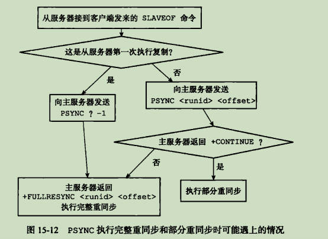
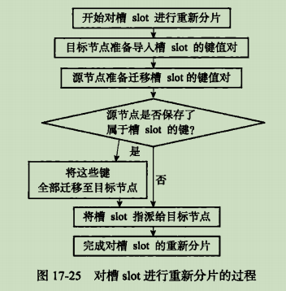
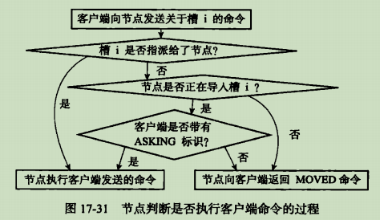

本文整理了 Redis 的相关问题，以便更深入掌握 Redis。

<!-- More -->


1. Redis 有哪些数据结构？

   简单动态字符串，双向链表，压缩链表，哈希表，整数集合，跳表，在 3.2 版本后新增 quicklist，用于降低双向链表空间浪费的现象，在 5.0 版本后新增 listpack，用于解决级联更新问题。

2. Redis 数据结构中的哈希表内部实际存在几张哈希表，为什么？

   实际存在两张哈希表，用于实现渐进式 rehash 策略。

3. Redis 数据结构中的整数集合何时会升级，是否能够降级？

   在存储元素的字节长度大于编码长度时，就会执行升级操作，升级后不能降级。

4. Redis 数据结构中的跳表实现原理？

   跳表实际上是多层的有序链表，通常越高层的跨度越大，在每个节点维护一个 32 层的指针，通过 0.25 的概率来决定上层是否存在指针，使得得到的跳表更加扁平。

5. 为什么需要 quicklist 和 listpack？

   前者为了解决双向链表空间浪费问题，后者则主要为了解决压缩链表级联更新的问题。

6. Redis 是如何存储某个数据库中的数据的？

   本身使用了哈希表来保存所有的数据，哈希桶存放的是键值对的指针，指针的类型都通过对象结构来解码，但是键的指针只能是 String 对象。

7. Redis 是如何解析 RedisObject 的？

   其中包含了 type 和 encoding 两个属性，前者表示对象的类型，后者表示使用的编码，通过 void* ptr 指向对应的真实数据类型。

8. Redis 存在哪些数据类型？

   主要存在五种数据类型：String，List，Hash，Set，Zset。还存在四种复合类型：BitMap，Hyperloglog，GEO，Stream 类型。

9. Hyperloglog 类型的主要目的是？

   提供不精确的去重计数，误差率大约是 0.81%，可以节省大量的内存。

10. Redis 如何实现分布式锁？

    `SET lock_key unique_value NX PX 10000`，设置过期时间是为了防止 Redis 崩溃而不能及时释放资源，解锁可以通过 DEL 命令实现，但是需要先检查是否是自己的锁，可以配合 LUA 脚本。

11. 如何使用 List 实现消息队列，为什么还推出 Stream？List 实现消息队列：LPUSH/RBPOP，但是存在的问题是需要生产者实现消息唯一 ID，不是很方便；Stream 则是专门为消息队列设计的数据类型，支持自动生成全局唯一 ID，并且以消费组消费数据

12. Stream 如何保证消息确实被消费了？

    Stream 会使用 PENDING LIST 留存消费组每个消费者读取的消息，直到收到对应的 ACK，消费者在重启后，可以通过 XPENDING 来查看已读取，但尚未确认的消息，从而保证消息确实被消费了。

13. Stream 存在哪些问题？

    存在数据丢失问题，主要原因在 AOF 先执行命令，后写日志；主从复制在进行主从切换时，也会发生数据丢失问题；面对消息挤压，内存资源紧张。

14. RDB 快照存储格式以及生成方式？

    RDB 快照采用二进制文件保存，因此其恢复速度很快；生成方式主要有两种，save 和 bgsave，前者会阻塞主线程，一般使用 bgsave。由于采用的是子进程处理，并且采用写时复制技术，当有新的命令到来时，此时原来的主进程会复制一块内存用于修改，而子进程读到的还是原来的数据。

15. AOF 日志存储格式？

    里面保存的是一条条用户的指令，在恢复时，只需要按顺序执行即可。

16. 为什么 Redis 选择先执行写操作，再将其写入 AOF 日志？

    避免恢复时的检查开销，不会阻塞当前写操作命令的执行。

17. AOF 日志落盘策略（appendfsync）有哪些？

    Always，Everysec 和 No。Always 能够最大程度保证数据完成性，但是存在性能上的问题。

18. AOF 日志时，当 appendfsync 为 always，是否可能会丢失数据？

    仍然可能会，在 Redis 的事件循环中，是先将对应的 AOF 数据写入 aof_buf 中，在结束本次循环前，会执行 flushAppendOnlyFile 函数，因此，若出现故障停机，可能会丢失一个事件循环中所产生的命令数据。

19. 如何解决 AOF 文件随时间流逝越来越大的问题？

    AOF 重写机制，对于相同键的写命令，可以将它们合并为一个命令，达到节省内存的作用。一般通过 bgrewriteaof 后台子进程完成。

20. AOF 重写机制（bgrewriteaof）是怎样的？

    为了记录重写过程中新到来的指令，存在一个 AOF 重写缓冲区，用于保存重写过程中的用户指令，该 AOF 缓冲区最终将会追加到新的 AOF 文件中，最终原子替换原来的 AOF 日志文件。

21. AOF 缓冲区和 AOF 重写缓冲区的异同点？

    都是暂时保存日志的缓冲区；前者目的在于保证 AOF 日志的完整性，通过 appendfsync 策略控制，后者则是为了保证重写 AOF 日志替换现有 AOF 日志后没有数据丢失。

22. 混合持久化存在的意义？

    RDB 快照恢复速度快，但是发生崩溃时会丢失上次 RDB 快照至今的命令数据；AOF 方式虽然解决了大量数据丢失的问题，但是在文件很大时，恢复过程缓慢。因此，可以考虑使用混合持久化，只需要配置 `aof-use-rdb-preamble` 参数即可。

23. 主从复制的意义是什么？

    避免单点故障，为 Redis 服务提供高可用所必须的操作。

24. 主从复制的具体过程？

    主要分为三个阶段：

    + 从服务器执行 replicaof 命令，其会向主服务器建立连接，协商得到 runID 和 offset 等信息
    + 主服务器在后台执行 bgsave 命令，在此过程中执行的写命令会被记录到 replication buffer 中，生成完成 RDB 后，通过网络传送到从服务器从服务器接收到 RDB 文件后载入即可
    + 主服务器将 replication buffer 中的新到来的写操作发送给从服务器，从服务器执行其即可

25. 增量复制发生的时机，以及对应的原理？

    增量复制发生在主从服务器网络发生断开，之后又重新连接的场景下。此时服务器根据 `psync {runid} {offset}` 来进行增量复制。该实现过程通过环形缓冲区 repl_backlog_buffer 实现，主从服务器分别记录自己的 offset，从而实现增量同步，如果从服务器 offset 对应的数据已经被覆盖，则通过全量复制实现，可以通过 repl_backlog_size 设置该环形缓冲区大小。

26. replication buffer 和 repl_backlog_buffer 的区别？

    前者指写操作数据传送到从服务器时通信所需的缓冲区，若存在多个从服务器，则其中的数据不一定相同；后者指的是增量复制发生时，从何处开始进行增量复制操作，主要用于找到主从差异数据而设计的环形缓冲区。

27. 主从同步时，主服务器不进行持久化时存在那些安全隐患？

    若主服务器没有开启持久化，应该将其配置为避免自动重启，否则自动重启后主节点上只有一个空数据集，并且会复制到其它从节点上。

28. 为什么还存在从库的从库，这种架构模式？

    若所有的从库连接到相同主库上，会给主库带来网络和磁盘上的消耗，容易造成单点故障。

29. Redis 中的无磁盘复制模式？

    Redis 默认使用磁盘复制，但是其性能收到磁盘速度的限制，无磁盘复制模式即创建一个新进程直接 dump RDB 到 slave 的 socket，不经过硬盘，适用于网络较快的情况。

30. 从库是否会检查数据是否过期？

    在主从复制中，从节点不会主动删除数据，而是通过主节点控制从节点来删除过期数据；在 Redis 3.2 后，从节点在读取数据的时候，增加了对数据是否过期的判断（惰性删除）。

31. 哨兵机制的意义？

    通过部署一系列的哨兵节点，让其时刻监视主从服务节点，在主从节点发生故障时，能够自动进行故障转移的功能。

32. 哨兵节点的作用是什么？

    主要作用有三点：监控，选主，通知。

    + 监控：通过 ping 命令判断主从节点是否发生故障，一旦检测到主观下线，就会和其他哨兵节点协商，达到 quorum 值便可确定其为客观下线
    + 选主：
      + 在已下线主节点的所有从节点中选取一个从节点，将其当作新的主节点：`SLAVEOF no one`
      + 让已下线主节点的所有其他从节点修改复制目标，修改其为新的主节点：`SLAVEOF`
      + 将新主节点的 IP 地址和信息，通过发布订阅机制通知给客户端：` +switch-master `
      + 继续监视原来的旧主节点，但这个旧主节点重新上线时，修改其为从节点

33. 哨兵节点发现客观下线后，选主的依据是什么？

    首先过滤网络状态不好的节点，其次按照优先级，复制进度和 ID 号挑选新从节点作为新的主节点。

34. 哨兵节点发送的 INFO 命令的作用？

    用于获取该节点的角色信息，如其对应的从节点列表等。

35. 通常哨兵机制中使用了哨兵集群，如何让哨兵之间互相发现彼此（哨兵发现）？

    通过命令 `sentinel monitor <master-name> <ip> <redis-port> <quorum>` 进行哨兵配置，主节点中存在 `__sentinel__:hello` 频道，其他哨兵可以通过订阅该频道，用以发现其他哨兵并进行连接。

36. 哨兵集群中的哨兵节点如何发现主节点下的从节点？

    通过 INFO 命令，主节点会返回所有的从节点信息。

37. 什么是主从集群脑裂现象，产生原因和解决方案？

    产生原因：由于网络问题，导致集群节点之间失去联系，主从节点间数据不同步，哨兵重新选举，产生两个主节点，等待网络恢复，旧主节点会降级为从节点，由于其与新节点进行同步复制的时候，会清空自己的缓冲区，导致之前客户端写入的数据被丢失。

    解决方案：当主节点发现从节点下线或者通信延迟过大时，那么禁止主节点进行写数据，直接把错误返回给客户端，以减少数据丢失，可以通过以下两个参数控制

    + min-slaves-to-write x，主节点必须要有至少 x 个从节点连接，如果小于这个数，主节点会禁止写数据
    + min-slaves-max-lag x，主从数据复制和同步的延迟不能超过 x 秒，如果超过，主节点会禁止写数据

38. 为什么需要切片集群模式？

    当 Redis 缓存数据量大到一台服务器无法缓存时，就需要使用切片集群模式，其将数据分布在不同的服务器上，以此降低系统对单节点的依赖，提高读写性能，实际上就是服务器 Sharding 技术。

39. Redis 中，切片集群模式的实现？

    采用哈希槽来处理数据和节点之间的映射关系，一个切片集群共有 16384 个哈希槽，通过 CRC16 和取模实现 key 到哈希槽的映射。可以平均分配哈希槽到服务节点，也可以手动进行分配。

40. 哈希槽和一致性哈希？

    + 哈希槽指的是先将用户数据划分到槽里面，然后将槽划分到不同服务器节点上，可以为不同硬件服务器自定义槽数目大小
    + 一致性哈希则是将服务器节点划分在一个哈希环上，主要目的是减少新增节点导致的重新哈希的问题，容易产生数据倾斜问题，可以引入虚拟节点映射减轻该问题

41. 什么是缓存雪崩，如何应对？

    大量缓存数据在同一时间过期，或者 Redis 故障宕机时，此时大量的请求访问数据库，从而导致数据库压力骤增，严重的会造成数据库宕机，而造成系统崩溃。对于大量数据在同一时间过期，可以均匀设置过期时间，后台更新缓存；对于 Redis 宕机，可以采用服务熔断，请求限流或者构建 Redis 高可用集群。

42. 什么是缓存击穿，如何应对？

    如果缓存中的某个热点数据过期，此时大量的请求访问该热点数据，就无法从缓存中读取，直接访问数据库，数据库很容易就被高并发的请求冲垮。可以采用互斥锁来保证同一时间内只有一个请求来构建缓存，同时设置超时时间防止死锁，或者采取永远不过期策略，让后台线程定时更新，抑或是进行缓存预热。

43. 什么是缓存穿透，如何应对？

    当用户访问的数据，既不在缓存中，也不在数据库中，导致请求在访问缓存时，发现缓存缺失，再去访问数据库时，发现数据库中也没有要访问的数据，没办法构建缓存数据，来服务后续的请求，就到导致服务器的压力骤增。可以采取限制非法请求，缓存默认值，或者使用布隆过滤器快速判断数据是否存在。

44. 布隆过滤器工作原理？

    使用使用位图和多个哈希函数快速判断数据是否存在数据库中，查询布隆过滤器说数据存在，并不一定证明数据库中存在这个数据，但是查询到数据不存在，则数据库中一定就不存在这个数据。

45. 使用 Redis 作为缓存时，如果采用 Write Update 方式，可能存在哪些问题？

    更新数据时，不论是先更新数据库，再更新缓存，还是先更新缓存，再更新数据库，都可能会产生不一致现象。

46. 使用 Redis 作为缓存时，一般使用的缓存策略是什么？

    Cache Aside：在更新数据时先更新数据库，再删除缓存中的数据；而在读取数据时，发现缓存中没了数据之后，直接从数据库中读取数据，并更新到缓存中。注意写操作时不能先删除缓存中的数据，再更新数据库，这在写读并发可能带来不一致现象。而在读写并发时，存在极小概率会产生不一致，原因是缓存的写入通常远远快于数据库的写入。

47. Cache Aside 策略会对命中率产生影响，如何缓解？

    + 更新数据时同样更新缓存，不过需要加分布式锁；
    + 更新数据时同样更新缓存，不过需要加过期时间，保证最终一致性

48. 如何保证 Cache Aside 策略中先更新数据库，再更新缓存的操作都能成功？

    + 重试机制：引入消息队列，如果删除缓存的操作未成功，那就重试
    + 订阅 MySQL binlog，再操作缓存：阿里巴巴开源 Canal 中间件的实现方式

49. Redis 作为数据库缓存时，能否采用 Write Back 策略？

    Write Back 写策略则只需标记缓存数据为脏数据之后，直接返回即可，在写未命中时，采用 Write Allocate 方式。读策略在未命中的情况下如果发现被置换的缓存块是脏块，则需要将其写入数据库。该策略不能被应用到我们常用的数据库和缓存的场景中，因为缓存一般是非持久化的，如果缓存机器掉电，脏块数据就会丢失。

50. Redis 如何实现分布式锁？

    + 最简化版本：使用 setnx key value 和 delete key 实现加锁和释放锁
    + 支持过期时间：防止获取了锁的服务挂掉而没有释放锁资源，使用 set key value nx ex seconds
    + 加上 owner：防止其他服务删除该服务已获取到的锁，可以设置不同的 value 表示不同的 owner
    + 整合原子操作：加上 owner 后需要先检查，如果是自己的锁再释放，该过程不是原子性的，使用 Lua

51. Redis 如何保证分布式锁的可靠性？

    + 容灾考虑：
      + 主从容灾：Redis 的哨兵模式可以灵活切换，但是存在同步时延的问题
      + 多机部署：使用 Redis 中的 RedLock，只有超过半数同意才能算请求成功
    + 没有完全可靠的分布式锁，存在三大困境：网络延迟，进程暂停，时钟漂移

52. Redis 为什么这么快？

    + 基于内存实现，没有 IO 开销
    + 高效的数据结构：如 SDS，快表，跳跃表
    + 合理的数据编码：如 String 对象存储数字的时候，采用 int 类型编码，非数字采用 SDS 编码
    + 合适的线程模型：采用 Reactor 单线程模型，省去了上下文切换的开销（执行命令是单线程）

53. Redis 的过期删除策略？

    对数据库中已经过期的键值对进行删除，存在过期字典用于快速判断，主要采用以下两种策略：

    + 惰性删除：不主动删除过期键，每次访问 key 的时候，才检查 key 是否过期，通过函数 expireIfNeeded 实现
    + 定期删除：每隔一段时间从过期字典中挑选一定的数据检查其是否过期，如果过期率大于 25% 并且此次运行时间小于 25ms，则继续上述操作

54. Redis 的内存淘汰策略？

    当运行内存达到最大值时，需要淘汰某些 key 用于缓存新的键值对：

    + 不进行数据淘汰：noeviction，返回错误通知客户端
    + 进行数据淘汰：
      + 在设置了过期时间的数据中进行淘汰：volatile-random，volatile-ttl，volatile-lru，volatile-lfu
      + 在所有数据范围内淘汰：allkeys-random，allkeys-lru，allkeys-lfu

55. Redis 4 新增特性有哪些？

    新增 LFU 逐出策略，添加了 UNLINK 操作，添加了混合持久化功能，新增 MEMORY 命令。

56. Redis 5 新增特性有哪些？

    Stream 类型，动态 Hz，ZPOPMIN，以及 CLIENT UNBLOCK 命令等。

57. Redis 6 新增特性有哪些？

    多线程处理网络 IO，ACL 支持（之前通过 RENAME），客户端缓存，集群代理等。

58. Redis 查看自身状态的命令？

    INFO，MONITOR，LATENCY。

59. Redis 可视化工具？

    redis-stat，redmon；基于 redis_exporter，prometheus，grafana。

60. Redis 介绍？

    Redis 是一个内存数据库，不过和传统的 RDBM 不同，Redis 属于 NoSQL，其存储类型为 KV。Redis 被广泛用于缓存方向，同时也可用于分布式锁，高速消息队列和事件发布与订阅等方面。Redis 提供了多种数据类型来支持不同的业务场景，还支持持久化、Lua 脚本、多种集群（主从复制模式，分布式切片集群）方案。

61. Redis 使用场景？

    + 热点数据的缓存
    + 限时业务应用，通过 expire 设置 key 的过期时间
    + 计数器相关问题
    + 分布式锁，通过 setnx 实现，通过 lua 脚本实现原子性
    + 延时操作，下单 10 分钟后无操作自动取消订单，通过 Zset 实现
    + 排行榜相关问题，使用 Zset 实现
    + 点赞，好友等相互关系存储，使用 Set 的集合命令实现
    + 队列，通过 list 可以实现简单队列，可以使用 Stream 提供消息队列支持，存在局限性

62. 那 NoSQL 的 BASE 理论是什么？

    BASE 理论是 CAP 理论中对一致性的妥协，和传统事务的 ACID 截然不同，BASE 不追求强一致性，而是允许数据在一段时间内是不一致的，但最终达到一致状态，从而获得更高的可用性和性能。

63. 分布式缓存常见的技术选型方案有哪些？

    使用比较多的是 Memcached 和 Redis，Memcached 是分布式缓存最开始兴起的那会，比较常用的，现在基本使用 Redis。

64. Redis 和 Memcached 的区别和共同点？

    共同点：内存数据库，过期策略，性能高。

    区别：

    + Redis 支持更丰富的数据类型，Memcached 只支持最简单的 k/v 数据类型
    + Redis 支持数据的持久化，灾难恢复机制，原生集群模式，Lua 脚本
    + Redis 采用的是 IO 多路复用模型，Memcached 使用多线程，非阻塞 IO 复用的网络模型
    + Redis 支持惰性删除和定期删除，但是 Memcached 只支持惰性删除

65. 为什么使用 Redis 作为 MySQL 缓存？

    高性能：将热点数据放在缓存中，就不用访问数据库了，提升用户体验

    高并发：数据在缓存中，支持更高级别的并发

66. Redis 对象机制解析？

    通过 void* ptr 指向实际的数据结构，使用 type 可以检查命令是否能够执行，检查 encoding 来选择合适的函数执行命令，实现了命令的多态；通过 lru 统计上一次访问时间，或者是 lfu 的相关信息，用于内存淘汰策略实现；通过 refcount 实现对象计数，便于进行对象共享（默认共享 10000 以内的整数）和内存回收。

67. Redis 是单线程吗？

    Redis 单线程指的是其处理用户指令，解析请求，进行数据读写，发送数据给客户端任务都是一个线程内执行的，但是 Redis 程序并不是单线程的：

    + Redis 2.6 版本之前，启动 2 个后台线程，用于关闭文件和 AOF 刷盘
    + Redis 4.0 版本之后，新增了一个后台线程（lazyfree），用来异步释放 Redis 内存。使用 del 会同步释放内存，处理大 key 的时候，可能造成卡顿，可以使用 unlink 命令

68. Redis 单线程模型详解？

    Redis 基于 Reactor 单线程实现，通过 IO 多路复用程序来监听来自客户端的大量连接，减少了资源的消耗，Redis 服务器本身是一个事件驱动程序，主要分为时间事件和文件事件。当被监听的套接字准备好执行连接应答（accept）、读取（read）、写入（write）、关闭（close）等操作时，与操作相对应的文件事件就会产生，对应的文件事件处理器就会被调用。

69. Redis 没有使用多线程？为什么不使用多线程？

    Redis 其实在 4.0 之后就加入了对多线程的支持，在 6.0 后才算是使用了多线程，之前未使用的原因有：单线程编程容易维护，Redis 的性能瓶颈在内存和网络，多线程会带来上下文切换的开销等。

70. Redis 6.0 之后为何引入了多线程？

    主要是为了提高网络 IO 读写性能，因为这是其一个性能瓶颈，但是执行命令仍然是单线程顺序执行。因此，该版本之后，在 Redis 启动的时候，会创建以下线程：

    + Redis-server：主线程，主要负责执行命令
    + bio_close_file，bio_aof_fsync，bio_lazy_free：后台线程，处理耗时任务
    + io_thd_1，io_thd_2，io_thd_3：三个 IO 多线程，分担 Redis 的网络 IO 的压力

71. Redis 大 key 如何处理？

    大 key：指 key 对应的 value 很大，如 String 类型值大于 10KB，或者元素个数大于 5000 个

    大 key 影响：

    + 客户端超时阻塞
    + 引发网络阻塞
    + 阻塞工作线程
    + 内存分布不均（Slot 平均分配）
    + AOF 写回策略为 Always 时，每次写大 key 都会阻塞较长时间
    + AOF 重写和 RDB 快照时，都会进行 fork，fork 中需要复制父进程的页表，此过程耗时并且阻塞主进程，另外，如果开启了内存大页会产生写放大的问题

    通过以下方法找到大 key：

    + redis-cli --bigkeys：最好在从节点上执行，只能返回每种类型的最大一个 bigkey
    + 使用 SCAN 命令查找：使用 SCAN 扫描，使用 TYPE 查看类型，最后统计值大小
    + 使用 RdbTools 工具查找大 key

    删除大 key 的方式：

    + 分批次删除：hscan，pop，sranmember，zremrangebyrank
    + 异步删除：使用 unlink 代替 del 进行删除，不会造成阻塞

72. Redis 管道技术作用？

    是客户端提供的批处理技术，用于一次处理多个 Redis 命令，从而提升交互性能，可以解决多个命令执行时的网络等待。

73. Redis 给缓存数据设置过期时间有啥用？

    内存是有限的，节省内存资源；像 token 这类的数据存在时效性，如果利用传统数据库处理的话，这样更麻烦并且性能更差；在实现分布式锁的时候，可以防止获取了锁资源的进程意外宕机而造成锁资源一直没有释放的问题。

74. Redis 是如何判断数据是否过期的呢？

    Redis 通过过期字典来保存数据过期的事件，对应键值保存着其过期时间戳。

75. 过期的数据的删除策略了解么？

    惰性删除：只会在取出 key 的时候检查，对 CPU 友好，但是可能有太多过期 key 存在于缓存中

    定期删除：每隔一段时间抽取一批 key 执行删除过期 key 操作

    定时删除：设置过期时间的同时，创建一个定时器，定时器超时时执行删除操作

    Redis 采用的是定期删除 + 惰性删除，但是仍然存在定期删除和惰性删除漏掉了很多过期 key 的情况，可能导致 OOM，为了解决该问题，使用 Redis 内存淘汰机制。

76. Redis 如何做内存优化？

    缩减键和值的长度，共享对象池，字符串优化，编码优化，控制 key 的数量。

77. Redis 内存淘汰机制了解么？

    一共有 8 种：volatile-lru，volatile-lfu，volatile-ttl，volatile-random，allkeys-lru，allkeys-lfu，allkeys-random，no-eviction。通过 maxmemory_policy 配置。

78. Redis 持久化机制(怎么保证 Redis 挂掉之后再重启数据可以进行恢复)？

    支持 RDB 和 AOF 两种持久化机制，最好使用**混合持久化**（aof-use-rdb-preamble）。RDB 优点是文件紧凑，占用空间小，恢复速度快，AOF 优点是发生故障时，丢失的数据比 RDB 更少。

79. AOF 文件会越来越大，最后磁盘都装不下？

    当文件体积过大时，会自动创建子进程，专门对 AOF 进行重写。重写过程中，还需要将命令记录在 AOF 重写缓冲区，重写完成后，AOF 重写缓冲区的内容会被追加进去。

    > AOF 重写是通过读取数据库中的键值对来实现的

80. Redis 持久化时，对过期键如何处理？

    RDB 格式：

    + 生成阶段：会提前检查 key，过期的将将不会保存在新的 RDB 文件中
    + 加载阶段：
      + 如果是主服务器，会对其中的键检查，过期键不会被载入
      + 如果是从服务器，不会进行检查

    AOF 格式：

    + 写入阶段：会保存对应的过期键，在删除后会追加 DEL 命令
    + 重写阶段：会检查过期时间，已过期的键不会保存到重写后的 AOF 文件中

81. Redis 事务？

    并不支持原子性和持久性，实际上可以理解为将多个命令的请求打包，然后再顺序执行其中所有命令，该过程不会被打断。即使命令产生错误，也不会进行回滚，其原因：

    + Redis 事务执行时，错误通常是编程错误造成的，这种错误基本不会出现在生产环境中
    + 不支持事务回滚是因为这种复杂功能和 Redis 追求的简单高效设计主旨不符

82. 那Redis字符串有什么特点？

    Redis 的字符串如果保存的对象是整数类型，那么就用 int 存储。如果不能用整数表示，就用 SDS 来表示，SDS 通过记录长度，和预分配空间，可以高效计算长度，进行 append 操作。

83. Hash 扩容过程是怎样的？

    当装载因子超过阈值时，就会进行 rehash 过程，将 0 号表上的每个桶慢慢移动到 1 号表，所以叫渐进式 rehash。

84. 能详细说下Rehash过程吗？

    首先，生成新哈希表 ht[1]，为 ht[1] 分配空间。

    然后，迁移 ht[0] 数据到 ht[1]。在 Rehash进行期间，每次对字典执行增删查改操作，程序会顺带迁移一个 ht[0] 上的数据，并更新偏移索引。

    最后，ht[1] 和 ht[0] 指针对象交换。

85. 如果字典正在 Rehash，此时有请求过来，Redis 会怎么处理？

    针对新增 Key，是往 ht[1] 里面插入。针对读请求，先从 ht[0] 读，没找到再去 ht[1] 找。删除和更新操作和读操作类似。

86. 跳表的实现？

    本质上是对链表的一种优化，通过逐层跳步采样的方式构建索引，以加快查找速度。

87. 跳表的每个节点有多少层？

    使用概率均衡的思路，确定新插入节点的层数。Redis 使用随机函数决定层数。直观上来说，默认1层，和丢硬币一样，如果是正面就继续往上，这样持续迭代，最大层数 32 层。

88. Redis 的 Zset 为什么同时需要字典和跳表来实现？

    Zset 是一个有序列表，字典和跳表分别对应两种查询场景，字典用来支持按成员查询数据，跳表则用以实现高效的范围查询，这样两个场景，性能都做到了极致。

89. 为什么使用跳表而不是平衡树？

    + 内存占用上，平衡树每个节点 2 个指针，跳表每个节点 1/(1 - p) 个指针，Redis 中 p 为 0.25
    + 做范围查找的时候，跳表比平衡树操作更加简单
    + 算法实现上，跳表比平衡树简单

90. Redis 如何实现延迟队列？

    延迟队列指的是把当前要执行的任务，往后推迟一段时间再执行，如淘宝下单后超过一定时间未付款则自动取消订单任务。可以通过 Zset 实现，使用 score 当作执行时间戳，消费者通过 zrangebyscore 进行轮询处理。

91. Redis 机器挂掉怎么办？

    可以用主从模式部署，即有一个或多个备用机器，备用机会作为 Slave 同步 Master 的数据，在 Redis 出现问题的时候，把 Slave 升级为 Master。

92. 主从可以自动切换吗？

    本身是不能，但是 Redis 已经有了解决方案，即哨兵模式。哨兵来监测Redis服务是否正常，异常情况下，由哨兵代理切换。为避免哨兵成为单点，哨兵也需要多机部署。

93. 如果 Master 挂掉，会选择哪个 Slave 呢？

    当哨兵集群选举出哨兵 Leader 后，由哨兵 Leader 从 Redis 从节点中依次选择一个作为主节点

    + 优先级最高的节点
    + 复制偏移量最大的节点
    + runid 最小的节点

94. 前面你提到了哨兵 Leader，那它是怎么来的呢？

    当一个哨兵节点确认Redis集群的主节点主观下线后，会请求其他哨兵节点要求将自己选举为 Leader。如果一个哨兵节点获得的选举票数超过节点数的一半，且大于 quorum 配置的值，则该哨兵节点选举为Leader；否则重新进行选举。

95. 为什么 Redis 集群的哈希槽是 16384（2 的 14 次方）？

    Redis 在发送心跳包的时候需要将哈希槽的指派信息一起进行发送，如果使用 CRC16 原始范围，会造成心跳包过大，另一方面，Redis 集群一般不超过 1000 个节点，所以 16k 的槽位是个不错的选择。

96. 为什么 Redis 集群中不建议使用发布订阅？

    在集群模式下，所有的 publish 命令都会向所有节点（包括从节点）进行广播，造成网络带宽的严重消耗。

97. Redis 集群会有写操作丢失吗？

    会，Redis 并不保证数据的强一致性，在 failover 过程中可能存在数据丢失。

98. Redis 性能这么高，那它是协程模型，还是多线程模型？

    Redis 是单线程 Reactor 模型，通过高效的 IO 复用以及内存处理实现高性能。6.0 之后虽然加入了多线程来进行 IO 解包，但是处理逻辑依旧是单线程。

    另外，如果考虑到 RDB 的 Fork，一些定时任务的处理，那么 Redis 也可以说多进程，这没有问题。但是 Redis 对数据的处理，至始至终，都是单线程。

99. 可以详细说下6.0版本发布的多线程功能吗？

    多线程功能，主要用于提高解包的效率。和传统的 Multi Reactor 多线程模型不同，Redis 的多线程只负责处理网络 IO 的解包和协议转换，一方面是因为 Redis 的单线程处理足够快，另一方面也是为了兼容性做考虑。

100. 如果数据太大，Redis 存不下了怎么办？

     使用集群模式，也就是将数据分片，不同的 Key 根据 Hash 路由到不同的节点。集群索引是通过一致性Hash 算法来完成，这种算法可以解决服务器数量发生改变时，所有的服务器缓存在同一时间失效的问题。

101. 一致性Hash能详细讲一下吗？

     传统的 Hash 分片，在节点扩容或者缩容的时候，需要重新哈希。一致性Hash是说将数据和服务器，以相同的 Hash 函数，映射到同一个 Hash 环上，针对一个对象，在哈希环上顺时针查找距其最近的机器，这个机器就负责处理该对象的相关请求。这样在节点数量增加时，只有少量的数据需要重新哈希。

102. 如何设计一个缓存策略，可以动态缓存热点数据呢？

     通过数据最新访问时间来做排名，并过滤掉不常访问的数据，只留下经常访问的数据

     + 通过缓存系统做一个排序队列（存放 1000 个商品），系统根据访问时间进行排序
     + 系统定期删除排名最后的 200 个商品，并且从数据库中随机读取 200 个商品加入队列中

103. Redis 经常用作缓存，那数据一致性怎么保证？

     从设计思路来说，有 Cache Aside 和 Read/Write Through 两种模式，前者是把缓存责任交给应用层，后者是将缓存的责任，放置到服务提供方。

104. 如果数据发生变化，你会怎样去更新缓存？

     一般有四种方式：

     + 数据存到数据库中，成功后，再让缓存失效，等到读缓存不命中的时候，再加载进去；
     + 通过消息队列更新缓存；
     + 先更新缓存，再更新服务，这种情况相当于把 Cache 也做 Buffer 用；
     + 启动一个同步服务，作为 MySQL 一个从节点，通过解析 binlog 同步重要缓存

105. 说一下布隆过滤器的实现吧？

     底层是一个 64 位的整型，将字符串用多个 Hash 函数映射不同的二进制位置，将整型中对应位置设置为1。布隆过滤器优缺点都很明显，优点是空间、时间消耗都很小，缺点是结果不是完全准确，其能提供的信息是某样东西一定不存在或者可能存在。

106. 那 Redis 可以做消息队列吗？

     可以，但是并不合适，Redis 本身没有支持 AMQP 规范，消息队列该有的能力缺胳膊少腿，消息可靠性不强。甚至 Redis 作者都看不下去了，开源了 Disque 来专事专做。

107. 那你能谈谈 Redis 在秒杀场景的应用吗？

     Redis 主要是起到选拔流量的作用，记录商品总数，还有就是已下单数，等达到总数之后拦截所有请求。可以多放些请求进来，然后塞入消息队列。

108. 你能继续说说 Redis 在分布式锁中的应用吗？

     分布式锁也依赖存储组件，针对请求量的不同，可以选择 Etcd、MySQL、Redis  等。前两者可靠性更强，Redis 性能更高。

109. 基于 Redis 实现分布式锁有什么优缺点？

     优点：性能高效，实现方便，避免单点故障

     缺点：

     + 超时时间不好设置
     + 主从复制模式中的数据是异步复制的，这样导致分布式锁的不可靠性，可以使用 RedLock，其基本思路是让客户端和多个独立的 Redis 节点依次请求申请加锁，如果客户端能够和半数以上的节点成功地完成加锁操作，那么我们就认为，客户端成功地获得分布式锁，否则加锁失败

110. 那我们再聊聊 Redis 在限流场景的应用吧？

     在微服务架构下，限频器也需要分布式化。在分布式令牌桶中，Redis 负责管理令牌，微服务需要进行函数操作，就向 Redis 申请令牌，如果 Redis 当前还有令牌，就发放给它。拿到令牌，才能进行下一步操作。另一方面，令牌不光要消耗，还需要补充，出于性能考虑，可以使用懒生成的方式：使用令牌时，顺便生成令牌。这样子还有个好处：令牌的获取，和令牌的生成，都可以在一个 Lua 脚本中，保证了原子性。

111. Redis 中的 SDS（简单动态字符串）实现，有何优点？

     采用 `(len, free, buf[])` 实现，可以带来的优点有：常数时间内获得字符串长度，减少字符串修改时内存分配的次数，杜绝缓冲区溢出问题，二进制兼容，兼容部分 C 语言字符串函数。

112. Redis 中的双向链表（LinkedList）实现？

     可以归纳为带表头结构的双向无环链表，链表节点通过 void* 来保存不同值。

113. Redis 中的字典实现？

     字典在 Redis 中用 dict 表示，每个 dict 内部保存有一个 ht[2]，其中一个用于存储实际数据，另外一个则用于 rehash 过程，通过少量批次实现 rehash，以减少 rehash 带来的性能影响。另外，对于哈希冲突的数据，采用头插链接法解决。

114. Redis 中字典 rehash 发生时间，以及过程？

     当负载因子超过阈值或低于阈值时，便开始进行进行扩容或者缩容。

     扩展或收缩哈希表需要将 ht[0] 里面的所有键值对 rehash 到 ht[1] 里面，但是，这个 rehash 动作并不是一次性、集中式地完成的，而是分多次、渐进式地完成。在渐进期间，字典会同时使用两个哈希表，但是插入的时候只会插入到 ht[1]。需要使用到 dict 结构中的 rehashidx 变量，每次移动后会将其加一。

115. Redis 中的跳表实现？

     跳表被实现为带表头的一系列跳表节点组合而成，其支持平均 O(logn)，最坏 O(n) 的复杂度。每次有新的节点插入时，就会根据 score 进行排序，找到对应的位置进行插入，然后每次根据 0.25 概率，来确定层高，最后连接前后具有相同层高的节点。

116. 为什么 Redis 使用跳表而不是红黑树？

     + 跳表的复杂度和红黑树相同，而且实现起来简单，额外的内存可以通过修改层高概率 p 权衡
     + ZSet 中经常使用 ZRANGE 和 ZREVRANGE 命令，此时跳表性能不会比其他的树结构索引性能差

117. Redis 中的整数集合 intset 实现？

     通过 `(encoding, length, contents[])` 实现，每次需要加入新的整数的时候，考虑新的整数所需字节数是否超过了 encoding 对应的大小，如超过则需要执行对应的升级操作，也就是将原来的数字进行符号扩展，再放置在整数集合中，注意，整数集合升级后便不会降级。

118. Redis 中的压缩列表实现？

     通过 `(zlbytes, zltail, zllen, entry1, ..., entryN, zlend)` 实现，其中 entry 实现如下 `(pre_entry_length, encoding, content)`。pre_entry_length 既可能是 1 字节，也可能是 5 字节，因此，当一系列 entry 长度是 250-254 时，当某个 entry 发生扩展，便会引起接下来的一系列 entry 发生扩展，也被称为连锁更新。

119. Redis 中的对象是如何编码的？

     redisObject 中包含的字段如下：

     ```
     (type, encoding, *ptr, lru, refcount)
     ```

     type 对应对象的类型：String，List，Hash，Set，Zset

     encoding 则对应每种类型实现编码，如 List 实现既可以是 ziplist，也可以是 linkedList

     lru 表示对应的空转事件，用于实现 lru 逐出算法，另外也可以作为实现 lfu 算法的参数

     refcount 则指定了对象的引用计数，还有对象共享的功能

120. Redis 是如何实现命令多态的？

     相同的命令，根据不同的编码选择执行不同底层数据结构的具体实现，从而实现多态。

121. Redis 是如何进行内存回收的？

     通过引用计数的方式实现，依赖 refcount 值。

122. Redis 中的对象共享池指什么，为什么没有实现对应的字符串共享池？

     Redis 会在初始化服务器时，创建一万个字符串对象，这些对象包含了从 0 到 9999 的所有整数值，当服务器需要用到值为 0 到 9999 的字符串对象时，服务器就会使用这些共享对象，而不是新创建对象。

     共享对象池中一个关键操作是判断对象是否相等。整数的比较算法的时间复杂度是 O(1)，相对而言，字符串的比较算法的时间复杂度是 O(n)，特别是长字符串的比较更加消耗性能。

123. Redis 内部如何存储数据的？

     RedisServer 中存在一个 redisDb 数组，默认个数是 16 个。redisDb 中的 dict 字典保存有全部的键值对数据。实际上真正存储数据的是 dict 中的 dictht，存在两个，用于进行 rehash。

124. 如何是指键的过期时间？

     expire，pexpire，pexpireat，expireat，内部上都是通过 pexpireat 实现。

125. Redis 中的过期字典是什么，存在于什么位置？

     存在于 RedisDb 结构中，用于记录哪些设置了过期时间的键，并且保存对应的过期时间戳。

126. Redis 中的过期删除策略有哪些，如何实现的？

     惰性删除：expireIfNeeded 函数实现

     定期删除：每次函数执行 serverCron 时，里面的 activeExpireCycle 就会被调用。原理是通过分多次遍历服务器中的各个数据库，从过期字典中随机抽查一部分键的过期时间，并且删除其中的过期键，其中 current_db 全部变量保存着当前指向到那个数据库中了，下次遍历的时候就可以接着从上次数据库的下一个接着检查。

127. RDB 在生成和恢复时，需要考虑过期键值吗？

     在执行 SAWE 命令或者 BGSAVE 命令创建一个新的 RDB 文件时，程序会对数据库中的 键进行检查，已过期的键不会被保存到新创建的 RDB 文件中。

     载入 RDB 文件的时候，如果服务器以主服务器模式运行，那么在载入 RDB 文件的时候，程序会剔除过期的键，如果是以从服务器模式运行的话，那么就会保存所有的键。

128. AOF 重写过程中，需要考虑过期键值吗？

     AOF 文件重写的时候，会对数据库中的键进行检查，已经过期的键不会保存到 AOF 文件中。

129. 在 Redis 复制时，如何处理过期键？

     当服务器运行在复制模式下面的时候，从服务器的过期键的删除动作由主服务控制，从服务器不会主动删除过期的键，除非主服务器发送 DEL 命令来显式删除某个键。

130. RDB 文件生成方式有哪些，如何生成的？

     主动生成：通过 SAVE 或者 BGSAVE 实现，通常使用 BGSAVE 命令实现，通过 fork 和写时复制实现

     被动间隔生成：通过配置文件 save inteval modifyCount，若在 interval 中发生了 modifyCount 次修改，那么就会自动后台生成 RDB 文件

     通过读取 redisDb 里面的数据字典和过期字典进行生成。

131. RDB 文件结构是怎样的？

     整体上文件结构：(REDIS, version, databases, EOF, checksum)

     databases 结构：(SELECTDB, db_num, key_value_pairs)

     带有过期时间的键值对：(EXPIRETIME_MS, ms, TYPE, key, value)

132. AOF 文件如何生成的？

     服务器在完成一个命令的之后，会将其保存在 redisServer 的 aof_buf 缓冲区的末尾。具体的刷盘时机则通过 appendfsync 参数决定。

133. AOF 重写为什么存在，有何作用，如何实现的？

     随着时间的流逝，AOF 文件的内容会越来越多，不加以控制的话，会很容易超过体积最大限制造成影响。为了解决这个问题，Redis 提供了 AOF 文件重写的功能。重写功能是通过读取当前数据库的状态来实现的。另外为了提高服务器的可用性，一般执行 AOF 重写的时候采用的是后台重写，以此防止阻塞的问题。

     使用子进程进行 AOF 文件的重写的时候，服务器会接受客户端的命令，而新的命令可能会造成数据库状态的修改，从而使得当前数据库状态和重写后的 AOF 文件保存的数据库状态不一致。为了解决这种数据不一致问题，Redis 服务器设置了一个 AOF 重写缓冲区，这个缓冲区在服务器创建子进程之后开始使用，当 Redis 服务器执行完一个写命令之后，它会同时将这个写命令发送给 AOF 缓冲区和 AOF 重写缓冲区。当子进程完成重写操作的时候，会向父进程发送信号，父进程此时会将 AOF 重写缓冲区的内容写入到新的 AOF 文件中，最后执行改名覆盖现有的 AOF 文件，实现新旧两个 AOF 文件的替换。

134. Redis 中的事件循环机制？

     Redis 自己实现了简单的事件循环，通过 IO 多路复用来处理网络套接字事件，实际执行命令的还是单个线程。Redis 中的事件分为文件事件和时间事件，文件事件用于处理用户请求，响应用户，连接应答等，时间事件中，Redis 目前只使用了周期时间，服务器将所有时间事件都放在一个无序链表中，每当时间事件执行器运行时，它就遍历整个链表，査找所有已到达的时间事件，并调用相应的事件处理器。 持续运行的 Redis 服务器需要对自身的资源和状态进行检查和调整，从而可以确保服务器可以长期稳定的运行，这些定期操作被封装到 redis.c/serverCron 函数中执行。正常模式下 Redis 服务器只使用 serverCron 一个时间事件。

135. Redis 中保存客户端的数据结构是什么？该数据结构中有哪些关键属性？

     redisClient 数据结构用来保存客户端相关信息，redisServer 中还会保存着一个 clients 的链表，用于保存所有和服务器相连接的客户端。redisClient 中关键属性：

     + fd：套接字描述符，伪客户端为 -1，否则为大于 -1 的整数
     + flags：记录了客户端的角色（MASTER/SLAVE）以及目前所处的状态（REDIS_BLOCKED/REDIS_MONITOR）
     + querybuf：输入缓冲区，保存客户端发送的命令请求
     + buf[MAX_BYTES]：输出缓冲区，命令回复会保存在这里面
     + authenticated：记录客户端是否通过了身份验证

136. 处理 Lua 脚本和加载 AOF 的伪客户端有何不同？

     处理 Lua 脚本的伪客户端在服务器初始化时创建，直到服务器关闭，而 AOF 文件载入的时候的伪客户端则在载入结束之后关闭。

137. ServerCron 函数有何作用，如何调控执行频率？

     ServcerCron 里面包含了所有的小的时间事件，默认 hz 是 10，可以调节 Hz 来控制 ServerCron 的执行频率，其作用有：

     + 更新服务器时间缓存
     + 更新 LRU 时钟
     + 更新服务器每秒执行命令次数，控制 RDB 生成
     + 执行被延迟的 BGREWRITEAOF
     + 将 AOF 缓冲区的内容写入 AOF 文件
     + 处理 SIGTERM 信号
     + 检查持久化操作的运行状态
     + 增加 cronloops 计数器的值

138. Redis 中服务器初始化过程？

     初始化服务器的状态结构，载入配置选项，还原数据库状态（RDB/AOF），执行事件循环。

139. Redis 中复制的作用？

     用户通过命令 SLAVEOF 让一个服务器去复制另外一个服务器，被复制的服务器成为主服务器，对主服务器进行复制的服务器称为从服务器，集群对外提供读写分离功能，以提高系统吞吐率。

140. Redis 中的 SYNC 执行流程（全同步复制）？

     + 从服务器向主服务器发送 SYNC 命令
     + 主服务器执行 BGSAVE 命令，后台生成 RDB 文件，同时用一个缓冲区记录从现在开始执行后的所有写命令
     + RDB 生成后，将其发送给从服务器，从服务器加载 RDB 文件
     + 从服务器加载完成后，主服务器将缓冲区（repl_buffer）里面的所有写命令发送给从服务器，保持一致性

141. 什么是命令传播？

     当主服务的数据库状态被修改的时候，此时造成数据库状态的不一致性，通过命令传播让主从服务器状态重新回到一致状态。

142. 旧版复制功能的缺陷？

     复制可以分为初次复制和断线后重复制，旧版复制功能并没有很好解决断线后复制时间长的问题：只需要将断线后的命令发送给从服务器就行，不需要全部复制一遍。

143. Redis 中的 PSYNC 执行流程？

     

     部分重同步通过在主服务器上维护一个环形缓冲区（repl_buffer），同时记录主服务器当前的 offset1，如果从服务器传入的 offset2 在一个固定范围内，那么就只会重传 offset2-offset1 缓冲区对应的内容，否则还是需要执行全同步过程。

144. Redis 中的心跳检测是什么，有何作用？

     在命令传播阶段，从服务器默认会每秒一次的频率，向主服务器发送 REPLCONF ACK <replication_offset>，其作用有：

     + 检测主从服务器的网络连接状态
     + 辅助实现 min-slaves 选项：可以防止主服务器在不安全的情况下执行写命令，如配置  为 3，那么在从服务器的数量小于 3 时，拒接执行写命令
     + 检测命令丢失：如果丢包的话，通过 offset 实现一致性

145. Redis 的高可用解决方案如何实现？

     Sentinel 是 Redis 的高可用性解决方案：由一个或多个 Sentinel 实例组成的 Sentinel 系统可以监视任意多个主服务器，以及这些主服务器属下的所有从服务器，当被监视的主服务器进入下线的状态时，自动将下线服务器的某个从服务器升级为新的主服务器，然后由新的主服务器代替已经下线的主服务器处理命令请求，当原来的主服务器又重新上线的时候，将其设置为新的主服务器的一个从服务器。

146. Redis 中的 Sentinel 如何启动和初始化的？

     + 初始化服务器：Sentinel 本质上是一个运行在特殊模式下的 Redis 服务器，但是初始化的时候不载入数据
     + 使用 Sentinel 专用代码
     + 初始化 Sentinel 状态：服务器会初始化一个 sentinelState 结构
     + 初始化 Sentinel 的 masters 属性：键是被监视主服务器的名字，值是被监视主服务器对应的 sentinelRedisInstance 结构，每个这样的结构代表一个被 Sentinel 监视的实例，可以是主服务器，从服务器，或者另外一个 Sentinel
     + 创建连向主服务器的网络连接：会创建两个连接，一个是命令链接，另外一个是订阅连接

147. Sentinel 是如何获取主从服务器信息的？

     + 获取主服务器信息：Sentinel 每十秒一次的频率，向被监视的主服务器发送 INFO 命令，获取当前信息。当 Sentinel 分析 INFO 命令中包含的从服务器的信息的时候，会检查从服务器对应的实例是否存在于其主服务器实例 slaves 字典中，存在的话更新相关信息，否则的话创建新的实例
     + 获取从服务器信息：Sentinel 每十秒一次的频率，向被监视的从服务器发送 INFO 命令，获取当前信息。会对从服务器实例进行更新

148. Sentinels 之间是如何相互发现的？

     默认情况下，PUBLISH 信息到主从服务器：

     ```
     PUBLISH __sentinel__:hello s_ip, s_port, s_runid, s_epoch, m_name, m_ip, m_port, m_epoch
     ```

     其他 Sentinel 节点，可以根据该信息更新 sentinels 字典，同时创建连接到其他 Sentinel 的命令连接。

149. 什么是主观下线，什么是客观下线？

     检测主观下线行为：默认情况下，Sentinel 每秒向其创建了命令连接的实例发送 PING 命令，通过 PONG 回复检测是否在线。如果一个实例在 down-after-millseconds 毫秒内，连续向 Sentinel 返回无效回复，那么 Sentinel 会修改这个实例的结构，将 flags 属性中的 SRI_S_DOWN 设置为真，表示其主观下线。

     检查客观下线状态：当 Sentinel 将一个服务器判断为主观下线之后，为了确保是否真的下线了，需要向其他监视了这个服务器的 Sentinel 进行询问，看他们是否也认为主服务器也已经进入了下线状态。当接收到足够的下线判断之后，Sentinel 就会将从服务器判定为客观下线，并对主服务器执行故障转移操作。

     当一个主服务器被判断为客观下线时，监视这个下线服务器的各个 Sentinel 会进行协商（Raft 算法），选举出一个领头 Sentinel，由领头 Sentinel 对下线服务器执行故障转移操作。

150. 故障转移操作流程？

     选出新的主服务器，修改从服务器的复制目标，将旧的主服务器变为从服务器。

151. Redis 如何存储超大量数据，如何实现分布式数据存储？

     Redis 集群是 Redis 提供的分布式数据库方案，集群通过分片（sharding） 来进行数据共享，并提供复制和故障转移功能。

152. Redis 中的节点数据结构，节点间是如何连接的？

     节点实际上就是一个运行在集群模式下的 Redis 服务器，通过 cluster-enabled 选项进行配置。clusterNode 结构保存了一个节点的当前状态，ClusterState 结构记录了在当前节点的视角下，集群目前所处的状态。clusterState.myself 指向本身节点 clusterNode。

     客户端发送 Cluster Meet 命令到 A 节点，A 节点根据参数发送 MEET 命令到 B 节点，然后 B 回复 PONG 信息，A 收到后同样回复 PING 命令，至此完成节点连接。

153. Redis 是如何进行数据和节点间的映射的？

     通过哈希槽实现数据和节点之间的映射，Redis 集群通过分片的方式来保存数据库中的键值对，集群的整个数据库被分为 16384 个槽(slot)，数据库中的每个键都属于这 16384 个槽的其中一个，集群中的每个节点可以处理 0 个或最多 16384 个槽。当数据库中的 16384 个槽都有节点在处理时，集群处于上线状态(ok)；相反地，如果数据库中有任何一个槽没有得到处理，那么集群处于下线状态(fail)。

154. 槽的指派信息被记录在何处？

     对于节点来说，在 ClusterNode 节点中存在一个长度为 16384 的 bitmap，用于对指派到该节点上的槽进行标记；在 ClusterState 结构中，存在一个 `clsuterNode *slots[16384]` 结构，用来快速获取对应指派节点。

     当节点 A 通过消息从节点 B 那里接收到节点 B 的 slots 数组时，节点 A 会在自已的 clusterState.nodes 字典中査找节点 B 对应的 clusterNode 结构，并对结构中的 slots 数组进行保存或者更新。

155. CLUSTER ADDSLOTS 命令的实现？

     首先改动 clusterState.slots 指针，将对应槽指向自己，然后修改 clusterNode.slots 数组，将对应的 slots 置位。

156. Redis 在接收到客户端命令后，如何执行的？

     + 计算键输入哪个槽：CRC16(key) & 16383
     + 判断槽是否由当前节点负责处理：clusterState.slots[i] == clusterState.myself
     + MOVED 错误：当节点发现键所在的槽不由自己处理的时候，返回 `MOVED <SLOT> <ip>:<addr>`，客户端自动转向到对应的节点，再次发送命令

157. Redis 中的节点数据库和普通服务器数据库有什么不同？

     集群节点保存键值对的方式和单机 Redis 服务器保存方式完全相同。唯一区别是节点只能使用 0 号数据库。另外，节点会使用 clusterState.slots_of_keys 跳跃表保存槽和键之间的关系，命令 `CLUSTER GETKEYSINSLOT <slot> <count>` 就是建立在该结构上的。

158. Redis 重新分片是什么，对应过程？

     Redis 集群的重新分片操作可以将任意数量已经指派给某个节点(源节点)的槽改为指派给另一个节点(目标节点)，并且相关槽所属的键值对也会从源节点被移动到目标节点。重新分片操作可以在线(online)进行，在重新分片的过程中，集群不需要下线，并且源节点和目标节点都可以继续处理命令请求。以下是对单个槽 slot流程：

     

159. 什么是 ASK 错误？

     当执行分片期间，可能会存在这样一种情况：输入被迁移槽的一部分节点键值对保存在源节点里面，另外一部分保存在目标节点里面。碰到该情况，服务端将会返回 ASK 错误：`ASK <SLOT> <ip>:<port>`。此时，客户端将会打开 REDIS_ASKING 标示，该标示是一个一次性标示，当成功执行完一次命令的时候，此时该标示就会被移除。

     

160. ASK 错误和 MOVED 错误的区别？

     前者发生在节点间迁移槽的时候，是一种临时措施；后者发生在槽的负责权已经从一个节点迁移到了另外一个节点。

161. Redis 集群中如何设置从节点？是如何进行故障检测和故障转移的？

     + 设置从节点：`CLUSTER REPLICATE <node_id>` 让接受命令的节点成为 node_id 所指向节点的从节点。此时从节点中设置 clusterState.myself.slaveof 属性，主节点设置 clusterNode.slaves 属性。
     + 故障检测：集群中每个节点定期向其他节点发送 PING 消息，以此检测是否在线，如果超时，标记为 PFAIL（probable fail）。在集群中超过半数的节点都认为某个主节点 PFAIL，那么这个节点会被标记为下线（FAIL），同时广播这条消息。
     + 故障转移：从 FAIl 的主节点的从节点里面选择一个作为主节点，然后将原来主节点的槽指派给自己，新的主节点广播 PONG 信息，让其他的节点知道这个节点已经选为主节点，最后新的节点开始接收和负责处理自己的槽有关的命令请求，故障转移完成。

162. Redis 集群中的消息有哪几种，分别有何作用？

     + MEET 消息：给某个节点发送 MEET 信息，请求该节点加入集群
     + PING 消息：每秒钟向 5 个最久没有通信的节点，发送 PING 消息，以检测对应节点是否在线
     + PONG 消息：收到 PING/MEET 命令的回复消息，可以携带节点的相关信息，也可以主动广播自己的消息
     + FAIL 消息：用于广播某个节点已经下线
     + PUBLISH 消息：向指定 Channel 发送消息，所有订阅了频道的都能获取到该信息

163. Redis 发布与订阅功能的实现原理？

     主要由 PUBLISH，SUBSCRIBE，PSUBSCRIB 等命令组成，每当有其他客户端向被订阅的频道发送消息时，频道的所有订阅者都会收到这个消息。

     + 频道的订阅与退订：Redis 将所有订阅关系保存在 RedisServer.pubsub_channels **字典**里面，键是某个被订阅的频道，键值则是一个链表，保存着所有订阅这个频道的客户端。
     + 模式的订阅与退订：Redis 将所有模式的订阅关系保存在 RedisServer.pubsub_patterns **列表**里面。

164. 当执行 `PUBLISH <channel> <message>` 的时候，Redis 是如何进行处理的？

     服务器需要将消息 message 发送到对应的 channel 的所有订阅者，另外如果有模式匹配这个 channel，那么需要将 message 发送给 pattern 模式的订阅者。

     + 将消息发送给频道订阅者：从 pubsub_channels 字典里面找到订阅者链表，然后将消息发送给名单上的所有客户端
     + 将消息发送给模式订阅者：遍历 pubsub_patterns 链表，查找那些与 channel 频道匹配的模式，并且将消息发送到这些模式的客户端

165. Redis 如何查看频道或者模式的相关信息？

     + PUBSUB CHANNELS [pattern]：返回与 pattern 匹配的频道
     + PUBSUB NUMSUB [channel-1 channel-2]：返回频道对应订阅者的数量
     + PUBSUB NUMPAT：返回当前服务器被订阅模式的数量

166. Redis 是如何实现事务的？

     Redis 通过 MULTI，EXEC，WATCH 等命令实现事务功能。在事务执行期间，服务器不会中断事务去执行其他客户端的请求，他会将事务中的命令执行完毕之后才去处理其他的客户端的请求。

     + 事务开始：MULTI 命令的执行标志者事务的开始，会将执行该命令的客户端从非事务状态转换为事务状态
     + 命令入队：当客户端处于事务状态之后，如果客户端发送的指令是 EXEC，DISCARD，WATCH，MULTI 命令之一，那么立即执行，否则的话将其放入事务队列之中，然后返回 QUEUED 回复。每个 Redis 客户端都有自己的事务状态 multiState，里面包含一个事务队列，记录了本次事务中的所有命令
     + 执行事务：当发送 EXEC 命令的时候，此时就开始执行遍历这个客户端的事务队列，执行其中的所有命令，然后将得到的回复返回给客户端

167. Redis 中的 WATCH 命令的作用，如何实现的？

     WATCH 命令是一个乐观锁，它可以在 EXEC 命令执行之前，监视任意数量的数据库键，并且在 EXEC 命令执行的时候，检查被监视的键中是否至少有一个已经被修改过了，如果是的话，服务器将拒绝执行事务，并向客户端返回执行失败的空回复。

     + WATCH 命令监视数据库键：每个 Redis 数据库都保存着一个 watched_keys 字典，字典的键是某个数据库键，而字典的值则是一个链表，记录所有的监视相应数据库键的客户端
     + 监视机制的触发：所有对数据库进行修改的命令，在执行之后会调用 touchWatchKey 函数对监视字典进行检查，如果某个键被修改，会将对应的客户端 REDIS_DIRTY_CAS 标示打开，表示客户端的安全性已经被破坏
     + 判断事务是否安全：服务器根据客户端的 REDIS_DIRTY_CAS 标识来决定是否执行事务

168. Redis 中的事务满足 ACID 属性吗？

     Redis 中的事务和数据库中的事务并不相同，其更像是批命令，其不满足：

     + 原子性：当命令出错时，其不会进行回滚，而是继续执行接下来的命令
     + 持久性：即使采用 AOF 并且 appendfsync 配置为 always，还是可能发生数据丢失。先执行命令，再刷写日志的机制，可能会导致 Redis 丢失一个事件循环里面的内容（没有 redo log 进行宕机后数据恢复）

169. Redis 中的 SORT numbers 命令的实现过程？

     + 首先创建一个和 numbers 列表长度相同的数组，数组的每一项是 redis.h/redisSortObject 结构
     + 遍历数组，将数组项的 obj 指针指向对应的列表项，一一对应
     + 遍历数组，将 obj 指针指向的列表项转换为一个 double 类型的浮点数，存到 u.score 中
     + 根据 u.score 中的值，进行升序排序
     + 遍历数组，将各个数组项的 obj 指针指向的列表项返回给客户端

     > 通过指针和分数设置，降低了排序所需的空间大小

170. Redis 中的监视器的作用，如何实现对应功能的？

     通过执行 MONITOR 命令，客户端可以将自己变为一个监视器，实时接收并打印服务器当前处理的命令请求。

     实现：执行 MONITOR 命令后，客户端的 REDIS_MONITOR 标志会被打开，并且这个客户端会被添加到 redisServer.monitors 链表的表尾。服务器每次执行命令之前，都会调用 replicationFeedMonitor 函数，由这个函数将命令请求信息发送给各个监视器。


