本文章是对《Redis设计与实现》书籍的一个整理笔记，记录了其中个人认为比较重要的部分。

<!-- More -->

## 第二章 简单动态字符串

+ SDS 定义：


+ SDS 与 C 字符串的区别：
  + 常数复杂度获取字符串的长度
  + 杜绝缓冲区溢出
  + 减少修改字符串时带来的内存分配的次数，包括空间预分配和惰性空间释放
  + 二进制安全
  + 兼容部分 C 字符串函数


## 第二章 链表

+ Redis 的链表实现的特性可以总结如下：

  + 双端
  + 无环
  + 带表头指针和表尾指针
  + 带链表长度计数器
  + 多态：链表节点使用void*指针来保存节点值, 并且可以通过 list 结构的dup, free, match三个属性为节点值设置类型特定函数,所以链表可以用于保存各种不同类型的值 

  


## 第三章 字典

+ Redis 普通状态下的字典：

  

+ 哈希算法：首先计算哈希值，然后计算出索引值

  

  > Redis 使用的 MurmurHash 算法计算建的哈希值，该算法的优点在于即使输入的键时有规律的，算法仍然能给出一个很好的随机分布性。

+ 解决键冲突：使用链地址法解决键冲突，使用头插法进行插入。

+ rehash：当负载因子过大的时候，就会开始进行相应的扩展或者收缩。使用`ht[1]`协助扩展。

+ 渐进式 rehash：扩展或收缩哈希表需要将`ht[0]`里面的所有键值对 rehash到`ht[1]` 里面, 但是, 这个 rehash动作并不是一次性、集中式地完成的,而是分多次、渐进式地完成。在渐进期间，字典会同时使用两个哈希表，但是插入的时候只会插入到`ht[1]`。


## 第五章 跳跃表

+ 跳跃表：有序的数据结构，通过在节点中维持多个指向其他节点的指针，从而达到快速访问节点的目的。支持 平均O(logn)，最坏O(N)复杂度的节点查找。

+ 跳跃表结构示意图：

  

  header和tail分别表示表头节点和表尾节点，level表示的层数，length时跳跃表的长度。BW表示的是回退指针，指向上一个跳跃表节点。箭头线上面的数字是跨度，表示跨过了几个节点。

+ 在Redis中，每个节点的层高是1到32之间的随机数，在同一个跳跃表中，多个节点可以包含相同的分值，但是每个节点的额成员对象必须唯一，另外，跳跃表中的节点按照分值大小排序，如果分值大小相同，则按照成员对象的大小排序。


## 第六章 整数集合

+ 整数集合实现：

  

  虽然contents是int8_t类型的数组，但实际上数组并不保存任何int8_t类型的值，该数组的真正类型取决于encoding属性的值。

+ 升级：每当我们要将一个新元素添加到整数集合里面，并且新元素的类型比整数集合现有所有元素的类型都要长时,整数集合需要先进行升级(upgrade)，然后才能将新元素添加到整数集合里面。首先根据新元素的类型，扩展整数集合底层数组的空间大小，并且为新元素分配相应的空间；将底层数组现有的所有元素都转换成与新元素相同的类型，并且将其放到正确的位置上，保持有序性不变；将新元素添加到底层数组里面（新元素要么在最后位置，要么在首位置）。

+ 升级的好处：提升灵活性，节约内存。

+ 降级：整数集合不支持降级操作，一旦对数据进行了升级，编码就会一直保持升级之后的状态。


## 第七章 压缩列表

+ 压缩列表的构成：

  

  zlbytes记录整个压缩列表占用的内存字节数，zltail记录列表表位距离压缩列表的起始地址有多少字节，zllen记录节点个数，zlend特殊值0xFF，标记为压缩列表的末端。

+ 压缩列表节点的构成：

  

  根据previous_entry_length可以计算出上一个节点的地址，根据encoding可以知道存放的数据类型和长度，content则是一个字节数组或者整数。

+ 连锁更新：当压缩列表的原来的节点的数值在250-254之间的时候，此时如果新增或者（删除）一个节点，会导致原来的首节点previous_entry_length大小从1字节转换为五个字节，从而引发连锁更新：

  

  尽管连锁更新的复杂度较高，但是真正造成性能问题的几率还是很低的。


## 第八章 对象

+ 对象的类型和编码：Redis中的对象的结构如下：

  

  其中，type表示对象的类型：

  

  对象的ptr指向对象的底层实现数据结构，而这些数据结构有对象的encoding属性决定：

  

  每种类型的对象至少使用了两种不同的编码：

  

  通过encoding来设定对象的编码，极大提高了Redis的灵活性和效率。

+ 字符串对象：编码可以是int，raw或者embstr。

+ 列表对象：编码可以是ziplist或者linkedlist。

+ 哈希对象：编码可以是ziplist或者hashtable。

+ 集合对象：编码可以是intset或者hashtable。

+ 有序集合对象：编码可以是ziplist或者skiplist。有序集合同时使用跳跃表可字典来实现的原因是能够让有序集合的查找和范围型的操作都尽可能快的执行，减少时间复杂度。

+ 类型检查和命令多态：类型检查的实现是通过键中的类型来进行的，命令的多态则是根据值对象的编码方式进行的。

  

+ 内存回收：采用引用计数的方式实现垃圾回收。

+ 对象共享：对象的引用计数属性还有对象共享的作用。目前来说, Redis会在初始化服务器时, 创建一万个字符串对象, 这些对象包含了从0 到9999的所有整数值, 当服务器需要用到值为0到9999的字符串对象时, 服务器就会使用这些共享对象, 而不是新创建对象。

+ 对象的空转时间：redisObject结构还包含了一个属性lru，用于记录对象最后一次被命令程序访问的时间。


## 第九章 数据库

+ 服务器中的数据库：Redis服务器将所有的数据库保存在服务器状态中的redis.h/redisServer结构db数组中，每个redis.h/redisDb结构代表着一个数据库，另外程序会根据dbnum来决定应该创建多少个数据库：

  ```c
  struct redisServer {
  	// 数据库
  	redisDb *db;
  	// 数据库的数量
  	int dbnum;
  	// ...
  }
  ```

+ 切换数据库：通过SELECT命令实现，实际上是通过修改客户端的db指针来实现的

  

+ 数据库键空间：每个数据库由RedisDb保存，其中RedisDb.dict保存了数据库中的所有键值对。

  

  增删查改都是在dict结构上进行的，另外，在读写键空间的时候，还会执行一些其他的额外操作，比如更新LRU时间，提前判断键是否过期，标记键为dirty等等维护数据库一致性的操作。

+ 设置键的生存时间或过期时间：在Redis中有四个不同的命令来设置键的生存时间或者过期时间，分别是EXPIRE, PEXPIRE, EXPIREAT, PEXPIREAT命令，前三个命令都是转换为PEXPIREAT命令执行，转换图如下：

  

  RedisDb结构中的expires字典保存着数据库中所有过期键的过期时间，称该字典是过期字典，其中键是一个指针，指向某个键空间的某个键对象，过期字典的值保存着long long类型的整数，保存着过期时间。

  

  由此，查看某个键对应的值之前需要先判断一下是否在过期字典中，同时检测其是否过期。

+ 过期键删除策略：定时删除，惰性删除，定期删除。定时删除策略对内存是最友好的:通过使用定时器,定时除策略可以保证过期键会尽 可能快地被删除,并释放过期键所占用的内存。惰性删除策略对CPU时间来说是最友好的:程序只会在取出键时才对键进行过期检查，这可以保证删除过期键的操作只会在非做不可的情况下进行,并且删除的目标仅限于当前处理的键,这个策略不会在删除其他无关的过期键上花费任何CPU时间。定期删除策略每隔一段时间执行一次删除过期键操作,并通过限制删除操作执行的时长和频率来减少删除操作对CPU时间的影响 。

+ Redis的过期键的删除策略：使用惰性删除和定期删除两种策略。惰性删除策略通过db.c/expireIfNeeded函数实现，定期删除则是通过redis.c/activeExpireCycle函数实现（分多次遍历服务器中的各个数据库，从过期字典中随机抽查一部分键的过期时间，并且删除其中的过期键，其中current_db全部变量保存着当前指向到那个数据库中了，下次便利的时候就可以接着从上次数据库的下一个接着检查）。

+ AOF，RDB和复制功能对过期键的处理：

  + RDB：在执行SAWE命令或者BGSAVE命令创建一个新的RDB文件时,程序会对数据库中的 键进行检查,已过期的键不会被保存到新创建的RDB文件中。 载入RDB文件的时候，如果服务器以主服务器模式运行，那么在载入RDB文件的时候，程序会剔除过期的键，如果是以从服务器模式运行的话，那么就会保存所有的键。
  + AOF：AOF文件重写的时候，会对数据库中的键进行检查，已经过期的键不会保存到AOF文件中。
  + 复制：当服务器运行在复制模式下面的时候，从服务器的过期键的删除动作由主服务控制，从服务器不会主动删除过期的键，除非主服务器发送DEL命令来显式删除某个键。

+ 数据库通知：通过发布订阅模式实现。


## 第十章 RDB持久化

+ RDB文件的创建和载入：有两个命令可以用于生成RDB文件，一个是SAVE，另外一个是BGSAVE，后者是非阻塞的。另外由于AOF文件的更新频率比RDB文件的更新频率高一些，会首选AOF文件来恢复数据库状态。

  

  虽然BGSAVE执行的时候仍然可以继续处理客户端的请求，但是SAVE，BGSAVE和BGREWRITEAOF命令却不能再次执行。在服务器载入RDB文件的时候，会一直处于阻塞状态，直到载入工作完成为止。

+ 自动间隔性保存：当服务器满足一定的条件的时候，就会自动执行相应BGSAVE命令，来及时保存数据库的状态。默认保存条件如下：

  ```
  save 900 1
  save 300 10
  save 60  10000
  ```

  上述代码的含义是900秒之内，至少修改了一次数据库，或者300秒之内，修改了至少10次数据库，或者60秒内，至少修改了10000次数据库，这些配置文件会被保存在saveparams属性中。除了saveparams数组之外，还有一个dirty计数器，以及一个lastsave属性，通过上述三个属性我们就可以判断是否存在必要来执行自动保存功能了。

  ```c
  struct redisServer {
  	struct saveparam *saveparams;
  	long long dirty;
  	time_t lastsave;
  	// ...
  }
  ```

+ RDB文件结构如下：

  

  

  


## 第十一章 AOF持久化

+ AOF持久化的实现：当AOF的功能打开的时候，服务器在完成一个命令的之后，会将其保存在redisServer的aof_buf缓冲区的末尾。Redis的服务器就是一个时间循环，这个循环中负责接受客户端的命令请求，以及向客户端发送命令回复，而时间事件则负责执行serverCron这样需要定时运行的函数。每次结束一个事件循环的时候，需要考虑是否需要将缓冲区的内容写入到AOF文件中。

+ 由于AOF文件包含了重建数据库的所有写命令，所以数据库只需要读入并执行一遍AOF里面的命令就可以恢复数据库关闭前的状态。

  

+ AOF重写：随着时间的流逝，AOF文件的内容会越来越多，不加以控制的话，会很容易超过体积最大限制造成影响。为了解决这个问题，Redis提供了AOF文件重写的功能。重写功能是通过读取当前数据库的状态来实现的。另外为了提高服务器的可用性，一般执行AOF重写的时候采用的是后台重写，以此防止阻塞的问题。但是使用子进程进行AOF文件的重写的时候，服务器会接受客户端的命令，而新的命令可能会造成数据库状态的修改，从而使得当前数据库状态和重写后的AOF文件保存的数据库状态不一致。为了解决这种数据不一致问题, Redis服务器设置了一个AOF重写缓冲区,这个缓冲区在服务器创建子进程之后开始使用,当 Redis服务器执行完一个写命令之后,它会同时将这个写命令发送给AOF缓冲区和AOF重写缓冲区,如图11-4所示。 

  

  当子进程完成重写操作的时候，会向父进程发送信号，父进程此时会将AOF重写缓冲区的内容写入到新的AOF文件中，最后执行改名覆盖现有的AOF文件，实现新旧两个AOF文件的替换。


## 第十二章 事件

+ Redis 服务器是一个事件驱动程序，服务器需要处理两类事件：文件事件，时间事件。文件事件是服务器对套接字的抽象，时间事件则是定时操作的抽象。

+ 文件事件：Redis 基于 `Reactor` 模式开发出了自己的网络事件处理器，这个处理器被称作为文件事件处理器，组成如下：

  

  IO 多路复用程序的实现，通过包装常见的 select，epoll，evport 和 kqueue 来实现的。

+ 时间事件：分为定时事件和周期性事件。目前 Redis 中只是用了周期性事件，没有使用定时事件。服务器将所有时间事件都放在一个无序链表中，每当时间事件执行器运行时，它就**遍历**整个链表，査找所有已到达的时间事件，并调用相应的事件处理器。 持续运行的 Redis 服务器需要对自身的资源和状态进行检查和调整，从而可以确保服务器可以长期稳定的运行，这些定期操作被封装到 redis.c/serverCron 函数中执行。

+ 事件的调度与执行：

  

  由于时间事件在文件事件之后执行，并且事件之间不会出现抢占，所以时间事件的实际处理时间，通常会比时间事件设定的到达事件稍晚一些。


## 第十三章 客户端

+ Redis 服务器会为每个客户端创建一个 redis.h/redisClient 结构，用于保存客户端的信息，Redis 服务器中还会保存着一个 clients 的链表，用于保存所有和服务器相连接的客户端。

  

+ 客户端属性：通用属性和特定属性。有以下几种属性：

  + 套接字描述符：fd，伪客户端为 -1，否则为大于 -1 的整数。
  + 名字：name
  + 标志：flags，记录了客户端的角色
  + 输入缓冲区：querybuf，保存客户端发送的命令请求
  + 命令和命令参数：argc 和 argv，服务器对 querybuf 解析后将参数的个数和参数存入这两个变量
  + 命令的实现函数：cmd，当服务器解析出来命令之后，就可以查找对应的命令的实现函数，然后将其指针值复制到 client 中
  + 输出缓冲区：buf[MAX_BYTES]，命令回复会保存在这里面
  + 身份验证：authenticated，记录客户端是否通过了身份验证
  + 时间：包含客户端创建的时间，最后一次和服务器互动的时间

+ 客户端的创建和关闭：如果是普通的客户端，那么就会在 clients 链表后面追加上一个redisClient 结构。服务器使用两种模式来限制客户端缓冲区的大小：硬性限制，软性限制。另外，处理 Lua 脚本的伪客户端在服务器初始化时创建，直到服务器关闭，而 AOF 文件载入的时候的伪客户端则在载入结束之后关闭。


## 第十四章 服务器

+ 命令请求的执行过程：客户端发送命令请求，服务器端读取命令请求，接下来分析命令，查找命令表获取命令实现函数，调用获取到的命令实现函数，命令实现函数执行完后执行后续的工作，最后将命令回复发送给客户端，客户端接受并且打印命令回复。
+ ServerCron 函数每隔 100 毫秒执行一次，这个函数负责管理服务器的资源，并且保持服务器自身的良好运转。它具有以下功能：
  + 更新服务器事件缓存
  + 更新 LRU 时钟
  + 更新服务器每秒执行命令次数
  + 更新服务器内存峰值记录
  + 处理 SIGTERM 信号
  + 管理客户端的资源
  + 管理数据库的资源
  + 执行被延迟的 BGREWRITEAOF
  + 检查持久化操作的运行状态
  + 将 AOF 缓冲区的内容写入 AOF 文件
  + 关闭异步客户端
  + 增加 cronloops 计数器的值
+ 初始化服务器：
  + 初始化服务器的状态结构
  + 载入配置选项
  + 初始化服务器数据结构
  + 还原数据库状态
  + 执行事件循环


## 第十五章 复制

+ 在Redis中，用户通过命令SLAVEOF让一个服务器去复制另外一个服务器，被复制的服务器成为主服务器，对主服务器进行复制的服务器称为从服务器。

+ 旧版复制功能的实现：

  + 同步：将从服务器的数据库状态更新至主服务器当前所处的数据库状态。通过SYNC命令完成：

    + 从服务器向主服务器发送SYNC命令
    + 主服务器执行BGSAVE命令，后台生成RDB文件，同时用一个缓冲区记录从现在开始执行后的所有写命令
    + RDB生成后，将其发送给从服务器，从服务器加载RDB文件
    + 从服务器加载完成后，主服务器将缓冲区里面的所有写命令发送给从服务器，保持一致性

    

  + 命令传播：当主服务的数据库状态被修改的时候，此时造成数据库状态的不一致性，通过命令传播让主从服务器状态重新回到一致状态。

+ 旧版复制功能的缺陷：复制可以分为初次复制和断线后重复制，旧版复制功能并没有很好解决断线后重复制时间长的问题：只需要将断线后的命令发送给从服务器就行，不需要全部复制一遍。

+ 新版复制功能的实现：新版复制功能使用PSYNC命令代替SYNC命令来执行同步操作。PSYNC命令有完整重同步和部分重同步两种模式，前者用于处理初次复制的情况，后者用于处理断线后重复制情况。

  

+ 部分重同步的实现：

  + 主从服务器的复制偏移量：主服务器每次向从服务器传播N个字节的数据时，就将自己的复制偏移量加上N，从服务器每次收到主服务器传播过来的N个字节的数据时，就将自己的复制偏移量加上N，通过对比主从服务器的复制偏移量，可以很容易知道主从服务器是否处于一致状态
  + 服务器的复制积压缓冲区：由主服务器维护的一个固定长度的先进先出的队列，默认1MB。当主服务器进行命令传播的时候，不仅将写命令发送到从服务器，还将写命令入队到复制积压缓冲区里面。当从服务器重新连接到主服务器的时候，根据offset偏移量之后的数据在缓冲区里面，执行部分重同步，否则执行完整重同步
  + 服务器的运行ID：每个Redis服务器都有自己的运行ID。初次复制的时候，主服务器向从服务器发送自己的ID，从服务器重新连接的时候，通过ID和重连服务器的ID比对来判断是否重连到相同的主服务器

+ PSYNC命令的实现：

  

+ 复制的实现：

  + 设置主服务器的地址和端口
  + 建立套接字连接
  + 发送PING命令，检测网络是否通畅，不通畅的话断开并且重连
  + 身份验证
  + 发送端口信息
  + 同步
  + 命令传播

+ 心跳检测：在命令传播阶段，从服务器默认会每秒一次的频率，向主服务器发送`REPLCONF ACK <replication_offset>`，其作用有：

  + 检测主从服务器的网络连接状态

  + 辅助实现min-slaves选项：可以防止主服务器在不安全的情况下执行写命令，如配置min-slaves-to-write为3，那么在从服务器的数量小于3时，拒接执行写命令

  + 检测命令丢失：如果丢包的话，通过offset实现一致性

    


## 第十六章 Sentinel

+ Sentinel是Redis的高可用性解决方案：由一个或多个Sentinel实例组成的Sentinel系统可以监视任意多个主服务器，以及这些主服务器属下的所有从服务器，当被监视的主服务器进入下线的状态时，自动将下线服务器的某个从服务器升级为新的主服务器，然后由新的主服务器代替已经下线的主服务器处理命令请求，当原来的主服务器又重新上线的时候，将其设置为新的主服务器的一个从服务器。

+ 启动并初始化Sentinel：

  + 初始化服务器：Sentinel本质上是一个运行在特殊模式下的Redis服务器，但是初始化的时候不载入数据

  + 使用Sentinel专用代码

  + 初始化Sentinel状态：服务器会初始化一个sentinelState结构

  + 初始化Sentinel的masters属性：键是被监视主服务器的名字，值是被监视主服务器对应的sentinelRedisInstance结构，每个这样的结构代表一个被Sentinel监视的实例，可以是主服务器，从服务器，或者另外一个Sentinel

  + 创建连向主服务器的网络连接：会创建两个连接，一个是命令链接，另外一个是订阅连接

    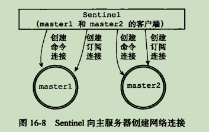

+ 获取主服务器信息：Sentinel没十秒一次的频率，向被监视的主服务器发送INFO命令，获取当前信息。当Sentinel分析INFo命令中包含的从服务器的信息的时候，会检查从服务器对应的实例是否存在于其主服务器实例slaves字典中，存在的话更新相关信息，否则的话创建新的实例

+ 获取从服务器信息：Sentinel没十秒一次的频率，向被监视的从服务器发送INFO命令，获取当前信息。会对从服务器实例进行更新

+ 向主服务器和从服务器发送信息：默认情况下，PUBLISH信息到主从服务器：

  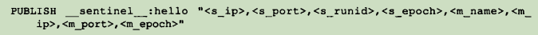

+ 接收来自主从服务器的频道信息：

  

  + 更新sentinels字典
  + 创建连接其他Sentinel的命令连接

  

+ 检测主观下线行为：默认情况下，Sentinel每秒向其创建了命令连接的实例发送PING命令，通过PONG回复检测是否在线。如果一个实例在down-after-millseconds毫秒内，连续向Sentinel返回无效回复，那么Sentinel会修改这个实例的结构，将flags属性中的SRI_S_DOWN标示，表示其主观下线。

+ 检查客观下线状态：当Sentinel讲一个服务器判断为主观下线之后，为了确保是否真的下线了，需要向其他监视了这个服务器的Sentinel进行询问，看他们是否也认为主服务器也已经进入了下线状态。当接收到足够的下线判断之后，Sentinel就会将从服务器判定为客观下线，并对主服务器执行故障转移操作。

+ 选举领头Sentinel：当一个主服务器被判断为客观下线时，监视这个下线服务器的各个Sentinel会进行协商，选举出一个领头Snetinel，由领头Sentinel对下线服务器执行故障转移操作。

  > Raft算法的领头选举方法的实现。

+ 故障转移：

  + 选出新的主服务器
  + 修改从服务器的复制目标
  + 将旧的主服务器变为从服务器


## 第十七章 集群

+ Redis 集群是 Redis 提供的分布式数据库方案, 集群通过分片(sharding)来进行数据共享, 并提供复制和故障转移功能。

+ 节点：一个 Redis 集群通常由多个节点(node)组成，在刚开始的时候，每个节点都是相互独立的，它们都处于一个只包含自已的集群当中，要组建一个真正可工作的集群，我们必须将各个独立的节点连接起来，构成一个包含多个节点的集群。

  + 启动节点：节点实际上就是一个运行在集群模式下的 Redis 服务器，通过 cluster-enabled 选项进行配置。

  + 集群数据结构：clusterNode 结构保存了一个节点的当前状态，CLusterState 结构记录了在当前节点的视角下，集群目前所处的状态

    

  + CLUSTER MEET命令实现：

    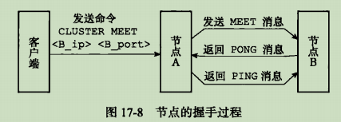

+ 槽指派：Redis 集群通过分片的方式来保存数据库中的键值对：集群的整个数据库被分为16384个槽(slot)，数据库中的每个键都属于这16384个槽的其中一个，集群中的每个节点可以处理0个或最多16384个槽。当数据库中的16384个槽都有节点在处理时，集群处于上线状态(ok)；相反地，如果数据库中有任何一个槽没有得到处理，那么集群处于下线状态(fail)。

  + 记录节点的槽指派信息：clusterNode 结构中的slots属性记录了节点当前负责处理那些槽：

    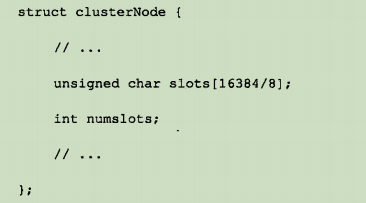

    slots数组是一个二进制数组，为 1 则该节点负责该槽，否则不负责该槽。

  + 传播节点的槽指派信息：当节点 A 通过消息从节点 B 那里接收到节点 B 的 s1ots 数组时,节点 A 会在自已的 clusterState.nodes字典中査找节点 B 对应的 clusterNode 结构,并对结构中的 slots 数组进行保存或者更新

    

  + 记录集群所有槽的指派信息：clusterState 结构中的 slots 数组记录了集群中所有的 16384 个槽的指派信息

    

  + CLUSTER ADDSLOTS命令的实现：首先改动 clusterState.slots 指针，将对应槽指向自己，然后修改clusterNode.slots 数组，将对应的 slots 置位。

+ 在集群中执行命令：当集群的16384个槽都指派后，集群就会进入上线状态，这时客户端就可以向集群中的节点发送命令了。

  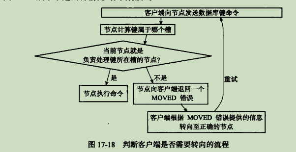

  + 计算键输入哪个槽：`CRC16(key) & 16383`
  + 判断槽是否由当前节点负责处理：clusterState.slots[i] == clusterState.myself
  + MOVED 错误：当节点发现键所在的槽不由自己处理的时候，返回`MOVED <SLOT> <ip>:<addr>`，客户端自动转向到对应的节点，再次发送命令
  + 节点数据库的实现：集群节点保存键值对的方式和单机 Redis 服务器保存方式完全相同。唯一区别是节点只能使用0号数据库。另外，节点会使用 clusterState.slots_of_keys 跳跃表保存槽和键之间的关系，命令`CLUSTER GETKEYSINSLOT <slot> <count>`就是建立在该结构上的。

+ 重新分片：Redis 集群的重新分片操作可以将任意数量已经指派给某个节点(源节点)的槽改为指派给另一个节点(目标节点)，并且相关槽所属的键值对也会从源节点被移动到目标节点。重新分片操作可以在线(online)进行,在重新分片的过程中，集群不需要下线，并且源节点和目标节点都可以继续处理命令请求。以下是对单个槽slot流程：

  

+ ASK错误：当执行分片期间，可能会存在这样一种情况：输入被迁移槽的一部分节点键值对保存在源节点里面，另外一部分保存在目标节点里面。此时响应客户端的命令如下：

  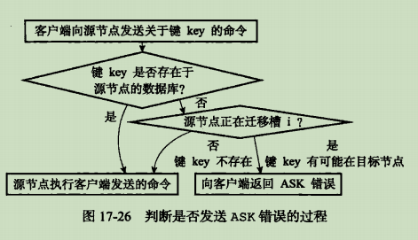

  + `CLSUTER SETSLOT IMPORTING`命令的实现：clusterState.importing_slots_from 记录了当前节点正在从其他节点导入的槽。

  + `CLUSTER SETSLOT MIGRATING`命令的实现：clusterState.migrating_slots_to 数组记录当前节点正在迁移至其他节点的槽。

  + ASK错误：如果槽正在迁移，会发送`ASK <SLOT> <ip>:<port>`

    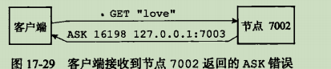

    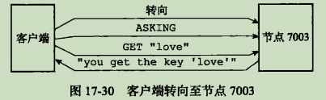

  + ASKING命令：打开发送该命令的客户端的 REDIS_ASKING 标示，该标示是一个一次性标示，当成功执行完一次命令的时候，此时该标示就会被移除。

    

  + ASK错误和MOVED错误：前者发生在节点间迁移槽的时候，是一种临时措施，后者发生在槽的负责权已经从一个节点迁移到了另外一个节点。

+ 复制与故障转移：Redis 集群中的节点分为主节点和从节点，主节点用于处理槽，从节点用于复制。故障转移措施和第十五章类似。

  + 设置从节点：`CLUSTER REPLICATE <node_id>`让接受命令的节点成为 node_id 所指向节点的从节点。此时从节点中设置 clusterState.myself.slaveof 属性，主节点设置 clusterNode.slaves 属性。
  + 故障检测：集群中每个节点定期向其他节点发送 PING 消息，以此检测是否在线，如果超时，标记为 PFAIL（probable fail）。在集群中超过半数的节点都认为某个主节点 PFAIL，那么这个节点会被标记为下线（FAIL），同时广播这条消息。
  + 故障转移：从FAIl 的主节点的从节点里面选择一个作为主节点，然后将原来主节点的额槽指派给自己，新的主节点广播 PONG 信息，让其他的节点知道这个节点已经选为主节点，最后新的节点开始接收和负责处理自己的槽有关的命令请求，故障转移完成。
  + 选举新的节点：Raft 算法。

+ 消息：节点发送的消息一般有五种：MEET 消息，PING 消息，PONG 消息，FAIL 消息，PUBLISH 消息。


## 第十八章 发布与订阅

+ Redis 的发布与订阅的功能由 PUBLISH，SUBSCRIBE，PSUBSCRIB 等命令组成，每当有其他客户端向被订阅的频道发送消息时，频道的所有订阅者都会收到这个消息。

+ 频道的订阅与退订：Redis 将所有订阅关系保存在RedisServer.pubsub_channels 字典里面，键是某个被订阅的频道，键值则是一个链表，保存着所有订阅这个频道的客户端。

  

  + 订阅频道：如果有频道已经在字典中，直接尾部插入订阅者，否则创建字典项，键为频道，键值为该客户端
  + 退订频道：根据被退订的频道名字，从订阅者链表中删去客户端，如果此时订阅者链表为空，则删除对应的字典项

+ 模式的订阅与退订：Redis 将所有模式的订阅关系保存在RedisServer.pubsub_patterns 属性里面。

  

  + 订阅模式：新建一个pubsubPattern结构，设置好client和pattern属性，然后将其加入到pubsub_patterns 链表的表尾。
  + 退订模式：从pubsub_patterns中查找对应的被退订的pubsubPattern结构，然后将其删除。

+ 发送消息：当执行`PUBLISH <channel> <message>`时候，服务器需要将消息message发送到对应的channel的所有订阅者，另外如果有模式匹配这个channel，那么需要将message发送给pattern模式的订阅者。

  + 将消息发送给频道订阅者：从pubsub_channels 字典里面找到订阅者链表，然后将消息发送给名单上的所有客户端
  + 将消息发送给模式订阅者：遍历pubsub_patterns链表，查找那些与channel频道匹配的模式，并且将消息发送到这些模式的客户端。

+ 查看订阅消息：PUBSUB命令可以查看频道或者模式的相关信息

  + PUBSUB CHANNELS [pattern]：返回与pattern匹配的频道
  + PUBSUB NUMSUB [channel-1 channel-2]:返回频道对应订阅者的数量
  + PUBSUB NUMPAT: 返回当前服务器被订阅模式的数量


## 第十九章 事务

+ Redis通过MULTI，EXEC，WATCH等命令实现事务功能。在事务执行期间，服务器不会中断事务去执行其他客户端的请求，他会将事务中的命令执行完毕之后才去处理其他的客户端的请求。

+ 事务的实现：包括三个部分，如下：

  + 事务开始：MULTI命令的执行标志者事务的开始，会将执行该命令的客户端从非事务状态转换为事务状态

  + 命令入队：当客户端处于事务状态之后，如果客户端发送的指令是EXEC，DISCARD，WATCH，MULTI命令之一，那么立即执行，否则的话将其放入事务队列之中，然后返回QUEUED回复。每个Redis客户端都有自己的事务状态 mstate，里面包含一个事务队列：

    

  + 执行事务：当发送EXEC命令的时候，此时就开始执行遍历这个客户端的事务队列，执行其中的所有命令，然后将得到的回复返回给客户端。

+ WATCH命令的实现：WATCH命令是一个乐观锁，它可以在EXEC命令执行之前，监视任意数量的数据库键，并且在EXEC命令执行的时候，检查被监视的键中是否至少有一个已经被修改过了，如果是的话，服务器将拒绝执行事务，并向客户端返回执行失败的空回复。

  + WATCH命令监视数据库键：每个Redis数据库都保存着一个watched_keys字典，字典的键是某个数据库键，而字典的值则是一个链表，记录所有的监视相应数据库键的客户端：

    ```c
    typedef struct redisDb {
    	dict *watched_keys;
    	// ...
    }
    ```

  + 监视机制的触发：所有对数据库进行修改的命令，在执行之后会调用touchWatchKey函数对监视字典进行检查，如果某个键被修改，会将对应的客户端REDIS_DIRTY_CAS标示打开，表示客户端的安全性已经被破坏。

  + 判断事务是否安全：服务器根据客户端的REDIS_DIRTY_CAS标识来决定是否执行事务：

    

+ 事务的ACID性质：在Redis中，事务总是具有原子性，一致性，隔离性，当Redis运行在某种持久化模式下，也具有持久性。

  + 原子性：数据库将事务中的多个操作当作一个整体来执行,服务器要么就执行事务中的所有操作,要么就一个操作也不执行。 Redis的事务和传统的关系型数据库事务的最大区别在于, Redis不支持事务回滚机制 (rollback),即使事务队列中的某个命令在执行期间出现了错误,整个事务也会继续执行下去,直到将事务队列中的所有命令都执行完毕为止。

    > Redis的作者在事务功能的文档中解释说,不支持事务回滚是因为这种复杂的功能和 Redis追求简单高效的设计主旨不相符,并且他认为, Redis事务的执行时错误通常都是编 程错误产生的,这种错误通常只会出现在开发环境中,而很少会在实际的生产环境中出现 所以他认为没有必要为 Redis开发事务回滚功能。 

  + 一致性：如果数据库在执行事务之前是一致的，那么在事务执行之后，不论事务是否执行成功，数据库也应该仍然是一致的。Redis事务可能出错的地方有入队错误，执行错误，服务器宕机。

  + 隔离性：即使数据库中有多个事务并发地执行,各个事务之间也不会互相影响,并且在并发状态下执行的事务和串行执行的事务产生的结果完全相同。 因为 Redis使用单线程的方式来执行事务(以及事务队列中的命令),并且服务器保证在执行事务期间不会对事务进行中断,因此, Redis的事务总是以串行的方式运行的,并且事务也总是具有隔离性的。

  + 持久性：当一个事务执行完毕时,执行这个事务所得的结果已经被保存到永久性存储介质(比如硬盘)里面了, 即使服务器在事务执行完毕之后停机, 执行事务所得的结果也不会丢失。只有当服务器运行在AOF持久化模式下，并且appendfsync选项的值为ALWAYS的时候，这种配置下的事务是具有持久性的。


## 第二十一章 排序

+ `SORT <key>` 命令的实现：假设已经执行`RPUSH numbers 3 1 2`, 现在执行`SORT numbers`，

  + 首先创建一个和numbers列表长度相同的数组，数组的每一项是redis.h/redisSortObject结构

  + 遍历数组，将数组项的obj指针指向对应的列表项，一一对应

  + 遍历数组，将obj指针指向的列表项转换为一个double类型的浮点数，存到u.score中

  + 根据u.score中的值，进行升序排序

  + 遍历数组，将各个数组项的obj指针指向的列表项返回给客户端

    

    redisSortObject结构如下：

    

+ ALPHA选项实现：字典序排序

+ ASC选项和DESC选项的实现：默认是升序排序，升序和降序排序只不过是排序算法使用的对比函数不同而已。

+ BY选项实现：默认情况下，SORT命令使用被排序键包含的元素作为排序的权重，元素本身决定了排序所处的位置。可以使用BY选项来改变这种情况。

+ 带有ALPHA选项的BY选项的实现：BY选项默认权重值保存的值是数字值，如果是字符串值的话，需要在使用By选项的同时，配合使用ALPHA选项。

+ LIMIT选项的实现：`LIMIT <offset> <count>`。

+ GET选项的实现：更具被排序结果中的元素，查找相关的信息。

+ STORE选项的实现：STORE选项可以保存排序结果在指定的键里面

+ 多个选项的执行顺序：排序，限制长度，获取外部键，保存排序结果集。

  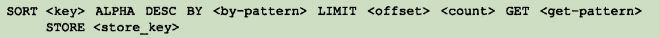

  除了GET选项外，改变选项的摆放顺序不会影响SORT命令执行这些选项的顺序。


## 第二十三章 慢查询日志

+ 慢查询日志：记录执行时间超过指定时长的命令请求，用户可以通过该功能产生的日志来优化查询速度。服务器有两个和慢查询日志相关的选项：

  + slowlog-log-slower-than: 指定执行时间上限，超过上限的会被记录到日志上
  + slowlog-max-len: 记录慢查询日志最大条数

+ 慢查询日志记录的保存：服务器状态中有几个和慢查询日志有关的属性：

  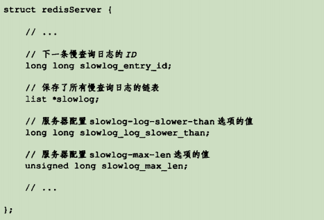

  其中slowlog链表保存所有的慢查询日志。每个节点是一个slowlogEntry：

  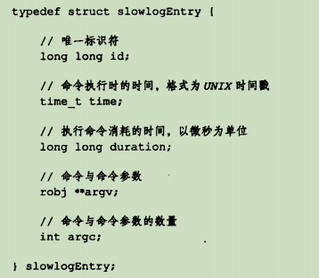

+ 慢查询日志的阅览和删除：遍历查询和遍历删除

+ 添加新日志：对慢查询日志进行头插法插入


## 第二十四章 监视器

+ 通过执行MONITOR命令，客户端可以将自己变为一个监视器，实时接收并打印服务器当前处理的命令请求。

+ 成为监视器：执行MONITOR命令后。客户端的REDIS_MONITOR标志会被打开，并且这个客户端会被添加到monitors链表的表尾。

  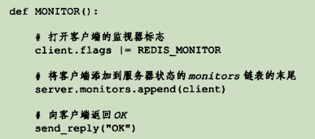

+ 向监视器发送命令信息：服务器每次执行命令之前，都会调用replicationFeedMonitor函数，由这个函数将命令请求信息发送给各个监视器。