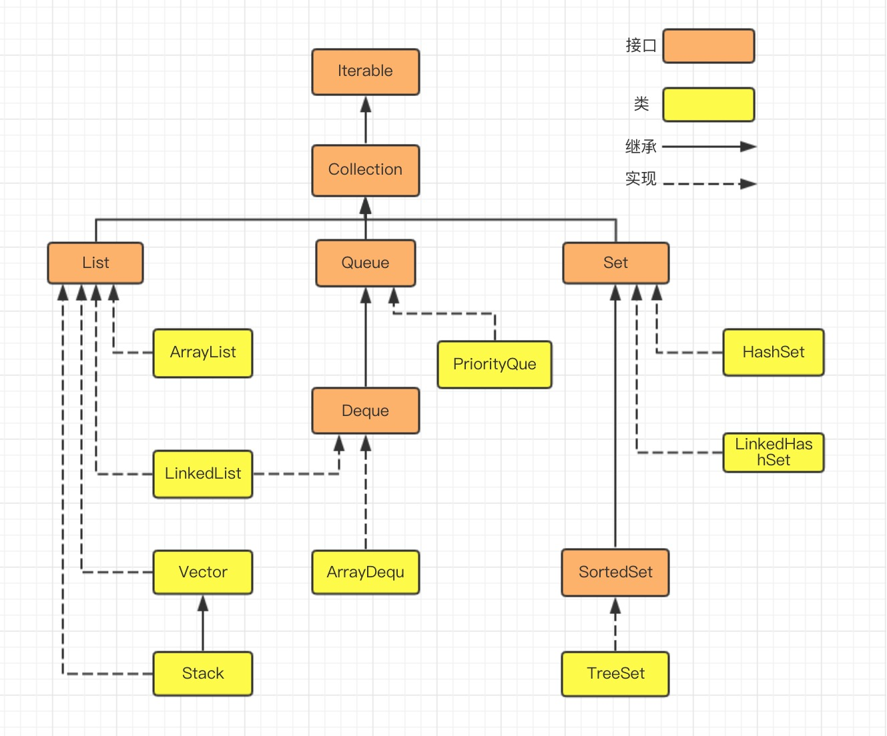
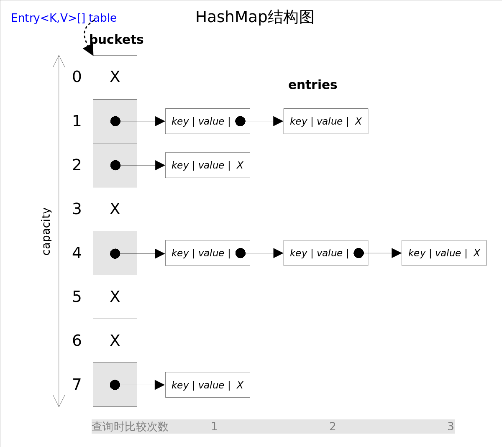
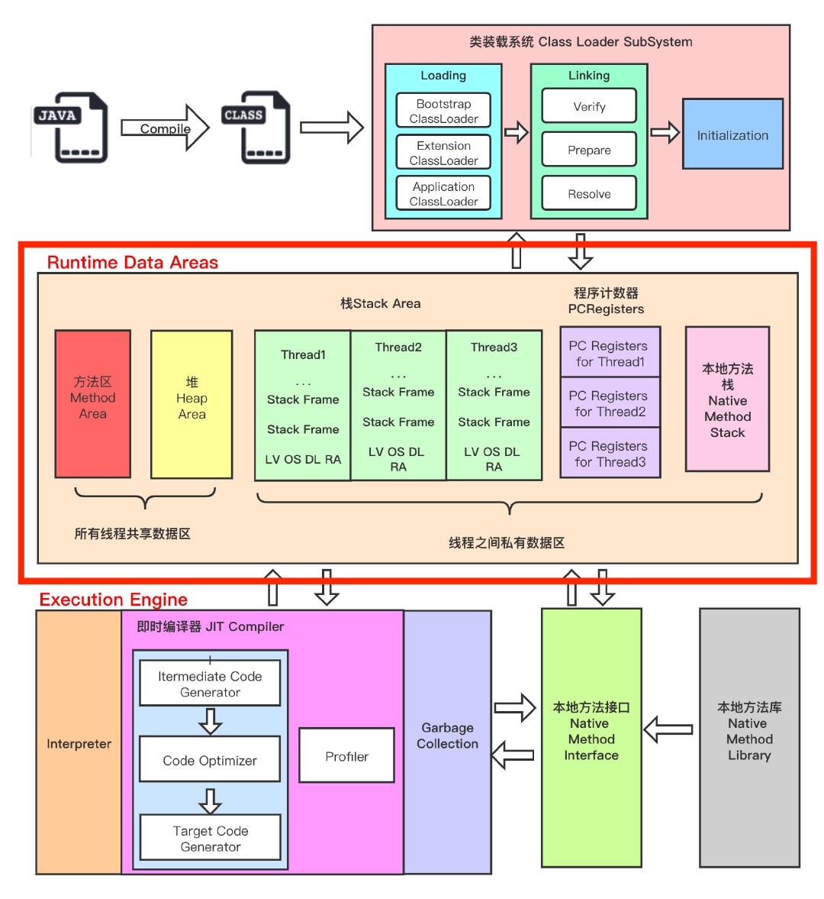
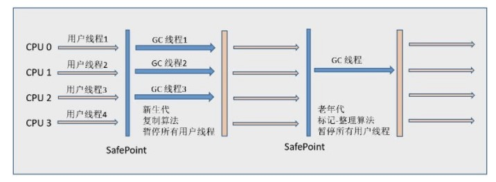

本文用于记录 Java 相关知识，以备查阅。

<!-- More -->


## 01 面向对象

面向对象的三大特征：

+ 封装：通过访问修饰符实现，优点是减少耦合，提高软件的可重用性
+ 继承：通过 extends 实现，表示 is-a 的关系
+ 多态：编译时多态指的是方法的重载，运行时多态指的是对象引用所指向的具体类型在运行期间才确定，运行时多态通过继承，重写，向上转型实现


## 02 基础知识

数据类型：8 种基本类型，对应 8 种包装类型，通过 `xxxValue` 和 `valueOf` 自动拆箱和装箱

缓存池：

+ 基本类型：除了 long，float 和 double，其它类型都有一字节的缓存池
+ String：字面量创建会先从常量池获取，没有的话再创建，new 创建不会加入常量池

String：被声明为 final，内部存储的 value 数组也被声明为 final，同时内部没有改变 value 指向的方法，因此保证了 String 类不可变，不可变的好处：

+ 可以缓存 hash 值
+ String Pool 的需要，如果可变将没有意义
+ 安全性和线程安全

String，StringBuilder，StringBuffer：

+ String 不可变，StringBuilder 和 StringBuffer 可变
+ String 和 StringBuffer 是线程安全的，StringBuilder 不是线程安全的

String.intern：可以保证相同内容的字符串变量引用同一的内存对象，其首先将字符串对象放到字符串常量池中，然后返回这个对象引用

参数传递：Java 中的参数是以值传递的形式传入方法中的，而不是引用传递

float 和 double：浮点数字面量默认是 double 类型，需要加后缀 `f` 将其表示为 float 类型

隐式类型转换：整型数字面量是 int 类型，使用复合运算符如 `+=` ，会自动类型转换

switch：从 Java 7 开始，支持 String 对象（对应的 hashcode ），但是其仍旧不支持 long

访问权限：

+ 类可见：其它类可以用这个类创建实例对象
+ 成员可见：其它类可以用这个类的实例对象访问到该成员

| 访问权限  | 本类 | 本包的类 | 子类 | 非子类的外包类 |
| --------- | ---- | -------- | ---- | -------------- |
| public    | 是   | 是       | 是   | 是             |
| protected | 是   | 是       | 是   | 否             |
| default   | 是   | 是       | 否   | 否             |
| private   | 是   | 否       | 否   | 否             |

抽象类和接口：

+ 抽象类：一般会包含抽象方法，抽象方法一定位于抽象类中，不能被实例化
+ 接口：是抽象类的延伸，在 Java 8 开始，引入了默认方法
+ 比较：
  + 抽象类提供了 is-a 的关系，而接口提供了 like-a 关系
  + 一个类只能继承一个抽象类，但是可以实现多个接口
  + 接口的字段只能是 static 和 final ，成员（字段和方法）只能是 public

super：

+ 访问父类的构造函数，需要放到子类构造函数第一行
+ 访问父类的成员

重写和重载：

+ 重写：存在于继承体系中，为了满足里式替换原则，需要满足
  + 参数列表和父类相同
  + 子类方法的访问权限必须大于等于父类方法
  + 子类方法的返回类型必须是父类方法返回类型或为其子类型
+ 重载：存在于同一个类中，指方法名相同，但是参数类型，个数，顺序至少有一个不同，应该注意的是，返回值不同，其它都相同不算是重载

Object 通用方法：getClass，hashCode，equals，clone，toString，notify，notifyAll，wait，finalize

equals 方法实现：

+ 检查是否为同一个对象的引用，如果是直接返回 true
+ 检查是否是同一个类型，如果不是，直接返回 false
+ 将 Object 对象进行转型
+ 判断每个关键域是否相等

hashCode：用于返回对象的哈希值，通常将每个字段看作是 R 进制中的某一位，R 一般取 31

clone：是 Object 类的 protected 方法，并不是 public，如果想要重写该方法，还需要实现 Cloneable 空接口。分为浅拷贝和深拷贝两种方式，可以使用更加安全的拷贝构造函数来拷贝一个对象

final：

+ 修饰数据时，表示数据是常量，对于引用类型，只是使其引用不变
+ 修饰方法时，表示方法不能被重写，private 方法隐式地指定为 final
+ 修饰类时，表示类不可被继承

static：

+ 静态变量：类变量，所有实例共享静态变量
+ 静态方法：在类加载的时候就存在了，不能是抽象方法，不能包含 this 和 super
+ 静态语句块：类初始化时运行一次
+ 静态内部类：非静态内部类依赖于外部类的实例，而静态内部类不需要
+ 静态导包：不用指定类名就可以使用方法，但是可读性降低
+ 初始化顺序：静态变量和静态语句块优先于实例变量和普通语句块，静态变量和静态语句块的初始化顺序取决于它们在代码中的顺序。在存在继承的情况下：
  + 父类(静态变量、静态语句块)
  + 子类(静态变量、静态语句块)
  + 父类(实例变量、普通语句块)
  + 父类(构造函数)
  + 子类(实例变量、普通语句块)
  + 子类(构造函数)

Java 7 版本新特性：

1. Strings in Switch Statement
2. Type Inference for Generic Instance Creation
3. Multiple Exception Handling
4. Support for Dynamic Languages
5. Try with Resources
6. Java nio Package
7. Binary Literals, Underscore in literals
8. Diamond Syntax

Java 8 版本新特性：

1. Lambda Expressions
2. Pipelines and Streams
3. Date and Time API
4. Default Methods
5. Type Annotations
6. Nashhorn JavaScript Engine
7. Concurrent Accumulators
8. Parallel operations
9. PermGen Error Removed

Java 和 C++ 区别：

+ Java 是纯粹的面向对象语言，C++ 既支持面向对象也支持面向过程
+ Java 通过虚拟机从而实现跨平台特性，但是 C++ 依赖于特定的平台
+ Java 没有指针，它的引用可以理解为安全指针，而 C++ 具有和 C 一样的指针
+ Java 支持自动垃圾回收，而 C++ 需要手动回收
+ Java 不支持多重继承，只能通过实现多个接口来达到相同目的，而 C++ 支持多重继承
+ Java 不支持操作符重载，而 C++ 可以
+ Java 的 goto 是保留字，但是不可用，C++ 可以使用 goto
+ Java 不支持条件编译，C++ 通过 #ifdef #ifndef 等预处理命令从而实现条件编译


## 03 泛型机制

引入泛型的意义：

+ 适用于多种数据类型执行相同的代码
+ 使用泛型可以提供编译前的检查，不需要强制类型转换，更加安全

泛型的使用：

+ 泛型类
+ 泛型接口
+ 泛型方法：相比泛型类，其更加灵活，在使用不同的参数的时候，不需要再次实例化一个对象

泛型的上下限：为类型参数增加限制

+ 上限：`<T extends Number>`，注意，extends 后面可以是接口，表示实现了接口的类型
+ 下限：`<T super String>`，表示 T 是 String 或者 String 的父类（Object）
+ 无限制通配符：`<T>` 或者 `<?>`
+ 多个限制：`<T extends A & B >`  或者 `<T extends A , B >`，通常一个类和多个接口

类型擦除：Java 中实现泛型的方式是在编译阶段进行类型擦除，即

+ 将所有泛型表示都替换为具体的类型
+ 为了保证类型安全，必要时插入强制类型转换
+ 自动产生桥接方法保证擦除后的代码具有泛型的多态性

证明类型擦除：

+ 原始类型相同：如`ArrayList<String>` 和 `ArrayList<Integer>` 的 getClass 返回值相同

+ 通过反射可以添加其他类型的元素：

  `strList.getClass().getMethod("add", Object.class).invoke(list, "asd")`

原始类型：指擦除了泛型信息，最后在字节码中的类型变量的真正类型

泛型的编译期检查：Java 编译期会先检查代码中泛型的类型，然后再进行类型擦除，之后进行编译

+ 类型检查就是针对引用的，谁是一个引用，用这个引用调用泛型方法，就会对这个引用调用的方法进行类型检测，而无关它真正引用的对象

+ 参数化类型不考虑继承关系，下面的引用传递不被允许：

  ```java
  // 编译错误，ClassCastException  
  ArrayList<String> list1 = new ArrayList<Object>(); 
  //编译错误，违背使用泛型的初衷
  ArrayList<Object> list2 = new ArrayList<String>(); 
  ```

泛型的多态实现：类型擦除会造成多态的冲突，JVM 采用桥接方法解决该问题

```java
class DateInter extends Pair<Date> {  

    @Override  
    public void setValue(Date value) {  
        super.setValue(value);  
    }  
    @Override  
    public Date getValue() {  
        return super.getValue();  
    }  
		// 编译器添加的桥接方法
  	public void setValue(Object value) {
      	setValue((Date)value);
    }
  	// 编译期添加的桥接方法
  	public Object getValue() {
      	return getValue();
    }
}

```

另外，子类中桥接方法`Object getValue()`和`Date getValue()`是同时存在的，虚拟机可以通过返回值和参数类型来区别，但是在编写程序的时候，Java 编译期不允许我们这样做。

基本类型不能作为泛型类型：无限制泛型擦除后将变为 Obejct，而 Obejct 不能存储 int 等基本类型

泛型类型不能实例化：本质上由于类型擦除造成的，如果确实需要实例化泛型，可以使用反射

泛型数组：采用通配符的方式初始化泛型数组（存在警告），因为对于通配符的方式最后取出数据是要做显式类型转换的，符合预期逻辑。更加优雅的方式是使用反射：`Array.newInstance`

泛型类中的静态方法和静态变量：不可以使用泛型类所声明的泛型类型参数，因为静态变量和静态方法不需要使用对象来调用，从而类型参数不确定，但是可以使用泛型静态方法

获取泛型的参数类型：通过反射 `java.lang.reflect.Type` 获取


## 04 注解机制

注解分类：

+ Java 自带的标准注解：`@Override`，`@Deprecated`，`@SupressWarning`
+ 元注解：用于定义注解的注解
+ 自定义注解：根据自己需求定义注解

自带的标准注解：

- `@Override`：表示当前的方法定义将覆盖父类中的方法
- `@Deprecated`：表示代码被弃用，如果使用了被 @Deprecated 注解的代码则编译器将发出警告
- `@SuppressWarnings`：表示关闭编译器警告信息

元注解：描述注解的注解

+ `@Target`：描述注解的使用范围，取值范围在 ElementType 枚举类中
+ `@Retention`：描述注解保留的时间范围，取值范围在 RetentionPolicy 中，共三种
+ `@Documented`：描述在使用 javadoc 工具为类生成帮助文档时是否要保留其注解信息
+ `@Inherited`：被它修饰的注解将具有继承性，被该注解修饰的父类，其子类自动具有该注解
+ `@Repeatable`：允许在同一申明类型(类，属性，或方法)的多次使用同一个注解
+ `@Native`：修饰成员变量，则表示这个变量可以被本地代码引用，常常被代码生成工具使用

注解和反射：通过反射下的 AnnotatedElement 接口可以获取注解，要求该注解范围是 RUNTIME 的

注解不支持继承：尽管在内部实现中，注解被翻译成 interface，但是并不能使用 extends 来继承某个 @interface，另外，在注解编译后，编译器会自动将其继承到 Annotation 接口

注解使用场景：

+ 配置化到注解化：框架的演进
+ 继承实现到注解实现：junit3 到 Junit4
+ 自定义注解和 AOP：通过切面实现解耦


## 05 异常机制

异常结构层次：


+ 可查异常：编译器要求必须处理的异常，包括非运行时异常
+ 不可查异常：编译器不强制要求处理的异常，包括运行时异常和错误

异常关键字：try，catch，fainally，throw，throws

异常的声明（throws）：在方法末尾添加该语句即可，添加异常的规则

+ 如果是不可查异常，那么可以不使用 throws 来声明，因为在运行时会被系统抛出
+ 必须声明任何方法可抛出的的可查异常
+ 重写方法声明的异常必须是被重写方法声明的异常或者其子类

异常的抛出（throw）：有时在 catch 中抛出一个异常，目的是为了改变异常的类型

异常自定义：通过继承异常类实现，可以实现带有详细描述信息的构造函数用于调试

异常的捕获：

+ try-catch：同一个 catch 可以捕获多种不同的异常，使用 `|` 分割
+ try-catch-finally：不管有没有出现异常，finally 中的语句块始终会被执行，通常 finnaly 里面不要包含 return 语句
+ try-finally：保证资源使用后被关闭
+ try-with-resource：自动释放资源，需要资源实现了 AutoClaseable 接口的类

异常实践：

+ 只针对不正常的情况才使用异常，如可以通过判断规避掉 NullPointorException
+ 使用 finally 或者 try-with-resources 关闭资源
+ 尽量使用标准的异常，基于语义的基础
+ 对异常进行文档说明
+ 优先捕获最具体的异常
+ 不要捕获 Throwable 类，因为其会捕获 Error（如 OOM）
+ 不要忽略异常，至少记录异常的信息
+ 不要记录并抛出异常，可能导致多个地方输出同一个异常信息
+ 包装异常时不要抛弃原始的异常，否则失去了原始的堆栈信息
+ 不要使用异常控制程序的流程
+ 不要在 finally 块中使用 return，会覆盖 try 块中的返回点

JVM 处理异常的机制：编译器通过编译后，会生成对应的异常表，异常表每项表示为（from，to，target，type），表示在 [from, to] 代码段中可能发生异常，如果发生 type 类异常，就跳转到 target 对应的代码段。在发生异常的时候，JVM 查找异常表，跳转到对应的 target 地方

异常耗时：建立一个异常对象，大概是一个普通 Object 对象的 20 倍，而抛出，接收一个异常，所花费时间大约是建立异常对象的 4 倍


## 06 反射机制

反射机制：在运行时，对于任意一个类，都能够知道这个类的所有属性和方法；对于任意一个对象，都能够调用它的任意一个方法和属性。

Class 类：Class 类也是一个类，其实例用于表示运行时的类（class & enum）或接口（interface & annotation），数组和基本类型同样也被映射为 Class 对象的一个类

+ 手动编写的类编译后会产生 Class 对象，其被保存在同名 .class 文件中
+ 每个类在内存中只有一个对应的 Class 对象来描述其信息，采用单例模式
+ Class 类只存在似有构造函数，因此对应的 Class 对象只能通过 JVM 加载和创建

Class 类对象的获取：

+ 根据类名：类名.class
+ 根据对象：对象.getClass()
+ 根据全限定类名：Class.forName(全限定类名)

Constructor 类：表示 Class 对象所表示类的构造方法，相关方法如下：

+ getConstructor(Class<?>... parameterTypes)：返回具有 public 访问权限的构造函数对象
+ getDeclaredConstructor(Class<?>... parameterTypes)：返回所有（包括 private）构造函数对象
+ newInstance()：调用无参构造器创建新的实例
+ newInstance(Object... initargs)

Field 类：提供有关类或接口单个字段的信息，以及对它的动态访问权限

+ getField：获取指定的名称，且具有 public 修饰的字段，包括继承字段
+ getDeclaredField：获取指定的字段（包括 private），不包括继承的字段
+ set(Object obj, Object value) &  get(Object obj)：不可设置 final 字段
+ setAccessible(boolean flag)：设置其可访问性，用于访问 private 属性

Method 类：提供关于类或接口上单独某个方法的信息

+ getMethod(String name, Class<?>... parameterTypes)
+ getDeclaredMethod(String name, Class<?>... parameterTypes)
+ invoke(Object obj, Object... args)

反射调用流程：

+ 反射类和反射方法的获取，都是通过从列表中顺序搜寻查找匹配的方法
+ 当找到需要的方法时，都会 copy 一份出来，保证数据隔离
+ 每个类都可以获取 method 反射方法，并作用到其他实例身上
+ 反射也是线程安全的
+ 反射使用 reflectionData 缓存 Class 信息，避免开销


## 07 SPI 机制

SPI 机制：JDK 内置的服务提供发现机制，可以用来启用框架扩展和替换组件。服务提供者定义接口后，需要在 classpath 下的 `META-INF/services/` 目录下创建一个服务接口命名的文件，这个文件里的内容就是这个接口具体的实现类。

SPI 机制：JDBC DriverManager，在以前开发时，需要先 Class.forName 加载数据库相关的驱动，而在 JDBC4.0 之后直接获取连接就可以了

+ JDBC 接口定义：java 中定义了接口 `java.sql.Driver`，但是没有具体实现
+ 实现：
    + mysql：在 mysql 的 jar 包中，可以找到 `META-INF/services` 目录，该目录下面有一个 `java.sql.Driver` 的文件，文件内容是 `com.mysql.cj.jdbc.Driver`
    + postgresql：在对应的目录下面，也可以找到对应的配置文件
+ 使用方法：直接通过  `DriverManager.getConnection` 来获取连接，实际执行代码的步骤
    + 从系统变量中获取有关驱动的定义
    + 使用 SPI 来获取驱动的实现：`ServiceLoader.load`
    + 遍历使用 SPI 获取到的具体实现，实例化各个实现类

SPI 的缺点：

+ 不能按需加载，需要遍历所有的实现并实例化（懒加载），然后在循环中才能找到我们需要的实现
+ 获取某个实现类的方式不灵活，只能通过 Iterator 形式获取
+ 不是并发安全的


## 08 Collection 类

集合类：集合类用于容纳其他的 Java 对象，其只能存放对象，基本类型通常需要装包和解包

+ Collection：存储对象的集合

    

+ Map：存储键值对的映射表

    

ArrayList：实现了 List 接口，允许存放 null 元素，底层通过 Object 数组实现，以便容纳任何类型的对象，为了追求效率，并没有实现线程同步

+ add，addAll，get，set，remove，indexOf，lastIndexOf
+ 自动扩容：如果添加数据时，超过 capacity 值，就会自动扩容，每次扩容变为之前容量的 1.5 倍，在实际添加大量元素前，可以通过 ensureCapacity 来提前分配
+ Fail-Fast：采用了快速失败机制，记录 modCount 参数来实现，在并发修改时，迭代器很快就会失败

LinkedList：底层是带有头尾节点的双向链表，同时实现了 List 接口和 Deque 接口，即可以看作是顺序容器，又可以看作是一个队列，同时可看作一个栈。不过关于栈或者队列，现在首选的是 ArrayDeque，其有着更好的性能。如果需要多个线程并发访问，可以采用 `Collections.synchronizedList()` 进行包装

+ getFirst，getLast，removeFirst，removeLast，remove，add，addAll，clear，set，get
+ Queue 方法：offer，poll，peek，remove，element
+ Qeque 方法：offerFirst，offerLast，peekFirst，peekLast，pollFirst，pollLast，removeFirstOccurrence，removeLastOccurrence

Stack：当需要使用栈时，推荐使用更高效的 ArrayDeque

Queue：支持两组格式的 api

+ 抛出异常：add，remove，element
+ 返回值（null）实现：offer，poll，peek

Deque：同样支持两组格式的 api，无非是如 offerFirst/offerLast 格式，ArrayDeque 实现了 Deque 接口，其底层采用循环数组实现

PriorityQueue：优先队列保证每次取出的元素都是队列中权值最小的（默认），元素大小即可以通过元素本身自然顺序，也可以通过构造时传入的比较器，不允许放入 null 元素，通过完全二叉树实现的小顶堆，意味着可以通过数组作为底层数据结构

+ 抛出异常：add，element，remove
+ 返回值：offer，peek，poll

HashMap：实现了 Map 接口，既允许 key 为 null，也允许 value 为 null，该类未实现线程同步

+ 插入：采用头插法进行插入，为了解决冲突，采用冲突链表方式

+ hashcode 决定了对象会被放到哪个 bucket 中，当多个对象的哈希值冲突时，equals 方法决定了这些对象是否是同一个对象

+ 数组扩容：有两个参数会影响 HashMap 的性能，初始容量和负载系数，负载系数用来指定自动扩容的临界值，当 entry 的数量超过 `capacity * load_factor` 时，容器将自动扩容并且重新哈希，每次扩容后容量为原来的 2 倍

+ Java 7 采用链表和数组实现 HashMap：

    

+ Java 8 采用链表，数组和红黑树实现，主要不同在于当链表中的元素超过 8 个时，会将链表转换为红黑树，使得在进行查找的时候降低时间复杂度

    

HashSet：对 HashMap 的一个简单封装，对 HashSet 的函数调用都会转换成合适的 HashMap 方法

LinkedHashMap：实现了 Map 接口，可以看作是 linkedlist 增强的 hashmap，其采用双向链表的形式将所有的 entry 连接起来，这样是为了保证元素的迭代顺序和插入顺序相同，另外，遍历的时候只需要从 header 开始遍历即可，遍历的时间复杂度和元素个数相同


TreeMap：实现了 SortedMap 接口，会按照 key 的大小顺序对 Map 中的元素排序，其底层采用红黑树

+ ceilingKey，floorKey，higherKey，lowerKey
+ headMap，tailMap
+ descendingKeySet，pollFirstEntry，pollLastEntry，subMap

WeakHashMap：里面的 entry 可能会被 GC 自动删除，即使程序员没有调用 remove 或者 clear 方法

+ 用于需要缓存的场景，这是在于缓存 miss 并不会造成错误
+ 弱引用：虽然弱引用可以用来访问对象，但是在进行垃圾回收时并不会被考虑在内，仅有弱引用指向的对象依旧会被 GC 回收
+ 并没有 WeakHashSet：可以通过 `Collections.newSetFromMap`


## 09 IO 知识体系


IO 分类：

+ 传输方式：
    + 字节流：读取单个字节，用来处理二进制文件
    + 字符流：读取单个字符，用来处理文本文件
+ 操作对象：文件，数组，管道，基本数据类型，打印，对象，缓冲，转换

字节转字符：通过 `{Input,Output}Stream{Reader,Writer}` 实现，char 类型使用 UTF-16be 编码

IO 设计模式：装饰者模式，FilterInputStream 属于抽象装饰者，为组件提供额外功能，如缓冲


IO 常见类的使用：

+ 磁盘操作：File，表示文件和目录的信息
+ 字节操作：InputStream 和 OutputStream
+ 字符擦做：Reader 和 Writer
+ 对象操作：Serializable，只是一个标准接口，transient 关键字可以让某些属性不被序列化
+ 网络操作：Socket

Unix 下的五种 IO 模型：

+ 阻塞式 IO：

    

+ 非阻塞式 IO：

    

+ 多路复用 IO：

    

+ 信号驱动 IO：

    

+ 异步 IO：应用进程在调用 recvfrom 操作时不会阻塞

    

五种 IO 模型的对比：


IO 多路复用：

+ 工作模式：
    + LT 模式：当 epoll_wait() 检测到描述符事件到达时，将此事件通知进程，进程可以不立即处理该事件，下次调用 epoll_wait() 会再次通知进程，默认模式，同时支持 Blocking 和 No-Blocking
    + ET 模式：通知之后进程必须立即处理事件，下次不会对该事件通知，减少了 epoll 事件被重复触发的次数，效率高些，只支持 No-Blocking，防止出现饿死情况
+ 应用场景：
    + select：timeout 参数精度 1ns，而 poll 和 epoll 为 1ms，更加适用于实时性要求高的场景，同时兼容性也好一些
    + poll：没有最大描述符数量的限制，如果需要监控的描述符状态变化多，而且都是非常短暂的，没有必要使用 epoll。因为 epoll 中的所有描述符都存储在内核中，造成每次需要对描述符的状态改变都需要通过 epoll_ctl() 进行系统调用，频繁系统调用降低效率
    + epoll：只需要运行在 linux 上，并且有非常大量的描述符需要同时轮询

IO 概念区分：

+ 阻塞 IO 和 非阻塞 IO：程序级别，当程序请求 OS IO 操作后，如果 IO 资源没有准备好，应该如何处理
+ 同步 IO 和 异步 IO：操作系统级别，当程序请求 OS IO 操作后，如果 IO 资源没有准备好，该如何响应

BS 架构发展：

+ 单线程：服务器同时只能处理单个请求，会造成多个客户端等待问题
+ 多线程：accept 使用单线程方式，处理请求时使用多线程或者线程池，但是 accept 和 read 还是阻塞 

Java IO 和 NIO 区别：

+ 是否阻塞：IO 是阻塞的，NIO 则是非阻塞的
+ 操作粒度：
    + IO 中对流进行操作，读写操作按照字节为单位，简单，但是效率低
    + NIO 中对通道进行操作，读写操作按照块为单位，高效，但是缺少简单性

NIO 相关概念：

+ 通道：是对流的模拟，通过通道可以读取并写入数据，即双向的
+ 缓冲区：发送和接受通道中的数据都需要首先放到缓冲区中，包括 capacity，position 和 limit 成员，通过 flip 可以切换缓冲区的读写状态
+ 选择器：通过轮询的方式去监听多个通道上的事件，让一个线程可以处理多个事件
    + 创建选择器：Selector.open
    + 将通道注册到选择器上：ssChannel.register，注册事件可以是 accept，也可以是 read & write
    + 监听事件：selector.select，会阻塞直到至少一个事件到达
    + 获取到达的事件：selector.selectedKeys
    + 事件循环

内存映射文件：是一种读写文件数据的方法，比常规的基于流和基于通道的 IO 快得多，通过 fc.map 创建该映射缓冲 MappedByteBuffer，就可以像使用 ByteBuffer 一样使用它

典型的多路复用 IO 实现：

| IO模型 | 性能 | 关键思路         | 操作系统      | JAVA 支持情况            |
| ------ | ---- | ---------------- | ------------- | ------------------------ |
| select | 较高 | Reactor          | windows/Linux | Reactor 模式             |
| poll   | 较高 | Reactor          | Linux         | Linux 下的 JAVA NIO 框架 |
| epoll  | 高   | Reactor/Proactor | Linux         | 使用 epoll 进行支持      |
| kqueue | 高   | Proactor         | Linux         | 不支持                   |

Reactor 模型：基于事件驱动，主要包括三个组件：

+ Reactor：等待客户端的连接，并将其派发给 Acceptor
+ Acceptor：进行客户端连接的获取，之后交给线程池进行网络读写
+ Handler：用于处理连接的网络读写操作，并进行事务处理（可以交给线程池）

Java AIO 模型：由于此时采用的是订阅-通知方式，不需要 slector 了，改为 channel 直接到操作系统注册监听，windows 底层通过 IOCP 支持，linux 底层通过 epoll 模拟实现

Java NIO 框架：

+ 原生 Java NIO 框架：基于 IO 多路复用
+ Mina：在 Java NIO 基础上提供了抽象的事件驱动程序 API
+ Netty：提供异步的、事件驱动的网络应用程序框架和工具，综合性能最优
+ Grizzly：使用JAVA NIO作为基础，并隐藏其编程的复杂性

Java NIO 零拷贝基础：

+ 通道：相当于操作系统的内核空间的缓冲区，全双工的
+ 缓冲区：相当于操作系统的用户空间的缓冲区，分为堆内存和堆外内存
    + 堆内存：在 GC 的时候可能会被自动回收，在 NIO 读写数据时，会将其临时拷贝到堆外内存
    + 堆外内存（DirectBuffer）：在使用后需要手动回收，通过 malloc 实现

MappedByteBuffer：基于内存映射实现，继承自 ByteBuffer，如 FileChannel 中的 map 方法

+ 写文件数据：put & fore
+ 读文件数据：get
+ 实现原理：void *mmap64(void *addr, size_t len, int prot, int flags, int fd, off64_t offset)

DirectByteBuffer：通过 DirectByteBuffer 静态方法 allocateDirect 分配内存，是 MappedByteBuffer 的具体实现类，因此，其本身也具有文件内存映射的功能

FileChannel：用于文件读写，映射和操作的通道，并且是线程安全的

+ tranferTo：把文件里面的源数据写入一个 WritableByteChannel 的目的通道
+ tranferFrom：把一个源通道 ReadableByteChannel 中的数据读取到当前 FileChannel 的文件里面
+ tranferTo 底层实现和 sendfile64 相关

RocketMQ 和 Kafka 对比：


## 10 Java 虚拟机


字节码文件：java 文件首先被编译为字节码文件，然后 JVM 在不同操作系统运行字节码文件，优点：

+ 一次编写，处处执行
+ 由于 JVM 直接运行字节码文件，可支持其他语言，如 Kotlin，scala，groovy 语言

字节码文件结构：

+ 魔数和文件版本：开头四个字节为魔数，预期值是 0xCAFEBABE
+ 常量池：字节码文件的资源仓库，主要存放字面量和符号引用等
+ 访问标志：表示字节码文件的类型（类/接口），访问类型，是否标记为 final
+ 类索引，父类索引，接口索引
+ 字段表属性：描述接口或类中声明的变量，如作用域，是否 static，final，数据类型
+ 方法表属性：和字段表类似

反编译字节码文件：`javac -g <javafile> && javap  -v -p <classfile>`，相关信息解释

+ 访问标志：如
    + ACC_SUPER：是否允许使用invokespecial字节码指令的新语义
    + ACC_SYNTHETIC：标志这个类并非由用户代码产生
    + ACC_ANNOTATION：标志这是一个注解
+ 类型信息：基本类型通常首字母表示，但是存在特例：
    + long 类型：J
    + boolean 类型：Z
    + 对象类型：L，如 Ljava/lang/Object;
    + 数组：[，如定义一个`String[][]`类型的数组，记录为`[[Ljava/lang/String;`
+ 方法表：Code 段里面的属性：
    + stack：最大操作数栈，JVM 根据这个分配栈帧的深度
    + locals：局部变量所需的存储空间，以 Slot 为单位，4 个字节，注意 Slot 可以复用
    + args_size：方法参数个数，包含有隐藏参数 this 在内
    + LineNumberTable：描述源码行号与字节码行号(字节码偏移量)之间的对应关系
    + LocalVariableTable：描述帧栈中局部变量与源码中定义的变量之间的关系


类加载过程：类加载通常包括加载，验证，准备，解析和初始化五个阶段，其中解析阶段可以在初始化之后开始，这是为了支持 Java 的动态绑定，其他四个阶段按照顺序开始，但不一定按顺序结束

+ 加载：可以使用系统的类加载器，也可以使用自定义类加载器，并且允许加载器提前加载某个类
    + 通过类的全限定名获取其二进制字节流
    + 将字节流代表的静态结构转化为方法区的运行时数据结构
    + 在堆区生成代表该类的 java.lang.Class 对象
+ 连接：
    + 验证：确保被加载的类的正确性，包括文件格式验证，元数据验证，字节码验证和符号引用验证
    + 准备：为类的静态变量分配内存，并将其初始化为默认值，注意并不是在 Java 代码中被显式赋予的值，但是，如果是 ConstantValue（static final），则在准备阶段就会被赋值
    + 解析：把类中的符号引用转换为直接引用
+ 初始化：为类的静态变量赋予正确的值，只有当对类的主动使用的时候才会导致类的初始化
    + 如果该类还没有加载和连接，则先加载并连接
    + 如果该类的直接父类还没有初始化，则先初始化直接父类
    + 如果类中有初始化语句，则依次执行初始化语句

类加载器划分：

+ 启动类加载器：Bootstrap ClassLoader，负责加载存在 JDK\jre\lib 或者被 -Xbootclasspath 参数指定路径的类库
+ 扩展类加载器：Extension ClassLoader，负责加载 JDK\jre\lib\ext 或者系统变量 java.ext.dirs 指定的所有类库
+ 应用程序加载器：Application ClassLoader，负责加载用户路径（ClassPath）下指定的类库

类加载方式：

+ 命令行启动时 JVM 初始化加载
+ Class.forName：将字节码加载到 JVM 中，并且默认执行类的 static 块，可通过参数控制
+ ClassLoader.loadClass：只会将字节码文件加载到 JVM 中

JVM 类加载机制：

+ 全盘负责：当一个类加载器负责加载某个字节码时，其所依赖的和引用的字节码文件也将会交给该类加载器负责，除非显式指定
+ 父类委托：先让父类试图加载该类，没有加载成功时，才尝试从自己的类路径中加载该类
+ 缓存机制：保证所有加载过的字节码都会被缓存，这就是为什么修改了 Class 文件后，需要重启 JVM
+ 双亲委派机制：将加载请求向上传播，只有当直接或者间接父类加载器无法加载时，才开始尝试加载
    + 防止内存中出现多个同样的字节码
    + 保证 Java 程序安全稳定的运行

自定义类加载器：继承自 ClassLoader，只需要重写 findClass 即可，注意不要重写 loadClass 方法，这样的话可能破坏双亲委派模式




运行时数据区：规定了 Java 在运行过程中内存申请，分配，管理的策略，保证了 JVM 高效运行

+ 线程私有：程序计数器，虚拟机栈，本地方法区
+ 线程共享：堆，方法区，堆外内存（Java7 中的永久代或 Java8 中的元空间）

程序计数器：用来存储指向下一条指令的地址，如果执行的是 Java 方法，记录的是 JVM 字节码指令地址，如果是 native 方法，则是未指定值（undefined）

虚拟机栈：每个线程创建时都会创建一个虚拟机栈，内部保存有一个个栈帧，对应着一次次的 Java 方法调用，不存在垃圾回收问题

+ 栈的基本单位：栈帧，表示每次 Java 方法调用，保存方法执行中的各种数据信息
+ 栈运行原理：方法调用对应栈帧入栈，方法退出或者异常退出对应栈帧出栈
+ 栈帧内部结构：
    + 局部变量表：基本存储单元是 Slot，32 位，如果是对象方法，this 存储在 0 号 Slot 处，其余参数按照顺序继续排列，注意 Slot 可重用
    + 操作数栈：根据字节码指令，往操作数栈中写入数据或者提取数据，JVM 虚拟机解释引擎是基于栈的，但是这样的话可能带来性能问题，HotSpot JVM 提出栈顶缓存技术，将栈顶元素全部缓存在物理 CPU 的寄存器中，以此降低对内存的读/写次数，提升执行引擎的执行效率
    + 动态链接：将符号引用转换为调用方法的直接引用
        + 非虚方法：如果方法在编译器就确定了具体的调用版本，并且该版本在运行时是不可变的，比如静态方法，私有方法，实例构造器，final 方法
        + 虚方法：其他方法称为虚方法
    + 方法返回地址：用来存放调用该方法的程序计数器的值
    + 附加信息：携带与 Java 虚拟机实现相关的一些附加信息

本地方法栈：类似虚拟机栈，不过其用于管理本地方法的调用，本地方法就是 Java 调用非 Java 代码的接口，如 Unsafe 类中的本地方法，使用本地方法通常使用因为效率或者 Java 语言难以实现的问题，在 HotSpot JVM 中，直接将本地方法栈和虚拟机栈合二为一

堆内存：

+ 内存划分：为了优化 GC 性能，逻辑上划分为三块内存
    + 新生代：用于分配新对象和没到达一定年龄的对象，包括伊甸园（Eden Memory）和两个幸存区（Survivor Memory），默认比例 8：1：1，Minor GC 检查 Eden 空间和其中一个幸存区中的对象，并将他们移动到另一个幸存者空间
    + 老年代：存放长时间使用的对象，也存储大对象，防止发生大量拷贝
    + 元空间：Java8 之前称作是永久代， JDK8 及以后的元空间
    
+ 设置堆内存大小：`-Xms` 设置堆的初始内存，`-Xmx` 表示堆的最大内存，通常两者配置相同，保证 GC 完成后不需要再重新分割计算堆的大小，提高性能，`-XX:+UseAdaptiveSizePolicy` 可以会动态调整 JVM 堆中各个区域的大小以及进入老年代的年龄

+ TLAB：对 Eden 区继续划分，JVM 为每个线程分配了一个私有缓存区域

    + 避免了多线程使用同一个地址，需要使用加锁机制，降低性能
    + 能够提升内存分配的吞吐量

+ 逃逸分析：能够有效减少同步负载和内存堆分配压力的跨函数全局数据流分析算法

    + 栈上分配：如果对象没有逃逸，直接在栈上分配对象
    + 同步省略：一个对象只有一个线程访问，则不需要同步
    + 标量替换：将聚合量变为多个标量表示，而不会创建对象，降低消耗

    逃逸分析带来的性能提升不一定高于其带来的性能消耗，其本身是一个相对耗时的过程

方法区：

+ 方法区，永久代，元数据区：永久代和元数据区可以当作是方法区的落地实现

    + 方法区是 JVM 规范定义的一个概念，用于存储类信息，常量池，静态变量等
    + 永久代是 HotSpot 虚拟机特有的概念，和老年代地址空间连续，可以被 GC
    + 元空间则是永久代的替换，存在于堆外内存，不受限于 GC

+ 方法区内部结构：

    + 类型信息：保存每个被加载类型（类，接口，枚举，注解）的信息
    + 运行时常量池：保存类加载后的常量池表，也可以运行期间放入，如 String 类 intern 方法
    + 域信息：保存所有域的相关信息以及域的声明顺序
    + 方法信息：保存方法的相关信息

    注意，HotSpot JVM 中类型信息、字段、方法、常量保存在本地内存的元空间，但字符串常量池、静态变量仍在堆中

+ 方法区的垃圾回收：常量池中废弃的常量和不再使用的类型


Java 内存模型：JVM 通过栈独占，堆共享来划分内存，方法的基本类型局部变量和对象引用栈上分配，而对象则分配在堆上，当 JMM 和现代硬件内存连接时，会产生以下问题：

+ 对象共享后的可见性：由于高速缓存的存在，更新后的值可能其他线程不能看到，使用 volatile
+ 竟态条件：两个线程对共享对象都执行加一操作，结果实际上值只加一，使用 synchronized

并发编程模型：主要分为共享内存和消息传递，Java 采用共享内存实现线程之前的通信，但需要程序员的显式同步操作

重排序：为了提高程序执行时性能，JMM 对于处理器重排序，会在必要时生成内存屏障

+ 编译器优化的重排序：调整语句的执行顺序
+ 指令级并行的重排序：多个指令重叠执行
+ 内存系统的重排序：调整加载和存储指令的顺序

内存屏障指令：用来禁止特定类型的处理器重排序，其中，StoreLoad 屏障同时具有其他三个屏障的效果，实现原理是处理器要把写缓冲的数据刷写到内存，开销较大

| 屏障类型            | 指令示例                   | 说明                                                         |
| ------------------- | -------------------------- | ------------------------------------------------------------ |
| LoadLoad Barriers   | Load1; LoadLoad; Load2     | 确保 Load1 数据的装载，之前于 Load2 及所有后续装载指令的装载。 |
| StoreStore Barriers | Store1; StoreStore; Store2 | 确保 Store1 数据对其他处理器可见（刷新到内存），之前于 Store2 及所有后续存储指令的存储。 |
| LoadStore Barriers  | Load1; LoadStore; Store2   | 确保 Load1 数据装载，之前于 Store2 及所有后续的存储指令刷新到内存。 |
| StoreLoad Barriers  | Store1; StoreLoad; Load2   | 确保 Store1 数据对其他处理器变得可见（指刷新到内存），之前于 Load2 及所有后续装载指令的装载。 |

happens-before：用来阐述操作之间的内存可见性，a hanppens-before b 表示 a 操作的结果对 b 操作来说是可见的，其满足传递性

as-if-serial：不管怎么重排序，单线程执行的结果不能被改变

Java 内存模型：将顺序一致性模型做为参考，同时对不存在数据依赖性的操作进行重排序

+ TSO（total store ordering）：允许写-读操作的重排序
+ PSO（partial store ordering）：在 TSO 基础上，允许写-写操作的重排序
+ RMO（elaxed memory ordering）：在 TSO 基础上，放松程序中读 - 写和读 - 读操作的顺序


对象回收算法：

+ 引用计数算法：给对象增加一个引用计数器，表示当前引用的个数，尽管使用 Recycler 算法可以解决循环引用的问题，但是其性能消耗难以预测
+ 可达性分析：通过 GC Roots 做为起始点进行搜索，不可达的对象可被回收，JVM 中的 GC Roots 
    + 虚拟机栈中引用的对象
    + 本地方法栈中引用的对象
    + 方法区中类静态属性引用的对象
    + 方法区中的常量引用的对象

方法区的回收：主要存放永久代对象，对对象回收的效益不高，主要对常量池的回收和对类的卸载

finalize：类似析构函数，用于资源释放，但是 try-with-resources 方法更优，而且其执行时机是不确定的，可能还会由于自救机制导致对象不能回收

引用类型：不论是引用计数，还是可达性分析，都与引用相关

+ 强引用：被强引用关联的对象不会被回收，new
+ 软引用：被软引用关联的对象只有在内存不够的情况下才会被回收，SoftReference
+ 弱引用：被弱引用关联的对象一定会被回收（下一次 GC 时），WeakReference
+ 虚引用：一个对象是否有虚引用的存在，完全不会对其生存时间构成影响，唯一目的是在该对象被回收的时候收到一个系统通知，PhantomReference

垃圾回收算法：

+ 标记-清除：将存活的对象进行标记，然后清理掉未被标记的对象，碎片化现象严重
+ 标记-整理：让所有存活的对象都向一端移动，然后直接清理掉端边界以外的内存
+ 复制：划分内存大小为相同的两块，每次只使用其中一块，另一块用于下一次复制操作
+ 分代收集：根据对象存活周期，采用不同的收集算法，新生代使用复制算法，老年代使用标记-清除或者标记-整理算法

垃圾回收器：

+ Serial 收集器和 Serial Old 收集器：前者新生代收集器，使用复制算法，后者老年代收集器，使用标记-整理算法

    

+ ParNew 收集器：是 Serial 收集器的多线程版本，是 Server 模式下的虚拟机首选新生代收集器

    

+ Parallel Scavenge 收集器和 Parallel Old 收集器：在注重吞吐量以及 CPU 资源敏感的场合可以使用

    

+ CMS（Concurrent Mark Sweep） 收集器：分为四个阶段，其中只有初始标记和重新标记需要 STW

    

    缺点：

    + 吞吐量低：低停顿时间是以牺牲吞吐量为代价的
    + 无法处理浮动垃圾，容易引发 Concurrent Mode Failure：浮动垃圾指的是并发清理阶段用户线程产生的垃圾，需要等到下一次 GC 才能被回收，由于浮动垃圾，需要预留出一部分的内存，如果不够，则出现 Concurrent Mode Failure
    + 标记-清除容易导致空间碎片，大对象可能分配失败，因此需要提前触发 Full GC

+ G1（Garbage First） 收集器：面向服务端应用的垃圾收集器，开发目的用于替换 CMS 收集器。G1 可以直接对新生代和老年代一起回收，G1 把堆划分成多个大小相等的独立区域(Region)，新生代和老年代不再物理隔离，每个 Region 都有一个 Remembered Set，用来记录该 Region 对象的引用对象所在的 Region，可达性分析的时候可以避免全堆扫描

    

    特点：

    + 空间整合：整体上是基于标记-整理算法，局部（两个 region 之间）上基于复制算法
    + 可预测的停顿

回收策略：

+ Minor GC：发生在新生代上，执行相对比较频繁
    + 触发条件：Eden 空间满，就触发一次
+ Major GC：发生在老年代上，较少执行
    + 触发条件：
        + 调用 System.gc：建议虚拟机执行 Major GC
        + 老年代空间不足：大对象或者大数组创建
        + 空间分配担保失败：使用复制算法的 Minor GC 需要老年代的内存空间作担保
        + Concurrent Mode Failure
+ Full GC：整个堆上的垃圾回收


## 面试合集

+ Java 中应该使用什么数据类型来代表价格？

  如果不是特别关心内存和性能的话，使用 BigDecimal，否则使用预定义精度的 double 类型

+ 怎么将 byte 转换为 String？

  使用 new String(byte[] bytes) 创建，注意需要使用正确的编码 

+ Java 中怎样将 bytes 转换为 long 类型？

  先将其转换为 String，再使用 Long.parseLong

+ 存在两个类，B 继承 A，C 继承 B，我们能将 B 转换为 C 么? 如 C = (C) B；

  可以，向下转型，不安全，容易出现转型异常

+ 哪个类包含 clone 方法? 是 Cloneable 还是 Object？

  Object，Cloneable 只是一个标识性接口，不包含任何方法

+ a = a + b 与 a += b 的区别？

  += 隐式的将加操作的结果类型强制转换为持有结果的类型，如果两个整型（byte，short，int）相加，首先会将其提升到 int 类型，再执行加法操作

+ int 和 Integer 哪个会占用更多的内存？

  Integer，其需要额外存储对象的元数据

+ 我们能在 Switch 中使用 String 吗？

  从 Java 7 开始可以，但实际上是语法糖

+ 我们可以在 hashcode() 中使用随机数字吗？

  不可以，相同对象的哈希值必须相同

+ Java 中，Comparator 与 Comparable 有什么不同？

  Comparable 接口用于定义对象的自然顺序，而 comparator 通常用于定义用户定制的顺序。Comparable 总是只有一个，但是可以有多个 comparator 来定义对象的顺序。

+ final、finalize 和 finally 的不同之处？

  - final 是一个修饰符，可以修饰变量、方法和类。如果 final 修饰变量，意味着该变量的值在初始化后不能被改变
  - Java 技术允许使用 finalize() 方法在垃圾收集器将对象从内存中清除出去之前做必要的清理工作。这个方法是由垃圾收集器在确定这个对象没有被引用时对这个对象调用的，但是什么时候调用 finalize 没有保证
  - finally 是一个关键字，与 try 和 catch 一起用于异常的处理。finally 块一定会被执行，无论在 try 块中是否有发生异常

+ Java 中，Serializable 与 Externalizable 的区别？

  Serializable 接口是一个序列化 Java 类的接口，以便于它们可以在网络上传输或者可以将它们的状态保存在磁盘上，是 JVM 内嵌的默认序列化方式，成本高、脆弱而且不安全。Externalizable 允许你控制整个序列化过程，指定特定的二进制格式，增加安全机制。 

+ 异常关键字：throw、throws、try...catch、finally？

  throws 用在方法签名上，方法内部通过 throw 抛出异常，try 用于检测包住的语句块, 若有异常, catch子句捕获并执行catch块

+ finally 执行时机？

  当 try 和 catch 中有 return 时，finally 仍然会执行，finally 比 return 先执行，finally是在 return 后面的表达式运算后执行的（此时并没有返回运算后的值，而是先把要返回的值保存起来，管finally中的代码怎么样，返回的值都不会改变，仍然是之前保存的值），所以函数返回值是在 finally 执行前确定的，通常，finally 里面不要包含 return，否则程序会提前退出

+ 如何创建内部类和静态内部类对象？

  内部类：new OuterClass.new InnerClass；静态内部类：new OuterClass.StaticInnerClass

+ 不需要序列化的字段？

  声明为static和transient类型的数据不能被序列化， 反序列化需要一个无参构造函数

+ 局部变量为什么要初始化？

  局部变量分布在栈上，生命周期短，JVM 并不会主动初始化而降低自己的性能，因此，需要程序员在使用变量前给变量赋值


