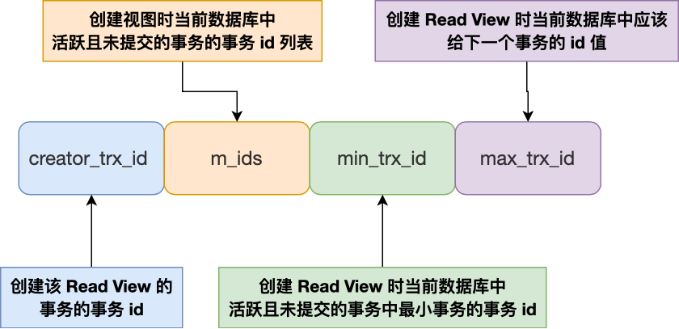
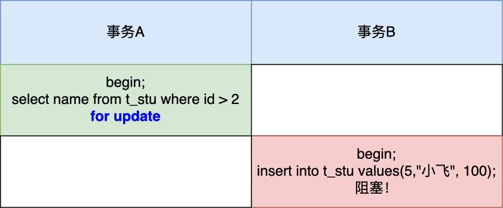
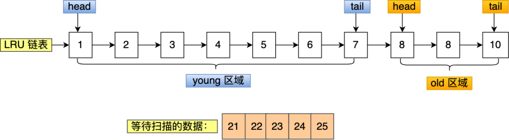

用于整理 MySQL 的相关知识，以备查询。

<!-- More -->


## 01 MySQL 概览

存储引擎：

+ InnoDB：支持事务，支持行级锁，支持外键，采用 MVCC 支持高并发，支持四个隔离级别
+ MyISAM：不支持事务，只支持表锁，支持压缩表和空间数据索引，数据恢复困难

索引数据结构：

+ AVL 树：左右子树树高相差不超过 1 的平衡二叉树，插入和删除会引入旋转操作，适合查找多的场景
+ 红黑树：确保没有一条路径会比其他路径长 2 倍，近似平衡，适合插入删除操作多的场景
+ 跳表：平均性能和红黑树相当，但实现更为简单
+ B 树：多路查找树，中间节点也会携带实际数据
+ B+ 树：多路查找树，只有叶子节点才会携带实际数据，查询性能稳定

B+ 树和红黑树比较：

+ B+ 树一个节点可以存储多个元素，相较于红黑树树高更低，磁盘 IO 次数小
+ 磁盘预读功能对 B+ 树产生优化功能

B+ 树和 B 树比较：

+ B+ 树磁盘 IO 更低，其内部节点全部是指针，没有实际数据，能够更快找到元素
+ B+ 树查询效率更加稳定
+ B+ 树遍历效率高

MySQL 索引：在存储层实现，不同的存储引擎具有不同的索引类型

+ B+ 树索引：主索引通常是聚簇索引，辅助索引通常需要回表，覆盖索引，组合索引
+ 哈希索引：只支持点查询，不支持范围查询，同时不支持排序和分组操作
+ 全文索引：用于查找文本中的关键词，通常采用倒排索引实现
+ 空间数据索引（R-Tree）：多维索引，可用于存储地理数据

索引优化：

+ 独立的列：查询条件中，索引列不能是表达式的一部分
+ 多列索引：比单列索引更好
+ 索引列顺序：让选择性强的索引放在前面
+ 前缀索引
+ 覆盖索引：索引包含所有需要查询的字段的值，不需要进行回表操作

查询语句分析：使用 explain 进行分析，其结果参数

+ select_type：常用的有 SIMPLE 简单查询，UNION 联合查询，SUBQUERY 子查询
+ possible_keys：可选择的索引
+ key：实际使用的索引
+ rows：扫描的行数
+ type：关联类型，决定通过什么方式找到每一行数据
  + system：只有一条数据的系统表
  + const：主键或者唯一索引查询
  + eq_ref：在进行联接查询的，使用主键或者唯一索引并且只匹配到一行记录的时候
  + ref：使用非唯一索引
  + range：索引范围查询
  + index：跟全表扫描类似，只是扫表是按照索引顺序进行
  + all：全表扫描，不走索引

查询语句优化：

+ 减少请求的数据量，只返回必要的行数据和列数据
+ 减少服务器扫描的行数，尽量通过覆盖索引
+ 重构查询语句：切分大查询，分解大连接查询，将连接任务交给上层

事务：

+ 特性：ACID
+ 隔离级别：未提交读，提交读，可重复读，可串行化，快照
+ 非一致性问题：脏读，不可重复读，幻读，丢失更新

并发控制：

+ 锁：共享锁，排他锁，意向共享锁，意向排他锁
+ 锁粒度：
  + Record Lock：锁定一个记录对应的索引，而不是本身
  + Gap Lock：锁定索引之间的间隙，但是不包含索引本身
  + Next-Key Lock：左开右闭区间，Gap Lock + Record Lock
+ MVCC：在每个记录后面加上两个隐藏的列，记录创建版本号和删除版本号，通过 undo 日志串联版本
  + 快照读：读取历史数据
  + 当前读：读取数据库当前版本数据，可以通过加锁 `lock in share mode，for update` 实现

分库分表数据切分：水平切分（Sharding）和垂直切分

水平切分：

+ 策略：哈希取模，范围划分，映射表
+ 问题：
  + 事务问题：改为分布式事务
  + 连接：多个单表查询，在用户程序中连接
  + 唯一性：使用全局唯一 GUID

MySQL 集群：

+ 主从复制：主要涉及三个线程，binlog 线程，IO 线程和 SQL 线程
+ 读写分离：主服务器处理实时性要求高的读写操作，从服务器处理读操作，可以减轻主服务器的负载

关系数据库设计范式：

+ 1NF：每个属性不可分割，可能存在数据冗余问题
+ 2NF：消除非主属性对码的部分函数依赖
+ 3NF：消除非主属性对于码的传递函数依赖，基本消除了各种异常
+ BCNF：主属性不依赖于主属性
+ 4NF：消除多值依赖


## 02 MySQL 索引

索引的优缺点：

+ 优势：
  + 可以提高数据检索的速度，降低 IO 成本
  + 索引还能对数据进行排序，降低排序查询语句的执行时间
+ 劣势：
  + 索引本身会占用部分空间
  + 索引虽然提高了查询效率，但是降低了数据更新的效率，因为更新数据的同时需要更新数据

索引类型：主键索引，普通索引（辅助索引），唯一索引，全文索引，空间索引，前缀索引，单列索引，联合索引，聚簇索引

索引的数据结构：

+ Hash 表：单点查询性能好，但是不支持范围查询
+ 平衡二叉树：查询性能良好，但是树高太大，IO 次数多
+ B 树：改造二叉树，每个节点上有多个数据项，同时对应多个分支，中间节点上可以存储数据
+ B+ 树：只有叶子节点上存在数据，中间节点只有索引和节点值，进一步降低查找时的 IO 开销

MyISAM 索引：索引和数据分开存储在不同的文件中，叶子节点记录的是磁盘地址

InnoDB 索引：叶子节点存储的数据是整行的数据，称之为聚簇索引，为此，普通索引需要进行回表操作

覆盖索引：在使用辅助索引的时候，需要经过回表操作才能拿到整行数据，可以创建组合索引避免回表

优化：

+ 避免回表：使用覆盖索引
+ 正确使用联合索引，遵循最左匹配原则


## 03 组合索引的特殊情况

假设存在表 t(a, b, c, d)，其中以 a 创建主键索引，以 (b, c, d) 创建组合索引，语句 `select * from t where c = 0` 执行过程中，有以下问题：

+ 上述条件查询并不满足最左匹配原则，为什么查询的时候使用了索引？

  答：联合索引中有查询需要所有数据项，可以使用覆盖索引，但是其并不满足最左匹配，因此 type 是 index，而不是 ref，同时，组合索引中叶子节点信息量更大，主索引通常还包括了版本信息，事务 id，回流指针等等，因此选择组合索引

+ 为这个表增加 e 字段后，上述查询为什么变为全表扫描？

  答：加入 e 字段后，就不能使用覆盖索引了，此时就只能进行全表扫描


## 04 慢 SQL 查询语句

SQL 语句执行流程：

+ 连接器：服务器进行账户检查，权限检查等操作
+ 缓存层
+ 词法语法分析，检查 SQL 正确性
+ 优化器找到最佳物理执行计划
+ 调用存储引擎的相关接口进行查询，并返回结果

InnoDB 存储引擎：

+ 磁盘预读机制：当引擎访问某个数据项的时候，通常其相邻的数据页也会被加载到内存
+ 索引：InnoDB 主索引采用的是聚簇索引，如果没有唯一且非空的键则会隐式创建一个自增的列

慢 SQL 危害：在高并发情况下，慢 SQL 出现后会阻塞大量正常的请求，造成大面积的超时和失败

慢 SQL 原因：

+ 索引创建方面：
  + 索引区分度低
  + 切忌过多创建索引，其会大幅降低更新操作的效率
  + 常用查询，排序，分组字段建索引
  + 主键和外键建索引
+ 索引失效方面：
  + 对索引使用函数
  + 对索引进行运算
  + 对索引使用 <> 、not in 、not exist、!=
  + 对索引进行前导模糊查询
  + 隐式转换会导致不走索引
  + 非索引字段的 or 连接
  + 非最左前缀

预防慢 SQL 方案：

+ 使用连接代替子查询
+ 使用覆盖索引
+ 多表关联查询时，小表在前，大表在后
+ 调整 where 子句中的连接顺序
+ 使用联合索引，而非建立多个单独索引

慢 SQL 分析：打开慢 SQL 日志，设置慢 SQL 执行时间阈值，之后使用 explain 命令查看原因


## 05 分页场景

假设存在表 t_record(id, age, name)，id 上存在主索引，age 上存在辅助索引，下列语句

```sql
select * from t_record where age > 10 offset 10000 limit 10;
```

在第一次执行的时候很慢，在第二次有了缓存之后，才会变快。

对于 MySQL，上述语句会使用 age 上的索引，首先找到满足 age > 10 的第一个数据，然后向后遍历 10000 项数据，并且对每一项数据，都会进行回表操作，即使我们不需要这些数据。这样的话引入了大量的随机 IO，自然速度变慢。

分页性能问题优化：

+ 产品上绕过，只提供上一页和下一页功能不需要回表，并且没有 offset

  ```sql
  select * from t_record where id > last_id  limit 10;
  ```

+ 使用覆盖索引：不需要进行额外的回表操作

  ```sql
  select * from t_record where id in
  (select id from t_record where age > 10 offset 10000 limit 10）;
  ```


## 06 MySQL 事务

事务特性：ACID

InnoDB 保证事务特性：

+ 持久性是通过 redo log （重做日志）来保证的
+ 原子性是通过 undo log（回滚日志） 来保证的
+ 隔离性是通过 MVCC（多版本并发控制） 和锁机制来保证的

并行事务引发的问题：丢失更新，脏读，不可重复读，幻读

事务隔离性级别：未提交读，提交读，可重复读，串行化，快照隔离

InnoDB 保证事务隔离级别：

+ 未提交读：直接读取最新的数据
+ 串行化：加读写锁实现
+ 读提交和可重复读：通过 Read View 实现，读提交在每次读数据前生成一个 Read View，可重复读则在启动事务时生成一个 Read View，在之后都使用该 Read View

MVCC 实现：在每个记录后面还增加了两个隐藏列，trx_id 和 roll_pointer，后者指向旧版本记录

Read View 数据结构：



可重复读：遍历记录版本，直到找到 trx_id 小于等于 creator_trx_id 的记录

读提交：遍历记录版本，直到找到 trx_id 小于 max_trx_id，并且其不在 m_ids 列表中的记录


## 07 幻读的处理

在可重复读隔离级别下，普通的查询语句是快照读，其是不会看到别的事务新的插入的数据的，幻读的现象只能在当前读下产生。

InnoDB 为了防止该问题，采用了 next-key 锁，下面的事务 A 会锁住 `(2, +inf)` 范围的记录，如果该期间有其他事务在这个锁住的范围插入数据就会被阻塞，从而解决了幻读现象。



next-key 锁锁的是索引，而不是数据本身，如果 update 语句的 where 条件没有使用索引列，那么就会全表扫描，不仅加上行锁，还加上了间隙锁，相当于锁住整个表，直到事务结束时释放。因此，在线上千万不要执行没有带索引条件的 update 语句，不然会造成业务停滞。


## 08 MySQL 中的锁

全局锁：

+ 使用方法：`flush tables with read lock` 和 `unlock tables` 加锁和解锁，加锁后整个数据库就只处于只读状态，会阻塞其他线程对表的结构和数据的更改
+ 应用场景：全库逻辑备份，通常在不支持 MVCC 的引擎中使用，而对于像 InnoDB 引擎，可以在 mysqldump 时加上 `-single-transaction` 就能保证数据一致性
+ 缺点：整个数据库只读状态，可能会造成业务停滞

表级锁：

+ 表锁：`lock tables t_name read/write`，其会限制本线程和其他线程的读写操作

+ 元数据锁（MDL）：不需要显式使用 MDL，其根据如下规则加锁：

  + 对一张表进行 CRUD 操作时，加的是 MDL 读锁
  + 对一张表做结构变更操作的时候，加的是 MDL 写锁

  MDL 在事务提交后才会释放，另外，MDL 写锁获取的优先级高于读锁

+ 意向锁：加锁规则如下：

  + 在对某些记录加上共享锁之前，需要先在表级别加上一个意向共享锁
  + 在对某些纪录加上独占锁之前，需要先在表级别加上一个意向独占锁

  注意，普通的 select 是不会加锁的，因为其是利用 MVCC 实现，可以通过 `lock in share mode` 实现，意向共享锁和意向独占锁是表级锁，不会和行级的共享锁和独占锁发生冲突，而且意向锁之间也不会发生冲突，只会和共享表锁和独占表锁发生冲突，意向锁的目的是快速判断表里是否有记录被加锁

+ AUTO-INC 锁：该锁在执行完插入语句后就会释放，而不是提交事务时释放，因此，MySQL 5.2 后的版本提供了轻量级的锁。其在并发插入的时候，不能保证自增长的值是连续的，这在主从赋值的场景中是不安全的

行级锁：InnoDB 才有，MyISAM 并没有行锁

+ 记录锁：锁住一条记录
+ 间隙锁：锁定一个范围
+ Next-Key Lock：记录锁和间隙锁的组合，用左开右闭区间表示，是加锁的基本单位，但是可能会退化


## 09 MySQL 加锁规则

唯一索引等值查询：

+ 查询的记录存在：退化成记录锁
+ 查询的记录不存在：退化成间隙锁

唯一索引范围查询：首先找到 min 对应的 next-key lock，如果 min 存在，退化成记录锁；最后找到 max 对应的 next-key lock，如果 max 不存在，退化成间隙锁

非唯一索引等值查询：

+ 查询的记录存在：先加 next-key lock， 另外一把锁退化成间隙锁
+ 查询的记录不存在：退化成间隙锁

非唯一索引范围查询：next-key lock 不会退化


## 10 update 语句

当执行 update 语句的时候，如果没有带上索引，可能会走全表扫描，从而导致全表加上了独占锁，导致业务停滞，通常可以使用以下方法避免该情况：

+ 开启安全更新模式，`sql_safe_update` 参数设置为 1，此时需要 update 有 where 或者 limit 子句
+ 如果带上索引，但是优化器选择走全表扫描，可以使用 force index 语句


## 11 MySQL 索引失效

索引失效的情况：

+ 对索引使用左或者左右模糊匹配
+ 对索引使用函数：MySQL 8.0 以后可以使用函数索引
+ 对索引进行表达式计算
+ 对索引隐式类型转换：在遇到字符串和数字比较的时候，会先把字符串转为数字，然后再进行比较
+ 联合索引非最左匹配：(a, b, c) 组合索引，`where a = 6 and c = 8`，MySQL 5.6 之前版本会回表比较，而之后的版本使用索引下推优化
+ WHERE 子句中的 OR


## 12 count 性能

count 性能：count(*) = count(1) > count(主键字段) > count(字段)

count 作用：统计符合查询条件的记录中，函数指定的参数不为 NULL 的记录有多少个

count(主键字段)：优先走二级索引，没有的话走主键索引，InnoDB 只会返回对应的主键字段

count(1)：和 count(主键字段) 类似，但是不会读取记录中的任何字段的值

count(*)：会被优化为 count(0)，执行效率和 count(1) 相同

count(字段)：会走全表扫描，如果其 NOT NULL，那么 Server 层就不需要额外的判断

> 走聚簇索引和全表扫描的区别：全表扫描还需要额外访问叶子节点的非主键字段，效率更低

MyISAM 引擎和 InnoDB 引擎：执行 count(*) 时，其直接返回表的元信息中 row_count 值，但是由于 InnoDB 支持 MVCC，并不能简单统计当前的行数作为业务的返回值，但当带上条件查询时，两者行为类似

如何优化 count(*)：

+ 使用近似值：如 explain
+ 额外表保存计数值


## 13 MySQL 死锁避免

死锁案例：在执行插入订单操作前，先执行当前读，再执行插入操作。两个以上的这样的操作序列就会引发死锁。

多个客户端同时对资源加锁，就可能存在死锁现象，MySQL 中死锁避免方法有：

+ 设置事务等待锁的超时时间：innodb_lock_wait_timeout
+ 开启主动死锁检测：innodb_deadlock_detect


## 14 MySQL 优化思路

MySQL 逻辑架构：

+ 客户端层：用于连接处理，授权认证，安全检测等
+ 核心服务层：查询解析，分析，优化，缓存，跨存储引擎的功能在该层实现，如存储过程，触发器
+ 存储引擎：负责 MySQL 中的数据存储和提取

查询语句执行过程：

+ 客户端发送查询请求
+ 检查缓存是否命中，命中直接返回，否则继续执行，可以设置 `query_cache_type` 为 DEAMND
+ 解析、预处理、再由优化器生成对应的执行计划
+ 根据执行计划，调用存储引擎的 API 来执行查询
+ 将结果返回给客户端，该过程是一个增量且逐步返回的过程

性能优化：

+ Schema 设计和数据类型优化：通常越小的数据类型越快，占用更小的磁盘
  + 对整数类型指定宽度，没有任何作用
  + 大多数情况下不使用枚举类型，因为添加和删除字符串必须使用 `alter table`
  + schema 的列不要太多
+ 索引：
  + 注意索引失效的情况
  + 前缀索引：如果列字符串很长，可以使用前缀索引
  + 避免多个范围条件查询
  + 覆盖索引
  + 使用索引来排序
  + 删除长期未使用的索引
+ 特定类型优化：
  + 优化 count 查询：直接使用 count(*)，如果不需要精确值，可以使用 explain
  + 优化关联查询：可以使用子查询的方式来让优化器选择索引
  + 优化 LIMIT 分页：使用覆盖索引，或者统计书签信息
  + 优化 UNION：尽量使用 UNION ALL，否则的话需要做唯一性检查，该过程很耗时


## 15 Buffer Pool

InnoDB 存储引擎提供了 buffer pool，用来提高数据库的读写性能

+ 粒度：其以页（16 KB）为单位，通过参数 `innodb_buffer_pool_size` 调整缓存空间大小
+ 缓存信息：数据页，索引页，undo 页，插入缓存页，锁信息等（不包括 redo log buffer）

InnoDB 通过三种链表管理缓存页：

+ Free List：管理空闲页
+ Flush List：管理脏页
+ LRU List：管理脏页和干净页，在内存不足时用于淘汰

InnoDB 中的 LRU 优化：

+ 预读失效问题：分为 young 区域和 old 区域，加入缓冲区的页首先被放在 old 区域，只有后续真正被访问才会真正放入 young 区域

+ Buffer Pool 污染：为进入到 young 区域的页增加了一个停留在 old 区域时间的判断，只有后续访问与第一次访问时间大于某个时间间隔，才会将其移动到 young 区域的头部

  

脏页刷盘时机：

+ redo log 日志满了，主动触发
+ Buffer pool 空间不足，逐出脏页，需要刷盘
+ MySQL 认为空闲时，后向线程定期将适量的脏页刷盘
+ MySQL 正常关闭之前，所有脏页都需要刷盘


## 16 MySQL 日志系统

在执行一条更新语句的时候，会涉及到如下三种日志：

+ undo log：InnoDB 存储引擎生成的日志，实现了事务的原子性，用于事务回滚和支持 MVCC
+ redo log：InnoDB 存储引擎生成的日志，实现了事务的持久性，主要用故意掉电等故障恢复
+ binlog：Server 层生成的日志，主要用于数据备份和主从复制

redo log 相关问题：

+ redo log 产生动机？

  Buffer Pool 为上层应用提供了缓存的功能，脏页并不会立即写到磁盘上，为了防止掉电产生数据不一致的情形，需要先使用 redo log 记录下事务的操作，然后操作内存数据，最后在合适时间点将脏页数据刷到磁盘上，这样就能保证 crash-safe

+ 修改 undo 页面，需要记录对应的 redo log 吗？

  需要，需要首先记录修改 undo 页面的 redo log，再真正修改 undo 页面

+ redo log 同样需要写到磁盘，数据也要写到磁盘，为什么多此一举？

  redo log 采用的是追加写，磁盘操作是顺序写，而写入数据则需要先找到写入位置，对应磁盘操作是随机写，其将 MySQL 的写操作从磁盘的随机写变为顺序写，提高了系统性能

+ 产生的 redo log 是直接写入磁盘吗？

  不是的，首先将操作记录到 redo log buffer 中，后续根据刷盘策略再将其写入到磁盘中

+ redo log 什么时候刷盘？

  主要有下面几个时机：

  - MySQL 正常关闭时
  - 当 redo log buffer 中记录的写入量大于 redo log buffer 内存空间的一半时，会触发落盘
  - InnoDB 的后台线程每隔 1 秒，将 redo log buffer 持久化到磁盘
  - 每次事务提交时都将缓存在 redo log buffer 里的 redo log 直接持久化到磁盘（ innodb_flush_log_at_trx_commit = 1）

+ innodb_flush_log_at_trx_commit 参数控制什么？

  + 当设置该**参数为 0 时**，表示每次事务提交时 ，还是**将 redo log 留在  redo log buffer 中** ，该模式下在事务提交时不会主动触发写入磁盘的操作，此时 MySQL 进程崩溃将损失上一秒内的事务数据
  + 当设置该**参数为 1 时**，表示每次事务提交时，都**将缓存在  redo log buffer 里的  redo log 直接持久化到磁盘**，这样可以保证 MySQL 异常重启之后数据不会丢失
  + 当设置该**参数为 2 时**，表示每次事务提交时，都只是缓存在  redo log buffer 里的  redo log **写到 redo log 文件，注意写入到「 redo log 文件」并不意味着写入到了磁盘**，因为操作系统的文件系统中有个 Page Cache，Page Cache 是专门用来缓存文件数据的，所以写入「 redo log文件」意味着写入到了操作系统的文件缓存，此时 MySQL 进程崩溃不一定会丢失数据，因为操作系统会在合适时机调用 fsync 进行数据落盘

+ redo log 文件写满了怎么办？

  InnoDB 存储引擎有一个重做日志文件组，包含两个文件： `ib_logfile0` 和 `ib_logfile1` 。采用循环写的方式，check_point 表示当前要擦除的位置，write_pos 表示下一个 redo log 日志要写入的位置，当 redo log 文件写满了，也就是 write_pos 追上了 check_point，此时 MySQL 不能执行新的更新操作，其会停下来将 buffer pool 中的脏页刷新到磁盘中，以将 check_point 向后推进，使得 MySQL 恢复正常执行

binglog 相关问题：

+ 为什么有了 binlog， 还要有 redo log？

  最初的 MySQL 使用的是 MyISAM 引擎，其只有 binlog，用于归档，InnoDB 以插件形式引入，引入 redo log 是为了 crash-safe 能力

+ redo log 和 binlog 有什么区别？

  + 适用对象不同，redo log 只适用于 InnoDB 引擎，而 binlog 所有引擎适用
  + 文件格式不同
    + binlog：STATEMENT，ROW，MIXED
    + redo log：物理日志，记录的是某个数据页做了什么修改
  + 写入方式不同：redo log 采用循环写，binlog 采用追加写
  + 用途不同：binlog 用于备份恢复，主从复制，redo log 用于掉电等故障恢复

+ 主从复制如何实现？

  MySQL 集群的主从复制过程梳理成 3 个阶段：

  - 写入 Binlog：主库写 binlog 日志，提交事务，并更新本地存储数据
  - 同步 Binlog：把 binlog 复制到所有从库上，每个从库把 binlog 写到暂存日志（relay log）中
  - 回放 Binlog：回放 binlog，并更新存储引擎中的数据

+ MySQL 主从复制还有哪些模型？

  + 同步复制：MySQL 主库提交事务的线程要等待所有从库的复制成功响应，才返回客户端结果。这种方式在实际项目中，基本上没法用，原因有两个：一是性能很差，因为要复制到所有节点才返回响应；二是可用性也很差，主库和所有从库任何一个数据库出问题，都会影响业务。
  + 异步复制（默认模型）：MySQL 主库提交事务的线程并不会等待 binlog 同步到各从库，就返回客户端结果。这种模式一旦主库宕机，数据就会发生丢失。
  + 半同步复制：MySQL 5.7 版本之后增加的一种复制方式，介于两者之间，事务线程不用等待所有的从库复制成功响应，只要一部分复制成功响应回来就行，比如一主二从的集群，只要数据成功复制到任意一个从库上，主库的事务线程就可以返回给客户端。这种半同步复制的方式，兼顾了异步复制和同步复制的优点，即使出现主库宕机，至少还有一个从库有最新的数据，不存在数据丢失的风险。

+ 什么时候 binlog cache 会写到 binlog 文件？

  在事务提交的时候，执行器把 binlog cache 里的完整事务写入到 binlog 文件中，并清空 binlog cache。同样地，MySQL 提供一个 sync_binlog 参数来控制数据库的 binlog 刷到磁盘上的频率：

  - sync_binlog = 0 的时候，表示每次提交事务都只 write，不 fsync，后续交由操作系统决定何时将数据持久化到磁盘；
  - sync_binlog = 1 的时候，表示每次提交事务都会 write，然后马上执行 fsync；
  - sync_binlog =N(N>1) 的时候，表示每次提交事务都 write，但累积 N 个事务后才 fsync

两阶段提交问题：

+ 为什么需要两阶段提交？

  事务提交后，redo log 和 bin log 都需要持久化到磁盘，但是可能出现半成功的状态，对于命令 `UPDATE t_user SET name = 'xiaolin' WHERE id = 1`：

  + 如果在将 redo log 刷入到磁盘之后， MySQL 突然宕机了，而 binlog 还没有来得及写入。MySQL 重启后，通过 redo log 能将 Buffer Pool 中 id = 1 这行数据的 name 字段恢复到新值 xiaolin，但是 binlog 里面没有记录这条更新语句，在主从架构中，binlog 会被复制到从库，由于 binlog 丢失了这条更新语句，从库的这一行 name 字段是旧值 jay，与主库的值不一致性；
  + 如果在将 binlog 刷入到磁盘之后， MySQL 突然宕机了，而 redo log 还没有来得及写入。由于 redo log 还没写，崩溃恢复以后这个事务无效，所以 id = 1 这行数据的 name 字段还是旧值 jay，而 binlog 里面记录了这条更新语句，在主从架构中，binlog 会被复制到从库，从库执行了这条更新语句，那么这一行 name 字段是新值 xiaolin，与主库的值不一致性；

  两阶段提交是为了避免出现两份日志之间的逻辑不一致的问题。

+ 两阶段提交的过程是怎样的？

  MySQL 使用内部 XA 事务完成两阶段提交，将 redo log 写入拆分成两个步骤：prepare 和 commit，中间再穿插写入 binlog，具体如下：

  - **prepare 阶段**：将 XID（内部 XA 事务的 ID） 写入到 redo log，同时将 redo log 对应的事务状态设置为 prepare，然后将 redo log 刷新到硬盘；
  - **commit 阶段**：把 XID  写入到 binlog，然后将 binlog 刷新到磁盘，接着调用引擎的提交事务接口，将 redo log 状态设置为 commit，同样需要写入到磁盘；

+ 异常重启会出现什么现象？

  

  在 MySQL 重启后会按顺序扫描 redo log 文件，碰到处于 prepare 状态的 redo log，就拿着 redo log 中的 XID 去 binlog 查看是否存在此 XID：

  - 如果 binlog 中没有当前内部 XA 事务的 XID，说明 redolog 完成刷盘，但是 binlog 还没有刷盘，则回滚事务。对应时刻 A 崩溃恢复的情况。
  - 如果 binlog 中有当前内部 XA 事务的 XID，说明 redolog 和 binlog 都已经完成了刷盘，则提交事务。对应时刻 B 崩溃恢复的情况。可以保证主库和备库的一致性。

  可以看到，对于处于 prepare 阶段的 redo log，即可以提交事务，也可以回滚事务，这取决于是否能在 binlog 中查找到与 redo log 相同的  XID，如果有就提交事务，如果没有就回滚事务。

+ 事务没提交的时候，redo log 会被持久化到磁盘吗？

  会的，MySQL 后台线程会每隔一秒将 redo log buffer 持久化到磁盘，因此，redo log 可以在事务没提交之前持久化到磁盘，但是 binlog 必须在事务提交之后，才可以持久化到磁盘。

+ 两阶段提交的问题？

  + 磁盘 IO 次数高：对于“双1”配置，每个事务提交都会进行两次 fsync（刷盘），一次是 redo log 刷盘，另一次是 binlog 刷盘。
  + 锁竞争激烈：两阶段提交虽然能够保证「单事务」两个日志的内容一致，但在「多事务」的情况下，却不能保证两者的提交顺序一致，因此，在两阶段提交的流程基础上，还需要加一个锁（prepare_commit_mutex）来保证提交的原子性，从而保证多事务的情况下，两个日志的提交顺序一致。

+ binlog 组提交实现方式？

  MySQL  引入了 binlog 组提交（group commit）机制，当有多个事务提交的时候，会将多个 binlog 刷盘操作合并成一个，从而减少磁盘 I/O 的次数。引入了组提交机制后，prepare 阶段不变，只针对 commit 阶段，将 commit 阶段拆分为三个过程：

  - **flush 阶段**：多个事务按进入的顺序将 binlog 从 cache 写入文件（不刷盘）；
  - **sync 阶段**：对 binlog 文件做 fsync 操作（多个事务的 binlog 合并一次刷盘）；
  - **commit 阶段**：各个事务按顺序做 InnoDB commit 操作，将 redo log 状态设置为 commit

  上面的每个阶段都有一个队列，每个阶段有锁进行保护，锁粒度减小，这样就使得多个阶段可以并发执行，从而提升效率。

+ 有 binlog 组提交，那有  redo log 组提交吗？

  MySQL 5.6 没有 redo log 组提交，MySQL 5.7 有 redo log 组提交。

  在 MySQL 5.6 的组提交逻辑中，每个事务各自执行 prepare 阶段，也就是各自将  redo log 刷盘，这样就没办法对 redo log 进行组提交。

  所以在 MySQL 5.7 版本中，做了个改进，在 prepare 阶段不再让事务各自执行 redo log 刷盘操作，而是推迟到组提交的 flush 阶段，也就是说 prepare 阶段融合在了  flush 阶段。

  

+ 组提交相关参数？

  + Binlog_group_commit_sync_delay：控制 flush 阶段后 sync 阶段前的等待时间
  + Binlog_group_commit_sync_no_delay_count：最大组提交中事务的数目

+ MySQL 磁盘 IO 很高，优化方法有哪些？

  + 设置组提交的两个参数：binlog_group_commit_sync_delay 和 binlog_group_commit_sync_no_delay_count 参数，延迟 binlog 刷盘的时机，从而减少 binlog 的刷盘次数
  + 将 sync_binlog 设置为大于 1 的值
  + 将 innodb_flush_log_at_trx_commit 设置为 2


## MySQL 面试题

+ 能说下 MyISAM 和 InnoDB 的区别吗？

  MyISAM 支持全文索引，压缩表和空间函数等，但是不支持事务和行级锁，通常用于大量查询少量插入的场景，MyISAM 的索引和数据是分开的；InnoDB 采用聚簇索引，其支持事务，外键和行级锁，并且通过 MVCC 来支持高并发。

+ 说下 MySQL 的索引有哪些吧，聚簇和非聚簇索引又是什么？

  索引按照数据结构来说主要分为 B+Tree 和哈希索引，聚簇索引是索引和数据存放在一起。

+ 主键索引自增有什么优点？

  在插入数据的时候，可以直接将数据追加到最后一个数据页里面，不涉及数据在数据页中的移动，如果不使用自增主键，在插入的时候可能会造成页分裂等耗时操作。

+ 空闲连接的查看和解决方式？

  通过 `show processlist` 查看空闲连接，MySQL 规定了空闲连接的默认最大时长（8 小时），用户也可主动在执行 `kill connection +<id>` 来终结空闲连接。

+ 那你知道什么是覆盖索引和回表吗？

  覆盖索引指的是通过索引就可以取到所需的数据，如果所需数据不能通过覆盖索引，就需要访问聚簇索引获取相应的数据，该行为称为回表。

+ 锁的类型有哪些呢？

  从粒度上，分为全局锁，表级锁，行锁；从加锁方式上，分为乐观锁和悲观锁；从是否共享，分为共享锁和排他锁。

+ 你能说下事务的基本特性和隔离级别吗？

  ACID，四种隔离级别分别消除了四种不一致现象。

+ 那ACID靠什么保证的呢？

  原子性通过 undolog 保证，隔离性通过 MVCC 和锁机制实现，持久性通过 redolog 实现，保证了事务的持久性、原子性、隔离性之后，一致性才能得到保障。

+ 那你说说什么是幻读，什么是MVCC？

  幻读是指两次读取中读到了新插入的数据行，MVCC 实际上是为每个版本添加创建时间版本号，过期时间版本号，只有满足一定要求的事务才能读到对应的版本。

+ 那你知道什么是 next-key lock 吗？

  next-key lock 是 RR 下才有的锁，结合 MVCC 可以解决幻读的问题，其在一定条件下能够退化成记录锁或间隙锁。

+ 你们数据量级多大？分库分表怎么做的？

  一般拆分顺序是先垂直后水平，水平分库一般通过哈希取模实现，为提高性能，可以引入一致性哈希。

+ 那分表后的自增 ID 怎么保证唯一性的呢？

  设定不同步长，分布式 ID 如雪花算法，不使用自增主键而是使用其他唯一数据列作为主键。

+ 分表后非 sharding_key 的查询怎么处理呢？

  对实时性要求不高的话，可以建立宽表；数据量不是很大的话，可以多线程扫表，然后再聚合结果。

+ 说说 mysql 主从同步怎么做的吧？

  主服务器写入 binglog 后，会创建 dump 线程推送其到从服务器，从服务器启动 IO 线程读取推送过来的 binglog，记录到 relay log 中继日志中，从服务器开启一个 sql 线程读取 relay log 并且执行，最后从服务器也记录自己的 binlog。主从同步分为全同步复制和半同步复制，前者需要所有从库执行完才返回客户端，后者至少收到一个从库的 ack 即可。

+ 那主从的延迟怎么解决呢？

  并不能解决，但是能尽量优化，如尽量减少或者不使用长事务。

+ 查询缓存的作用？

  查询的时候先查询缓存，但是在 MySQL 8.0 后，该功能被移除。缓存虽然能够提升数据库的查询性能，但是缓存同时也带来了额外的开销，每次查询后都要做一次缓存操作，失效后还要销毁。建议设置query_cache_type 变量为 DEMAND。


