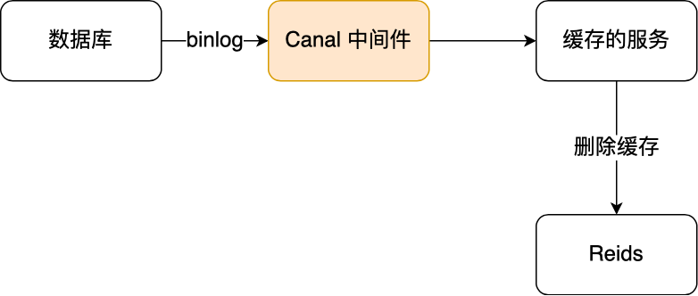

本文用于记录 Redis 相关知识，以备查阅。

<!--More -->

## 01 Redis 数据类型和数据结构

Redis 数据类型是其值的数据类型，这些数据类型会使用相应的数据结构来实现，对应关系如下：

Redis 本身使用了哈希表来保存所有的数据，哈希桶存放的是键值对的指针，指针的类型都通过对象结构来解码，里面包含了 type，encoding，ptr 等信息，整个映射过程如下：

SDS：保存为 (len, alloc, flags, buf[]) ，其有以下优点：常量时间复杂度内获取字符串长度，二进制安全，不会发生缓冲区溢出，节省内存空间

双向链表：实现为具有头节点的双向链表，能够快速获取到头尾节点和链表长度等信息，但是存在无法很好利用 CPU 缓存和在数据较小时，内存开销较大的问题

压缩列表：内存紧凑型的数据结构，占用一块连续的内存空间，不仅可以利用 CPU 缓存，而且会针对不同长度的数据，进行相应编码，节省内存空间。但是其不能保存过多的元素，并且新增或者修改元素时，可能引发连锁更新的问题（通过 prevlen 长度改变造成）

哈希表：采用链式哈希来解决哈希冲突，当 Redis 中的数据过大时，此时就会进行 rehash，其采用的是渐进式 rehash，即在 rehash 进行期间，每次哈希表元素进行新增、删除、查找或者更新操作时，Redis 除了会执行对应的操作之外，还会顺序将哈希表 1 中索引位置上的所有 key-value 迁移到哈希表 2 上，rehash 触发条件和负载因子有关

整数集合：包含有 (enconding, length, contents) 信息，当 Set 对象只有整数，并且元素数量不大时，就会采用该数据结构，当新的数据远大于已存在的数据时，会执行升级操作，升级后不会降级

跳表：在 Redis 中只有 Zset 对象底层同时使用了两个数据结构，一个是哈希表，一个就是跳表。跳表实际上是多层的有序链表，通常越高层的跨度越大，跨度还有一个作用，就是计算该节点在跳表中的排位，Redis 实现中，为跳表增加了一个表头，其中有头尾节点，表长度和最大层数等信息，在新增节点的时候，会随机生成每个节点的层数，每一层是 1/4 的概率

quicklist：3.2 版本后，List 对象的底层数据结构。其实际上就是双向链表和压缩列表的组合，也就是每个链表节点数据元素是压缩列表，为了解决连锁更新的问题，其会控制每个链表节点中的压缩列表的大小或者元素个数，也就是降低连锁更新带来的影响

listpack：quicklist 并没有完全解决连锁更新的影响，因为其还是用压缩列表来保存元素。listpack 的目的便是取代压缩列表，其最大不同就是每个内部节点不再包含前一个节点的长度，从而避免了连锁更新

## 02 AOF 日志

AOF 日志：会保存写操作的命令到日志中，需要手动开启，里面保存的就是一条条用户的写命令

Redis 先执行写操作，完成写操作后才将该命令记录到 AOF 日志中，好处有：

+ 避免恢复时额外的检查开销
+ 不会阻塞当前写操作命令的执行

但是这样的话存在数据丢失的风险，这和 AOF 日志写回硬盘的时机有关（appendfsync）：

> 当调用 IO write 操作时，操作系统实际上会将数据放在内核缓冲区中，其会等待到一定的时机将数据写到硬盘上，或者通过用户的 fsync 的显式调用

AOF 重写机制：为了避免日志文件越来越大，对于设置相同的键，其会先创建一个新文件，在新文件中只会保存每个键最后一次写的日志

AOF 后台重写：AOF 重写过程是通过后台子进程 bgrewriteaof 来完成的，好处有：

+ 子进程在 AOF 重写期间，主进程依旧可以响应用户命令
+ 子进程带有主进程的数据副本，采用写时复制策略，减少内存开销
+ 子进程修改数据共享内存数据时，直接复制，如果采用线程方式实现，则需要加锁

为了记录重写过程中新到来的指令，存在一个 AOF 重写缓冲区，用于保存重写过程中的用户指令，该 AOF 缓冲区最终将会追加到新的 AOF 文件中，最终替换原来的 AOF 日志文件

## 03 RDB 快照

RDB 快照记录的是某个时间点的内存数据，采用的是全量备份，提供了两个命令用来生成 RDB 文件，分别是 save 和 bgsave，前者会阻塞主线程，后者则创建了一个子进程专门生成 RDB 文件。

在执行 bgsave 的过程中，由于采用的是子进程处理，并且采用写时复制技术，当有新的命令到来时，此时原来的主进程会复制一块内存用于修改，而子进程读到的还是原来的数据。当系统宕机时，可能会丢失上次快照到现在时刻的数据。

RDB 和 AOF 结合：RDB 数据恢复的速度快，但是存在大量数据丢失的问题，AOF 虽然解决了大量数据丢失的问题，但是在文件很大的时候，恢复过程缓慢，在 4.0 以后，可以通过配置 aof-use-rdb-preamble 使用混合持久化功能，其在 AOF 重写过程时，先将 RDB 数据写入 AOF 文件中，写入完成后，追加 AOF 重写缓冲区里面的内容即可。

## 04 主从复制

主从复制可以避免单点故障，主服务可以进行读写操作，并且将写操作同步给从服务器，从服务器一般只读，并且执行主服务器传过来的写操作。

第一次同步过程：使用 replicaof 可以形成主从关系，采用的是全量复制，并且缓存生成 RDB 文件过程中的写操作到 replication buffer 中，之后将其发送给从服务器。

分摊主服务器的压力：在第一次同步过程中，耗时过程主要在生成 RDB 文件和传输 RDB 文件，如果一个主服务器有很多从服务器，可能就会占用大量网络带宽。可以让其中一个服务器成为经理角色，其会同步写操作到其负责的从服务器上。

命令传播：主从服务器完成同步后，双方维护了一个 TCP 连接，该连接是长连接的，这是为了避免 TCP 连接和断开的性能开销。

增量复制：如果主从服务器网络发生断开，之后又重新连接，此时就会根据 `psync {runid} {offset}` 来进行增量复制。该实现过程主要通过环形缓冲区 repl_backlog_buffer 实现，主从服务器分别记录自己的 offset，从而实现增量同步，如果从服务器 offset 对应的数据已经被覆盖，则通过全量复制实现，可以通过 repl_backlog_size 设置该环形缓冲区大小。

## 05 缓存雪崩、击穿、穿透

Redis 通常用做数据库的缓存中间件，用户先访问 Redis，如果命中直接返回，否则就查询数据库获得数据，并且更新缓存。

缓存雪崩：大量缓存数据在同一时间过期，或者 Redis 故障宕机时，此时大量的请求访问数据库，从而导致数据库压力骤增，严重的会造成数据库宕机，而造成系统崩溃。对于大量数据在同一时期过期的方案：

+ 均匀设置过期时间
+ 互斥锁：保证同一时间内只有一个请求来构建缓存，同时设置超时时间防止死锁
+ 双 key 策略：主 key 会设置过期时间，备 key 不会过期，如果主 key 失效，则返回备 key 数据
+ 后台更新缓存：后台工作线程更新缓存

对于 Redis 宕机的情况：

+ 服务熔断或请求限流机制
+ 构建 Redis 缓存高可靠集群

缓存击穿：如果缓存中的某个热点数据过期，此时大量的请求访问该热点数据，就无法从缓存中读取，直接访问数据库，数据库很容易就被高并发的请求冲垮。缓存击穿是缓存雪崩的子集，可以采用互斥锁解决。

缓存穿透：当用户访问的数据，既不在缓存中，也不在数据库中，导致请求在访问缓存时，发现缓存缺失，再去访问数据库时，发现数据库中也没有要访问的数据，没办法构建缓存数据，来服务后续的请求，就到导致服务器的压力骤增。一般是业务误操作或者黑客恶意攻击，常见应对方案： 

+ 非法请求的限制
+ 缓存空值或者默认值
+ 使用布隆过滤器快速判断数据是否存在

布隆过滤器：使用位图和多个哈希函数快速判断数据是否存在数据库中，查询布隆过滤器说数据存在，并不一定证明数据库中存在这个数据，但是查询到数据不存在，则数据库中一定就不存在这个数据。

## 06 缓存的读写策略

更新数据时，不论是先更新数据库，再更新缓存，还是先更新缓存，再更新数据库，都会产生不一致现象。

Cache Aside 策略：在更新数据时先更新数据库，再删除缓存中的数据，在读取数据时，发现缓存中没了数据之后，再从数据库中读取数据，并更新到缓存中。注意写操作时不能先删除缓存中的数据，在更新数据库，这在写读并发可能带来不一致现象。而在读写并发时，存在极小概率会产生不一致，原因是缓存的写入通常远远快于数据库的写入。

由于 Cache Aside 采用 Write Invalidate 策略，可能会对数据命中率产生影响，可以：

+ 更新数据时同样更新缓存，不过需要加分布式锁
+ 更新数据时同样更新缓存，不过需要加过期时间，保证最终一致性

Cache Aside 策略中如何保证先更新数据库，再更新缓存的操作都能成功：

+ 重试机制：引入消息队列，如果删除缓存的操作未成功，那就重试

+ 订阅 MySQL binlog，再操作缓存：阿里巴巴开源 Canal 中间件的实现方式

  

Write/Read Through 策略：核心原则是用户只与缓存打交道，由缓存和数据库通信，写入或者读取数据。当写操作未命中时，此时可以采用 Write Allocate 或者 No Write Allocate，一般采用 No Write Allocate，因为其具有更高的写入性能。

Write Back 策略：Write Through 在未命中时，需要同步更新数据库，Write Back 写策略则只需标记缓存数据为脏数据之后，直接返回即可，在写未命中时，采用 Write Allocate 方式。读策略在未命中的情况下如果发现被置换的缓存块是脏块，则需要将其写入数据库。该策略不能被应用到我们常用的数据库和缓存的场景中，因为缓存一般是非持久化的，如果缓存机器掉电，脏块数据就会丢失。

## 07 Redis 分布式锁

分布式锁特性：互斥性，安全性，对称性，可靠性

Redis 实现分布式锁：

+ 最简化版本：使用 `setnx key value` 和 `delete key` 实现加锁和释放锁
+ 支持过期时间：防止获取了锁的服务挂掉而没有释放锁资源，使用 `set key value nx ex seconds`
+ 加上 owner：防止其他服务删除该服务已获取到的锁，可以设置不同的 value 表示不同的 owner
+ 整合原子操作：加上 owner 后需要先检查，如果是自己的锁再释放，该过程不是原子性的，使用 Lua

可靠性保证：

+ 容灾考虑：
  + 主从容灾：Redis 的哨兵模式可以灵活切换，但是存在同步时延的问题
  + 多机部署：使用 Redis 中的 RedLock，只有超过半数同意才能算请求成功
+ 可靠性深究：由于分布式系统的三大困境（NPC），没有完全可靠的分布式锁，三大困境：
  + 网络延迟：获取到锁后，可能很快过期
  + 进程暂停：发生 GC 导致锁超时，其他进程能够获取该锁，导致多个进程同时获取锁
  + 时钟漂移：机器物理本身的误差

