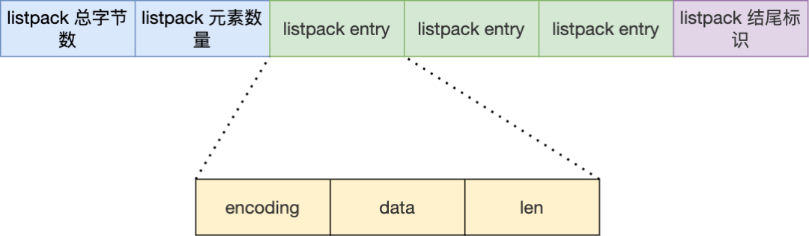

本文用于记录 Redis 相关知识，以备查阅。

<!--More -->

## 01 Redis 数据结构

Redis 数据类型是其值的数据类型，这些数据类型会使用相应的数据结构来实现，对应关系如下：

Redis 本身使用了哈希表来保存所有的数据，哈希桶存放的是键值对的指针，指针的类型都通过对象结构来解码，里面包含了 type，encoding，ptr 等信息，整个映射过程如下：

SDS：保存为 (len, alloc, flags, buf[]) ，其有以下优点：常量时间复杂度内获取字符串长度，二进制安全，不会发生缓冲区溢出，节省内存空间，另外为了节省空间，使用了 `__attribute__ ((packed))`

双向链表：实现为具有头节点的双向链表，能够快速获取到头尾节点和链表长度等信息，但是存在无法很好利用 CPU 缓存和在数据较小时，内存开销较大的问题

压缩列表：内存紧凑型的数据结构，占用一块连续的内存空间，不仅可以利用 CPU 缓存，而且会针对不同长度的数据，进行相应编码，节省内存空间。但是其不能保存过多的元素，并且新增或者修改元素时，可能引发连锁更新的问题（通过 prevlen 长度改变造成）

哈希表：采用链式哈希来解决哈希冲突，当 Redis 中的数据过大时，此时就会进行 rehash，其采用的是渐进式 rehash，即在 rehash 进行期间，每次哈希表元素进行新增、删除、查找或者更新操作时，Redis 除了会执行对应的操作之外，还会顺序将哈希表 1 中索引位置上的所有 key-value 迁移到哈希表 2 上，rehash 触发条件和负载因子有关

整数集合：包含有 (enconding, length, contents) 信息，当 Set 对象只有整数，并且元素数量不大时，就会采用该数据结构，当新的数据远大于已存在的数据时，会执行升级操作，升级后不会降级

跳表：在 Redis 中只有 Zset 对象底层同时使用了两个数据结构，一个是哈希表，一个就是跳表。跳表实际上是多层的有序链表，通常越高层的跨度越大，跨度还有一个作用，就是计算该节点在跳表中的排位，Redis 实现中，为跳表增加了一个表头，其中有头尾节点，表长度和最大层数等信息，在新增节点的时候，会随机生成每个节点的层数，每层高度晋升机会是 0.25，得到的跳跃表更加扁平

quicklist：3.2 版本后，List 对象的底层数据结构。其实际上就是双向链表和压缩列表的组合，也就是每个链表节点数据元素是压缩列表，为了解决连锁更新的问题，其会控制每个链表节点中的压缩列表的大小或者元素个数，也就是降低连锁更新带来的影响

listpack：quicklist 并没有完全解决连锁更新的影响，因为其还是用压缩列表来保存元素。listpack 的目的便是取代压缩列表，其最大不同就是每个内部节点不再包含前一个节点的长度，从而避免了连锁更新

## 02 Redis 数据类型

Redis 对象中保存了 type 和 encoding 信息，前者表示对象的类型，后者表示使用的编码，通过 void* ptr 指向对应的真实数据类型，对象类型有：

+ String 类型：
  + 编码：int，raw，embstr
    + embstr 表示 redisObject 和 SDS 使用连续的内存空间，适用于字符串较短情况
    + raw 则将 SDS 和 redisObject 分离存储，使用内部 ptr 指向 SDS 对象
  + 常用指令：SET/MSET，GET/MGET，EXISTS，DEL，INCR/INCRBY，EXPIRE/TTL，SETNX
  + 应用场景：
    + 缓存对象：缓存对象的 JSON 格式，或将 key 进行组合进行存储，如 `user:<id>:name` 
    + 常规计数：通过 INCR/INCRBY
    + 分布式锁：`SET lock_key unique_value NX PX 10000` ，unique_value 表示某个客户端独占，设置过期时间方式客户端崩溃而不能及时释放资源，解锁可以通过 DEL 命令实现，但是由于需要先判断该锁是否是自己的锁，为了保证原子性，需要使用 LUA 脚本
+ List 类型：
  + 编码：ziplist，linkedlist，quicklist（3.2 版本）
  + 常用指令：LPUSH/RPUSH，LPOP/RPOP，LRANGE，BLPUSH/BRPOP
  + 应用场景：
    + 消息队列：消息队列三要素：
      + 消息保序：LPUSH + RPOP，LPUSH + BRPOP
      + 重复消息处理：生产者自己实现全局唯一 ID
      + 消息可靠性：使用 BRPOPLPUSH
+ Hash 类型：
  + 编码：ziplist，hash，listpack（7.0 版本）
  + 常用命令：HSET/HGET，HDEL，HLEN，HGETALL，HINCRBY
  + 应用场景：
    + 缓存对象：field + value 表示对应属性和值，key 则表示对象 id，不过通常使用 String + JSON 方式存储对象，如果对象某些属性变化频繁，可以使用 Hash 类型
    + 购物车：以用户 id 为 key，商品 id 为 field，商品数量为 value，构成购物车的 3 个要素
+ Set 类型：
  + 编码：intset，hash
  + 常用命令：SADD，SREM，SMEMBERS，SCARD，SISMEMBER，SINTER，SUNION，SDIFF
  + 应用场景：
    + 点赞：按照文章 id 为 key，用户 id 为 value
    + 共同关注：主要使用交集运算 SINTER，注意集合运算复杂度较高
    + 抽奖活动：SRANDMEMBER，SPOP key count
+ Zset 类型：
  + 编码：ziplist，skiplist，listpack（7.0 版本）
  + 常用操作：ZADD，ZREM，ZSCORE，ZCARD，ZINCREBY，ZRANGE，ZRANGEBYSCORE，ZRANGEBYLEX，ZUNIONSTORE，ZINTERSTORE
  +  应用场景：
    + 排行榜，电话姓名排序
+ BitMap 类型：
  + 实现：使用 String 类型实现，保存为二进制的字节数组
  + 常用命令：SETBIT，GETBIT，BITCOUNT，BITOP，BITPOS
  + 应用场景：签到统计，判断用户登陆状态，连续签到用户总数
+ HyperLogLog 类型：
  + 目的：提供**不精确**的去重计数，误差率大约是 0.81%
  + 常用命令：PFADD，PFCOUNT，PFMERGE
  + 应用场景：百万级网页 UV 计数
+ GEO 类型：
  + 目的：存储地理信息，并且对存储的信息操作，用于位置信息服务
  + 实现：通过 GeoHash 编码将经纬度转换为 Zset 中元素的权重分数，关键机制在于对二维地图做区间划分和对区间进行编码
  + 常用命令：GEOADD，GEOPOS，GEODIST，GEORADIUS
  + 应用场景：嘀嘀打车
+ Stream 类型：
  + 目的：专门为消息队列设计的数据类型，支持自动生成全局唯一 ID，并且以消费组消费数据
  + 常用命令：XADD，XREAD，XREADGROUP，XPENDING/XACK
  + 消息队列：
    + 使用 XADD 会生成全局唯一 ID，如 `1654254953808-0`，通过 XREAD 实现消息读取，XREADGROUP 可以实现负载平衡
    + Stream 会使用 PENDING list 留存消费组里每个消费者读取的消息，直到收到对应的 XACK；消费者可以在重启后，使用 XPENDING 命令查看已经读取，但尚未确认的消息
    + 问题：
      + Redis 队列中间件（Stream）存在数据丢失的问题，主要原因在于 AOF 先执行命令，再写文件，其次主从复制再进行主从切换时，也存在数据丢失的问题
      + 面对消息积压，内存资源紧张

## 03 AOF 日志

AOF 日志：会保存写操作的命令到日志中，需要手动开启，里面保存的就是一条条用户的写命令

Redis 先执行写操作，完成写操作后才将该命令记录到 AOF 日志中，好处有：

+ 避免恢复时额外的检查开销
+ 不会阻塞当前写操作命令的执行

但是这样的话存在数据丢失的风险，这和 AOF 日志写回硬盘的时机有关（appendfsync）：

> 当调用 IO write 操作时，操作系统实际上会将数据放在内核缓冲区中，其会等待到一定的时机将数据写到硬盘上，或者通过用户的 fsync 的显式调用将其数据落盘

AOF 重写机制：为了避免日志文件越来越大，对于设置相同的键，其会先创建一个新文件，然后扫描数据库中所有数据，逐一把内存数据的键值对转换成一条命令，再将命令记录到重写日志

AOF 后台重写：AOF 重写过程是通过后台子进程 bgrewriteaof 来完成的，好处有：

+ 子进程在 AOF 重写期间，主进程依旧可以响应用户命令
+ 子进程带有主进程的数据副本，采用写时复制策略，减少内存开销
+ 子进程修改数据共享内存数据时，直接复制，如果采用线程方式实现，则需要加锁

为了记录重写过程中新到来的指令，存在一个 AOF 重写缓冲区，用于保存重写过程中的用户指令，该 AOF 缓冲区最终将会追加到新的 AOF 文件中，最终替换原来的 AOF 日志文件

> AOF 缓冲区用于保证即使是在子进程发生故障时仍然能够原来的 AOF 时正确的（按照 appendfsync 策略），AOF 重写缓冲区则保证了子进程在替换原来的 AOF 文件后，上面的文件内容能反映数据库当前的状态

## 04 RDB 快照

RDB 快照记录的是某个时间点的内存数据，采用的是全量备份，提供了两个命令用来生成 RDB 文件，分别是 save 和 bgsave，前者会阻塞主线程，后者则创建了一个子进程专门生成 RDB 文件。

在执行 bgsave 的过程中，由于采用的是子进程处理，并且采用写时复制技术，当有新的命令到来时，此时原来的主进程会复制一块内存用于修改，而子进程读到的还是原来的数据。当系统宕机时，可能会丢失上次快照到现在时刻的数据。

混合持久化：RDB 数据恢复的速度快，但是存在大量数据丢失的问题，AOF 虽然解决了大量数据丢失的问题，但是在文件很大的时候，恢复过程缓慢，在 4.0 以后，可以通过配置 aof-use-rdb-preamble 使用混合持久化功能，其在 AOF 重写过程时，先将 RDB 数据写入 AOF 文件中，然后追加持久化过程中的 AOF 重写缓冲区里面的内容。

## 05 主从复制

主从复制可以避免单点故障，主服务可以进行读写操作，并且将写操作同步给从服务器，从服务器一般只读，并且执行主服务器传过来的写操作。

第一次同步过程：使用 replicaof（slaveof） 可以形成主从关系，采用的是全量复制，并且缓存生成 RDB 文件过程中的写操作到 replication buffer 中，之后将其发送给从服务器。

分摊主服务器的压力：在第一次同步过程中，耗时过程主要在生成 RDB 文件和传输 RDB 文件，如果一个主服务器有很多从服务器，可能就会占用大量网络带宽。可以让其中一个服务器成为经理角色，其会同步写操作到其负责的从服务器上。

命令传播：主从服务器完成同步后，双方维护了一个 TCP 连接，该连接是长连接的，这是为了避免 TCP 连接和断开的性能开销。

增量复制：如果主从服务器网络发生断开，之后又重新连接，此时就会根据 `psync {runid} {offset}` 来进行增量复制。该实现过程通过环形缓冲区 repl_backlog_buffer 实现，主从服务器分别记录自己的 offset，从而实现增量同步，如果从服务器 offset 对应的数据已经被覆盖，则通过全量复制实现，可以通过 repl_backlog_size 设置该环形缓冲区大小。

## 06 哨兵机制

目的：提供主从节点自动进行故障转移的功能

哨兵节点：运行在特殊模式下的 Redis 服务器，组成哨兵集群，功能是监控，选主，通知

+ 监控：通过 ping 命令判断主从节点是否主观下线，一旦检测到主观下线，就会和其他的哨兵节点协商，达到 quorum 值便可确定其为客观下线

  > 不参与 leader 竞选的节点只有一次投票权，防止出现两个哨兵节点同时观测到主观下线，同时竞选成为 leader 的情况

+ 选主：

  + 在已下线主节点的所有从节点中选取一个从节点，将其当作新的主节点

    + 首先过滤掉网络状态不好的从节点，通过 down-after-millseconds 参数

    + 按照优先级，复制进度，ID 号挑选从节点作为新的主节点

    + 哨兵节点给新的主节点发送 SLAVEOF no one 命令，提高 INFO 命令发送频率

      > INFO 命令用于获取该节点的角色信息，如其对应的从节点列表等

  + 让已下线主节点的所有其他从节点修改复制目标，修改其为新的主节点

    + 哨兵节点给其他从节点发送 SLAVEOF 命令

  + 将新主节点的 IP 地址和信息，通过发布订阅机制通知给客户端

    + 客户端和哨兵建立连接后，就会订阅哨兵提供的频道，主从切换完成后，哨兵会向 `+switch-master` 频道发布新的主节点的 IP 和端口，用以通知客户端

  + 继续监视原来的旧主节点，但这个旧主节点重新上线时，修改其为从节点

哨兵集群：

+ 哨兵发现：通过命令 `sentinel monitor <master-name> <ip> <redis-port> <quorum> ` 进行哨兵配置，主节点中存在 `__sentinel__:hello` 频道，其他烧饼可以通过订阅该频道，用以发现其他哨兵并进行连接
+ 从节点发现：通过 INFO 命令，主节点会返回所有的从节点信息

主从集群脑裂现象：

+ 产生原因：由于网络问题，导致集群节点之间失去联系，主从节点间数据不同步，哨兵重新选举，产生两个主节点，等待网络恢复，旧主节点会降级为从节点，由于其与新节点进行同步复制的时候，会清空自己的缓冲区，导致之前客户端写入的数据被丢失
+ 解决方案：当主节点发现从节点下线或者通信延迟过大时，那么禁止主节点进行写数据，直接把错误返回给客户端，以减少数据丢失，可以通过以下两个参数控制
  + min-slaves-to-write x，主节点必须要有至少 x 个从节点连接，如果小于这个数，主节点会禁止写数据
  + min-slaves-max-lag x，主从数据复制和同步的延迟不能超过 x 秒，如果超过，主节点会禁止写数据

## 07 切片集群模式（Redis Cluster）

目的：当 Redis 缓存数据量大到一台服务器无法缓存时，就需要使用切片集群模式，其将数据分布在不同的服务器上，以此降低系统对单节点的依赖，提高读写性能

实现：采用哈希槽来处理数据和节点之间的映射关系，一个切片集群共有 16384 个哈希槽，通过 CRC16 和取模实现 key 到哈希槽的映射。哈希槽映射到具体的 Redis 节点：

+ 平均分配：Redis 集群平均分配哈希槽
+ 手动分配：使用 cluster meet 手动建立节点之间的链接，组成集群，然后通过 cluster addslots 命令进行分配

## 07 缓存雪崩、击穿、穿透

Redis 通常用做数据库的缓存中间件，用户先访问 Redis，如果命中直接返回，否则就查询数据库获得数据，并且更新缓存。

缓存雪崩：大量缓存数据在同一时间过期，或者 Redis 故障宕机时，此时大量的请求访问数据库，从而导致数据库压力骤增，严重的会造成数据库宕机，而造成系统崩溃。

+ 对于大量数据在同一时期过期的方案：

  + 均匀设置过期时间

  + 双 key 策略：主 key 会设置过期时间，备 key 不会过期，如果主 key 失效，则返回备 key 数据，存在一定的数据延迟

  + 后台更新缓存：后台线程定期更新缓存

+ 对于 Redis 宕机的情况：

  + 服务熔断或请求限流机制

  + 构建 Redis 缓存高可用集群

缓存击穿：如果缓存中的某个热点数据过期，此时大量的请求访问该热点数据，就无法从缓存中读取，直接访问数据库，数据库很容易就被高并发的请求冲垮。

+ 互斥锁：保证同一时间内只有一个请求来构建缓存，同时设置超时时间防止死锁
+ 永远不过期：后台线程会定时更新某个 key，存在脏数据的问题
+ 缓存预热：业务上线前，提前加载数据到缓存中

缓存穿透：当用户访问的数据，既不在缓存中，也不在数据库中，导致请求在访问缓存时，发现缓存缺失，再去访问数据库时，发现数据库中也没有要访问的数据，没办法构建缓存数据，来服务后续的请求，就到导致服务器的压力骤增。一般是业务误操作或者黑客恶意攻击，常见应对方案： 

+ 非法请求的限制
+ 缓存空值或者默认值
+ 使用布隆过滤器快速判断数据是否存在

布隆过滤器：使用位图和多个哈希函数快速判断数据是否存在数据库中，查询布隆过滤器说数据存在，并不一定证明数据库中存在这个数据，但是查询到数据不存在，则数据库中一定就不存在这个数据。

## 08 缓存的读写策略

更新数据时，不论是先更新数据库，再更新缓存，还是先更新缓存，再更新数据库，都会产生不一致现象。

**Cache Aside 策略**：在更新数据时先更新数据库，再删除缓存中的数据，在读取数据时，发现缓存中没了数据之后，从数据库中读取数据，并更新到缓存中。注意写操作时不能先删除缓存中的数据，在更新数据库，这在写读并发可能带来不一致现象。而在读写并发时，存在极小概率会产生不一致，原因是缓存的写入通常远远快于数据库的写入。

由于 Cache Aside 采用 Write Invalidate 策略，可能会对数据命中率产生影响，可以：

+ 更新数据时同样更新缓存，不过需要加分布式锁
+ 更新数据时同样更新缓存，不过需要加过期时间，保证最终一致性

Cache Aside 策略中如何保证先更新数据库，再删除缓存的操作都能成功：

+ 重试机制：引入消息队列，如果删除缓存的操作未成功，那就重试

+ 订阅 MySQL binlog，再操作缓存：阿里巴巴开源 Canal 中间件的实现方式

  

Write/Read Through 策略：核心原则是用户只与缓存打交道，由缓存和数据库通信，写入或者读取数据。当写操作未命中时，此时可以采用 Write Allocate 或者 No Write Allocate，一般采用 No Write Allocate，因为其具有更高的写入性能。

Write Back 策略：Write Through 在未命中时，需要同步更新数据库，Write Back 写策略则只需标记缓存数据为脏数据之后，直接返回即可，在写未命中时，采用 Write Allocate 方式。读策略在未命中的情况下如果发现被置换的缓存块是脏块，则需要将其写入数据库。该策略不能被应用到我们常用的数据库和缓存的场景中，因为缓存一般是非持久化的，如果缓存机器掉电，脏块数据就会丢失。

## 09 Redis 分布式锁

分布式锁特性：互斥性，安全性，对称性，可靠性

Redis 实现分布式锁：

+ 最简化版本：使用 `setnx key value` 和 `delete key` 实现加锁和释放锁
+ 支持过期时间：防止获取了锁的服务挂掉而没有释放锁资源，使用 `set key value nx ex seconds`
+ 加上 owner：防止其他服务删除该服务已获取到的锁，可以设置不同的 value 表示不同的 owner
+ 整合原子操作：加上 owner 后需要先检查，如果是自己的锁再释放，该过程不是原子性的，使用 Lua

可靠性保证：

+ 容灾考虑：
  + 主从容灾：Redis 的哨兵模式可以灵活切换，但是存在同步时延的问题
  + 多机部署：使用 Redis 中的 RedLock，只有超过半数同意才能算请求成功
+ 可靠性深究：由于分布式系统的三大困境（NPC），没有完全可靠的分布式锁，三大困境：
  + 网络延迟：获取到锁后，可能很快过期
  + 进程暂停：发生 GC 导致锁超时，其他进程能够获取该锁，导致多个进程同时获取锁
  + 时钟漂移：机器物理本身的误差 

## 10 Redis 为什么这么快

Redis 处理快速的原因：

+ 基于内存实现，没有 IO 开销
+ 高效的数据结构：如 SDS，快表，跳跃表
+ 合理的数据编码：如 String 对象存储数字的时候，采用 int 类型编码，非数字采用 SDS 编码
+ 合适的线程模型：采用 Reactor 单线程模型，省去了上下文切换的开销 

## 11 过期删除策略与内存淘汰策略

过期删除策略：对数据库中已经过期的键值对进行删除，存在过期字典用于快速判断

+ 过期时间设置：EXPIRE/SETEX，TTL，PERSIST
+ 过期策略：
  + 定时删除：每次设置了 key 的过期时间时，同时创建一个定时事件用于删除
  + 惰性删除：不主动删除过期键，每次访问 key 的时候，才检查 key 是否过期
  + 定期删除策略：每隔一段时间随机从数据库中取出一定数量的 key 进行检查
+ Redis 过期删除策略：
  + 惰性删除：通过函数 expireIfNeeded 实现
  + 定期删除：每隔一段时间从过期字典中挑选一定的数据检查其是否过期，如果过期率大于 25% 并且此次运行时间小于 25ms，则继续上述操作

内存淘汰策略：当运行内存达到最大值时，需要淘汰某些 key 用于缓存新的键值对

+ 不进行数据淘汰：noeviction，返回错误通知客户端
+ 进行数据淘汰：
  + 在设置了过期时间的数据中进行淘汰：
    + volatile-random
    + volatile-ttl
    + volatile-lru
    + volatile-lfu
  + 在所有数据范围内淘汰：
    + allkeys-random
    + allkeys-lru
    + allkeys-lfu
+ LRU 算法：每个键维护了上一次的访问时间，每次通过随机采样的方式来进行淘汰
+ LFU 算法：每个键维护了一个该数据的访问次数和上一次衰减时间，其会随着时间衰减

## Redis 面试题

+ Redis 介绍？

  Redis 是一个内存数据库，不过和传统的 RDBM 不同，Redis 属于 NoSQL，其存储类型为 KV。由于其读写速度快，被广泛用于缓存方向，同时也可用于分布式锁，消息队列等方面。Redis 提供了多种数据类型来支持不同的业务场景，还支持持久化、Lua 脚本、多种集群（主从复制模式，哨兵集群，切片集群）方案。

+ 那 NoSQL 的 BASE 理论是什么？

  BASE 理论是 CAP 理论中对一致性的妥协，和传统事务的 ACID 截然不同，BASE 不追求强一致性，而是允许数据在一段时间内是不一致的，但最终达到一致状态，从而获得更高的可用性和性能。

+ 分布式缓存常见的技术选型方案有哪些？

  使用比较多的是 Memcached 和 Redis，Memcached 是分布式缓存最开始兴起的那会，比较常用的，现在基本使用 Redis。

+ Redis 和 Memcached 的区别和共同点？

  共同点：内存数据库，过期策略，性能高。

  区别：

  + Redis 支持更丰富的数据类型，Memcached 只支持最简单的 k/v 数据类型
  + Redis 支持数据的持久化，灾难恢复机制，原生集群模式，Lua 脚本
  + Redis 采用的是 IO 多路复用模型，Memcached 使用多线程，非阻塞 IO 复用的网络模型
  + Redis 支持惰性删除和定期删除，但是 Memcached 只支持惰性删除

+ 为什么使用 Redis 作为 MySQL 缓存？

  高性能：将热点数据放在缓存中，就不用访问数据库了，提升用户体验

  高并发：数据在缓存中，支持更高级别的并发

+ Redis 是单线程吗？

  Redis 单线程指的是其处理用户指令，解析请求，进行数据读写，发送数据给客户端任务都是一个线程内执行的，但是 Redis 程序并不是单线程的：

  + Redis 2.6 版本之前，启动 2 个后台线程，用于关闭文件和 AOF 刷盘
  + Redis 4.0 版本之后，新增了一个后台线程（lazyfree），用来异步释放 Redis 内存。使用 del 会同步释放内存，处理大 key 的时候，可能造成卡顿，可以使用 unlink 命令

+ Redis 单线程模型详解？

  Redis 基于 Reactor 单线程实现，通过 IO 多路复用程序来监听来自客户端的大量连接，减少了资源的消耗，Redis 服务器本身是一个事件驱动程序，主要分为时间事件和文件事件。当被监听的套接字准备好执行连接应答（accept）、读取（read）、写入（write）、关闭（close）等操作时，与操作相对应的文件事件就会产生，对应的文件事件处理器就会被调用。

+ Redis 没有使用多线程？为什么不使用多线程？

  Redis 其实在 4.0 之后就加入了对多线程的支持，在 6.0 后才算是使用了多线程，之前未使用的原因有：单线程编程容易维护，Redis 的性能瓶颈在内存和网络，多线程会带来上下文切换的开销等。

+ Redis 6.0 之后为何引入了多线程？

  主要是为了提高网络 IO 读写性能，因为这是其一个性能瓶颈，但是执行命令仍然是单线程顺序执行。因此，该版本之后，在 Redis 启动的时候，会创建以下线程：

  + Redis-server：主线程，主要负责执行命令
  + bio_close_file，bio_aof_fsync，bio_lazy_free：后台线程，处理耗时任务
  + io_thd_1，io_thd_2，io_thd_3：三个 IO 多线程，分担 Redis 的网络 IO 的压力

+ Redis 给缓存数据设置过期时间有啥用？

  内存是有限的，节省内存资源；像 token 这类的数据存在时效性，如果利用传统数据库处理的话，这样更麻烦并且性能更差；在实现分布式锁的时候，可以防止获取了锁资源的进程意外宕机而造成锁资源一直没有释放的问题。

+ Redis 是如何判断数据是否过期的呢？

  Redis 通过过期字典来保存数据过期的事件，对应键值保存着其过期时间戳。

+ 过期的数据的删除策略了解么？

  惰性删除：只会在取出 key 的时候检查，对 CPU 友好，但是可能有太多过期 key 存在于缓存中

  定期删除：每隔一段时间抽取一批 key 执行删除过期 key 操作

  定时删除：设置过期时间的同时，创建一个定时器，定时器超时时执行删除操作

  Redis 采用的是定期删除 + 惰性删除，但是仍然存在定期删除和惰性删除漏掉了很多过期 key 的情况，可能导致 OOM，为了解决该问题，使用 Redis 内存淘汰机制。

+ Redis 内存淘汰机制了解么？

  一共有 8 种：volatile-lru，volatile-lfu，volatile-ttl，volatile-random，allkeys-lru，allkeys-lfu，allkeys-random，no-eviction。通过 maxmemory_policy 配置。

+ Redis 持久化机制(怎么保证 Redis 挂掉之后再重启数据可以进行恢复)？

  支持 RDB 和 AOF 两种持久化机制，最好使用**混合持久化**（aof-use-rdb-preamble）。RDB 优点是文件紧凑，占用空间小，恢复速度快，AOF 优点是发生故障时，丢失的数据比 RDB 更少。

+ AOF 文件会越来越大，最后磁盘都装不下？

  当文件体积过大时，会自动创建子进程，专门对 AOF 进行重写。重写过程中，还需要将命令记录在 AOF 重写缓冲区，重写完成后，AOF 重写缓冲区的内容会被追加进去。

  > AOF 重写是通过读取数据库中的键值对来实现的

+ Redis 持久化时，对过期键如何处理？

  RDB 格式：

  + 生成阶段：会提前检查 key，过期的将将不会保存在新的 RDB 文件中
  + 加载阶段：
    + 如果是主服务器，会对其中的键检查，过期键不会被载入
    + 如果是从服务器，不会进行检查

  AOF 格式：

  + 写入阶段：会保存对应的过期键，在删除后会追加 DEL 命令
  + 重写阶段：会检查过期时间，已过期的键不会保存到重写后的 AOF 文件中

+ Redis 事务？

  并不支持原子性和持久性，实际上可以理解为将多个命令的请求打包，然后再顺序执行其中所有命令，该过程不会被打断。

+ 那Redis字符串有什么特点？

  Redis 的字符串如果保存的对象是整数类型，那么就用 int 存储。如果不能用整数表示，就用 SDS 来表示，SDS 通过记录长度，和预分配空间，可以高效计算长度，进行 append 操作。

+ Hash 扩容过程是怎样的？

  当装载因子超过阈值时，就会进行 rehash 过程，将 0 号表上的每个桶慢慢移动到 1 号表，所以叫渐进式 rehash。

+ 能详细说下Rehash过程吗？

  首先，生成新哈希表 ht[1]，为 ht[1] 分配空间。

  然后，迁移 ht[0] 数据到 ht[1]。在 Rehash进行期间，每次对字典执行增删查改操作，程序会顺带迁移一个 ht[0] 上的数据，并更新偏移索引。

  最后，ht[1] 和 ht[0] 指针对象交换。

+ 如果字典正在 Rehash，此时有请求过来，Redis 会怎么处理？

  针对新增 Key，是往 ht[1] 里面插入。针对读请求，先从 ht[0] 读，没找到再去 ht[1] 找。删除和更新操作和读操作类似。

+ 跳表的实现？

  本质上是对链表的一种优化，通过逐层跳步采样的方式构建索引，以加快查找速度。

+ 跳表的每个节点有多少层？

  使用概率均衡的思路，确定新插入节点的层数。Redis 使用随机函数决定层数。直观上来说，默认1层，和丢硬币一样，如果是正面就继续往上，这样持续迭代，最大层数 32 层。

+ Redis 的 Zset 为什么同时需要字典和跳表来实现？

  Zset 是一个有序列表，字典和跳表分别对应两种查询场景，字典用来支持按成员查询数据，跳表则用以实现高效的范围查询，这样两个场景，性能都做到了极致。

+ Redis 机器挂掉怎么办？

  可以用主从模式部署，即有一个或多个备用机器，备用机会作为 Slave 同步 Master 的数据，在 Redis 出现问题的时候，把 Slave 升级为 Master。

+ 主从可以自动切换吗？

  本身是不能，但是 Redis 已经有了解决方案，即哨兵模式。哨兵来监测Redis服务是否正常，异常情况下，由哨兵代理切换。为避免哨兵成为单点，哨兵也需要多机部署。

+ 如果 Master 挂掉，会选择哪个 Slave 呢？

  当哨兵集群选举出哨兵 Leader 后，由哨兵 Leader 从 Redis 从节点中依次选择一个作为主节点

  + 优先级最高的节点
  + 复制偏移量最大的节点
  + runid 最小的节点

+ 前面你提到了哨兵 Leader，那它是怎么来的呢？

  当一个哨兵节点确认Redis集群的主节点主观下线后，会请求其他哨兵节点要求将自己选举为 Leader。如果一个哨兵节点获得的选举票数超过节点数的一半，且大于 quorum 配置的值，则该哨兵节点选举为Leader；否则重新进行选举。

+ Redis 性能这么高，那它是协程模型，还是多线程模型？

  Redis 是单线程 Reactor 模型，通过高效的 IO 复用以及内存处理实现高性能。6.0 之后虽然加入了多线程来进行 IO 解包，但是处理逻辑依旧是单线程。

  另外，如果考虑到 RDB 的 Fork，一些定时任务的处理，那么 Redis 也可以说多进程，这没有问题。但是 Redis 对数据的处理，至始至终，都是单线程。

+ 可以详细说下6.0版本发布的多线程功能吗？

  多线程功能，主要用于提高解包的效率。和传统的 Multi Reactor 多线程模型不同，Redis 的多线程只负责处理网络 IO 的解包和协议转换，一方面是因为 Redis 的单线程处理足够快，另一方面也是为了兼容性做考虑。

+ 如果数据太大，Redis 存不下了怎么办？

  使用集群模式，也就是将数据分片，不同的 Key 根据 Hash 路由到不同的节点。集群索引是通过一致性Hash 算法来完成，这种算法可以解决服务器数量发生改变时，所有的服务器缓存在同一时间失效的问题。

+ 一致性Hash能详细讲一下吗？

  传统的 Hash 分片，在节点扩容或者缩容的时候，需要重新哈希。一致性Hash是说将数据和服务器，以相同的 Hash 函数，映射到同一个 Hash 环上，针对一个对象，在哈希环上顺时针查找距其最近的机器，这个机器就负责处理该对象的相关请求。这样在节点数量增加时，只有少量的数据需要重新哈希。

+ Redis 经常用作缓存，那数据一致性怎么保证？

  从设计思路来说，有 Cache Aside 和 Read/Write Through 两种模式，前者是把缓存责任交给应用层，后者是将缓存的责任，放置到服务提供方。

+ 如果数据发生变化，你会怎样去更新缓存？

  一般有四种方式：

  + 数据存到数据库中，成功后，再让缓存失效，等到读缓存不命中的时候，再加载进去；
  + 通过消息队列更新缓存；
  + 先更新缓存，再更新服务，这种情况相当于把 Cache 也做 Buffer 用；
  + 启动一个同步服务，作为 MySQL 一个从节点，通过解析 binlog 同步重要缓存

+ 说一下布隆过滤器的实现吧？

  底层是一个 64 位的整型，将字符串用多个 Hash 函数映射不同的二进制位置，将整型中对应位置设置为1。布隆过滤器优缺点都很明显，优点是空间、时间消耗都很小，缺点是结果不是完全准确，其能提供的信息是某样东西一定不存在或者可能存在。

+ 那 Redis 可以做消息队列吗？

  可以，但是并不合适，Redis 本身没有支持 AMQP 规范，消息队列该有的能力缺胳膊少腿，消息可靠性不强。甚至 Redis 作者都看不下去了，开源了 Disque 来专事专做。

+ 那你能谈谈 Redis 在秒杀场景的应用吗？

  Redis 主要是起到选拔流量的作用，记录商品总数，还有就是已下单数，等达到总数之后拦截所有请求。可以多放些请求进来，然后塞入消息队列。

+ 你能继续说说 Redis 在分布式锁中的应用吗？

  分布式锁也依赖存储组件，针对请求量的不同，可以选择 Etcd、MySQL、Redis  等。前两者可靠性更强，Redis 性能更高。

+ 那我们再聊聊 Redis 在限流场景的应用吧？

  在微服务架构下，限频器也需要分布式化。在分布式令牌桶中，Redis 负责管理令牌，微服务需要进行函数操作，就向 Redis 申请令牌，如果 Redis 当前还有令牌，就发放给它。拿到令牌，才能进行下一步操作。另一方面，令牌不光要消耗，还需要补充，出于性能考虑，可以使用懒生成的方式：使用令牌时，顺便生成令牌。这样子还有个好处：令牌的获取，和令牌的生成，都可以在一个 Lua 脚本中，保证了原子性。

