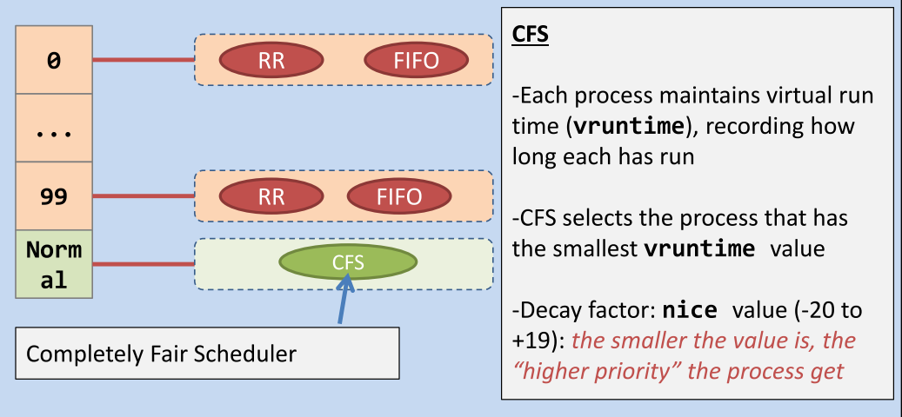
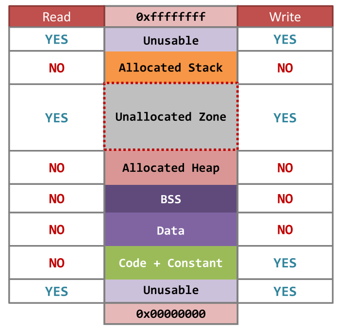
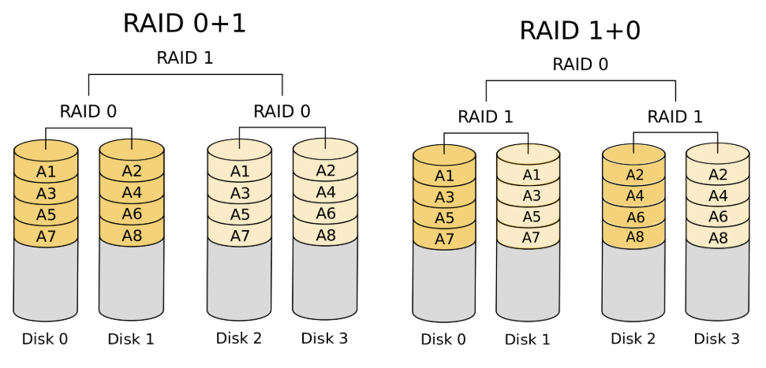
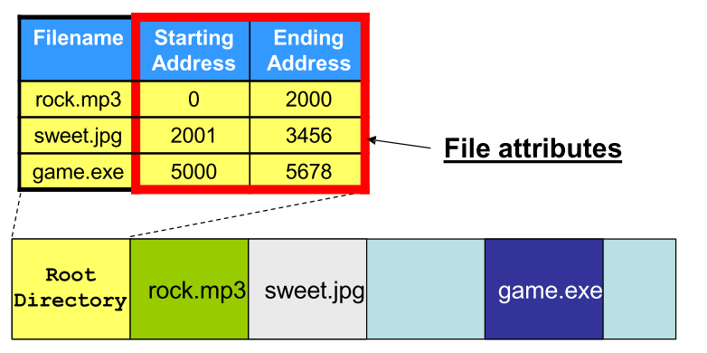
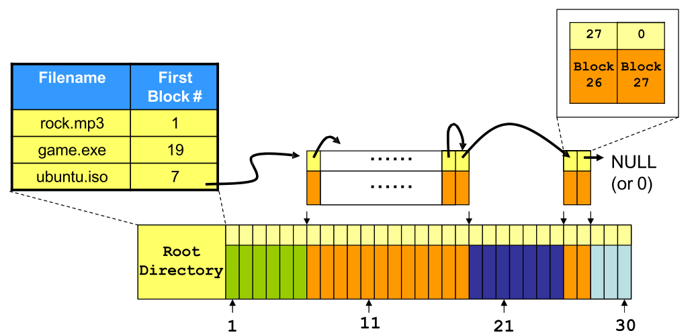
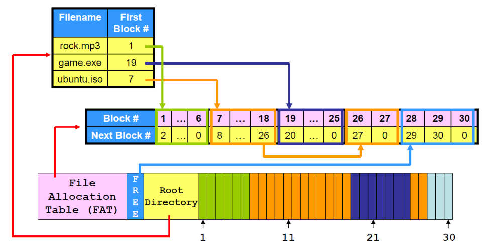
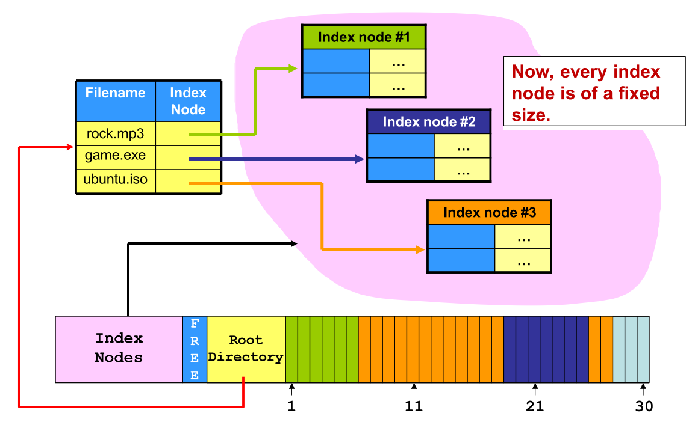
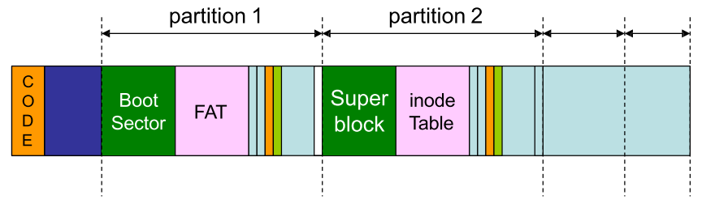

本文用于整理《操作系统原理与设计》课程上所使用 Slides 的笔记，以备查阅。

<!-- More -->

## 第一章 操作系统概览

计算机系统概览：

+ 系统组织：由 CPU 连接总线，通过设备控制器，和其他 IO 设备进行交互
+ 存储结构：采用三角形式的存储结构，通过缓存来提高性能，也通过 DMA 技术提高外存性能
+ 系统架构：多处理器系统，多核系统，集群系统

操作系统概览：

+ 多道程序（multiprogramming）：用于提高 CPU 利用率
+ 多任务处理（multitasking）：用于提高任务的可交互性
+ 中断驱动理念：硬件中断通过设备产生，软件中断（exception/trap）则由程序错误，系统调用等产生
+ 双模式运作（dual-mode）：通过 mode bit 来区分是 user mode 还是 kernel mode，后者具有更高权限
+ 系统调用：由内核提供给上层的 api，用于屏蔽与底层硬件交互的过程
+ 操作系统标准：POSIX 和 BSD，分别实现的操作系统有 Linux 和 MacOS

操作系统组件：

+ 进程：是程序的运行时实例，在 Linux 中通过树结构维护父子关系，需要提供同步，交互，死锁处理等功能
+ 内存：是 CPU 能直接访问的最大的存储介质，需要提供内存分配，映射等功能
+ 存储：文件系统的设计，独立于操作系统，用于高效管理持久化介质
+ 杂项：
  + 保护和安全：通过用户 ID 来决定该用户的权限
  + 计算环境：传统计算机和现代手机，Client-Server 和 P2P，虚拟化，云计算
  + 开源系统：Linux，Unix，Android


## 第二章 操作系统结构

操作系统提供的服务：

+ 对用户：程序执行，IO 操作，文件系统管理，进程通信，错误检测，用户界面
+ 对系统：资源分配，审计系统，保护与安全

系统调用：对操作系统所提供服务的 API，方便上层用户使用，主要分为：

+ 进程控制：load，execute，end，abort
+ 文件管理：open，close，read，write
+ 设备管理：request devices，release devices，read，write
+ 信息维护：get time of day，dump memory
+ 信息交互：message-passing 和 shared-memory
+ 保护：get_permission，allow_user，set_permission，deny_user

操作系统结构：

+ 简单结构：MS-DOS
+ 宏内核（Monolithic Structure）：将所有的功能在内核处实现
+ 微内核：将尽可能多的功能移动到用户态，内核部分只保留核心功能
+ 模块化：提供可加载的内核模块，更加灵活高效
+ 混合：结合多种不同的架构


## 第三章 进程

程序：指的是一系列代码，将 C 语言编译为可执行文件通常需要：

+ 预处理器：用于处理像 `#define, #include, #ifdef` 等指令
+ 编译器：对处理后的代码进行词法语法分析，生成中间码（汇编码）
+ 优化器：对中间代码进行优化，如循环展开等
+ 汇编器：将中间代码生成为机器码，以 `.o` 结尾
+ 链接器：用于将所有 `.o` 文件进行链接，分为静态链接（`.a`）和动态链接（`.so`）
  + 静态链接时，将对应的库文件和 `.o` 文件合并，生成的可执行文件较大
  + 动态链接时，只需要检查 `.o` 文件使用的函数是否在库文件中声明即可，生成的可执行文件较小

进程：指的是运行中的程序，此时程序已经被加载到内存中，处于活动状态

+ 内存：代码段，数据段，堆，栈，程序计数器，寄存器
+ 状态：新建，就绪，运行，等待，退出
+ PCB：进程控制块，处于内核空间中，包含有进行运行所需的一切信息

进程操作：

+ 进程识别：getpid
+ 进程创建：进程间存在父子关系，Linux 中为孤儿进程提供 re-parent 操作，使得进程按照树形维护，Windows 则允许孤儿进程成为树根，按照森林维护。进程创建使用 fork：
  + 克隆的内容：程序代码，内存，打开文件表，程序计数器
  + 不克隆的内容：fork 返回值（子进程 pid 或者 0），pid，运行时间
+ 进程执行：fork 只能使得子进程运行相同的程序，可以通过 exec* 函数来执行新的程序
  + 通过 exec* 函数执行新程序，执行完并不会返回到原来的程序中执行
  + exec* 函数将会丢弃掉原来进程的内存，寄存器值，但是会保存 pid，进程关系，以及运行时间等
+ 进程等待：
  + wait：若存在运行中的子进程，则父进程被挂起，直到有一个子进程进入退出态，否则不会挂起
  + waitpid：可以等待某个子进程状态的变化

内存被分为：

+ 内核空间：存储内核数据结构，内核代码，设备驱动等，只允许内核代码访问
+ 用户空间：存储进程的所需内存，进程执行程序的代码，内核代码和用户代码都可以访问

进程操作系统调用的内部实现：

+ getpid：用户态程序调用 getpid 时，会进行上下文切换，此时处于内核态，可以直接访问到进程对应的 PCB，从而得到 pid，之后再次上下文切换到用户态继续执行原来的代码
+ fork：在内核态，进程（PCB）以双向链表连接起来，当调用 fork 时：
  + 首先在内核空间复制一份和父进程相同的 PCB，但是需要修改对应的 PID，运行时间，父亲孩子指针
  + 之后，将新创建的 PCB 添加到双向链表中
  + 在用户态，进程的内存空间同样会被复制一份（写时复制）
  + 子进程和父进程共享相同的打开文件表，因此都会输出到 shell 中
+ exec*：
  + 首先根据给定的参数在系统中寻找对应的程序
  + 然会根据 PCB 对进程用户态空间（局部变量，动态分配空间，全局变量，代码段）进行设置或清除
  + 最后重置寄存器值，如将程序计数器
+ wait + exit：
  + 当子进程调用 exit 时，内核态根据 PCB 找到用户态空间，将其释放，但是此时内核态进程链表中仍然存在该进程项，此时进程成为僵尸进程，同时内核会向其父进程通过 signal 来通知
  + 当父进程调用 wait 时，内核将会为其设置一个 signal handling routine，用于在接收到对应的信号时执行，同时，内核此时将会挂起父进程，当对应的信号到来时，对应的 routine 被执行，默认情况下将会移除子进程项，释放其内核态资源，最后，这样的 signal handleing routine 被移除，同时返回到原来父进程的用户态。若在子进程结束之后再调用 wait，同样也会触发上述一系列动作
  + 孤儿进程回收：init 进程将成为其父进程，并且 init 会周期性调用 wait 


## 第四章 线程

并发和并行：前者表示在某段时间内多个程序在执行，后者则表示在某个时刻多个程序同时在执行

线程：轻量级进程，是 CPU 运行的基本单位，相对于进程，线程的创建代价更小，而且相同进程下创建的线程还能够共享部分资源，对应的资源消耗也少一些

相同进程内线程内存共享情况：

+ 共享：代码段，全局变量，动态内存，文件打开表等
+ 非共享：栈，程序计数器，寄存器值

线程优点：更高的响应性，便于数据共享，经济，可扩展性强

线程模型：用于表示内核态线程和用户态线程之间的关系

+ 多对一：容易实现，但是一旦调用一个阻塞式系统调用，其他线程将不会得到执行
+ 一对一：更高的并发度，但是此时并不能创建过多的线程，因为内核态内存有限，Linux 和 Windows 使用
  + 基于进程的调度器：只对进程进行调度，但是进程内哪个线程被执行需要库文件提供支持
  + 基于线程的调度器：只对线程进行调度，linux 内核 2.6 以后支持
+ 多对多：结合上述优点

多线程编程：

+ 线程创建：pthread_create，需要定义对应的线程函数
+ 线程等待：pthread_join，可以等待特定的子线程，和 wait 实现原理相同
+ 线程标识：pthread_self，返回 pthread_t，结构体
+ 线程退出：pthread_exit，线程主动退出
+ 线程中止：pthread_kill，中止正在执行的线程
+ 隐式多线程：ThreadPool，OpenMP

线程带来的问题：

+ 系统调用实现：
  + fork：进程将会复制所有的线程或者只会复制对应的调用者线程
  + exec：直接修改进程的代码段，因此所有线程都会被影响
+ signal：当一个 signal 到来时，应该将其分发给哪个线程，pthread_kill(pthread_t tid, int signal)
+ Thread-Local Storage：每个线程独有的存储空间，用于存储特定线程的数据，和 static data 类似


## 第五章 进程通信与同步

进程间通信模型：

+ 共享内存
+ 消息传递

进程间通信方式：

+ POSIX 共享内存：通过将内存区域和文件关联起来，主要涉及 shm_open，ftruncate，mmap，shm_unlink
+ 套接字：通过 IP 和 port 来唯一定义，可以通过套接字实现消息传递
+ 管道：是一个共享对象，可以用来让进程间间通信
  + 普通管道：只用于存在亲缘关系的进程间，单向，在 Unix 中通过 fork，父进程关闭读端，子进程关闭写端，就可以构成该普通管道
  + 命名管道：可以在不具有亲缘关系的进程间通信，可能有多个写端，半双工，在 Unix 中称为 FIFOs，相关 api 如 mkfifo，open，read，write，close

Race Condition：指的是程序的输出依赖于共享对象的被访问顺序，如 A 进程执行 `X += 10`，B 进程执行 `X -= 10`，最终结果可能是 `-10, 0, 10`，其结果依赖于程序间的执行顺序

进程互斥：

+ 通过定义临界区方案可以实现进程互斥，其主要定义四个部分：

  + 进入区：定义了进入临界区前需要的操作，如检查资源是否可用
  + 临界区：表示此时正在操作共享对象
  + 退出区：定义了退出临界区后需要的操作，如重新设置访问状态等
  + 剩余区：程序的其他代码

+ 临界区方案需要满足的条件：

  + 互斥：两个进程不能同时在临界区内
  + 前进：只有在临界区内的进程才能阻塞其他进程
  + 有限等待：进程不应该一直等待进入临界区

+ 临界区方案的实现方案：

  + 屏蔽中断：和非抢占式内核原理相同，在进入区屏蔽中断，退出区允许中断，这样在临界区内的进程不会发生上下文交换，从而保证了互斥，该方法存在性能损失

  + 互斥锁：使用锁来表示是否允许进程进入临界区，通常使用硬件指令，以自旋锁的方式实现，但是存在 CPU 消耗

  + 严格轮换：定义一个共享变量，用来表示现在哪个进程被允许进入临界区，但是违背了前进条件，并且不高效

  + Peterson’s solution：先检查其他进程，若其他进程想要进入临界区，则让它们先进入，但是可能存在优先级反转问题，即高优先级的进程一直在让其他进程进入临界区

  + 信号量：既可以用于线程互斥，也可以用于线程同步。上面的互斥锁，严格轮换和 Peterson’s solution 在进入区若条件不满足的时候，采用的方案都是 CPU 忙等，会消耗大量 CPU 资源，而是用信号量则不存在该问题，因为其会挂起和唤醒进程

    ```c
    typedef struct { 
    	int value; 
        struct process * list;
    } semaphore;
    
    void down(semaphore *s) {
        disable_interrupt();
        while (*s == 0) {
            enable_interrupt();
            special_sleep();
            disable_interrupt();
        }
        *s = *s - 1;
        enable_interrupt();
    }
    
    void up(semaphore *s) {
        disable_interrupt();
        if (*s == 0) {
            special_wakeup();
        }
        *s = *s + 1;
        enable_interrupt();
    }
    
    ```

    使用 disable_interrupt 来保证操作的原子性，在 special_sleep 之前需要 enable_interrupt，因为此时可以让出 CPU 资源给其他应用使用。

死锁：两个或多个线程由于相互等待而永远被阻塞的情况

+ 条件：互斥，保持并等待，非抢占，循环等待
+ 处理：
  + 死锁检测和恢复：通过资源分配图，检测其中是否存在环路，然后让其中一个进程释放掉所占用资源
  + 死锁预防：通过合理的资源分配，防止死锁产生，如银行家算法
  + 鸵鸟算法：直接忽略死锁问题
+ 死锁与饥饿：饥饿是指一个线程长时间得不到需要的资源而不能执行的现象，并不表示存在死锁

进程同步问题：

+ 生产者-消费者问题：通过使用 mutex 信号量实现资源互斥访问，通过 empty 和 full 信号量实现同步
+ 哲学就就餐问题：
  + 最多允许 4 个哲学家同时拿筷子，此时不会存在循环等待
  + 前四个哲学家先拿左边的筷子，最后一个哲学家先拿右边筷子（或者按照奇偶区分）
  + 定义拿筷子这个操作是不可分的，定义 mutex = 1
+ 读者-写者问题：定义 write 信号量表示是否可写，定义 read_mutex 表示是否可读，同时定义 read_count，在其从 0 变为 1 时，down(&write)，在其从 1 变为 0 时，up(&write)，该方案可能存在写操作进程饥饿的情况


## 第六章 进程调度

进程状态：转移过程图如下，其中在 waiting 状态时，分为可中断和不可中断，可中断则表示程序能够响应像 `Ctrl + C` 这样的命令，不可中断则表示该程序非常希望得到对应的资源


进程调度：

+ 发生时刻：

  + 一个新进程被创建

  + 一个在正执行的进程被终结或者进入了等待状态

  + 一个进程从 waiting 状态转移到 ready 状态

+ 上下文切换：进程调度决定接下来选择哪个进程执行，而上下文切换则是实际的切换过程，切换过程将会保存当前进程的程序计数器和寄存器值，同时加载新的进程对应的程序计数器和寄存器值到对应寄存器中

+ 类型：

  + 抢占式调度：进程除了主动放弃 CPU 资源外，还可能存在其他事件让其主动放弃 CPU，如分时系统
  + 非抢占式调度：当一个进程被调度执行，其只有进入终结态或者等待态才会允许其他进程执行

+ 性能指标：

  + 周转时间：从进程提交到结束所花费的时间
  + 等待时间：进程在 ready_queue 中的等待时间
  + 响应时间：从进程提交到首次执行的时间

+ 调度算法：

  + FIFO：非抢占，平均等待时间长
  + SJF：既可以是抢占式，也可以是非抢占式，长事务可能被饿死
  + RR：抢占式，很难合理控制时间片大小
  + Priority Scheduling：抢占式
  + 多级优先队列：Linux 实际使用的方案，不同优先级上时间片大小不同，调度算法也不同
  + 实时调度算法：
    + 单调速率算法（RMS）：根据周期来定静态优先级，然后进行调度，但是不保证一系列进程能够被正确调度
    + 最早截至日期调度（EDF）：根据截至日期指定优先级

+ Linux 调度器：

  


## 第七章 内存管理

用户空间的内存管理：

+ 内存空间：用户态空间按照段式内存管理，将进程空间分为不同的段，在 32 位系统中，每个进程的最大内存被限制为 4GB，注意，每个进程的内存段是相互独立和分离的

+ 代码段（.text）：用于存储程序代码和常量的地方，该部分内存只读

+ 数据段（.data & .bss）：

  + .data 段用于存储已经初始化了全局变量和静态变量
  + .bss 段用于存储尚未初始化的全局变量和静态变量，其会在其中记录变量对应的大小，在程序执行时分配，这样可以减少程序分发时的大小

+ 栈：包含局部变量，函数参数，程序参数以及环境变量，函数调用以帧的形式实现，可以读写不在当前帧的其他局部变量，方便数据共享

+ 堆：动态分配内存空间，当外部用户通过 malloc 进行内存获取时，如果剩余可用空间不够，其会通过 brk 系统调用来改变堆大小，保证其能够正常进行分配，空闲内存管理方式有

  + 隐式空闲链表：size & is_allocated，但是很难和前面的空闲块合并，可以增加 footer 信息
  + 显式空闲链表：在空闲块增加指针（pre & next）
  + 分离空闲链表：按照不同大小来组织空闲链表，实际使用如 Linux 中的伙伴系统

  空间分配可能带来问题：外部碎片和内部碎片

+ 段错误：当访问（读或者写）了不该被访问的内存，操作系统将会返回段错误

  

内核空间的内存管理：

+ 虚拟内存地址和物理内存地址：CPU 所处理到的内存地址都是某个程序的虚拟内存地址，需要经过翻译后才能转变为物理地址，访问实际的物理存储介质
  + 不同进程使用相同的虚拟地址，最终可能被翻译为不同的物理地址
  + 虚拟地址可以实现内存共享，只需要同时让其被翻译为被共享物理地址
  + 进程内存可以增长：解决了外部碎片，不需要物理上连续的内存空间来保存进程
+ MMU：用于将虚拟地址转换为物理地址的硬件，存在于 CPU 上，实际上是一个查找表，每个进程都对应一个查找表，只有在运行态才会被加载到 MMU 中，其他时候则在内核空间中
+ 页式内存管理：为了防止查找表过大，按照页进行转换，因此，内存分配的最小单位变为页大小，此时存在内部碎片的问题
  + 多级页表：用于缓解页表过大的问题，但是会造成地址转换速度下降的问题
  + TLB：用于缓存最近转换过的地址，加速下次地址转换速度
+ demand paging：在我们调用 malloc 的时候，程序执行的速度很快，因为此时只是分配虚拟内存地址，在真正访问的时候此时才会加载物理内存，该情况称为 demand paging
  + swap area：永久存储介质中用于存放物理页的存储空间，在物理页被全部占用，但此时仍然有新的 page fault 产生时，将会选择逐出某些物理页
  + copy on write：在 fork 后，父子进程共享相同的物理页，但是如果子进程需要写的物理页是，此时才会发生复制
+ 页替换：
  + 算法
    + Optimal
    + FIFO
    + LRU，Second-chance algorithm，CLOCK
  + 相关问题：
    + Belady 异常：物理帧数增加可能会导致缺页中断个数增加，在 FIFO 中出现，在 LRU 和 Optimal 中不会出现
    + Thrashing（抖动）：如果被更换页面是一个很快会被再次访问的页面，则将再次缺页中断，音响系统的执行效率
+ Linux 内存管理：使用伙伴系统分配空间，粒度为页，对于小对象可能还是太大，可以引入 Slab 分配器
+ 内存文件映射：将文件加载到物理页中，使得操作文件像操作内存一样，提升了 IO 性能


## 第八章 存储管理

硬盘：

+ 结构：盘片，磁道，扇区，柱面，通过 `逻辑块号 ->（柱面，磁道，扇区）` 进行定位
+ 访问：寻道延迟 + 旋转延迟 + 传输延迟
+ 密度：
  + Constant linear velocity：CD/DVD，需要不同的旋转速度来保证数据传输速率不变
  + Constant angular velocity：HDD，保持恒定的转速即可
+ 使用方式：
  + 文件系统：通过文件系统来进行使用，文件系统将会维护整个磁盘上面的数据
  + Raw Disk：不通过文件系统，直接操作磁盘
+ 调度方式：FCFS，SSTF，SCAN，C-SCAN，LOOK，C-LOOK

RAID：

+ RAID0：不存在冗余，一个整体数据被划分到几个硬盘上存储，提高了数据的访问速度

+ RAID1：数据仍然被划分到几个硬盘上存储，每个硬盘复制一份，存在较大的存储开销

+ RAID01 + RAID10：

  

+ RAID4：增加一个 DISK，专门用于进行校验和纠错，更新代价大

+ RAID5：和 RAID4 类似，但是校验数据块被分散存储在不同的硬盘中，更新代价大

+ RAID6：和 RAID5 类似，但是增加了两个校验块，容错性更大，更新代价大


## 第九章 文件系统

文件系统两种数据类型：

+ 文件：用于存储数据的最小单元，包含有文件属性和文件内容，文件名可以重复，但是路径名不可重复
+ 目录：一种特殊的文件，其文件内容用于记录当前目录下的子文件和目录信息

文件系统操作流程：

+ 文件创建：实际上是更新某个目录文件的内容
+ 文件打开：进程提供路径名给操作系统，操作系统根据路径名在磁盘上找到**文件属性**对应的数据块，然后将文件属性复制到对应的文件打开表中，最后返回给进程该文件的文件描述符
+ 文件读取：进程提供文件描述符给操作系统，操作系统根据文件描述符，找到对应的文件信息，硬盘返回数据，首先在内核态缓存，之后再复制到用户进程空间中

文件系统实现：

+ Contiguous allocation：外部碎片 + 文件增长问题

  

+ Linked-list allocation：blocking + linked list，随机访问问题

  

+ Linked-list allocation: centralized next-block # (FAT)，需要缓存整个 FAT

  

+ index-node allocation：将 FAT 分为不同的 index node，按照 index node 组织文件

  

  硬链接：指的是创建不同的目录项，指向了相同的 inode

  软连接：创建了新的 inode，里面存储了是原来文件的 pathname

文件系统信息存储：在 FAT 上存储 Boot Sector，在 Ext 上存储 Superblock，里面包含了文件系统的信息

分区：将磁盘划分为不同的分区，每个分区上的文件系统可以不同，硬盘需要存储 Boot Code 和分区表




## 第十章 输入输出系统

和设备控制交互的方式：

+ Direct IO instruction
+ Memory Mapped IO：设备的数据和寄存器被映射到地址空间中

IO 交互方式：

+ 轮询：CPU 一直轮询 busy 寄存器，直到其为 0，此时才能继续进行 IO 操作
+ 中断：IO 发起中断，CPU 接收到中断后根据中断向量得到处理程序的地址，分为可屏蔽中断和非屏蔽中断，可屏蔽中断指 CPU 可以不响应该中断，非屏蔽中断则表示 CPU 必须执行中断处理函数
+ DMA：CPU 只需要发送数据地址给 DMA 控制器，DMA 在搬运完整个块时再来通知 CPU 已完成数据搬运

IO 设备：块设备，字符设备，网络设备

IO 方法：同步（阻塞和非阻塞）和异步，异步能提供更高的 CPU 利用率

IO 调度：每个设备维护一个等待队列，可以提供第等待时间和公平性

Buffer：存储数据的中间站，用于缓解不同处理速度和传输速度的问题

Cache：用于提高系统的性能，减少访问延迟

