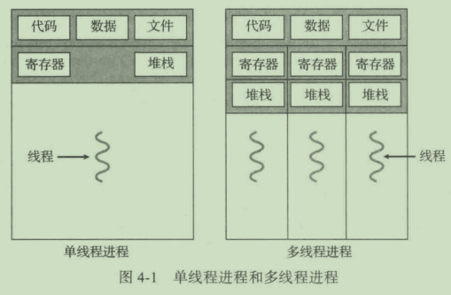
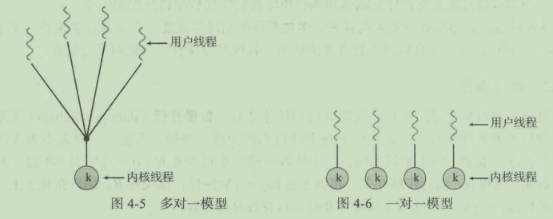
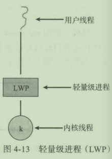

本文总结了《操作系统概念》中的知识点，以便查阅。

<!-- More -->

## 第二章 操作系统结构

操作系统的服务：主要包括以下功能：

+ 用户界面
+ 程序执行
+ IO 操作
+ 文件系统操作
+ 通信：通过共享内存或者消息交换实现
+ 错误检测
+ 资源分配
+ 记账：记录用户使用资源类型和数量
+ 保护和安全

系统调用：提供操作系统的服务调用接口，该部分通常使用 C 或者 C++ 实现，当然，对某些底层硬件操作可能需要使用汇编。向操作系统传参的方法有：寄存器传参，栈传参，表传参。

系统调用类型：进程控制，文件管理，设备管理，信息维护，通信，保护。

操作系统的结构：

+ 简单结构：如 MS-DOS，并没有仔细划分为模块

  

+ 分层方法：每层上调用的接口是不同的，用于区分用户接口和不同等级的系统接口

  

+ 微内核：主要功能在于为客户端程序和运行在用户空间的各种服务提供通信，通信是通过消息传递实现的

  

+ 模块：最佳方法是可加载的内核模块，常见于现代 Linux 系统中

  

操作系统的引导：加载内核以启动计算机的过程，称为系统引导。大多数的操作系统都有一个引导程序，改程序能够定位内核，并将其加载到内存以开始执行。当 CPU 收到一个重置事件时，指令寄存器会加载某个预先定义的内存位置，并从该位置执行，该位置实际上就是引导程序所在位置。

## 第三章 进程

进程概念：进程是执行的程序，包括代码段，数据段，程序计数器的值，堆和栈等。程序是被动实体，而进程是活动实体。

进程状态：就绪，运行，等待，新建，终止。

进程控制块（PCB）：包含有和进程相关的信息，如进程状态，进程 id，程序计数器，内存管理信息等。

调度队列：进程在进入系统的时候，会被加入到进程队列，该队列包含有所有进程。驻留在内存中，就绪的进程则保存在就绪队列上。通常采用双向链表实现，链表指向不同进程的 PCB。

上下文切换：切换 CPU 到另外一个进程需要保存当期进程的状态和恢复另外一个进程的状态。

进程间通信（IPC）：提供进程间通信的好处有信息共享，计算加速和模块化。有两种基本模型：共享内存和消息传递。

客户机-服务器通信：

+ 套接字：常用且高效，但是输入分布式进程间一种低级形式的通信
+ 远程服务调用（RPC）：和 IPC 的消息不同，RPC 通信交换的信息具有明确的结构，不再仅仅是数据包。
+ 管道：分为单向和双向（半双工和全双工），是否允许非父子关系的进程之间相互通信。

## 第四章 多线程编程

线程：是 CPU 调度的基本单位，包含有 ID，程序计数器，寄存器组等，和同一进程下的其他线程共享代码段，数据段和其他资源。

多线程编程的优点：响应性，资源共享，经济和可伸缩性。

并发和并行：某个时间段内多个任务交替执行，叫做并发；同一时间点，有不同的任务运行，叫做并行。

多线程模型：有用户线程和内核线程，用户线程位于内核之上，管理无需内核支持，内核线程由操作系统支持和管理，常见的有三种模型：

+ 多对一模型：一个线程执行阻塞调用，整个进程都会阻塞，另外，由于任一时间只有一个线程可以访问内核，不能很好地在多处理核系统上运行。

+ 一对一模型：优点是可以在多个核上运行，缺点是每次创建一个用户线程都需要创建一个内核线程，不能创建太多的线程。

  

+ 多对多模型：解决了多对一模型和一对一模型中的缺点。多路复用多个用户线程到相同数量或者更少的内核线程，但也允许绑定某个用户线程到一个内核线程，该变种有时称为双层模型。

  

轻量级进程（LWP）：在多对多模型或者双层模型之间的一个数据结构，对于用户级线程，LWP 表现为虚拟处理器，每个 LWP 和一个内核线程相连，只有内核线程才能通过系统调度以便运行于物理处理器。

