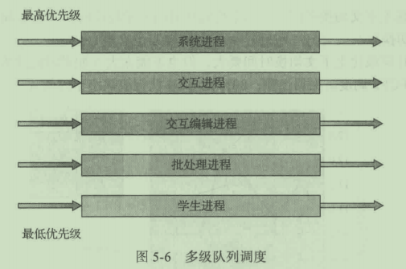
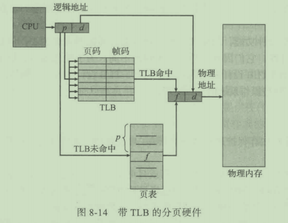
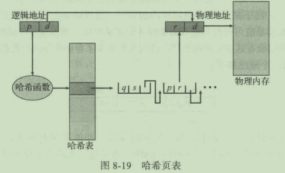
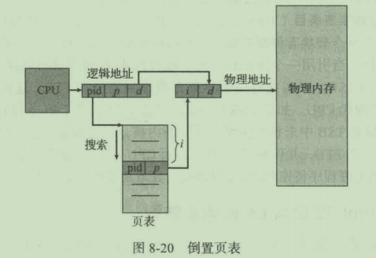
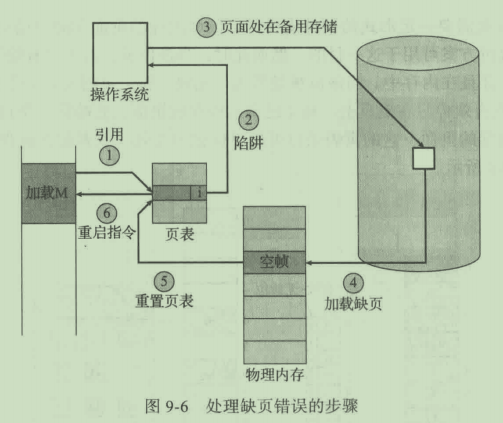
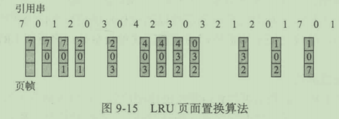

本文总结了《操作系统概念》中的知识点，以便查阅。

<!-- More -->

## 第二章 操作系统结构

操作系统的服务：主要包括以下功能：

+ 用户界面
+ 程序执行
+ IO 操作
+ 文件系统操作
+ 通信：通过共享内存或者消息交换实现
+ 错误检测
+ 资源分配
+ 记账：记录用户使用资源类型和数量
+ 保护和安全

系统调用：提供操作系统的服务调用接口，该部分通常使用 C 或者 C++ 实现，当然，对某些底层硬件操作可能需要使用汇编。向操作系统传参的方法有：寄存器传参，栈传参，表传参。

系统调用类型：进程控制，文件管理，设备管理，信息维护，通信，保护。

操作系统的结构：

+ 简单结构：如 MS-DOS，并没有仔细划分为模块

  

+ 分层方法：每层上调用的接口是不同的，用于区分用户接口和不同等级的系统接口

  

+ 微内核：主要功能在于为客户端程序和运行在用户空间的各种服务提供通信，通信是通过消息传递实现的

  

+ 模块：最佳方法是可加载的内核模块，常见于现代 Linux 系统中

  

操作系统的引导：加载内核以启动计算机的过程，称为系统引导。大多数的操作系统都有一个引导程序，改程序能够定位内核，并将其加载到内存以开始执行。当 CPU 收到一个重置事件时，指令寄存器会加载某个预先定义的内存位置，并从该位置执行，该位置实际上就是引导程序所在位置。

## 第三章 进程

进程概念：进程是执行的程序，包括代码段，数据段，程序计数器的值，堆和栈等。程序是被动实体，而进程是活动实体。

进程状态：就绪，运行，等待，新建，终止。

进程控制块（PCB）：包含有和进程相关的信息，如进程状态，进程 id，程序计数器，内存管理信息等。

调度队列：进程在进入系统的时候，会被加入到进程队列，该队列包含有所有进程。驻留在内存中，就绪的进程则保存在就绪队列上。通常采用双向链表实现，链表指向不同进程的 PCB。

上下文切换：切换 CPU 到另外一个进程需要保存当期进程的状态和恢复另外一个进程的状态。

进程间通信（IPC）：提供进程间通信的好处有信息共享，计算加速和模块化。有两种基本模型：共享内存和消息传递。

客户机-服务器通信：

+ 套接字：常用且高效，但是输入分布式进程间一种低级形式的通信
+ 远程服务调用（RPC）：和 IPC 的消息不同，RPC 通信交换的信息具有明确的结构，不再仅仅是数据包。
+ 管道：分为单向和双向（半双工和全双工），是否允许非父子关系的进程之间相互通信。

## 第四章 多线程编程

线程：是 CPU 调度的基本单位，包含有 ID，程序计数器，寄存器组等，和同一进程下的其他线程共享代码段，数据段和其他资源。

多线程编程的优点：响应性，资源共享，经济和可伸缩性。

并发和并行：某个时间段内多个任务交替执行，叫做并发；同一时间点，有不同的任务运行，叫做并行。

多线程模型：有用户线程和内核线程，用户线程位于内核之上，管理无需内核支持，内核线程由操作系统支持和管理，常见的有三种模型：

+ 多对一模型：一个线程执行阻塞调用，整个进程都会阻塞，另外，由于任一时间只有一个线程可以访问内核，不能很好地在多处理核系统上运行。

+ 一对一模型：优点是可以在多个核上运行，缺点是每次创建一个用户线程都需要创建一个内核线程，不能创建太多的线程。

  

+ 多对多模型：解决了多对一模型和一对一模型中的缺点。多路复用多个用户线程到相同数量或者更少的内核线程，但也允许绑定某个用户线程到一个内核线程，该变种有时称为双层模型。

  

轻量级进程（LWP）：在多对多模型或者双层模型之间的一个数据结构，对于用户级线程，LWP 表现为虚拟处理器，每个 LWP 和一个内核线程相连，只有内核线程才能通过系统调度以便运行于物理处理器。

## 第五章 进程调度

基本概念：进程的执行包括有 CPU 执行和 IO 等待过程，IO 密集型程序表现为大量短 CPU 执行，CPU 密集型程序只有少量长 CPU 执行。每当 CPU 空闲的时候，操作系统就会从就绪队列中选择一个进程来执行。在此过程中，调度程序需要完成上下文切换，切换到用户模式等。

调度方案：抢占式和非抢占式的。非抢占式调度下，一旦某个进程分配到 CPU，就会一直使用 CPU，知道它变为终止或者等待状态。

调度准则：

+ CPU 使用率
+ 吞吐量
+ 周转时间：从进程提交到进程完成的时间段
+ 等待时间：在就绪队列中等待的时间
+ 响应时间：从提交请求到第一次响应的时间

调度算法：如何从就绪队列中选择进程以便为其分配 CPU

+ 先到先服务调度（FCFS）

+ 最短作业优先调度（SJF）

+ 优先级调度（PS）：低优先级无穷等待解决方案之一是老化，即逐渐增加在系统中等待时间长的进程的优先级

+ 轮转调度（RR）：性能很大程度上取决于时间片的大小

+ 多级队列调度：将就绪队列分成多个单独队列，每个队列可以采用不同的调度算法

  

+ 多级反馈队列调度：在多级队列调度的时候，进程只会在某个队列中，队列之间不允许迁移，而多级反馈队列允许进程在队列之间切换。

  

## 第六章 同步

生产者消费者问题：两个不同的进程对 counter=4 分别进行加一和减一。如果这两个进程并发执行，得到的结果可能是 3,4,5。语句执行方式为 load，add/sub，store。像这样得到不正确的状态的过程称为竞争。

临界区问题：进程在临界区内可能会修改公共变量，更新文件内容等。临界区问题的解决方案应该满足如下要求：

+ 互斥：只允许单个进程在临界区内运行
+ 进步：如果没有进程在临界区，那么可以选择某个进程进入
+ 有限等待

互斥锁（mutex lock）：在进入临界区应该得到锁，在退出的时候释放锁。accquire 和 release 两个操作都是原子执行的。如果在获取的时候忙等待，那么这样的锁也被称为自旋锁。不过自旋锁也有一个优点，当进程在等待锁的时候，没有上下文的切换。当使用锁的时间较短的时候，自旋锁还是可用的。

信号量（semaphore）：信号量 S 是一个整形变量，通过 wait 和 signal 操作。二进制信号量类似于互斥锁。

死锁与饥饿：死锁指的是多个进程间相互等待资源，饥饿则是无限等待信号量。

经典同步问题：有界缓冲问题，读者作者问题，哲学家就餐问题。

## 第七章 死锁

死锁产生的必要条件：

+ 互斥
+ 占有并等待：一个进程占有一个资源并且等待另外的资源
+ 非抢占：资源只能被进程完成任务后自愿释放
+ 循环等待

处理死锁问题：

+ 死锁预防和死锁避免：死锁预防指通过破坏死锁产生的必要条件来预防死锁，如一个进程同时获取所有它所需要的所有资源，按照顺序获取资源等。思索避免算法有银行家算法。
+ 死锁检测和恢复：通过从资源分配图中判断是否存在环，恢复的时候可以通过进程终止和资源抢占。

## 第八章 内存管理策略

逻辑地址和物理地址：CPU 生成的地址通常称为逻辑地址，而内存单元看到的地址通常称为物理地址。

交换：进程必须在内存中以便执行，不过，进程可以暂时从内存换出到磁盘中，之后再次换入。

碎片：外部碎片指的是尚未分配的内存因为已经分配的内存而产生，内部碎片指的是分配大于进程所需的多余的内存。外部碎片问题的解决方案之一就是紧缩，指在内存中移动程序，并且不影响程序的运行。

分段：逻辑地址空间由一组段构成，逻辑地址通过`<段号，偏移>`组成。地址转换是通过段表实现的。

分页：分段允许进程的物理空间是非连续的，分页同样支持该功能，不过，分页避免了外部碎片，而分段则不能避免。分页的基本方法是将物理内存分为大小固定的块，称为帧（frame），同样，其将逻辑内存也分为大小相同的块，称为页（page）。通过页表实现地址转换。

转换表缓冲区（TLB）：大多数计算机允许页表非常大，通常需要将页表存放在内存中，并且将页表基地址寄存器指向页表。这样带来的问题是访问一个字节的数据需要两次内存访问。为此，可以设置 TLB，其实际上是一个高速缓存。TLB 和 页表协同工作：

共享页：不同进程之间可以共享公共代码，这也是分页的优点之一。

页表结构：

+ 分层分页：为了解决单页表在大内存系统下的内存浪费问题。

  

+ 哈希页表：采用哈希函数对虚拟地址页码进行哈希，并且在链表中比较页码。

  

+ 倒置页表：通过查找`<pid, p>`条目，从而确定物理地址`<i, d>`，从而确定物理地址。该方法是根据虚拟地址查找的，可能需要花费大量时间。

  

## 第九章 虚拟内存管理

请求调页（demand paging）：当程序被加载到内存中的时候，仅加载需要的页面。为了区分哪些页面已经加载到内存，需要提供标志位，当无效的页面被访问的时候，就会产生缺页错误。下图中 `i` 表示该页无效。

写时复制：比如采用了 fork 创建了一个子进程，两者会共享相同的物理内存页。在子进程修改相关数据时，才来进行复制。

页面置换：当所有的内存都已经分配完毕后，再次请求帧分配的时候，操作系统发现此时没有空闲帧，从而触发页面置换。采用脏位可以在牺牲页面没有被修改的情况下减少一次页面传输。

+ FIFO 页面置换：引用串表示依次访问的页面编号。

  

+ 最优页面置换：置换最长时间不会被用到的页面。该算法难以实现，因为需要用到引用串的未来知识，主要用于比较研究。

  

+ 最近最少使用（LRU）页面置换：当需要置换页面的时候，LRU 选择最长时间没有使用的页面。

  

+ 基于计数的页面置换：最不经常使用和最经常使用页面置换算法。

内存映射文件：如果采用`open,read,write`来读取写入磁盘文件，每个文件访问都会经过系统调用和磁盘访问。采用虚拟内存技术，可以将文件 IO 作为常规内存进行访问。该方法会提升性能。

## 第十章 文件系统

文件：操作系统对存储设备的物理属性加以抽象，定义出的逻辑存储单位。

文件操作：创建，读，写，文件定位，删除，截断。

访问方法：顺序访问，直接访问。

目录结构：

+ 单级目录

+ 两级目录

+ 树形目录

  

+ 无环图目录：树结构禁止共享文件或者目录，图目录允许共享

  

文件系统安装（mount）：操作系统需要直到设备的名称和安装点（附加文件系统在原来文件结构中的位置）。

