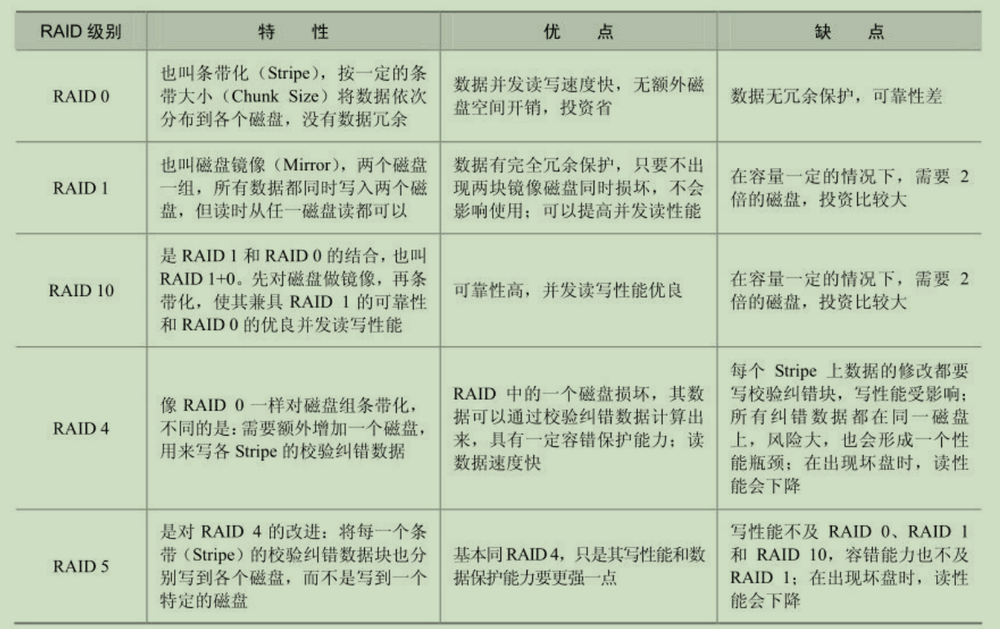
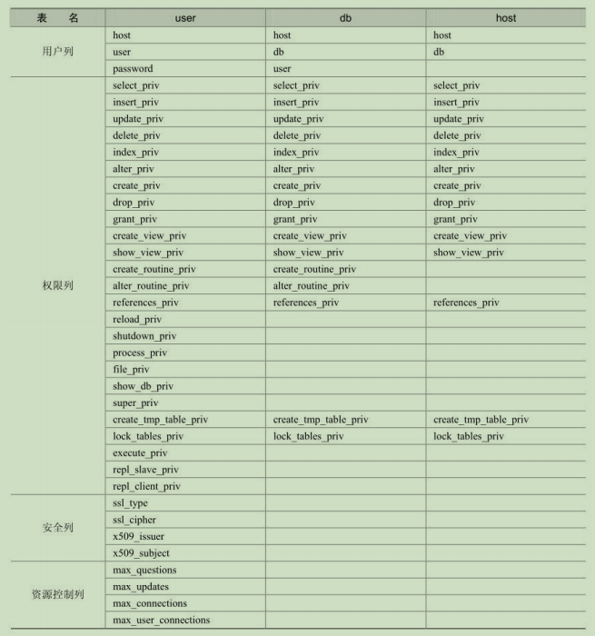
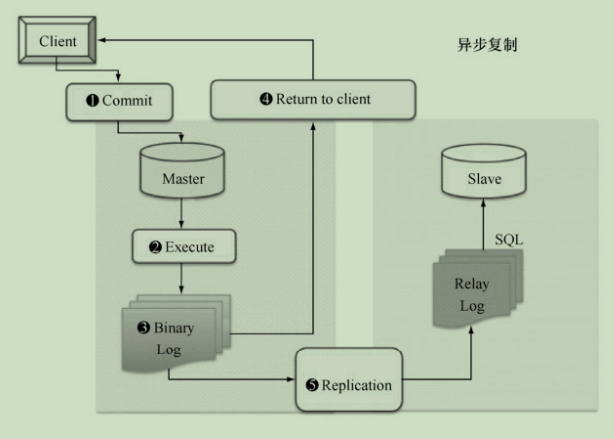
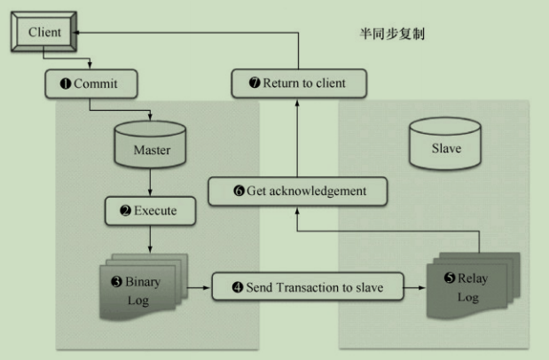
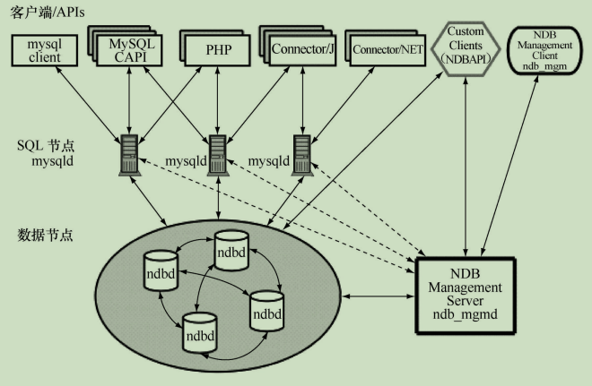
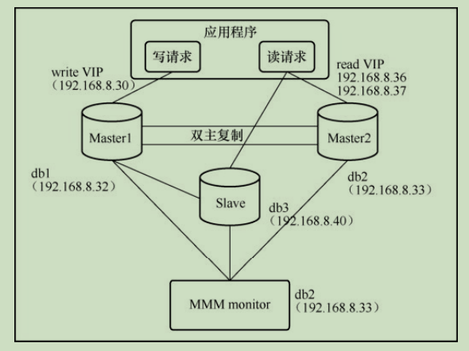
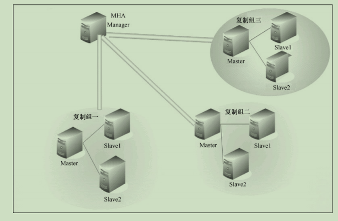

本文用于记录《深入浅出MySQL》里面的知识要点，以备再次查阅。


## 第二章 SQL基础

MySQL使用入门：

+ SQL语句分类：DDL，DML，DCL。

+ DDL：数据定义语言，对数据库内部的对象进行创建，删除，修改等操作。

  ```
  // 数据库
  CREATE DATABASE dbname;
  SHOW DATABASES;
  USE dbname;
  DROP DATABASE dbname;
  // 表
  CREATE TABLE tablename (
  	column_name1, type1 constraints,
  	...
  	column_namen, typen constraints);
  DESC tablename;	
  SHOW CREATE TABLE tablename;
  DROP TBALE database;
  ALTER TABLE tablename MODIFY [COLUMN] column_definition [FIRST | AFTER col_name];
  ALTER TABLE tablename ADD [COLUMN] column_difinition [FIRST | AFTER col_name];
  ALTER TABLE tablename DROP [COLUMN] col_name;
  ALTER TABLE tablename CHANGE [COLUMN] old_col_name column_definition;
  ALTER TABLE tablename RENAME new_tablename;
  ```

+ DML：数据操作，主要包括表记录的增删查改。

  ```
  INSERT INTO tablename(field1, field2, ..., fieldn)
  VALUES
  (value1, value2, ..., valuen),
  (value1, value2, ..., valuen);
  UPDATE tablename SET field1=value1 [WHERE CONDITION];
  DELETE FROM tablename [WHERE CONDITION];
  SELECT * FROM tablename [WHERE CONDITION] [LIMIT offset_start, row_count];
  ```

  + 查询不重复记录：distinct
  + 条件查询：WHERE CONDITION
  + 排序和限制：ORDER BY 和 LIMIT offset_start, row_count
  + 聚合：GROUP BY column_name HAVING condition
  + 表连接：内连接，外连接（左连接，右连接）
  + 子查询：可能需要 in，not in，exists 等
  + 记录联合：UNION，UNION ALL

+ DCL：DBA 用来管理系统中的对象权限时使用。

  ```
  GRANT SELECT, INSERT on dbname.* to 'z1'@'localhost' identified by '123';
  REVOKE INSERT on dbname.* from 'z1'@'localhost';
  ```

帮助的使用：

+ 按照层次查看帮助：`? contents`
+ 快速查阅帮助：`? select`


## 第三章 MySQL支持的数据类型

数值类型：

| 类型         | 大小                                        | 范围（有符号）                                               | 范围（无符号）                                               |
| :----------- | :------------------------------------------ | :----------------------------------------------------------- | :----------------------------------------------------------- |
| TINYINT      | 1 byte                                      | (-128，127)                                                  | (0，255)                                                     |
| SMALLINT     | 2 bytes                                     | (-32 768，32 767)                                            | (0，65 535)                                                  |
| MEDIUMINT    | 3 bytes                                     | (-8 388 608，8 388 607)                                      | (0，16 777 215)                                              |
| INT或INTEGER | 4 bytes                                     | (-2 147 483 648，2 147 483 647)                              | (0，4 294 967 295)                                           |
| BIGINT       | 8 bytes                                     | (-9,223,372,036,854,775,808，9 223 372 036 854 775 807)      | (0，18 446 744 073 709 551 615)                              |
| FLOAT        | 4 bytes                                     | (-3.402 823 466 E+38，-1.175 494 351 E-38)，0，(1.175 494 351 E-38，3.402 823 466 351 E+38) | 0，(1.175 494 351 E-38，3.402 823 466 E+38)                  |
| DOUBLE       | 8 bytes                                     | (-1.797 693 134 862 315 7 E+308，-2.225 073 858 507 201 4 E-308)，0，(2.225 073 858 507 201 4 E-308，1.797 693 134 862 315 7 E+308) | 0，(2.225 073 858 507 201 4 E-308，1.797 693 134 862 315 7 E+308) |
| DECIMAL      | 采用二进制字符串存储，每四个字节存储9位数字 | 依赖于M和D的值                                               | 依赖于M和D的值                                               |

对于整形数据，MySQL还支持在类型名称后面的小括号内指定显示宽度。

日期时间类型：

| 类型      | 大小 ( bytes) | 范围                                    | 格式                | 用途                         |
| :-------- | :------------ | :-------------------------------------- | :------------------ | :--------------------------- |
| DATE      | 3             | 1000-01-01/9999-12-31                   | YYYY-MM-DD          | 日期值，压缩存储             |
| TIME      | 3             | '-838:59:59'/'838:59:59'                | HH:MM:SS            | 时间值或持续时间，压缩存储   |
| YEAR      | 1             | 1901/2155                               | YYYY                | 年份值                       |
| DATETIME  | 8             | 1000-01-01 00:00:00/9999-12-31 23:59:59 | YYYY-MM-DD HH:MM:SS | 混合日期和时间值，字面值存储 |
| TIMESTAMP | 4             | 1970-01-01 00:00:00/2038                | YYYYMMDD HHMMSS     | 混合日期和时间值，时间戳     |

字符串类型：

| 类型       | 大小                  | 用途                            |
| :--------- | :-------------------- | :------------------------------ |
| CHAR       | 0-255 bytes           | 定长字符串                      |
| VARCHAR    | 0-65535 bytes         | 变长字符串                      |
| TINYBLOB   | 0-255 bytes           | 不超过 255 个字符的二进制字符串 |
| TINYTEXT   | 0-255 bytes           | 短文本字符串                    |
| BLOB       | 0-65 535 bytes        | 二进制形式的长文本数据          |
| TEXT       | 0-65 535 bytes        | 长文本数据                      |
| MEDIUMBLOB | 0-16 777 215 bytes    | 二进制形式的中等长度文本数据    |
| MEDIUMTEXT | 0-16 777 215 bytes    | 中等长度文本数据                |
| LONGBLOB   | 0-4 294 967 295 bytes | 二进制形式的极大文本数据        |
| LONGTEXT   | 0-4 294 967 295 bytes | 极大文本数据                    |

+ ENUM：值范围需要在创建表时通过枚举方式显式指定，对于插入不在 ENUM指定范围内的值时，并没有返回警告，而是插入了 enum 定义中的第一个值
+ SET：从允许值集合中选择任意1个或多个元素进行组合来赋值


## 第四章 MySQL中的运算符

算术运算符：

| 运算符   | 作用 |
| :------- | :--- |
| +        | 加法 |
| -        | 减法 |
| *        | 乘法 |
| / 或 DIV | 除法 |
| % 或 MOD | 取余 |

在除法运算和模运算中，如果除数为0，将是非法除数，返回结果为NULL。

比较运算符：

| 运算符          | 含义                       | 备注                                                         |
| --------------- | -------------------------- | ------------------------------------------------------------ |
| =               | 等于                       |                                                              |
| <>, !=          | 不等于                     |                                                              |
| >               | 大于                       |                                                              |
| <               | 小于                       |                                                              |
| <=              | 小于等于                   |                                                              |
| >=              | 大于等于                   |                                                              |
| BETWEEN         | 在两值之间                 | >=min&&<=max                                                 |
| NOT BETWEEN     | 不在两值之间               |                                                              |
| IN              | 在集合中                   |                                                              |
| NOT IN          | 不在集合中                 |                                                              |
| <=>             | 严格比较两个NULL值是否相等 | 两个操作码均为NULL时，其所得值为1；而当一个操作码为NULL时，其所得值为0 |
| LIKE            | 模糊匹配                   |                                                              |
| REGEXP 或 RLIKE | 正则式匹配                 |                                                              |
| IS NULL         | 为空                       |                                                              |
| IS NOT NULL     | 不为空                     |                                                              |

逻辑运算符：

| 运算符号 | 作用     |
| :------- | :------- |
| NOT 或 ! | 逻辑非   |
| AND      | 逻辑与   |
| OR       | 逻辑或   |
| XOR      | 逻辑异或 |

位运算符：

| 运算符号 | 作用     |
| :------- | :------- |
| &        | 按位与   |
| \|       | 按位或   |
| ^        | 按位异或 |
| !        | 取反     |
| <<       | 左移     |
| >>       | 右移     |


## 第五章 常用函数

字符串函数：

| **编号** | **函数名**               | **作用**                                                     |
| -------- | ------------------------ | ------------------------------------------------------------ |
| 1        | LEFT(s,n)                | 返回字符串s前n个字符                                         |
| 2        | RIGHT(s,n)               | 返回字符串s后n个字符                                         |
| 3        | LENGTH(s)                | 返回字符串s的长度                                            |
| 4        | LOCATE(s1,s2)            | 从字符串 s2 中获取 子串s1 的开始位置                         |
| 5        | LOWER(s)                 | 大写转小写                                                   |
| 6        | UPPER(s)                 | 小写转大写                                                   |
| 7        | LTRIM(s)                 | 去掉字符串s左面的空格                                        |
| 8        | RTRIM(s)                 | 去掉字符串s右面的空格                                        |
| 9        | TRIM(s)                  | 去掉字符串s两边的空格                                        |
| 10       | ASCII(s)                 | 返回字符串s的第一个字符的 ASCII 码                           |
| 11       | CONCAT(s1,s2…sn)         | 字符串 s1,s2 等多个字符串合并为一个字符串                    |
| 12       | FIND_IN_SET(s1,s2)       | 返回在字符串s2中与s1匹配的字符串的位置(多句话)               |
| 13       | FORMAT(x,n)              | 可以将数字 x 进行格式化 “#,###.##”, 将 x 保留到小数点后 n 位，最后一位四舍五入 |
| 14       | INSERT(s1,x,len,s2)      | 字符串 s2 替换 s1 的 x 位置开始长度为 len 的字符串           |
| 15       | SUBSTR(s, start, length) | 从字符串 s 的 start 位置截取长度为 length 的子字符串         |
| 16       | POSITION(s1 IN s)        | 从字符串 s 中获取 s1 的开始位置                              |
| 17       | REPEAT(s,n)              | 将字符串 s 重复 n 次                                         |
| 18       | REVERSE(s)               | 将字符串s的顺序反过来                                        |
| 19       | STRCMP(s1,s2)            | 比较字符串 s1 和 s2，如果 s1 与 s2 相等返回 0 ，如果 s1>s2 返回 1，如果 s1<s2 返回 -1（比较的是字符串首字母的 ASCII 码） |
| 20       | REPLACE (s1,s2,s3)       | 替换字符串；将s1中的s2内容替换为s3                           |

数值函数：

| **编号** | **函数名**                       | **作用**                                                     |
| -------- | -------------------------------- | ------------------------------------------------------------ |
| 1        | ABS(x)                           | 返回x的绝对值                                                |
| 2        | AVG(expression)                  | 返回一个表达式的平均值，expression 是一个字段                |
| 3        | CEIL(x)/CEILING(x)               | 返回大于或等于 x 的最小整数                                  |
| 4        | FLOOR(x)                         | 返回小于或等于 x 的最大整数                                  |
| 5        | EXP(x)                           | 返回 e 的 x 次方                                             |
| 6        | GREATEST(expr1, expr2, expr3, …) | 返回列表中的最大值                                           |
| 7        | LEAST(expr1, expr2, expr3, …)    | 返回列表中的最小值                                           |
| 8        | LN                               | 返回数字的自然对数                                           |
| 9        | LOG(x)                           | 返回自然对数(以 e 为底的对数)                                |
| 10       | MAX(expression)                  | 返回字段 expression 中的最大值                               |
| 11       | MIN(expression)                  | 返回字段 expression 中的最大值                               |
| 12       | POW(x,y)/POWER(x,y)              | 返回 x 的 y 次方                                             |
| 13       | RAND()                           | 返回 0 到 1 的随机数                                         |
| 14       | ROUND(x)                         | 返回离 x 最近的整数                                          |
| 15       | SIGN(x)                          | 返回 x 的符号，x 是负数、0、正数分别返回 -1、0 和 1          |
| 16       | SQRT(x)                          | 返回x的平方根                                                |
| 17       | SUM(expression)                  | 返回指定字段的总和                                           |
| 18       | TRUNCATE(x,y)                    | 返回数值 x 保留到小数点后 y 位的值（与 ROUND 最大的区别是不会进行四舍五入） |

日期和时间函数：

| **编号** | **函数名**               | **作用**                                          |
| -------- | ------------------------ | ------------------------------------------------- |
| 1        | CURDATE()/CURRENT_DATE() | 返回当前日期                                      |
| 2        | CURRENT_TIME()/CURTIME() | 返回当前时间                                      |
| 3        | CURRENT_TIMESTAMP()      | 返回当前日期和时间                                |
| 4        | ADDDATE(d,n)             | 计算起始日期 d 加上 n 天的日期                    |
| 5        | ADDTIME(t,n)             | 时间 t 加上 n 秒的时间                            |
| 6        | DATE()                   | 从日期或日期时间表达式中提取日期值                |
| 7        | DAY(d)                   | 返回日期值 d 的日期部分                           |
| 8        | DATEDIFF(d1,d2)          | 计算日期 d1->d2 之间相隔的天数                    |
| 9        | DATE_FORMAT              | 按表达式 f的要求显示日期 d                        |
| 10       | DAYNAME(d)               | 返回日期 d 是星期几，如 Monday,Tuesday            |
| 11       | DAYOFMONTH(d)            | 计算日期 d 是本月的第几天                         |
| 12       | DAYOFWEEK(d)             | 日期 d 今天是星期几，1 星期日，2 星期一，以此类推 |
| 13       | DAYOFYEAR(d)             | 计算日期 d 是本年的第几天                         |
| 14       | UNIX_TIMESTAMP()         | 得到时间戳                                        |
| 15       | FROM_UNIXTIME()          | 时间戳转日期                                      |
| 16       | NOW()                    | 返回当前的日期和时间                              |
| 17       | STR_TO_DATE()            | 将日期格式的字符转换成指定格式的日期              |
| 18       | DATE_FORMAT()            | 将日期转换成字符(支持：- . /分割年月日)           |

流程函数：

| 函数                                      | 功能                               |
| ----------------------------------------- | ---------------------------------- |
| IF(cond, t, f)                            | 如果 cond 为真，返回 t，否则返回 f |
| CASE cond WHEN value1 THEN result ... END | 多重选择                           |

其他常用函数：

| 函数           | 功能               |
| -------------- | ------------------ |
| DATABASE()     | 返回当前数据库名   |
| VERSION()      | 返回数据库版本     |
| USER()         | 返回当前登录用户名 |
| INET_ATON(IP)  | 返回 IP 代表的 num |
| INET_NTOA(num) | 返回 num 代表的 IP |
| PASSWORD()     | 返回加密版本       |
| MD5()          | 返回 MD5 的值      |


## 第六章 图形化工具的使用

MySQL Workbench：

+ SQL 开发
+ 数据建模
+ 服务器管理
+ MySQL Utilities

phpMyAdmin：

+ 数据库管理
+ 数据库对象管理
+ 权限管理
+ 导入导出数据


## 第七章 存储引擎（表类型）的选择

存储引擎概述：根据不同领域的需要选择合适的存储引擎，可以更好地提高数据库的效率。在诸多的引擎中，支持事务安全的只有 InnoDB 和 BDB。默认的存储引擎可以通过 default-table-type 配置。使用  `SHOW ENGINES` 可以查看当前数据库支持的引擎。

各种存储引擎的特性：


+ MyISAM：不支持事务、也不支持外键，其优势是访问的速度快，对事务完整性没有要求或者以 SELECT、INSERT 为主的应用基本上都可以使用这个引擎创建表。
+ InnoDB：提供了具有提交、回滚和崩溃恢复能力的事务安全。但是对比MyISAM的存储引擎，InnoDB 写的处理效率差一些，并且会占用更多的磁盘空间以保留数据和索引。
+ MEMORY：使用存在于内存中的内容来创建表。每个MEMORY 表只实际对应一个磁盘文件，格式是.frm。MEMORY 类型的表访问非常地快，因为它的数据是放在内存中的，并且默认使用 HASH 索引，但是一旦服务关闭，表中的数据就会丢失掉。
+ MERGE：是一组 MyISAM 表的组合，这些 MyISAM 表必须结构完全相同，MERGE 表本身并没有数据，对 MERGE 类型的表可以进行查询、更新、删除操作，这些操作实际上是对内部 MyISAM 表进行的。
+ TokuDB：第三方引擎，是一个高性能、支持事务处理的MySQL和MariaDB的存储引擎，具有高扩展性、高压缩率、高效的写入性能，支持大多数在线DDL操作。


## 第八章 选择合适的数据类型

CHAR 与 VARCHAR：下表是它们之间的对比，最后一行只适用于 MySQL 运行在非严格模式下面。


CHAR 长度固定，处理速度快，但是浪费空间存储，使用空格填充，因此，不能保存空格结尾的字符串。对于 MyISAM 和 MEMORY 来说，首选 CHAR，而对于 InnoDB 来说，建议使用VARCHAR类型。

TEXT 与 BLOB：在保存较大文本时，通常会选择使用TEXT或者BLOB。二者之间的主要差别是BLOB能用来保存二进制数据，比如照片；而TEXT只能保存字符数据，比如一篇文章或者日记。

+ BLOB 和 TEXT 值会造成性能问题，在执行删除操作之后，会在数据表中留下很大的空洞，可以定期使用 `OPTIMIZE TABLE` 来进行碎片整理。
+ 使用合成索引来提高大文本字段的查询性能。合成索引就是根据大文本字段的内容建立一个散列值，并把这个值存储在单独的数据列中，接下来就可以通过检索散列值找到数据行了。注意只能用于精确匹配。
+ 在不必要的时候避免检索大型的 BLOB 或 TEXT 值。
+ 把 BLOB 或 TEXT 列分离到单独的表中，以减少主表的碎片

浮点数与定点数：浮点数不是精确的，定点数更加精确。float，doble 都是浮点数，decimal 则是定点数。

日期类型选择：根据实际需要选择能够满足应用的最小存储的日期类型。如果记录的日期需要让不同时区的用户使用，那么最好使用 TIMESTAMP，因为日期类型中只有它能够和实际时区相对应。


## 第九章 字符集

常用字符集比较：


选择字符集标准：

+ 如果应用要处理各种各样的文字，首选 utf-8
+ 如果应用中涉及已有数据的导入，就要充分考虑数据库字符集对已有数据的兼容性
+ 如果数据库只需要支持一般中文，数据量很大，性能要求也很高，那就应该选择双字节定长编码的中文字符集，比如 GBK
+ 如果数据库需要做大量的字符运算，如比较、排序等，那么选择定长字符集可能更好

MySQL 支持的字符集简介：查看所有可用的字符集的命令是 `show character set`，MySQL 的字符集包含字符集（CHARACTER）和校对规则（COLLATION）两个概念。其中字符集用来定义 MySQL 存储字符串的方式，校对规则用来定义比较字符串的方式。校对规则命名约定：以其相关的字符集名开始，通常包括一个语言名，并且以`_ci`（大小写不敏感）、`_cs`（大小写敏感）或`_bin`（比较是基于字符编码的值而与language无关）结束。

MySQL 字符集设置：有4个级别的默认设置：服务器级、数据库级、表级和字段级。

+ 服务器字符集：可以在 my.cnf 中配置`character-set-server`来设置。
+ 数据库字符集：可以在创建数据库的时候指定，也可以在创建完数据库后通过“alter database”命令进行修改。后者并不能修改之前已经插入的数据的字符集。
+ 表字符集：可以在创建表的时候指定，可以通过 alter table 命令进行修改，同样，如果表中已有记录，修改字符集对原有的记录并没有影响，不会按照新的字符集进行存放。
+ 列字符集：可以定义列级别的字符集和校对规则，主要是针对相同的表不同字段需要使用不同的字符集的情况。

字符集的修改步骤：如果原来的数据库中已经存在数据，那么通过 alter database 或者 alter tablename 的方式并不能修改之前已经插入的数据的字符集。最好先使用 mysqldump 导出表定义，然后手动修改数据集`将SET NAMES character`，最后再次导入数据。


## 第十章 索引的设计和使用

索引概述：索引用于快速找出在某个列中有一特定值的行，对相关列使用索引能提高 SELECT 操作性能的最佳途径，MySQL 支持前缀索引，还支持全文索引。

+ 创建索引：

  ```
  CREATE [UNIQUE|FULLTEXT|SPATIAL] INDEX index_name
  [USING index_type]
  ON tbl_name (index_col_name,. .);
  ```

+ 删除索引：

  ```
  DROP INDEX index_name ON tbl_name;
  ```

索引设计原则：

+ 最适合索引的列是出现在 WHERE 子句中的列，或连接子句中指定的列
+ 使用唯一索引
+ 使用短索引
+ 不过度使用索引

BTREE 索引与 HASH 索引：

+ 使用 HASH 索引的时候，只能用于 = 或者 <> 操作符比较，MySQL 不能确定两个值之间大约有多少行数据
+ 对于 BTREE 索引，当使用 >、<、>=、<=、BETWEEN、!= 或者 <>，或者LIKE 'pattern' 操作符时，都可以使用相关列上的索引


## 第十一章 视图

视图：一种虚拟存在的表，对于使用视图的用户来说透明，视图相对于表的优点有：简单，安全和数据独立。

视图操作：

```
// 创建视图
CREATE [OR REPLACE] VIEW view_name [(column_list)]
AS select_statement
[WITH [CASCADED | LOCAL] CHECK OPTION]
// 修改视图
ALTER VIEW view_name [(column_list)]
AS select_statement
[WITH [CASCADED | LOCAL] CHECK OPTION]
// 删除视图
DROP VIEW [IF EXISTS] view_name [, view_name] . .[RESTRICT | CASCADE]
// 查看视图
SHOW TABLES;
SHOW CREATE VIEW view_name;
```

`WITH [CASCADED | LOCAL] CHECK OPTION`决定了是否允许更新数据使记录不再满足视图的条件，其中`LOCAL`只要满足本视图的条件就可以更新，而`CASCADED`则必须满足所有针对该视图的所有视图的条件才可以更新。


## 第十二章 存储过程和函数

存储过程和函数：它们都是一段 SQL 语句的集合，不同之处在于函数必须有返回值，并且其参数只能是 IN 类型的，合理使用它们可以减少数据传输量，但是在服务器上进行大量的运算也会占用服务器的 CPU，需要综合考虑。

存储过程和函数的相关操作：

```
// 创建
CREATE PROCUDURE p_name ([proc_parameter[,...]])
[characteristic ..] routine_body

CREATE FUNCTION f_name ([func_parameter[,. .]])
RETURNS type
[characteristic ..] routine_body

// 修改
ALTER {PROCEDURE | FUNCTION} sp_name [characteristic . .]

// 调用
CALL sp_name([parameter[,...]])

// 删除
DROP {PROCEDURE | FUNCTION} [IF EXISTS] sp_name

// 查看
SHOW {PROCEDURE | FUNCTION} STATUS [LIKE 'pattern']

```

通常，`routine_body`包含多条语句，为了不出现错误，我们可以使用`DELIMITER $$`命令将语句的结束符从“;”修改成其他符号（$$）。

`characteristic`特征值说明如下：

+ LANGUAGE SQL：说明 BODY 是使用 SQL 语言编写的
+ [NOT] DETERMINISTIC：DETERMINISTIC确定的,即每次输入一样输出也一样的程序，NOT DETERMINISTIC非确定的，默认是非确定的
+ { CONTAINS SQL | NO SQL | READS SQL DATA | MODIFIES SQL DATA }：提供额外信息给服务器
+ SQL SECURITY { DEFINER | INVOKER }：可以用来指定子程序该用创建子程序者的许可来执行，还是使用调用者的许可来执行。默认值是DEFINER

变量的使用：

```
// 定义
DECLARE var_name[,. .] type [DEFAULT value]

// 赋值
SET var_name = expr [, var_name = expr] ..
SELECT col_name[,. .] INTO var_name[,. .] table_expr
```

条件的使用：

```
// 定义
DECLARE condition_name CONDITION FOR condition_value
condition_value: SQLSTATE [VALUE] sqlstate_value | mysql_error_code

// 条件处理
DECLARE handler_type HANDLER FOR condition_value[,...] sp_statement
handler_type: CONTINUE | EXIT | UNDO
condition_value: SQLSTATE [VALUE] sqlstate_value
| condition_name
| SQLWARNING
| NOT FOUND
| SQLEXCEPTION
| mysql_error_code
```

光标使用：

```
// 声明
DECLARE cursor_name CURSOR FOR select_statement

// OPEN -> FETCH -> CLOSE
OPEN cursor_name
FETCH cursor_name INTO var_name[, var_name]..
CLOSE cursor_name
```

流程控制：

```
// IF
IF condition THEN statement_list
[ELSEIF condition THEN statement_list] ...
[ELSE statement_list]
END IF

// CASE
CASE case_value
WHEN when_value THEN statement_list
[WHEN when_value THEN statement_list] ...
[ELSE statement_list]
END CASE

// LOOP，通常结合 LEAVE 使用，LEAVE 作用类似于 BREAK
[begin_label:] LOOP
statement_list
END LOOP [end_label]

// ITERATE：跳过当前循环的剩下的语句，直接进入下一轮循环，类似 CONTINUE

// REPEAT
[begin_label:] REPEAT
statement_list
UNTIL condition
END REPEAT [end_label]

// WHILE
[begin_label:] WHILE condition DO
statement_list
END WHILE [end_label]
```

事件调度器：可以在某个时间点触发操作，或者每隔一段时间执行固定代码：

```
// 时间点
CREATE EVENT myevent
ON SCHEDULE AT CURRENT_TIMESTAMP + INTERVAL 1 HOUR
DO
UPDATE myschema.mytable SET mycol = mycol + 1;
// 时间间隔
CREATE EVENT myevent
ON SCHEDULE EVERY 5 SECOND
DO
UPDATE myschema.mytable SET mycol = mycol + 1;
```


##  第十三章 触发器

触发器操作：

```
// 创建
CREATE TRIGGER trigger_name [BEFORE | AFTER] [INSERT | DELETE | UPDATE]
ON table_name FOR EACH ROW trigger_stmt
// 删除
DROP TRIGGER [schema_name.]trigger_name
// 查看
show triggers
```

触发器使用：在触发器中，使用别名 OLD 和 NEW 来引用发生变化的记录内容。另外，触发器存在如下限制：

+ 触发程序不能调用将数据返回客户端的存储程序
+ 不能在触发器中使用以显式或隐式方式开始或结束事务的语句


## 第十四章 事务控制和锁定语句

锁定级别：MySQL 支持对 MyISAM 和 MEMORY 存储引擎的表进行表级锁定，对 BDB 存储引擎的表进行页级锁定，对 InnoDB 存储引擎的表进行行级锁定。

表锁定：当所需要的锁已经被其他线程获取，此时该线程会进行等待，其操作如下：

```
LOCK TABLES
tbl_name {READ [LOCAL] | [LOW_PRIORITY] WRITE}
[, tbl_name  {READ [LOCAL] | [LOW_PRIORITY] WRITE}] ...

UNLOCK TABLES
```

事务控制：默认情况，MySQL 是自动提交的，CHAIN 会立即启动一个新事务，并且和刚才的事务具有相同的隔离级别，RELEASE 则会断开和客户端的连接。另外，所有的 DDL 语句都是不能回滚的。在事务中可以通过定义 SAVEPOINT，指定回滚事务的一个部分，但是不能指定提交事务的一个部分。

```
START TRANSACTION | BEGIN [WORK]
COMMIT [WORK] [AND [NO] CHAIN] [[NO] RELEASE]
ROLLBACK [WORK] [AND [NO] CHAIN] [[NO] RELEASE]
SET AUTOCOMMIT = {0 | 1}
```

分布式事务：分布式事务通常涉及到一个事务管理器和多个资源管理器，采用两阶段提交。


## 第十五章 SQL中的安全问题

SQL 注入：利用数据库的外部接口将用户数据插入到实际的 SQL 语言中，从而达到入侵的目的。常见的语句：`SELECT * FROM user WHERE username='$username' AND password= '$password';`，此时对 username 赋值为`angel' or '1=1`，`angel'/*`或`angel'#`都会导致注入成功，前者使用逻辑，后者使用注释。

应对方式：

+ PrepareStatement + Bind-Variable：通过转义用户输入的参数防护
+ 使用应用程序提供的转换函数：如`mysql_real_escape_string() `
+ 自定义：正则校验，特殊字符转义等


## 第十六章 SQL Mode及其相关问题

SQL Mode 简介：SQL Mode 通常用来解决以下问题：

+ 设置不同的 SQL Mode，可以设置不同程度的数据校验，保证准确性
+ 通过设置为 ANSI 模式，便于迁移
+ 在数据迁移之前，改变 SQL Mode，可以便于数据迁移

SQL Mode 功能：

+ 校验日期数据合法性
+ MOD(X, 0) 在 TRADITIONAL 模式下会直接产生错误
+ 启用 NO_BACKSLASH_ESCAPE 使得反斜线成为普通字符
+ 启用 PIPES_AS_CONCAT 模式，将`|`视作字符串的链接操作符

常见的 SQL Mode：


SQL Mode 在迁移中使用方式：可以通过组合不同的 sql_mode 来构成适合于其他数据库的数据格式，这样就可以使得导出的数据更容易导入到对应的数据库。


## 第十七章 MySQL分区

概述：分区有利于管理非常大的表，采用分而治之的思想，将表分成一系列的分区，分区对于应用来说是完全透明的，具体而言，使用分区的好处有：

+ 和单个磁盘相比，能存储更多的数据
+ 优化查询
+ 通过删除分区直接删除相关的数据
+ 跨多个磁盘，能获得更大的吞吐量

分区类型：无论那种分区，都只能使用主键或者唯一键

+ RANGE 分区：给予一个给定的连续区间范围，将数据分配到不同分区。使用`VALUES LESS THAN`划定范围。
+ LIST 分区：类似 RANGE 分区，不过 LIST 对应的是枚举值。使用`VALUES IN`划定分区。
+ COLUMNS 分区：支持分区的键的数据类型更广，并且支持多列分区（多列排序）。又分为`RANGE COLUMNS`和`LIST COLUMNS`。
+ HASH 分区：给予给定的分区个数，将数据分区。主要用于分散热点读，确保负载均衡。使用`PARTITION BY HASH(expr) PARTITIONS num`进行分区，底层采用的是 MOD 算法。常规的 HASH 算法挺不错，但是需要增加分区或者合并分区的时候，问题就出现了，即需要重新 MOD 计算。为此，可以使用线性 HASH 分区，其优点在于存在分区维护的时候，MySQL 能够处理得更加迅速。
+ KEY 分区：类似于 HASH 分区，只不过 HASH 分区允许使用用户自定义的表达式，而 Key 分区不允许使用用户自定义的表达式，需要使用 MySQL 服务器提供的 HASH 函数。
+ 子分区：指对每个分区的再次分割，使用`SUBPARTITION BY`语句实现。

分区管理：

+ RANGE & LIST 分区管理：

  ```
  // 删除
  ALTER TABLE tbl_name DROP PARTITION p_name;
  // 添加
  ALTER TABLE tbl_name ADD PARTITION (patition_stmt);
  // 重新组织
  ALTER TABLE tbl_name REORGANIZE PARTITION p_name into (patition_stmt);
  ```

+ HASH & KEY 分区管理：

  ```
  // 合并
  ALTER TABLE tbl_name COALESCE PARTITION p_num;
  // 增加
  ALTER TABLE tbl_name ADD PARTITIONS p_num;
  ```


## 第十八章 SQL优化

优化 SQL 语句的一般步骤：

+ 通过使用`SHOW [SESSION | GLOBAL] STATUS`命令了解各种 SQL 的执行频率
+ 定位执行效率较低的 SQL 语句：使用`--log-slow-queries=[file_name]`启动，或者使用`show processlist`查看进程列表
+ 通过 EXPLANIN 分析低效 SQL 的执行计划
+ 通过 `show profile`分析 SQL
+ 通过`trace`分析优化器如何选择执行计划
+ 确定问题并且采取相应的优化措施

索引问题：

+ 索引的存储分类：索引是在存储引擎层中实现的，MySQL 暂时提供以下四种类型的索引：

  

+ 使用索引的场景：

  + 匹配全值
  + 匹配值的范围查询
  + 匹配最左前缀：比如在 col1 + col2 + col3 字段上的联合索引能够被包含 col1、(col1 + col2)、(col1 + col2 + col3)的等值查询利用到
  + 仅仅对索引进行查询
  + 匹配列前缀：仅仅使用索引中的第一列,并且只包含索引第一列的开头一部分进行查找
  + 能够实现索引匹配部分精确而其他部分进行范围匹配
  + 如果列名是索引,那么使用 `column_name is null` 就会使用索引

+ .存在索引但不能使用索引的典型场景：

  + 以%开头的 LIKE 查询不能够利用 B-Tree 索引
  + 数据类型出现隐式转换的时候也不会使用索引
  + 复合索引的情况下，不满足最左原则
  + 用 or 分割开的条件，如果 or 前的条件中的列有索引，而后面的列中没有索引，那么涉及的索引都不会被用到

+ 查看索引使用情况：show status like 'Handler_read%';

简单的优化方法：

+ 定期分析表和检查表：ANALYZE [LOCAL | NO_WRITE_TO_BINLOG] TABLE tbl_name 和 CHECK TABLE tbl_name [, tbl_name] ... [option] 
+ 定期优化表：OPTIMIZE [LOCAL | NO_WRITE_TO_BINLOG] TABLE tbl_name。

常用的 SQL 优化：

+ 大批量数据插入：使用 load 命令，通过简单设置可提高导入速度：

  ```
  // MyISAM 存储引擎的表
  ALTER TABLE tbl_name DISABLE KEYS;
  loading the data
  ALTER TABLE tbl_name ENABLE KEYS;
  // InnoDB 存储引擎的表
  SET UNIQUE_CHECKS=0
  loading the data
  SET UNIQUE_CHECKS=1
  ```

+ 优化 INSERT 语句：同一个客户插入很多行，尽量使用多个值表的 INSERT 语句

+ 优化 ORDER BY 语句：MySQL 排序方式有使用有序索引，第二种是对返回数据排序（FileSort）。对于 FIleSort 算法，MySQL 有两种方式：两次扫描算法和一次扫描算法，通过增加 max_length_for_sort_data 的大小使得尽可能使用一次扫描算法。

+ 优化 GROUP BY 语句：默认情况下，MySQL 对 GROUP BY 字段进行排序，如果想要不排序，可以追加使用 ORDER BY NULL 禁止排序。

+ 优化嵌套查询：有些情况下，子查询可以被更有效率的 JOIN 替代

+ 优化 OR 条件：对于含有 OR 的查询子句，如果要利用索引，则 OR 之间的每个条件列都必须用到索引；如果没有索引，则应该考虑增加索引。

+ 优化分页查询：考虑分页场景`limit 1000,20`，此时 MySQL 排序出前 1020 条记录后仅仅需要返回第 1001-1020 条记录，而前 1000 条记录则会被抛弃。优化方案有：

  + 在索引上完成排序分页的操作，最后根据主键关联回原表查询所需要的其他列内容。
  + 把 LIMIIT 查询转换成某个位置的查询，如根据上次的查询的最大 id 计算下一次的最大的值。

常用 SQL 技巧：

+ 正则表达式的使用
+ 使用 RAND() 提取随机行：`select * from category order by rand()`
+ 使用 BIT GROUP FUNCTION 做统计
+ 使用外键需要注意的问题：在 MySQL 中，InnoDB 存储系统支持对外键约束条件的检查，而对于其他类型存储引擎的表则没有这种检查


## 第十九章 优化数据库对象

优化表的数据类型：在设计表的时候需要考虑字段的长度留有一定的冗余，但是不推荐让很多字段留有大量的冗余，这会造成磁盘空间的浪费，可以使用`PROCEDURE ANALYSE()`对表进行分析。

通过拆分提高表的访问效率：

+ 垂直拆分：一个表中的某些列常用，某些列不常用的情况，缺点是查询所有数据的时候需要联合数据
+ 水平拆分：表很大，分割后可以降低查询时需要读的数据和索引的页数；表中的数据本来就具有某些独立性，如时间段，缺点在于查询所有数据的时候需要联合数据

逆规范化：数据的规范化程度并不是越高越好，规范化程度越高，产生的关系就越多，从而导致表之间的连接操作越频繁，而导致性能下降。常用的方法有增加冗余列、增加派生列、重新组表和分割表。

使用中间表提高统计查询速度：如查询最近一周的消费情况，就可以在原来的消费表上建立起来，优点在于中间表复制源表部分数据，并且与源表相“隔离”，另外，中间表上可以灵活地添加索引或增加临时用的新字段。


## 第二十章 锁问题

MySQL 锁概述：MySQL 提供以下三类级别的锁：

+ 表级锁：如 MyISAM 和 MEMORY 引擎，开销小，加锁快；不会出现死锁；锁定粒度大，发生锁冲突的概率最高，并发度最低
+ 行级锁：如 InnoDB 引擎，开销大，加锁慢；会出现死锁；锁定粒度最小，发生锁冲突的概率最低，并发度也最高
+ 页面锁：如 BDB 引擎，开销和加锁时间界于表锁和行锁之间；会出现死锁；锁定粒度界于表锁和行锁之间，并发度一般

MyISAM 表锁：

+ 查询表级锁争用情况：检查 table_locks_waited 和 table_locks_immediate 状态变量
+ 表级锁模式：表共享读锁和表独占写锁
+ 如何加表锁：
  + 隐式：执行查询语句时，自动加读锁；执行更新操作时，自动加写锁
  + 显式：`LOCK TABLES tbl_name [READ | WRITE] [LOCAL]`，LOCAL 参数允许用户在表尾并发插入记录，另外需要注意别名问题
+ 并发插入：存在系统变量 `concurrent_insert`，用于控制并发插入行为：
  + 设置为 0 时，不允许并发插入。
  + 设置为 1 时，如果 MyISAM 表中没有空洞(即表的中间没有被删除的行)，MyISAM允许在一个进程读表的同时，另一个进程从表尾插入记录。默认项
  + 设置为 2 时，无论 MyISAM 表中有没有空洞，都允许在表尾并发插入记录。
+ 锁调度：如果同时存在一个写进程和一个读进程获取相同项的锁，MySQL 会优先将锁给写进程。可以通过调整`low-priority-updates`变量改变调度行为；还有一个动态调度，设置`max_write_lock_count`，当一个表的写锁达到这个值后，MySQL 就暂时将写请求的优先级降低

InnoDB 锁问题：InnoDB 相较于 MyISAM 最大的不同点是支持事务和采用了行级锁。

+ 背景：事务和 ACID 属性，并发事务处理带来的问题，事务隔离级别

+ 查询行锁使用情况：检查 InnoDB_row_lock 状态变量

+ 锁模式：行锁有共享锁和排他锁，表锁（意向锁）有 IS 和 IX 锁，意向锁是自动加的，对于更新操作，会加上 X 锁，对于普通的 SELECT 语句，则不会加任何锁，但是可以通过`SELECT ... LOCK IN SHARE MODE`获取 S 锁，通过`SELECT ... FOR UPDATE`获取 X 锁

+ 行锁实现方式：一般分为以下三种：

  + Record Lock：对索引项加锁。
  + Gap lock：对索引项之间的“间隙”、第一条记录前的“间隙”或最后一条记录后的“间隙”加锁。
  + Next-key lock：前两种的组合，对记录及其前面的间隙加锁。

  其实现方式会导致：

  + 在不通过索引条件查询时，InnoDB 会锁定表中的所有记录
  + 虽然是访问不同行的记录，但是如果是使用相同的索引键，是会出现锁冲突的
  + 当表有多个索引的时候，不同的事务可以使用不同的索引锁定不同的行，不论是使用主键索引、唯一索引或普通索引，InnoDB 都会使用行锁来对数据加锁

+ Next-Key 锁：对于键值在条件范围内但并不存在的记录，叫做“间隙(GAP)”，InnoDB也会对这个“间隙”加锁，这种锁机制就是所谓的 Next-Key 锁。

+ 什么时候使用表锁：事务需要更新大部分或全部数据，表又比较大；事务涉及多个表，比较复杂，很可能引起死锁，造成大量事务回滚。

+ 死锁：MyISAM 是 deadlock free 的，这是因为 MyISAM 一次获取需要的所有锁，而在InnoDB中，锁是逐步获得的。可以使用顺序加锁，申请大粒度锁等情况规避死锁。


## 第二十一章 优化MySQL Server

MySQL 体系结构概览：体系结构图如下：


主要包含有以下几类线程：

+ master thread：主要负责将脏缓存页刷新到数据文件，执行 purge操作，触发检查点，合并插入缓冲区等
+ insert buffer thread：主要负责插入缓冲区的合并操作
+ read thread
+ write thread
+ log thread
+ purge thread
+ lock thread

MySQL 内存管理及优化：

+ MyISAM 内存优化：使用 key buffer 缓存索引块，对于数据块，则依赖于 IO 缓存
  + key_buffer_size
  + 使用多个索引缓存：MySQL 通过 session 之间共享 key buffer 提高使用效率，但是不能消除其竞争
  + 调整中点插入策略：对 LRU 的改进
  + 调整 read_buffer_size 和 read_rnd_buffer_size
+ InnoDB 内存优化：用一块内存区做 IO 缓存池，该缓存池不仅用来缓存 InnoDB 的索引块，而且也用来缓存InnoDB的数据块，缓存池逻辑上由 free list、flush list 和 LRU list 组成。InnoDB 使用的 LRU 算法是类似两级队列的方法
  + innodb_buffer_pool_size 的设置
  + 调整 old sublist 大小
  + 调整 innodb_old_blocks_time 的设置：确定从 old sublist 到 young sublist 的时间
  + 调整缓存池数量 innodb_buffer_pool_instances
  + 控制 innodb buffer 刷新，延长数据缓存时间
  + InnoDB doublewrite：原因是 MySQL 的数据页大小（一般是 16KB）与操作系统的 IO 数据页大小（一般是 4KB）不一致，无法保证 InnoDB 缓存页被完整、一致地刷新到磁盘。原理是用系统表空间中的一块连续磁盘空间（100个连续数据页，大小为 2MB）作为 doublewrite buffer，当进行脏页刷新时，首先将脏页的副本写到系统表空间的 doublewrite buffer 中，然后调用 fsync 刷新操作系统 IO 缓存，确保副本被真正写入磁盘。
  + 调整排序缓存大小 sort_buffer_size 和连接缓存大小 join_buffer_size

InnoDB log 机制及优化：采用 redo 日志，优化方法如下

+ innodb_flush_log_at_trx_commit 的设置
+ 设置 log file size，控制检查点
+ 调整 innodb_log_buffer_size

调整 MySQL 并发相关的参数：

+ 调整 max connections，提高并发连接
+ 调整 back_log：积压请求栈大小
+ 调整 table_open_cache：控制所有 SQL 执行线程可打开表缓存的数量
+ 调整 thread cache size
+ innod block wait timeout 的设置


## 第二十二章 磁盘IO问题

使用磁盘阵列：RAID 将数据分布到若干物理磁盘上，确保了数据存储的可靠性，同时提供并发读写的能力，常见的级别如下：



虚拟文件卷或软 RAID：相较于单个磁盘，性能有所改善

使用 Symbolic Links 分布 IO：默认情况下，数据库名和表名对应的就是文件系统的目录名和文件名，但是这样不利于多磁盘并发读写的能力，可以使用符号链接将不同的数据库指向不同的物理磁盘，达到分布磁盘 IO 的目的。

禁止操作系统更新文件的 atime 属性：LINUX 系统下，每次读取一个文件，操作系统就会将读操作的时间写回到磁盘上，这可能会影响 IO 性能。

使用裸设备存放 InnoDB 的共享表空间：对于 MyISAM，数据文件的读写完全依赖于操作系统，但是对于 InnoDB 来说，其自己实现了数据缓存机制，操作系统的缓存系统可能对其有反作用，可将数据放倒 Raw Device 上。

调整 IO 调度算法：传统硬盘读取数据分为将磁头移动到磁盘表面正确位置，将磁盘旋转，使得正确的数据移动到磁头下面，继续旋转，直到所有数据读取完。Linux 实现了四种 IO 调度算法：

+ NOOP：不对 I/O请求排序，除了合并请求也不会进行其他任何优化
+ 最后期限（Deadline）算法：维护了一个拥有合并和排序功能的请求队列之外，额外维护了两个队列，分别是读请求队列和写请求队列，它们都是带有超时的FIFO队列。超时的请求会被先处理。
+ 预期算法（Anticipatory）：和 Deadline 算法类似，不过当其处理完一个I/O请求之后并不会直接返回处理下一个请求，而是等待片刻（默认 6ms），等待期间如果有新来的相邻扇区的请求，会直接处理新来的请求，当等待时间结束后，调度才返回处理下一个队列请求。
+ 完全公平队列：把 I/O请求按照进程分别放入进程对应的队列中，公平是针对进程而言的。


## 第二十三章 应用优化

使用连接池：建立连接的代价较大，使用连接池可以减去建立新连接的开销。

减少对 MySQL 的访问：

+ 避免对同一数据做重复索引
+ 使用查询缓存：查询缓存（Query Cache）会保存 SELECT 查询的文本和相应的结果，每次更新就会清空缓存，适用于更新不频繁的表
+ 增加 CACHE 层：如在用户端上建立一个二级数据库，将访问频率高的放在这个库上面

负载均衡：

+ 利用 MySQL 复制分流查询操作：一个主服务器承担更新操作，而多台从服务器承担查询操作，主从之间通过复制实现数据的同步
+ 采用分布式数据库架构


## 第二十五章 MySQL中的常用工具

mysql（客户端连接工具）：

+ 连接选项：-u，-p，-h，-P（端口）
+ 客户端字符集选项：-default-character-set

myisampack（MyISAM 表压缩工具）：可以使用很高的压缩率来对 MyISAM 存储引擎的表进行压缩，使得压缩后的表占用比压缩前小得多的磁盘空间。但是压缩后的表也将成为一个只读表，不能进行DML操作。

mysqladmin（MySQL 管理工具）：可以用它来检查服务器的配置和当前的状态、创建并删除数据库等。它的功能和mysql客户端非常类似，主要区别在于它更侧重于一些管理方面的功能，比如关闭数据库。

mysqlbinlog（日志管理工具）：由于服务器生成的二进制日志文件以二进制格式保存，所以如果想要检查这些文件的文本格式，就会用到 mysqlbinlog 日志管理工具。

mysqlcheck（MyISAM 表维护工具）：可以检查和修复 MyISAM 表，还可以优化和分析表。其集成了mysql工具中check、repair、analyze、optimize的功能。

mysqldump（数据导出工具）：用来备份数据库或在不同数据库之间进行数据迁移。

mysqlimport（数据导入工具）：客户端数据导入工具，用来导入 mysqldump 加 -T 选项后导出的文本文件。

mysqlshow（数据库对象查看工具）：用来很快地查找存在哪些数据库、数据库中的表、表中的列或索引。


## 第二十六章 MySQL日志

错误日志：记录了当mysqld启动和停止时，以及服务器在运行过程中发生任何严重错误时的相关信息。

二进制日志：记录了所有的 DDL（数据定义语言）语句和 DML（数据操纵语言）语句，但是不包括数据查询语句。此日志对于灾难时的数据恢复起着极其重要的作用。格式有：

+ STATEMENT：每一条对数据造成修改的SQL语句都会记录在日志中，这种格式的优点是日志记录清晰易读、日志量少，对I/O影响较小。缺点是在某些情况下slave的日志复制会出错。
+ ROW：将每一行的变更记录到日志中，而不是记录SQL语句，优点是会记录每一行数据的变化细节，不会出现某些情况下无法复制的情况。缺点是日志量大，对I/O影响较大。
+ MIXED：能尽量利用两种模式的优点，而避开它们的缺点。

查询日志：查询日志记录了客户端的所有语句，而二进制日志不包含只查询数据的语句。

慢查询日志：记录了所有执行时间超过参数 long_query_time 设置值并且扫描记录数不小于min_examined_row_limit 的所有 SQL 语句的日志。

日志查询分析工具：mysqlsla，myprofi 和 mysql-explain-slow-log 等。


## 第二十七章 备份与恢复

备份恢复策略：

+ 备份的表的存储引擎是事务型还是非事务型
+ 全备份和增量备份
+ 定期备份
+ 使用复制方法来异地备份，但是复制对于数据库的误操作无能为力

逻辑备份和恢复：逻辑备份的最大优点是对于各种存储引擎都可以用同样的方法来备份；而物理备份则不同，不同的存储引擎有着不同的备份方法。

+ 备份：将数据库中的数据备份为一个文本文件，可以被查看和编辑，可使用 mysqldump 工具实现

+ 完全恢复：`mysql –uroot –p dbname < bakfile`，还需要执行日志重做：`mysqlbinlog binlog-file | mysql -u root –p***`

+ 基于时间点恢复：某个时间点发生了误操作，我们只需要不完全恢复即可：

  ```
  shell>mysqlbinlog --stop-date="2005-04-20 9:59:59" /var/log/mysql/bin.123456 | mysql -u root –pmypwd
  shell>mysqlbinlog --start-date="2005-04-20 10:01:00" /var/log/mysql/bin.123456| mysql-u root -pmypwd \
  ```

+ 基于位置恢复：

  ```
  shell>mysqlbinlog --stop-position="368312" /var/log/mysql/bin.123456 | mysql -u root -pmypwd
  shell>mysqlbinlog --start-position="368315" /var/log/mysql/bin.123456 | mysql -u root -pmypwd 
  ```

物理备份和恢复：

+ 冷备份：就是停掉数据库服务，cp 数据文件的方法。
+ 热备份：
  + MyISAM：本质是将要备份的表加读锁，然后再复制数据文件到备份目录
  + InnoDB：使用 ibbackup 或者 Xtrabackup

表的导入和导出：

+ 导出：
  + 使用 SELECT ...INTO OUTFILE ... 命令来导出数据
  + 使用 mysqldump
+ 导入：
  + 使用 LOAD DATA INFILE… 命令，该命令加载数据最快
  + 使用 mysqlimport


## 第二十八章 MySQL权限与安全

MySQL 权限管理：

+ 工作原理：首先对连接的用户进行身份认证，然后对通过的用户赋予对应权限

+ 权限表：系统会用到 `mysql` 数据库下面的 user，host 和 db 这三个权限表

  

+ 帐号管理：

  ```
  // 创建帐号，赋予权限
  GRANT pri_type ON {tbl_name | db_name.*} TO user [IDENTIFIED BY [PASSWORD] 'password']]
  // 查看帐号权限
  show grants for user@host;
  // 撤销权限
  REVOKE pri_type ON {tbl_name | db_name.*} FROM user.
  // 修改账户密码
  SET PASSWORD FOR 'jeffrey'@'%' = PASSWORD('biscuit');
  // 删除帐号
  DROP USER user
  ```

MySQL 安全问题：

+ 操作系统相关：
  + 严格控制操作系统账号和权限
  + 尽量避免以 root 权限运行 MySQL
  + 防止 DNS 欺骗，最好使用 IP 地址而不是域名
+ 数据库相关：
  + 删除匿名帐号
  + 给 root 帐号设置口令
  + 只授予帐号必需的权限
  + 除 root 外，任何用户不应有 mysql 库 user 表的存取权限
  + 不要把 FILE、PROCESS 或 SUPER 权限授予管理员以外的账号
  + DROP TABLE 命令并不收回以前的相关访问授权
  + 使用 SSL

其他安全设置选项：

+ old-passwords：PASSWORD生成的密码是 16 位，在 4.1 之后，生成的函数值变为了 41 位
+ skip-grant-tables：不使用权限表
+ skip-network：适用于应用和数据库在一台机器上的情况


## 第三十章 MySQL常见问题和应用技巧

忘记 MySQL 的 root 密码：首先手动 kill 掉 MySQL 进程，接着使用`--skip-grant-tables`选项重启登陆到 MySQL 服务，之后就可以更新密码，并且刷新权限表。

处理MyISAM存储引擎的表损坏：

+ 使用 myisamchk 工具：myisamchk -r tablename
+ 使用 SQL 命令：CHECK TABLE 和 REPAIR TABLE

MyISAM 表超过 4GB 无法访问的问题：对数据文件的最大 size 进行扩充

磁盘目录空间不足问题：更改数据文件和索引文件的默认位置

DNS 反向解析问题：`--skip-name-resolve`

mysql.sock 丢失后连接数据库：使用其他协议如`--protocol=TCP|PIPE|SOCKET`


## 第三十一章 MySQL复制

MySQL 复制的优点：

+ 主库出现问题，可以切换到从库提供服务
+ 可以在从库上执行查询操作，降低主库的访问压力
+ 可以在从库上执行备份，以避免备份期间影响主库的服务

复制概述：首先，MySQL 主库会在数据变更的时候将其记录在 Binlog 中，主库推送 binlog 中的事件到从库的中继日志 Relay Log，之后从库根据 Relay Log 重做数据变更操作，通过逻辑复制以此达到数据一致。复制流程如下：


+ 复制中的各类文件：binlog 会把所有的数据修改操作以二进制的形式记录到文件中，binlog 支持三种格式：	

  + Statement：基于 SQL 语句级别的 Binlog，每条修改数据的 SQL 都会保存到 Binlog 里
  + Row：基于行级别，记录每一行数据的变化，数据量大
  + Mixed：混合 Statement 和 Row 模式

+ 复制的三种常见架构：

  + 一主多从复制架构：对实时性要求不是特别高的读请求通过负载均衡分布到多个从库上，降低主库的读取压力

    
    
  + 多级复制架构：解决了一主多从场景下，主库的 I/O 负载和网络压力，当然也有缺点：MySQL 的复制是异步复制，多级复制场景下主库的数据是经历两次复制才到达从库
  
    
  
  + 双主复制：主库 Master1 和 Master2 互为主从，所有 Web Client 客户端的写请求都访问主库 Master1，而读请求可以选择访问主库 Master1 或 Master2
  
    

复制搭建过程：

+ 异步复制：

  

+ 半同步复制：为了保证主库上的每一个 Binlog 事务都能够被可靠的复制到从库上，主库在每次事务成功提交时，并不及时反馈给前端应用用户，而是等待其中一个从库也接收到 Binlog 事务并成功写入中继日志后，主库才返回Commit操作成功给客户端

  


## 第三十二章 MySQL Cluster

MySQL Cluster 架构：节点类型可以分为三类：管理节点，SQL 节点和数据节点。前台应用一定的负载均衡算法将对数据库的访问分散到不同的 SQL 节点上，然后 SQL 节点对数据节点进行数据访问并从数据节点返回结果，最后 SQL 节点将收到的结果返给前台应用。




## 第三十三章 高可用架构

MMM 架构：MMM（Master-Master replication manager for MySQL）是一套支持双主故障切换和双主日常管理的脚本程序。实现了故障切换的功能，另一方面其内部附加的工具脚本也可以实现多个 slaves 的 read 负载均衡。由于 MMM 无法完全地保证数据一致性，所以 MMM 适用于对数据的一致性要求不是很高，但是又想最大程度的的保证业务可用性的场景；对于那些对数据的一致性要求很高的业务，非常不建议采用 MMM 这种高可用性架构。



MHA 架构：MHA（Master High Availability）目前在 MySQL 高可用方面是一个相对成熟的解决方案，MHA能在最大程度上保证数据的一致性，以达到真正意义上的高可用。工作原理如下：

+ 从宕机崩溃的 master 保存二进制日志事件
+ 识别含有最新更新的 slave
+ 应用差异的中继日志（relay log）到其他 slave
+ 应用从 master 保存的二进制日志事件
+ 提升一个 slave 为新 master
+ 使其他的 slave 连接新的 master 进行复制




