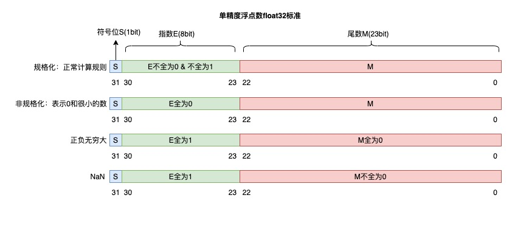

本文用于记录《深入学习计算机系统》中的知识点，以备查阅。

<!-- More -->

## 第二章 信息的表示和处理

字节顺序：大尾端（sun，sparc）和小尾端（x86，arm），看低地址放的是 MSB 字节还是 LSB 字节

位操作：`& | ～ ^ << >> >>>`

整数表示：

- 无符号：$\sum_{i = 0}^{w - 1}x_i * 2^i$​​​​，有符号：$-x_{w - 1}*2^{w - 1} + \sum_{i = 0}^{w - 2}x_i * 2^i$​​​ 

+ 无符号与有符号之间的变换：保持每个位不变，但是按照转换后的整数类型解释
+ 如果表达式中既有无符号整数，也有有符号整数，那么有符号整数会被解释成无符号整数（ux > -1）
+ 在判断表达式真假的时候，可以使用 0，-1，Tmin 等特殊值检验
+ 扩展：符号扩展，0 扩展
+ 截断：去掉最高的那些位
+ 除法：整数除法中由于截断，正整数结果趋近 0，负整数结果远离 0

浮点数表示：

+ IEEE 标准：采用 $(-1)^s M * 2^E$​ 表示，注意阶码偏移（单精度 127），隐含 1（E 全为 0 除外）

+ 单精度编码规则如下图：

  

  规格化时，此时 E = exp - bias，M 前缀 1，非规格化时，此时 E = -bias + 1，而不是 -bias，M 前缀 0

## 第三章 程序的机器级表示

C 语言程序通过编译器产生汇编文件，汇编文件通过汇编器产生二进制文件，二进制文件通过链接器产生可执行文件。

x86-64 寄存器：%rax，%rbx，%rcx，%rdx，%rdi，%rsi，%rbp，**%rsp**，%r8-%15

数据传输：`movq src, dst`，可以是立即数，寄存器，内存数据，但是 src 和 dst 不能同时是内存数据

内存寻址模式：(R)，D(R)，D(Rb, Ri, S)

地址计算指令：leaq，计算出新的地址，不改变条件码

算术指令：`op src, dst`，表示 dst = dst op src

条件码：

+ 种类：CF，ZF，SF，OF
+ 隐式设置：算术运算
+ 显式设置：cmpq 和 testq
+ 显式读取：setX dest，最低字节根据条件被设置为 0 或者 1，通常和 movzbl 一起使用

条件跳转：jmp，je(zero/equal)，jne，ja，jb，jg，jl，jge，jle

条件 mov：如 cmovle，可能对于三目运算符有副作用

循环：在汇编中，都是通过 jmp 和 label 构成

switch 语句：通过 jumtable 实现，但是如果是稀疏格式，则使用决策树格式（if-elseif-else）

x86-64 栈：向低地址区域增长，%rsp 指向栈顶

+ pushq src：%rsp -= 8，stack[%rsp] = src
+ popq dest：dest = stack[%rsp]，%rsp += 8

控制转移：

+ call label：返回地址压栈，jmp label
+ ret：返回地址出栈，jmp retaddr

数据转移：

+ 函数参数：前 6 个参数分别存储在 %rdi，%rsi，%rdx，%rcx，%r8，%r9；后面参数压栈
+ 返回值：%rax

局部参数：存储在栈中，注意对齐

对于每个函数，使用 Frame（帧）来进行数据管理，从而保证代码可重入，%rbp 用于指向上一个栈帧的位置，对于寄存器保护，一般由操作系统约定：

+ 调用者保存：%rax，参数寄存器，%r10，%r11，浮点数寄存器
+ 被调用者保存：%rbx, %r12, %r13, %r14, %r15，%rbp，%rsp

数组：一系列相同类型的数据，在内存中连续存储，多维数组和多级数组的区别

+ `int A1[3][5]` ：表示 3 * 5 的数据
+ `int *A2[3][5]` ：表示 3 * 5 的 int* 指针
+ `int (*A3)[3][5]` ：表示一个指向 3 * 5 数组的指针
+ `int *(A4[3][5])` ：表示 3 * 5 的 int* 指针
+ `int (*A5[3])[5]` ：表示指针数组，指针指向大小为 5 的数组

结构体：不同类型数据的组合，由编译器决定域的大小和位置，注意每个元素的对齐和整个结构体的对齐

浮点数：浮点数参数被存储在 %xmm0, %xmm1, ...%xmm7，返回值存储在 %xmm0

联合体：按照最大域分配，不同的域共用内存

缓冲区溢出：

+ 原因：主要源于对有界字符数组不加长度限制的写操作造成的
+ 类型：stack smashing attack，code injection attack
+ 措施：使用更加安全的库函数，随机化堆栈偏移量，不可执行代码段保护，Stack Canaries

## 第五章 代码优化

编译器在确保安全性的同时，尽最大可能进行优化，当面对不确定情况时，采用保守策略

通用优化方案：

+ 代码移动：在循环内不变的运算移动到外部，减少运算次数
+ Reduction in Strength：用简单高效计算代替复杂且计算量大的计算，如移位代替乘法
+ 公共(部分)子表达式重用：减少运算次数

优化障碍：

+ 过程调用：如将 strlen 放在循环条件中，将会重复计算，此时编译器不会优化，因为过程调用可能存在副作用，并且不是每次都返回相同的值
+ 别名问题：如矩阵相乘中内循环中每次都会涉及 C[i, j] 的存储和读取，此时编译器也不能优化，因为可能存在变量别名的问题，产生副作用

指令级并行：

+ CPE：操作向量元素性能的表达式，和实际时钟数 $T = CPE * n + overhead$ 
+ 流水线技术：不包括启动时间，加法流水线将会在每个周期产生一个结果
+ 寄存器重命名技术：在硬件资源充足的时候，可以找出对应的关键路径
+ 循环展开：在单个循环中执行多次循环中的语句，发掘并行基础

数据级并行：使用 SIMD 指令

分支预测：

+ taken：跳转到分支目标地址
+ not taken：顺序执行下一条指令

## 第六章 存储器层次结构

主存操作：

+ 读操作：通过总线发送读取地址，传送数据到总线上，CPU 读取数据
+ 写操作：通过总线发送写入地址，主存接受数据，写入数据到主存中

RAM：

+ 类型：SRAM 和 DRAM，前者速度更快，用于 Cache 中，后者更加便宜，用于主存中
+ DRAM 读取：RAS 选择一行数据转存到 row buffer 中，CAS 选择一列数据送到总线上，row buffer 回写用于刷新

局部性原理：用于平衡主存和 CPU 之间的延迟，分为时间局部性，空间局部性

存储层次结构：金字塔型结构，顶部速度快，但是价格贵，底部速度慢，但是便宜

缓存：

+ 组织结构：（S，E，B），直接映射 E = 1，多路组相联 E > 1，[tag index, set index, offset]
+ 读块：通过 set index 找到对应的 set，通过 tag 对比和 valid，如果找到，进行偏移读取，否则失效
+ 失效类型：Cold miss，Conflict miss，Capacity miss
+ 替换策略：随机，LRU，LFU
+ 写块：Write-through + No-write-allocate 或者 Write-back + Write-allocate
  + 写命中时：write-through，write-back
  + 写失效时：write-allocate，no-write-allocate
+ 平均访问时间：hit rate * hit time + miss rate * miss time
+ 矩阵乘法分析：
  + 循环置换：A 点乘 B 行向量，得到 C 行向量，此时 miss 次数最少
  + 分块：每个小块的 miss 次数变小，每个小矩阵的 miss 次数是 $B^2/8$ 

其他存储介质：

+ NVM：非易失内存，掉电仍然保存数据，写次数较为有限
+ 磁盘：访问延迟（寻道 + 旋转 + 传输），逻辑块到磁盘扇区的转换
+ SSD：相较于磁盘，没有机械移动装置，更快，但是写次数存在上限

## 第七章 链接

动机：应用程序的模块化和高效化构建

链接器功能：符号解析和重定位

符号解析：

+ 类别：强符号指代函数名和初始化过的全局变量，弱符号指代未初始化的全局变量
+ 规则：
  + 链接器不进行类型检查
  + 不允许多个同名的强符号定义
  + 如果有多个弱符号和一个强符号定义，则选择强符号定义
  + 如果仅有多个同名的弱符号，则从中任选一个弱符号定义
+ 避免类型错误匹配
  + 尽可能避免使用全局变量
  + 在头文件中声明所有非静态变量或函数
  + 将 extern 全局符号声明放在头文件的声明中

重定位：将符号的相对引用方式定位到可执行文件中的绝对内存位置

库文件打包：

+ 静态链接库：.a 文件，需要注意 gcc 命令的顺序，可以将所有库文件放在末尾
+ 动态链接库：.so 文件，既可以加载时链接，也可以在运行时链接，库文件可被多个进程共享

PIC：库文件可以在任何地址加载和执行，而不需要被链接器重定位

库插桩技术：允许程序员拦截对任意函数的调用，可以增强安全性，增强代码调试能力，可以在编译时，链接时和运行时进行

## 第八章 异常控制流

异常控制流：

+ 底层机制：异常
+ 高层机制：进程上下文切换，Signals，Nonlocal jumps

异常：为了响应某些事件而将控制权转移到操作系统，通过中断向量获取到处理代码的起始地址

+ Interrupts：由处理器外部事件引起的，如 timer，IO 中断
+ Traps： system calls，breakpoint traps
+ Faults：page faults，protection faults，可能会重新执行产生错误的指令
+ Aborts：illegal instruction，parity error，machine check

进程：正在运行的程序

+ 抽象：CPU 独占（context switching），内存独占（虚拟内存）
+ 并发执行指的是多个进程的控制流有重叠，否则便是顺序执行
+ 进程控制：
  + 获取进程 ID：getpid，getppid
  + 终止进程：exit，exit 被调用一次，不会返回
  + 创建进程：fork，fork 被调用一次，但是返回两次，写操作采用 COW，共享打开的文件
  + 回收子进程：wait，waitpid，如果父进程没有回收子进程，子进程最终会被 init 进程回收
  + 加载并运行进程：execve，调用一次，不会返回（没有错误）

Signals：内核通过更新目标进程上下文中的一些状态向目标进程(传递)一个 Signal，目标进程根据 Signal 类型采取某些反应，如 Ignore，Terminate，Catch，内核通过设置 signal mask 中相应的进行传递，可以通过 signal 函数定义 signal handler，handler 可以被其他的 handler 打断

Nonlocal jumps：强大(但危险)的用户级机制，用于将控制转移到任意位置，通过 setjmp/longjmp 实现，setjmp 被调用一次，可能返回多次

