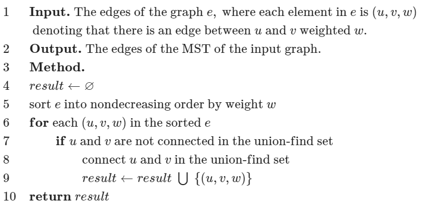
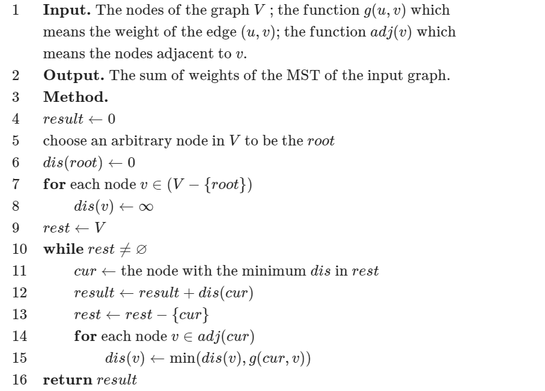
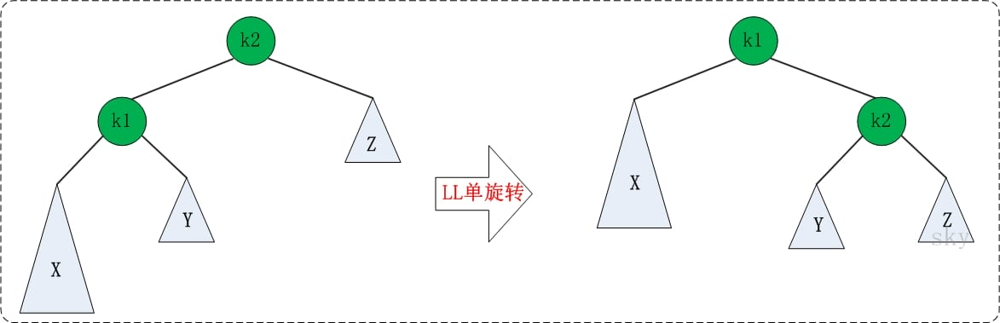
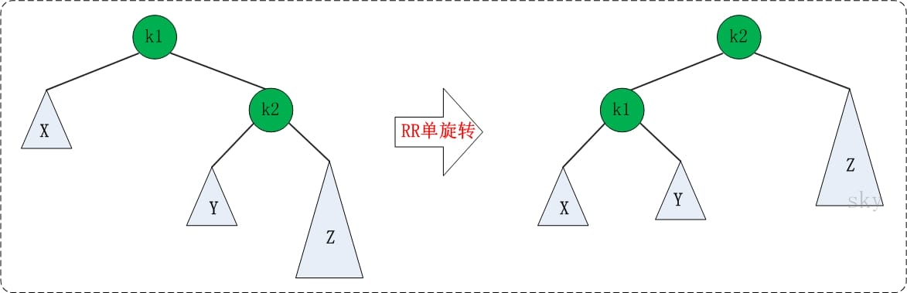
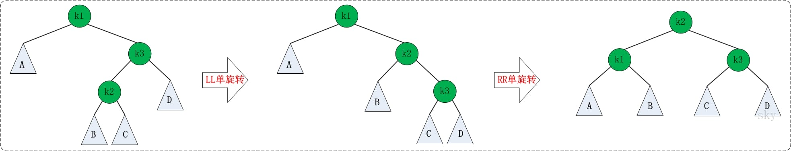
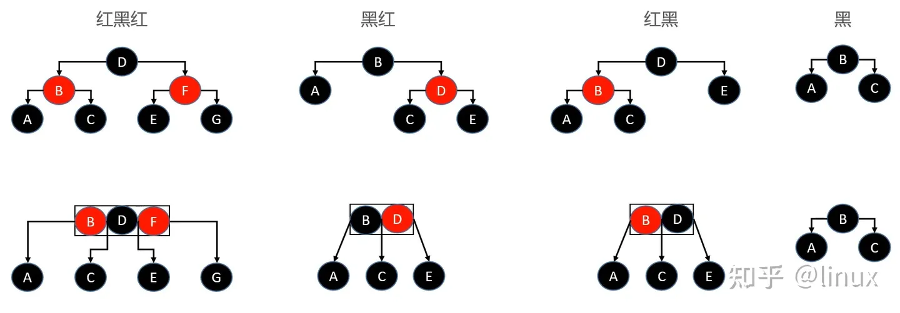
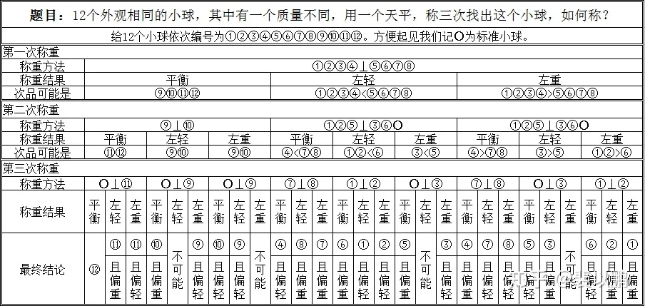
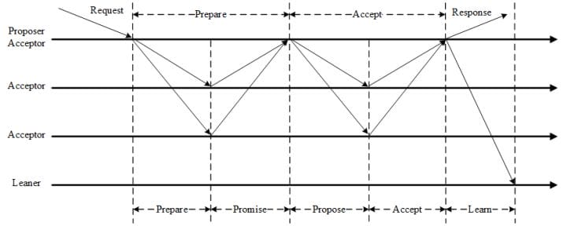

本文用于在算法学习过程中，总结相关算法套路以及算法编写经验，以备查阅。

<!-- More -->


## 算法复杂度及其分析

算法复杂度表示方法：

+ $O$：表示算法的渐进上界
+ $\Omega$：表示算法的渐进下界
+ $\Theta$：表示算法的渐进紧确界

递归算法复杂度分析：

+ 递归树方法：节点的总个数就是这个算法的时间复杂度

+ 代入检测法：猜测时间复杂度，然后代入看是否满足题意，最后归纳总结

+ 差分方程法：首先计算出对应的齐次方程解，然后代入初始值求解常数项目

+ 主方法：令 $a \ge 1, b > 1$ 是常数，$f(n)$​ 是一个函数，T(n) 是非负整数上的递推式：
    $$
    T(n) = aT(\frac{n}{b}) + f(n)
    $$
    T(n) 有以下方法紧确界：

    + 如果存在 $\epsilon > 0$，使得 $f(n) = O(n^{log_ba - \epsilon})$，则 $T(n) = \Theta(n^{log_ba})$   
    + 如果 $f(n) = O(n^{log_ba})$，则 $T(n) = \Theta(n^{log_ba}lgn)$  
    + 如果存在 $\epsilon > 0$，使得 $f(n) = O(n^{log_ba + \epsilon})$，并且存在 $c < 1$ 和足够大的 n，满足 $af(n/b) \le  cf(n)$，则 $T(n) = \Theta(f(n))$   


## 排序算法

常见排序算法：

|   名称   |    平均复杂度    |   最坏复杂度    | 原地算法 | 是否稳定 |
| :------: | :--------------: | :-------------: | :------: | :------: |
| 冒泡排序 |  $\Theta(n^2)$   |  $\Theta(n^2)$  |   原地   |   稳定   |
| 插入排序 |  $\Theta(n^2)$   |  $\Theta(n^2)$  |   原地   |   稳定   |
| 选择排序 |  $\Theta(n^2)$   |  $\Theta(n^2)$  |   原地   |  不稳定  |
| 归并排序 |  $\Theta(nlgn)$  | $\Theta(nlgn)$  |   O(n)   |   稳定   |
| 快速排序 |  $\Theta(nlgn)$  |  $\Theta(n^2)$  |   原地   |  不稳定  |
|  堆排序  |  $\Theta(nlgn)$  | $\Theta(nlgn)$  |   原地   |  不稳定  |
| 希尔排序 |  $\Theta(nlgn)$  | $O(n^s), 1<s<2$ |   原地   |  不稳定  |
| 计数排序 |  $\Theta(k+n)$   |                 |  非原地  |   稳定   |
|  桶排序  |  $\Theta(k+n)$   |                 |  非原地  |   稳定   |
| 基数排序 | $\Theta(d(k+n))$ |                 |  非原地  |   稳定   |


## 数据结构

基本数据结构：

+ 数组：存取速度快；插入删除元素效率低下，需要大块连续的内存块
+ 链表：插入删除操作快，不需要大块连续的空间；访问操作慢

扩展数据结构：

+ 散列表：使用哈希函数进行位置索引，快速查找，冲突处理有链接法，开放寻址法

+ 队列：FIFO 结构，变体如单调队列，主要用于处理滑动窗口最大值最小值问题

+ 栈：FILO 结构，变体如单调栈，可以找到第一个小于大于当前元素的数字，如接雨水

+ 树：
  + 遍历方式：先序遍历，中序遍历，后序遍历，层次遍历
  + 遍历方式：BFS + DFS
  + 动态查找树：
    + 二叉搜索树（BST）：左子树中的值都小于根节点，右子树中的值都大于根节点
    + 平衡二叉树（AVT）：解决 BST 退化成链表的问题，保证左右子树高度差小于 1 
    + 红黑树：降低 AVT 插入和删除的旋转开销，调整为最长路径不超过最短路径的二倍
    + 哈夫曼树：带权路径长度最短的二叉树，主要用于编码
  + 多路查找树：
    + Trie 树：常用于前缀匹配中，词频统计
    + B 树：常用于文件磁盘系统
    + B+ 树：只有叶子节点才存储真实数据，用于 MySQL 索引，降低 IO 开销
    + R 树：空间数据存储的树状数据结构
  
+ 堆：通常看作是一棵完全二叉树的数组对象，插入时采用上浮，删除时采用下沉操作

+ 图：
  + 图的存储结构：邻接矩阵，邻接链表
  
  + 遍历方式：BFS + DFS
  
  + 拓扑排序：需要统计入度，只有入度为 0 的节点才能进入队列，并且更新邻接点入度
  
  + 并查集：使用数组表示每个节点的根节点，用于两个节点间的连通性判断
  
  + 二分图：使用着色法进行 dfs 即可，状态有未着色，着色 A，着色 B
  
  + 最短路径：
    + Dijkstra 算法：单源最短路径算法，不能处理带有负权边的图，每次选择距离源点最小的，并且更新剩余节点
    
      ```cpp
      for (int i = 0; i < n; i++) { // n 次循环
          int u = -1, min = inf;
          for (int j = 0; j < n; j++) { // 找到最小路径顶点
              if (!vis[j] && distance[j] < min) {
                  u = j; min = distance[j];
              }
          }
          vis[u] = true;
          for (auto e : edges[u]) { // 松弛操作
              int v = ed.v, w = ed.w;
              if (dis[v] > dis[u] + w) dis[v] = dis[u] + w;
          }
      }
      ```
    
    + Bellman-Ford 算法：单源最短路径算法，可处理带有负权边的图，主要通过松弛操作实现，通过松弛 flag 判断提前退出循环
    
      ```cpp
      for (int i = 0; i < n; i++) {
          for (int j = 0; j < n; j++) {
              for (auto e : edges[j]) {
                  int v = ed.v, w = ed.w;
                  if (dis[v] > dis[j] + w) {
                    	dis[v] = dis[j] + w;
                  }
              }
          }
      }
      ```
    
    + Floyd 算法：计算所有点到所有点的最短路径的算法，相当于将每个点当作是中转站，可以存在负边，但是不能存在负环。定义 f[k, x, y] 只允许经过 1 到 k 个节点中 x 到 y 的最短路，通过 3 重循环即可
    
      ```cpp
      for (k = 1; k <= n; k++) {
        for (x = 1; x <= n; x++) {
          for (y = 1; y <= n; y++) {
            f[k][x][y] = min(f[k - 1][x][y], f[k - 1][x][k] + f[k - 1][k][y]);
          }
        }
      }
      ```
    
  + 最小生成树：
    + Kruskal 算法：加边法，每次都挑选最小权值的边，并且该边属于两棵树。适用于稀疏图
    
      
    
    + Prim 算法：加点法，从某个点开始，每次挑选树外最小权值的边对应的顶点，并且更新树外其他顶点到树中顶点的最小距离。适用于稠密图
    
      

二叉搜索树：

+ 前驱节点：左子树最大值，向左走一步，再一直向右走
+ 后继节点：右子树最小值，先右走一步，再一直向左走

平衡二叉树：

+ 旋转：

  + LL 旋转：

    

  + RR 旋转：

    

  + LR 旋转：转化为 LL 不平衡形式

    

  + RL 旋转：转化为 RR 不平衡形式

    

红黑树：

+ 性质：
  + 每个节点颜色或者红色，或者黑色
  + 根节点是黑色的，NULL 节点也是黑色的
  + 如果一个节点是红色的，那么它的两个子节点就是黑色的
  + 对于每个节点，从该节点到其后代叶节点的简单路径上，均包含相同数目的黑色节点
  
+ 应用场景：
  + Java HashMap & TreeMap
  + C++ STL: map & set
  + linux 进程调度 Completely Fair Scheduler，用红黑树管理进程控制块
  + epoll 在内核中的实现，用红黑树管理事件块
  + nginx 中，用红黑树管理 timer 等
  
+ 深入理解：实际上，红黑树和 4 阶B树（最多 4 个子指针）是等价的，黑色节点与它的红色子节点融合在一起，形成1个B树节点

  

+ 和平衡二叉树的区别：平衡二叉树平衡标准较为严格，每个左右子树的高度差不超过 1；而红黑树平衡标准比较宽松：没有一条路径会大于其他路径的 2 倍。


## 算法思想

分治：将问题划分为互不相交的小问题，递归地解决小问题，再进行组合来解决原问题

动态规划：和分治类似，不过其应用于具有重叠子问题的情况，关键在于找到递归解定义，然后使用备忘录或者自底向上方法进行解决

贪心算法：和动态规划类似，不过其在解决问题的过程中，每一步都选择最优解，即小问题的最优解构成了大问题的最优解

二分法：分治思想的一种，要求原数据是按照关键字有序的

搜索算法：

+ BFS：使用队列辅助，一层一层搜索，可用于边权相同的最短路径长度
+ DFS：通常使用递归方式实现，可以用于可达性问题
  + 回溯：当前路径不可达时，返回上层，再次进行 DFS

相关问题：

+ P 类问题：可在多项式时间里解决的问题

+ NP 类问题：可在多项式里猜出(验证)一个解的问题，**显然 P 问题一定是 NP 问题**

+ NPC 问题：存在一个NP问题，使得所有的该类NP问题都可以**多项式时间地规约** 为NPC问题。根据规约的传递性，对NP问题进行一层接一层地规约，最终可以得到一个足够泛化的NP问题，即NPC问题。由此可知 NPC 问题一定是 NP 问题

+ NPH 问题：满足 NPC 问题定义中的由 NP 通过规约的条件，但是它本身未必是一个 NP 问题

  


## 领域算法

安全算法：

+ 摘要算法：用在数字签名上，能够产生长度相同的消息摘要，相关算法有 MD5，SHA 系列算法
+ 加密算法：将普通的文本和一串数字（密钥）进行结合，产生不可理解的密文的步骤
  + 对称加密算法：加密密钥和解密密钥相同，如 DES 算法
  + 非对称加密算法：加密密钥和解密密钥不同，称为公开密钥和私有密钥，如 RSA 算法

字符串匹配算法：指在文本 T[1..n] 中找到模式 P[1..m] 出现位置的算法，通常包括预处理和匹配两个步骤

+ 朴素算法：时间复杂度为 $O((n - m + 1)*m)$ 
+ KMP 算法：在每次匹配失败的时候，会根据最大共同前缀和后缀来重新进行匹配
  + next 表：next[i] 表示 P[1..i] 中最大相同前缀和后缀的长度，便于匹配失败的时候进行移动
  + 匹配失败：根据 next 表选择下一个进行匹配的索引
+ BM 算法：和 KMP 算法类似，需要预先处理模式串，预先生成"坏字符规则之向后位移表"和"好后缀规则之向后位移表"，并且其匹配规则是从模式串后面向前进行匹配的，每次匹配失败时，根据位移表进行移动即可

大数据处理：

+ 分治/hash/排序：基本思路便是分而治之/Hash映射 + Hash_map 统计 + 堆/快速/归并排序
+ 布隆过滤器：高效判断元素是否存在的数据结构，存在误判可能，变体有计数布隆过滤器，支持删除
+ 外排序算法：位图排序法（不允许存在重复元素），多路归并排序
+ Map & Reduce：将任务进行划分，然后再将结果进行合并

分布式算法：

+ 一致性 Hash 算法：hash 环引入可以解决单调性（改变映射空间大小数据需要重新映射）的问题，虚拟节点引入则是为了解决数据倾斜的问题
+ Paxos 算法：一种基于消息传递的分布式一致性算法，角色分为 `提议者 (Proposer)`，`决策者 (Acceptor)` 和 `最终决策学习者 (Learner)`，相关变体有 Multi-Paxos，其是为了解决普通 Paxos 算法通行效率低下的问题
+ Raft 算法：从多副本状态机角度提出，用于管理多副本之间数据的一致性，角色分为 `领导者(Leader)`、`跟从者(Follower)` 和 `候选人(Candidate)`
+ ZAB 算法（Zookeeper Atomic Broadcast）：为分布式应用提供高效且可靠的分布式协调服务，支持崩溃恢复和原子广播
+ Snowflake 算法：分布式 ID 生成算法，按照划分空间的方式将 64bit 分割为不同部分，划分为 `1bit符号位-41bit时戳-10bit机器ID-12bit序列号` ，依赖于机器时钟，如果时钟回拨，只会简单抛出异常，可以考虑百度 `UidGenerator` 和美团分布式 ID 生成系统 `Leaf`


## 智力题

问题：5 个海盗抢得 100 枚金币后，讨论如何进行公正分配。他们商定的分配原则是:

+ (1)抽签确定各人的分配顺序号码(1，2，3，4，5)；
+ (2)由抽到1号签的海盗提出分配方案，然后5人进行表决，如果方案得到超过半数的人同意，就按照他的方案进行分配，否则就将1号扔进大海喂鲨鱼；
+ (3)如果1号被扔进大海，则由2号提出分配方案，然后由剩余的4人进行表决，当且仅当超过半数的人同意时，才会按照他的提案进行分配，否则也将被扔入大海；
+ (4)依此类推。

这里假设每一个海盗都是绝顶聪明而理性，他们都能够进行严密的逻辑推理，并能很理智的判断自身的得失，即能够在保住性命的前提下得到最多的金币。同时 还假设每一轮表决后的结果都能顺利得到执行，那么抽到1号的海盗应该提出怎样的分配方案才能使自己既不被扔进海里，又可以得到更多的金币呢？

解答：1:96 2:0 3:0 4:2 5:2 首先，当对3的方案表决时，4会支持3，因为否则的话他就要被5反对，从而死。 因此，如果1，2死了，3的方案肯定是100,0,0，并且一定会得到3和4的支持，此时4，5的收入为0，因此1，2可以贿赂4，5而得到支持。 同时3的期望收入为100，他必定会不顾一切地反对1，2。 而如果1死了，2的方案肯定是98，0，1，1，并且一定会通过。 所以1的最优方案为96，0，0，2，2，并且一定会通过。 其实98，0，0，1，1也可以，并且有可能通过(看4，5的心情和残忍程度而定)。


问题：1元钱一瓶汽水，喝完后两个空瓶换一瓶汽水，问: 你有20元钱，最多可以喝到几瓶汽水?

解答：40瓶 20->10->5 拿4瓶换两瓶，再换一瓶，这个空瓶与5-4那个空瓶一起再换一瓶, 借一个瓶再喝一瓶还一个瓶子。20+10+5+2+1+1+1=40；或者 1元 = 1瓶水 = 1瓶+ 1水 2瓶 = 1瓶水 = 1瓶+ 1水 =》 1元 = 2 水 =》 20元 = 40 水

> 本题关键在于能够借瓶子这一操作


问题：在临上刑场前，国王对预言家说: “你不是很会预言吗? 你怎么不能预言到你今天要被处死呢? 我给你一个机会，你可以预言一下今天我将如何处死你。你如果预言对了，我就让你服毒死；否则，我就绞死你。”

但是聪明的预言家的回答，使得国王无论如何也无法将他处死。 请问，他是如何预言的？

解答：“你不会毒死我的。”


问题：有 N 个小球，已知有 1 个小球比其他小球偏重，使用天平，最少要多少次才能确保找到那个小球？（题干改成「偏轻」也可以）

解答：由于已知问题小球的轻重，我们只要每次各自把 1/3 数量（四舍五入）的小球放在天平两端，就可以确保把问题小球的范围缩小为原来的 1/3。这里不展开赘述。答案是 $\lceil log_3{N}  \rceil $。


问题：有 N 个小球，已知有 1 个小球和其他小球质量不同，使用天平，最少要多少次才能确保找到那个质量不同的小球（无需知道它的轻重）？

解答：答案是 $\lceil log_3{(2N + 1)}  \rceil $。




问题：N个人要晚上过桥，在任何时候最多两个人一组过桥，每组要有一只手电筒。在这N个人中只有一个手电筒能用，因此要安排以某种往返的方式来返还手电筒，使得所有人过桥时间最短。

解答：具体有两种方案：

+ 让第1个人分别带第n-1个人和第n个人过桥：cost[n-1]+cost[n]+2*cost[1]
+ 让第1个人和第2个人先过桥，然后第n和第n-1个人再过桥：cost[n]+cost[1]+2*cost[2]

只需要在每次选择中，选择上述两种方案中的一种即可。


问题：有 25 匹马和 5 条赛道，赛马过程无法进行计时，只能知道相对快慢。问最少需要几场赛马可以知道前 3 名。

解答：先把 25 匹马分成 5 组，进行 5 场赛马，得到每组的排名。再将每组的第 1 名选出，进行 1 场赛马，按照这场的排名将 5 组先后标为 A、B、C、D、E。可以知道，A 组的第 1 名就是所有 25 匹马的第 1 名。而第 2、3 名只可能在 A 组的 2、3 名，B 组的第 1、2 名，和 C 组的第 1 名，总共 5 匹马，让这 5 匹马再进行 1 场赛马，前两名就是第 2、3 名。所以总共是 5+1+1=7 场赛马。


问题：有 20 瓶药丸，其中 19 瓶药丸质量相同为 1 克，剩下一瓶药丸质量为 1.1 克。瓶子中有无数个药丸。要求用一次天平找出药丸质量 1.1 克的药瓶。

解答：可以从药丸的数量上来制造差异：从第 i 瓶药丸中取出 i 个药丸，然后一起称重。可以知道，如果第 i 瓶药丸重 1.1 克/粒，那么称重结果就会比正常情况下重 0.1 * i 克。


问题：一栋楼有 100 层，在第 N 层或者更高扔鸡蛋会破，而第 N 层往下则不会。给 2 个鸡蛋，求 N，要求最差的情况下扔鸡蛋的次数最少。

解答：可以将楼层划分成多个区间，第一个鸡蛋 E1 用来确定 N 属于哪个区间，第二个鸡蛋 E2 按顺序遍历该区间找到 N。那么问题就转换为怎么划分区间满足最坏情况下扔鸡蛋次数最少。
E1 需要从第一个区间开始遍历到最后一个区间。如果按等大小的方式划分区间，即 E2 的遍历次数固定。那么最坏的情况是 N 在最后一个区间，此时 E1 遍历的次数最多。为了使最坏情况下 E1 和 E2 总共遍历的次数比较少，那么后面的区间大小要比前面的区间更小。具体来说，E1 每多遍历一次，E2 要少遍历一次，才使得 N 无论在哪个区间，总共遍历的次数一样。设第一个区间大小为 X，那么第二个区间的大小为 X-1，以此类推。那么 X + (X-1) + (X-2) + … + 1 = 100，得到 X (X + 1) / 2 = 100 ，即 X = 14。我们先从14层开始，然后是27层，接着是39层，依此类推，最差情况下鸡蛋要扔14次。


问题：一硬币，一面向上概率0.7，一面0.3，如何公平？

解答：抛两次， 正反 A胜， 反正 B胜。


问题：1000瓶药水，1瓶有毒药，服用后一小时毒发，毒药可以无限稀释，那么一小时内用几只小白鼠能够找出毒药？

解答：每个小白鼠编上号码，喝对应 bit 上为 1 的混合毒药，看小白鼠是否中毒，因此需要 10 只小白鼠。


问题：如果可以测两轮，那么可以测多少瓶水中的一瓶毒药？

解答：首先是第一轮死掉的小鼠不能被replace的情况，小鼠有三种状态，第一轮死，第二轮死，和两轮都没死，那么三种状态可以类比为3进制，小鼠的量程为3^10即59049瓶，具体操作方式为对编码为2的位数，第二轮混合喂。然后是第一轮死掉的小鼠可以被replace的情况，将每1024瓶混合为1滴做第一轮，选定组别后第二轮确定瓶子编码，量程为2^10 * 2^10即1048576瓶。对不能replace的N轮，量程为（N+1）^10，能replace的N轮，量程为2^(10*N)。


问题：如果1000瓶里有2瓶毒药，需要多少只小鼠？

解答：1000瓶里1瓶毒药有1000种可能性，而1000瓶2瓶毒药则有C(1000,2)，即499500种可能性，那么log2(499500) 为18.93，即需要19只小鼠。具体实现方式为以两两混合法将1000瓶拆成499500滴，并用题目1中的方法测得。


问题：有16瓶水1瓶有毒，用多少只小白鼠能测出14瓶无毒的水？

解答：将16瓶药水用二进制XXXX表示，取3只小白鼠来测，测出的状态为XXX，那么毒在XXX0或XXX1中，剩下14瓶无毒。


问题：30枚面值不全相同的硬币摆成一排，甲、乙两个人轮流选择这排硬币的其中一端，并取走最外边的那枚硬币。如果你先取硬币，能保证得到的钱不会比对手少吗？

解答：先取者可以让自己总是取奇数位置上的硬币或者总是取偶数位置上的硬币。数一数是奇数位置上的面值总和多还是偶数位置上的面值总和多，然后总是取这些位置上的硬币就可以了。


问题：有7克、2克砝码各一个，天平一只，如何只用这些物品五次内将140克的盐分成50、90克各一份？

解答：第一次：先分成70和70
第二次：通过7和2砝码将70分成9和61
第三次：通过9克盐和2砝码将61分成50和11


问题：你有两个罐子，每个罐子各有若干红色弹球和蓝色弹球，两个罐子共有50个红色弹球，50个蓝色弹球，随机选出一个罐子，随机从中选取出一个弹球，要使取出的是红球的概率最大，一开始两个罐子应放几个红球，几个蓝球？在你的计划中，得到红球的准确几率是多少？

解答：一个罐子放1红，一个罐子放49红和50蓝，这样得到红球的概率接近3/4。


问题：54张扑克牌，其中有十张是翻过来的。现在把你的眼睛蒙上，让你把扑克牌分成两叠（两叠的多少可以不一样）。要求在两叠中翻过来的扑克牌是相等的。请问该怎么做？

解答：第一步，你在这54张牌中任意取出10张，现在，扑克牌分成了两叠。44张和10张；第二步，44张那叠不动，将10张这叠每张都翻过来，便得到了符合条件的两叠牌。
解释：第一步之后，设44张那叠中正面牌x张，10张那叠中正面牌则为10-x张。第二步之后，44张那叠中正面牌保持x张，10张那叠反过来了：反面牌为10-x张，正面牌x张。


问题：1，11，21，1211，111221，下一个数是什么？

解答：下行是对上一行的解释 所以新的应该是3个1 2个2 1个1 ：312211。


问题：3个箱子里面放了 苹果，梨子，苹果加梨子，标签全错误，只能选择查看一箱的水果来改正所有标签

解答：查看贴苹果和梨标签那一个，如果拿出来的是苹果，代表这一箱只有苹果，因为如果是苹果和梨就代表标签没错了。那么剩下的两箱就是梨，苹果和梨，剩下的标签是梨，苹果，由于标签全错，所以贴着苹果的是梨，贴着梨的是苹果和梨。
如果拿出来的是梨，同理代表这一箱只有梨。那么剩下的两箱就是苹果，苹果和梨，剩下的标签就是苹果，梨。由于标签全错，贴着苹果的就是苹果和梨，贴着梨的就是苹果。


问题：某种药方要求非常严格，你每天需要同时服用A、B两种药片各一颗，不能多也不能少。这种药非常贵，你不希望有任何一点的浪费。一天，你打开装药片A的药瓶，倒出一粒药片放在手心；然后打开另一个药瓶，但不小心倒出了两粒药片。现在，你手心上有一颗药片A，两颗药片B，并且你无法区别哪个是A，哪个是B。你如何才能严格遵循药方服用药片，并且不能有任何的浪费？

解答：把手上的三片药各自切成两半，分成两堆摆放。再取出一粒药片A，也把它切成两半，然后在每一堆里加上半片的A。现在，每一堆药片恰好包含两个半片的A和两个半片的B。一天服用其中一堆即可。


问题：如何用一枚硬币等概率地产生一个1到3之间的随机整数？如果这枚硬币是不公正的呢？

解答：如果是公正的硬币，则投掷两次，“正反”为1，“反正”为2，“正正”为3，“反反”重来。
如果是不公正的硬币，注意到出现“正反”和“反正”的概率一样，因此令“正反反正”、“反正正反”、“正反正反”分别为1、2、3，其余情况重来。另一种更妙的办法是，投掷三次硬币，“正反反”为1，“反正反”为2，“反反正”为3，其余情况重来。


问题：在房里有三盏灯，房外有三个开关，在房外看不见房内的情况，你只能进门一次，你用什么方法来区分那个开关控制那一盏灯？

解答：打开一个开关。过10分钟后关掉开关，并打开另一个开关。进屋确认可知：
亮的灯是由第二次打开的开关控制；
摸上去发热的不发亮的灯是由第一次打开的开关控制
剩下的第三盏灯是由未操作过的开关控制。


问题：盲人都各自买了两对黑袜和两对白袜，八对袜了的布质、大小完全相同，而每对袜了都有一张商标纸连着。两位盲人不小心将八对袜了混在一起。 他们每人怎样才能取回黑袜和白袜各两对呢？

解答：每一对分开，一人拿一只，因为袜子不分左右脚。


问题：圆桌，两个人，轮流放硬币，不能重叠，半径为1，某一方不能放下去，则为输。问先手赢 后手赢。

解答：先手赢。圆桌对称，先手放一个，后手都能找到对称的位置放，但是除了圆心。


问题：100本书,两个人轮流拿,每次拿1~5本,你先拿,有没有啥策略可以保证你可以拿到最后一本书?
解答：第一次拿4个,之后对方1个,我拿5个,对方拿2个,我拿3个,总是对方拿n个,我拿6-n个.
因为第一次以后剩下96个,每次使得两个人拿的总数是6,那么最后就是我拿的


## 分布式系统

分布式系统面临的问题：

+ 缺乏全局时钟：很难定义两个事件究竟谁先谁后，物理时钟会发生偏移，通常配合逻辑时钟一起使用
+ 网络异常：如出现网络分区，消息乱序（序列号）等
+ 机器宕机：机器因故障下线，可以提供哨兵服务（Redis 采用）
+ 存储数据丢失：对于有状态节点来说，数据丢失意味着状态丢失，通常只能从其他节点读取、恢复存储的状态，实际使用中采用多副本的方式进行规避

分布式系统的衡量指标：

+ 性能：一般以吞吐率作为衡量标准
+ 可用性：指系统在面对各种异常时可以正确提供服务的能力
+ 可扩展性：分布式系统通过扩展集群机器规模提高系统性能，追求线性扩展性
+ 一致性：副本会提高可用性，但是会带来数据一致性的问题

CAP 理论：

+ 内容：CAP 理论是分布式系统、特别是分布式存储领域中被讨论的最多的理论。其中 C 代表一致性 (Consistency)，A 代表可用性 (Availability)，P 代表分区容错性 (Partition tolerance)。CAP 理论告诉我们C、A、P三者不能同时满足，最多只能满足其中两个。但是 CAP 理论的作者对此提出了质疑，因为如果选择了 AP 分布式模型，可用性虽然不能达到 100%，但是可以达到 99.999%。
+ 理解：考虑两个副本处于网络分区的两侧，即两个副本不能通信：
  + 如果允许其中一个副本更新，则会导致数据不一致，即丧失了 C 性质。
  + 如果为了保证一致性，将分区某一侧的副本设置为不可用，那么又丧失了 A 性质。
  + 除非两个副本可以互相通信，才能既保证 C 又保证 A，这又会导致丧失 P 性质。

BASE 理论（Basically Available, Soft state, Eventually consistent）：

+ 内容：BASE 理论是对 CAP 理论的延伸，核心思想是即使无法做到强一致性，可以做到最终一致性。实际上是对 AP 方案的一个补充，通过牺牲一致性而获得可用性。
+ 理解：软状态即允许系统在不同节点的数据副本之间进行数据同步的过程存在延时；基本可用表示分布式系统在出现不可预知故障的时候，允许损失部分可用性。

一致性 Hash 算法：

+ 背景：为了负载均衡，传统的哈希算法通常采用哈希取模的方式，这个时候如果新增或者删除机器，会导致很多原有的数据需要重新映射，代价较大
+ 目的：一致性哈希算法就是为了解决传统哈希方式的不足，具体而言，其采用哈希环，通过将机器映射到哈希环上，对于某个映射到环上的键，需要将其顺时针移动，找到对应的机器节点即可，说明该数据位于该机器节点上
+ 问题：当某个机器下线的时候，会导致本该映射到该机器节点上的键值对顺序转移到下一个机器节点上，如果节点数目较小，可能就会导致下一个发生宕机，引发雪崩
+ 解决方案：引入机器节点的虚拟节点，这样发生问题的时候，就可以让在线机器分摊宕机节点的数据访问

Basic Paxos 算法：

+ 背景：主要为了解决分布式系统中的一致性问题，即一个分布式系统各个进程如何就某个值（决议）达成一致

+ 主要角色：

  + Proposer：提议者，提出提案，其中包含提案的 ID 和值（value）
  + Acceptor：决策者，参与决策，回复 Proposer 的提案，Proposer 只需要收到大多数决议者的接收即可
  + Learner：不参与决策，从提议者/参与者学习最新达成一致的提案（value）

  注意，在多副本状态机中，每个副本同时具有 Proposer、Acceptor、Learner 三种角色。

+ 3 个阶段：

  

  + Prepare 阶段：
    + Prepare：Proposer 生成全局唯一且递增的 Proposal ID (可使用时间戳加Server ID)，向所有Acceptors 发送 Prepare 请求，这里无需携带提案内容，只携带 Proposal ID 即可
    + Promise：Acceptors 收到 Prepare 请求后，做出“两个承诺，一个应答”
      + 承诺1: 不再接受 Proposal ID 小于等于(注意: 这里是<= )当前请求的 Prepare 请求;
      + 承诺2: 不再接受 Proposal ID 小于(注意: 这里是< )当前请求的 Propose 请求;
      + 应答: 不违背以前作出的承诺下，回复已经 Accept 过的提案中 Proposal ID 最大的那个提案的 Value 和 Proposal ID，没有则返回空值。
  + Accept 阶段：
    + Propose：Proposer 收到多数 Acceptors 的 Promise 应答后，从应答中选择Proposal ID最大的提案的Value，作为本次要发起的提案。如果所有应答的提案Value均为空值，则可以自己随意决定提案Value。然后携带当前Proposal ID，向所有Acceptors发送Propose请求。
    + Accept：Acceptor收到Propose请求后，在不违背自己之前作出的承诺下，接受并持久化当前Proposal ID和提案Value。
  + Learn 阶段：Proposer在收到多数Acceptors的Accept之后，标志着本次Accept成功，决议形成，将形成的决议发送给所有Learners。

Multi-Paxos 算法：

+ 背景：Basic Paxos 算法存在以下缺陷：

  + 减少网络开销：Basic Paxos 中，只能对一个值形成决议，每次至少需要两次网络往返（Prepare + Accept），存在较大的网络开销

  + 存在活锁：由于 Acceptor 接收到新的提案 ID 后，不会回复提案 ID 小于当前 ID 的 Propose 请求，导致一直重试，形成活锁

    

+ 主要角色：Leader（从 Proposer 中选出），Acceptor，Learner

+ 主要改变：

  + 针对每一个要确定的值，运行一次 Paxos 算法实例(Instance)，形成决议。每一个 Paxos 实例使用唯一的 Instance ID 标识。相当于每次都运行一次 Paxos 实例，其会尽量保证 leader 的 liveness
  + 在所有Proposers中选举一个Leader，由 Leader 唯一地提交 Proposal 给 Acceptors 进行表决。这样没有 Proposer 竞争，解决了活锁问题。同时，仅有一个 Leader 进行提交的情况下，可以省略 Prepare 阶段，从而将两阶段转变为一阶段（Accept），提高效率

  > 主要思想是多个 Paxos 算法串联起来，由于只有一个 Leader，如果 Leader 在一轮 Paxos 算法结束时还存在，就不需要重新选 Leader，也不需要 Prepare 阶段了

Raft 算法：

+ 背景：从多副本状态机的角度提出，用于管理多副本状态机的日志复制

+ 主要角色：

  + Leader：接受客户端请求，并向 Follower 同步请求日志；当日志同步到大多数节点上后告诉Follower 提交日志
  + Follower：接受并持久化 Leader 同步的日志，在 Leader 通知日志可以提交之后，提交日志
  + Candicate：Leader 选举过程中的临时角色

+ 子问题：

  + Leader 选举：Leader 向所有 Followers 周期性发送 heartbeat。如果 Follower 在选举超时时间内没有收到 Leader 的 heartbeat，就会等待一段随机的时间后发起一次 Leader 选举（拥有最新的已提交的log entry的Follower才有资格成为Leader）。Follower将其当前term加一然后转换为Candidate。它首先给自己投票并且给集群中的其他服务器发送 RequestVote RPC，只有当其赢得多数选票，才能成功成为 Leader

  + 日志同步：Leader把请求作为日志条目(Log entries)加入到它的日志中，然后并行的向其他服务器发起 AppendEntries RPC 来复制日志条目，当这条日志被复制到大多数服务器上，Leader将这条日志提交并向客户端返回执行结果。Raft 日志同步保证两点：

    + 如果不同日志中的两个条目有着相同的索引和任期号，则它们所存储的命令是相同的
    + 如果不同日志中的两个条目有着相同的索引和任期号，则它们之前的所有条目都是完全一样的

    第二点是通过 AppendEntries 的一个简单的一致性检查，当发送一个 AppendEntries RPC 时，Leader会把新日志条目紧接着之前的条目的log index和term都包含在里面。如果Follower没有在它的日志中找到log index和term都相同的日志，它就会拒绝新的日志条目。Leader会从后往前试，每次AppendEntries失败后尝试前一个日志条目，直到成功找到每个Follower的日志一致位点，然后向后逐条覆盖Followers在该位置之后的条目。

  + 日志压缩：Raft 采用对整个系统进行 snapshot 来解决，snapshot 之前的日志都可以丢弃。其主要包含日志元数据以及系统的当前状态。当 Leader 要发给某个日志落后太多的Follower的log entry被丢弃，Leader 会将 snapshot 发给 Follower。或者当新加进一台机器时，也会发送 snapshot 给它。发送 snapshot 使用 InstalledSnapshot RPC。

Raft 算法和 Multi-Paxos 算法的异同点：

+ 相同点：
  + Leader & Proposer
  + Term & Proposal ID
  + Log & Proposal Value
  + Log Index & Instance ID
  + RequestVote & Prepare 
  + AppendEntries & Accept
+ 不同点：
  + 领导者：Raft 中只允许存在一个 Leader，但是 Multi Paxos 允许存在多个
  + 领导者选举权：Raft 中具有最新提交的日志的副本才可以，Multi Paxos 则允许任意副本
  + 日志连续性：Raft 保证日志连续，Paxos 则允许存在空洞
  + 日志提交：推进 Commit Index，异步的 commit 消息

ZAB（Zookeeper Atomic Broadcast） 算法：

+ 背景：是为分布式协调服务 Zookeeper 专门设计的一种支持 崩溃恢复 和 原子广播 协议，基于该协议，Zookeeper 实现了一种 主备模式 的系统架构来保持集群中各个副本之间数据一致性。

+ 主要角色：Leader，Follower

+ 消息广播：类似一个 二阶段提交过程。对于客户端发送的写请求，全部由 Leader 接收，Leader 将请求封装成一个事务 Proposal，将其发送给所有 Follwer ，然后，根据所有 Follwer 的反馈，如果超过半数成功响应，则执行 commit 操作（先提交自己，再发送 commit 给所有 Follwer）。

  需要注意的是，Leader 在接收到客户端的请求之后，会将这个请求封装成事务，并且为该事务分配一个全局递增的 ID，称为 ZXID，其保证了事务的顺序。另外，在实际实现中，Leader 和 Follower 中间还存在着一个消息队列，用来进行解耦。

+ 崩溃恢复：假设 Leader 崩溃（指的是 Leader 失去与过半 Follwer 的联系，并非是 Leader 下线），就会根据 ZXID 选举出最大的 Leader，选举成功后将会开始进行数据同步。这样就能够保证这个新选举出来的 Leader 一定具有所有已经提交的提案，可以省去 Leader 服务器检查事务的提交和丢弃工作的这一步操作。

+ 数据同步：当崩溃恢复之后，需要在正式工作之前（接收客户端请求），Leader 服务器首先确认事务是否都已经被过半的 Follwer 提交了，即是否完成了数据同步，目的是为了保持数据一致。当 Follower 链接上 Leader 之后，Leader 服务器会根据自己服务器上最后被提交的 ZXID 和 Follower 上的 ZXID 进行比对，比对结果要么回滚，要么和 Leader 同步。

UUID（Universally Unique Identifier）：

+ 定义：通用唯一识别码，由一组 32 位数的 16 进制数字所构成
+ 产生方式：
  + 基于时间：通过当前时间，随机数，和本地 Mac 地址来计算出来，私密性不够好
  + 基于名字：通过计算名字和名字空间的散列值得到，可以通过 MD5 或者 SHA1 散列得到
  + 基于随机数：通过伪随机数生成UUID
+ 缺点：
  + 不宜存储：UUID 太长，16 字节 128 位，通常以长度 32 的字符串表示
  + 信息不安全：基于 MAC 地址生成 UUID 的算法可能会造成 MAC 地址泄露
  + 对 MySQL 索引不利：如果作为数据库主键，在 InnoDB 引擎下，UUID 的无序性可能会引起数据位置频繁变动，严重影响性能

UUID 生成方式：

+ 数据库生成：
  + 实现：通过利用相同 auto_increment_increment，不同 auto_increment_offset 实现
  + 缺点：依赖 DB，需要保证 DB 可用性；虽然主从复制可以提升可用性，但是可能会影响数据一致性；另外，ID发号性能瓶颈限制在单台MySQL的读写性能
+ 使用 Redis 实现：
  + 实现：主要是通过提供像 INCR 和 INCRBY 这样的自增原子命令，由于Redis自身的单线程的特点所以能保证生成的 ID 肯定是唯一有序的。可以通过集群来提升系统性能，消除单机存在得瓶颈
  + 缺点：引入了 Redis 组件，增加了系统得复杂性
+ Snowflake 算法（雪花算法，Twitter 开源）：
  + 实现：使用 64 bit 的数字，划分为 0bit 符号位（不用），41bit 时间戳，10bit 工作机器，12bit 序列号
  + 优点：生成的 ID 趋势递增，不依赖第三方数据库，以服务的方式部署，可以根据自身业务特性分配bit位，非常灵活
  + 缺点：强**依赖机器时钟**，如果机器上时钟回拨，会导致发号重复或者服务会处于不可用状态。如果恰巧回退前生成过一些ID，而时间回退后，生成的ID就有可能重复。官方对于此并没有给出解决方案，而是简单的抛错处理，这样会造成在时间被追回之前的这段时间服务不可用
+ UidGenarator（百度）：
  + 实现：
    + DefaultUidGenerator：就是正常的根据时间戳和机器位还有序列号的生成方式，和雪花算法很相似，对于时钟回拨也只是抛异常处理。仅有一些不同，如**以秒为为单位**而不再是毫秒和支持 Docker 等虚拟化环境。
    + CachedUidGenerator：采用双 RindBuffer 来缓存 UID 和 useFlag，提高性能，为了防止伪共享的发生，采用了 Padding 进行 CacheLine 对齐。RingBuffer 填充时机有初始化填充，阈值填充，周期填充等
  + 优点：CachedUidGenerator 性能更好，但是还是未处理时钟回拨问题
+ Leaf（美团）：
  + Leaf-segment：
    + 实现：对数据库方案的优化，原来每次只取一个 Uid，而现在每次取一个 segment 大小的 Uid，减少了对数据库的读写压力。通过采用双 Buffer 思想，在本次 Buffer 里面的 Uid 即将使用完全时，立即后台异步获取下一个 segment 大小的 Uid，并且将其放入另外一个 Buffer，此举可以大大降低尾时延
    + 缺点：仍然依赖 DB的稳定性，需要采用主从备份的方式提高 DB的可用性，还有 Leaf-segment方案生成的ID是趋势递增的，这样ID号是可被计算的，例如订单ID生成场景，通过订单id号相减就能大致计算出公司一天的订单量，这个是不能忍受的
  + Leaf-snowflake：
    + 实现：沿用 snowflake 方案的bit位设计，对于workerID的分配引入了Zookeeper持久顺序节点的特性自动对snowflake节点配置 wokerID。避免了服务规模较大时，动手配置成本太高的问题。
    + 时钟回拨问题：通过校验自身系统时间与 `leaf_forever/${self}`节点记录时间做比较然后启动报警的措施。美团官方建议是由于强依赖时钟，对时间的要求比较敏感，在机器工作时NTP同步也会造成秒级别的回退，建议可以直接关闭NTP同步。要么在时钟回拨的时候直接不提供服务直接返回ERROR_CODE，等时钟追上即可。或者做一层重试，然后上报报警系统，更或者是发现有时钟回拨之后自动摘除本身节点并报警。
+ Mist 算法（薄雾算法）：*超过snowflake 587倍的ID生成算法*
  + 实现：同样采用 64 bit，按照 1bit 符号位（不用），41bit 自增位，8bit 随机位，8bit 随机位构成。前面的自增位在高位能保证结果值呈递增态势，后面的随机位主要是使结果不可预测
  + 优点：不受时间回退影响，收到数值大小影响，但是理论上能够使用几百年；性能好；
  + Mist 算法是否存在重复：存在，程序重启会造成按序递增数值回到初始值，但由于中间位和末尾随机值的影响，因此不是必定生成（有大概率生成）重复 ID，但递增态势必定受到影响。尽管会重复，但在实际的应用当中，没有人会将全局唯一 ID 生成算法完全托付给程序，而是会用数据库存储关键值或者所有生成的值。全局唯一 ID 生成算法大多都采用分布式架构或者主备架构提供发号服务，这时候就不用担心它的重复问题

分布式锁的实现方案：

+ 基于数据库的实现：
  + 基于数据库表：首先创建一个锁表，然后在其中插入数据，插入的数据需要满足唯一性校验（防止其他用户对同一资源加锁）
  + 基于数据库表乐观锁：使用版本号实现，每次对数据进行更新后都对版本号加一，并且判断当前版本号是否是最新的版本号
  + 基于数据库悲观锁：需要关闭自动提交选项，加锁使用 `select for update`，解锁使用 `commit` 即可
  + 存在的问题：对数据库的依赖较大，如单点故障等；没有锁的失效时间，如果用户加锁后宕机，将导致不能解锁；可重入锁的实现存在问题
+ 基于 Redis：
  + Redis 实现：`set resource:lock locker-id NX PX 30000` ，LUA 脚本实现解锁，先判断是否是自己加锁，再来决定是否删除。单实例存在可用性的问题，集群方式在主从切换的时候容易发生锁数据的丢失问题，导致重复加锁，可能引发数据不一致的问题
  + RedLock 实现：分布式集群的情况下，部署多个集群，每次加锁和集群中的 Master 节点进行加锁，只有当获得大多数节点加锁成功和枷锁时间小于超时时间，才能算作是加锁成功，解锁的话采用对应的 LUA 脚本即可。存在问题有加锁和解锁会随着实例数量增加而降低，客户端无法感知到锁失效（在处理业务逻辑时锁超时失效），以及过期时间依赖系统时钟等。
  + 基于 Redis 的客户端：如 Jedis，Redssion 等，以 Redssion 为例，其所有指令都通过lua脚本执行，保证了操作的原子性；设置了 watchdog 看门狗，“看门狗”的逻辑保证了没有死锁发生（后台不断更新锁的过期时间，使得线程持续获得锁）；实现了可重入（通过 incrby 实现）。
  + 存在的问题：借助 Redis 实现分布式锁时，有一个共同的缺陷: 当获取锁被拒绝后，需要不断的循环，重新发送获取锁(创建key)的请求，直到请求成功。这就造成空转，浪费宝贵的 CPU 资源（满等待的问题）。
+ 基于 Zookeeper：
  + 排他锁：利用 zookeeper 的同级节点的唯一性特性，在需要获取排他锁时，所有的客户端试图通过调用 create() 接口，在 /exclusive_lock 节点下创建临时子节点 /exclusive_lock/lock，最终只有一个客户端能创建成功，那么此客户端就获得了分布式锁。同时，所有没有获取到锁的客户端可以在 /exclusive_lock 节点上注册一个子节点变更的 watcher 监听事件，以便重新争取获得锁。
  + 读写锁：客户端调用 create 方法创建临时顺序节点（也可以通过发号节点），调用 getChildren 获取所有已创建的子节点列表；判断是否获得锁，对于读请求如果所有比自己小的子节点都是读请求或者没有比自己序号小的子节点，表明已经成功获取共享锁，同时开始执行度逻辑。对于写请求，如果自己不是序号最小的子节点，那么就进入等待；如果没有获取到共享锁，读请求向比自己序号小的最后一个写请求节点注册 watcher 监听，写请求向比自己序号小的最后一个节点注册watcher 监听。
  + 优缺点：相较于 Redis，如果获取不到锁，不需要进行忙等待，节约 CPU 资源；ZK 涉及到写盘，不适合高并发下的场景


分布式缓存的实现方案：

+ 本地缓存：指的是在应用中的缓存组件，其最大的优点是应用和cache是在同一个进程内部，请求缓存非常快速，没有过多的网络开销等；但是缺点是因为缓存跟应用程序耦合，多个应用程序无法直接的共享缓存，各应用或集群的各节点都需要维护自己的单独缓存，对内存是一种浪费
+ 分布式缓存：指的是与应用分离的缓存组件或服务，其最大的优点是自身就是一个独立的应用，与本地应用隔离，多个应用可直接的共享缓存
+ memcached 缓存：memcached 集群实际上就是 memcached 服务器的堆积，数据划分采用的是一致性 Hash 算法，通过客户端程序库实现键的映射，其本身只支持 key-value 存储方式，数据格式较为简单。内存管理上，其每次申请 1M 的空间，称其为 slab，并且将其划分为大小相等合的 chunk 块，每次需要存放新的缓存对的时候，需要找到合适大小，空闲的 chunk，将其放入。注意，chunk 实际占用的内存需要增加 48B，用于记录元信息。总的来说，整个缓存都是基于内存的，因此响应时间是很快，不需要额外的序列化、反序列化的程序，但同时由于基于内存，数据没有持久化，集群故障重启数据无法恢复。高版本的 memcached 已经支持 CAS 模式的原子操作，可以低成本的解决并发控制问题。
+ redis 缓存：其是一种支持 key-value 等多种数据结构的存储系统，可用于缓存，事件发布或订阅，高速队列等场景。基于内存，可持久化。它可以存储键值对与5种不同类型的值之间的映射，可以将存储在内存的键值对数据持久化到硬盘，可以使用复制特性来扩展读性能，还可以使用客户端分片来扩展写性能。实现上，Redis 内部使用一个 redisObject 对象来标识所有的 key 和 value 数据，type 代表一个value对象具体是何种数据类型，encoding是不同数据类型在Redis内部的存储方式。Redis 采用哈希槽的方式来对数据进行映射。Redis还提供了一个Watch功能，你可以对一个key进行Watch，然后再执行Transactions，在这过程中，如果这个Watched的值进行了修改，那么这个Transactions会发现并拒绝执行。相较于 memcached，Redis 功能更强，支持如在主页中显示最新的项目列表，排行榜及相关问题，过期项目处理，计数，Pub/Sub，队列等功能。

分布式任务：

+ 单体应用定时任务：
  + cron + 脚本：Linux 下常用实现方案，语法 `Seconds Minutes Hours DayofMonth Month DayofWeek Year` 
  + JDK 内置 Timer：通过其提供的 schedule 和 scheduleAtFixedRate 方法，但是由于 Timer 底层使用的是单线程，所有任务都是串行执行，意味着同一时间只能有一个任务得到执行，而前一个任务的延迟或者异常会影响到之后的任务。
  + JDK 内置 ScheduleExecutorService：基于线程池实现，可以开启多个线程进行执行多个任务，每个任务开启一个线程； 这样任务的延迟和未处理异常就不会影响其它任务的执行了。
  + Netty 之 HashedWheelTimer：是一种环形的数据结构，就像一个时钟可以分成很多格子（Tick)，每个格子代表时间的间隔，它指向存储的具体任务的链表，只有当 Round 次数达到时，才开始执行对应的任务。其优点是任务的新增和取消都是 O(1) 时间复杂度，时间轮是一个高性能，低消耗的数据结构，它适合用非准实时，延迟的短平快任务，例如心跳检测。
  + Spring Tasks：通过 `@Scheduled` 注解进行配置
  + Quartz：纯java实现，可以作为独立的应用程序，也可以嵌入在另一个独立式应用程序运行；强大的调度功能，Spring默认的调度框架，灵活可配置；作业持久化，调度环境持久化机制，可以保存并恢复调度现场。系统关闭数据不会丢失；灵活的应用方式，可以任意定义触发器的调度时间表，支持任务和调度各种组合，组件式监听器、各种插件、线程池等功能，多种存储方式等；分布式和集群能力
+ 分布式任务的方案：Quartz Cluster，XXL-Job，Elastic-Job

分布式会话：

+ 单机：Session + Cookie，Session 是服务端存储的，会占用一定的资源，通常其会将 Session ID 通过 Cookie 传到客户端进行存储，每次发送请求的时候，携带上 Cookie，就能完成对用户身份的验证了

+ 分布式：

  + 在负载均衡侧 Session 粘滞：客户端的每次请求都转发至同一台服务器，这就需要负载均衡器能够根据每次请求的会话标识（SessionId）来进行请求转发。缺点是负载均衡节点变为一个有状态节点，不易横向扩展，并且容灾方面更加麻烦；另外，由于会话标识需要在应用层获取，因此，每次转发都需要进行应用层解析，代价较大（相较于根据 IP 映射）。

  + Session 同步：负载均衡器不用做更改，服务器需要通过同步来保证不同 Web 服务器之间 Session 数据的一致性。缺点是会造成额外的网络带宽的开销，每个服务器需要保存全部的 Session，内存开销也很大。

  + Session 集中存储：Web服务器本身则并不存储Session数据，而是通过专门存储 Session 节点进行存储，这样每个 Web 服务器需要通过网络访问 Session。问题是读写Session数据引入了网络操作，这相对于本机的数据读取来说，问题就在于存在时延和不稳定性。

  + Cookie Based：将Session数据放在Cookie里，访问Web服务器的时候，再由Web服务器生成对应的Session数据。问题是Cookie长度的限制，带宽消耗较大，影响性能。

  + Token（JWT）：一般用它来替换掉Session实现数据共享，使用基于 Token 的身份验证方法，在服务端不需要存储用户的登录记录。和 Cookie Based 一致，但是开销较小，每次验证的时候需要 CPU 资源，但是不再消耗存储资源了。其优点有无状态，易扩展，安全，可提供接口给第三方服务，多平台跨域。通过CORS（跨域资源共享，`Access-Control-Allow-*`）标准和token来解决资源共享和安全问题。

    > token 需要查库验证 token 是否有效，而 JWT 不需要，只需要重新校验签名即可，JWT 由 header，payload 和 signature 构成。


## 架构

架构的演进：

+ All in One：应用服务器同时也是存储服务器（数据库服务器）
+ 应用和数据分离
+ 使用缓存改善网站性能
+ 使用应用服务器集群改善网站的并发处理能力
+ 数据库读写分离
+ 使用反向代理和CDN加上网站相应：既可以实现负载均衡，也可以提供缓存功能
+ 使用分布式数据库系统
+ 使用 NoSQL 和搜索引擎
+ 业务拆分：为了应对日益复杂的业务场景，将网站业务拆分成不同的产品线
+ 分布式服务：对相同业务如用户管理，session管理等提取出来，独立部署

限流：

+ 目的：每个系统都有服务的上线，所以当流量超过服务极限能力时，系统可能会出现卡死、崩溃的情况，所以就有了降级和限流。限流其实就是：当高并发或者瞬时高并发时，为了保证系统的稳定性、可用性，系统以牺牲部分请求为代价或者延迟处理请求为代价，保证系统整体服务可用。
+ 方案：
  + 令牌桶方式：先有一个木桶，系统按照固定速度，往桶里加入Token，如果桶已经满了就不再添加。当有请求到来时，会各自拿走一个Token，取到Token 才能继续进行请求处理，没有Token 就拒绝服务。因此，其支持允许突发流量。
  + 漏桶方式：水(请求)先进入到漏桶里，漏桶以一定的速度出水(接口有响应速率)，当水流入速度过大会直接溢出（访问频率超过接口响应速率)，然后就拒绝请求，可以看出漏桶算法能强行限制数据的传输速率。该方法对于突发特性的流量缺乏效率。
  + 计数器方式：AtomicInteger，Semaphore，ThreadPoolExecutor。

降级和熔断：

+ 背景：服务之间的通常存在存在依赖关系，如果 A 服务出现问题，那么依赖 A 服务的哪些服务很有可能因为 A 服务异常出现请求堆积、资源占用，慢慢扩散到所有微服务，引发雪崩效应。

+ 基本容错方式：

  + 主动超时
  + 限流：限制最大并发数
  + 熔断：当错误数超过阈值时快速失败，不调用后端服务，同时隔一定时间放几个请求去重试后端服务是否能正常调用，如果成功则关闭熔断状态，失败则继续快速失败，直接返回。
  + 隔离：把每个依赖或调用的服务都隔离开来，防止级联失败引起整体服务不可用
  + 降级：服务失败或异常后，返回指定的默认信息

+ 熔断：基于断路器思想，当后端服务发生大量故障时，此时进行熔断，对请求直接返回快速失败，减缓后端服务的压力。

+ 降级：由于爆炸性的流量冲击，对一些服务进行有策略的放弃，以此缓解系统压力，保证目前主要业务的正常运行。主要分为超时降级，失败次数降级，故障降级，限流降级。

  > 服务熔断一般是某个服务（下游服务）故障引起，而服务降级一般是从整体负荷考虑。

负载均衡：

+ 实现：通常是将用户访问的请求，根据负载均衡算法，分发到集群中的一台处理服务器。其能够解决并发压力，提升系统整体性能，并且方便了网站的扩展性，还提高了系统的安全性。
+ 分类：
  + DNS 负载均衡：在DNS服务器，配置多个A记录，这些A记录对应的服务器构成一个集群。优点是简单，缺点是可用性低（DNS解析是多级解析，新增/修改DNS后，解析时间较长），维护性差。
  + IP 负载均衡：在网络层通过修改请求目标地址进行负载均衡。真实物理服务器返回给负载均衡服务器，存在两种方式：（1）负载均衡服务器在修改目的ip地址的同时修改源地址（SNAT）。（2）将负载均衡服务器同时作为真实物理服务器集群的网关服务器。优点是在内核进程完成数据分发，比在应用层分发性能更好；缺点是集群瓶颈在负载均衡节点上。
  + 链路层负载均衡：在通信协议的数据链路层修改mac地址，进行负载均衡。数据分发时，不修改ip地址，指修改目标mac地址，配置真实物理服务器集群所有机器虚拟ip和负载均衡服务器ip地址一致，达到不修改数据包的源地址和目标地址，进行数据分发的目的。优点是性能好，缺点是配置复杂。
  + 混合型负载均衡：采用的多种负载均衡种类
+ 常见的负载均衡服务器：
  + 四层负载均衡：Nginx，HAProxy，LVS
  + 七层负载均衡：Nginx，HAProxy，Apache
+ 常见的负载均衡算法：
  + 轮询法：将请求按照顺序轮流分配到后端服务器上
  + 加权轮询法：和轮询法相似，给配置更好的服务器基于更大的权重
  + 随机法：随机选择，由概率统计理论知道，随着执行时间增加，该结果和轮询基本相同
  + 加权随机法：和随机法类似，但增加权重概念
  + 源地址哈希法：根据获取客户端的 IP 地址进行哈希，得到对应的后端服务器编号
  + 最小连接数法：动态选择当前积压请求数最少的服务器

容灾和备份：

+ 容灾：为了在遭遇灾害时能保证信息系统能正常运行，帮助企业实现业务连续性的目标；
+ 备份：为了应对灾难来临时造成的数据丢失问题。

故障转移与故障恢复：

+ 故障转移（failover）：即当活动的服务或应用意外终止时，快速启用冗余或备用的服务器、系统、硬件或者网络接替它们工作。
+ 故障恢复：在计划内或计划外中断解决后**切换回主站点**的过程。故障恢复通常在故障转移之后作为灾难恢复计划的一部分。


