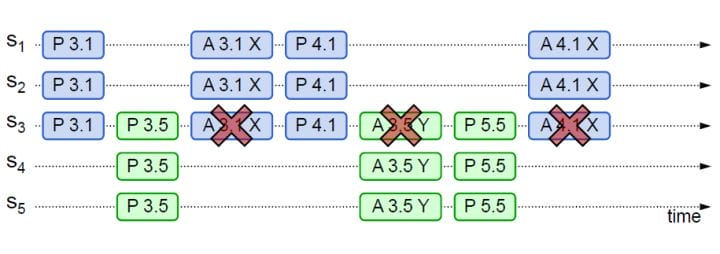

本文用于在算法学习过程中，总结相关算法套路以及算法编写经验，以备查阅。

<!-- More -->

## 01 算法复杂度及其分析

算法复杂度表示方法：

+ $O$：表示算法的渐进上界
+ $\Omega$：表示算法的渐进下界
+ $\Theta$：表示算法的渐进紧确界

递归算法复杂度分析：

+ 递归树方法

+ 代入检测法

+ 主方法：令 $a \ge 1, b > 1$ 是常数，$f(n)$​ 是一个函数，T(n) 是非负整数上的递推式：
    $$
    T(n) = aT(\frac{n}{b}) + f(n)
    $$
    T(n) 有以下方法紧确界：

    + 如果存在 $\epsilon > 0$，使得 $f(n) = O(n^{log_ba - \epsilon})$，则 $T(n) = \Theta(n^{log_ba})$   
    + 如果 $f(n) = O(n^{log_ba})$，则 $T(n) = \Theta(n^{log_ba}lgn)$  
    + 如果存在 $\epsilon > 0$，使得 $f(n) = O(n^{log_ba + \epsilon})$，并且存在 $c < 1$ 和足够大的 n，满足 $af(n/b) \le  cf(n)$，则 $T(n) = \Theta(f(n))$   

## 02 排序算法

常见排序算法：

|   名称   |    平均复杂度    |   最坏复杂度    | 原地算法 | 是否稳定 |
| :------: | :--------------: | :-------------: | :------: | :------: |
| 冒泡排序 |  $\Theta(n^2)$   |  $\Theta(n^2)$  |   原地   |   稳定   |
| 插入排序 |  $\Theta(n^2)$   |  $\Theta(n^2)$  |   原地   |   稳定   |
| 选择排序 |  $\Theta(n^2)$   |  $\Theta(n^2)$  |   原地   |  不稳定  |
| 归并排序 |  $\Theta(nlgn)$  | $\Theta(nlgn)$  |   O(n)   |   稳定   |
| 快速排序 |  $\Theta(nlgn)$  |  $\Theta(n^2)$  |   原地   |  不稳定  |
|  堆排序  |  $\Theta(nlgn)$  | $\Theta(nlgn)$  |   原地   |  不稳定  |
| 希尔排序 |  $\Theta(nlgn)$  | $O(n^s), 1<s<2$ |   原地   |  不稳定  |
| 计数排序 |  $\Theta(k+n)$   |                 |  非原地  |   稳定   |
|  桶排序  |  $\Theta(k+n)$   |                 |  非原地  |   稳定   |
| 基数排序 | $\Theta(d(k+n))$ |                 |  非原地  |   稳定   |

## 03 数据结构

基本数据结构：

+ 数组：存取速度快；插入删除元素效率低下，需要大块连续的内存块
+ 链表：插入删除操作快，不需要大块连续的空间；访问操作慢

扩展数据结构：

+ 散列表：使用哈希函数进行位置索引，快速查找，冲突处理有链接法，开放寻址法
+ 队列：FIFO 结构，变体如单调队列，主要用于处理滑动窗口最大值最小值问题
+ 栈：FILO 结构，变体如单调栈，可以找到第一个小于大于当前元素的数字，如接雨水
+ 树：
  + 遍历方式：先序遍历，中序遍历，后序遍历，层次遍历
  + 遍历方式：BFS + DFS
  + 动态查找树：
    + 二叉搜索树（BST）：左子树中的值都小于根节点，右子树中的值都大于根节点
    + 平衡二叉树（AVT）：解决 BST 退化成链表的问题，保证左右子树高度差小于 1 
    + 红黑树：降低 AVT 插入和删除的旋转开销，调整为最长路径不超过最短路径的二倍
    + 哈夫曼树：带权路径长度最短的二叉树，主要用于编码
  + 多路查找树：
    + Trie 树：常用于前缀匹配中，词频统计
    + B 树：常用于文件磁盘系统
    + B+ 树：只有叶子节点才存储真实数据，用于 MySQL 索引，降低 IO 开销
    + R 树：空间数据存储的树状数据结构
+ 堆：通常看作是一棵完全二叉树的数组对象，插入时采用上浮，删除时采用下沉操作
+ 图：
  + 图的存储结构：邻接矩阵，邻接链表
  + 遍历方式：BFS + DFS
  + 拓扑排序：需要统计入度，只有入度为 0 的节点才能进入队列
  + 并查集：使用数组表示每个节点的根节点，用于两个节点间的连通性判断
  + 最短路径：
    + Dijkstra 算法：单源最短路径算法，不能处理带有负权边的图
    + Floyd 算法：计算所有点到所有点的最短路径的算法，相当于将每个点当作是中转站
  + 最小生成树：
    + Kruskal 算法：边加法，每次都挑选最小权值的边，并且该边属于两棵树
    + Prim 算法：点加法，从某个点开始，每次挑选树外最小权值的边对应的顶点

二叉搜索树：

+ 前驱节点：左子树最大值，向左走一步，再一直向右走
+ 后继节点：右子树最小值，先右走一步，再一直向左走

平衡二叉树：

+ 旋转：

  + LL 旋转：

    

  + RR 旋转：

    

  + LR 旋转：转化为 LL 不平衡形式

    

  + RL 旋转：转化为 RR 不平衡形式

    

红黑树：

+ 性质：
  + 每个节点颜色或者红色，或者黑色
  + 根节点是黑色的，NULL 节点也是黑色的
  + 如果一个节点是红色的，那么它的两个子节点就是黑色的
  + 对于每个节点，从该节点到其后代叶节点的简单路径上，均包含相同数目的黑色节点
+ 应用场景：
  + Java HashMap & TreeMap
  + C++ STL: map & set
  + linux 进程调度 Completely Fair Scheduler，用红黑树管理进程控制块
  + epoll 在内核中的实现，用红黑树管理事件块
  + nginx 中，用红黑树管理 timer 等

## 04 算法思想

分治：将问题划分为互不相交的小问题，递归地解决小问题，再进行组合来解决原问题

动态规划：和分治类似，不过其应用于具有重叠子问题的情况，关键在于找到递归解定义，然后使用备忘录或者自底向上方法进行解决

贪心算法：和动态规划类似，不过其在解决问题的过程中，每一步都选择最优解，即小问题的最优解构成了大问题的最优解

二分法：分治思想的一种，要求原数据是按照关键字有序的

搜索算法：

+ BFS：使用队列辅助，一层一层搜索，可用于边权相同的最短路径长度
+ DFS：通常使用递归方式实现，可以用于可达性问题
  + 回溯：当前路径不可达时，返回上层，再次进行 DFS

## 05 领域算法

安全算法：

+ 摘要算法：用在数字签名上，能够产生长度相同的消息摘要，相关算法有 MD5，SHA 系列算法
+ 加密算法：将普通的文本和一串数字（密钥）进行结合，产生不可理解的密文的步骤
  + 对称加密算法：加密密钥和解密密钥相同，如 DES 算法
  + 非对称加密算法：加密密钥和解密密钥不同，称为公开密钥和私有密钥，如 RSA 算法

字符串匹配算法：指在文本 T[1..n] 中找到模式 P[1..m] 出现位置的算法，通常包括预处理和匹配两个步骤

+ 朴素算法：时间复杂度为 $O((n - m + 1)*m)$ 
+ KMP 算法：在每次匹配失败的时候，会根据最大共同前缀和后缀来重新进行匹配
  + next 表：next[i] 表示 P[1..i] 中最大相同前缀和后缀的长度，便于匹配失败的时候进行移动
  + 匹配失败：根据 next 表选择下一个进行匹配的索引
+ BM 算法：和 KMP 算法类似，需要预先处理模式串，预先生成"坏字符规则之向后位移表"和"好后缀规则之向后位移表"，并且其匹配规则是从模式串后面向前进行匹配的

大数据处理：

+ 分治/hash/排序：按照分而治之的思路进行处理，通过 hash 函数将元素范围缩小
+ 布隆过滤器：高效判断元素是否存在的数据结构，存在误判可能，变体有计数布隆过滤器
+ 外排序算法：位图排序法（不允许存在重复元素），多路归并排序
+ Map & Reduce：将任务进行划分，然后再将结果进行合并

分布式算法：

+ 一致性 Hash 算法：hash 环引入可以解决单调性（改变映射空间大小数据需要重新映射）的问题，虚拟节点引入则是为了解决数据倾斜的问题
+ Paxos 算法：一种基于消息传递的分布式一致性算法，角色分为 `提议者 (Proposer)`，`决策者 (Acceptor)` 和 `最终决策学习者 (Learner)`，相关变体有 Multi-Paxos，其是为了解决普通 Paxos 算法通行效率低下的问题
+ Raft 算法：从多副本状态机角度提出，用于管理多副本之间数据的一致性，角色分为 `领导者(Leader)`、`跟从者(Follower)` 和 `候选人(Candidate)`
+ ZAB 算法（Zookeeper Atomic Broadcast）：为分布式应用提供高效且可靠的分布式协调服务，支持崩溃恢复和原子广播
+ Snowflake 算法：分布式 ID 生成算法，按照划分空间的方式将 64bit 分割为不同部分，划分为 `1bit符号位-41bit时戳-10bit机器ID-12bit序列号` ，依赖于机器时钟，如果时钟回拨，只会简单抛出异常，可以考虑百度 `UidGenerator` 和美团分布式 ID 生成系统 `Leaf`

负载均衡算法：

+ 轮询法：将请求按照顺序轮流分配到后端服务器上
+ 加权轮询法：和轮询法相似，给配置更好的服务器基于更大的权重
+ 随机法：随机选择，由概率统计理论知道，随着执行时间增加，该结果和轮询基本相同
+ 加权随机法：和随机法类似，但增加权重概念
+ 源地址哈希法：根据获取客户端的 IP 地址进行哈希，得到对应的后端服务器编号
+ 最小连接数法：动态选择当前积压请求数最少的服务器

## 06 分布式系统

分布式系统面临的问题：

+ 缺乏全局时钟：很难定义两个事件究竟谁先谁后，物理时钟会发生偏移，通常配合逻辑时钟一起使用
+ 网络异常：如出现网络分区，消息乱序（序列号）等
+ 机器宕机：机器因故障下线，可以提供哨兵服务（Redis 采用）
+ 存储数据丢失：对于有状态节点来说，数据丢失意味着状态丢失，通常只能从其他节点读取、恢复存储的状态，实际使用中采用多副本的方式进行规避

分布式系统的衡量指标：

+ 性能：一般以吞吐率作为衡量标准
+ 可用性：指系统在面对各种异常时可以正确提供服务的能力
+ 可扩展性：分布式系统通过扩展集群机器规模提高系统性能，追求线性扩展性
+ 一致性：副本会提高可用性，但是会带来数据一致性的问题

CAP 理论：

+ 内容：CAP 理论是分布式系统、特别是分布式存储领域中被讨论的最多的理论。其中 C 代表一致性 (Consistency)，A 代表可用性 (Availability)，P 代表分区容错性 (Partition tolerance)。CAP 理论告诉我们C、A、P三者不能同时满足，最多只能满足其中两个。但是 CAP 理论的作者对此提出了质疑，因为如果选择了 AP 分布式模型，可用性虽然不能达到 100%，但是可以达到 99.999%。
+ 理解：考虑两个副本处于网络分区的两侧，即两个副本不能通信：
  + 如果允许其中一个副本更新，则会导致数据不一致，即丧失了C性质。
  + 如果为了保证一致性，将分区某一侧的副本设置为不可用，那么又丧失了A性质。
  + 除非两个副本可以互相通信，才能既保证C又保证A，这又会导致丧失P性质。

BASE 理论（Basically Available, Soft state, Eventually consistent）：

+ 内容：BASE 理论是对 CAP 理论的延伸，核心思想是即使无法做到强一致性，可以做到最终一致性。实际上是对 AP 方案的一个补充，通过牺牲一致性而获得可用性。
+ 理解：软状态即允许系统在不同节点的数据副本之间进行数据同步的过程存在延时；基本可用表示分布式系统在出现不可预知故障的时候，允许损失部分可用性。

一致性 Hash 算法：

+ 背景：为了负载均衡，传统的哈希算法通常采用哈希取模的方式，这个时候如果新增或者删除机器，会导致很多原有的数据需要重新映射，代价较大
+ 目的：一致性哈希算法就是为了解决传统哈希方式的不足，具体而言，其采用哈希环，通过将机器映射到哈希环上，对于某个映射到环上的键，需要将其顺时针移动，找到对应的机器节点即可，说明该数据位于该机器节点上
+ 问题：当某个机器下线的时候，会导致本该映射到该机器节点上的键值对顺序转移到下一个机器节点上，如果节点数目较小，可能就会导致下一个发生宕机，引发雪崩
+ 解决方案：引入机器节点的虚拟节点，这样发生问题的时候，就可以让在线机器分摊宕机节点的数据访问

Basic Paxos 算法：

+ 背景：主要为了解决分布式系统中的一致性问题，即一个分布式系统各个进程如何就某个值（决议）达成一致

+ 主要角色：

  + Proposer：提议者，提出提案，其中包含提案的 ID 和值（value）
  + Acceptor：决策者，参与决策，回复 Proposer 的提案，Proposer 只需要收到大多数决议者的接收即可
  + Learner：不参与决策，从提议者/参与者学习最新达成一致的提案（value）

  注意，在多副本状态机中，每个副本同时具有Proposer、Acceptor、Learner三种角色。

+ 3 个阶段：

  

  + Prepare 阶段：
    + Prepare：Proposer生成全局唯一且递增的Proposal ID (可使用时间戳加Server ID)，向所有Acceptors发送Prepare请求，这里无需携带提案内容，只携带Proposal ID即可
    + Promise：Acceptors收到Prepare请求后，做出“两个承诺，一个应答”
      + 承诺1: 不再接受Proposal ID小于等于(注意: 这里是<= )当前请求的Prepare请求;
      + 承诺2: 不再接受Proposal ID小于(注意: 这里是< )当前请求的Propose请求;
      + 应答: 不违背以前作出的承诺下，回复已经Accept过的提案中Proposal ID最大的那个提案的Value和Proposal ID，没有则返回空值。
  + Accept 阶段：
    + Propose：Proposer 收到多数Acceptors的Promise应答后，从应答中选择Proposal ID最大的提案的Value，作为本次要发起的提案。如果所有应答的提案Value均为空值，则可以自己随意决定提案Value。然后携带当前Proposal ID，向所有Acceptors发送Propose请求。
    + Accept：Acceptor收到Propose请求后，在不违背自己之前作出的承诺下，接受并持久化当前Proposal ID和提案Value。
  + Learn 阶段：Proposer在收到多数Acceptors的Accept之后，标志着本次Accept成功，决议形成，将形成的决议发送给所有Learners。

Multi-Paxos 算法：

+ 背景：Basic Paxos 算法存在以下缺陷：

  + 减少网络开销：Basic Paxos 中，只能对一个值形成决议，每次至少需要两次网络往返（Prepare + Accept），存在较大的网络开销

  + 存在活锁：由于 Acceptor 接收到新的提案 ID 后，不会回复提案 ID 小于当前 ID 的 Propose 请求，导致一直重试，形成活锁

    

+ 主要角色：Leader（从 Proposer 中选出），Acceptor，Learner

+ 主要改变：

  + 针对每一个要确定的值，运行一次Paxos算法实例(Instance)，形成决议。每一个Paxos实例使用唯一的Instance ID标识。相当于每次都运行一次 Paxos 实例，其会尽量保证 leader 的 liveness
  + 在所有Proposers中选举一个Leader，由Leader唯一地提交Proposal给Acceptors进行表决。这样没有Proposer竞争，解决了活锁问题。同时，仅有一个 Leader 进行提交的情况下，可以省略 Prepare 阶段，从而将两阶段转变为一阶段（Accept），提高效率

  > 主要思想是多个 Paxos 算法串联起来，由于只有一个 Leader，如果 Leader 在一轮 Paxos 算法结束时还存在，就不需要重新选 Leader，也不需要 Prepare 阶段了

Raft 算法：

+ 背景：从多副本状态机的角度提出，用于管理多副本状态机的日志复制

+ 主要角色：

  + Leader：接受客户端请求，并向Follower同步请求日志；当日志同步到大多数节点上后告诉Follower提交日志
  + Follower：接受并持久化Leader同步的日志，在Leader通知日志可以提交之后，提交日志
  + Candicate：Leader选举过程中的临时角色

+ 子问题：

  + Leader 选举：Leader向所有Followers周期性发送heartbeat。如果Follower在选举超时时间内没有收到Leader的heartbeat，就会等待一段随机的时间后发起一次Leader选举（拥有最新的已提交的log entry的Follower才有资格成为Leader）。Follower将其当前term加一然后转换为Candidate。它首先给自己投票并且给集群中的其他服务器发送 RequestVote RPC，只有当其赢得多数选票，才能成功成为 Leader

  + 日志同步：Leader把请求作为日志条目(Log entries)加入到它的日志中，然后并行的向其他服务器发起 AppendEntries RPC 来复制日志条目，当这条日志被复制到大多数服务器上，Leader将这条日志提交并向客户端返回执行结果。Raft 日志同步保证两点：

    + 如果不同日志中的两个条目有着相同的索引和任期号，则它们所存储的命令是相同的
    + 如果不同日志中的两个条目有着相同的索引和任期号，则它们之前的所有条目都是完全一样的

    第二点是通过 AppendEntries 的一个简单的一致性检查，当发送一个 AppendEntries RPC 时，Leader会把新日志条目紧接着之前的条目的log index和term都包含在里面。如果Follower没有在它的日志中找到log index和term都相同的日志，它就会拒绝新的日志条目。Leader会从后往前试，每次AppendEntries失败后尝试前一个日志条目，直到成功找到每个Follower的日志一致位点，然后向后逐条覆盖Followers在该位置之后的条目。

  + 日志压缩：Raft采用对整个系统进行snapshot来解决，snapshot之前的日志都可以丢弃。其主要包含日志元数据以及系统的当前状态。当Leader要发给某个日志落后太多的Follower的log entry被丢弃，Leader会将snapshot发给Follower。或者当新加进一台机器时，也会发送snapshot给它。发送snapshot使用InstalledSnapshot RPC。

Raft 算法和 Multi-Paxos 算法的异同点：

+ 相同点：
  + Leader & Proposer
  + Term & Proposal ID
  + Log & Proposal Value
  + Log Index & Instance ID
  + RequestVote & Prepare 
  + AppendEntries & Accept
+ 不同点：
  + 领导者：Raft 中只允许存在一个 Leader，但是 Multi Paxos 允许存在多个
  + 领导者选举权：Raft 中具有最新提交的日志的副本才可以，Multi Paxos 则允许任意副本
  + 日志连续性：Raft 保证日志连续，Paxos 则允许存在空洞
  + 日志提交：推进 Commit Index，异步的 commit 消息

ZAB（Zookeeper Atomic Broadcast） 算法：

+ 背景：是为分布式协调服务 Zookeeper 专门设计的一种支持 崩溃恢复 和 原子广播 协议，基于该协议，Zookeeper 实现了一种 主备模式 的系统架构来保持集群中各个副本之间数据一致性。

+ 主要角色：Leader，Follower

+ 消息广播：类似一个 二阶段提交过程。对于客户端发送的写请求，全部由 Leader 接收，Leader 将请求封装成一个事务 Proposal，将其发送给所有 Follwer ，然后，根据所有 Follwer 的反馈，如果超过半数成功响应，则执行 commit 操作（先提交自己，再发送 commit 给所有 Follwer）。

  需要注意的是，Leader 在接收到客户端的请求之后，会将这个请求封装成事务，并且为该事务分配一个全局递增的 ID，称为 ZXID，其保证了事务的顺序。另外，在实际实现中，Leader 和 Follower 中间还存在着一个消息队列，用来进行解耦。

+ 崩溃恢复：假设 Leader 崩溃（指的是 Leader 失去与过半 Follwer 的联系，并非是 Leader 下线），就会根据 ZXID 选举出最大的 Leader，选举成功后将会开始进行数据同步。这样就能够保证这个新选举出来的 Leader 一定具有所有已经提交的提案，可以省去 Leader 服务器检查事务的提交和丢弃工作的这一步操作。

+ 数据同步：当崩溃恢复之后，需要在正式工作之前（接收客户端请求），Leader 服务器首先确认事务是否都已经被过半的 Follwer 提交了，即是否完成了数据同步，目的是为了保持数据一致。当 Follower 链接上 Leader 之后，Leader 服务器会根据自己服务器上最后被提交的 ZXID 和 Follower 上的 ZXID 进行比对，比对结果要么回滚，要么和 Leader 同步。

  

