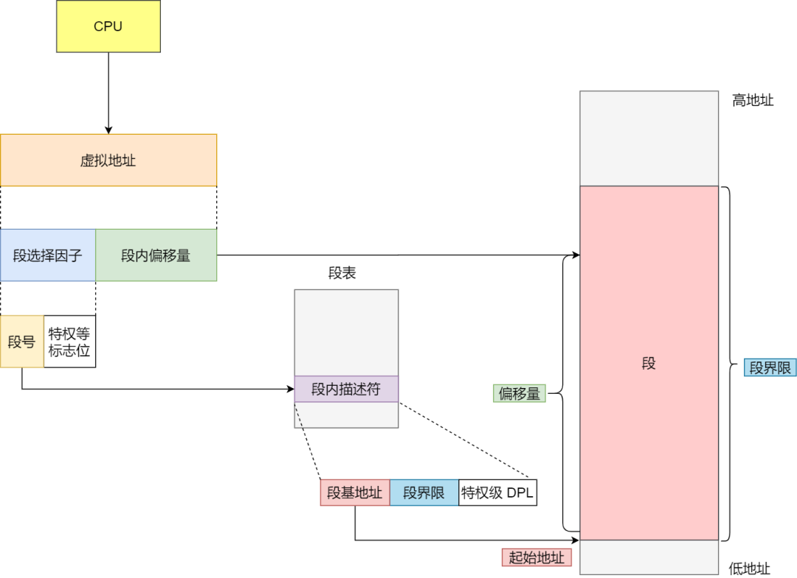

计算机系统的相关知识，总结于此，以备查询。

<!-- More -->

## 01 内存管理

虚拟内存：单片机程序写完后会将其进行烧录，程序里面的地址都是内存的物理地址，这给同时运行多个程序带来了困难，为此，可以在物理地址上层提供虚拟地址，程序看到的都是虚拟地址，而物理地址对其是透明的。为了管理虚拟地址和物理地址之间的关系，一般有内存分段和内存分页方式。

内存分段：程序由不同的逻辑段构成，如代码段，数据段，栈段等。分段下的虚拟地址表示为段选择子和段内偏移量，地址转换过程如下：

内存分段的缺点：内外部碎片严重，内存交换效率低。

内存分页：分页是把整个虚拟和物理内存空间切成一段段固定尺寸的大小，称其为页，映射过程：

分页很好地解决了内外部碎片和内存交换的问题，但是也存在以下问题：

+ 简单的分页方式浪费内存：可以使用多级页表的方式解决
+ 多级页表转换过程需要更多的时间：引入 TLB，快速进行转换

段页式内存：先将程序划分为多个有逻辑意义的段，接着再把每个段划分为多个页，此时地址结构就由段号、段内页号和页内偏移三部分组成，该方案能提高内存的利用率。

Linux 内存管理：主要采用的是页式内存管理，但同时也不可避免地涉及了段机制，这是由于 Intel 处理器发展历史导致的。Linux 系统通过为每个段分配 0-4G 范围下的虚拟空间，来屏蔽段机制的存在。用户空间划分为：

