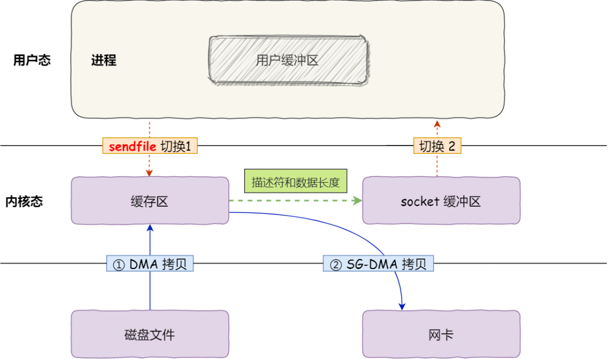
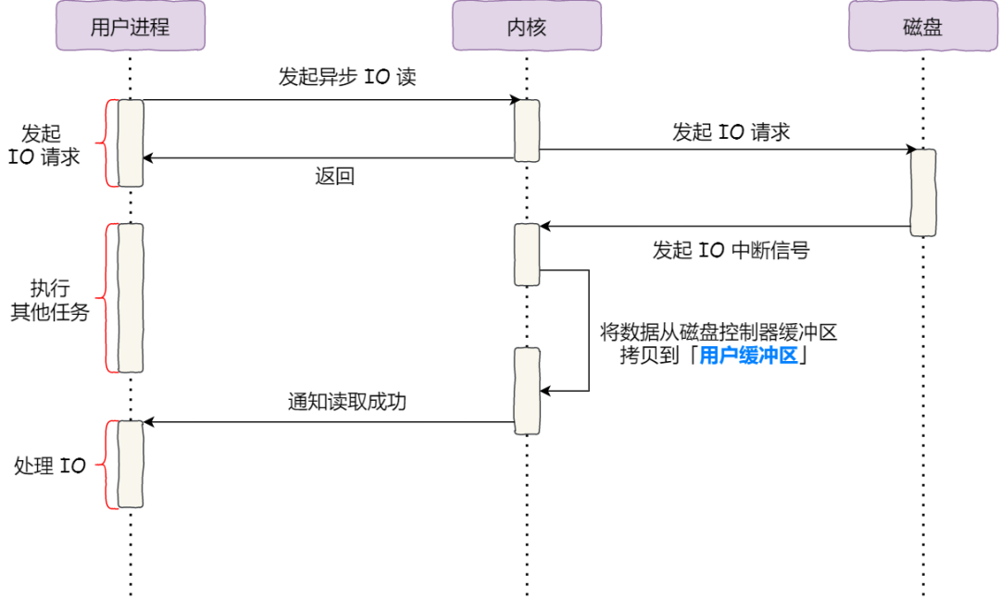
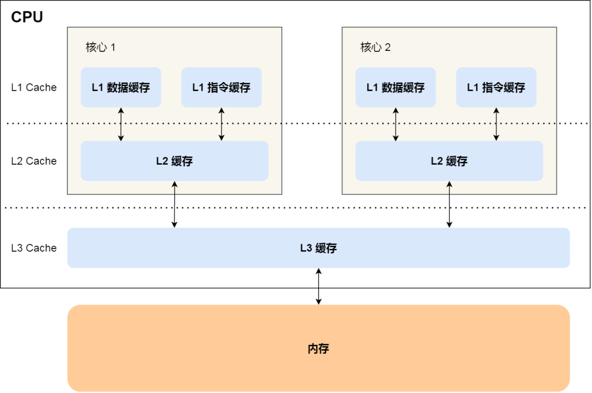
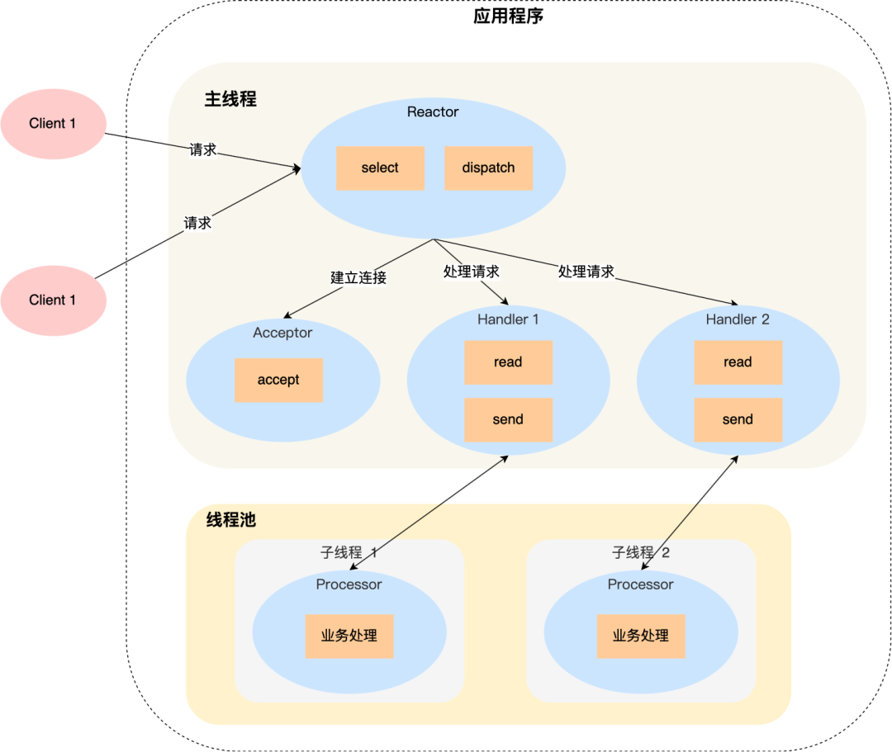

计算机系统的相关知识，总结于此，以备查询。

<!-- More -->

## 01 内存管理

虚拟内存：单片机程序写完后会将其进行烧录，程序里面的地址都是内存的物理地址，这给同时运行多个程序带来了困难，为此，可以在物理地址上层提供虚拟地址，程序看到的都是虚拟地址，而物理地址对其是透明的。为了管理虚拟地址和物理地址之间的关系，一般有内存分段和内存分页方式。

内存分段：程序由不同的逻辑段构成，如代码段，数据段，栈段等。分段下的虚拟地址表示为段选择子和段内偏移量，地址转换过程如下：

内存分段的缺点：内外部碎片严重，内存交换效率低。

内存分页：分页是把整个虚拟和物理内存空间切成一段段固定尺寸的大小，称其为页，映射过程：

分页很好地解决了内外部碎片和内存交换的问题，但是也存在以下问题：

+ 简单的分页方式浪费内存：可以使用多级页表的方式解决
+ 多级页表转换过程需要更多的时间：引入 TLB，快速进行转换

段页式内存：先将程序划分为多个有逻辑意义的段，接着再把每个段划分为多个页，此时地址结构就由段号、段内页号和页内偏移三部分组成，该方案能提高内存的利用率。

Linux 内存管理：主要采用的是页式内存管理，但同时也不可避免地涉及了段机制，这是由于 Intel 处理器发展历史导致的。Linux 系统通过为每个段分配 0-4G 范围下的虚拟空间，来屏蔽段机制的存在。用户空间划分为：

## 02 进程和线程

进程：运行中的程序，称之为进程。通常，现代 CPU 都支持多进程并发执行。进程的状态变迁图如下：

挂起状态指的是进程目前在外存中，并没有占用物理内存。

操作系统中，通过进程控制块来描述和管理进程，PCB 里面包含了进程的相关信息，如标识符，优先级，当前状态，打开的文件列表，CPU 各个寄存器的值等。PCB 通常通过链表的方式进行组织，把具有相同状态的进程链在一起，组成各种队列。不同进程并发执行时，还会发生进程的上下文切换。

线程：是进程当中的一条执行流程，是更小的能独立运行的基本单位，相同进程内的线程之间共享地址空间，但是保存自己的寄存器和栈资源。

线程优缺点：相同进程内线程可以共享代码段等资源，并发执行起来上下文切换更快；当进程内的一个线程崩溃时，会导致其所属的所有线程崩溃，其原因是操作系统检测到异常，会杀掉进程，其他线程也就一起被杀掉了，之所以不只杀掉崩溃的线程，是因为崩溃的线程可能会破坏其他线程中的内存，导致错误。

线程的实现：

+ 用户级线程的模型：用户线程的切换也是由线程库函数来完成的，无需用户态与内核态的切换，所以速度特别快；但是如果一个线程发起了系统调用而阻塞，那进程所包含的用户线程都不能执行。

+ 内核线程：在一个进程当中，如果某个内核线程发起系统调用而被阻塞，并不会影响其他内核线程的运行；线程的创建、终止和切换都是通过系统调用的方式来进行，因此对于系统来说，系统开销比较大。

+ 轻量级进程：内核支持的用户线程，一个进程可有一个或多个 LWP，每个 LWP 是跟内核线程一对一映射的，也就是 LWP 都是由一个内核线程支持。模式图如下：

  

调度：先来先服务调度算法，最短作业优先调度算法，时间片轮转调度算法，最高优先级调度算法，多级反馈队列调度算法。

## 03 互斥和同步

如果不加同步与互斥操作的话，两个线程对 `i++` 执行 100 次，最小的结果是 2，最大的结果是 200。`i++` 这段代码称为临界区，它是访问共享资源的代码片段，一定不能给多线程同时执行。

同步操作好比操作 A 应在操作 B 之前执行，而互斥就好比操作 A 和操作 B 不能在同一时刻执行。

互斥和同步的实现方式：锁，信号量。

锁操作：忙等待锁（自旋锁）和无忙等待锁。

信号量：通常表示资源的数量，用整型表示，有两个原子操作：P 操作和 V 操作。将信号量设置为 1 可实现临界区互斥，将信号量设置为 0 可实现线程间的同步。

生产者-消费者问题：任何时刻只能有一个线程操作缓冲区，需要互斥；缓冲区空时，消费者必须等待生产者生成数据；缓冲区满时，生产者必须等待消费者取出数据。说明生产者和消费者需要同步。

哲学家就餐问题：可能会发生死锁的现象，解决方法有：

+ 每次只能一个哲学家就餐，通过 mutex 实现
+ 偶数编号的哲学家先拿左边的叉子后拿右边的叉子，奇数编号的哲学家先拿右边的叉子后拿左边的叉子
+ 一个哲学家只有在两个邻居都没有进餐时，才可以进入进餐状态

读者-写者问题：读者优先方案，写者优先方案，多读者单写者方案（注意写者开始写的时候需要以前的读者全部读取完毕）

## 04 进程间通信

每个进程的用户空间都是独立的，一般而言不能互相访问，但是内核空间是每个进程都共享的，因此，进程之间通信需要通过内核来实现。Linux 中提供的通信方式有：

管道：管道传输数据是单向，先进先出的。对于匿名管道，它的通信范围是存在父子关系的进程，对于命名管道，它可以在不相关的进程间也能相互通信。管道通信的方式效率低下，不适合进程间频繁地交换数据。

消息队列：消息队列是保存在内核中的消息链表，A 进程要给 B 进程发送消息，A 进程把数据放在对应的消息队列后就可以正常返回了，B 进程需要的时候再去读取数据就可以了。但是消息队列方式存在通信不及时和消息大小限制的问题，另外，消息队列通信过程中，存在用户态与内核态之间的数据拷贝开销。

共享内存：不存在内核态和用户态数据拷贝的开销，提高了通信的速度。

信号量：共享内存如果存在多个进程一起写的情况下，可能会产生数据竞争等问题，通过将信号量初始化为 1 或者 0，就可以实现互斥或同步的功能。

信号：对于异常情况下的工作模式，就需要用信号的方式来通知进程。这是进程间通信机制中唯一的异步通信机制，用户进程对信号处理方式：执行默认操作，捕捉信号，忽略信号。

Socket：跨网络与不同主机上的进程之间通信。

## 05 文件系统

Linux 文件系统会为每个文件分配两个数据结构：

+ 索引节点（inode）：用来记录文件的元信息，如文件大小，修改时间、数据在磁盘的位置等，其占用磁盘空间
+ 目录项（dentry）：用来记录文件的名字、索引节点指针以及与其他目录项的层级关联关系，其被换存在内存中

目录和目录项：目录也是一个文件，只不过该文件存储的是目录数据，目录项是内核的数据结构

逻辑块：多个扇区组成，是文件系统读写的最小单位

虚拟文件系统：文件系统多种多样，为了屏蔽不同文件系统，给上层用户一个统一的接口，操作系统加入了虚拟文件系统，其定义了一组所有文件系统都支持的数据结构和标准接口，这样程序员不需要了解文件系统的工作原理，只需要了解 VFS 提供的统一接口即可。

文件的存储方式：

+ 连续空间存放：读写效率高，但是磁盘空间碎片和文件长度不易扩展
+ 非连续空间存放方式：
  + 链表方式：无外部碎片，动态增长方便，但是查找效率低下
  + 索引方式：可以随机访问，易于文件增长，但是索引表会增加对空间的消耗

目录的存储：目录文件的块里面保存的是目录里面一项一项的文件信息，简单的方式就是表，如果里面的文件太多，则会使用哈希方式优化

空闲空间管理：空闲表，空闲链表，空闲位图（Linux 使用）

软链接和硬链接：硬链接是多个目录项中的索引节点指向同一个索引节点，不可用于跨文件系统；软链接相当于重新创建一个文件，这个文件有独立的 inode，但是这个文件的内容是另外一个文件的路径

文件 IO：

+ 缓冲与非缓冲 I/O：根据是否利用了标准库缓冲划分，缓冲 IO 可以减少系统调用次数

+ 直接与非直接 I/O：根据是否利用操作系统的缓存划分，非直接 IO 需要将用户数据拷贝到内核缓存中

+ 阻塞与非阻塞 I/O：阻塞 IO 等待的是内核数据准备好和数据从内核态拷贝到用户态这两个过程，非阻塞 IO 则需要在最后进行同步过程。非阻塞 IO 需要应用程序进行轮询，该实现方式低下，可以使用 IO 多路复用技术，如 select，poll 等，它是通过 I/O 事件分发，当内核数据准备好时，再以事件通知应用程序进行操作，多路复用过程：

  

+ 同步与异步 I/O：阻塞 I/O、非阻塞 I/O，还是基于非阻塞 I/O 的多路复用都是同步调用，异步 I/O 是内核数据准备好和数据从内核态拷贝到用户态这两个过程都不用等待

## 06 输入输出

设备控制器：CPU 不直接和相应的设备进行交互，而是通过设备控制器来控制对应的设备的。控制器一般存在三类寄存器，分别是状态寄存器，命令寄存器和数据寄存器。另外，设备也可以分为块设备和字符设备，字符设备不可寻址，鼠标是常见的字符设备。CPU 和控制器的寄存器进行通信的方式有：端口IO 和 共享内存。

IO 控制方式：当 CPU 给设备发送了一个指令，让设备控制器去读设备的数据，CPU 通过以下方式感知到读取数据完毕：

+ 轮询控制器的寄存器状态位：浪费 CPU 资源

+ 使用中断：对于频繁读写数据的磁盘，并不友好

+ 使用 DMA：使得设备在 CPU 不参与的情况下，能够自行完成把设备 I/O 数据放入到内存

  

设备驱动程序：虽然设备控制器屏蔽了设备的众多细节，但是不同控制器其寄存器和缓冲区也是不同的，为了屏蔽设备控制器的差异，引入了设备驱动程序。通常，设备驱动程序初始化的时候，要先注册一个该设备的中断处理函数。

通用块层：对于块设备，为了减少不同块设备的差异带来的影响，Linux 通过一个统一的通用块层，来管理不同的块设备。其为文件系统和应用程序，提供访问块设备的标准接口；还会给文件系统和应用程序发来的 I/O 请求排队，进行 I/O 调度。

存储系统 IO 软件分层：

键盘敲入字母到显示屏显示时，该期间：

+ 当用户输入了键盘字符，键盘控制器就会产生扫描码数据，将其缓存，并发送中断请求
+ CPU 收到中断请求时，会保存被中断进程的 CPU 上下文，然后调用键盘的中断处理程序
+ 中断处理函数的功能就是将缓存的数据搬运到显示设备的读缓冲区队列中，最终显示设备驱动程序定时将其显示到屏幕上

## 07 调度算法

进程调度：当 CPU 空闲时，操作系统就会选择内存中的某个就绪状态的进程，并为其分配 CPU 资源，调度方式分为抢占式调度和非抢占式调度，常见的调度方式有：

+ 先来先服务调度算法
+ 最短作业优先调度算法
+ 高响应比优先调度算法：优先级计算考虑到了等待时间和要求服务时间
+ 时间片轮转调度算法
+ 最高优先级调度算法
+ 多级反馈队列调度算法：抢占式的，优先级越高的进程分配到的时间片越少

内存页面置换算法：当产生缺页错误并且当前的内存没有空闲页的时候，此时需要选择一个页面替换出去，常见置换算法：

- 最佳页面置换算法（OPT）：理论存在，作为基准测试
- 先进先出置换算法（FIFO）
- 最近最久未使用的置换算法（LRU）
- Second-Chance LRU：每个页面连续两次被选择逐出时才会真正被逐出
- 时钟页面置换算法（LOCK）：只有当需要替换的时候，才会移动指针，并且只有当访问位为 0 时淘汰
- 最不常用置换算法（LFU）

磁盘调度算法：磁盘访问中，耗时成分主要有寻道延迟，旋转延迟和传输延迟。磁盘调度算法则主要为了减少寻道延迟，相关算法有：

- 先来先服务算法
- 最短寻道时间优先算法：可能会导致饥饿现象
- 扫描算法：磁头在一个方向上移动，直到磁头到达该方向上的最后的磁道才调换方向
- 循环扫描算法：磁头只能朝某个方向移动，返回时直接复位磁头，返回时不处理请求
- LOOK 与 C-LOOK 算法：对扫描算法和循环扫描算法的优化，当磁头在移动到最远的请求位置，然后立刻向反方向移动

## 08 锁的应用场景

互斥锁和自旋锁：互斥锁加锁失败后，线程会释放 CPU，给其他线程；自旋锁加锁失败后，线程会忙等待，直到它拿到锁。互斥锁存在两次上下文切换的成本，因此如果被锁住的代码执行时间很短，就不应该用互斥锁，而应该选用自旋锁，否则使用互斥锁。需要注意的是，在单核 CPU 上，需要抢占式的调度器，否则自旋锁将会一直循环等待下去。互斥锁加锁过程：

读写锁：适用于能明确区分读操作和写操作的场景，读写锁在读多写少的场景，能发挥出优势。不管是读优先锁还是写优先锁，都存在饥饿的问题。为此，可以采用公平读写锁，比较简单的一种方式是：用队列把获取锁的线程排队，不管是写线程还是读线程都按照先进先出的原则加锁即可，这样读线程仍然可以并发，也不会出现饥饿的现象。

乐观锁和悲观锁：悲观锁做事比较悲观，它认为多线程同时修改共享资源的概率比较高，于是很容易出现冲突，所以访问共享资源前，先要上锁。乐观锁做事比较乐观，它假定冲突的概率很低，它的工作方式是：先修改完共享资源，再验证这段时间内有没有发生冲突，如果没有其他线程在修改资源，那么操作完成，如果发现有其他线程已经修改过这个资源，就放弃本次操作。像在线文档便是采用乐观锁。

## 09 零拷贝

DMA 技术：在没有 DMA 技术之前，数据的读取过程需要 CPU 进行数据的搬运，而在这个过程中，CPU 是不能做其他的事情的，有了 DMA 之后，数据搬运的工作就交给了 DMA 控制器， 其过程如下：

传统的文件传输：如果服务端需要提供文件传输的功能，一个简单的想法是先读取磁盘上的文件，在通过网络协议发送给客户端，整个过程如下：

综上，一共发生了 4 次用户态和内核态的切换，还发生了 4 次数据拷贝，因此，优化方案从这两点出发：

+ mmap + write：mmap 系统调用函数会直接把内核缓冲区里的数据映射到用户空间，这样，操作系统内核与用户空间就不需要再进行任何的数据拷贝操作

+ sendfile：其可以直接把内核缓冲区里的数据拷贝到 socket 缓冲区里，不再拷贝到用户态；如果网卡支持 SG-DMA，可以进一步减少拷贝的次数：

  

使用零拷贝的项目：Kafka 和 Nginx，注意，使用零拷贝技术是不允许进程对文件内容作进一步的加工的，比如压缩数据再发送。

PageCache：文件传输过程中，第一步都是先需要先把磁盘文件数据拷贝内核缓冲区里，这个内核缓冲区实际上是磁盘高速缓存，其用来缓存最近被访问的数据，当空间不足的时候淘汰最久未被访问的缓存。PageCache 的主要优点是缓存最近被访问的数据和预读功能。但是，当传输大文件的时候，可能会造成缓存污染。在高并发的场景下，针对大文件的传输的方式，应该使用异步 I/O + 直接 I/O 来替代零拷贝技术。

## 10 存储器的层次结构

存储器通常可以分为以下几个级别：

+ 寄存器：最靠近 CPU 的存储单元，一般 4 个字节或者 8 个字节
+ CPU Cache：使用 SRAM，通常分为三层，L1 Cache + L2 Cache + L3 Cache，L1 Cache 指令和数据是分开的，L3  Cache 通常是多个 CPU 核心共用的
+ 内存：使用 DRAM，现在也存在 NVM
+ SSD 和 HDD 硬盘：SSD 通过 ROW + COL Addr 获取相应数据，HDD 通过磁头找到起始地址

CPU Cache 组织：

## 11 CPU 缓存

CPU Cache 中的数据是从内存中读取过来的，它是以一小块的数据为单位进行读取和写入的，这样的一个一小块的数据，称之为 Cache Line，通常在 Linux 中，Cache Line 一次载入的数据大小是 64 字节。Cache Line 中除了实际的数据外，还存在对应的 tag 和 valid 标记位，对于直接映射方式：

除了直接映射方式外，还存在全相联 Cache 和组相联 Cache 两种方式

提高数据缓存的命中率：二维数组遍历 arr[i, j] 遍历

提高指令缓存的命中率：涉及到分支预测器，如可以先排序再判断；对于多核 CPU，如果一个进程在不同核心来回切换，各个核心的缓存命中率就会受到影响，可以将线程绑定在某一个 CPU 核心上，Linux 上提供了 sched_setaffinity 方法来实现该功能

## 12 CPU 缓存一致性

CPU 缓存写入方式：CPU 缓存写入后，如果不进行其他操作，就会导致缓存和内存中的数据不一致

+ 写直达：把数据同时写入内存和 Cache 中，每次都需要写内存，性能浪费
+ 写回：修改对应的 Cache Line 并且设置 dirty 位

缓存一致性问题：现代 CPU 通常是多核的，由于 L1，L2 都是独占的，某个 CPU 修改数据后，其他的 CPU 可能并不知道该情况，因此造成了数据不一致，解决该问题的方式：

+ 写传播：某个 CPU 更新 Cache 的时候，必须要传播到其他核心的 Cache，实现方式有总线嗅探，该方式会加重总线负担，并且不能保证事务的串行化
+ 事务的串行化：一组 CPU 对数据的操作顺序，必须在其他核心看起来顺序是一样的，实现方式有 MESI

MESI 协议：分别是首字母 Modified，Exclusive，Shared 和 Invalidated，下面是协议转换图：

## 13 伪共享

伪共享：假设存在一个双核心的 CPU，这两个 CPU 核心并行运行着两个不同的线程，并且他们分别访问 A 和 B 变量，如下图：

如果这两个核心交替访问且修改 A，B，那么根据缓存一致性协议 MESI，每个核心访问修改前都需要重新从内存中加载最新的 Cache Line 到高速缓存中，造成性能浪费。

避免伪共享的方法：对于多个线程共享的热点数据，应该避免这些数据刚好在同一个 Cache Line 中。在 Linux 结构体中，可以通过宏 `__cacheline_aligned_in_smp` 来对齐，使得数据不在同一个 Cache Line 中。如果是在应用层，则可以使用手动填充的方式，如在两个热点数据中间定义一些无用数据用来 padding。

## 14 Linux 内核任务调度

Linux 进程和线程：在 Linux 内核中，进程和线程都是使用 task_struct 结构体来保存的，区别在于线程会共享一部分进程已创建的资源，它们统称为任务。

Linux 系统中，主要有以下调度：

+ Deadline 调度器：按照 deadline 进行调度
+ Realtime 调度器：相同优先级使用 FIFO 或者 RR 调度，高优先级可以抢占
+ Fair 调度器：普通任务和后台任务的调度策略

完全公平调度（CFS）：普通任务的调度算法，其会根据每个程序的 vruntime 来决定下一次选择运行的程序，即在调度的时候，选择 vruntime 少的任务，vruntime 参数根据已经运行的时间和优先级计算得到。

CPU 任务队列：一个系统运行的任务通常多余 CPU 核数，为此需要排队，为了效率，cfs 采用红黑树实现。在选择任务时，总是先从 dl_rq 里选择任务，然后从 rt_rq 里选择任务，最后从 cfs_rq 里选择任务。

优先级调整：

+ 调整任务的优先级：使用 nice 命令，priority(new) = priority(old) + nice
+ 调整任务所在队列优先级：使用 chrt 命令

## 15 计算机数据表示

十进制和二进制转换方法：除 2 取余法，乘 2 取整法

负数表示：反码和补码，采用补码方便计算机运算，并且不存在 0 的多个不同表示方法

带小数的存储：采用科学表示法，现在一般采用 IEEE 制定的标准，即

+ 符号位：1 为负数，0 为正数
+ 指数位：无符号的 8 位数，IEEE 规定单精度浮点的指数取值范围是 -127 ~ +128，需要偏移 127
+ 尾数：1 后面的小数部分

由于计算机存储小数存在误差，因此：

+ 在做浮点数加法的时候，需要注意误差，如 `0.1 + 0.2 != 0.3`
+ 在做浮点数判断的时候，通常采用 `fabs(num - target) < 1e-5`

## 16 Linux 收发网络包过程

网络模型：

+ OSI 网络模型：应用层、表示层、会话层、传输层、网络层、数据链路层以及物理层
+ TCP/IP 网络模型：应用层、传输层、网络层和网络接口层
+ 五层网络模型：应用层、传输层、网络层，数据链路层和物理层

Linux 网络数据的封包：

数据包名称：在应用层叫 data，在 TCP 层称为 segment，在 IP 层叫 packet，在数据链路层称为 frame

Linux 接收网络包流程：

1. 网卡接收到网络包后，通过 DMA 技术，将网络包放入 Ring Buffer 中，该缓冲区在内核内存中的网卡驱动里
2. 网卡发起硬件中断，从而处理相应的网卡硬件中断响应函数，中断函数处理完需要暂时屏蔽中断，然后唤醒软中断来轮询（poll）处理数据，直到没有新数据时才恢复中断，这样一次中断处理多个网络包，提高了网卡的性能
3. 软中断响应函数会从 Ring Buffer 中拷贝数据到内核 struct sk_buff 缓冲区中，从而可以作为一个网络包交给网络协议栈进行逐层处理
4. 首先去掉帧头和帧尾，交给网络层，网络层如果发现目标 IP 不是本机，则转发其到下一个节点，否则将其交给上层处理
5. 传输层根据四元组找到相应的 Socket，并且将数据拷贝到 Socket 的接收缓冲区
6. 应用程序调用 Socket 接口，从内核的 Socket 接收缓冲区读取新到来的数据到应用层

## 17 Linux 网络性能监控

网络配置信息：ifconfig 和 ip，可以查看网口的连接状态，MTU 大小，网口的 IP 地址，子网掩码等

Socket 信息：netstat 和 ss，接收队列（Recv-Q）和发送队列（Send-Q）比较特殊，在不同的 socket 状态下表示不同的信息：

+ socket 处于 Established 时：Recv-Q 表示 socket 缓冲区中还没有被应用程序读取的字节数，Send-Q 表示 socket 缓冲区中还没有被远端主机确认的字节数
+ socket 处于 Listen 时：Recv-Q 表示全连接队列的长度，Send-Q 表示全连接队列的最大长度

网络吞吐率和 PPS：使用 sar 命令，查询带宽可以使用 ethtool 命令

连通性和延时：使用 ping，基于 ICMP 协议

## 18 软中断

中断：是系统用来响应硬件设备请求的一种机制，操作系统收到硬件的中断请求，会打断正在执行的进程，然后调用内核中的中断处理程序来响应请求。中断处理程序在响应中断的时候，还可能会临时关闭中断，也就是让系统中其他的中断暂时无法执行，所以中断处理程序要短且快

软中断：Linux 系统为了解决中断处理程序执行过长和中断丢失的问题，将中断过程分成了两个阶段，分别是上半部和下半部分

+ 上半部用来快速处理中断，一般会暂时关闭中断请求，也就是硬中断
+ 下半部用来延迟处理上半部未完成的，比较耗时的工作，一般以内核线程的方式运行，也就是软中断

每个 CPU 都有一个软中断内核线程，可以通过 top 查看当前软中断的 CPU 使用率

## 19 操作系统内核

内核：应用连接硬件设备的桥梁，屏蔽了硬件的细节，通常具有的功能：进程管理，内存管理，硬件设备管理，提供系统调用。内核具有很高的权限，操作系统通常将内存分为内核空间和用户空间，实现权限控制。

内核架构：

+ 宏内核，包含多个模块，整个内核像一个完整的程序，如 Linux 内核
+ 微内核，有一个最小版本的内核，一些模块和服务则由用户态管理
+ 混合内核，内核中抽象出了微内核的概念，也就是内核中会有一个小型的内核，如 Windows 内核

## 20 I/O 多路复用

基本的 Socket 模型：想要实现跨主机通信，我们需要使用 Socket 编程，通常，每个 Socket 都绑定一个 IP 地址和端口，用以区分主机和主机上的程序。在绑定后，可以通过 listen 函数进行监听，客户端此时可通过 connect 函数发起连接，连接过程中，内核实际上会为每个 Socket 维护两个队列，半连接队列和全连接队列。当 TCP 全连接队列不为空后，服务端的 accept 函数，就会从内核中的 TCP 全连接队列里拿出一个已经完成连接的  Socket 返回应用程序，后续数据传输都用这个 Socket。注意监听的 Socket 和真正数据传输的 Socket 是两个不同的 Socket。在 Socket 文件索引节点指向了 Socket 结构，里面存在两个队列，保存的数据结构是 struct sk_buff，通过移动指针，实现包的解包和封包：

上面实现的 Socket 调用流程是最简单的，基本只能实现一对一的通信，为了提高性能，可以：

+ 多进程模型：为每个客户端分配一个进程来处理请求，通过 fork 可以实现进程复制，但是该方式需要父进程管理其子进程，可通过 wait 和 waitpid 实现，但是，进程上下文切换开销比较大

  

+ 多线程模型：优化进程上下文开销很大的措施，同时采用线程池来减少线程创建和销毁的开销，但是线程池毕竟是有限的，很难支持 C10K 问题

  

+ IO 多路复用：为每个请求分配一个进程/线程的方式是不合适的，可以让一个进程来维护多个 Socket，也就是 IO 多路复用技术。一个进程虽然任一时刻只能处理一个请求，但是处理每个请求的事件时，耗时控制在 1 毫秒以内，这样 1 秒内就可以处理上千个请求，该方式也称作时分多路复用。常见的多路复用方式有：

  + select：将已经连接的 socket 放到一个文件描述符集合，通过 select 调用将该集合拷贝到内核中，让内核通过遍历来检查可读或者可写的 socket，并且设置相应的标记位，接着将文件描述符集合拷贝到用户态里面，然后用户态还需要再次遍历找到可读写的 socket，然后进行相应处理。select 使用 BitsMap 表示文件描述符集合，其支持的个数是有限的

  + poll：和 select 基本相同，但是其使用链表式动态数组形式来存储文件描述符集合，突破了个数限制，但是仍然需要两次遍历和复制

  + epoll：首先，使用红黑树来跟踪进程所有待检测的文件描述符，提高效率；其次，使用事件驱动的机制，内核里维护了一个链表来记录就绪事件，当用户调用 epoll_wait 时，只会返回就绪事件对应的文件描述符。epoll 支持边缘触发和水平触发，边缘触发模式一般和非阻塞 I/O 搭配使用，程序会一直执行 I/O 操作，直到系统调用（如 read 和 write）返回错误，并且错误类型为 EAGAIN 或 EWOULDBLOCK。边缘触发效率较高，因为其减少了 epoll_wait 系统调用的次数。

    

## 21 死锁

死锁发生条件：互斥，持有并等待，不可剥夺，环路等待

死锁避免：资源分配有序方式，超时放弃

Java 中死锁排查工具：jps，jstack，jconsole

## 22 Reactor 和 Proactor

为了让服务器能够最大限度的服务客户端，有以下方式：

+ 为每个连接创建一个进程
+ 为每个连接创建一个线程，减少上下文切换开销
+ 使用线程池，减少线程创建和销毁的开销
+ 使用 IO 多路复用，减少线程在 read 操作时的阻塞时间
+ 使用面向对象编程思想，封装 IO 多路复用，产生 Reactor 框架
+ 异步网络模式编程 Proactor

Reactor：I/O 多路复用监听事件，收到事件后，根据事件类型分配给某个进程 / 线程，其类型有：

+ 单 Reactor 单进程：由于只存在单个进程，无法利用多核 CPU 性能，同时如果业务比较耗时，则会造成响应的延迟

  

+ 单 Reactor 多线程：此时 Reactor 很可能成为性能瓶颈

  

+ 多 Reactor 多线程：充分利用了 CPU 资源，并且 Reactor 不会成为瓶颈

  

Proactor：Reactor 使用的是非阻塞同步网络模式，而 Proactor 是异步网络模式，前者感知的是就绪可读写事件，后者感知的是已经完成的读写事件

应用：在 Linux 下，异步 IO 是不完善的，aio 系列函数并不是操作系统级别支持的，因此，基于 Linux 的高性能网络框架使用的是 Reactor 方案，而在 Windows 中，实现了一套完整的支持 socket 的异步编程接口，因此在 Windows 里实现高性能网络程序可以使用效率更高的 Proactor 方案。

