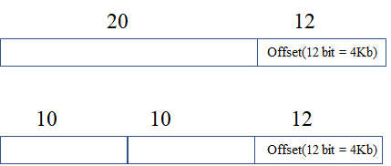

本文旨在记录学习计算机系统遇到的相关问题，以备查阅。

<!-- More -->

1. 为什么需要虚拟内存？

   传统单片机采用烧录的方式加载程序，程序直接操作的是物理地址，这样的方式很难支持多个程序同时运行，因为它们之间的地址不是相互隔离的，为此引出了虚拟内存，其构建在物理地址之上，为程序屏蔽了物理地址，使得多个程序同时运行成为可能。

2. 如何通过虚拟地址找到对应的物理地址（内存管理方案）？

   可以通过段式内存管理方案，虚拟地址此时拆分为段选择子和段内偏移量，通过段表进行映射。由于分段方案存在严重的内外碎片和内存交换效率低下问题，引出了页式内存管理方案，该方案将虚拟内存和物理内存进行分页，然后通过页表将两者之间关联起来。虽然分页解决了内外碎片问题，但是也会产生内存浪费现象，即页表过大，可以采用多级页表进行缓解，为了缓解多级页表查询效率低下问题，根据局部性原理，引入 TLB，快速进行地址转换。

3. 考虑如下一级页表和二级页表的内存占用，分析多级页表节省内存的原因？

   

   对于一级页表，需要 2^20 * 4B = 4MB 内存，对于二级页表，需要 2^10 * 4B + 2^10 * 2^10 * 4B = 4.004MB 内存。上面计算方式并没有错误，但是需要考虑到二级列表可以不存在，或者二级页表可以不在主存中，这样只有在需要时才会创建对应的二级页表，假设只有 20% 的一级页表存在二级页表，那么需要 2^10 * 4B + 2^10 * 2^10 * 4B * 0.2 = 0.804MB，从而达到了节省内存的作用。

4. Linux 内存管理是怎样的？

   主要采用页式内存管理，但是涉及到了段机制，这是 Intel 处理器发展导致的，Linux 系统通过为每个段分配 0-4G 范围下的虚拟空间，来屏蔽段机制的存在。

   

5. 程序，进程和线程的区别和联系？

   进程是对运行时程序的封装，是系统进行资源调度和分配的的基本单位，实现了操作系统的并发；线程是进程的子任务，是 CPU 调度和分派的基本单位，实现进程内部的并发；线程是操作系统可识别的最小执行和调度单位，相同进程内的线程切换开销更小。

6. 进程状态及其转换？

   状态有：创建态，就绪态，运行态，阻塞态，结束态。

   > 还可以补充就绪挂起态和阻塞挂起态，此时进程会被转移到外存中，节省出内存以供他用

7. 线程独占的资源有哪些，和进程共享的资源有哪些？

   线程独占资源：寄存器，程序计数器，栈

   线程共享资源：代码段，数据段，堆，文件打开表，记账信息等

8. 进程内的某个线程发生崩溃，此时进程内的其他线程还能运行吗？

   不能，当进程内的一个线程崩溃时，会导致其所属的所有线程崩溃，其原因是操作系统检测到异常，会杀掉进程，其他线程也就一起被杀掉了，之所以不只杀掉崩溃的线程，是因为崩溃的线程可能会破坏其他线程中的内存，导致错误。

9. 线程的不同实现模型和对应的优缺点？

   用户级线程：无需用户态和内核态的切换，高效，但是但是如果一个线程发起了系统调用而阻塞，那进程所包含的用户线程都不能执行

   内核级线程：在一个进程当中，如果某个内核线程发起系统调用而被阻塞，并不会影响其他内核线程的运行；线程的创建、终止和切换都是通过系统调用的方式来进行，系统开销比较大

   轻量级进程（组合方式）：内核支持的用户线程，一个进程可有一个或多个 LWP，每个 LWP 是跟内核线程一对一映射的，也就是 LWP 都是由一个内核线程支持

10. 进程（线程）调度算法有哪些？

    先来先服务调度算法，最短作业优先调度算法，时间片轮转调度算法，最高优先级调度算法，多级反馈队列调度算法。

   

11. i 的初始值为 0，两个线程对 `i++` 执行 100 次，能得到的结果范围？

    最大值是 200，最小值是 2；开始时 A，B 线程读取 i 初始值（0），A 执行 99 次后写入内存（99），B 执行一遍 i++（1），A 读取 i 值（1），B 执行 99 次后写入内存（100），A 执行最后一次 i++（2）。

12. 同步和互斥的概念与不同点？

    同步强调进程之间的执行顺序，互斥强调进程不能同时执行某个代码段：同步操作好比操作 A 应在操作 B 之前执行，而互斥就好比操作 A 和操作 B 不能在同一时刻执行。

13. 互斥和同步的实现方式？

    可以通过锁和信号量实现。前者存在忙等待锁和无忙等待锁，后者通常有两种操作，wait & signal，通常设置为资源数量，设置为 1 可以实现 mutex，设置为 0 则可以进行同步。

14. 互斥和同步相关问题及其解决方案？

    生产者-消费者问题：任何时刻只能有一个线程操作缓冲区，需要互斥；同时生产者和消费者需要 empty 和 full 信号量来进行同步；注意互斥量和信号量

    哲学家就餐问题：限制每次只能一位哲学家就餐；偶数编号先拿左边筷子，奇数编号先拿右边筷子

    读者-写者问题：读者优先方案和写者优先方案

    

15. 进程间通信方式有哪些？

    管道，消息队列，共享内存，信号量，信号，Socket。

16. 管道能否实现不相关的进程之间相互通信？

    可以，匿名管道只能在父子进程间通信，对于命名管道则能够在不相关的进程间通信。

17. 父子间管道通信方式如何实现的，要实现双向通信，需要几个管道？

    fork 时对应的管道也会被复制，父进程关闭读端，子进程关闭写端，即可实现父子进程通信；要实现双向通信则需要两个管道。

18. 信号通信机制的特点？

    信号实际上可以看作是软件上的中断，是唯一的异步通信机制，当信号产生时，可以执行默认操作，捕捉信号或者忽略信号。

19. Socket 通信参数设置？

    `int socket(int domain, int type, int protocol)`：

    + domain 指定协议族，如 AF_INET，AF_INET6，AF_LOCAL
    + type 指定通信特性，比如 SOCK_STREAM，SOCK_DGRAM，SOCK_RAW
    + protocol 现在已经被废弃，填 0 即可

20. Socket 针对 TCP 协议通信编程模型和针对 UDP 协议通信编程模型？

    TCP 通信：socket，bind，listen，accept，connect，write，read，close

    UDP 通信：socket，bind，sendto，recvfrom

    

21. Linux 文件系统 ext* 是如何组织的？

    所有文件存在对应的目录项（dentry）和索引节点（inode），目录项通常被缓存在内核缓冲中，里面记录了文件名和索引节点的对应关系，允许多对一（此时便是硬链接），通过文件名即可得到对应的索引节点，索引节点里面保存文件的元信息，如文件的数据块信息。

22. 目录和目录项的区别？

    目录是个文件，只不过里面存储的是目录数据，目录项则是内核中的数据结构。

23. 操作系统为什么提供虚拟文件系统？

    文件系统多种多样，为了屏蔽不同文件系统，给上层用户一个统一的接口，操作系统加入了虚拟文件系统，其定义了一组所有文件系统都支持的数据结构和标准接口。

24. 软链接和硬链接的区别？

    硬链接是多个目录项中的索引节点指向同一个索引节点，不可用于跨文件系统；软链接相当于重新创建一个文件，这个文件有独立的 inode，但是这个文件的内容是另外一个文件的路径。

25. 什么是缓冲与非缓冲 I/O？

    看是否利用了标准库的缓冲，进行缓冲的则是缓冲 IO，否则是非缓冲 IO。

26. 什么是直接与非直接 IO？

    看是否利用了内核缓存，不需要内核缓存的是直接 IO，否则是非直接 IO，需要将用户数据拷贝到内核缓存中。

27. 什么是阻塞和非阻塞 IO？

    阻塞 IO 等待的是内核数据准备好和数据从内核态拷贝到用户态这两个过程，非阻塞 IO 则需要在最后进行同步过程。非阻塞 IO 需要应用程序进行轮询，该实现方式低下，可以使用 IO 多路复用技术，如 select，poll 等。

28. 什么是同步与异步 IO？

    阻塞 I/O、非阻塞 I/O，还是基于非阻塞 I/O 的多路复用都是同步调用，异步 I/O 是内核数据准备好和数据从内核态拷贝到用户态这两个过程都不用等待，目前比较成熟的是 windows 下的 IOCP 技术。

    

29. 从键盘敲入字母到显示屏显示，其中的过程？

    + 当用户输入键盘字符，键盘控制器会产生对应的扫描码数据，将其缓存，并且发送中断请求
    + CPU 收到中断请求后，会保存正在执行进程的 CPU 上下文，然后调用键盘的中断处理程序
    + 中断处理程序的功能就是将缓存的数据搬运到显示设备的读缓冲区队列中，最终显示设备驱动程序定时将其显示到屏幕上

30. 当 CPU 给设备发送读命令时，实际上是让设备控制器去读设备的数据，CPU 如何才能知道数据已经读取完毕？

    可以通过轮询（CPU 消耗），中断（上下文切换），DMA。其中，DMA 在接收到 CPU 的控制信号后，可以将其对应的数据搬运到内存中，然后通过中断通知 CPU。

31. DMA 工作原理？

    首先，CPU 对 DMA 设备进行编程，主要告知其数据地址和对应的大小；DMA 接收到 CPU 指令后，通过磁盘控制器将数据放到内存中；磁盘控制器完成任务后，向 DMA 报告成功消息；DMA 接收到成功消息后，就可以产生中断，告知 CPU 已完成数据搬运的任务。

    

32. 常见的进程调度算法，以及进程调度发生的时机？

    当 CPU 空闲时，操作系统就会根据进程调度算法来选择内存中的某个就绪状态的进程来运行。常见进程调度算法有先来先服务算法，最短作业优先算法，高响应比算法（等待时间/处理时间），时间片轮转算法，最高优先级算法，多级反馈队列调度算法（高优先级时间片小，低优先级时间片大）。

33. 内存页面置换算法有哪些？

    最佳页面置换算法（OPT），先进先出置换算法（FIFO），最近最久未使用的置换算法（LRU），Second-Chance LRU，CLOCK，最不常用置换算法（LFU）。

34. 磁盘调度算法有哪些？

    磁盘访问延迟主要有寻道延迟，旋转延迟和传输延迟组成，算法主要基于减少寻道延迟设计：先来先服务算法，最短寻道时间优先算法，扫描算法，循环扫描算法，LOOK 与 C-LOOK 算法（对扫描算法的优化）。

    

35. 互斥锁和自旋锁加锁失败会发生什么？

    互斥锁加锁失败后，线程本身进入阻塞状态，释放出 CPU 资源，内核会维护互斥锁等待队列，当互斥锁被释放时，此时就可以唤醒对应的被阻塞的线程；自旋锁加锁失败，线程本身不会释放 CPU 资源，会进行忙等待。对于执行时间短的被锁住的代码，可以采用自旋锁，减少上下文切换的开销。

36. 读写锁不论是读优先还是写优先，都存在饥饿问题，如何解决？

    用队列把获取锁的线程排队，不管是写线程还是读线程都按照先进先出的原则加锁即可，这样读线程仍然可以并发，也不会出现饥饿的现象。

37. 乐观锁和悲观锁的区别？

    悲观锁做事比较悲观，它认为多线程同时修改共享资源的概率比较高，于是很容易出现冲突，所以访问共享资源前，先要上锁。乐观锁做事比较乐观，它假定冲突的概率很低，它的工作方式是：先修改完共享资源，再验证这段时间内有没有发生冲突，如果没有其他线程在修改资源，那么操作完成，如果发现有其他线程已经修改过这个资源，就放弃本次操作。像多人编辑在线文档便是采用乐观锁。

    

38. 基于网络的传统文件传输过程？

    基本思路是读取磁盘上的文件，再通过网络协议发送给接收端：

    + 用户态代码 read，此时 CPU 可以通过 DMA 技术，将文件数据向拷贝到内核缓冲区，然后 CPU 将其拷贝到用户缓冲区，此时 read 结束
    + 用户态写 socket，即调用 write，此时 CPU 将其拷贝到内核中的 socket 缓冲区中，然后通过 DMA 将其复制到网卡

    整个过程发生了发生了 4 次用户态和内核态的切换，还发生了 4 次数据拷贝。

39. 针对传统文件传输过程，有哪些优化方案？

    + mmap + write：mmap 系统调用函数会直接把内核缓冲区里的数据映射到用户空间（用户虚拟地址和内核虚拟地址同时指向相同的内存块），这样，操作系统内核与用户空间就不需要再进行任何的数据拷贝操作。减少了数据拷贝次数，但是没有减少上下文切换次数
    + sendfile：其可以直接把内核缓冲区里的数据拷贝到 socket 缓冲区里，不再拷贝到用户态；如果网卡支持 SG-DMA，可以进一步减少拷贝的次数。减少了拷贝次数和上下文切换次数

40. 严格来说，sendfile 中还是存在内核缓冲区到 socket 缓冲的复制（不考虑 SG-DMA），为什么将其称为 0 拷贝？

    零拷贝是从操作系统层面来看的，sendfile 操作不需要将内核空间数据拷贝到用户空间数据，因此可以看作是零拷贝的实现。

41. 零拷贝的缺点？

    不允许对文件数据进行加工处理，如添加用户信息或者压缩，只能将其原封不动传输给用户；

    在传输大文件的时候，容易造成缓存污染，此时应当采用异步 IO + 直接 IO 来代替零拷贝技术。

42. PageCache 是什么？

    页缓存，用于缓存操作系统逻辑处理数据单元，当用户在本地调用 write 时，只能说明数据已经写回到 PageCache 上了，还没有写到磁盘上，若想数据落盘，需要适用 fsync 调用。

    

43. 存储器的倒金字塔结构?

    寄存器，CPU Cache，内存，HDD 和 SSD，磁带等。

44. CPU Cache 有几层，每层的结构如何？

    现代处理器通常三层，L1 Cache 和 L2 Cache 时核独占的，L3 Cache 是共享的，并且 L1 Cache 还分为指令缓存和数据缓存。

45. CPU Cache 是如何对内存数据进行缓存的？

    考虑直接映射，一个内存地址将被解析成 （Cache Tag，Cache Index，Offset），通过 Cache Index 找到对应的数据块，通过 Cache Tag 和 Valid Bit 检查数据是否有效，最后通过 Offset 得到对应的字数据。

46. 除了直接映射方式，还存在哪些映射方式？

    组相联 Cache 和 全相联 Cache。全相联映射允许内存块可以映射到 Cache 中的任何一块缓存中，直接映射则只允许内存块映射到 Cache 中的某个块中。

47. 如何提高缓存的命中率？

    提高数据缓存的命中率：二维数据遍历时按照先行后列的方式

    提高指令缓存的命中率：涉及到分支预测器，可以考虑减少条件判断语句

    另外对于多核 CPU，如果线程在不同核上来回切换，也会影响命中率，可以将其绑定到某个 CPU 核心上，Linux 上提供了 sched_setaffinity 方法来实现该功能

    

48. CPU 缓存写入方式有哪些，为什么需要？

    主要有两种：

    + 写直达：把数据同时写入内存和 Cache 中，每次都需要写内存，性能浪费
    + 写回：修改对应的 Cache Line 并且设置 dirty 位

    CPU 缓存写入后，如果不进行其他操作，就会导致缓存和内存中的数据不一致

49. 缓存一致性问题是什么，如何解决？

    现代 CPU 通常是多核的，由于 L1，L2 都是独占的，某个 CPU 修改数据后，其他的 CPU 可能并不知道该情况，因此造成了数据不一致，解决该问题的方式：

    + 写传播：某个 CPU 更新 Cache 的时候，必须要传播到其他核心的 Cache，实现方式有总线嗅探，该方式会加重总线负担，并且不能保证事务的串行化
    + 事务串行化：一组 CPU 对数据的操作顺序，必须在其他核心看起来顺序是一样的，实现方式有 MESI

    

50. 什么是伪共享？

    假设存在一个双核心的 CPU，这两个 CPU 核心并行运行着两个不同的线程，并且他们分别访问 A 和 B 变量。如果 A 和 B 变量在一个 Cache Line 中，并且这两个核心交替访问且修改 A，B，那么根据缓存一致性协议 MESI，每个核心访问修改前都需要重新从内存中加载最新的 Cache Line 到高速缓存中，造成性能浪费。

51. 避免伪共享的方法？

    对于多个线程共享的热点数据，应该避免这些数据刚好在同一个 Cache Line 中：

    + 在结构体中，可以通过宏 `__cacheline_aligned_in_smp` 来对齐
    + 在应用层，可以手动填充一些无用数据进行 padding

