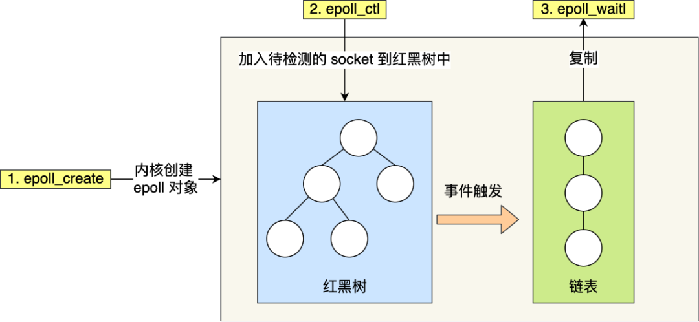
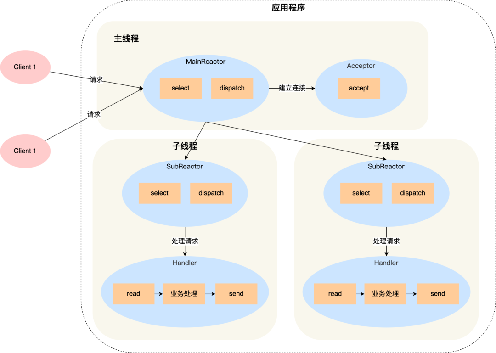

本文旨在记录学习计算机系统遇到的相关问题，以备查阅。

<!-- More -->


1. 为什么需要虚拟内存？

   传统单片机采用烧录的方式加载程序，程序直接操作的是物理地址，这样的方式很难支持多个程序同时运行，因为它们之间的地址不是相互隔离的，为此引出了虚拟内存，其构建在物理地址之上，为程序屏蔽了物理地址，使得多个程序同时运行成为可能。

2. 如何通过虚拟地址找到对应的物理地址（内存管理方案）？

   可以通过段式内存管理方案，虚拟地址此时拆分为段选择子和段内偏移量，通过段表进行映射。由于分段方案存在严重的内外碎片和内存交换效率低下问题，引出了页式内存管理方案，该方案将虚拟内存和物理内存进行分页，然后通过页表将两者之间关联起来。虽然分页解决了外部碎片问题，但是也会产生内存浪费现象，即页表过大，可以采用多级页表进行缓解，为了缓解多级页表查询效率低下问题，根据局部性原理，引入 TLB，快速进行地址转换。

3. 分页与分段的区别？

   + 段是信息的逻辑单位，它是根据用户的需要划分的，因此段对用户是可见的 ；页是信息的物理单位，是为了管 理主存的方便而划分的，对用户是透明的；
   + 段的大小不固定，由它所完成的功能决定；页大小固定，由系统决定； 
   + 段向用户提供二维地址空间；页向用户提供的是一维地址空间； 

4. 考虑如下一级页表和二级页表的内存占用，分析多级页表节省内存的原因？

   

   对于一级页表，需要 2^20 * 4B = 4MB 内存，对于二级页表，需要 2^10 * 4B + 2^10 * 2^10 * 4B = 4.004MB 内存。上面计算方式并没有错误，但是需要考虑到二级列表可以不存在，或者二级页表可以不在主存中，这样只有在需要时才会创建对应的二级页表，假设只有 20% 的一级页表存在二级页表，那么需要 2^10 * 4B + 2^10 * 2^10 * 4B * 0.2 = 0.804MB，从而达到了节省内存的作用。

5. Linux 内存管理是怎样的？

   主要采用页式内存管理，但是涉及到了段机制，这是 Intel 处理器发展导致的，Linux 系统通过为每个段分配 0-4G 范围下的虚拟空间，来屏蔽段机制的存在。

6. 程序，进程和线程的区别和联系？

   进程是对运行时程序的封装，是系统进行资源调度和分配的的基本单位，实现了操作系统的并发；线程是进程的子任务，是 CPU 调度和分派的基本单位，实现进程内部的并发；线程是操作系统可识别的最小执行和调度单位，相同进程内的线程切换开销更小。

7. 为什么有了进程，还要有线程呢？

   进程可以使多个程序并发执行，以提高资源的利用率和系统的吞吐量，但是其带来了一些缺点：
   1. 进程在同一时间只能干一件事情； 
   2. 进程在执行的过程中如果阻塞，整个进程就会被挂起，即使进程中有些工作不依赖于等待的资源，仍然不会执行。
   3. 进程切换开销较大。

   基于以上的缺点，操作系统引入了比进程粒度更小的线程，作为并发执行的基本单位，从而减少程序在并发执行时所付出的时间和空间开销，提高并发性能。

8. 进程状态及其转换？

   状态有：创建态，就绪态，运行态，阻塞态，结束态。

   > 还可以补充就绪挂起态和阻塞挂起态，此时进程会被转移到外存中，节省出内存以供他用

9. 抖动你知道是什么吗？

   它也叫颠簸现象，刚刚换出的页面马上又要换入内存，刚刚换入的页面马上又要换出外存，这种频繁的页面调度行为称为抖动，或颠簸。产生抖动的主要原因是进程频繁访问的页面数目高于可用的物理块数(分配给进程的物理块不够)。

10. 线程独占的资源有哪些，和进程共享的资源有哪些？

    线程独占资源：寄存器，程序计数器，栈   

    线程共享资源：代码段，数据段，堆，文件打开表，记账信息等

11. 并发和并行区别？

    某个时间段内多个任务交替执行，叫做并发；同一时间点，有不同的任务运行，叫做并行。

12. 进程内的某个线程发生崩溃，此时进程内的其他线程还能运行吗？

    不能，当进程内的一个线程崩溃时，会导致其所属的所有线程崩溃，其原因是操作系统检测到异常，会杀掉进程，其他线程也就一起被杀掉了，之所以不只杀掉崩溃的线程，是因为崩溃的线程可能会破坏其他线程中的内存，导致错误。

13. 什么是用户态和内核态，为什么需要进行划分？

    用户态和内核态是操作系统的两种运行状态。

    + 内核态 ：处于内核态的 CPU 可以访问任意的数据，包括外围设备，比如网卡、硬盘等，处于内核态的 CPU 可以从一个程序切换到另外一个程序，并且占用 CPU 不会发生抢占情况，一般处于特权级 0 的状态我们称之 为内核态。 
    + 用户态 ：处于用户态的 CPU 只能受限的访问内存，并且不允许访问外围设备，用户态下的 CPU 不允许独占，也就是说 CPU 能够被其他程序获取。

    之所以进行划分，是为了对计算机进行保护，计算机中有一些比较危险的操作，比如设置时钟、内存清理，这些都需要在内核态下完成，如果随意进行这些操作，很容易造成系统崩溃。

14. 用户态和内核态是如何切换的？

    所有的用户进程都是运行在用户态的，但是我们上面也说了，用户程序的访问能力有限，一些比较重要的比如从硬 盘读取数据，从键盘获取数据的操作则是内核态才能做的事情，而这些数据却又对用户程序来说非常重要。所以就 涉及到两种模式下的转换，即用户态 -> 内核态 -> 用户态，而唯一能够做这些操作的只有系统调用 ，而能够执行系统调用的就只有操作系统 。一般用户态 -> 内核态的转换我们都称之为 trap 进内核，也被称之为陷阱指令(trap instruction) 。

    1. 首先用户程序会调用 glibc 库，glibc 是一个标准库，同时也是一套核心库，库中定义了很多关键 API。
    2. glibc 库知道针对不同体系结构调用系统调用的正确方法，它会根据体系结构应用程序的二进制接口设置用户进程传递的参数，来准备系统调用。
    3. 然后，glibc 库调用软件中断指令(SWI) ，这个指令通过更新 CPSR 寄存器将模式改为超级用户模式，然后跳转到地址 0x08 处。
    4. 到目前为止，整个过程仍处于用户态下，在执行 SWI 指令后，允许进程执行内核代码，MMU 现在允许内核虚拟内存访问
    5. 从地址 0x08 开始，进程执行加载并跳转到中断处理程序，这个程序就是 ARM 中的 vector_swi() 。
    6. 在 vector_swi() 处，从 SWI 指令中提取系统调用号 SCNO，然后使用 SCNO 作为系统调用表 sys_call_table 的索引，调转到系统调用函数。
    7. 执行系统调用完成后，将还原用户模式寄存器，然后再以用户模式执行。

15. 线程的不同实现模型和对应的优缺点？

    用户级线程（多对一）：无需用户态和内核态的切换，高效，但是如果一个线程发起了系统调用而阻塞，那进程所包含的用户线程都不能执行

    内核级线程（一对一）：在一个进程当中，如果某个内核线程发起系统调用而被阻塞，并不会影响其他内核线程的运行；线程的创建、终止和切换都是通过系统调用的方式来进行，系统开销比较大

    轻量级进程（组合方式）：内核支持的用户线程，一个进程可有一个或多个 LWP，每个 LWP 是跟内核线程一对一映射的，也就是 LWP 都是由一个内核线程支持

16. 守护进程、僵尸进程和孤儿进程分别是什么？

    + 守护进程：指在后台运行的，没有控制终端与之相连的进程。它独立于控制终端，周期性地执行某种任务。Linux 的大多数服务器就是用守护进程的方式实现的
    + 孤儿进程：如果父进程先退出，子进程还没退出，那么子进程的父进程将变为 init 进程。
    + 僵尸进程：如果子进程先退出，父进程还没退出，那么子进程必须等到父进程捕获到了子进程的退出状态才真正结束，否则这个时候子进程就成为僵尸进程。设置僵尸进程的目的是维护子进程的信息，以便父进程在以后某个时候获取。这些信息至少包括进程 ID，进程的终止状态，以及该进程使用的 CPU 时间，所以当终止子进程的父进程调用 wait 或 waitpid 时就可以得到这些信息。如果一个进程终止，而该进程有子进程处于僵尸状态，那么它的所有僵尸子进程的父进程 ID 将被重置为 1（init 进程）。继承这些子进程的 init 进程将清理它们（也就是说 init 进程将 wait 它们，从而去除它们的僵尸状态）。

17. 进程（线程）调度算法有哪些？

    先来先服务调度算法，最短作业优先调度算法，时间片轮转调度算法，最高优先级调度算法，多级反馈队列调度算法（Linux 采用类似该调度算法）。

18. i 的初始值为 0，两个线程对 `i++` 执行 100 次，能得到的结果范围？

    最大值是 200，最小值是 2；开始时 A，B 线程读取 i 初始值（0），A 执行 99 次后写入内存（99），B 执行一遍 i++（1），A 读取 i 值（1），B 执行 99 次后写入内存（100），A 执行最后一次 i++（2）。

19. 同步和互斥的概念与不同点？

    同步强调进程之间的执行顺序，互斥强调进程不能同时执行某个代码段：同步操作好比操作 A 应在操作 B 之前执行，而互斥就好比操作 A 和操作 B 不能在同一时刻执行。

20. 互斥和同步的实现方式？

    可以通过锁和信号量实现。前者存在忙等待锁和无忙等待锁，后者通常有两种操作，wait & signal，通常设置为资源数量，设置为 1 可以实现 mutex，设置为 0 则可以进行同步。

21. 互斥和同步相关问题及其解决方案？

    生产者-消费者问题：任何时刻只能有一个线程操作缓冲区，需要互斥；同时生产者和消费者需要 empty 和 full 信号量来进行同步；注意互斥量和信号量

    哲学家就餐问题：限制每次只能一位哲学家就餐；偶数编号先拿左边筷子，奇数编号先拿右边筷子

    读者-写者问题：读者优先方案和写者优先方案

    

22. 进程间通信方式有哪些？

    主要分为两类，消息队列，共享内存；细分为管道，信号量，信号，Socket。

23. 管道通信有何特点？

    管道分为匿名管道和命名管道：

    + 匿名管道：它是单工的，具有固定的读端和写端，它只能用于父子进程或者兄弟进程之间的进程的通信；它可以看成是一种特殊的文件，对于它的读写也可以使用普通的 read、write 等函数。但是它不是普通的文件，并不属于其他任何文件系统，并且只存在于内存中。
    + 命名管道：可以是半双工和全双工的，FIFO 可以在无关的进程之间交换数据，与无名管道不同；FIFO 有路径名与之相关联，它以一种特殊设备文件形式存在于文件系统中。

24. 消息队列通信如何实现的？

    + 消息队列，是消息的链接表，存放在内核中。一个消息队列由一个标识符 ID 来标识； 
    + 消息队列是面向记录的，其中的消息具有特定的格式以及特定的优先级； 
    + 消息队列独立于发送与接收进程。进程终止时，消息队列及其内容并不会被删除； 
    + 消息队列可以实现消息的随机查询，消息不一定要以先进先出的次序读取，也可以按消息的类型读取。

25. 信号量如何实现通信的？

    + 信号量（semaphore）是一个计数器。用于实现进程间的互斥与同步，而不是用于存储进程间通信数据；
    + 信号量用于进程间同步，若要在进程间传递数据需要结合共享内存； 
    + 信号量基于操作系统的 PV 操作，程序对信号量的操作都是原子操作； 
    + 每次对信号量的 PV 操作不仅限于对信号量值加 1 或减 1，而且可以加减任意正整数；

26. 共享内存有何特点的？

    + 共享内存（Shared Memory），指两个或多个进程共享一个给定的存储区；
    + 共享内存是最快的一种 IPC，因为进程是直接对内存进行存取。

27. 管道能否实现不相关的进程之间相互通信？

    可以，匿名管道只能在父子进程（具有血缘关系）间通信，对于命名管道则能够在不相关的进程间通信。

28. 父子间管道通信方式如何实现的，要实现双向通信，需要几个管道？

    fork 时对应的管道也会被复制，父进程关闭读端，子进程关闭写端，即可实现父子进程通信；要实现双向通信则需要两个管道。

29. 信号通信机制的特点？

    信号实际上可以看作是软件上的中断，是唯一的异步通信机制，当信号产生时，可以执行默认操作，捕捉信号或者忽略信号。可以通过 signal 或者 sigaction 进行自定义的处理方式。

30. 原子操作的是如何实现的？

    + 总线锁：在多 CPU 下，当其中一个处理器要对共享内存进行操作的时候，在总线上发出一个 LOCK 信号，使得其他处理器无法访问共享数据，开销很大，如果我们能够控制锁的粒度就能减少开销，从而引入了缓存锁。
    + 缓存锁：如果缓存在处理器缓存行中内存区域在 LOCK 操作期间被锁定，当它执行锁操作回写内存时，处理器不在总线上声言 LOCK＃信号，而是修改内部的内存地址，并允许它的缓存一致性机制来保证操作的原子性，因为缓存一致性机制会阻止同时修改被两个以上处理器缓存的内存区域数据，当其他处理器回写已被锁定的缓存行的数据时会起缓存行无效。

31. Socket 通信参数设置？

    `int socket(int domain, int type, int protocol)`：

    + domain 指定协议族，如 AF_INET，AF_INET6，AF_LOCAL
    + type 指定通信特性，比如 SOCK_STREAM，SOCK_DGRAM，SOCK_RAW
    + protocol 现在已经被废弃，填 0 即可

    > 通常需要 htonl 和 htons 两个函数进行主机字节序和网络字节序（大尾端）的转换，字节序分为大尾端和小尾端，大尾端指的是 MSB 存储在最低地址上，小尾端则相反。

32. Socket 针对 TCP 协议通信编程模型和针对 UDP 协议通信编程模型？

    TCP 通信：socket，bind，listen，accept，connect，write，read，close

    UDP 通信：socket，bind，sendto，recvfrom

    

33. Linux 文件系统 ext* 是如何组织的？

    所有文件存在对应的目录项（dentry）和索引节点（inode），目录项通常被缓存在内核缓冲中，里面记录了文件名和索引节点的对应关系，允许多对一（此时便是硬链接），通过文件名即可得到对应的索引节点，索引节点里面保存文件的元信息，如文件的数据块信息。

34. 目录和目录项的区别？

    目录是个文件，只不过里面存储的是目录数据，目录项则是内核中的数据结构。

35. 操作系统为什么提供虚拟文件系统？

    文件系统多种多样，为了屏蔽不同文件系统，给上层用户一个统一的接口，操作系统加入了虚拟文件系统，其定义了一组所有文件系统都支持的数据结构和标准接口。

36. 软链接和硬链接的区别？

    硬链接是多个目录项中的索引节点指向同一个索引节点，不可用于跨文件系统；软链接相当于重新创建一个文件，这个文件有独立的 inode，但是这个文件的内容是另外一个文件的路径。

37. 什么是缓冲与非缓冲 I/O？

    看是否利用了标准库的缓冲，进行缓冲的则是缓冲 IO，否则是非缓冲 IO。

38. 什么是直接与非直接 IO？

    看是否利用了内核缓存，不需要内核缓存的是直接 IO，否则是非直接 IO，需要将用户数据拷贝到内核缓存中。

39. 什么是阻塞和非阻塞 IO？

    阻塞 IO 等待的是内核数据准备好和数据从内核态拷贝到用户态这两个过程，非阻塞 IO 则需要在最后进行同步过程。非阻塞 IO 需要应用程序进行轮询，该实现方式低下，可以使用 IO 多路复用技术，如 select，poll 等。

40. 什么是同步与异步 IO？

    阻塞 I/O、非阻塞 I/O，还是基于非阻塞 I/O 的多路复用都是同步调用，异步 I/O 是内核数据准备好和数据从内核态拷贝到用户态这两个过程都不用等待，目前比较成熟的是 windows 下的 IOCP 技术。

41. 同步、异步、阻塞、非阻塞的概念？

    同步：当一个同步调用发出后，调用者要一直等待返回结果。通知后，才能进行后续的执行。

    异步：当一个异步过程调用发出后，调用者不能立刻得到返回结果。实际处理这个调用的部件在完成后，通过状态、通知和回调来通知调用者。 

    阻塞：是指调用结果返回前，当前线程会被挂起，即阻塞。 

    非阻塞：是指即使调用结果没返回，也不会阻塞当前线程。

42. 从 IO 多路复用的发展历程，讲讲阻塞和非阻塞 IO，以及同步 IO 和异步 IO 的区别？

    考虑如下服务端处理客户端连接和请求的代码：

    ```cpp
    listenfd = socket();   // 打开一个网络通信端口
    bind(listenfd);        // 绑定
    listen(listenfd);      // 监听
    while(1) {
      connfd = accept(listenfd);  // 阻塞建立连接
      int n = read(connfd, buf);  // 阻塞读数据
      doSomeThing(buf);  // 利用读到的数据做些什么
      close(connfd);     // 关闭连接，循环等待下一个连接
    }
    ```

    + 阻塞 IO：传统的阻塞读数据，实际上会阻塞在两个阶段：

      + 将数据从网卡拷贝到内核缓冲区：拷贝完成后文件描述符变为读已就绪
      + 从数据从内核缓冲区拷贝到用户缓冲区：完成后会返回到达的字节数

      

      为了防止读阶段被阻塞影响服务端 accept 新的连接，可以每次 accept 完成，可以创建一个新的进程或线程，去调用 read 函数，并做业务处理。

    + 非阻塞 IO：

      ```cpp
      fcntl(connfd, F_SETFL, O_NONBLOCK);
      int n = read(connfd, buffer) != SUCCESS;
      ```

      此时，在数据尚未在内核态准备好，read 会直接返回 -1，这便是非阻塞的含义，而在真正读取数据的时候，还是阻塞的，即需要等待数据从内核态搬运到用户态。

      

      有了非阻塞 IO，我们可以每 accept 一个客户端连接后，将这个文件描述符（connfd）放到一个数组里（fdlist）。然后弄一个新的线程去不断遍历这个数组，调用每一个元素的非阻塞 read 方法。问题是每次 read 虽然是非阻塞的，但是其是系统调用，开销较大。

    + IO 多路复用：

      + select：通过 select，可以把一个文件描述符的数组 fdlist 发给操作系统， 让操作系统去遍历，确定哪些文件描述符可以读写， 然后返回可读写的文件描述符的个数，节省了多次系统调用的开销。

        

        存在问题：

        + select 调用需要传入 fd 数组，需要拷贝一份到内核。
        + select 在内核层仍然是通过遍历的方式检查文件描述符的就绪状态，是个同步过程，只不过无系统调用切换上下文的开销。
        + select 仅仅返回可读文件描述符的个数，具体哪个可读还是要用户自己遍历。

      + poll：去掉了 select 只能监听 1024 个文件描述符的限制

      + epoll：针对 select 存在的缺陷，进行了如下改进：

        + 内核中保存一份文件描述符集合，无需用户每次都重新传入，只需告诉内核修改的部分即可（红黑树保存）
        + 内核不再通过轮询的方式找到就绪的文件描述符，而是通过异步 IO 事件唤醒
        + 内核仅会将有 IO 事件的文件描述符返回给用户，用户也无需遍历整个文件描述符集合

        ```cpp
        第一步，创建一个 epoll 句柄
        int epoll_create(int size);
        第二步，向内核添加、修改或删除要监控的文件描述符。
        int epoll_ctl(
          int epfd, int op, int fd, struct epoll_event *event);
        第三步，类似发起了 select() 调用
        int epoll_wait(
          int epfd, struct epoll_event *events, 
          int max events, int timeout);
        ```

    + 异步 IO：Linux Native AIO 和 Windows IOCP：

      + Linux Native AIO 支持的场景是数据库应用，即绕过了 page cache，自己设置 cache 的应用，存在局限性
      + Windows IOCP：通过 IOCP 异步进行回调处理

43. 从键盘敲入字母到显示屏显示，其中的过程？

    + 当用户输入键盘字符，键盘控制器会产生对应的扫描码数据，将其缓存，并且发送中断请求
    + CPU 收到中断请求后，会保存正在执行进程的 CPU 上下文，然后调用键盘的中断处理程序
    + 中断处理程序的功能就是将缓存的数据搬运到显示设备的读缓冲区队列中，最终显示设备驱动程序定时将其显示到屏幕上

44. 当 CPU 给设备发送读命令时，实际上是让设备控制器去读设备的数据，CPU 如何才能知道数据已经读取完毕？

    可以通过轮询（CPU 消耗），中断（上下文切换），DMA。其中，DMA 在接收到 CPU 的控制信号后，可以将其对应的数据搬运到内存中，然后通过中断通知 CPU。

45. DMA 工作原理？

    首先，CPU 对 DMA 设备进行编程，主要告知其数据地址和对应的大小；DMA 接收到 CPU 指令后，通过磁盘控制器将数据放到内存中；磁盘控制器完成任务后，向 DMA 报告成功消息；DMA 接收到成功消息后，就可以产生中断，告知 CPU 已完成数据搬运的任务。

    

46. 常见的进程调度算法，以及进程调度发生的时机？

    当 CPU 空闲时，操作系统就会根据进程调度算法来选择内存中的某个就绪状态的进程来运行。常见进程调度算法有先来先服务算法，最短作业优先算法，高响应比算法（等待时间/处理时间），时间片轮转算法，最高优先级算法，多级反馈队列调度算法（高优先级时间片小，低优先级时间片大）。

47. 内存页面置换算法有哪些？

    最佳页面置换算法（OPT），先进先出置换算法（FIFO），最近最久未使用的置换算法（LRU），Second-Chance LRU，CLOCK，最不常用置换算法（LFU）。

48. 磁盘调度算法有哪些？

    磁盘访问延迟主要有寻道延迟，旋转延迟和传输延迟组成，算法主要基于减少寻道延迟设计：先来先服务算法，最短寻道时间优先算法，扫描算法，循环扫描算法，LOOK 与 C-LOOK 算法（对扫描算法的优化）。

    

49. 介绍一下几种典型的锁？

    + 读写锁：多个读者可以同时进行读，写者必须互斥
    + 互斥锁：一次只能一个线程拥有互斥锁，其他线程只有等待：互斥锁是在抢锁失败的情况下主动放弃 CPU 进入睡眠状态直到锁的状态改变时再唤醒，而操作系统负责线程调度， 为了实现锁的状态发生改变时唤醒阻塞的线程或者进程，需要把锁交给操作系统管理，所以互斥锁在加锁操作时涉及上下文的切换。
    + 条件变量：互斥锁一个明显的缺点是他只有两种状态：锁定和非锁定。而条件变量通过允许线程阻塞和等待另一个线程发送信 号的方法弥补了互斥锁的不足，他常和互斥锁一起使用，以免出现竞态条件。当条件不满足时，线程往往解开相应的互斥锁并阻塞线程然后等待条件发生变化。一旦其他的某个线程改变了条件变量，他将通知相应的条件变量唤醒 一个或多个正被此条件变量阻塞的线程。**总的来说互斥锁是线程间互斥的机制，条件变量则是同步机制**。
    + 自旋锁：如果进线程无法取得锁，进线程不会立刻放弃 CPU 时间片，而是一直循环尝试获取锁，直到获取为止。如果别的线程长时期占有锁，那么自旋就是在浪费 CPU 做无用功，但是自旋锁一般应用于加锁时间很短的场景，这个时候效率 比较高。

50. 互斥锁和自旋锁加锁失败会发生什么？

    互斥锁加锁失败后，线程本身进入阻塞状态，释放出 CPU 资源，内核会维护互斥锁等待队列，当互斥锁被释放时，此时就可以唤醒对应的被阻塞的线程；自旋锁加锁失败，线程本身不会释放 CPU 资源，会进行忙等待。对于执行时间短的被锁住的代码，可以采用自旋锁，减少上下文切换的开销。

51. 读写锁不论是读优先还是写优先，都存在饥饿问题，如何解决？

    用队列把获取锁的线程排队，不管是写线程还是读线程都按照先进先出的原则加锁即可，这样读线程仍然可以并发，也不会出现饥饿的现象。

52. 乐观锁和悲观锁的区别？

    悲观锁做事比较悲观，它认为多线程同时修改共享资源的概率比较高，于是很容易出现冲突，所以访问共享资源前，先要上锁。乐观锁做事比较乐观，它假定冲突的概率很低，它的工作方式是：先修改完共享资源，再验证这段时间内有没有发生冲突，如果没有其他线程在修改资源，那么操作完成，如果发现有其他线程已经修改过这个资源，就放弃本次操作。像多人编辑在线文档便是采用乐观锁。

    

53. 基于网络的传统文件传输过程？

    基本思路是读取磁盘上的文件，再通过网络协议发送给接收端：

    + 用户态代码 read，此时 CPU 可以通过 DMA 技术，将文件数据向拷贝到内核缓冲区，然后 CPU 将其拷贝到用户缓冲区，此时 read 结束
    + 用户态写 socket，即调用 write，此时 CPU 将其拷贝到内核中的 socket 缓冲区中，然后通过 DMA 将其复制到网卡

    整个过程发生了发生了 4 次用户态和内核态的切换，还发生了 4 次数据拷贝。

54. 针对传统文件传输过程，有哪些优化方案？

    + mmap + write：mmap 系统调用函数会直接把内核缓冲区里的数据映射到用户空间（用户虚拟地址和内核虚拟地址同时指向相同的内存块），这样，操作系统内核与用户空间就不需要再进行任何的数据拷贝操作。减少了数据拷贝次数，但是没有减少上下文切换次数
    + sendfile：其可以直接把内核缓冲区里的数据拷贝到 socket 缓冲区里，不再拷贝到用户态；如果网卡支持 SG-DMA，可以进一步减少拷贝的次数。减少了拷贝次数和上下文切换次数

55. 严格来说，sendfile 中还是存在内核缓冲区到 socket 缓冲的复制（不考虑 SG-DMA），为什么将其称为 0 拷贝？

    零拷贝是从操作系统层面来看的，sendfile 操作不需要将内核空间数据拷贝到用户空间数据，因此可以看作是零拷贝的实现。

56. 零拷贝的缺点？

    不允许对文件数据进行加工处理，如添加用户信息或者压缩，只能将其原封不动传输给用户；

    在传输大文件的时候，容易造成缓存污染，此时应当采用异步 IO + 直接 IO 来代替零拷贝技术。

57. PageCache 是什么？

    页缓存，用于缓存操作系统逻辑处理数据单元，当用户在本地调用 write 时，只能说明数据已经写回到 PageCache 上了，还没有写到磁盘上，若想数据落盘，需要适用 fsync 调用。

    

58. 存储器的倒金字塔结构?

    寄存器，CPU Cache，内存，HDD 和 SSD，磁带等。

59. CPU Cache 有几层，每层的结构如何？

    现代处理器通常三层，L1 Cache 和 L2 Cache 时核独占的，L3 Cache 是共享的，并且 L1 Cache 还分为指令缓存和数据缓存。

60. CPU Cache 是如何对内存数据进行缓存的？

    考虑直接映射，一个内存地址将被解析成 （Cache Tag，Cache Index，Offset），通过 Cache Index 找到对应的数据块，通过 Cache Tag 和 Valid Bit 检查数据是否有效，最后通过 Offset 得到对应的字数据。

61. 除了直接映射方式，还存在哪些映射方式？

    组相联 Cache 和 全相联 Cache。全相联映射允许内存块可以映射到 Cache 中的任何一块缓存中，直接映射则只允许内存块映射到 Cache 中的某个块中。

62. 如何提高缓存的命中率？

    提高数据缓存的命中率：二维数据遍历时按照先行后列的方式

    提高指令缓存的命中率：涉及到分支预测器，可以考虑减少条件判断语句

    另外对于多核 CPU，如果线程在不同核上来回切换，也会影响命中率，可以将其绑定到某个 CPU 核心上，Linux 上提供了 sched_setaffinity 方法来实现该功能

    

63. CPU 缓存写入方式有哪些，为什么需要？

    主要有两种：

    + 写直达：把数据同时写入内存和 Cache 中，每次都需要写内存，性能浪费
    + 写回：修改对应的 Cache Line 并且设置 dirty 位

    CPU 缓存写入后，如果不进行其他操作，就会导致缓存和内存中的数据不一致

64. 缓存一致性问题是什么，如何解决？

    现代 CPU 通常是多核的，由于 L1，L2 都是独占的，某个 CPU 修改数据后，其他的 CPU 可能并不知道该情况，因此造成了数据不一致，解决该问题的方式：

    + 写传播：某个 CPU 更新 Cache 的时候，必须要传播到其他核心的 Cache，实现方式有总线嗅探，该方式会加重总线负担，并且不能保证事务的串行化
    + 事务串行化：一组 CPU 对数据的操作顺序，必须在其他核心看起来顺序是一样的，实现方式有 MESI

    

65. 什么是伪共享？

    假设存在一个双核心的 CPU，这两个 CPU 核心并行运行着两个不同的线程，并且他们分别访问 A 和 B 变量。如果 A 和 B 变量在一个 Cache Line 中，并且这两个核心交替访问且修改 A，B，那么根据缓存一致性协议 MESI，每个核心访问修改前都需要重新从内存中加载最新的 Cache Line 到高速缓存中，造成性能浪费。

66. 避免伪共享的方法？

    对于多个线程共享的热点数据，应该避免这些数据刚好在同一个 Cache Line 中：

    + 在结构体中，可以通过宏 `__cacheline_aligned_in_smp` 来对齐
    + 在应用层，可以手动填充一些无用数据进行 padding

    

67. Linux 中的进程和线程是如何表示的？

    在 Linux 内核中，进程和线程都是使用 task_struct 结构体来保存的，区别在于线程会共享一部分进程已创建的资源，它们统称为任务。

68. Linux 中存在哪些典型调度？

    + Deadline 调度器：按照 deadline 进行调度
    + Realtime 调度器：相同优先级使用 FIFO 或者 RR 调度，高优先级可以抢占
    + Fair 调度器（CFS）：普通任务和后台任务的调度策略，会根据任务的 vruntime 来决定下一次选择运行的程序，即在调度的时候，选择 vruntime 少的任务，vruntime 参数根据已经运行的时间和优先级计算得到

69. Linux 中 CPU 任务队列是怎样的，如何挑选将要执行的任务？

    一个系统运行的任务通常多余 CPU 核数，为此需要排队，为了效率，CFS 采用红黑树实现。在选择任务时，总是先从 dl_rq 里选择任务，然后从 rt_rq 里选择任务，最后从 cfs_rq 里选择任务。

70. Linux 如何调整任务的优先级？

    使用 nice 命令可以调整任务的优先级，使用 chrt 命令可以更改进程的调度策略和优先级。

    

71. 十进制到二进制的转换方式？

    除 2 取余法，乘 2 取整法。

72. 浮点数的计算机存储方式？

    采用 IEEE 制定的标准，通常由 1 位符号位，8 位指数位，23 位尾数位构成，指数位需要偏移 127。

73. 解释 `0.1 + 0.2 != 0.3` 和 `fabs(num - target) < 1e-5`？

    浮点数运算存在差异，通常使用 fabs 和可接受错误区间。

    

74. 什么是中断，有什么作用？

    中断可以分为软中断和硬中断，软中断通常称作异常（trap），硬中断可分为可屏蔽中断和不可屏蔽中断。中断是系统用来响应硬件设备请求的一种机制，操作系统收到硬件的中断请求，会打断正在执行的进程，然后调用内核中的中断处理程序来响应请求。中断处理程序在响应中断的时候，还可能会临时关闭中断，也就是让系统中其他的中断暂时无法执行，所以中断处理程序要短且快。

75. 外中断和异常有什么区别？

    外中断是指由 CPU 执行指令以外的事件引起，如 I/O 完成中断，表示设备输入/输出处理已经完成，处理器能够发送下一个输入/输出请求。此外还有时钟中断、控制台中断等。 而异常是由 CPU 执行指令的内部事件引起，如非法操作码、地址越界、算术溢出等。

76. Linux 系统为了解决中断处理程序执行过长和中断丢失的问题，将中断过程分成了两个阶段，分别是上半部和下半部分，分别做了什么？

    上半部用来快速处理中断，一般会暂时关闭中断请求，也就是硬中断；下半部用来延迟处理上半部未完成的，比较耗时的工作，一般以内核线程的方式运行，也就是软中断（进程名 ksoftirqd）。每个 CPU 都有一个软中断内核线程。

77. Linux 接收网络包流程？

    + 网卡接收到网络包后，通过 DMA 技术，将网络包放入 Ring Buffer 中，该缓冲区在内核内存中的网卡驱动里
    + 网卡发起硬件中断，从而处理相应的网卡硬件中断响应函数，中断函数处理完需要暂时屏蔽中断，然后唤醒软中断来轮询（poll）处理数据，直到没有新数据时才恢复中断，这样一次中断处理多个网络包，提高了网卡的性能
    + 软中断响应函数会从 Ring Buffer 中拷贝数据到内核 struct sk_buff 缓冲区中，从而可以作为一个网络包交给网络协议栈进行逐层处理
    + 首先去掉帧头和帧尾，交给网络层，网络层如果发现目标 IP 不是本机，则转发其到下一个节点，否则将其交给上层处理
    + 传输层根据四元组找到相应的 Socket，并且将数据拷贝到 Socket 的接收缓冲区
    + 应用程序调用 Socket 接口，从内核的 Socket 接收缓冲区读取新到来的数据到应用层

    

78. 操作系统内核的功能有哪些？

    应用连接硬件设备的桥梁，屏蔽了硬件的细节，通常具有的功能：进程管理，内存管理，硬件设备管理，提供系统调用。内核具有很高的权限，操作系统通常将内存分为内核空间和用户空间，实现权限控制。

79. 常见的内核架构有哪些？

    + 宏内核：包含多个模块，整个内核像一个完整的程序，如 Linux 内核
    + 微内核：有一个最小版本的内核，一些模块和服务则由用户态管理
    + 混合内核：内核中抽象出了微内核的概念，也就是内核中会有一个小型的内核，如 Windows 内核

    

80. Socket 编程模型？

    首先，客户端和服务端调用 socket 函数，创建一个套接字；之后服务端调用 listen，将套接字转换为监听套接字，并且调用 accept 函数用于等待新到来的套接字；客户端之后通过 connect 函数连接远程监听套接字；远程监听套接字在接收到新的连接后，会创建出新的连接套接字用于通信；之后客户端和服务端通过 read/write 进行通信即可。

81. 内核如何维护半连接队列和全连接队列？

    实际上，内核会为每个套接字维护两个队列，即半连接队列和全连接队列。当 TCP 全连接队列不为空后，服务端的 accept 函数，就会从内核中的 TCP 全连接队列里拿出一个已经完成连接的 Socket 返回应用程序，后续数据传输都用这个 Socket。服务端用于通信的 socket 和监听的 socket 并不是同一个 socket，每次 accept 成功后都会创建新的 scoket 用于通信。

82. 相较于最原始的一对一的 Socket 编程，有哪些性能提升方式？

    + 多进程：通过监听进程 fork 即可实现，但是进程开销较大
    + 多线程：优化上下文开销，同时采用线程池减少线程创建和销毁的开销，但是性能提升依旧有限
    + IO 多路复用技术：为每个请求分配一个进程/线程的方式是不合适的，可以让一个进程来维护多个 Socket，也就是 IO 多路复用技术。一个进程虽然任一时刻只能处理一个请求，但是处理每个请求的事件时，耗时控制在 1 毫秒以内，这样 1 秒内就可以处理上千个请求，该方式也称作时分多路复用。

83. 常见的 IO 多路复用方式有哪些？

    + select：将已经连接的 socket 放到一个文件描述符集合，通过 select 调用将该集合拷贝到内核中，让内核通过遍历来检查可读或者可写的 socket，并且设置相应的标记位，接着将文件描述符集合拷贝到用户态里面，然后用户态还需要再次遍历找到可读写的 socket，然后进行相应处理。select 使用 BitMap 表示文件描述符集合，其支持的个数是有限的（1024），并且效率较低

    + poll：和 select 基本相同，但是其使用链表式动态数组形式来存储文件描述符集合，突破了个数限制，但是仍然需要两次遍历和复制

    + epoll：首先，使用红黑树来跟踪进程所有待检测的文件描述符，通过 epoll_ctl 添加待检测的 scoket，提高效率；其次，使用事件驱动的机制，内核里维护了一个链表来记录就绪事件，当用户调用 epoll_wait 时，只会返回就绪事件对应的文件描述符。没有来回复制的开销，只有系统调用的开销

      

84. epool 的触发方式有哪些，分别有什么优缺点？

    + 边缘触发：当文件描述符关联的读内核缓冲区由空转化为非空的时候，则发出可读信号进行通知，或者当文件描述符关联的内核写缓冲区由满转化为不满的时候，则发出可写信号进行通知
    + 水平触发：只要文件描述符关联的读内核缓冲区非空，有数据可以读取，就一直发出可读信号进行通知，或者当文件描述符关联的内核写缓冲区不满，有空间可以写入，就一直发出可写信号进行通知

    epool 缺省的触发方式是水平触发，该方式更加**安全**，因为不用担心在本次事件处理中没有完全处理完数据导致事件丢失；边缘触发模式一般和非阻塞 I/O 搭配使用，程序会一直执行 I/O 操作，直到系统调用（如 read 和 write）返回错误，并且错误类型为 EAGAIN 或 EWOULDBLOCK。边缘触发**效率较高**，因为其减少了 epoll_wait 系统调用的次数。

    > Java 中的 NIO 是水平触发的

    

85. 死锁发生条件？

    互斥，请求和保持，不可剥夺，环路等待。

86. 死锁避免？

    资源有序分配，超时放弃，银行家算法。

87. 怎么预防死锁？

    + 破坏请求条件：一次性分配所有资源，这样就不会再有请求了； 
    + 破坏请求保持条件：只要有一个资源得不到分配，也不给这个进程分配其他的资源： 
    + 破坏不可剥夺条件：当某进程获得了部分资源，但得不到其它资源，则释放已占有的资源； 
    + 破坏环路等待条件：系统给每类资源赋予一个编号，每一个进程按编号递增的顺序请求资源，释放则相反。

88. 什么是 Reactor 框架，存在哪些组件，该框架类型有哪些？

    Reactor 框架：使用面向对象编程思想，封装 IO 多路复用，根据事件类型分配给某个进程/线程进行处理

    组件：

    + Reactor：负责监听和分派事件，将 I/O 事件分派给对应的 Handler，包括 select 和 dispatch 方法
    + Acceptor：建立连接，包括 accept 方法
    + Handler：用于处理业务，包括 read，业务处理，write & send 方法

    类型：

    + 单 Reactor 单进程：此时若业务比较耗时，那么会造成响应的延迟
    + 单 Reactor 多线程：此时存在线程池用于处理 Handler 的业务处理，但是 Reactor 容易成为瓶颈
    + 多 Reactor 多线程：此时主线程有 MainReactor 和 Acceptor，子线程有 SubReactor 和 Handler

    

89. 什么是 Proactor 框架，基本结构如何？

    Reactor 使用的是非阻塞同步网络模式，而 Proactor 是异步网络模式，前者感知的是就绪可读写事件，后者感知的是已经完成的读写事件。

    

    

90. Linux 中的异步 IO 和 WIndows 中的异步 IO 有什么区别？

    在 Linux 下，异步 IO 是不完善的，aio 系列函数并不是操作系统级别支持的，因此，基于 Linux 的高性能网络框架使用的是 Reactor 方案，而在 Windows 中，实现了一套完整的支持 socket 的异步编程接口（IO Completion Port），因此在 Windows 里实现高性能网络程序可以使用效率更高的 Proactor 方案。

    

91. 心跳服务的作用是什么？

    后台服务器通常以集群的方式对外提供服务，如果集群中的某台服务器宕机了，需要感知到该主机，并作容灾处理操作，提高系统的稳定性。感知方式可以通过心跳服务实现，即要求每台主机都要向一台主机上报心跳包，这样我们就能在这台主机上看到每台主机的在线情况，但是，当集群数量过大时，心跳服务并不容易实现。

    一般来说，超时的主机则已经宕机，为了减少遍历，可以使用哈希链表实现，并且插入按照时间有序，这样在判断超时时，只需要看队头心跳包的信息就可以判断是否宕机。

92. 高并发架构设计有哪些需要考虑的设计点？

    + 使用多线程，充分利用 CPU 资源
    + 使用多路 IO 复用技术，epoll 性能优于 poll/select
    + 实现负载均衡
    + 线程绑定特定的 CPU，提高缓存的命中率，通过 sched_setaffinity 实现
    + 内存分配器：Linux 中默认内存分配器是 PtMalloc2，它有一个缺点在申请小内存和多线程的情况下，申请内存的效率并不高，Google 开发的 TCMalloc 可以解决该问题
    + 传输层协议选择：如果心跳包大小小于 MTU，可选择 UDP，否则选择 TCP，TCP 还可以进行参数优化

    

93. 什么是一致性哈希，为什么需要一致性哈希？

    在键值存储分布式系统上，传统的哈希算法在集群扩容或者缩容都存在大部分数据需要迁移的问题，而一致性哈希算法引入了哈希环，将存储节点和数据都映射到一个首尾相连的**哈希环**上。这样，对于数据映射的结果，结果值往顺时针的方向的找到第一个节点，就是存储该数据的节点。但是，数据通常不是均匀分布的，可能造成会有大量的请求集中在一个节点上，这样的话可能会造成雪崩式的连锁反应。为此，引入**虚拟节点**，不再将真实节点映射到哈希环上，而是将虚拟节点映射到哈希环上，并将虚拟节点映射到实际节点，所以这里有两层映射关系。节点数量多了后，节点在哈希环上的分布就相对均匀了，同时稳定性也会更高。

    

94. 计算机从关闭到打开电源的过程中，做了哪些事？

    对于传统 BIOS 启动过程：

    1. 计算机接通电源后，首先读取的就是刻录在 ROM 中的 BIOS 程序，其会运行硬件自检（POST），若硬件出现问题，则会发出蜂鸣声，中止启动。
    2. 硬件自检完成后，BIOS 会将控制权交给下一阶段启动程序，可以通过 BIOS 操作界面设置硬盘启动顺序。
    3. BIOS 控制权转交给排在第一位的储存设备，通过读取该设备第一个扇区（MBR），如果最后两个字节是 0x55AA，那么就说明该设备可以用于启动，否则转交控制权给下一个启动盘。
    4. MBR 中最大规定 4 个分区，其获取分区信息：
       1. 若四个分区中存在某个激活的分区，就会读取激活分区第一个扇区，叫做 PBR，用于告诉计算机操作系统在这个分区里的位置，然后就可以启动操作系统了
       2. 四个主分区可能不能满足情况，因此，还会存在逻辑分区，若第一个扇区前 64 字节分区表存在大于一个的分区，那么就会递归往下查找逻辑分区
       3. Linux 中计算机读取"主引导记录"前面 446 字节的机器码之后，不再把控制权转交给某一个分区，而是运行事先安装的"启动管理器"（boot loader），由用户选择启动哪一个操作系统
    5. 控制权转交给操作系统后，操作系统的内核首先被载入内存。内核加载成功后，会运行第一个程序 init，编号为 1，其他进程都是其后代。之后其会加载窗口程序和网络程序，以及登录程序等待用户输入

    对于现代的 UEFI 启动过程：

    1. 计算机接通电源后，读取 UEFI 指令，执行 UEFI 初始化，执行其它设备的初始化；
    2. 查找 EFI 分区，EFI 分区不需要一定是第一个分区；
    3. 加载 \EFI\Boot\bootx64.efi，在安装 Windows 时实际上会使用 \EFI\Microsoft\Boot\bootmgfw.efi 的内容替换到 \EFI\Boot\bootx64.efi，所以 \EFI\Boot\bootx64.efi 其实就是 \EFI\Microsoft\Boot\bootmgfw.efi；
    4. bootmgfw.efi 会读取 BCD（Boot Configuration Database） 文件，BCD 是一个数据库文件，如果包含多个系统，信息会包含在 BCD 中，通过显示一个系统列表供用户选择；
    5. BCD 中包含每个系统的引导文件的路径，Windows 的是 \Windows\System32\winload.efi，加载到内存中并执行；
    6. winload.efi 读取 \Windows\bootstat.dat 文件，有需要则显示引导菜单，比如安全引导等等；接着加载内核程序 Ntoskrnl.exe，相关辅助 HAL.dll、CI.dll、PSSHED.dll、BootVID.dll，把 CPU 执行权交给内核程序；
    7. 内核程序执行系统初始化。

95. 抢占式调度和非抢占式调度分别是什么？

    非抢占式调度指的是一旦某个进程被分配到 CPU，就会一直使用 CPU，直到它变为终止态或者等待状态。抢占式调度则指一旦有一个比当前正在运行的进程进入就绪态时，操作系统就会立即中止当前程序执行，转而去执行优先级更高的进程。

96. 进程调度中的周转时间，等待时间和响应时间分别指什么？

    周转时间：从进程提交到进程完成的时间段；

    等待时间：在就绪队列中等待的总时间

    响应时间：从提交进程到第一次进程被运行的时间

97. 不同进程调度算法的优缺点？

    + 先到先服务：相对公平，但是响应性差
    + 最短作业优先：最短的平均等待时间，但是长作业可能产生饥饿现象
    + 优先级调度：低优先级无穷等待，解决方案之一是老化，即逐渐增加在系统中等待进程的优先级
    + RR 调度：相对公平，性能很大程度上取决于时间片的大小
    + 多级队列调度：将就绪队列分成多个单独队列，每个队列可以采用不同的调度算法
    + 多级反馈队列：在多级队列调度的时候，进程只会在某个队列中，队列之间不允许迁移，而多级反馈队列允许进程在队列之间切换

98. 临界区问题的解决方案应该满足哪几点要求？

    + 互斥：只允许单个进程在临界区内运行
    + 进步：如果没有进程在临界区，那么可以选择某个进程进入
    + 有限等待

99. 互斥锁和信号量有什么区别？

    + 互斥锁：在进入临界区应该得到锁，在退出的时候释放锁。accquire 和 release 两个操作都是原子执行的。如果在获取的时候忙等待，那么这样的锁也被称为自旋锁。不过自旋锁也有一个优点，当进程在等待锁的时候，没有上下文的切换。当使用锁的时间较短的时候，自旋锁还是可用的。
    + 信号量：信号量 S 相当于一个整型变量，通过 wait 和 signal 操作。二进制信号量类似于互斥锁。可以被多线程用于有限资源的之间的使用，用于同步

100. 死锁和饥饿对比？

     死锁：指多个进程间相互等待资源，需要满足死锁的四个基本条件。互斥，占有并等待，非抢占，循环等待

     饥饿：指的是某个进程一直在等待资源，但并不是因为系统中发生了死锁

101. 如何处理死锁问题？

     + 死锁预防和死锁避免：死锁预防指通过破坏死锁产生的必要条件来预防死锁，如一个进程同时获取所有它所需要的所有资源，按照顺序获取资源等。死锁避免算法有银行家算法，但不太实用，不能实时处理。
     + 死锁检测和恢复：通过从资源分配图中判断是否存在环，恢复的时候可以通过进程终止和资源抢占。也可以锁获取超时则放弃。

102. 为什么需要 TLB（快表）？

     大多数计算机允许页表非常大，通常需要将页表存放在内存中，并且将页表基地址寄存器指向页表。这样带来的问题是访问一个字节的数据需要两次内存访问。为此，可以设置 TLB，其实际上是一个高速缓存，其可以表示为  `(validBit, tag, frameLowerBit)` ，通过虚拟地址映射到某个项，然后比较 tag 是否相同，相同则命中，否则便是未命中。TLB 和 页表协同工作，以加快虚拟地址到物理地址的转换过程。

103. 请求调页的过程？

     当程序被加载到内存中的时候，仅加载需要的页面。为了区分哪些页面已经加载到内存，需要提供标志位，当无效的页面被访问的时候，就会产生缺页错误。如果确实发生了缺页错误，那么就会找到对应的缺页，并将其加载到物理帧上，并且更新页表，同时，系统会重新执行产生缺页中断的指令。

104. 写时复制是什么，对应的优点？

     比如采用了 fork 创建了一个子进程，两者会共享相同的物理内存页。在某个进程修改相关数据时，才来真正进行复制，并且修改对应的页数据。写时复制可以延迟真正复制页发生的时间点，降低 fork 的执行时间。

105. 页面置换是什么，有哪些页面置换算法？

     当所有的内存都已经分配完毕后，再次请求帧分配的时候，操作系统发现此时没有空闲帧，从而触发页面置换。采用脏位可以在牺牲页面没有被修改的情况下减少一次页面传输。常见的页面置换算法：

     + FIFO 页面置换
     + 最优页面置换
     + LRU 置换
     + LFU 置换

106. 内存映射文件是什么，有什么优势？

     如果采用 `open,read,write` 来读取写入磁盘文件，每个文件访问都会经过系统调用和磁盘访问。采用虚拟内存技术，可以将文件 IO 作为常规内存进行访问，而绕过对应的文件系统。

     该方法会提升磁盘大文件读写的性能，减少了拷贝次数；可以实现不同进程间共享内存，用于通信。

107. 磁盘结构是怎样的，读写是磁盘如何进行操作的？

     盘片，盘面，磁道，扇区，柱面，磁头。

     在读写时，首先移动到对应的磁道上，称为寻道延迟；然后转到读写对应的第一个扇区上，称为旋转延迟；最后磁盘旋转，传输数据，称为传输延迟。其中寻道延迟远大于旋转延迟和传输延迟。

108. 磁盘调度算法关注的重点是什么，有哪些调度算法？

     关注重点在于如何降低寻道延迟，调度算法有：

     + FCFS 调度：相对公平，但是效率低
     + 最短寻道时间（SSTF）调度：容易产生饥饿问题
     + SCAN/C-SCAN：C-SCAN 是为了解决 SCAN 中最远请求等待时延过大问题
     + LOOK/C-LOOK：是为了解决 SCAN 中需要移动到最外/内磁道导致的消耗

109. RAID0 和 RAID1 分别是什么，RAID01 和 RAID 10 又是什么？

     RAID0 表示数据的条带化存储，RAID1 表示数据镜像（冗余）存储；

     RAID01 表示是先做条带，然后再做镜像，RAID10 是先做镜像然后再做条带；

     通常 RAID10 安全性比 RAID01 安全性更高。

110. IO 硬件和操作系统的交互方式有哪些？

     + 轮询：CPU 轮询状态位，带来的问题是浪费 CPU 资源
     + 中断：在 A 进程发起 IO 请求后，就会进入阻塞态，主动放弃 CPU 资源，等到 IO 设备准备好资源时，此时通过中断通知 A 进程，操作系统会修改 A 进程状态为就绪态，等待被调度，相较于轮询节省了 CPU 资源，但是如果 IO 设备控制器缓冲区较小，可能会带来多次中断，带来严重的上下文开销
     + DMA：A 进程只会将地址，大小发送给 DMA，然后进入阻塞态；DMA 争取 CPU 资源并进行数据搬运的工作，将 IO 设备控制器内的缓冲区内容复制到内存中；等待所有数据搬运完毕后，DMA 通过中断通知 A 进程，此时 A 进程进入就绪状态等待被调度即可，进一步减少了中断的次数

111. 缓冲区是什么，有何作用？

     是一块内存区域，用于保存在两个设备之间或在设备和应用程序之间传输的数据，以减小系统开销和提高外设效率。

112. 什么是缓冲区溢出？有什么危害？

     缓冲区为暂时置放输出或输入资料的内存。缓冲区溢出是指当计算机向缓冲区填充数据时超出了缓冲区本身的容 量，溢出的数据覆盖在合法数据上。造成缓冲区溢出的主要原因是程序中没有仔细检查用户输入是否合理。计算机 中，缓冲区溢出会造成的危害主要有以下两点：程序崩溃导致拒绝服务和跳转并且执行一段恶意代码。

