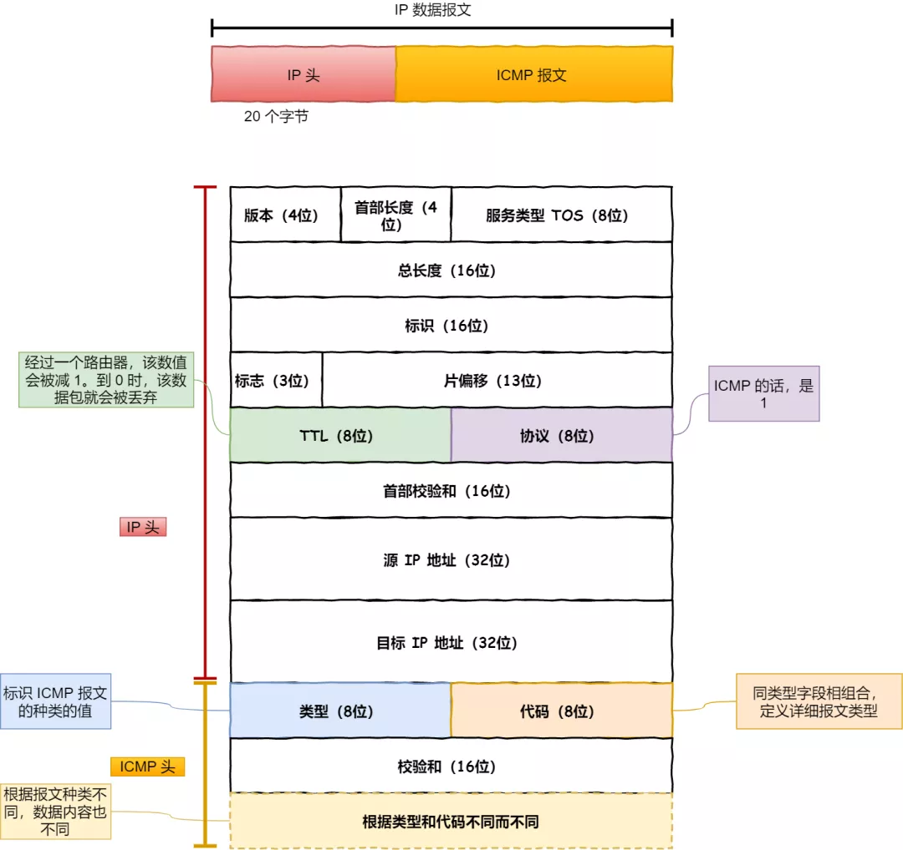

计算机网络相关知识，用作备忘录，以备查阅。

<!-- More -->

## 01 网络协议的分层结构

OSI 分层模型：

+ 自上而下分为应用层，表示层，会话层，传输层，网络层，数据链路层，物理层七层
+ 会话层，表示层，应用层称为资源子网(用来数据处理)，物理层，数据链路层，网络层称为通信子网(实现数据通信)，传输层是通信子网和资源子网的通信接口

五层模型：

+ 应用层：进行应用数据处理，封装后交给传输层
+ 传输层：对应用层数据进行封装，如 TCP 和 UDP 协议
+ 网络层：对传输层数据封装，如 IP 协议，其会提供寻址能力
+ 数据链路层：每台设备有唯一的 MAC 地址（通过 ARP 协议），为网络层提供链路级别传输的服务
+ 物理层：提供二进制传输的服务

网络包封装过程：

## 02 数据在网络中的封装

一个常见的问题：当在浏览器中输入网址后，到网页显示，其间发生的过程？

1. 浏览器对 URL 进行解析
2. 查询 URL 中的服务器对应的 IP 地址，客户端对本地 DNS 服务器采用递归查询，本地 DNS 服务器对 DNS 根服务器进行迭代查询
3. 浏览器通过调用 Socket 库，来委托操作系统的 TCP/IP 协议栈进行相应的数据操作
4. TCP 封装：通过 MSS 分割应用层数据，添加对应包头，主要包含源端口号，目的端口号，序号，确认序列，状态位（SYN，ACK，RST，FIN），在传输数据之前，需要先进行三次握手
5. IP 封装：主要包含源 IP 地址和目标 IP 地址，如果服务器存在多个网卡，需要通过网络和子网掩码来确认对应的 IP
6. MAC 封装：两点间的传输，主要包含发送方 MAC 地址和接收方目标 MAC 地址，协议类型主要有 IP 协议和 ARP 协议，ARP 协议会在以太网中用广播的方式来询问 IP 地址对应的 MAC 地址
7. 网卡：出口，将数字信息转换为电信号，网卡驱动从 IP 模块获取到包之后，会将其复制到网卡内的缓存区中，接着会其开头加上报头和起始帧分界符，在末尾加上用于检测错误的帧校验序列
8. 交换机：二层网络设备，其端口不包含 MAC 地址，根据 MAC 地址表查找 MAC 地址，然后将信号发送到相应的端口
9. 路由器：三层网络设备，路由器的各个端口具有 MAC 地址和 IP 地址，每次传输都需要修改 MAC 地址，但是源 IP 和目标 IP 始终是不会变动
10. 请求达到服务器端：解包，获取应用层数据，返回相应的响应报文
11. 响应到达客户端：解包出来响应的 html 数据交给浏览器进行渲染
12. 客户端断开连接：通过 TCP 四次握手（亦可通过 keep-alive 保持连接）

网络包报文图解：

## 03 ICMP 协议及其应用

ICMP 协议：

+ 功能：确认 IP 包是否成功送达目标地址、报告发送过程中 IP 包被废弃的原因和改善网络设置
+ 报文格式：被封装在 IP 包中，主要包含类型和代码，主要类型有
  + 查询报文类型：回送应答和回送请求
  + 差错报文类型：目标不可达，原点抑制消息，重定向消息，超时消息（TTL）

ping 命令的过程：

1. 构建回送请求数据包，此时类型为 8，序号为 1，同时插入发送时间
2. 系统根据回送请求数据包构建 IP 包，修改协议为 1，表示 ICMP 
3. 将 IP 包交给下层，将其发送到目标主机
4. 目标主机获取到回送请求数据包，构建对应的回送响应数据包，此时类型为 0，委托 IP 层发送给源主机

traceroute 命令实现（通过 UDP 或者 ICMP）：

+ 故意设置特殊的 TTL，来追踪去往目的地时沿途经过的路由器
+ 故意设置不分片，从而确定路径的 MTU

ICMP 报文格式：

## 04 HTTP 协议的变迁

HTTP 状态码：

+ 1xx：表示目前是协议的中间状态
+ 2xx：成功，如 200，204，206
+ 3xx：重定向，如 301，302，304
+ 4xx：客户端错误，如 400，403，404
+ 5xx：服务器错误，如 500，501，502，503

HTTP 首部常见字段：Host，Content-Length，Connection，Content-Type，Content-Encoding

HTTP 特性：

+ 优点：报文格式简单，灵活和易于扩展，应用广泛和跨平台
+ 不足：无状态双刃剑，明文传输不安全

HTTPS：在原来的 TCP 和 HTTP 层之间加入了 SSL/TLS 层，保证信息的加密传输

+ 混合加密保证了信息的机密性
+ 摘要算法用来实现完整性
+ 通过数字证书的方式保证服务器公钥的身份，解决冒充的风险

HTTP 协议的演变：

+ HTTP/1.1：增加了长连接，支持管道网络传输，但是可能会存在队头阻塞问题
+ HTTP/2：基于 HTTPS，保障安全性，头部压缩，二进制格式，支持数据流，多路复用，服务器推送
+ HTTP/3：在 HTTP/2.0 多路复用时，如果某个请求发生丢包，会触发 TCP 重传机制，而阻塞其他请求，HTTP/3 基于 UDP，上层的 QUIC 协议可以实现类似 TCP 的可靠性传输，同时 QUIC 合并了 TCP 三次握手和 TLS 四次握手

HTTP 各种协议栈：

## 05 TLS 协议

TLS 握手过程：

+ Client Hello：发送支持的密码套件列表，以及生成的随机数等
+ Server Hello 消息给出随机数和选择的密码套件，Server Certificate 消息给出服务器的数字证书，Server Hello Done 结束
+ 客户端进行证书验证，可能涉及到证书链，验证证书通过检查证书的签名
+ Change Cipher Key Exchange 消息加密 pre-master，将其发送到服务器；Change Cipher Spec 消息用于告诉服务端开始使用加密方式发送消息；Finishd 消息会把之前的消息做个摘要，防止篡改
+ 服务器发送 Change Cipher Spec 和 Encrypted Handshake Message 消息给客户端

RSA 算法：用于进行密钥协商，但是不支持前向保密，一旦服务端的私钥泄漏了，**过去**被第三方截获的所有 TLS 通讯密文都会被破解，可以改用 ECDHE 密钥协商算法。

HTTPS 建立连接的过程：

## 06 HTTPS 优化

HTTPS 性能损耗：

+ TLS 握手过程最长需要 2 RTT
+ 后续的应用数据需要使用对称加密密钥进行加密和解密

HTTPS 优化方式：

+ 硬件优化：选择支持 AES-NI 特性的 CPU，否则可以将对称加密算法改为 ChaCha20
+ 软件升级：升级 Linux 内核，更新 OpenSSL
+ 协议优化：
  + TLS 1.2 可以使用 ECDHE 密钥交换算法，客户端可以在 TLS 协议的第 3 次握手后，第 4 次握手前，可以发送加密的应用数据，减少了 1 个 RTT
  + TLS 1.3 把 Hello 和公钥交换这两个消息合并成了一个消息，于是这样就减少到只需 1 RTT 就能完成 TLS 握手
+ 证书优化：
  + 选择椭圆曲线（ECDSA）证书，相同安全强度下，其密钥长度比 RSA 短的多
  + 证书验证协议优化：CRL，OCSP（CA 服务器成为瓶颈），OCSP Stapling
+ 会话复用：不仅不具备前向安全，而且有重放攻击的风险，设置合理的过期时间
  + Session ID：双方缓存会话密钥，并用唯一的 Session ID 标识，服务器的内存压力增大
  + Session Ticket：服务器会加密会话密钥作为 Ticket 发给客户端，交给客户端缓存该 Ticket
  + Pre-shared Key：TLS 1.3 使用，原理和 Ticket 类似，只不过在重连时，客户端会把 Ticket 和 HTTP 请求一同发送给服务端

ECDHE 交换算法：

## 07 密钥交换算法

HTTPS 中常见的密钥交换算法有 RSA 和 ECDHE 算法，由于前者不支持前向安全性，ECDHE 被广泛使用。

ECDHE 算法发展：

+ DH 算法：基于离散对数
+ DHE 算法：让双方的私钥在每次密钥交换通信时，都是随机生成的、临时的
+ ECDHE 算法：在 DHE 算法的基础上利用了 ECC 椭圆曲线，用更少的计算量计算出公钥和会话密钥

DH 算法过程：

## 08 HTTP/1.1 优化

HTTP/1.1 优化方式：

+ 减少 TCP 握手时间：使用 KeepAlive 将短连接修改为长连接，注意其不同于 TCP 的 keepalive
+ 避免发送 HTTP 请求：使用缓存
+ 减少 HTTP 请求次数：减少重定向请求次数，合并多个请求，懒加载
+ 减少 HTTP 响应的数据大小：无损压缩和有损压缩

客户端缓存过程：

## 09 HTTP/2 带来的优化

HTTP/1.1 面临的问题：

+ HTTP 头部巨大并且存在重复
+ 并发连接有限，如 Chrome 浏览器最大并发数是 6
+ HTTP/1.x 协议导致的队头阻塞问题
+ 不支持服务器推送

HTTP/2 向下兼容 HTTP/1.1，其特性：

+ 头部压缩 HPACK 算法：由静态字典，动态字典和 Huffman 编码构成
+ 二进制帧：对于一条 HTTP 响应，划分成了两个帧（HEADER + DATA）来传输
+ 并发传输：多个 Stream 复用一条 TCP 连接，达到并发的效果，不同 Stream 的帧是可以乱序发送的，同一 Stream 内部的帧必须是严格有序的，还可以设置优先级
+ 服务器主动推送：如在客户端请求 index.html 的时候主动推送 index.js 和 index.css
+ TCP 协议导致的队头阻塞问题：TCP 需要等待前面的字节到达内核后才能将其传输到应用层

Stream 示意图：

## 10 HTTP/3 带来的优化

HTTP/2 缺点：

+ TCP 队头阻塞
+ TCP 和 TLS 的握手时延需要 3 RTT
+ 网络迁移后需要重新进行连接

HTTP/3 使用 UDP 传输协议，在应用层使用 QUIC 保证其可靠：

+ 无 TCP 产生的队头阻塞，如果 QUIC 连接中某个数据包丢失了，其只会阻塞该流，其他流不受影响
+ 更快的连接建立：QUIC 可以在 1 个 RTT 内同时完成建立连接与密钥协商，在第二次连接时，应用数据包可以和 QUIC 握手信息（连接信息 + TLS 信息）一起发送，达到 0-RTT 的效果
+ 只需要通过连接 ID 来标记通信的两个端点，不涉及 IP 地址，切换网络后不需要重新连接
+ HTTP/3 的 QPACK 通过两个特殊的单向流来同步双方的动态表，解决 HTTP/2 的 HPACK 队头阻塞问题
+ QUIC 使用 UDP 传输，大部分路由器在网络繁忙的时候，会丢 UDP 包

HTTP 不同协议的连接示意图：

## 11 TCP 三次握手和四次挥手

TCP 基本认识：

+ TCP 是面向连接的、可靠的、基于字节流的传输层通信协议
+ 头部格式包含：序列号，确认应答号，控制位
+ 最大 TCP 连接数：客户端 IP 数 × 客户端端口数，但实际受限于文件描述符和内存大小
+ TCP 和 UDP 区别：连接，服务对象，可靠性，拥塞控制和流量控制，首部开销，应用场景

TCP 三次握手：

+ 第三次握手是可以携带数据的，前两次握手是不可以携带数据的
+ 为什么是三次握手：
  + 三次握手才可以阻止历史重复连接的初始化
  + 三次握手才可以同步双方的初始序列号
  + 三次握手才可以避免资源浪费

+ IP 层也会进行分片，为啥 TCP 层还需要 MSS：如果只交给 IP 层分片，发生丢包后，TCP 会重传整个 TCP 报文，而如果 TCP 采用 MSS，则只需要传送 MSS 单位的数据即可
+ SYN 攻击：通过伪造 SYN 报文，占满服务器的 SYN 接收队列，使得服务器不能正常工作

TCP 四次挥手：

+ 需要四次挥手：客户端发送 FIN 报文表示客户端不再发送数据给服务器，服务器接收到 FIN 报文后，可能还需要发送响应数据给客户端，因此服务器 ACK 和 FIN 报文不会一起发送给客户端
+ 为什么需要 TIME_WAIT 状态：
  + 防止 TCP 重连后接收到旧的数据包
  + 保证最后的 ACK 能让被动关闭方接收，从而帮助其正常关闭
+ 为什么 TIME_WAIT 需要 2MSL：保证最后的 ACK 可能丢失时，依旧能够收到服务器的 FIN 报文
+ TIME_WAIT 过高的危害：消耗内存资源和端口资源

TCP 三次握手过程图：

TCP 四次挥手过程图：

## 12 TCP 相关机制

TCP 重传机制：

+ 超时重传：超时重传时间 RTO 的值应该略大于报文往返  RTT 的值，发生重传时，会加倍 RTO
+ 快速重传：收到三次相同 ACK，触发重传
+ SACK：在 TCP 头部选项中加入 SACK，告知发送方哪些数据已经被接收
+ D-SACK：使用了 SACK 来告诉发送方有哪些数据被重复接收了，让发送方知道是丢数据包还是 ACK 包

滑动窗口：

+ 改善 TCP 每发送一个数据包就进行一次确认应答的性能
+ 接收窗口和发送窗口构成，接收窗口的大小是约等于发送窗口的大小

流量控制：

+ 通过滑动窗口，可以让发送方根据接收方的实际接收能力控制发送的数据量
+ 如果窗口大小为 0 时，就会阻止发送方给接收方传递数据，只要 TCP 连接一方收到对方的零窗口通知，就启动持续计时器，如果超时，就会发送窗口探测报文
+ 糊涂窗口综合症：通过 TCP 发送少量数据给接收方，可以
  + 让接收方不通告小窗口给发送方
  + 让发送方避免发送小数据

拥塞控制：

+ 防止网络出现拥堵时，发送方还继续发送大量数据包，导致网络更加拥堵
+ 引入拥塞窗口后，发送窗口的值为 swnd = min(cwnd, rwnd)，只要网络没有拥塞，cwnd 就会增大，反之，cwnd 就会减少
+ 一旦发生了重传，就会认为网络出现了拥塞，拥塞算法如下
  + 慢启动：cwnd 呈现指数型增长
  + 拥塞避免：一旦到达慢启动门限，cwnd 呈现线性增长
  + 拥塞发生：
    + 超时重传：ssthresh = cwnd / 2，cwnd = 1，也就是进入慢启动
    + 快速重传 + 快速恢复：ssthresh = cwnd / 2，cwnd = ssthresh + 3，进入拥塞避免

发送窗口和接收窗口：

