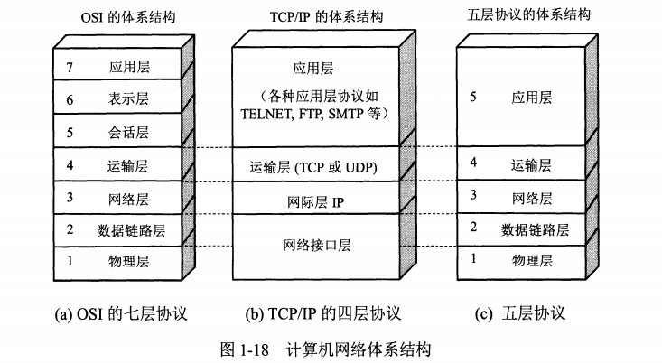

本文用于记录学习计算机网络中遇到的习题，和其备忘录相互补充。

<!-- More -->

1. 计算机网络的分层结构有哪几种？

   主要分为三种，OSI 七层结构，TCP/IP 四层结构和五层协议。对应的关系如下：

   

2. 当在浏览器中输入网址后，到网页显示，其间发生的过程？

   主要包括以下步骤：解析 URL，查询 DNS，创建套接字，TCP 封装，IP 封装，MAC 封装，通过网卡传输，经过交换机，路由器到达服务器，服务器进行解包，获取应用层数据，返回对应的响应报文，同样地，客户端在接收到响应报文后进行渲染，浏览器可能还会发送其他资源请求，最终通过 TCP 四次挥手断开连接（可以通过 http 协议的 keep-alive 保持连接，注意其不同于 TCP 中的 keepalive 保活）

3. 交换机工作原理？

   交换机是两层网络设备，其会维护一个 `MAC-端口` 表，对于到来的帧，其根据目的 MAC 选择对应的端口进行转发，若没有对应表项，则向所有端口转发（泛洪）。因此，其不会修改 MAC 地址。

4. 路由器工作原理？

   路由器是三层网络设备，主要作用是路由和转发。其会收集网络拓扑信息形成动态路由表，并且根据路由表进行转发，每次转发的时候必定会修改源 MAC 和目的 MAC 地址，可能会修改源 IP 地址（NAT）。

5. HTTP 协议中的 keep-alive 和 TCP 协议中的 keepalive 的区别？

   前者在传输完数据后并不会立即进行 TCP 四次挥手，而是将其保持一段时间，方便后续请求响应复用该 TCP 连接，减少处理过程中的 TCP 建立连接的时延；后者则是操作系统为了 TCP 连接保鲜，保活而设置的。

6. ICMP 协议存在的意义？

   确认 IP 包是否成功送达目标地址、报告发送过程中 IP 包被废弃的原因和改善网络设置，主要分为查询报文类型和差错报文类型。

7. ping 命令的过程？

   通过构建 ICMP 回送请求，构建 IP 包，通过网络设备发送到目标主机，目标主机构建 ICMP 回送响应，将其发送给源主机，实现了 ping 命令。

8. traceroute 命令实现的原理？

   可以通过 UDP 或者 ICMP 实现，但是原理都是通过递增 TTL 实现的。当 TTL 为 0 时，此时路由器就会直接丢弃网络包，ICMP 差错报文就会被发送到源主机上。

9. HTTP 状态码分类？

   + 1xx：表示目前是协议的中间状态
   + 2xx：成功，如 200，201，204，206
   + 3xx：重定向，如 301，302，304
   + 4xx：客户端错误，如 400，401，403，404
   + 5xx：服务器错误，如 500，501，502，503

10. HTTP 优缺点？

    报文格式简单，灵活和易于扩展，应用广泛和跨平台；无状态双刃剑，明文传输不安全。

11. HTTPS 出现的意义？

    主要是为了解决 HTTP 明文传输不安全的问题，通过在 TCP 层和 HTTP 层中间添加 SSL/TLS 层实现。其通过混合加密算法实现了信息的机密性，通过摘要算法实现信息完整性。

12. HTTP 协议的演进过程？

    + HTTP/1.1：增加了长连接，支持管道（pipeline）网络传输，但是可能会存在队头阻塞问题
    + HTTP/2：基于 HTTPS，保障安全性，头部压缩，二进制格式，支持数据流，多路复用，服务器推送
    + HTTP/3：在 HTTP/2.0 多路复用时，如果某个请求发生丢包，会触发 TCP 重传机制，而阻塞其他请求，HTTP/3 基于 UDP，上层的 QUIC 协议可以实现类似 TCP 的可靠性传输，同时 QUIC 合并了 TCP 三次握手和 TLS 四次握手

13. HTTP 不同版本是如何缓解/解决队头阻塞问题的？

    + HTTP/1.1：虽然支持流水线请求，但是依旧存在队头阻塞，管道只是解决了请求的队头阻塞，而不是响应的队头阻塞

      > 现代浏览器通常打开多个 TCP，不同 TCP 上处理不同的请求，但是该方案不高效，难扩展

    + HTTP/2：引入了数据流（stream）和帧（头部帧和数据帧）的概念，允许多路复用一个 TCP 连接，同时还支持控制请求的优先级，但是 HTTP/2 中仍然存在 TCP 的队头阻塞，TCP 并不知道上层的帧的概念，当发生丢包时，可能就会造成不同数据流之间的阻塞

    + HTTP/3：使用 QUIC 协议，其原生支持流的概念，这样在发生丢包时，只会阻塞丢包对应的流，其他流不受影响，但是会造成请求可能不再按照发送时的顺序到达浏览器

14. HTTPS/TLS 中的密钥交换算法有哪些，以及算法的优缺点？

    密钥交换算法有 RSA 和 ECDHE 算法，前者不支持前向安全性，因此 TLS 1.3 只推荐使用 ECDHE 算法，其优点支持前向安全性（每次会话产生新的私钥），采用椭圆曲线可以使用更少的计算量计算出公钥和会话密钥等。

15. TLS 握手过程需要几个随机数用于生成会话密钥？

    需要三个随机数，分别是看客户端随机数，服务端随机数以及客户端生成的 pre-master，注意，pre-master是通过公钥加密传输给服务端的，可以保持安全性。

16. TLS 四次握手的过程？

    + Client Hello：客户端随机数，密码套件，版本号等
    + Server Hello，Server Certificate，Server Hello Done：传输服务端随机数，服务端选择的密码套件，以及服务器的证书
    + Client Key Exchage，Change Cipher Spec，Finished：公钥加密 pre-master，传输给服务端；告诉服务端开始使用加密方式发送消息；对前面的信息做摘要，防止被篡改
    + Change Cipher Spec，Finished：告诉客户端使用加密方式发送消息；对前面信息做摘要，防止被篡改

17. HTTPS 建立连接的过程？

    TCP 三次握手，TLS 四次握手，之后发送加密消息即可。

18. HTTPS 优化方案？

    HTTPS 性能损耗主要在两方面，TLS 握手过程需要 2RTT，后续应用数据需要使用对称加密解密。

    + 协议优化：TLS 1.2 可以使用 ECDHE 密钥交换算法，可以在第三次握手后，第四次握手前，发送应用数据；配合上TLS 1.3，其可以将 Hello 和公钥交换合并成一个信息，因此减少到了只需要 1RTT 就能完成握手
    + 会话复用（不具备前向安全，需要设置过期时间）：Session ID，Session Ticket（加密会话密钥）
    + 硬件 & 软件：升级支持加密算法的硬件，或者升级 Linux 内核等

19. HTTP/1.1 有哪些优化方案？

    + 启用长连接 `Connection: Keep-Alive`，减少 TCP 握手时间
    + 使用缓存，避免发送 HTTP 请求
    + 减少 HTTP 请求次数，可以合并多个请求
    + 减少 HTTP 响应数据大小，可以使用压缩技术

20. 在 HTTP/1.1 中，客户端是如何进行缓存的，以及缓存过期的操作？

    客户端在没有缓存的时候，发送请求给服务端，得到响应后存储在本地作为缓存，同时还附带一个过期时间。若在过期事件之前访问相同的 URL，那么就直接从缓存里面获取数据，否则发送请求给服务端，但是此时附带 etag，服务器检查 etag 和服务端存储数据的值，若没有变化，将返回 304 响应，否则返回最新的数据即可。

21. 在 HTTP/2 中，相较于 HTTP/1.1，有哪些优化？

    + 1.1 版本中头部数据过大，2 中使用 HPACK 算法压缩
    + 2 中将 HTTP 响应划分为两个帧（HEADER + DATA）进行传输
    + 1.1 版本中长连接存在队头阻塞问题，2 中在 HTTP 层引入了流的概念，支持多路复用，用于缓解队头阻塞问题，同时还支持为不同的流增加权重，但是不能解决底层 TCP 头部阻塞问题
    + 2 中引入了服务器主动推送功能，如在客户端请求 index.html 时，主动推送对应的 css 和 js 文件

22. 在 HTTP/3 中，相较于 HTTP/2，有哪些优化？

    + 3 中使用 QUIC 协议，其天然支持流概念，因此其消除了 TCP 中存在的队头阻塞问题，指的是一个流丢包，不会影响并发流的传输
    + 3 中 QUIC 可以在 1 个 RTT 内完成建立连接和密钥协商，第二次连接时，应用数据包可以和 QUIC 握手信息（连接信息 + TLS 信息）一起发送，达到 0-RTT 的效果
    + 只需要通过连接 ID 来标记通信的两个端点，不涉及 IP 地址，切换网络后（弱网环境）不再需要重新连接

    > 由于采用 UDP 作为底层传输协议，大部分路由器在网络繁忙的时候，会丢 UDP 包

23. TCP 三次握手过程？

    首先客户端发送对应的 SYN 报文，附带自己的 client_isn，状态修改为 SYNC_SENT；接着服务端接收到客户端的 SYN 报文后，向其发送对应的 SYN + ACK 报文，ack = client + 1，同时附带自己的序列号 server_isn，状态从 LISTEN 变换为 SYN_RCVD；接着客户端收到服务端的 SYN 报文，可以发送对应的 ACK 报文给服务端，同时附带自己的应用数据，此时状态为 ESTABLISHED；同样地，服务端接收报文后，修改状态为 ESTABLISHED。

24. 为什么 TCP 采用三次握手，而不是两次握手？

    三次握手的目的是建立可靠的通信信道，即确定服务端和客户端的发送和接收能力。相较于两次握手，三次握手可以阻止历史重复连接的初始化，防止其造成资源浪费；另外，三次握手才能同步双方的初始序列号。

25. 在 IP 层同样会进行分片，为什么 TCP 层还规定了  MSS（Maximum Segment Size）？

    IP 层确实会分片，若 TCP 层不进行分段，那么但发生丢包时，TCP 层需要重新传输整个报文，而如果采用 MSS，那么只需要重新传输 MSS 单位的数据即可。

26. SYN 攻击原理？

    通过伪造 SYN 报文，占满服务器的 SYN 接收队列（半连接队列），使得服务器不能正常工作。

27. TCP 四次挥手的过程？

    客户端发送 FIN 报文给服务端（FIN_WAIT1），服务端接收到后指挥返回 ACK 报文（CLOSED_WAIT/FIN_WAIT2）；在服务器确认不需要发送任何数据给客户端时，此时其发送 FIN 报文给客户端（LAST_ACK），同样地，客户端需要发送对应的 ACK 给服务端（TIME_WAIT），同时为了避免发生丢包，客户端进入 TIME_WAIT 状态，在等待 2MSL 后，才能进入 CLOSED 状态；服务端收到 ACK 后进入 CLOSED 状态。

28. 为什么主动关闭方需要 TIME_WAIT 状态？

    防止具有相同四元组的 TCP 连接收到上次连接的旧数据包，保证最后的 ACK 能被被动关闭方接收到，帮助其正常关闭。

29. 为什么 TIME_WAIT 需要 2MSL（ Maximum Segment Life）？

     保证最后的 ACK 可能丢失时，依旧能够收到服务器重新发送的 FIN 报文，帮助服务器正确进行关闭。

30. TCP 超时重传和快速重传机制？

    超时重传：超时重传时间 RTO 的值应该略大于报文往返 RTT 的值，发生重传时，会加倍 RTO，重传时间较长

    快速重传：当接收端收到乱序的包时，此时就可以返回对前一个正确分组的 ACK，发送端收到三次相同 ACK，触发重传

31. 既然有了快速重传，为什么还需要 SACK？

    只使用快速重传时，会重新传输被丢包以及其后面的包，造成网络资源浪费，如果在收到乱序的包时，返回前一个正确分组的 ACK ，并且同时附带 SACK，表示哪些包收到了，这样的话，就可选选择性重传哪些真正丢包的数据，节省网络资源。

32. D-SACK（Duplicate SACK）又是什么？

    复用了 SACK 来告诉发送方有哪些数据被重复接收了，让发送方知道是丢数据包还是 ACK 包。

33. 接收端在收到 TCP 报文后会立即返回对应的 ACK 报文吗？

    不会，TCP 中存在延迟确认机制，在收到消息后会等待大约 200ms 再发送 ACK 报文，这样做可以减少 ACK 报文的数目，降低网络流量。另外，建立连接后，ACK 报文也可以携带应用层数据。

34. 为什么 TCP 需要引入发送窗口和接收窗口的概念？

    在传统 TCP 交互中，发送端在发送了一个包后，需要等待收到对应的 ACK 才能继续发送下一个包，数据传输缓慢，为此引入了窗口的概念。接收方在 ACK 报文中通知发送端自己的接收窗口大小，这样发送端可以采取流水线的方式发送接收窗口大小的数据包，并且等待 ACK 即可。通常发送窗口时约等于接收窗口的，因为滑动窗口大小是随着网络拥塞程度而改变的。

35. TCP 流量控制机制？

    借助滑动窗口机制，可以在发送 ACK 报文的同时附带上接收方的窗口大小，这样，发送方就可以根据接收方的窗口大小来发送数据，达到流量控制的效果。如果接收到窗口大小为 0 的报文，此时，就启动持续计时器，如果超时，就会发送窗口探测报文，用于探测接收方的接收窗口大小。

36. TCP 拥塞控制目的和过程？

    防止网络出现拥堵时，发送方还继续发送大量数据包，导致网络更加拥堵。引入拥塞窗口后，发送窗口的值为 swnd = min(cwnd, rwnd)，只要网络没有拥塞，cwnd 就会增大，反之，cwnd 就会减少。一旦发生重传，就会认为网络出现了拥塞，算法如下：

    + 慢启动：cwnd 呈现指数型增长
    + 拥塞避免：一旦到达慢启动门限 ssthresh（slow start threshold），cwnd 呈现线性增长
    + 拥塞发生：
      + 超时重传：ssthresh = cwnd / 2，cwnd = 1，也就是进入慢启动
      + 快速重传 + 快速恢复：ssthresh = cwnd / 2，cwnd = ssthresh + 3，进入快速恢复阶段，每收到重复 ACK 时，cwnd 加一，收到非重复 ACK 时，cwnd = ssthresh，并进入拥塞避免阶段

37. 网络层（IP 层）和链路层的区别？

    网络层用于实现两个主机间的通信，而链路层则用于实现两个直连设备间的通信。

38. IP 地址分类？

    + 传统分类：ABCDE 类地址，但是在同一网络下没有地址层次，不能很好的与现实网络匹配等问题
    + CIDR（Classless Inter-Domain Routing）：表示为 `a.b.c.d/x` ，前 x 位表示网络号，后 32 - x 位表示主机号，类似子网掩码

39. IP 分片和重组？

    当 IP 数据包超过 MTU 大小时，IP 数据包就会被分片，但是由于分片后的 IP 数据包只能在目标主机进行重组，一旦丢失某个分片数据，则需要重传整个 IP 数据包，造成网络资源的浪费，因此一般会规避 IP 分片。为此，TCP 层规定了 MSS，并且 MSS = MTU - IP header size - TCP header size，这样，IP 层就不会产生分片，重传时只需要传输对应的 TCP 包即可。

40. IPv4 和 IPv6 的区别？

    + 地址位数及其表示方法
    + IPv6 即使没有 DHCP 服务器也可以自动分配 IP 地址
    + IPv6 包头固定长度为 40 字节，提高了传输性能
    + IPv6 能够防止线路窃听，提高安全性

41. IP 层有哪些协议？

    + DNS：用于查询域名对应的 IP 地址
    + ARP：主机广播 ARP 请求，包里面包含了想要知道 MAC 地址的主机 IP 地址
    + DHCP：用于动态获取 IP 地址，省去配置 IP 信息繁琐过程
    + NAT：用于缓解 IPv4 地址紧缺问题，在内网想要外部通信时，路由器会转换修改源 IP 地址为共有 IP 地址，一般使用 NPAT，即同时修改源 IP 地址和源端口地址
    + ICMP：互联网控制报文协议，用于确认 IP 包是否达到，报告 IP 包废弃的原因等

42. 抓包发现 TCP 挥手是三次的原因？

    当服务器收到客户端的 FIN 时，如果之后没有数据发送给客户端，就会合并 ACK 和 FIN 报文。

43. TCP 三次握手过程中发生丢包时，会发生什么？

    + 第一次的 SYN 包丢失：RTO 指数增长，tcp_syn_retries
    + 第二次的 SYN + ACK 包丢失：RTO 指数增长，tcp_syn_retries，tcp_synack_retries
    + 第三次的 ACK 丢包：RTO 指数增长，tcp_synack_retries，tcp_retries2

44. TCP 四次挥手过程中发生丢包时，会发生什么？

    + 第一次的 FIN 包丢失：RTO 指数增长，tcp_orphan_retries
    + 第三次的 FIN 包丢失：RTO 指数增长，tcp_orphan_retries
    + 第二次或者第四次 ACK 包丢失：不会重传 ACK 包，而是重传 FIN 包

45. 什么是 TCP Fast Open，有什么优势与限制？

    第一次 TCP 连接时给客户端发送 Cookie，接下来的连接就可以直接带上 Cookie 和对应的 HTTP 请求，达到 1 RTT 的效果；只能用于 GET 请求，不能用于 POST 等其他请求，需要防止重放攻击。

46. TCP 延迟确认和 Nagle 算法原理，它们共同作用是什么？

    + 延迟确认：没有携带数据的 ACK，其有效负载也是很低的，通过等待一定时间再发送 ACK 给客户端，可以减少 ACK 的个数
    + Nagle 算法：没有已发送未确认报文时，立刻发送数据；存在未确认报文时，直到没有已发送未确认报文或数据长度达到 MSS 大小时，再发送数据

    共同作用是减轻网络负载，前者通过减少 ACK 报文实现，后者通过减少网络中的多个小数据块（合并成大数据块）实现。因此，不能同时使用延迟确认核 Nagle 算法，会造成额外的时延。

47. TCP 连接过程中的半连接队列和全连接队列指什么？

    当服务端受到客户端的 SYN 请求后，内核会把该连接存储到半连接队列；当服务端受到客户端的 ACK 响应后，内核会把连接从半连接队列移除，然后创建新的完全的连接，将其放入全连接队列中。

48. TCP 全连接队列溢出会发生什么现象，如何解决？

    全连接队列溢出后，后续请求报文或者被丢弃，或者被发送 RST 报文，由 tcp_abort_on_overflow 控制；

    可以考虑增加全连接队列长度：min(somaxconn, backlog)

49. TCP 半连接队列溢出会发生什么现象，如何解决？

    半连接队列溢出后，将不会有新的连接被建立，SYN 洪泛攻击就是基于此原理；

    可以考虑开启 tcp_syncookies 功能（将连接信息存储在 SYN + ACK 报文中，不需要半连接队列），增加半连接队列长度（max_qlen_log = min(min(somaxconn, backlog), max_syn_backlog) × 2）措施来缓解该情况。
