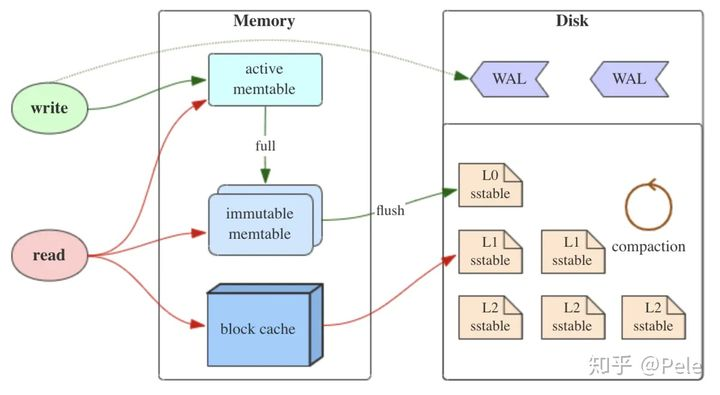

本文用于整理《高级数据库系统中》的知识点，以备查阅。

<!-- More -->

## 第一章 数据库系统概述

基本概念：数据，数据库，数据库模式，数据库管理系统，数据库系统。

Megatron 2000 数据库的问题：

+ 元组平铺在磁盘上，删除更新操作代价大
+ 低级的查询处理
+ 无缓冲区管理，IO 代价大
+ 无并发控制，不能保证数据库的一致性
+ 无索引，查询效率低
+ 无故障恢复

数据库模式设计不规范的话会带来很多问题，如数据冗余，更新异常，插入异常，删除异常，可以进行模式分解来解决该问题。

数据库语言类型：DDL，DML，DCL

## 第二章 关系数据库回顾

ANSI/SPARC 体系结构：三级模式结构和两级映像，确保了数据的独立性。

关系模型中的概念：超码，候选码，主码，替换码，外码

关系模型的三类完整性：

+ 实体完整性
+ 参照完整性，可为空
+ 用户自定义完整性

关系代数：并，交，差，笛卡尔积，选择，投影，联接（自然联接和等值连接区别），除

## 第三章 存储介质

存储器访问延迟：

磁盘结构：盘片，盘面，磁头，磁道，扇区，柱面，扇区之间存在间隙

磁盘块的存取时间：块是 DBMS 中的数据存取的最小单元，扇区是磁盘中数据存储的最小单元

+ 读块延迟：寻道时间 S（平均寻道数） + 旋转延迟 R + 传输时间 T，传输时间是标称传输速率和实际旋转传输时间的较小值
+ 写块延迟：同读块延迟，如果需要校验，则需要再次加上旋转时间和传输时间
+ 块修改：读块 + 写块

块地址包含如下信息：物理设备号，柱面号，盘面号，扇区号

磁盘存取优化：

+ 磁盘调度算法，如电梯调度
+ Random IO to Sequential IO
+ 预取缓冲：单缓冲区，双缓冲区

## 第四章 数据表示

数据项的表示：

记录的表示：

+ 固定格式变长记录：定长字段在前，变长字段在后

  

  

+ 可变格式变长记录：

  

记录在块中的组织：

+ 定长记录：使用 <块号,槽号> 表示记录地址

  

+ 变长记录：通过槽号获取到记录偏移量和对应的长度

  

记录的地址：

+ 逻辑地址：文件号 + 逻辑块地址 + 块内偏移
+ 物理地址：物理块地址 + 块内偏移

记录在块内的操作：

+ 插入：若记录无序，插入到任意块的空闲空间中；若记录有序，找到记录应该放置的块，如果没有空间，可以找邻近块中的空闲空间，或者使用溢出块
+ 删除：立即回收空间，使用删除标记

块在文件中的组织：链表式堆文件组织和目录式堆文件组织

## 第五章 缓冲区管理

缓冲区结构：

+ frame：一些连续的 page，通常等于 page 的大小，包含有 Dirty，PinCount 和 Latch 等信息
+ page：指代在内存中的数据块，操作系统操作文件的单元

>Block, on the other hand, is a group of sectors that the operating system can address;
>
>Page is similar to a block, but is the RAM equivalent. Blocks are usually the smallest unit of “cold” storage, while Pages are usually the smallest unit of in-memory storage.
>
>In some storage systems, chuck could be an abstraction layer above a block.

请求块操作和释放块操作：替换策略，pin 和 unpin，dirty

替换策略：

+ Belady’s （OPT）：理论上最佳的页面置换算法
+ LRU：替换最近最少被访问的 frame
+ LRU-k：考虑 frame 的访问频率，如果某个 frame 的访问次数达到了 K 次以上，则应当尽量不置换
+ 2Q：与 LRU-2 类似，不同之处在于访问 1 次的队列采用 FIFO，而不是 LRU
+ Second-Chance LRU：连续两次置换才能将 frame 替换出去
+ CLOCK：把 Second-Chance FIFO 组织成环形
+ CF-LRU：SSD 上置换算法，减少缓存对闪存的写次数

缓冲管理器：接受上层的 Frame 请求，对 buffer 进行操作和维护，同时向存储管理器发送 Page 相关请求

## 第六章 索引结构

顺序文件上的索引：

+ 密集索引：空间占用大
+ 稀疏索引：点查询性能不如密集索引
+ 多级索引：稀疏二级索引 + 一级索引，一级索引过大时可以再次索引，将二级索引放入内存
+ 主索引：记录在文件中按照主键存储，根据主键建立的主索引
+ 密集辅助索引：非主键上建立的索引，重复键值可以使用间接桶
+ 倒排索引：文档检索

B+ 树：通常 3 层，节点格式 n 个值，n + 1 个指针

+ 叶节点：至少 `(n + 1) / 2` 个指针指向记录，过半记录
+ 中间节点：至少 `(n + 2) / 2` 个指针指向子树，过半指针
+ 根节点：至少两个指针
+ 相关操作：查找，插入（递归分裂），删除（合并，删除叶节点最小值）

散列表：

+ 散列表：查找，插入，删除，注意溢出块的处理
+ 可扩展散列表：前 i 位用于区分桶，索引成倍增加，但对于某个桶来说，只有必要的时候才会分裂
+ 线性散列表：后 i 位用于区分桶，线性增加，只会放在 m 桶或者 $m - 2^{i-1}$ （去掉最高位）桶
  + 填充率：实际记录总数除以桶数（不包括溢出块数量）

多维索引：

+ R-Tree：使用矩形覆盖，建立索引
+ 网格文件：两个维度上建立索引
+ 分段哈希函数

## 第七章 查询优化

查询语句的执行流程：语法分析，逻辑计划生成，查询重写，物理计划生成，物理计划评价，执行物理计划

语法分析：构造语法分析树

逻辑计划生成：将语法分析数转换为代数表达式（逻辑计划）

查询重写：将初始逻辑计划按照转换规则转换，如选择连接顺序，优先选择，先投影后选择等，减少 IO 

查询计划代价估计：T(R)，S(R)，V(R, A)，B(R)

+ $W = R1 × R2$
+ $W = \sigma_{A\ op\ a}(R)$ 
+ $ W = R1\bowtie R2 $

物理操作符间参数传递：物化方式，流水线

## 第八章 连接算法

物理操作符：逻辑操作符的特定实现，如 TableScan，SortScan，IndexScan 等

连接操作的实现算法：嵌套循环连接，归并连接，索引连接，散列连接

连接算法代价分析：假设记录连续存储，未排序，B(R2) < B(R1)，R1 索引在内存中，buffer 大小 M

| Algorithm            | Cost                            | M                      |
| -------------------- | ------------------------------- | ---------------------- |
| Nested Loop Join     | (B(R2) / M-1) * (M-1 + B(R1))   | $\ge 2$                |
| Merge Join           | 5 (B(R1) + B(R2))               | $\sqrt{B(R1)}$         |
| Merge Join(Improved) | 3 (B(R1) + B(R2))               | $\sqrt{B(R1) + B(R2)}$ |
| Index Join           | B(R2) +  T(R2) × T(R1)/V(R1, C) |                        |
| Hash Join            | 3 (B(R1) + B(R2))               | $\sqrt{B(R2)} + 1$     |

连接顺序的选择：

+ 左右变元：较小的关系作为左变元（驱动表）（除了 index join）
+ 连接树：给定 n 个关系的连接树数目为 $T(n) * n!$ ，通常选择更加高效的左深树，T(n) 卡特兰数
+ 动态规划法选择连接顺序：代价函数 $f(n)=f(n-1) + T(n - 1)， n \ge 3$ 

## 第九章 日志和恢复

事务性质：ACID，通过事务可以确保数据库的一致性

事务原语操作：Input(X)，Output(X)，Read(X, t)，Write(X, t)

数据库故障：事务故障，介质故障，系统故障

数据库恢复策略：备份 + 日志（冗余）

Undo日志：立即更新，内存代价小

+ 在 x 被写到磁盘之前，对应该修改的日志记录必须已被写到磁盘上
+ 当事务的所有修改结果都已写入磁盘后，才将 <Commit,T> 日志记录写到磁盘上
+ 从日志尾部开始恢复那些未提交（没有执行 Commit，Abort）的事务

Redo日志：延迟更新，恢复代价小

+ 在 x 被写到磁盘之前，对应该修改的日志记录必须已被写到磁盘上
+ 在数据写回磁盘前先写 <Commit,T> 日志记录
+ 从日志首部开始恢复那些已经提交（执行了 Commit）的事务

Undo/Redo 日志：

+ 在 x 被写到磁盘之前，对应该修改的日志记录必须已被写到磁盘上
+ 在数据写回磁盘前先写 <Commit,T> 日志记录
+ 恢复时先 Undo ，再 Redo

检查点：在检查点时刻，所有的事务都已经执行完毕，所有的数据（日志，数据库数据）都已经被持久化完毕，且在检查点创建时，不允许处理新的事务（非静止检查点除外）

日志轮转技术：防止日志文件会占用大量的磁盘空间

## 第十章 并发控制

可串化调度（Serializable Schedule）：如果一个调度的结果与某一串行调度（Serial schedule）执行的结果等价，则称该调度是可串化调度，否则是不可串调度

冲突可串性：如果一个调度满足冲突可串性，则该调度是可串化调度，通常使用优先图来判断冲突可串性

视图可串性：弱于冲突可串性，但仍可保证调度的可串性，只需要确保读到的值相同，最后数据库状态一致即可，可以使用多重图判断，即对 `Wi(A) => Rj(A)`，若存在 Wk(A)，那么 Tk 要么在 Ti 前，要么在 Tj 后

2PL：

+ 对任何数据读写前，需要获得该数据上的锁，在释放一个锁之后，事务不再获得任何锁
+ 相关锁：X Lock，S Lock，U Lock，注意<S, U>是相容的，<U, S>是不相容的
+ 多粒度锁：在给节点 P 加锁的时候需要判断 P 的上层节点，下层节点和本节点，代价大
+ 意向锁：对任一结点 P 加 S(X) 锁，必须先对从根结点到 P 的路径上的所有结点加 IS(IX) 锁

死锁：

+ 死锁检测：超时，等待图
+ 死锁预防：按照锁对象的某种顺序加锁，使用时间戳（Wait-Die 和 Wound-Wait）

OCC：通常分为读阶段，有效性确认阶段，写阶段

## 第十一章 NoSQL 数据库

数据库变迁：SQL，NoSQL，NewSQL

NoSQL 特点：非关系型的，高扩展性，没有预先定义的模式，CAP

NoSQL 兴起的原因：

+ RDBMS 无法满足 Web 2.0 的需求（海量数据，高并发）
+ One size fits all 模式很难适用于截然不同的业务场景（OLTP，OLAP）
+ Web 2.0 网站系统通常不要求严格的数据库事务，不要求严格的读写一致性

混合架构：

+ 亚马逊对于购物篮这种数据，使用 KV 存储
+ 对于订单采用关系数据库
+ 对于历史记录，采用文档数据库

NoSQL 主要类型：键值数据库、列存储数据库、文档数据库和图数据库

NoSQL 分布式系统基础：CAP 和 BASE

LSM-Tree：

+ 将随机写操作转化为顺序写，支持高吞吐的写，适合写多读少的应用
+ 需要 Compaction，会带来写放大的问题和系统性能抖动
+ Compaction 策略：size-tiered 策略，leveled 策略

