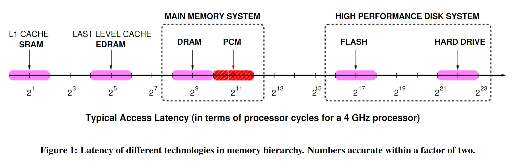
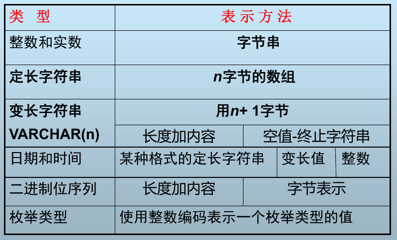
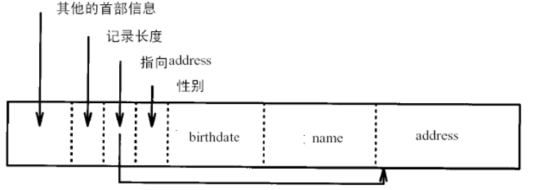
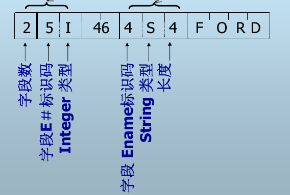
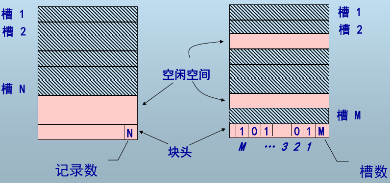
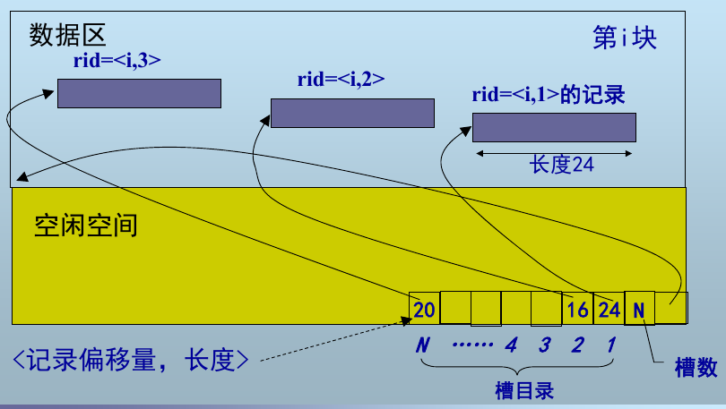

本文用于整理《高级数据库系统中》的知识点，以备查阅。

<!-- More -->

## 第一章 数据库系统概述

基本概念：数据，数据库，数据库模式，数据库管理系统，数据库系统。

Megatron 2000 数据库的问题：

+ 元组平铺在磁盘上，删除更新操作代价大
+ 低级的查询处理
+ 无缓冲区管理，IO 代价大
+ 无并发控制，不能保证数据库的一致性
+ 无索引，查询效率低
+ 无故障恢复

数据库模式设计不规范的话会带来很多问题，如数据冗余，更新异常，插入异常，删除异常，可以进行模式分解来解决该问题。

数据库语言类型：DDL，DML，DCL。

## 第二章 关系数据库回顾

ANSI/SPARC 体系结构：三级模式结构和两级映像，确保了数据的独立性。

关系模型中的概念：超码，候选码，主码，替换码，外码

关系模型的三类完整性：

+ 实体完整性
+ 参照完整性，可为空
+ 用户自定义完整性

关系代数：并，交，差，笛卡尔积，选择，投影，联接（自然联接和等值连接区别），除

## 第三章 存储介质

存储器访问延迟：

磁盘结构：盘片，盘面，磁头，磁道，扇区，柱面，扇区之间存在间隙

磁盘块的存取时间：块是 DBMS 中的数据存取的最小单元，扇区是磁盘中数据存储的最小单元

+ 读块延迟：寻道时间 S（平均寻道数） + 旋转延迟 R + 传输时间 T，传输时间是标称传输速率和实际旋转传输时间的较小值
+ 写块延迟：同读块延迟，如果需要校验，则需要再次加上旋转时间和传输时间
+ 块修改：读块 + 写块

块地址包含如下信息：物理设备号，柱面号，盘面号，扇区号

磁盘存取优化：

+ 磁盘调度算法，如电梯调度
+ Random IO to Sequential IO
+ 预取缓冲：单缓冲区，双缓冲区

## 第四章 数据表示

数据项的表示：

记录的表示：

+ 固定格式变长记录：定长字段在前，变长字段在后

  

  

+ 可变格式变长记录：

  

记录在块中的组织：

+ 定长记录：使用 <块号,槽号> 表示记录地址

  

+ 变长记录：通过槽号获取到记录偏移量和对应的长度

  

记录的地址：

+ 逻辑地址：文件号 + 逻辑块地址 + 块内偏移
+ 物理地址：物理块地址 + 块内偏移

记录在块内的操作：

+ 插入：若记录无序，插入到任意块的空闲空间中；若记录有序，找到记录应该放置的块，如果没有空间，可以找邻近块中的空闲空间，或者使用溢出块
+ 删除：立即回收空间，使用删除标记

块在文件中的组织：链表式堆文件组织和目录式堆文件组织

