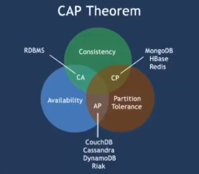
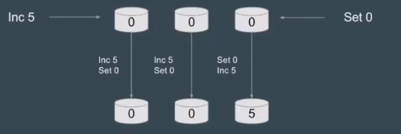
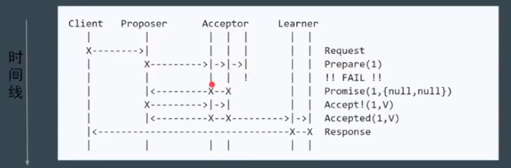
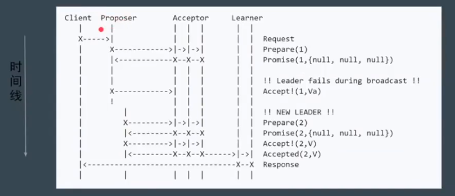
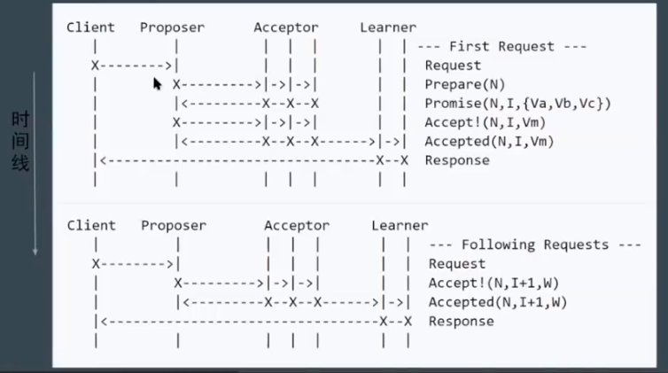
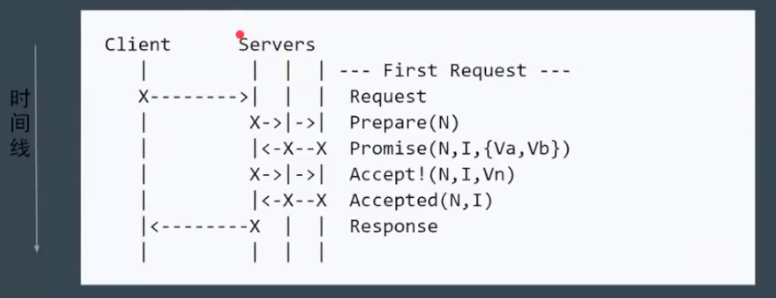
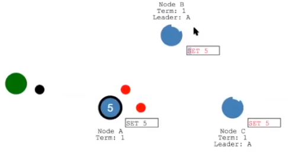
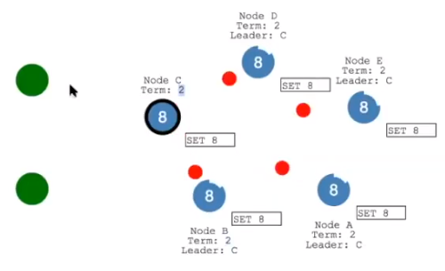

本文主要介绍分布式系统中的一致性算法，包括 Panxos，Raft 和 ZAB 算法。

<!-- More -->

## 一致性概念

CAP 理论：对于一个分布式系统，不能同时满足以下三点：

+ 一致性（Consistency）：在分布式系统中的所有数据备份，在同一时刻是否同样的值。
+ 可用性（Availability）：在集群中一部分节点故障后，集群整体是否还能响应客户端的读写请求。
+ 分区容错性（Partition Tolerance）：一个分布式系统里面，节点组成的网络本来应该是连通的。然而可能因为一些故障，使得有些节点之间不连通了，整个网络就分成了几块区域。数据就散布在了这些不连通的区域中。这就叫分区。当你一个数据项只在一个节点中保存，那么分区出现后，和这个节点不连通的部分就访问不到这个数据了。这时分区就是无法容忍的。提高分区容忍性的办法就是一个数据项复制到多个节点上，那么出现分区之后，这一数据项就可能分布到各个区里。容忍性就提高了。

一致性模型：

+ 弱一致性：如果能容忍后续的部分或者全部访问不到，则是弱一致性。
  + 最终一致性：如果经过一段时间后要求能访问到更新后的数据，则是最终一致性。如 DNS，Gossip（Cassandra 通信协议）。
+ 强一致性：对于关系型数据库，要求更新过的数据能被后续的访问都能看到，这是强一致性。如 Raft，ZAB，Paxos。

问题：数据不能存在单点上，分布式系统对 fault tolerence 的一般解决方案是 state machine replication。其实我们今天讨论的准确的说，应该是 state machine replication的共识( consensus)算法。paxos其实是一个共识算法。系统的最终一致性，不仅需要达成共识，还会取决于 clientl的行为。

强一致性算法：

+ 主从同步复制：

  1. Master 接受写请求
  2. Master 复制日志到 slave
  3. Master 等待，直到**所有** slave 返回成功信息

  问题：一个节点失败，Master阻塞，导致整个集群不可用，保证了一致性，可用性却大大降低。

+ 多数派：每次写都保证写入大于N/2个节点，每次读保证从大于N/2个节点中读。

  问题：并发环境下，无法保证系统正确性，顺序很重要

  

+ Paxos：分为 Basic Paxos，Multi Paxos 和 Fast Paxos。

Basic Paxos：

+ 角色分配：

  + Client：请求发起者。像是民众
  + Proposer：接受 Client 请求，向集群提出提议，像是议员
  + Acceptor（Voter）：提议投票和接受者，只有形成法定人数（Quorum，一般为多数派）时，提议才会最终被接受。像是国会。
  + Learner：提议接受者，backup。像是记录员

+ 阶段：

  1. Phase 1a：Prepare：proposer 提出一个提案，编号为 N，这个 N 大于之前提出提案的编号。
  2. Phase 1b：Promise：如果 N 大于此 acceptor 之前接受的提案编号，则接受，否则拒绝。
  3. Phase 2a：Accept：如果达到多数派，此时 proposer 发出accept 请求，请求包含编号N，以及提案内容。
  4. Phase 2b：Accepted：如果 N 大于此 acceptor 之前接受的提案编号，则接受，否则拒绝。

  

+ 问题：部分节点失败，但是达到了 Quoroms

  

+ 问题：Proposer 失败

  

+ 问题：活锁，指的是两个 Proposer 互相间隔发出提案，要求进行投票

  

  > 上图中的提案编号应该依次是 1,2,3,4...

  使用 Random Timeout 来解决上述问题。

+ 其他问题：难以实现，效率低（2 轮 RPC）

Multi Paxos：

+ 新概念：

  + Leader：唯一的 Proposer，所有请求都需要经过此 Leader

+ 流程：首先执行 Leader 竞选（Basic Paxos 阶段1），选择之后直接执行 Basic Paxos 阶段2即可

  

+ 简化：减少角色，Server 之一同时充当 Proposer 和 Acceptor

  

  第一阶段也是进行 Leader 选举，然后再 Propose 提案。

## 强一致性算法

Raft 算法：

+ 三个问题：

  + Leader Election：通过 Election Timeout 来转变为 Candidate，进行选举，选举成功后，Leader 会发送 heartbeat timeout，来表示自己存在与网络当中

    

    + 问题：Leader 宕机了，剩余节点继续执行 Leader Election
    + 问题：如果两个节点同时成为 Candidate，则通过 Random Timeout 来恢复

  + Log Replication：首先将 log entry 发送给 follower，之后如果获取到大多数投票后，就进行数据持久化，同时发送消息给客户端，最后发送信号给 follower，进行持久化

    

    

  + Safety：发生故障时或者网络发生分区后，如何进行数据恢复。

    

    在下面的网络分区由于没有达到多数派，数据不会被持久化，但是上面的分区却可以进行数据持久化，这也是为什么一般集群中节点的数量是奇数的原因。当网络被修复之后，由于上面一部分的 Term 大于下面一部分，下面一部分就会更改 Leader，同事新的 Leader 会发送数据包进行数据持久化操作。

    

+ 重新定义角色：

  + Leader：整个集群只有一个 Leader
  + Follower：只会接受来自 Leader 的请求
  + Candidate：准备竞选 Leader 的节点

+ 原理动画解释：http://thesecretlivesofdata.com/raft/

+ 场景测试：https://raft.github.io

ZAB：基本上和 Raft 相同，在一些名词的法上有些区别：如 ZAB 将某一个 leader 的周期称为 epoch,而 raft 则称之为term。实现上也有些许不同：如 raft 保证日志连续性，心跳方向为 leader 至 follower，而 ZAB 则相反。

