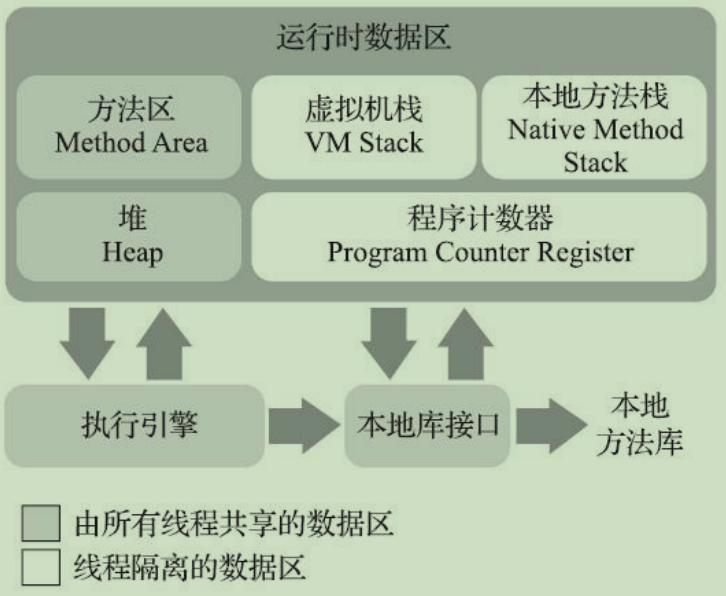
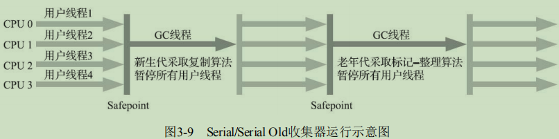
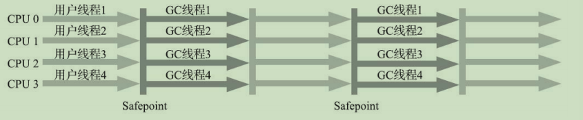
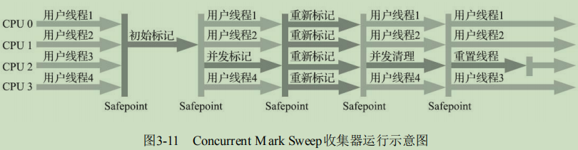
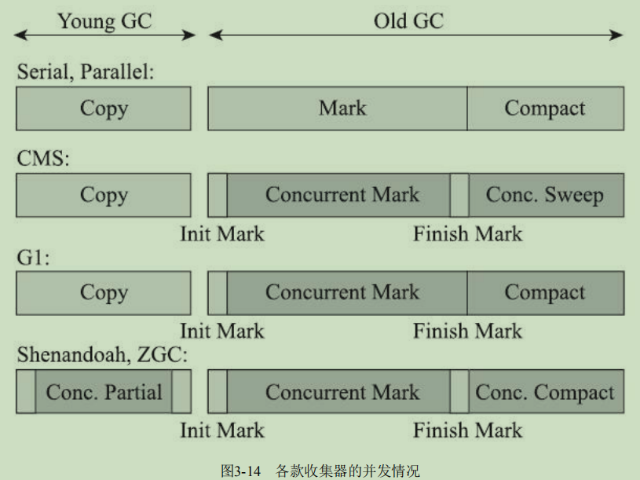
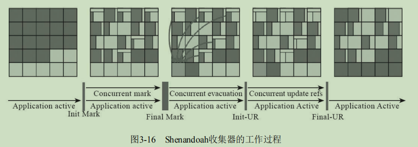
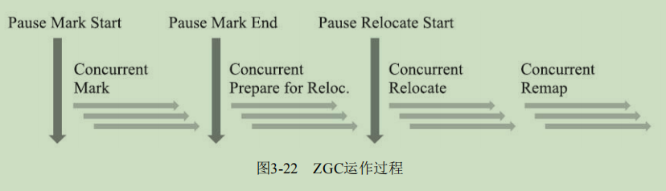

本文主要整理由周志明编写的《深入理解Java虚拟机》第三版书籍的整理笔记。

<!-- More -->

## 第二章 Java内存区域与内存溢出异常

运行时数据区域：

+ 程序计数器：通过改变其值来获取下一条需要执行的字节码指令。
+ 虚拟机栈：每个方法执行的时候会创建一个栈帧，用于存储局部变量，方法出口等信息。
+ 本地方法栈：同虚拟机栈，只不过本地方法栈是为本地方法服务的。
+ 堆：几乎所有的对象实例都会在这里面分配。
+ 方法区：用于存储已被虚拟机加载的类型信息、常量、静态变量、即时编译器编译后的代码缓存等数据。
  + 运行时常量池：是方法区的一部分，常量池表，Class文件中描述信息会放在此处。

直接内存：在JDK 1.4中新加入了NIO（New Input/Output）类，引入了一种基于通道（Channel）与缓冲区（Buffer）的I/O方式，它可以使用Native函数库直接分配堆外内存，然后通过一个存储在Java堆里面的DirectByteBuffer对象作为这块内存的引用进行操作。

对象的创建：当Java虚拟机遇到一条字节码new指令时，首先将去检查这个指令的参数是否能在常量池中定位到一个类的符号引用，并且检查这个符号引用代表的类是否已被加载、解析和初始化过。如果没有，那必须先执行相应的类加载过程。在类加载检查通过后，接下来虚拟机将为新生对象分配内存。分配方式有指针碰撞和空闲列表两种方式。接下来，就需要执行构造函数了，也就是Class文件中的`<init>()`方法。

对象的内存布局：对象在堆里面的内存布局分为三部分：对象头，实例数据，对齐填充

+ 对象头：第一类用于存储对象自身的运行时数据，如哈希码，GC分代年龄等，第二部分是类型指针，用于确定该对象是那个类的实例。
+ 实例数据：从父类继承和该类中定义的数据。
+ 对齐填充：用于保证对象是8字节对齐的。

对象的访问定位：主流的方式有两种，使用句柄或者使用直接指针，HotSpot虚拟机使用直接指针方式。

+ 句柄：好处就是reference中存储的是稳定句柄地址，在对象被移动（垃圾收集时移动对象是非常普遍的行为）时只会改变句柄中的实例数据指针，而referrence不用修改

  

+ 直接指针：好处就是速度更快，它节省了一次指针定位的时间开销

  

## 第三章 垃圾收集器与内存分配策略

引用计数算法：在对象中添加一个引用计数器，每当有一个地方引用它时，计数器值就加一；当引用失效时，计数器值就减一；任何时刻计数器为零的对象就是不可能再被使用的。该方法不能检测循环引用。

可达性分析算法：基本思路就是通过一系列称为“GC Roots”的根对象作为起始节点集，从这些节点开始，根据引用关系向下搜索，搜索过程所走过的路径称为“引用链”（Reference Chain），如果某个对象到GC Roots间没有任何引用链相连，或者用图论的话来说就是从GC Roots到这个对象不可达时，则证明此对象是不可能再被使用的。在Java技术体系中，GC Roots对象有：

+ 虚拟机栈中引用的对象
+ 在方法区中类静态属性引用的对象，常量引用的对象
+ 同步锁持有的对象

引用类型：在JDK 1.2版之后，Java对引用的概念进行了扩充，有以下几类

+ 强引用：最传统的“引用”的定义，是指在程序代码之中普遍存在的引用赋值
+ 软引用：来描述一些还有用，但非必须的对象。只被软引用关联着的对象，在系统将要发生内存溢出异常前，会把这些对象列进回收范围之中进行第二次回收
+ 弱引用：也是用来描述那些非必须对象，但是它的强度比软引用更弱一些，被弱引用关联的对象只能生存到下一次垃圾收集发生为止
+ 虚引用：最弱的一种引用关系，一个对象是否有虚引用的存在，完全不会对其生存时间构成影响，也无法通过虚引用来取得一个对象实例，为一个对象设置虚引用关联的唯一目的只是为了能在这个对象被收集器回收时收到一个系统通知

对象自我拯救：即使在可达性分析算法中判定为不可达的对象，这时候它们暂时还处于“缓刑”阶段，要真正宣告一个对象死亡，至少要经历两次标记过程：如果对象在进行可达性分析后发现没有与GC Roots相连接的引用链，那它将会被第一次标记，随后进行一次筛选，筛选的条件是此对象是否有必要执行finalize()方法。假如对象没有覆盖finalize()方法，或者finalize()方法已经被虚拟机调用过，那么虚拟机将这两种情况都视为“没有必要执行”。如果这个对象被判定为确有必要执行finalize()方法，那么该对象将会被放置在一个名为F-Queue的队列之中，并在稍后由一条由虚拟机自动建立的、低调度优先级的Finalizer线程去执行它们的finalize()方法。finalize()方法是对象逃脱死亡命运的最后一次机会，稍后收集器将对F-Queue中的对象进行第二次小规模的标记，如果对象要在finalize()中成功拯救自己，即只要重新与引用链上的任何一个对象建立关联即可，譬如把自己（this关键字）赋值给某个类变量或者对象的成员变量，那在第二次标记时它将被移出“即将回收”的集合。

回收方法区：在Java堆中，尤其是在新生代中，对常规应用进行一次垃圾收集通常可以回收70%至99%的内存空间，相比之下，方法区回收囿于苛刻的判定条件，其区域垃圾收集的回收成果往往远低于此。方法区的垃圾收集主要回收两部分内容：废弃的常量和不再使用的类型。

分代收集理论：建立在三个假说之上：

1. 弱分代假说：绝大多数对象都是朝生夕灭的。
2. 强分代假说：熬过越多次垃圾收集过程的对象就越难以消亡。
3. 跨代引用假说：跨代引用相对于同代引用来说仅占极少数。

前两个假说表明如果一个区域中大多数对象都是朝生夕灭，难以熬过垃圾收集过程的话，那么把它们集中放在一起，每次回收时只关注如何保留少量存活而不是去标记那些大量将要被回收的对象，就能以较低代价回收到大量的空间；如果剩下的都是难以消亡的对象，那把它们集中放在一块，虚拟机便可以使用较低的频率来回收这个区域，这就同时兼顾了垃圾收集的时间开销和内存的空间有效利用；第三点表明我们就不应再为了少量的跨代引用去扫描整个老年代，也不必浪费空间专门记录每一个对象是否存在及存在哪些跨代引用。

标记-清除算法：首先标记出所有需要回收的对象，在标记完成后，统一回收掉所有被标记的对象。缺点：第一个是执行效率不稳定，如果Java堆中包含大量对象，而且其中大部分是需要被回收的，这时必须进行大量标记和清除的动作，导致标记和清除两个过程的执行效率都随对象数量增长而降低；第二个是内存空间的碎片化问题，标记、清除之后会产生大量不连续的内存碎片，空间碎片太多可能会导致当以后在程序运行过程中需要分配较大对象时无法找到足够的连续内存而不得不提前触发另一次垃圾收集动作。

标记-复制算法：将可用内存按容量划分为大小相等的两块，每次只使用其中的一块。当这一块的内存用完了，就将还存活着的对象复制到另外一块上面，然后再把已使用过的内存空间一次清理掉。如果内存中多数对象都是存活的，这种算法将会产生大量的内存间复制的开销，但对于多数对象都是可回收的情况，算法需要复制的就是占少数的存活对象，而且每次都是针对整个半区进行内存回收，分配内存时也就不用考虑有空间碎片的复杂情况，只要移动堆顶指针，按顺序分配即可。这样实现简单，运行高效，不过其缺陷也显而易见，这种复制回收算法的代价是将可用内存缩小为了原来的一半，空间浪费未免太多了一点。

> 新生代存在朝生夕灭现象，存活者大概只有 10% 左右，内存空间比可以分为 8 ：1

标记-整理算法：其中的标记过程仍然与“标记-清除”算法一样，但后续步骤不是直接对可回收对象进行清理，而是让所有存活的对象都向内存空间一端移动，然后直接清理掉边界以外的内存。标记-清除算法与标记-整理算法的本质差异在于前者是一种非移动式的回收算法，而后者是移动式的。是否移动回收后的存活对象是一项优缺点并存的风险决策：在老年代这种每次回收都有大量对象存活区域，移动存活对象并更新所有引用这些对象的地方将会是一种极为负重的操作，而且这种对象移动操作必须全程暂停用户应用程序才能进行；而不移动对象的时候又存在空间碎片化问题。

经典垃圾收集器：

+ Serial 收集器：是一个单线程工作的收集器，但它的“单线程”的意义并不仅仅是说明它只会使用一个处理器或一条收集线程去完成垃圾收集工作，更重要的是强调在它进行垃圾收集时，必须暂停其他所有工作线程，直到它收集结束。优点是简单，内存消耗低；缺点是需要暂停其他工作线程。

  

+ ParNew 收集器：实质上是Serial收集器的多线程并行版本。

  

+ Parallel Scavenge收集器：也是一款新生代收集器，它同样是基于标记-复制算法实现的收集器，也是能够并行收集的多线程收集器，它的特点在于它的关注点与其他收集器不同，CMS等收集器的关注点是尽可能地缩短垃圾收集时用户线程的停顿时间，而Parallel Scavenge收集器的目标则是达到一个可控制的吞吐量。

+ Serial Old收集器：Serial收集器的老年代版本，它同样是一个单线程收集器，使用标记-整理算法。

  

+ Parallel Old收集器：是Parallel Scavenge收集器的老年代版本，支持多线程并发收集，基于标记-整理算法实现。吞吐量优先收集器。

  

+ CMS（Concurrent Mark Sweep）收集器：是一种以获取最短回收停顿时间为目标的收集器。很大一部分Java应用基于 B/S 实现，这类应用通常都会较为关注服务的响应速度，希望系统停顿时间尽可能短，以给用户带来良好的交互体验。CMS收集器就非常符合这类应用的需求。收集过程如下：

  1. 初始标记：记仅仅只是标记一下GC Roots能直接关联到的对象，速度很快；Stop the World
  2. 并发标记：是从GC Roots的直接关联对象开始遍历整个对象图的过程，这个过程耗时较长但是不需要停顿用户线程，可以与垃圾收集线程一起并发运行；
  3. 重新标记：则是为了修正并发标记期间，因用户程序继续运作而导致标记产生变动的那一部分对象的标记记录；Stop the World
  4. 并发清除：清理删除掉标记阶段判断的已经死亡的对象，由于不需要移动存活对象，所以这个阶段也是可以与用户线程同时并发的。

  

  优点：并发收集，低停顿；缺点：对处理器资源敏感（并发阶段会导致应用程序变慢，降低总吞吐量），无法处理“浮动垃圾”（并发清理阶段，用户线程是还在继续运行的，程序在运行自然就还会伴随有新的垃圾对象不断产生），基于标记清除，空间碎片化问题严重。

+ Garbage First收集器：简称 G1 收集器，在G1收集器出现之前的所有其他收集器，包括CMS在内，垃圾收集的目标范围要么是整个新生代（Minor GC），要么就是整个老年代（Major GC），再要么就是整个Java堆（Full GC）。而G1跳出了这个樊笼，它可以面向堆内存任何部分来组成回收集（Collection Set，一般简称CSet）进行回收，衡量标准不再是它属于哪个分代，而是哪块内存中存放的垃圾数量最多，回收收益最大，这就是G1收集器的Mixed GC模式。G1不再坚持固定大小以及固定数量的分代区域划分，而是把连续的Java堆划分为多个大小相等的独立区域（Region），每一个Region都可以根据需要，扮演新生代的Eden空间、Survivor空间，或者老年代空间。收集器能够对扮演不同角色的Region采用不同的策略去处理，从而获取更好的收集效果。G1收集器过程：

  1. 初始标记：仅仅只是标记一下GC Roots能直接关联到的对象，需要短暂停顿
  2. 并发标记：从GC Root开始对堆中对象进行可达性分析，递归扫描整个堆里的对象图，找出要回收的对象，这阶段耗时较长，但可与用户程序并发执行。
  3. 最终标记：对用户线程做另一个短暂的暂停，用于处理并发阶段结束后仍遗留下来的最后那少量的SATB记录。
  4. 筛选回收：负责更新Region的统计数据，对各个Region的回收价值和成本进行排序，根据用户所期望的停顿时间来制定回收计划，可以自由选择任意多个Region构成回收集，然后把决定回收的那一部分Region的存活对象复制到空的Region中，再清理掉整个旧Region的全部空间。这里的操作涉及存活对象的移动，是必须暂停用户线程，由多条收集器线程并行完成的。

  

低延迟垃圾收集器：HotSpot的垃圾收集器从Serial发展到CMS再到G1，经历了逾二十年时间，经过了数百上千万台服务器上的应用实践，已经被淬炼得相当成熟了，不过它们距离“完美”还是很遥远。衡量垃圾收集器的三项最重要的指标是：内存占用（Footprint）、吞吐量（Throughput）和延迟（Latency），三者共同构成了一个“不可能三角”。图3-14中浅色阶段表示必须挂起用户线程，深色表示收集器线程与用户线程是并发工作的。

+ Shenandoah收集器：Shenandoah作为第一款不由Oracle（包括以前的Sun）公司的虚拟机团队所领导开发的HotSpot垃圾收集器，不可避免地会受到一些来自“官方”的排挤。Shenandoah反而更像是G1的下一代继承者，它们两者有着相似的堆内存布局，在初始标记、并发标记等许多阶段的处理思路上都高度一致，甚至还直接共享了一部分实现代码。虽然Shenandoah也是使用基于Region的堆内存布局，同样有着用于存放大对象的Humongous Region，默认的回收策略也同样是优先处理回收价值最大的Region……但在管理堆内存方面，它与G1至少有三个明显的不同之处，最重要的当然是支持并发的整理算法，G1的回收阶段是可以多线程并行的，但却不能与用户线程并发；其次，Shenandoah（目前）是默认不使用分代收集的；Shenandoah摒弃了在G1中耗费大量内存和计算资源去维护的记忆集，改用名为“连接矩阵”（Connection Matrix）的全局数据结构来记录跨Region的引用关系，降低了处理跨代指针时的记忆集维护消耗。大致上可以分为九个阶段：初始标记，并发标记，最终标记，并发清理，并发回收，初始引用更新，最终引用更新，并发清理。

  

  最重要三个阶段是并发标记、并发回收、并发引用更新。

+ ZCG收集器：Z Garbage Collector，是由Oracle公司研发的。ZGC和Shenandoah的目标是高度相似的，都希望在尽可能对吞吐量影响不太大的前提下[2]，实现在任意堆内存大小下都可以把垃圾收集的停顿时间限制在十毫秒以内的低延迟。ZGC也采用基于Region的堆内存布局，但与它们不同的是，ZGC的Region（在一些官方资料中将它称为Page或者ZPage，本章为行文一致继续称为Region）具有动态性——动态创建和销毁，以及动态的区域容量大小。Shenandoah使用转发指针和读屏障来实现并发整理，ZGC虽然同样用到了读屏障，但用的却是一条与Shenandoah完全不同，更加复杂精巧的解题思路：染色指针技术。分为四个阶段：并发标记，并发预备重分配，并发重分配，并发重映射。

  

Epsilon收集器：这是一款以不能够进行垃圾收集为“卖点”的垃圾收集器，要负责堆的管理与布局、对象的分配、与解释器的协作、与编译器的协作、与监控子系统协作等职责，其中至少堆的管理和对象的分配这部分功能是Java虚拟机能够正常运作的必要支持，是一个最小化功能的垃圾收集器也必须实现的内容。对弈比较小的应用有用武之地。

## 第四章 虚拟机性能监控、故障处理工具

基础故障处理工具：

+ jps：虚拟机进程状况工具，可以列出正在运行的虚拟机进程，并显示虚拟机执行主类（Main Class，main()函数所在的类）名称以及这些进程的本地虚拟机唯一ID（LVMID，Local Virtual Machine Identifier）。
+ jstat（JVM Statistics Monitoring Tool）：用于监视虚拟机各种运行状态信息的命令行工具，可以显示本地或者远程[1]虚拟机进程中的类加载、内存、垃圾收集、即时编译等运行时数据。
+ jinfo（Configuration Info for Java）：实时查看和调整虚拟机各项参数。
+ jmap（Memory Map for Java）：用于生成堆转储快照（一般称为heapdump或dump文件）。
+ jhat（JVM Heap Analysis Tool）：与jmap搭配使用，来分析jmap生成的堆转储快照。
+ jstack（Stack Trace for Java）：用于生成虚拟机当前时刻的线程快照（一般称为threaddump或者 javacore文件），线程快照就是当前虚拟机内每一条线程正在执行的方法堆栈的集合，生成线程快照的目的通常是定位线程出现长时间停顿的原因，如线程间死锁、死循环。

可视化故障处理工具：

+ JHSDB：基于服务性代理的调试工具
+ JConsole：Java监视与管理控制台
+ VisualVM：多合-故障处理工具，是功能最强大的运行监视和故障处理程序之一
+ JMC（Java Mission Control）：可持续在线的监控工具

